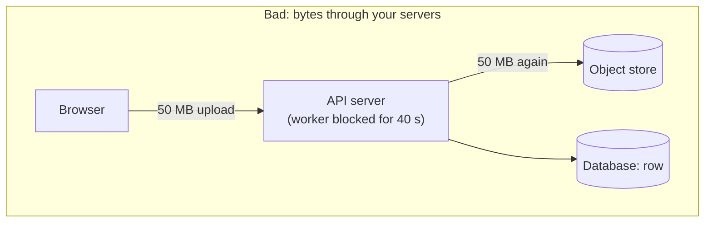
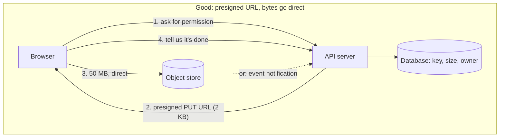

# Object storage, S3-style

## 1. What this is, and why they ask it

Object storage is where the big things go. Images, videos, backups, logs, model weights, uploaded documents —
anything that is a whole item you write once and read many times.

It is not a file system, and the difference is the lesson. There are no folders. There is no way to change the
middle of a stored object. There is no way to append. You give it a name and a blob of bytes, and later you ask
for that name and get those bytes back. That is the entire interface, and the restrictions are exactly what
let it be enormously durable and enormously cheap.

They ask this because "where do the uploaded images actually go?" comes up in almost every design that touches
media, and because the answer distinguishes people who have shipped something from people who have not. The
naive answer — put them in the database — has a specific set of consequences you can quantify, and being able
to do that arithmetic is the point.

It also carries the two most useful practical patterns in web architecture: **presigned URLs**, so uploads and
downloads never pass through your servers, and **a CDN in front**, so reads never reach the store at all.

By the end of this lesson you can say what object storage is and is not, quote durability and cost numbers,
design an upload path that does not melt your API servers, choose a storage class from an access pattern, and
answer the "images in the database?" question with numbers rather than opinion.

---

## 2. The story

The cloakroom at Kalyan station is a green-painted room to the left of platform one, and Bhaskar has run it
since 2014.

The system has not changed in that time and it does not need to.

You bring a bag. He looks at it, ties a tag to the handle with a number on it, tears off the matching half and
hands it to you, and puts your bag somewhere. Then you go away and do whatever you came to do, and when you
come back you give him the half-tag and he gives you the bag.

That is the whole thing. He does not ask what is in the bag. He does not open it. He would not know a laptop
from a lunchbox and it makes no difference to him.

The rule that surprises people, usually students, is that you cannot get at part of your bag.

A boy came in one afternoon last month, about twenty minutes after leaving his rucksack, and said he needed
the charger out of the front pocket. Bhaskar brought the whole bag out to the counter, the boy opened the
pocket, took the charger, zipped it up, and Bhaskar tagged it again and took it back in. Two minutes. Perfectly
possible, and note what actually happened: the entire bag came out and went back in. There is no arrangement
under which the charger alone comes out and the bag stays where it is.

The other thing is the numbering, and this is the part that took Bhaskar a while to explain to the new boy who
started in April.

The tags say things like `P1-14-233`. The new boy assumed that meant platform one, rack fourteen, slot
two-thirty-three, and that he could find any bag by walking to that place. He was wrong. It is just a number.
It is a long name that happens to have dashes in it, and where the bag actually sits is entirely up to
Bhaskar and depends on how full the room was that morning. Some days he puts them on the high shelf, some days
on the floor by the window. The tag identifies the bag. It does not describe a location.

The new boy found this very hard to accept for about a week, because the tags look so much like addresses.

What the room is genuinely excellent at is not losing things. In eleven years Bhaskar has lost one bag, in
2018, and that was because a man took the wrong one and brought it back the next day. The room is boring, the
rules are few, and nothing has ever gone missing overnight.

---

## 3. The idea in plain English

Bhaskar's cloakroom is object storage, including the parts that annoy people.

**An object is a whole thing with a name.** You store bytes under a **key** and later fetch them by that key.
The store does not look inside. A JPEG, a video, a database backup, a 2 GB log file — all the same to it.

**A bucket is a namespace.** All the keys in one bucket must be unique. That is the whole of the organisation.

**There are no folders.** The key `photos/2026/mumbai/img_4471.jpg` looks like a path, and it is not one — it
is a single string that happens to contain slashes. **The namespace is flat.** The console draws folders by
splitting on `/`, and the store itself has no concept of them. That is the tag that looks like an address and
is not, and it has real consequences: "rename a folder" is not an operation, it is a copy of every object with
a new key followed by a delete of every old one.

**You cannot modify part of an object.** No seeking to byte 4,000 and writing. No appending a line. To change
anything you upload the whole object again under the same key, which **replaces** it. That is the boy and his
charger: the whole bag comes out and the whole bag goes back.

**This is why it is not a file system, and why it is so durable.** A file system has to support random writes,
locks, permissions per directory, and metadata that changes constantly. Object storage supports "put a whole
thing" and "get a whole thing", and a system that only does those two operations can replicate aggressively,
never worry about partial writes, and be spread across many machines without coordination.

**Reads are cheap and enormous in parallel.** Thousands of clients can fetch the same object at once; the store
does not care. This is the property that makes it the right home for anything users download.

**Durability is the headline number, and it is worth knowing.** S3 advertises eleven nines — 99.999999999% —
of durability for an object over a year. That means if you store ten million objects you would expect to lose
one every ten thousand years. It is achieved by writing every object to multiple devices across multiple
physically separated buildings before acknowledging the write.

**Availability is a different and much lower number**: about 99.99%, which is roughly an hour a year of not
being able to reach it. **Durable means the data is not lost. Available means you can get it right now.**
People conflate them constantly and they are different guarantees with different numbers.

**And latency is the honest weakness.** A first-byte read is tens of milliseconds, not the sub-millisecond of
a database or a cache. It is built for throughput and durability, not for responsiveness. That is why anything
user-facing sits behind a **CDN**, which you met on [day 70](../day-070-min-stack/README.md) — the object store
is the origin and almost no read reaches it.

**The two patterns that make it work in a web architecture:**

**Presigned URLs.** Your server generates a URL that grants permission to write (or read) one specific key for
a short time, and hands it to the browser. The browser uploads **directly to the store**. The bytes never
touch your API servers. Without this, a 50 MB video upload occupies one of your web workers for the whole
upload, and a hundred concurrent uploads is your entire fleet.

**Store the reference, not the bytes.** The database holds a row with the object's key, its size, its content
type and who owns it. The bytes are in the store. The database is for things you query; the store is for things
you fetch. **Mixing those two up is the mistake this lesson exists to prevent.**

---

## 4. The picture

The upload path, done badly and done properly:





**What to notice.** In the good version your server handles two tiny requests and never sees a byte of the
file. One web worker can serve thousands of uploads a minute instead of one at a time. The dotted arrow is the
more robust variant: the store itself notifies you when the upload completes, so a browser that uploads
successfully and then closes does not leave you with an object nobody knows about.

The read path, and where the traffic actually goes:

```
  100,000 requests for the same image

  WITHOUT a CDN
    100,000 x GET from the object store
    100,000 x $0.0004/1000 = $0.04 in requests
    100,000 x 200 KB = 20 GB egress x $0.09/GB = $1.80

  WITH a CDN (95% hit rate)
    5,000 GETs reach the store
    95,000 served from cache edges
    egress from the store: 1 GB instead of 20
    -> roughly 20x cheaper, and 10x faster for the user
```

**What to notice.** The saving is on egress, not on storage. Object storage is cheap to keep things in and
expensive to move things out of, and that asymmetry drives most of the architecture around it.

And the thing that is not a folder:

```
  keys in the bucket:

    photos/2026/01/a.jpg
    photos/2026/01/b.jpg
    photos/2026/02/c.jpg

  what the console shows          what actually exists
  ----------------------          --------------------
  photos/                         three strings.
    2026/                         That is all.
      01/
        a.jpg                     "list objects with prefix photos/2026/01/"
        b.jpg                     is a range scan over sorted keys,
      02/                         not a directory read.
        c.jpg

  "rename photos/2026 to photos/old"
      = copy every object to a new key, then delete every old one
      = O(number of objects), not O(1)
```

---

## 5. How it actually works

### The operations, and what is missing

```
PUT    bucket/key  <- whole object          create or REPLACE
GET    bucket/key                            whole object, or a byte range
DELETE bucket/key
HEAD   bucket/key                            metadata only: size, type, etag
LIST   bucket?prefix=...                     keys with a prefix, paginated, sorted
COPY   src -> dst                            server-side, no download
```

**What is missing is the point:** no append, no partial write, no move, no rename, no directory operations, no
locking, no transactions across objects. Every one of those absences is what buys the durability and the
scale.

`GET` with a **byte range** is worth knowing — you *can* read part of an object even though you cannot write
part of one. That is what makes video seeking work and what lets a query engine read one column chunk out of a
large Parquet file without downloading the whole thing.

### Multipart upload

Large objects are uploaded in parts — typically 5 MB to 100 MB each — and assembled by the store.

```
1. initiate      -> upload id
2. upload part 1, part 2, ... part N   (in parallel, each retryable on its own)
3. complete      -> the store assembles them into one object
```

Three benefits, and they are all practical: a failed part is retried alone instead of restarting a 5 GB
upload; parts go in parallel so throughput is limited by your bandwidth rather than by one connection; and
objects above 5 GB are only possible this way at all.

**The trap: an abandoned multipart upload keeps its parts and you are billed for them, invisibly.** They do not
appear in a normal object listing. Every mature bucket has a lifecycle rule that aborts incomplete uploads
after a few days, and forgetting it is a genuinely common source of a mysterious storage bill.

### Consistency

S3 was famously eventually consistent for years: you could `PUT` an object and a subsequent `GET` might return
the old version or a 404. Since December 2020 it provides **strong read-after-write consistency** for all
operations, including listings.

Two things still deserve care. **Listing is still not a snapshot** — a `LIST` running while objects are being
written may or may not include them, and paginating a large listing while it changes gives an inconsistent
picture. And **other object stores are not S3**; if a design uses a different one, its consistency model is a
question to ask rather than assume.

### Storage classes and lifecycle

The same object can live at very different prices depending on how often you read it.

| Class | Cost/GB/month | Retrieval | Use for |
|---|---|---|---|
| Standard | ~$0.023 | free, instant | active data |
| Infrequent Access | ~$0.0125 | ~$0.01/GB, instant | monthly-ish access |
| Glacier Instant | ~$0.004 | ~$0.03/GB, instant | quarterly access |
| Glacier Flexible | ~$0.0036 | minutes to hours | archives |
| Deep Archive | ~$0.00099 | up to 12 hours | compliance, 7-year retention |

**Deep Archive is roughly 23× cheaper than Standard**, and the price of that is a retrieval measured in hours.

**Lifecycle rules** move objects automatically:

```
after 30 days   -> Infrequent Access
after 90 days   -> Glacier Flexible
after 365 days  -> Deep Archive
after 7 years   -> delete
```

**Two traps.** Infrequent Access has a 30-day minimum billing period and a 128 KB minimum object size, so
moving a million tiny thumbnails there costs *more* than leaving them in Standard. And a transition itself is
a per-object charge, so a lifecycle rule over ten million small objects has a real one-off cost.

### Versioning and deletes

With versioning on, a `PUT` to an existing key creates a new version and keeps the old one; a `DELETE` writes a
**delete marker** rather than removing anything. That is genuine protection against an accidental overwrite or
a bad deploy.

**And it means "delete" does not reduce your bill.** Old versions accumulate silently, and a bucket with
versioning and no lifecycle rule on non-current versions grows forever. Pair versioning with "expire
non-current versions after 30 days" every time.

### Access control

- **Presigned URL** — a time-limited URL granting one operation on one key. Minutes for uploads, minutes to
  hours for downloads. This is how a private object is served to a browser without making the bucket public.
- **Bucket policy / IAM** — who may do what, at the identity level. The default should be that the bucket is
  private and only your application and the CDN can read it.
- **Public buckets** are how data breaches happen. Every major cloud now blocks public access by default,
  because the previous default caused years of incidents.

### Event notifications

The store can emit an event when an object is created or deleted, to a queue, a topic, or a function. That is
the robust way to trigger post-processing:

```
upload completes -> event -> queue -> worker resizes the image
```

Better than trusting the browser to tell you, because the browser may close, lose its connection, or lie.
**Design the pipeline off the store's own event, and treat the client's "I'm done" as an optimisation, not as
the source of truth.**

### The real products

**S3** is the reference. **Google Cloud Storage** and **Azure Blob Storage** are equivalent with different
names — Azure calls buckets "containers" and has a genuine append blob type. **MinIO** is S3-compatible and
self-hosted. **Cloudflare R2** is S3-compatible with **zero egress fees**, which changes the arithmetic for
anything download-heavy. **Ceph** is the open-source system underneath many private clouds.

**"S3-compatible API" has become the standard**, so designs usually say "object storage" and mean any of these.

---

## 6. The numbers

**Durability and availability, stated separately:**

```
durability     99.999999999%   (11 nines)
    10,000,000 objects -> expect to lose 1 every 10,000 years

availability   99.99%           (4 nines)
    ~52 minutes of unreachability per year
```

**Latency:**

```
time to first byte        20 - 100 ms
throughput per connection ~ 100 MB/s
throughput with 10 parallel parts  ~ 1 GB/s
vs a database row read    0.5 - 2 ms
vs a Redis read           0.2 ms
```

**Object storage is 50-200× slower to first byte than a cache.** That is why the CDN is not optional for
user-facing media.

**Cost, and the shape of it:**

```
storage             $0.023 per GB per month
PUT/POST/LIST       $0.005 per 1,000 requests
GET                 $0.0004 per 1,000 requests
egress to internet  $0.09 per GB       <- the expensive one
egress to a CDN     often $0.00 - 0.02
```

**Worked example — a photo-sharing app.** One million users, 20 photos each, 2 MB average:

```
objects        1,000,000 x 20         = 20,000,000
storage        20,000,000 x 2 MB      = 40 TB
                                      = 40,000 GB x $0.023 = $920/month
```

Now the reads. Ten million photo views a day:

```
requests       10,000,000 x 30 days   = 300,000,000 GETs
               300,000 x $0.0004      = $120/month
egress         300,000,000 x 2 MB     = 600 TB
               600,000 GB x $0.09     = $54,000/month
```

**Fifty-four thousand dollars of egress against nine hundred of storage.** Storage is a rounding error and
egress is the entire bill — which is the single most important cost fact about object storage.

With a CDN at a 95% hit rate:

```
origin egress  600 TB x 0.05 = 30 TB   x $0.09 = $2,700
CDN delivery   600 TB        x ~$0.02-0.08     = $12,000 - 48,000
```

Still large, and this is why an image-heavy product cares about thumbnail sizes: halving the average delivered
size halves the biggest line on the bill.

**Object storage against a database, for the same 40 TB:**

```
object storage     40,000 GB x $0.023            = $920/month
managed Postgres   40,000 GB x $0.115 (gp3 SSD)  = $4,600/month storage alone
                   + the instance to serve it
                   + backups of 40 TB
                   + a restore that now takes hours instead of minutes
```

**Five times the storage cost before counting anything else**, and that is the cheap part of the argument.

**Multipart sizing:**

```
5 GB file, 100 MB parts     = 50 parts
sequential at 100 MB/s      = 50 s
10 parallel at 100 MB/s ea. = ~5 s
```

**Small-object economics, which catches people:**

```
1,000,000 objects of 10 KB each
storage    10 GB x $0.023             = $0.23/month
requests   1,000,000 PUTs x $0.005/1k = $5.00 one-off
```

**The requests cost twenty times more than a month of storage.** For very small objects, the per-request charge
dominates, and the fix is to batch them into larger objects — which is exactly why data lakes store Parquet
files of hundreds of megabytes rather than a file per row.

---

## 7. The trade-offs

**You give up random writes, and that is the deal.** No append, no in-place edit, no locking. Anything that
needs to change part of a stored item — an actively edited document, a database file, a log being written —
is the wrong shape for object storage. Rewriting a 1 GB object to change one byte is a 1 GB write.

**You give up low latency.** Tens of milliseconds to first byte, against sub-millisecond for a cache. Fine for
a file a user downloads; wrong for something on the critical path of every request. The mitigation is caching
at every level, and if that does not help, this is the wrong store.

**You give up querying.** You can list by prefix and that is all. "Every photo tagged Mumbai taken last
March" is not a question object storage can answer — the metadata lives in a database that holds the keys, and
keeping those two in step is your problem. **An object with no database row is invisible; a row with no object
is a broken link.** Both happen, and a reconciliation job that finds them is part of a serious design.

**Egress is the bill.** Storing is cheap, reading out is expensive, and a design that moves the same bytes
repeatedly across a network boundary will cost more than anyone estimated. This is what makes CDNs
non-negotiable for media, and it is what makes a zero-egress provider genuinely change the arithmetic.

**Eleven nines of durability is not a backup.** Durability protects against hardware failure. It does not
protect against your own code deleting the wrong prefix, or a compromised credential. Versioning, a lifecycle
policy, and replication to a separate account or region are what protect against that, and they are separate
decisions with separate costs.

**Small objects are inefficient.** Per-request charges and per-object overhead mean that millions of tiny
objects cost more in requests than in storage, and listing them is slow. Batch where you can.

**When would I not use object storage?** When the data is small, structured, and queried — that is a database.
When it changes constantly in place — that is a file system or a database. When latency must be
single-digit milliseconds and caching cannot cover it. And when you need a real file-system interface for
legacy software, where a network file system is the honest answer even though it is more expensive and less
durable.

---

## 8. In the interview

### How it gets asked

- *"Where do the uploaded images actually go?"* — the direct version.
- *"Should the images go in the database? Defend your answer."* — [tomorrow's](../day-134-topological-sort/README.md)
  question, and this lesson is the ammunition.
- *"How does a user upload a 2 GB video without killing your servers?"*
- *"How do you serve a private file to a browser?"*
- *"Your storage bill is enormous and you only have 40 TB. Why?"*
- *"What happens if the upload succeeds and your database write fails?"*

### The first ninety seconds

> "Object storage — S3 or an equivalent — and the database holds only a reference: the key, the size, the
> content type and the owner. The bytes never go in the database.
>
> The mental model is a cloakroom rather than a file system. You put in a whole object under a name and later
> you get the whole object back. **There are no folders** — a key like `photos/2026/img.jpg` is one flat string
> that happens to contain slashes, so 'rename a folder' means copying every object and deleting the originals.
> And **you cannot modify part of an object**: changing anything means uploading the whole thing again.
>
> Those restrictions are what buy the properties. Eleven nines of durability, effectively unlimited capacity,
> about two cents per gigabyte per month, and unlimited parallel reads.
>
> **The upload path is the part I would design carefully.** The browser asks my API for permission; the API
> returns a presigned URL valid for a few minutes for one specific key; the browser uploads **directly to the
> store**. The bytes never touch my servers. Without that, a 50 MB upload occupies one web worker for the whole
> transfer, and a hundred concurrent uploads is my entire fleet doing nothing but copying bytes.
>
> **For large files, multipart upload** — parts of 100 MB, uploaded in parallel, each retried independently, so
> a dropped connection at 4 GB does not restart the whole thing. And a lifecycle rule to abort incomplete
> uploads after a few days, because abandoned parts are billed and do not show up in a listing.
>
> **On the read side, a CDN in front, always.** First-byte latency from the store is tens of milliseconds, and
> egress is by far the largest cost — for a photo app at ten million views a day, egress is about fifty-four
> thousand dollars a month against nine hundred for storage. A CDN at a 95% hit rate cuts the origin egress
> twentyfold and makes it faster.
>
> Do you want me to go into the consistency between the store and the database, or the cost model?"

### The follow-ups

**"The upload succeeded and your database write failed. Now what?"**

> "I have an object nobody knows about — an orphan. It costs money, it is invisible to the application, and
> nothing will ever delete it.
>
> Three defences, and I would use all three.
>
> **Order the operations so the failure is recoverable.** Write the database row *first*, in a `PENDING` state,
> before handing out the presigned URL. Then an upload with no corresponding row cannot happen, because the
> row existed first. The failure mode inverts: I can have a row with no object, which is a broken link I can
> detect and clean up, rather than an object with no row, which is invisible.
>
> **Drive the confirmation from the store's own event, not from the client.** The store emits an object-created
> event to a queue, and a worker moves the row from `PENDING` to `READY`. A browser that uploads successfully
> and then closes, or lies, or has its network drop, does not leave the system inconsistent.
>
> **And a reconciliation job**, because everything above is best-effort. Nightly, list the bucket and compare
> with the table: objects with no row get deleted after a grace period, rows in `PENDING` for more than a day
> get cleaned up. **That job is where the real correctness lives** — everything else is there to keep its
> workload small — and it is the same argument as reconciliation in a payment system."

**"How do you serve a private file to a browser?"**

> "Presigned URL, and the bucket stays private.
>
> The browser asks my API for the file. The API checks authorisation — is this user allowed to see this object
> — and if so generates a URL that grants a `GET` on that one key, signed with my credentials and valid for a
> short window. The browser follows it and fetches directly from the store. My server never proxies the bytes.
>
> **Two things I would get right.** The expiry should be short — minutes, not days — because a presigned URL is
> a bearer token: anyone who has it can use it until it expires, and they end up in browser history, in chat
> messages, and in logs. And the authorisation check happens when the URL is *generated*, so revoking a user's
> access does not invalidate URLs already issued. That is a real gap and the mitigation is short expiry.
>
> **If the content also needs a CDN** — private videos, for instance — the presigned URL alone is not enough,
> because the CDN would cache the response and serve it to the next person. The answer is the CDN's own signed
> URLs or signed cookies, with the origin locked to the CDN only. That keeps the caching benefit and keeps the
> authorisation.
>
> The alternative — proxying every download through my application — gives me finer control and per-request
> revocation, and costs me the bandwidth and the workers. I would only do it when there is a hard requirement
> to log or authorise every single byte."

**"Our storage bill is enormous and we only have 40 terabytes."**

> "Then it is almost certainly not storage. Forty terabytes at about two cents a gigabyte is around nine
> hundred dollars a month. If the bill is far larger, the money is going to one of four places and I would
> check them in this order.
>
> **Egress.** Nine cents a gigabyte to the internet. Ten million image views a day at two megabytes each is six
> hundred terabytes a month — fifty-four thousand dollars. This is almost always the answer, and the fixes are
> a CDN in front, smaller delivered images, and checking whether anything is repeatedly pulling the same
> objects across a region boundary.
>
> **Old versions.** If versioning is on and there is no lifecycle rule on non-current versions, every overwrite
> keeps the previous copy forever. A bucket that looks like 40 TB in the console can be holding 300 TB of
> history, because the console shows current versions by default.
>
> **Abandoned multipart uploads.** Parts from failed uploads are billed and do not appear in a listing at all.
> On a system with flaky mobile uploads this accumulates steadily and is invisible until you specifically look.
>
> **Requests, if the objects are small.** A million ten-kilobyte objects is twenty-three cents of storage and
> five dollars of PUT requests. At a billion small objects the request charges dominate completely, and the fix
> is to batch them into larger objects.
>
> The general shape of the answer is: **object storage is cheap to fill and expensive to read out of, and the
> bill almost never comes from the thing the question names.**"

**"Would you use object storage for a database's data files?"**

> "Not directly for the hot path, and the reason is the two restrictions.
>
> A database needs random writes — update a page in place, append to a write-ahead log — and object storage
> gives me neither. Rewriting a whole object to change one page is absurd. And it needs sub-millisecond reads
> where the store gives me tens of milliseconds.
>
> But the honest 2026 answer is that **separated storage and compute do exactly this**, with a layer in
> between. Snowflake, BigQuery, Databricks and increasingly the newer transactional systems keep their data as
> immutable objects in object storage and put a local SSD cache and a write-ahead log on fast storage in front.
> The trick is that the objects are **immutable** — written once, never edited — and a change writes a new
> object and updates a small piece of metadata. Table formats like Iceberg and Delta Lake are exactly that
> metadata layer.
>
> So the accurate statement is: object storage is wrong for data that changes in place, and right for
> immutable data files with a mutable index elsewhere. That is why analytical systems live on it happily and
> why an OLTP database's hot pages do not.
>
> And for backups, snapshots and archives, it is obviously right — write once, read rarely, keep for years, and
> tier to Deep Archive at a twenty-third of the price."

### The model answer

*"Design the media storage for a product where users upload photos and videos, view them constantly, and the
company keeps everything forever."*

> "Let me set the split first, because everything follows from it.
>
> **The database holds metadata; the object store holds bytes.** A row per media item: id, owner, object key,
> size, content type, dimensions, upload time, state. Every question the product asks — 'this user's photos in
> date order', 'everything tagged Mumbai' — is a database query, and the answer includes keys that the client
> then fetches. **The store is not queryable and I would not pretend otherwise.**
>
> **The upload path.** The client asks the API for an upload slot. The API creates the row in `PENDING`,
> generates a key — a UUID, not the user's filename, so nothing collides and nothing is guessable — and returns
> a presigned URL valid for fifteen minutes. Videos use multipart with 100 MB parts in parallel, so a phone on
> a bad connection retries one part rather than a 2 GB file. **No bytes touch my servers**, which means the API
> fleet is sized for requests per second and not for megabits.
>
> **Completion is driven by the store's event**, not by the client. Object-created fires to a queue; a worker
> validates the object — size, type, and that it really is an image and not something renamed — moves the row
> to `READY`, and enqueues derivative work. The client's 'done' call is an optimisation for responsiveness, not
> the source of truth, because a browser that closes must not leave the system inconsistent.
>
> **Derivatives are separate objects.** Thumbnails at a few sizes, video transcodes at several bitrates, each
> under a deterministic key derived from the original — so re-running the resize is idempotent, it overwrites
> with identical bytes, and at-least-once delivery is harmless.
>
> **The read path is a CDN in front, with the bucket private.** Public content is served from the CDN with a
> long cache lifetime and immutable keys, so I never have to invalidate — a new version gets a new key. Private
> content uses CDN signed URLs with a short expiry, and the origin is locked to the CDN alone.
>
> **The numbers that justify the CDN.** Twenty million objects at 2 MB is 40 TB, about nine hundred dollars a
> month to store. Ten million views a day at 2 MB is 600 TB of egress a month — fifty-four thousand dollars at
> origin prices. A 95% CDN hit rate takes origin egress to 30 TB. **Egress is sixty times the storage cost, so
> every decision about delivered image size is a decision about the bill**, and I would push hard on serving
> appropriately sized derivatives rather than originals.
>
> **Lifecycle, because 'keep everything forever' has a cost.** Originals move to Infrequent Access after 30
> days and Glacier Flexible after a year — a user's photo from 2019 is fetched rarely, and if it is, a few
> hundred milliseconds extra is acceptable. Thumbnails stay in Standard forever because they are small and hot.
> **I would not tier the thumbnails**, because Infrequent Access has a 128 KB minimum billed size and moving
> millions of 20 KB thumbnails there costs more than leaving them.
>
> **Versioning on, with non-current versions expiring after 30 days**, so a bad deploy that overwrites
> derivatives is recoverable without paying for history forever. And a lifecycle rule aborting incomplete
> multipart uploads after three days, because mobile video uploads fail constantly and the orphaned parts are
> billed silently.
>
> **The reconciliation job**, nightly: objects with no row, rows with no object, and rows stuck in `PENDING`.
> That is the only thing in the design with a view of both sides, and without it the two drift apart quietly
> over years.
>
> **What I would flag as a real risk:** a delete in this system is a delete from the database, a delete from the
> store, a delete of every derivative, and a CDN invalidation — four systems, no transaction across them. I
> would make it a soft delete in the database plus an asynchronous cleanup driven from a queue, so that 'the
> user cannot see it' happens instantly and 'the bytes are gone' happens eventually and idempotently. And if
> there is a regulatory deletion requirement, that asynchronous job needs its own monitoring, because 'we
> deleted it eventually, probably' is not an acceptable answer to a regulator."

---

## 9. Recall card

**Object storage is a cloakroom, not a file system.** Whole objects under a flat key namespace — the slashes in
`photos/2026/a.jpg` are just characters. **No append, no partial write, no rename**; changing anything means
rewriting the whole object.

**Durability 11 nines; availability 4 nines; first byte in 20–100 ms.** Durable ≠ available, and it is not a
backup — versioning and cross-account replication protect against *your own* mistakes.

**Presigned URLs so bytes never touch your servers; multipart for large files; a CDN in front, always.** Drive
post-upload work from the store's own event, not from the client.

**Storage is cheap and egress is the bill:** ~$0.023/GB/month to store, $0.09/GB to send. A photo app at 40 TB
pays ~$900 for storage and ~$54,000 for egress before a CDN.

**Database holds the reference, store holds the bytes** — and a reconciliation job finds the orphaned objects
and the broken links, because there is no transaction across the two.
