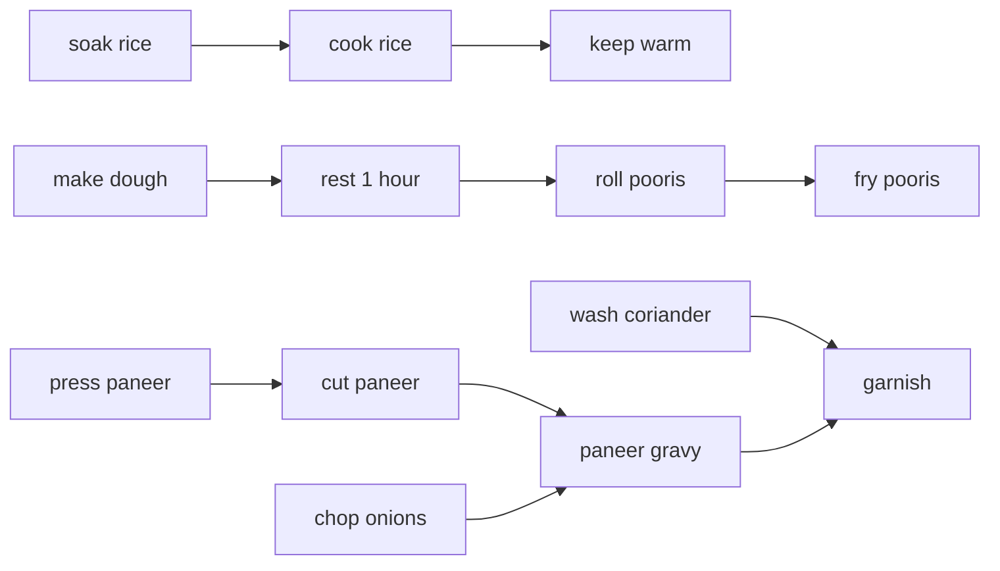

# Topological sort

## 1. What this is, and why they ask it

A topological sort is an ordering of a directed graph's vertices such that every edge points forwards. If A
must happen before B, then A appears before B in the list. That is the whole definition.

It exists only for a **DAG** — a directed acyclic graph. If there is a cycle, no valid order exists, which is
exactly [yesterday's](../day-133-directed-cycles/README.md) lesson from the other side: the same algorithm
that produces the order tells you when there is none.

There are two ways to do it and you should know both. **Kahn's algorithm** repeatedly takes a vertex that
nothing is waiting on, which reads like the domain and gives the cycle check for free. **DFS finish order,
reversed** falls out of a depth-first search and is three lines shorter. Same complexity, different outputs
when you need more than a list.

They ask it because dependency ordering is everywhere and because the questions built on it are among the most
common medium-difficulty interview problems: course schedules, build systems, package installation, task
runners, spreadsheet recalculation, compiler passes. **The tell is any phrasing of "in what order", where some
things must come before others** — and the candidate's job is to notice that before writing anything.

By the end of this lesson you can produce an order with both algorithms, say which to use and why, count or
enumerate the valid orders, produce a *parallel* schedule rather than a serial one, and handle the follow-up
about lexicographically smallest order that most people fumble.

---

## 2. The story

Nirmala is cooking for fourteen people on Sunday and it is Saturday evening.

The list in her head is not a list. It is a set of things that have to happen and a set of facts about which
of them cannot happen until something else has.

The rice has to soak. Not for very long, but it has to happen before the rice can be cooked, and the rice has
to be cooked before it can be sat in the vessel keeping warm. Three things, and their order is not
negotiable.

The dough for the pooris needs to rest for at least an hour, so the dough has to be made an hour before anyone
starts rolling. The paneer has to be pressed before it can be cut and the cutting has to happen before it goes
in the gravy.

And then a whole set of things that have no order at all. The onions can be chopped whenever. The coriander
can be washed whenever. The plates can come down from the top shelf on Saturday night or at half past seven on
Sunday and it makes no difference to anything.

So on Saturday evening she does the things that are furthest back in the chains and that nothing is waiting on
— the paneer gets pressed under a plate with two water bottles on it and left overnight, because nothing has
to happen before that and everything else about the paneer has to happen after.

On Sunday morning at nine she puts the rice to soak, not because it needs four hours but because it is the
first link in that chain and she does not want to be waiting for it at one o'clock. Then she makes the dough,
because that is a one-hour clock that has to start early. Both of those are things nothing else is waiting
for, and both start clocks that other things depend on.

Then, with those two running, she does the chopping and the washing and all the free-floating things, because
the point of starting the slow chains first is that everything else can happen while they run.

Her sister asked her once whether she had a system, and Nirmala said no, but what she does is completely
consistent, and it is this: **look at everything that is not waiting on something else, start whichever of
those has the longest tail behind it, and repeat.**

The meal was on the table at ten past one. She had said one o'clock.

---

## 3. The idea in plain English

Nirmala's method is Kahn's algorithm, and her sister's question is the interview question.

**A directed edge means "must come first".** An edge from *soak rice* to *cook rice* means the soaking has to
be done before the cooking can start. The direction is the whole meaning, and getting it backwards produces a
valid-looking order that is exactly wrong.

**A topological order is any sequence where every edge points forwards.** Every task appears after everything
it depends on. **There is usually more than one valid order**, and that is important: Nirmala could have
chopped the onions first or last, and the meal is the same. **A topological sort produces *an* order, not
*the* order.**

**It exists if and only if there are no cycles.** A cycle means each of a set of tasks waits for another in the
set, and no ordering can satisfy all of them. That is why the algorithm doubles as a cycle detector.

**In-degree is "how many things am I still waiting for".** Count the arrows pointing *at* a vertex. Rice
soaking has in-degree zero — nothing has to happen first. Rice cooking has in-degree one, waiting on the
soaking.

**Kahn's algorithm is exactly what Nirmala does:**

1. Compute every vertex's in-degree.
2. Put everything with in-degree zero into a queue — these can start now.
3. Take one out, output it, and for everything it points at, decrement that in-degree. If any reaches zero,
   it can start now, so queue it.
4. Repeat until the queue is empty.

**If you have output fewer than all the vertices, the rest are in a cycle.** They never reached in-degree
zero, which means each was permanently waiting on something. **The same pass answers "is there an order?" and
"what is it?"**, which is why it is usually the right choice.

**The second algorithm is DFS finish order, reversed.** Run a depth-first search; whenever a vertex *finishes*
— everything below it is done — push it onto a list. Reverse the list at the end.

The reason that works is worth having: when a vertex finishes, everything it depends on... no, everything that
depends on *it* has already finished, because you reached them through it. So finishing order is
dependency order backwards, and reversing it puts each vertex before everything it points to. **You met the
finish event on [day 128](../day-128-graph-dfs/README.md)**; this is what it was for.

**A DFS version needs the three-colour cycle check bolted on**, because unlike Kahn's it will happily produce
a nonsense order on a cyclic graph rather than noticing.

**Now the variant that is usually what people actually want: the parallel schedule.** Kahn's queue at any
moment holds everything that can start *right now*, so if you process the queue **one whole level at a time**,
each level is a set of tasks that can run simultaneously. The number of levels is the **critical path** — the
minimum time to finish everything if you had unlimited workers. **A build system that gives you a serial order
is much less useful than one that gives you the levels**, and it is a two-line change.

**And the follow-up that catches people: the lexicographically smallest order.** If several vertices have
in-degree zero, Kahn's picks arbitrarily. Replace the queue with a **min-heap** and it always picks the
smallest available vertex, giving the smallest valid order. That is `O((V + E) log V)` instead of `O(V + E)`,
and the reason a greedy choice is correct here is worth one sentence: taking the smallest available vertex
never removes a smaller option later, because anything smaller that was available stays available.

---

## 4. The picture

Nirmala's Sunday, as a DAG:



**What to notice.** `press paneer`, `soak rice`, `make dough`, `chop onions` and `wash coriander` all have
in-degree zero — nothing is waiting on any of them, so any of them can be first. That is five valid starting
points and therefore many valid orders.

Kahn's traced on a smaller graph:

```
graph:  0 -> 2,  1 -> 2,  2 -> 3,  2 -> 4,  3 -> 5,  4 -> 5

in-degree:   0:0   1:0   2:2   3:1   4:1   5:2

step  queue      take  output           decrement          new zeros
----  ---------  ----  ---------------  -----------------  ---------
 1    [0, 1]      0    [0]              2 -> 1             —
 2    [1]         1    [0,1]            2 -> 0             2
 3    [2]         2    [0,1,2]          3 -> 0, 4 -> 0     3, 4
 4    [3, 4]      3    [0,1,2,3]        5 -> 1             —
 5    [4]         4    [0,1,2,3,4]      5 -> 0             5
 6    [5]         5    [0,1,2,3,4,5]    —                  —

output 6 of 6  ->  no cycle, and this is a valid order
```

**What to notice at step 3.** After taking `2`, both `3` and `4` reach zero and both enter the queue. They are
independent and either could come next — which is where the "many valid orders" comes from.

And the same graph as a **parallel schedule**, which is the same algorithm read differently:

```
level 0:  [0, 1]        both can start immediately
level 1:  [2]           needs both of level 0
level 2:  [3, 4]        both need 2, independent of each other
level 3:  [5]           needs both of level 2

serial order:    6 steps
parallel levels: 4 steps

with unlimited workers, the job takes 4 units, not 6.
The number of LEVELS is the critical path.
```

**What to notice.** The serial order `[0,1,2,3,4,5]` hides the fact that 0 and 1 could have run together, and
so could 3 and 4. **The level structure is strictly more information for the same work**, and it is what a
build tool actually needs.

The cyclic case, for contrast:

```
graph:  0 -> 1,  1 -> 2,  2 -> 0

in-degree:  0:1   1:1   2:1
vertices with in-degree 0: NONE
queue starts EMPTY  ->  output 0 of 3  ->  cycle
```

---

## 5. The code, built step by step

Kahn's first, because it is the one to reach for.

```python
from collections import deque

def topological_sort(graph: dict[int, list[int]], n: int) -> list[int] | None:
    """A valid order, or None if there is a cycle."""
    in_degree = [0] * n
    for vertex in range(n):
        for neighbour in graph[vertex]:
            in_degree[neighbour] += 1
```

One pass over every edge to build the counts. Note the loop is over `range(n)` and not over `graph`, so a
vertex with no outgoing edges is still considered — the isolated-vertex bug from
[day 129](../day-129-connected-components/README.md), which here is fatal rather than merely wrong, because
`len(order) == n` will never hold if some vertices are missing from the structure.

```python
    queue = deque(v for v in range(n) if in_degree[v] == 0)
    order: list[int] = []
    while queue:
        vertex = queue.popleft()
        order.append(vertex)
        for neighbour in graph[vertex]:
            in_degree[neighbour] -= 1
            if in_degree[neighbour] == 0:
                queue.append(neighbour)
    return order if len(order) == n else None
```

Read the decrement: taking `vertex` out means everything it points at is now waiting for one fewer thing. A
neighbour that hits zero has nothing left to wait for, so it can start.

**`len(order) == n` is the cycle test**, and returning `None` rather than a partial list makes the caller
handle it. A partial order is worse than no order, because it looks usable.

Now the parallel version, which is a two-line change:

```python
def topological_levels(graph: dict[int, list[int]], n: int) -> list[list[int]] | None:
    """Groups of vertices that can run simultaneously. len(levels) is the critical path."""
    in_degree = [0] * n
    for vertex in range(n):
        for neighbour in graph[vertex]:
            in_degree[neighbour] += 1

    frontier = [v for v in range(n) if in_degree[v] == 0]
    levels: list[list[int]] = []
    done = 0
    while frontier:
        levels.append(frontier)
        done += len(frontier)
        nxt: list[int] = []
        for vertex in frontier:                 # one WHOLE level
            for neighbour in graph[vertex]:
                in_degree[neighbour] -= 1
                if in_degree[neighbour] == 0:
                    nxt.append(neighbour)
        frontier = nxt
    return levels if done == n else None
```

No queue at all — two lists, swapped at the end of each round, exactly like the level-by-level BFS from
[day 130](../day-130-grids-are-graphs/README.md). Everything in `frontier` is ready at the same moment, so it
is one level.

The lexicographically smallest order, which is the standard follow-up:

```python
import heapq

def smallest_topological_order(graph: dict[int, list[int]], n: int) -> list[int] | None:
    in_degree = [0] * n
    for vertex in range(n):
        for neighbour in graph[vertex]:
            in_degree[neighbour] += 1
    heap = [v for v in range(n) if in_degree[v] == 0]
    heapq.heapify(heap)                          # a min-heap, not a queue
    order: list[int] = []
    while heap:
        vertex = heapq.heappop(heap)             # always the smallest available
        order.append(vertex)
        for neighbour in graph[vertex]:
            in_degree[neighbour] -= 1
            if in_degree[neighbour] == 0:
                heapq.heappush(heap, neighbour)
    return order if len(order) == n else None
```

One data structure changed. The greedy choice is correct because taking the smallest currently-available
vertex cannot make a smaller vertex unavailable later — anything already available stays available.

Now the DFS version, for completeness:

```python
WHITE, GREY, BLACK = 0, 1, 2

def topological_sort_dfs(graph: dict[int, list[int]], n: int) -> list[int] | None:
    colour = [WHITE] * n
    order: list[int] = []

    def visit(vertex: int) -> bool:
        colour[vertex] = GREY
        for neighbour in graph[vertex]:
            if colour[neighbour] == GREY:
                return False                     # cycle
            if colour[neighbour] == WHITE and not visit(neighbour):
                return False
        colour[vertex] = BLACK
        order.append(vertex)                     # append on FINISH
        return True

    for vertex in range(n):
        if colour[vertex] == WHITE and not visit(vertex):
            return None
    return order[::-1]                            # reverse
```

Two lines carry it: `order.append(vertex)` sits *after* the loop, on the finish event, and the result is
reversed at the end. Appending before the loop gives you a pre-order, which is not a topological order and
which looks plausible on small examples.

The three-colour check is not optional here. Without it the function returns a confident, wrong order on a
cyclic graph.

### The complete solution

```python
"""Topological sort: Kahn's, DFS finish order, levels, and the smallest order."""

from __future__ import annotations

import heapq
from collections import deque

WHITE, GREY, BLACK = 0, 1, 2


def build(n: int, edges: list[tuple[int, int]]) -> dict[int, list[int]]:
    """edges are (before, after). Built from range(n) so every vertex exists."""
    graph: dict[int, list[int]] = {v: [] for v in range(n)}
    for before, after in edges:
        graph[before].append(after)
    return graph


def kahn(graph: dict[int, list[int]], n: int) -> list[int] | None:
    """A valid order, or None on a cycle. O(V + E)."""
    in_degree = [0] * n
    for vertex in range(n):
        for neighbour in graph[vertex]:
            in_degree[neighbour] += 1
    queue = deque(v for v in range(n) if in_degree[v] == 0)
    order: list[int] = []
    while queue:
        vertex = queue.popleft()
        order.append(vertex)
        for neighbour in graph[vertex]:
            in_degree[neighbour] -= 1
            if in_degree[neighbour] == 0:
                queue.append(neighbour)
    return order if len(order) == n else None


def levels(graph: dict[int, list[int]], n: int) -> list[list[int]] | None:
    """Parallel schedule. len(result) is the critical path length."""
    in_degree = [0] * n
    for vertex in range(n):
        for neighbour in graph[vertex]:
            in_degree[neighbour] += 1
    frontier = [v for v in range(n) if in_degree[v] == 0]
    out: list[list[int]] = []
    done = 0
    while frontier:
        out.append(frontier)
        done += len(frontier)
        nxt: list[int] = []
        for vertex in frontier:
            for neighbour in graph[vertex]:
                in_degree[neighbour] -= 1
                if in_degree[neighbour] == 0:
                    nxt.append(neighbour)
        frontier = nxt
    return out if done == n else None


def smallest_order(graph: dict[int, list[int]], n: int) -> list[int] | None:
    """The lexicographically smallest valid order. O((V + E) log V)."""
    in_degree = [0] * n
    for vertex in range(n):
        for neighbour in graph[vertex]:
            in_degree[neighbour] += 1
    heap = [v for v in range(n) if in_degree[v] == 0]
    heapq.heapify(heap)
    order: list[int] = []
    while heap:
        vertex = heapq.heappop(heap)
        order.append(vertex)
        for neighbour in graph[vertex]:
            in_degree[neighbour] -= 1
            if in_degree[neighbour] == 0:
                heapq.heappush(heap, neighbour)
    return order if len(order) == n else None


def dfs_order(graph: dict[int, list[int]], n: int) -> list[int] | None:
    """Reversed finish order. Needs the three-colour cycle check."""
    colour = [WHITE] * n
    out: list[int] = []

    def visit(vertex: int) -> bool:
        colour[vertex] = GREY
        for neighbour in graph[vertex]:
            if colour[neighbour] == GREY:
                return False
            if colour[neighbour] == WHITE and not visit(neighbour):
                return False
        colour[vertex] = BLACK
        out.append(vertex)
        return True

    for vertex in range(n):
        if colour[vertex] == WHITE and not visit(vertex):
            return None
    return out[::-1]


def count_orders(graph: dict[int, list[int]], n: int) -> int:
    """How many valid orders exist. Exponential in general; fine for small n."""
    in_degree = [0] * n
    for vertex in range(n):
        for neighbour in graph[vertex]:
            in_degree[neighbour] += 1

    def recurse(remaining: int) -> int:
        if remaining == 0:
            return 1
        total = 0
        for vertex in range(n):
            if in_degree[vertex] == 0:
                in_degree[vertex] = -1                     # mark as used
                for neighbour in graph[vertex]:
                    in_degree[neighbour] -= 1
                total += recurse(remaining - 1)
                for neighbour in graph[vertex]:            # undo
                    in_degree[neighbour] += 1
                in_degree[vertex] = 0
        return total

    return recurse(n)


if __name__ == "__main__":
    tasks = build(6, [(0, 2), (1, 2), (2, 3), (2, 4), (3, 5), (4, 5)])
    print("kahn    :", kahn(tasks, 6))
    print("dfs     :", dfs_order(tasks, 6))
    print("smallest:", smallest_order(tasks, 6))
    print("levels  :", levels(tasks, 6))
    print("orders  :", count_orders(tasks, 6))

    ring = build(3, [(0, 1), (1, 2), (2, 0)])
    print("cycle   :", kahn(ring, 3), dfs_order(ring, 3), levels(ring, 3))
```

Running it:

```
kahn    : [0, 1, 2, 3, 4, 5]
dfs     : [1, 0, 2, 4, 3, 5]
smallest: [0, 1, 2, 3, 4, 5]
levels  : [[0, 1], [2], [3, 4], [5]]
orders  : 4
cycle   : None None None
```

Three things to look at. `kahn` and `dfs` give **different orders** and both are correct — every edge points
forwards in each. If you were expecting them to match, that expectation is the bug.

`levels` shows the parallel structure: four rounds instead of six steps, so with two workers this finishes a
third faster. And `orders` is 4 — `{0,1}` can be ordered two ways and `{3,4}` can be ordered two ways, so
`2 × 2`.

---

## 6. What it costs

**Kahn's.**

```
building in-degrees      one pass over every edge      E
                         plus initialising the array   V
each vertex queued once                                V
each edge decremented once                             E
                                                       ------------
                                                       O(V + E) time
in-degree array + queue + output                       O(V) space
```

**DFS version.**

```
each vertex coloured once, appended once               V
each edge examined once                                E
                                                       ------------
                                                       O(V + E) time
colour array + output + recursion stack                O(V) space
```

**Identical.** The choice between them is never about speed.

**The lexicographic version:**

```
heap push and pop                    log V each
V pushes and V pops                  V log V
                                     -------------------
                                     O((V + E) log V)
```

```
V = 100,000, E = 200,000
Kahn's         300,000 steps
smallest       300,000 x 17 = ~5,000,000 steps
```

**About seventeen times more work for the ordering guarantee.** Worth it when asked for; not worth it by
default.

**The levels version costs exactly the same as Kahn's** — every vertex and edge is still touched once — and
returns strictly more information. There is no reason to prefer the flat version except that the caller wants
a flat list.

**Counting all valid orders is a completely different problem:**

```
counting orders    exponential in general (it is #P-complete)
n independent vertices with no edges -> n! orders
n = 12, no edges -> 479,001,600
```

```
the recursive version above:   fine for n <= 12 or so
anything larger:               needs bitmask DP, O(2^n x n), fine for n <= 20
```

**Say this out loud if asked to count**, because the naive expectation is that it is as cheap as producing one
order, and it is not.

**Space, at scale:**

```
V = 1,000,000, E = 5,000,000

in-degree as a list of ints        ~8 MB
adjacency as a list of lists       ~8 MB of list objects + 40 MB of entries
queue at peak                      up to V, ~8 MB
output list                        ~8 MB
```

**And the recursion caveat for the DFS version:**

```
a dependency chain 100,000 long   ->  100,000 frames  ->  RecursionError
```

Kahn's never recurses, which is a real and practical argument for it on large inputs and one of the reasons to
default to it.

**The critical path, which is the number that matters for a build:**

```
1,000 tasks, average 5 seconds each
serial                     5,000 s = 83 minutes
levels = 12
critical path              12 x 5 = 60 s

with unlimited workers, one minute instead of 83.
the widest level tells you how many workers are worth having
```

---

## 7. The traps

### Edge direction reversed

The near-miss that produces a confidently wrong answer:

```python
for course, prerequisite in pairs:
    graph[course].append(prerequisite)      # backwards
```

The input says "to take `course`, first take `prerequisite`", so the edge means "prerequisite before course"
and must point *from* the prerequisite. Reversed, the algorithm runs, finds no cycle, and returns an order in
which every course comes before its own prerequisites:

```
>>> topological_sort(backwards_graph, 4)
[3, 2, 1, 0]                # a valid topological order of the WRONG graph
```

**No error, and the output is a plausible-looking list.** Before writing the loop, say the meaning as an
English sentence — "an edge from A to B means A must happen before B" — and then check by hand which list gets
the append.

### Building from the edge list

```python
graph = defaultdict(list)
for a, b in edges:
    graph[a].append(b)
```

A vertex with no outgoing edges never becomes a key, and a vertex in no edge at all never appears anywhere:

```
>>> kahn(from_edges_only, n=5)
None                        # reports a cycle on an acyclic graph
```

`len(order) == n` cannot hold when the structure does not contain `n` vertices. **This produces a phantom
cycle**, which is the most confusing possible failure, and it is fixed by building from `range(n)`.

### Appending before the loop in the DFS version

```python
def visit(vertex):
    colour[vertex] = GREY
    order.append(vertex)                    # <- pre-order, not post-order
    for neighbour in graph[vertex]:
        ...
```

This produces the order vertices were *entered*, which is not a topological order:

```
graph: 0 -> 1, 2 -> 1
pre-order from 0 then 2:  [0, 1, 2]
                          2 must come before 1, and it does not
```

It looks right on a simple chain, which is why it survives testing. **The append goes after the loop, and the
result is reversed.**

### DFS with no cycle check

```python
def visit(vertex):
    seen.add(vertex)
    for neighbour in graph[vertex]:
        if neighbour not in seen:
            visit(neighbour)
    order.append(vertex)
```

On a cyclic graph this terminates and returns a list:

```
>>> dfs_no_check(ring, 3)
[2, 1, 0]                   # there is no valid order; this is nonsense
```

Kahn's cannot do this — it structurally cannot output all `n` vertices when a cycle exists — which is one more
reason to prefer it.

### Expecting a unique answer

```python
assert kahn(graph, 6) == [0, 1, 2, 3, 4, 5]
```

Kahn's, the DFS version, and the same code with the adjacency lists built in a different order all give
different valid answers. **Tests must verify the property, not the output**: for every edge `(a, b)`, check
that `position[a] < position[b]`. That verification is five lines and it is what you should write.

### Recursion depth on the DFS version

```
Traceback (most recent call last):
  File "topo.py", line 14, in visit
    if colour[neighbour] == WHITE and not visit(neighbour):
  [Previous line repeated 995 more times]
RecursionError: maximum recursion depth exceeded
```

A long dependency chain — real build graphs have them — and `n <= 10^5` in the constraints. Kahn's, or the
iterative DFS with stored iterators.

### Duplicate edges

```python
edges = [(0, 1), (0, 1)]
```

The in-degree of `1` becomes 2 and only ever gets decremented once when `0` is processed — no, twice, because
the adjacency list contains `1` twice. So it actually works. **But if you deduplicate the adjacency list
without recomputing in-degrees, or compute in-degrees from a deduplicated edge set while the adjacency list
keeps duplicates, the counts diverge and a vertex is either never released or released early.** The rule is
that in-degrees and adjacency must be computed from the same data — which is why the code above derives the
counts *from* the adjacency structure rather than from the raw edge list.

---

## 8. In the interview

### How it gets asked

- *"Order these tasks so that every dependency comes first."* — the direct version.
- *"Can all courses be finished? Now give me a valid order."* — LeetCode 207 then 210.
- *"In what order should these packages be installed?"*
- *"Given a build graph, produce the fastest schedule."* — the levels version.
- *"There is an alien alphabet; here are some sorted words. Determine the letter order."* — LeetCode 269,
  and the modelling is the whole problem.
- *"Return the lexicographically smallest valid order."*

### The first ninety seconds

> "Topological sort, and I would use Kahn's algorithm.
>
> The model first: a vertex is a task, and an edge from A to B means **A must happen before B**. I want to say
> that as a sentence before I write the append, because the input usually expresses it the other way round —
> 'B requires A' — and reversing it silently gives a valid order of the wrong graph, with no error.
>
> Kahn's: compute each vertex's in-degree, which is how many things it is still waiting for. Seed a queue with
> everything at zero — those can start now. Repeatedly take one out, output it, and decrement the in-degree of
> everything it points at; anything that reaches zero is now unblocked, so queue it.
>
> **If fewer than `n` vertices come out, there is a cycle** — the leftovers never reached zero, meaning each is
> permanently waiting on something. So the same pass answers both 'is there an order' and 'what is it', which
> is the main reason I prefer it to the DFS version.
>
> The other reasons: it never recurses, so a hundred-thousand-long dependency chain is not a problem; and it
> reads like the domain, which matters when someone else has to maintain it.
>
> `O(V + E)` time and `O(V)` space.
>
> Two things I would set up carefully. The structure is built from the full vertex list, not from the edge
> pairs — a task with no dependencies and no dependents must still exist, or `len(order) == n` never holds and
> I report a cycle that is not there. And I would not assert a specific output in a test, because many orders
> are valid; I would verify the property instead — for every edge, the source appears before the target.
>
> **And I would ask whether you want a serial order or a schedule**, because if these tasks can run in
> parallel, processing the queue one whole level at a time gives me groups that can run simultaneously, and the
> number of groups is the critical path. That is a two-line change and it is usually what the caller actually
> needs."

### The follow-ups

**"Kahn's or DFS? Why?"**

> "Kahn's, for four reasons, and they are all practical rather than about complexity — both are `O(V + E)`.
>
> **It detects the cycle structurally.** It cannot output all `n` vertices when a cycle exists. The DFS version
> will happily return a confident, wrong order on a cyclic graph unless I bolt on the three-colour check, and
> that check is a thing to remember rather than a thing that cannot go wrong.
>
> **It never recurses.** A long dependency chain overflows the stack in the DFS version, and raising the limit
> turns a `RecursionError` into a segfault.
>
> **It gives the parallel schedule for free** by processing one level at a time, which is what a build system
> actually wants.
>
> **And it reads like the problem.** 'Take anything nothing is waiting on, remove it, repeat' is what a person
> would do.
>
> The DFS version's advantages are that it is three lines shorter and that if I already need a DFS for
> something else — finding the cycle itself, or strongly connected components — I get the order as a by-product
> of the finish times I am already computing. That is a real argument in a larger piece of code."

**"Return the lexicographically smallest order."**

> "Replace the queue with a min-heap. When several vertices are available, Kahn's picks arbitrarily; a heap
> always picks the smallest.
>
> The greedy choice is correct, and I would give the reason rather than assert it: taking the smallest
> currently-available vertex cannot make any smaller vertex unavailable later. Availability only ever
> increases as I remove things — nothing I output can block anything — so if a smaller vertex were available
> at some later point, it was available now, and I would have taken it.
>
> The cost goes from `O(V + E)` to `O((V + E) log V)`, which on a hundred thousand vertices is roughly
> seventeen times more work. So I would only do it when asked.
>
> The related question worth being ready for is 'is the order unique?' — and it is unique exactly when the
> queue contains at most one vertex at every step. That is a one-line check inside the same loop, and it is how
> you answer 'can this sequence be reconstructed unambiguously', which is LeetCode 444."

**"How would you parallelise the build?"**

> "The levels version, and it is the same algorithm read differently.
>
> Instead of taking one vertex off the queue at a time, take the *whole* current frontier. Everything in it has
> in-degree zero at the same moment, so nothing in it depends on anything else in it, so it can all run
> simultaneously. Then process all of their outgoing edges and whatever reaches zero becomes the next level.
>
> Two numbers fall out that a serial order does not give me. **The number of levels is the critical path** —
> the minimum wall-clock time with unlimited workers. And **the widest level is the maximum useful
> parallelism** — beyond that many workers, some sit idle.
>
> Concrete: a thousand tasks averaging five seconds is eighty-three minutes serially. If there are twelve
> levels, the critical path is sixty seconds, and if the widest level is forty tasks, there is no point running
> more than forty workers.
>
> **The refinement I would mention** is that levels assume every task takes the same time, which builds do not.
> With real durations, the right answer is to compute the earliest start time per task — the maximum over its
> dependencies of their finish times — which is a single pass in topological order and gives a true critical
> path. That is the same algorithm with a `max` instead of a counter, and it is one of the nicest things you
> get from having the order: **any DP over a DAG is one pass in topological order.**"

**"Here are some words sorted in an unknown alphabet. Find the letter order."**

> "The whole difficulty is the modelling; the sort is then routine.
>
> **A vertex is a letter. An edge from `a` to `b` means `a` comes before `b` in the alphabet.** I get those
> edges by comparing *adjacent* words in the list: walk them together until the first position where they
> differ, and that one pair of characters gives me exactly one ordering fact. Everything after that position
> tells me nothing.
>
> **Only adjacent pairs**, and only the *first* difference — those are the two things people get wrong.
> Comparing all pairs adds no information and adds edges that are implied. Taking more than the first
> difference adds edges that are simply false.
>
> **The edge case that is the actual test:** if a word is a prefix of the previous one — `["abc", "ab"]` — that
> is invalid input, because a shorter prefix must sort first. Returning an empty result there rather than
> ignoring it is what the hidden tests check.
>
> Then Kahn's over the letters that actually appear. A cycle means the input is contradictory and there is no
> valid alphabet. Multiple valid orders are possible and any is acceptable unless they ask for the smallest.
>
> Cost: building edges is `O(total characters)`; the sort is `O(V + E)` where `V` is at most 26 and `E` at
> most the number of word pairs. So it is linear in the input, and the graph is tiny."

### The model answer

*"A CI system runs jobs. Each job declares which jobs must complete before it. Design the scheduler: detect
invalid configurations, and run the jobs as fast as possible on a fixed pool of workers."*

> "Three requirements — validate, order, schedule — and Kahn's gives me all three from one structure.
>
> **The model.** A vertex is a job. An edge from A to B means A must complete before B starts. The config file
> almost certainly says `needs: [A]` under job B, so the edge points from each entry in `needs` to the job
> declaring it — and I would write that direction down as a sentence and verify it on a two-job example before
> going further, because reversing it produces a schedule that runs everything backwards with no error.
>
> **Validation.** Kahn's, and if fewer than `n` jobs come out, the configuration has a circular dependency. But
> 'circular dependency detected' is not a usable error message, so I would run a second pass — three-colour DFS
> carrying the path — over just the unemitted jobs to report the actual loop: `test → build → lint → test`.
> And I would report *all* the cycles rather than the first, since a large config can have several. **The
> rigorous version is strongly connected components**, where each non-trivial component is one independent
> cycle, and I would name that as what I would use if configs get big.
>
> **Two more validations that are not cycles and matter as much.** A job depending on a name that does not
> exist — a typo — should be caught before any graph work, with a clear message. And duplicate entries in a
> `needs` list, which I would deduplicate, because if in-degrees and the adjacency structure are computed from
> inconsistent data, a job is either released early or never released at all.
>
> **Scheduling.** Not a flat order — the level structure. Everything at in-degree zero can start immediately;
> as each job finishes I decrement its dependents and anything reaching zero becomes runnable. **With a fixed
> worker pool, this is a ready-set rather than strict levels**: I keep a set of runnable jobs and hand them out
> as workers free up, rather than waiting for a whole level to finish. That is strictly better, because a level
> containing one 10-minute job and nine 5-second jobs would otherwise idle nine workers for ten minutes.
>
> **Which runnable job to hand out first** is a real choice and I would make it deliberately: **the one with
> the longest remaining critical path behind it**, computed by a single reverse pass in topological order. That
> is classic list scheduling and it beats arbitrary choice noticeably, because starting a long chain late
> extends the whole build.
>
> **The numbers I would report to the user**, because they are free once the graph exists: the critical path
> length, which is the fastest the build can possibly be; the widest level, which is how many workers are worth
> paying for; and the total work. 'This build takes 83 minutes of work, its critical path is 6 minutes, and
> more than 12 workers will not help' is genuinely useful output and almost no CI system shows it.
>
> **Failure handling, which is where the graph keeps earning.** When a job fails, everything downstream of it
> is unreachable and should be marked skipped rather than left pending — that is a forward traversal from the
> failed vertex, and reporting 'skipped 14 jobs because build failed' is much better than fourteen timeouts.
>
> **Cost:** `O(V + E)` for everything, with `V` in the hundreds and `E` similar for a realistic config, so the
> scheduling is free relative to running anything. The one thing I would watch is that the config is
> re-parsed and re-validated on every run, so it should stay linear and not creep into anything quadratic as
> configs grow."

---

## 9. Recall card

**A topological order puts every vertex before everything it points to.** It exists **iff** the graph is
acyclic, and there are usually **many** valid orders — verify the property in tests, never a specific list.

**Kahn's: in-degree zero into a queue; pop, output, decrement; anything reaching zero is queued.** If fewer
than `n` come out, the leftovers are in a cycle. **Prefer it**: structural cycle detection, no recursion,
parallel schedule for free, and it reads like the domain.

**DFS version: append on *finish*, then reverse** — and it needs the three-colour check bolted on, or it
returns a confident wrong answer on a cyclic graph.

**Process one whole level at a time and you get the parallel schedule.** Number of levels = critical path;
widest level = maximum useful workers. Same `O(V + E)`, strictly more information.

**Two silent bugs:** the edge direction reversed (valid order of the wrong graph), and building the structure
from the edge list so isolated vertices vanish — which reports a **phantom cycle**. Build from `range(n)` and
say the edge's meaning as a sentence first.
