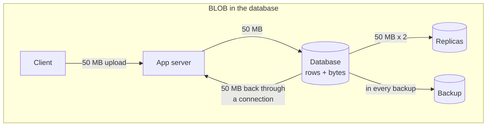
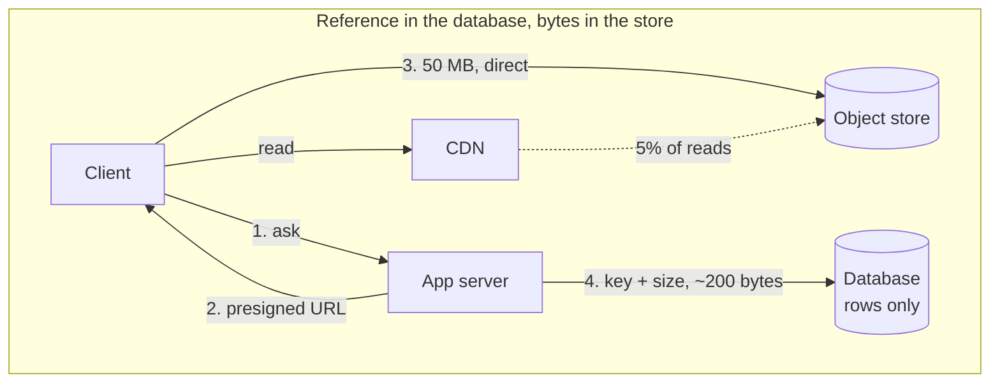

# Blob storage versus storing files in the database

## 1. What this is, and why they ask it

You have a database and you have files, and somebody has to decide where the files live. Inside the database
as a BLOB column, or outside in object storage with only a reference in the row.

Almost always the answer is outside. The interesting part is *why*, and the reason interviewers like this
question is that it is one of the few design decisions where the argument can be settled with arithmetic
rather than opinion. Backup time, cache efficiency, replication traffic, connection pool occupancy, cost per
gigabyte — every one of those is a number, and a candidate who produces numbers is a different candidate from
one who says "best practice is to use S3".

It is also a question with a real minority answer. Below a certain size and volume, storing the bytes in the
database is genuinely the better engineering choice, because it removes an entire class of consistency
problem. **Knowing where that line sits, and being able to say what moves it, is the actual skill.**

Yesterday's lesson was [what object storage is](../day-133-directed-cycles/README.md). Today is the decision,
the arithmetic behind it, and the failure modes on both sides.

By the end of this lesson you can defend either answer with numbers, quantify what a BLOB column does to
backups and cache, name the two consistency problems the external store creates and how to handle them, and
say what changes the decision.

---

## 2. The story

There is one fridge in the Menon house and it has been the same fridge since 2009.

It is not large. Two shelves and a door, a small freezer at the top that mostly holds ice trays and one packet
of peas that has been there since some time in 2023.

What lives in it is what you would expect. Milk, twice a day. Curd. Whatever was left from lunch. The bottle of
water everybody wants. The vegetables in the drawer at the bottom. Every one of those is something a person
opens the fridge for several times a day.

In May, Ravi's uncle came from Nagpur and brought a watermelon.

It was an enormous thing, and it went in the fridge, because that is what you do with a watermelon in May, and
for about four days it occupied roughly half of the lower shelf and part of the middle one, because it would
not fit anywhere flat.

Nobody could get to anything.

The milk went behind it. The curd was somewhere on the left, under the coriander. To take out the water bottle
you had to take out the watermelon, which is a two-hand job, and put it on the counter, and then find the
water, and then put the watermelon back. Ravi's mother did this perhaps twelve times a day for four days.

There is a cool storeroom under the stairs where the rice and the oil tins are, and where the watermelon would
have been perfectly happy for those four days. It is not cold, but it is not warm either, and a watermelon is
not milk. Nobody thought of it, because the fridge is where cold things go and a watermelon is a cold thing.

The other consequence, which they noticed on the Saturday, was the cleaning. Every month or so the fridge gets
emptied out and wiped down, and it takes about twenty minutes. That Saturday it took an hour, because the
watermelon had to come out, and everything under it had to come out, and putting it all back in a way that
worked took three attempts.

The fridge is small and expensive and everything in it is something you reach for constantly. The storeroom is
large and cheap and nobody goes in there twice a week.

The watermelon was in the wrong room.

---

## 3. The idea in plain English

The fridge is the database and the storeroom is object storage.

**A database is optimised for small things fetched constantly.** Rows are small. Indexes assume small. The
buffer pool — the memory the database keeps hot data in — is sized for a working set of rows. Every mechanism
in it, from page layout to replication, assumes the unit of work is bytes-to-kilobytes.

**A BLOB is a column holding raw bytes.** Postgres calls it `bytea`, MySQL has `BLOB` and `LONGBLOB`, and they
all work. You can absolutely put a 4 MB photo in a row. The question is what happens to everything else when
you do.

**The first cost is the buffer pool.** The database keeps recently used pages in memory. A 4 MB photo evicts
roughly a thousand 4 KB pages of actual rows and indexes — pages that many queries were using. **One photo
read pushes a thousand useful pages out of memory**, so the cache hit rate for ordinary queries falls, and
suddenly unrelated queries are slower. That is the milk going behind the watermelon.

**The second cost is backups.** A backup copies everything. A database of 20 GB of rows plus 4 TB of images is
a 4 TB backup, and a restore is a 4 TB restore. **Recovery time is dominated entirely by data you did not need
to protect that way**, because object storage already keeps eleven nines of durability without your help.
That is the Saturday cleaning taking an hour.

**The third cost is replication.** Every byte written to the primary is shipped to every replica. Uploading a
100 MB video writes 100 MB to the write-ahead log and sends 100 MB to each replica. With two replicas that is
300 MB of network for one upload, and the replication lag that follows delays *every other query's* visibility
on those replicas.

**The fourth is connections and memory.** A database connection is an expensive thing and there are typically
a few hundred. Streaming a 50 MB BLOB out of one holds it for the duration, and many clients materialise the
whole value in memory before sending it. **A hundred concurrent downloads is your connection pool gone**, and
every ordinary query then waits.

**The fifth is cost per gigabyte.** Database storage is provisioned SSD with replication and backups —
five to ten times the price of object storage for the same bytes, before counting the instance that has to
serve it.

**So: the database holds the reference, and object storage holds the bytes.** A row with the key, the size,
the content type and the owner. Everything the application queries stays small; everything large is fetched
directly by the client from a store built for exactly that, through a CDN, without touching your servers.

**But the external store creates two problems that the BLOB column does not have, and an honest answer names
them.**

**No transaction spans the two systems.** You can commit the row and fail to write the object, or write the
object and fail to commit the row. There is no `BEGIN` that covers both. You get **orphans** — objects nobody
references — and **broken links** — rows pointing at nothing. Both happen, and the answer is ordering plus a
reconciliation job, exactly as on [day 133](../day-133-directed-cycles/README.md).

**And deletion is no longer atomic.** Deleting a row is one statement; deleting a row and its object and its
derivatives and the CDN's copy is four systems and no transaction.

**Those two problems are precisely what the minority case buys back.** For small files, low volume, and a hard
requirement that the file and its metadata are consistent — a signed contract, an audit attachment, a small
avatar — putting the bytes in the database is defensible, because `INSERT` either happens or does not and
there is nothing to reconcile. **Below roughly a few hundred kilobytes and a few gigabytes total, that is a
real engineering choice, not a mistake.**

**And there is a middle option worth knowing.** Postgres stores large values out-of-line automatically —
**TOAST** — in a side table, compressed, and only reads them when the column is selected. So `SELECT id, name
FROM users` does not pull the avatar. That softens the buffer-pool argument considerably and is worth
mentioning, because it is the strongest technical point on the "in the database" side. It does not soften the
backup, replication or cost arguments at all.

---

## 4. The picture

Where the bytes go, and what each path costs:





**What to notice.** In the second diagram the database sees two hundred bytes and the app server sees two small
requests. In the first, the same 50 MB crosses the app server twice, the database once, the replication link
twice, and lands in every backup forever.

The buffer pool, which is the argument people underestimate:

```
  Database with 16 GB of buffer pool, 4 KB pages
  = 4,000,000 pages of room

  WITHOUT blobs
    working set: 20 GB of rows and indexes
    hot 16 GB stays resident
    cache hit rate ~99%

  WITH 4 MB photos in rows
    one photo read = 1,000 pages loaded
    100 photo reads per second = 100,000 pages/s evicted
    the 4,000,000-page pool turns over every 40 seconds
    -> row and index pages are constantly evicted
    -> cache hit rate falls to ~70%
    -> every unrelated query does disk reads it used to avoid
```

**What to notice.** Nothing about the photo queries got slow. **The damage is to every other query**, which is
why this shows up as "the whole database got slower" and takes a long time to diagnose.

And the backup arithmetic, which is the argument that usually ends the discussion:

```
  rows only            20 GB
  + images             4 TB
                       ---------
  backup size          4.02 TB

  restore at 200 MB/s  4,020 GB / 0.2 GB/s = 20,100 s = 5.6 HOURS

  rows only
  restore at 200 MB/s  20 / 0.2 = 100 s = 1.7 MINUTES
```

**What to notice.** Your recovery time objective just went from under two minutes to nearly six hours, for
data that object storage was already keeping at eleven nines of durability without being backed up at all.

---

## 5. How it actually works

### The reference-in-the-database schema

```sql
CREATE TABLE media (
    id            UUID PRIMARY KEY,
    owner_id      BIGINT      NOT NULL REFERENCES users(id),
    object_key    TEXT        NOT NULL UNIQUE,   -- 'media/9f/9f3a...-orig.jpg'
    content_type  TEXT        NOT NULL,
    size_bytes    BIGINT      NOT NULL,
    checksum      TEXT        NOT NULL,          -- verify what came back
    state         TEXT        NOT NULL,          -- PENDING | READY | DELETED
    created_at    TIMESTAMPTZ NOT NULL DEFAULT now()
);
CREATE INDEX ON media (owner_id, created_at DESC);
```

Two hundred bytes a row. A million media items is 200 MB of table — entirely cacheable — while the bytes
themselves are terabytes elsewhere.

`state` is what makes the two-system problem manageable, and `checksum` is what lets you verify that the
object you fetched is the one the row describes.

### The write order that makes failures recoverable

**Row first, then object, then confirm.**

```
1. INSERT media (..., state='PENDING')     -- committed
2. hand out a presigned URL for object_key
3. client uploads directly to the store
4. store emits an event -> worker -> UPDATE media SET state='READY'
```

Then the two failure modes are:

- **Row without object** — the upload never happened. Visible, queryable, cleaned up by a job that deletes
  `PENDING` rows older than a day. Harmless.
- **Object without row** — cannot happen, because the row was created first and the key came from it.

**Getting this order backwards inverts the failure into the bad one:** an object nobody references, invisible
to the application, never deleted, costing money forever. **Always create the row first.**

### The reconciliation job

Everything above is best-effort, so:

```
nightly:
  list the bucket by prefix
  full-outer-join against the media table on object_key

  object with no row, older than 24h   -> delete (it is an orphan)
  row READY with no object             -> alert (this is data loss)
  row PENDING older than 24h           -> delete the row
```

**The second line is the one that matters.** A `READY` row whose object is missing is a broken link a user will
hit, and it is the only way to find out that something deleted an object it should not have.

### Deletion, which is genuinely harder

Deleting a media item touches the database row, the original object, every derivative, and the CDN's cached
copies. Four systems, no transaction.

The workable pattern:

```
1. UPDATE media SET state='DELETED'        -- instant; the user stops seeing it
2. enqueue a cleanup job                    -- idempotent, retried
3. worker deletes derivatives, then the original, then invalidates the CDN
4. worker deletes the row (or leaves a tombstone for audit)
```

**Soft-delete first** so the user-visible effect is immediate and transactional, then clean up asynchronously.
If there is a regulatory deletion requirement, step 3 needs its own monitoring and a report, because
"eventually, probably" is not an acceptable answer to a regulator.

### The case for the database, done properly

For small files it is genuinely simpler, and Postgres has real support:

- **`bytea` with TOAST.** Values above about 2 KB are stored out-of-line in a side table and compressed, and
  are only read when that column is selected. So `SELECT id, name FROM users` does not touch the avatar at
  all. **This is the strongest argument on this side** and it neutralises much of the buffer-pool objection.
- **Large objects (`lo`)** support streaming and seeking, at the cost of a separate API and manual cleanup.
- **SQLite** is a special case: its authors have published benchmarks showing that reading blobs under about
  100 KB out of SQLite is *faster* than reading them as individual files, because of filesystem overhead per
  open. For a mobile or embedded application, in the database is often correct.

**Where the line sits, in practice:**

```
< 100 KB per file, < 10 GB total, and consistency matters   -> database is defensible
> 1 MB per file, or > 100 GB total, or served to browsers   -> object storage, clearly
in between                                                  -> object storage by default,
                                                               database if the consistency
                                                               argument is strong
```

### The third option: a filesystem

Occasionally the answer is neither — a network file system or local disk. It gives you real file semantics for
legacy software that needs them, and it costs you: no eleven nines, a capacity ceiling per volume, backup is
your problem, and scaling reads means your own replication. **It is the right answer mainly when something you
cannot change requires a `path`**, and saying so is better than pretending object storage covers every case.

---

## 6. The numbers

**Cost per gigabyte per month:**

```
object storage (S3 Standard)     $0.023
S3 Infrequent Access             $0.0125
managed Postgres SSD (gp3)       $0.115
managed Postgres provisioned IOPS $0.125+
```

```
4 TB of images
  object storage    4,000 x $0.023   = $92/month
  in the database   4,000 x $0.115   = $460/month  storage alone
                    + backup storage 4,000 x $0.095 = $380
                    + a larger instance to hold it
                    -> ~$1,000+/month vs $92
```

**Roughly ten times, before counting the instance size you needed to grow to.**

**Backup and restore:**

```
rows only            20 GB    restore at 200 MB/s   = 100 s
rows + 4 TB blobs    4.02 TB  restore at 200 MB/s   = 5.6 hours
```

**Backup window:**

```
nightly backup of 20 GB      ~2 minutes
nightly backup of 4 TB       ~5.6 hours
```

A backup that takes almost six hours cannot run nightly without overlapping other work, and it holds locks or
snapshot resources for that whole period.

**Replication traffic:**

```
1,000 uploads/day at 5 MB     = 5 GB/day written
x 2 replicas                  = 10 GB/day of extra replication
                              = 115 KB/s average, fine

10,000 uploads/day at 50 MB   = 500 GB/day
x 2 replicas                  = 1 TB/day
                              = 11.6 MB/s sustained, plus every burst
```

**At the second scale, replication lag becomes visible on every read replica**, delaying the visibility of
completely unrelated writes — which is how a photo feature degrades a reporting dashboard.

**Buffer pool damage:**

```
16 GB pool / 4 KB pages       = 4,000,000 pages
one 4 MB blob read            = 1,000 pages
100 blob reads/second         = 100,000 pages/s
pool fully turned over every  4,000,000 / 100,000 = 40 seconds
```

```
cache hit rate before   ~99%    -> 1 disk read per 100 queries
cache hit rate after    ~70%    -> 30 disk reads per 100 queries
                                -> 30x more disk I/O on unrelated queries
```

**Connection occupancy:**

```
200 connections in the pool
50 MB download at 20 MB/s   = 2.5 s per download holding one connection
200 concurrent downloads    = the entire pool, for 2.5 s
                            -> every ordinary query queues behind them
```

With presigned URLs the same 200 downloads use **zero** database connections.

**Where the small case wins:**

```
avatars: 50 KB each, 100,000 users
  total                        5 GB
  in the database              5 x $0.115  = $0.58/month
  backup impact                5 GB added to a 20 GB backup -> 25 GB, still ~2 min
  buffer pool                  TOAST keeps them out of the row; not read unless selected
  consistency                  atomic with the user row. No orphans. No reconciliation job.
```

**Fifty-eight cents and one fewer distributed-systems problem.** At this size the object store is more
machinery than the problem needs, and saying that is a stronger answer than reflexively reaching for S3.

**The crossover, roughly:**

```
total blob bytes vs total row bytes
  blobs < 25% of the database   -> the backup and cache damage is tolerable
  blobs > 100% of the database  -> the database is now a file server with SQL bolted on
```

---

## 7. The trade-offs

**Object storage costs you atomicity across two systems.** No transaction spans the row and the object, so
orphans and broken links are permanent possibilities and a reconciliation job is not optional. The database
version has none of that: one `INSERT`, one `DELETE`, and consistency is free. **That is the real thing you
are trading away**, and any answer that does not mention it is incomplete.

**Object storage costs you a second failure domain.** The store can be unavailable while the database is fine,
and now a page renders with broken images and the app has to handle it. One system has one availability
number; two systems have a product.

**The database costs you everything at scale.** Backup time, restore time, replication lag, buffer-pool
pollution, connection occupancy, and ten times the storage price. Each of those is survivable alone and they
arrive together, and they arrive as "the database got slow" rather than as anything that points at the cause.

**TOAST genuinely weakens one of the arguments and not the others.** Out-of-line, compressed, only read when
selected — so the buffer-pool objection is much smaller in Postgres than folklore suggests. Backups,
replication and cost are unaffected. **Knowing that TOAST exists and what it does and does not fix is what
separates a considered answer from a recited one.**

**Serving is the argument that is hard to counter.** Files in a database must be read by your application and
streamed to the client, so every download occupies a connection, a worker and your bandwidth. Files in object
storage are fetched directly by the browser via a CDN. **For anything user-facing at any real volume, that
alone settles it.**

**When would I put files in the database?** Small files, modest total volume, and a genuine requirement that
the file and its metadata are consistent — legal attachments, signed documents, an avatar. Also whenever the
whole system is one SQLite file, where the benchmark actually favours it under 100 KB. And in early-stage
products where the reconciliation job is real work that has not been earned yet, with the migration path
planned.

**When would I not use either?** When something I cannot change needs a real filesystem path, where a network
file system is the honest answer despite being more expensive and less durable.

---

## 8. In the interview

### How it gets asked

- *"Should the images go in the database? Defend your answer."* — the direct version, and "defend" means
  numbers.
- *"Where do you store user uploads?"*
- *"Your database is 4 TB and restores take six hours. Why?"*
- *"The database got slower and none of the queries changed. What would you look at?"*
- *"What breaks if you keep the files outside the database?"* — the test of whether your answer is honest.

### The first ninety seconds

> "Outside the database, with only a reference in the row — but let me give the arithmetic rather than assert
> it, and then say what that choice costs me, because it does cost something.
>
> Four numbers make the case.
>
> **Backups.** A database of 20 GB of rows plus 4 TB of images is a 4 TB backup and a 4 TB restore. At 200
> megabytes a second that is nearly six hours to recover, against under two minutes for the rows alone. My
> recovery time objective is now dominated by data that object storage already keeps at eleven nines without
> me backing it up at all.
>
> **The buffer pool.** With a 16 GB pool and 4 KB pages, one 4 MB image read loads a thousand pages and evicts
> a thousand pages of actual rows and indexes. At a hundred image reads a second the whole pool turns over
> every forty seconds. **The image queries are fine; every other query gets slower**, which is why this shows
> up as 'the database got slow' and takes weeks to diagnose.
>
> **Connections.** Streaming a 50 MB file out of the database holds a connection for the duration. Two hundred
> concurrent downloads is my entire pool, and every ordinary query queues behind them. With presigned URLs
> those downloads use zero database connections and zero of my bandwidth, because the browser talks to the
> store directly, through a CDN.
>
> **Cost.** Database SSD is about eleven and a half cents a gigabyte-month; object storage is about two. For
> 4 TB that is roughly a thousand dollars a month against ninety, before the larger instance.
>
> **Now what I give up, because this is the part that makes the answer honest.** There is no transaction across
> the two systems. I can commit the row and fail to write the object, or the reverse. So I get orphans and
> broken links, and I need an ordering rule and a reconciliation job. The database version has none of that —
> one `INSERT` and consistency is free.
>
> **And I would say where the answer flips.** For files under about a hundred kilobytes with a few gigabytes
> total — avatars, small attachments — putting them in the database is defensible and I would probably do it,
> because the consistency is worth more than the arithmetic above, which barely applies at that scale.
>
> How big are these files, and how many?"

### The follow-ups

**"What breaks if the files are outside?"**

> "Two things, and they are the whole cost.
>
> **No transaction spans the two systems.** I write the object and commit the row as separate operations, and
> either can fail. That gives me orphans — objects nobody references, invisible to the app, costing money
> forever — and broken links, rows pointing at nothing, which a user hits as a missing image.
>
> The mitigation is ordering plus reconciliation. **Create the row first, in a `PENDING` state, and derive the
> object key from it.** Then 'object with no row' is impossible by construction, and the remaining failure —
> row with no object — is visible, queryable, and cleaned up by a job that deletes stale `PENDING` rows. The
> upload's completion is driven by the store's own event rather than by the client saying so, because a browser
> that closes after uploading must not leave the system inconsistent.
>
> Then a nightly reconciliation: list the bucket, join against the table, and act on both directions. **A
> `READY` row with no object is the alarming one** — that is real data loss and it is the only way to find out
> that something deleted an object it should not have.
>
> **The second thing is deletion.** Deleting one item means the row, the original, every derivative, and the
> CDN copies — four systems, no transaction. So I soft-delete the row, which is instant and atomic and stops
> the user seeing it, then clean up asynchronously with an idempotent job. If there is a legal deletion
> requirement, that job needs monitoring and a report, because 'eventually, probably' does not satisfy a
> regulator."

**"The database has 4 TB of images in it already. What do you do?"**

> "Migrate, incrementally, and I would not touch the existing rows first.
>
> **Add the columns for the new path** — `object_key`, `state` — and change all new writes to go to object
> storage. That stops the growth immediately, which is the urgent part, and it is a change to one code path.
>
> **Read path first, dual-source.** The read code checks for an `object_key` and falls back to the BLOB column
> if there is not one. Now old and new coexist and nothing is broken.
>
> **Then backfill in the background**, in batches, oldest or coldest first, at a rate that does not disturb
> production. Copy the bytes out, verify the checksum, write the key, then null the BLOB column.
>
> **The thing that catches people is that nulling the column does not reclaim the space.** In Postgres the row
> versions are dead until vacuum, and the table file does not shrink without a `VACUUM FULL` or a rewrite, both
> of which take an exclusive lock on 4 TB. So the space comes back slowly, or during a planned maintenance
> window, or by moving the table entirely. **I would plan that explicitly rather than discover it**, and I
> would expect the backup to stay large for a while after the migration 'finished'.
>
> **And I would measure the win**, because it justifies the work: backup duration before and after, restore
> time, cache hit rate on the buffer pool, and p99 on unrelated queries. Those four numbers are the argument
> for having done it."

**"When is the database actually right?"**

> "Three situations, and I would rather name them than pretend the answer is universal.
>
> **Small files with a hard consistency requirement.** A signed contract attached to a record, where the file
> and the record must exist together or not at all. An `INSERT` gives me that for nothing; object storage
> gives me a reconciliation job. At a hundred kilobytes and a few gigabytes total, the arithmetic against the
> database barely applies — five gigabytes of avatars is sixty cents a month and two minutes of extra backup.
>
> **SQLite, or anything embedded.** SQLite's own benchmarks show that reading blobs under about a hundred
> kilobytes out of the database is *faster* than reading them as files, because you avoid a filesystem open per
> item. For a mobile app, in the database is the correct answer, not a compromise.
>
> **Early-stage products.** The reconciliation job, the presigned-URL flow and the cleanup worker are real
> engineering, and if the product might not exist in six months, a `bytea` column and a planned migration path
> is the right call. I would want the migration path written down, though, because the moment files get large
> the cost arrives all at once.
>
> The thing I would push back on is the folklore version of the buffer-pool argument. **Postgres TOASTs large
> values out of the row automatically**, compressed, and does not read them unless the column is selected — so
> `SELECT id, name FROM users` never touches the avatar. That neutralises much of the cache objection. It does
> nothing for backups, replication or cost, which are the arguments that actually decide it at scale."

**"The database got slower and nobody changed any queries."**

> "If there are BLOBs in it, that is my first hypothesis and I can describe the mechanism.
>
> The buffer pool is a fixed number of pages. Every large value read pulls in hundreds or thousands of pages
> and evicts an equal number of row and index pages that other queries were relying on. So the cache hit rate
> for ordinary queries falls, those queries start doing physical reads they used to avoid, and everything gets
> slower together — **while nothing about the image queries looks wrong.**
>
> What I would look at, in order: buffer cache hit ratio over time, correlated against blob read volume; the
> ratio of table size to buffer pool size; and whether the slow queries are slow in *planning* or in
> *execution*, because this shows up purely as execution time with unchanged plans.
>
> The other candidates for 'slower with no query changes' are worth naming so the answer is not one-note: a
> table that has grown past the point where an index fits in memory, autovacuum falling behind and bloating a
> hot table, a plan flip from stale statistics, or replication lag pushing read traffic onto a struggling
> replica. **I would check the cache hit ratio first because it distinguishes several of those at once.**"

### The model answer

*"A document management system for a law firm. Users upload contracts — PDFs, mostly 200 KB to 5 MB, some up
to 100 MB. Around 500,000 documents, growing 200 a day. Full-text search is required, and documents must never
be lost or become detached from their case record. Where do the files live?"*

> "The consistency requirement in that last sentence is doing a lot of work, so let me take the arithmetic
> first and then weigh it against that.
>
> **The arithmetic.** 500,000 documents averaging, say, 2 MB is about 1 TB, growing 400 MB a day. In the
> database that is roughly $115 a month of storage plus a similar amount of backup storage, and — more
> importantly — a backup that goes from minutes to about ninety minutes and a restore of the same. In object
> storage it is $23 a month and the database stays around 500 MB of rows, which fits entirely in memory.
>
> **The 100 MB documents settle the serving question on their own.** Streaming a 100 MB PDF out of the
> database holds a connection for several seconds and pushes 100 MB through my application. With twenty
> lawyers each opening a large document, that is a meaningful fraction of the connection pool doing nothing but
> copying bytes. Presigned URLs cost me zero connections and zero bandwidth.
>
> **So: object storage, with the reference in the database.** But the consistency requirement means I would
> engineer the two-system problem properly rather than hand-wave it, and that is most of the design.
>
> **Row first, always.** `INSERT` the document row in `PENDING` with a generated object key, then issue a
> presigned upload URL derived from that key. An object with no row becomes impossible by construction. The
> transition to `READY` is driven by the store's object-created event, not by the client.
>
> **A checksum in the row, verified on write and on read.** For legal documents, 'the bytes are the ones we
> recorded' is a stronger requirement than usual, and a SHA-256 in the row costs nothing and turns a silent
> corruption into a detectable one.
>
> **Versioning on in the bucket, with no expiry on old versions.** A law firm's requirement is 'never lost',
> and versioning means an overwrite or an accidental delete is recoverable. Combined with cross-region
> replication, that is genuinely stronger protection than a database backup — because eleven nines of
> durability plus versioning beats a nightly snapshot that can be up to 24 hours stale.
>
> **Reconciliation nightly, and I would make its output a report rather than a log line.** Orphaned objects,
> `PENDING` rows older than a day, and — the one that matters — `READY` rows whose object is missing, which is
> a page-someone event in this domain rather than a metric.
>
> **Full-text search does not change the storage decision, and I want to be explicit about that**, because it
> is the thing that tempts people back into the database. The text is extracted on upload by a worker, and the
> *extracted text* goes into a search index — Postgres full-text, or Elasticsearch if the requirements are
> richer. The PDF bytes are never searched in place by anything. So the pipeline is: upload to the store, event
> fires, worker extracts text, text is indexed with the document id, and search returns ids that map to rows
> that map to presigned URLs.
>
> **Deletion is a legal question, not just a technical one.** Soft-delete the row for instant effect, then an
> asynchronous job removes the object, its versions, the extracted text and the search entry. For a firm with
> retention obligations, that job needs an audit record — 'document X purged at time T by request Y' — and a
> report, because in this domain 'we deleted it eventually, probably' is the kind of sentence that ends up in
> front of a regulator.
>
> **The one part where I would consider the database**, and I would say it out loud: if the requirement were
> 500,000 documents of 50 KB each — 25 GB total — with the same consistency demand and no large files, I would
> seriously consider `bytea` and TOAST, because 25 GB adds a couple of minutes to a backup and removes the
> entire orphan problem. It is the 100 MB documents and the serving path that make that indefensible here, not
> the count."

---

## 9. Recall card

**Database holds the reference; object storage holds the bytes.** The four numbers: **backup/restore** (4 TB
means ~6 hours instead of ~2 minutes), **buffer pool** (one 4 MB read evicts ~1,000 row pages, so *other*
queries get slower), **connections** (a 50 MB stream holds one for seconds; presigned URLs use zero), and
**cost** (~$0.115/GB vs ~$0.023/GB, before the bigger instance).

**What you give up is atomicity across two systems** — orphans and broken links, plus non-atomic deletes. The
fix: **create the row first in `PENDING`**, drive completion from the store's event, and run a reconciliation
job where "READY row with no object" is an alert.

**The minority answer is real:** files under ~100 KB with a few GB total and a genuine consistency
requirement — and SQLite, where blobs under 100 KB actually read faster from the database than from files.

**Postgres TOAST** stores large values out-of-line and compressed and does not read them unless selected — so
it weakens the cache argument and **nothing else**. Know that, and you know which arguments survive.

**Serving is the argument that settles it**: bytes in a database go through your app; bytes in a store go
browser → CDN → store, using none of your connections or bandwidth.
