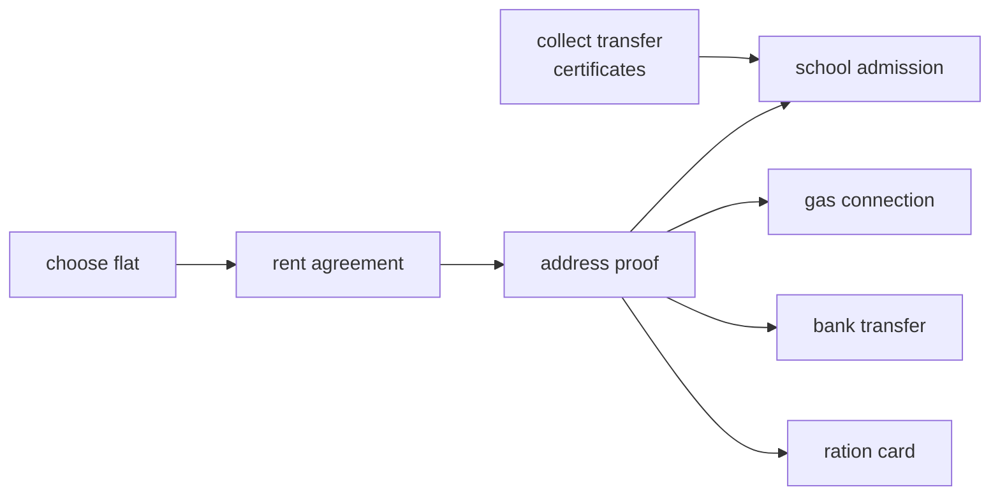

# Course schedule and the dependency family

## 1. What this is, and why they ask it

Yesterday you learned topological sort. Today you learn to recognise it in a problem that never says "graph",
never says "dependency", and often does not obviously involve ordering at all.

That recognition is the entire skill being tested. **Nobody in an interview asks you to topologically sort a
graph.** They ask about courses, or recipes, or the order to rebuild a file system, or which employees can be
promoted, or an alien alphabet, or a set of equations that must be evaluated. The algorithm is twenty lines
you already have. The gap between hearing the problem and knowing which twenty lines to write is where
candidates lose the round.

This lesson is a catalogue: the six shapes this family comes in, the phrasings that signal each, and the two
modelling moves that turn an awkward statement into a graph you can run Kahn's on. It also covers the
variants that look like topological sort and are not, because being confidently wrong here is worse than
being slow.

By the end of this lesson you can hear a problem statement and name the vertices, the edges and the edge's
meaning in one sentence; recognise all six shapes; handle the two hard modelling cases — deriving edges from
comparisons, and dependencies grouped into layers — and know the three near-misses that need something else.

---

## 2. The story

Jaya has moved house eleven times, because her husband's job moves every two or three years, and she no longer
thinks about the city at all.

The eleventh was to Guwahati in June, and her sister rang the week before, worried, because Guwahati is far
and neither of them knows anybody there. Was it not going to be very complicated?

Jaya said what she always says now, which is that it is exactly the same as the last ten.

Every move looks different from the outside. Different landlord, different school, different bank branch,
different gas connection, different set of forms and different people being unhelpful in different ways. Her
sister sees eleven different problems.

What Jaya sees, and has seen since about the fourth move, is one list that she rewrites in a different order.

The school will not give the admission without an address proof. The address proof needs the rent agreement.
The rent agreement needs a flat chosen and a landlord who will sign. The gas connection needs the address
proof too. The bank account transfer needs the address proof. The children's transfer certificates from the
old school have to be collected before the new school will even look at the file, and that can be done
anytime, from anywhere, weeks earlier.

So on the first day in a new city she does not think about schools, which is what everybody worries about. She
thinks about which flat, because six other things are sitting behind it and nothing is sitting behind it.

And she does the transfer certificates before the move, in the old city, because that job needs nothing from
the new place at all and there is no reason for it to be in the way later.

Her sister asked how she keeps track of it, and Jaya said there is nothing to keep track of. You look at what
can be done today with nothing else needed first. You do those. Then you look again, because doing them has
freed up other things. That is all it has ever been.

The eleventh move took nine days. The first one took most of two months, and she remembers standing in a
queue at a school in Jabalpur in 2009 being told to come back with an address proof she had no way of getting
yet, and only understanding on the bus home that she had been going about it in completely the wrong order.

---

## 3. The idea in plain English

Jaya's list is a topological sort, and her sister's mistake is the interview's.

**The algorithm is not the hard part.** Kahn's is twenty lines and you wrote it
[yesterday](../day-134-topological-sort/README.md): count in-degrees, queue everything at zero, pop and
decrement, and if fewer than `n` come out there is a cycle. Nothing today changes that.

**The hard part is hearing "topological sort" in a sentence that does not contain either word.** That is what
Jaya has and her sister has not: eleven different-looking situations, one shape underneath.

**The recognition question, in one line:** *are there things, and rules saying one must come before another?*
If yes, it is this family, whatever the story is about.

**And the two sentences you say before writing anything:** "A vertex is ___. An edge from A to B means A must
happen before B." If you can finish both, the code is mechanical. If you cannot, no amount of coding will
help.

**The six shapes.** Almost every problem in this family is one of these:

**1. Can it be done at all?** — "Can all courses be finished?" You need only the boolean. Kahn's, and check
whether all `n` came out. LeetCode 207.

**2. Give me an order.** — "In what order should these be installed?" The same pass, returning the list.
LeetCode 210.

**3. Give me a *specific* order.** — smallest lexicographically, or one that satisfies a secondary preference.
Same algorithm, a heap instead of a queue.

**4. Give me a schedule, not an order.** — "What is the minimum time to finish everything?" Process one whole
level at a time, and the number of levels is the answer when every task takes the same time. When durations
differ, one pass in topological order computing `finish[v] = duration[v] + max(finish of dependencies)` gives
the true critical path. **This is the shape most people do not spot**, and it is worth more than the others
because it is what real systems need.

**5. Is the order unique?** — "Can this sequence be reconstructed?" One extra check: the queue must never hold
more than one vertex, because two available vertices means two valid orders. LeetCode 444.

**6. Derive the edges from something else, then sort.** — "Here are words in an unknown alphabet; find the
letter order." The graph is not given; you have to build it from comparisons. This is the hardest of the six
and the modelling *is* the problem.

**Now the two modelling moves that turn awkward statements into graphs.**

**Move one: edges come from adjacent pairs, not all pairs.** When ordering information arrives as a sorted
list, compare each item with the *next* one, and take the **first** position where they differ. That single
character pair is one edge. Everything after the first difference tells you nothing, and comparing
non-adjacent pairs adds only edges that are already implied. **Both mistakes are common and both produce wrong
answers rather than errors.**

**Move two: two levels of dependency need two sorts.** Some problems have items that depend on items, *and*
groups that depend on groups — tasks within projects, courses within departments. The move is to sort the
groups among themselves, sort the items within each group, and then concatenate. **Two topological sorts,
nested**, and the tell is any problem where things belong to categories that also have an order.

**And the three near-misses, which look like this family and are not:**

- **Undirected "dependencies".** If the relation is symmetric — "these two cannot be scheduled together" —
  that is graph colouring or bipartite checking, not ordering.
- **Weighted shortest path.** "The cheapest order" with costs on the edges is Dijkstra's territory, not
  Kahn's. But note the exception: **on a DAG, longest and shortest path are both one linear pass in
  topological order**, which is faster than Dijkstra and handles negative weights.
- **Cyclic by nature.** Some real dependency graphs genuinely have cycles — mutually recursive modules — and
  the answer is not "impossible", it is to find the strongly connected components, collapse each into one
  super-vertex, and topologically sort the result. **That collapsed graph is always acyclic**, and it is the
  right answer when the domain allows cycles.

---

## 4. The picture

Jaya's move, as a DAG:



**What to notice.** `choose flat` and `collect transfer certificates` both have in-degree zero, so both can
start immediately — and the transfer certificates can be done in the *old* city, weeks earlier, which is
exactly what "in-degree zero" means in a domain. `address proof` has out-degree four: it blocks the most, so
it is the thing to hurry. **In-degree tells you what can start; out-degree tells you what to prioritise.**

The six shapes on one graph:

```
graph:  A -> C,  B -> C,  C -> D,  C -> E,  D -> F,  E -> F

1. possible?          yes (6 of 6 emitted)
2. an order           [A, B, C, D, E, F]
3. smallest order     [A, B, C, D, E, F]     (heap instead of queue)
4. schedule           [[A,B], [C], [D,E], [F]]   -> 4 levels, not 6 steps
                      widest level = 2 -> two workers is enough
5. unique?            NO — the queue held {A,B} and {D,E}
6. (edges given)      n/a here

with durations A=2 B=5 C=1 D=4 E=2 F=3:
   finish[A]=2  finish[B]=5
   finish[C]=1+max(2,5)=6
   finish[D]=4+6=10   finish[E]=2+6=8
   finish[F]=3+max(10,8)=13
   critical path = 13, and it runs B -> C -> D -> F
```

**What to notice on the last block.** With equal durations the answer was 4 levels. With real durations it is
13 units along a specific chain, and that chain — `B → C → D → F` — is the thing to shorten if you want the
whole job faster. **Levels are an approximation; the `max` recurrence is the real answer.**

And the alien-alphabet modelling, which is where people go wrong:

```
words (sorted in the unknown alphabet):
    "wrt", "wrf", "er", "ett", "rftt"

compare ADJACENT pairs, take the FIRST difference:

  wrt / wrf   ->  position 2:  t before f      edge t -> f
  wrf / er    ->  position 0:  w before e      edge w -> e
  er  / ett   ->  position 1:  r before t      edge r -> t
  ett / rftt  ->  position 0:  e before r      edge e -> r

  result: w -> e -> r -> t -> f

WRONG version 1: compare all pairs
  "wrt" vs "ett" would give w -> e, which is already implied. Harmless but wasteful.

WRONG version 2: take every differing position
  "wrt" vs "wrf" would also give... nothing else, they match until position 2.
  But "abc" vs "bad" would give a->b AND b->a AND c->d.
  The last two are FALSE. Only the first difference is information.

THE EDGE CASE: ["abc", "ab"]
  a prefix cannot come after the longer word. This input is INVALID.
  Return "" rather than ignoring it.
```

---

## 5. The code, built step by step

Everything here reuses the same core. Start with the one function the whole family shares.

```python
from collections import deque

def kahn(graph: dict, vertices: list) -> list | None:
    """A valid order over `vertices`, or None if there is a cycle."""
    in_degree = {v: 0 for v in vertices}
    for vertex in vertices:
        for neighbour in graph.get(vertex, ()):
            in_degree[neighbour] += 1
    queue = deque(v for v in vertices if in_degree[v] == 0)
    order = []
    while queue:
        vertex = queue.popleft()
        order.append(vertex)
        for neighbour in graph.get(vertex, ()):
            in_degree[neighbour] -= 1
            if in_degree[neighbour] == 0:
                queue.append(neighbour)
    return order if len(order) == len(vertices) else None
```

Taking `vertices` as an explicit list rather than deriving it from the graph is what makes this reusable: the
caller knows which vertices exist, and a vertex in no edge must still be counted. That is the phantom-cycle
bug from yesterday, fixed once.

**Shape 1 and 2 are now one-liners.**

```python
def can_finish(n: int, prerequisites: list[list[int]]) -> bool:
    graph = {v: [] for v in range(n)}
    for course, needs_first in prerequisites:
        graph[needs_first].append(course)         # needs_first BEFORE course
    return kahn(graph, list(range(n))) is not None
```

Read that append out loud: the input says "to take `course`, first take `needs_first`", so the edge points
**from** the prerequisite. Say it as a sentence, then write the line.

**Shape 4, the schedule with real durations**, which is the one worth knowing:

```python
def minimum_time(n: int, relations: list[list[int]], time: list[int]) -> int:
    graph = {v: [] for v in range(n)}
    in_degree = [0] * n
    for before, after in relations:
        graph[before - 1].append(after - 1)
        in_degree[after - 1] += 1

    finish = [0] * n
    queue = deque(v for v in range(n) if in_degree[v] == 0)
    for v in queue:
        finish[v] = time[v]                       # nothing to wait for
    while queue:
        vertex = queue.popleft()
        for neighbour in graph[vertex]:
            finish[neighbour] = max(finish[neighbour], finish[vertex] + time[neighbour])
            in_degree[neighbour] -= 1
            if in_degree[neighbour] == 0:
                queue.append(neighbour)
    return max(finish)
```

The `max` is the whole algorithm: a task can only start once its *slowest* dependency is done. And the reason
this works in one pass is the topological order — **when a vertex is dequeued, every dependency's `finish` is
already final**, because they were all dequeued before it. That sentence is the general principle:
**any DP over a DAG is one pass in topological order.**

**Shape 5, uniqueness:**

```python
def order_is_unique(graph: dict, vertices: list) -> bool:
    in_degree = {v: 0 for v in vertices}
    for vertex in vertices:
        for neighbour in graph.get(vertex, ()):
            in_degree[neighbour] += 1
    queue = deque(v for v in vertices if in_degree[v] == 0)
    seen = 0
    while queue:
        if len(queue) > 1:
            return False                          # a choice exists -> not unique
        vertex = queue.popleft()
        seen += 1
        for neighbour in graph.get(vertex, ()):
            in_degree[neighbour] -= 1
            if in_degree[neighbour] == 0:
                queue.append(neighbour)
    return seen == len(vertices)
```

Three lines added. Two available vertices at any moment means two valid orders, so the order is not unique.

**Shape 6, deriving the edges**, which is the hardest modelling:

```python
def alien_order(words: list[str]) -> str:
    letters = {c for word in words for c in word}
    graph: dict[str, list[str]] = {c: [] for c in letters}

    for first, second in zip(words, words[1:]):        # ADJACENT pairs only
        for a, b in zip(first, second):
            if a != b:
                graph[a].append(b)                     # the FIRST difference only
                break
        else:
            if len(first) > len(second):
                return ""                              # "abc" then "ab" is invalid
    order = kahn(graph, sorted(letters))
    return "".join(order) if order else ""
```

The `for ... else` is doing real work: `else` runs when the loop finished without `break`, meaning one word is
a prefix of the other. If the *longer* one came first, the input contradicts itself and there is no valid
alphabet. **That branch is the hidden test.**

**The two-level version**, for when items belong to ordered groups:

```python
def sort_in_groups(items, group_of, item_deps, group_deps):
    """Sort groups among themselves, sort items within each group, concatenate."""
    group_order = kahn(group_deps, sorted(set(group_of.values())))
    if group_order is None:
        return None
    result = []
    for group in group_order:
        members = [i for i in items if group_of[i] == group]
        inner = kahn(item_deps, members)
        if inner is None:
            return None
        result.extend(inner)
    return result
```

**Two sorts, nested.** A cycle at either level makes the whole thing impossible, and the tell for this shape
is any problem where things belong to categories that also have an order between them.

### The complete solution

```python
"""The dependency family: one Kahn's, six shapes."""

from __future__ import annotations

import heapq
from collections import deque


def kahn(graph: dict, vertices: list) -> list | None:
    """Shape 1 and 2: a valid order, or None on a cycle."""
    in_degree = {v: 0 for v in vertices}
    for vertex in vertices:
        for neighbour in graph.get(vertex, ()):
            if neighbour in in_degree:
                in_degree[neighbour] += 1
    queue = deque(v for v in vertices if in_degree[v] == 0)
    order = []
    while queue:
        vertex = queue.popleft()
        order.append(vertex)
        for neighbour in graph.get(vertex, ()):
            if neighbour not in in_degree:
                continue
            in_degree[neighbour] -= 1
            if in_degree[neighbour] == 0:
                queue.append(neighbour)
    return order if len(order) == len(vertices) else None


def smallest_order(graph: dict, vertices: list) -> list | None:
    """Shape 3: lexicographically smallest. A heap instead of a queue."""
    in_degree = {v: 0 for v in vertices}
    for vertex in vertices:
        for neighbour in graph.get(vertex, ()):
            in_degree[neighbour] += 1
    heap = [v for v in vertices if in_degree[v] == 0]
    heapq.heapify(heap)
    order = []
    while heap:
        vertex = heapq.heappop(heap)
        order.append(vertex)
        for neighbour in graph.get(vertex, ()):
            in_degree[neighbour] -= 1
            if in_degree[neighbour] == 0:
                heapq.heappush(heap, neighbour)
    return order if len(order) == len(vertices) else None


def critical_path(n: int, edges: list[tuple[int, int]], duration: list[int]) -> int:
    """Shape 4: earliest finish for everything. One pass, a max per edge."""
    graph: dict[int, list[int]] = {v: [] for v in range(n)}
    in_degree = [0] * n
    for before, after in edges:
        graph[before].append(after)
        in_degree[after] += 1
    finish = [0] * n
    queue = deque()
    for v in range(n):
        if in_degree[v] == 0:
            finish[v] = duration[v]
            queue.append(v)
    done = 0
    while queue:
        vertex = queue.popleft()
        done += 1
        for neighbour in graph[vertex]:
            finish[neighbour] = max(finish[neighbour], finish[vertex] + duration[neighbour])
            in_degree[neighbour] -= 1
            if in_degree[neighbour] == 0:
                queue.append(neighbour)
    return max(finish) if done == n else -1


def is_unique(graph: dict, vertices: list) -> bool:
    """Shape 5: is there exactly one valid order?"""
    in_degree = {v: 0 for v in vertices}
    for vertex in vertices:
        for neighbour in graph.get(vertex, ()):
            in_degree[neighbour] += 1
    queue = deque(v for v in vertices if in_degree[v] == 0)
    seen = 0
    while queue:
        if len(queue) > 1:
            return False
        vertex = queue.popleft()
        seen += 1
        for neighbour in graph.get(vertex, ()):
            in_degree[neighbour] -= 1
            if in_degree[neighbour] == 0:
                queue.append(neighbour)
    return seen == len(vertices)


def alien_order(words: list[str]) -> str:
    """Shape 6: derive the edges from adjacent pairs, then sort."""
    letters = sorted({c for word in words for c in word})
    graph: dict[str, list[str]] = {c: [] for c in letters}
    for first, second in zip(words, words[1:]):
        for a, b in zip(first, second):
            if a != b:
                graph[a].append(b)
                break
        else:
            if len(first) > len(second):
                return ""
    order = kahn(graph, letters)
    return "".join(order) if order else ""


if __name__ == "__main__":
    # Jaya's move.
    tasks = ["tc", "flat", "rent", "addr", "school", "gas", "bank"]
    deps = {
        "tc": ["school"], "flat": ["rent"], "rent": ["addr"],
        "addr": ["school", "gas", "bank"], "school": [], "gas": [], "bank": [],
    }
    print("order   :", kahn(deps, tasks))
    print("smallest:", smallest_order(deps, tasks))
    print("unique? :", is_unique(deps, tasks))

    # Shape 4, with durations.
    n = 6
    edges = [(0, 2), (1, 2), (2, 3), (2, 4), (3, 5), (4, 5)]
    print("critical:", critical_path(n, edges, [2, 5, 1, 4, 2, 3]))

    # Shape 6.
    print("alphabet:", alien_order(["wrt", "wrf", "er", "ett", "rftt"]))
    print("invalid :", repr(alien_order(["abc", "ab"])))
    print("cyclic  :", repr(alien_order(["z", "x", "z"])))
```

Running it:

```
order   : ['tc', 'flat', 'rent', 'addr', 'school', 'gas', 'bank']
smallest: ['flat', 'rent', 'addr', 'bank', 'gas', 'tc', 'school']
unique? : False
critical: 13
alphabet: wertf
invalid : ''
cyclic  : ''
```

Three things to look at. `order` and `smallest` differ and both are valid — the smallest one takes `flat`
before `tc` because `f` sorts before `t`, and once `addr` is done it takes `bank` and `gas` before going back
for `tc`. Check it against the property rule rather than against each other: in both lists, every task appears
after everything it depends on. `unique?` is `False`, correctly: `tc` and `flat` are both available at the
start, so there was a choice.

`critical` is 13, matching the hand calculation in section 4 — the chain `B → C → D → F` at 5 + 1 + 4 + 3.

And the last two lines are the shape-6 edge cases: a prefix in the wrong order and a genuine contradiction
both return the empty string, and if your version returns `"zx"` for the third one it is not detecting the
cycle.

---

## 6. What it costs

**Everything in this family is one Kahn's pass.**

```
building the graph      one pass over the input      O(E)
in-degrees              O(V + E)
the main loop           each vertex once, each edge once
                        -----------------------------------
                        O(V + E) time, O(V) space
```

**Per shape:**

```
1. possible?            O(V + E)
2. an order             O(V + E)
3. smallest order       O((V + E) log V)      heap operations
4. schedule / levels    O(V + E)              same pass
4b. critical path       O(V + E)              one max per edge
5. unique?              O(V + E)              one length check per iteration
6. derive + sort        O(total input chars + V + E)
```

**Shape 3 is the only one that costs more**, and it is a `log V` factor:

```
V = 100,000, E = 200,000
plain Kahn's    300,000 steps
heap version    300,000 x 17 = ~5,000,000 steps
```

**Shape 6's cost is in the derivation, not the sort:**

```
alien dictionary: n words, average length L
building edges    n comparisons, each up to L characters   O(n x L)
the alphabet      at most 26 vertices, at most n-1 edges
the sort itself   O(26 + n)  ->  trivial
```

```
n = 10,000 words of length 8
edge building    80,000 character comparisons
the sort         ~10,000 steps
```

**The graph is tiny and the input is not**, which is the opposite of most graph problems and worth noticing.

**Shape 4's two versions:**

```
levels (equal durations)     number of levels = critical path
critical path (real times)   finish[v] = duration[v] + max(finish of deps)
```

```
1,000 tasks, average 5 s, 12 levels, longest chain 8 tasks averaging 9 s
serial total            5,000 s = 83 min
levels approximation    12 x 5  = 60 s
true critical path      8 x 9   = 72 s
```

**Levels under-estimate when durations vary**, which is why the `max` version is the one to use when you have
real numbers. Both are one pass.

**The two-level version:**

```
G groups, N items
sort the groups         O(G + group edges)
sort within each group  sum over groups = O(N + item edges)
                        ------------------------------------
                        O(G + N + all edges)  -> still linear
```

**Counting all valid orders, which is the shape people ask about and should not:**

```
counting                exponential (it is #P-complete)
n vertices, no edges    n! orders
n = 12                  479,001,600
bitmask DP              O(2^n x n), fine up to n ~ 20
```

**Space at scale:**

```
V = 200,000, E = 500,000
in-degree as a list      ~1.6 MB
adjacency as lists       ~1.6 MB of objects + ~4 MB of entries
queue at peak            up to V
output                   up to V
                         -> tens of megabytes, nowhere near a limit
```

**And the reason to prefer Kahn's here specifically:** none of these six shapes recurses, so a dependency
chain 100,000 long is fine. The DFS version would need the iterative conversion for every one of them.

---

## 7. The traps

### Reversing the edge direction

The near-miss, and the most expensive one, because there is no error:

```python
for course, prerequisite in prerequisites:
    graph[course].append(prerequisite)          # backwards
```

```
>>> can_finish(2, [[1, 0]])
True                                             # correct by luck
>>> topological_order(4, [[1,0],[2,1],[3,2]])
[3, 2, 1, 0]                                     # every course before its prerequisite
```

The result is a perfectly valid topological order **of the reversed graph**, which is exactly wrong. And for
shape 1 the boolean answer is even the same, because a graph has a cycle if and only if its reverse does — so
the bug is invisible until shape 2.

**The defence: write the meaning as a sentence in a comment, then check on a two-item example by hand.**

### Building from the pairs instead of the vertex list

```python
graph = defaultdict(list)
for a, b in prerequisites:
    graph[a].append(b)
order = kahn(graph, list(graph.keys()))
```

A course with no prerequisites and no dependents never becomes a key:

```
>>> can_finish(5, [[1, 0]])
False                                            # phantom cycle
```

`len(order) == len(vertices)` cannot hold when three vertices are not in the structure. **This reports a cycle
on an acyclic graph**, which is the most confusing possible failure and takes ages to find.

### Comparing all pairs in the derivation problems

```python
for first in words:
    for second in words:
        ...                                      # every pair
```

Adds only implied edges — harmless but `O(n²)` — and, worse, invites the second mistake:

```python
for a, b in zip(first, second):
    if a != b:
        graph[a].append(b)                       # no break: EVERY differing position
```

```
>>> alien_order(["abc", "bad"])
''                                               # reports a contradiction
```

`a→b` from position 0 is real. `b→a` from position 1 is **false**, and together they are a cycle. **Only the
first difference is information**, because after that the words have already been distinguished.

### Missing the prefix case

```python
for a, b in zip(first, second):
    if a != b:
        graph[a].append(b)
        break
# no else clause
```

```
>>> alien_order(["abc", "ab"])
'abc'                                            # should be ''
```

`zip` stops at the shorter word, no difference is found, and the invalid input is silently accepted. A longer
word cannot sort before its own prefix in any alphabet. **The `for ... else` branch is the hidden test on this
problem.**

### Using levels when durations vary

```python
return len(levels(graph, n))                     # "the minimum time"
```

Levels count *rounds*, and a round takes as long as its slowest member:

```
level 0: one task of 100 s and nine tasks of 1 s
levels answer:  1 round
real answer:    100 s
```

The level count is only the answer when every task takes the same time. **With real durations, use the `max`
recurrence.**

### Assuming a cycle means "impossible"

```python
if kahn(graph, vertices) is None:
    return "circular dependency: cannot proceed"
```

For courses, correct. For a module graph where mutual recursion is legal, wrong — the answer is to collapse
each strongly connected component into one super-vertex and sort the resulting DAG, which is always acyclic.
**Ask whether cycles are an error in this domain or a fact about it**, because the two need different code.

### `RecursionError` from the DFS version

```
Traceback (most recent call last):
  File "deps.py", line 22, in visit
    visit(neighbour)
  [Previous line repeated 995 more times]
RecursionError: maximum recursion depth exceeded
```

Any of these six shapes written with a recursive DFS, on a chain of 100,000 dependencies. Kahn's does not
recurse, which is the fourth reason to default to it.

---

## 8. In the interview

### How it gets asked

None of these say "graph" or "topological":

- *"Can all courses be finished? Now give me a valid order."*
- *"In what order should these packages be installed?"*
- *"Given a recipe's steps and which must come before which, how long will it take with three cooks?"*
- *"Here are some words sorted in an unknown language. What is the alphabet?"*
- *"Can this sequence be uniquely reconstructed from these subsequences?"*
- *"Sort these items so that items in the same group are together and all dependencies are respected."*
- *"Given a spreadsheet's formulas, in what order do you recalculate the cells?"*

**The tell, in one line: things, plus rules that one must come before another.**

### The first ninety seconds

> "This is dependency ordering — a topological sort — and I would name the model before writing anything,
> because that is where these go wrong.
>
> **A vertex is a course. An edge from A to B means A must be taken before B.** The input says 'to take
> `course`, first take `prerequisite`', so the edge points **from** the prerequisite to the course. I want to
> say that as a sentence and check it on a two-course example, because reversing it produces a perfectly valid
> order of the reversed graph — no error, and for the yes/no version even the same answer, so it is invisible
> until someone reads the output.
>
> Then Kahn's: in-degree is how many prerequisites a course still has outstanding. Everything at zero goes
> into a queue. Pop, output, decrement the in-degree of everything it unlocks, queue anything that reaches
> zero. **If fewer than `n` come out, the leftovers are in a cycle** — a set of courses each waiting on
> another — so the same pass answers both questions.
>
> Two setup details. I build the structure from the full list of `n` courses rather than from the prerequisite
> pairs, because a course with no prerequisites and no dependents must still exist — otherwise the count check
> fails and I report a cycle that is not there. And I would use Kahn's rather than a recursive DFS, because a
> long prerequisite chain overflows the stack and Kahn's never recurses.
>
> `O(V + E)` time, `O(V)` space.
>
> **And before I code, one question: do you want an order, or a schedule?** If these courses can be taken in
> parallel — several per semester — then processing the queue one whole level at a time gives me the number of
> semesters, which is a much more useful answer than a list. That is a two-line change."

### The follow-ups

**"Now some courses take longer than others. Minimum time to finish everything?"**

> "Then the level count is wrong, and I would say why: levels count rounds, and a round takes as long as its
> slowest member, so a level containing one ten-week course and nine one-week courses is ten weeks, not one.
>
> The correct version is a single pass in topological order computing, for each course, `finish[c] = time[c] +
> max(finish of everything it depends on)`. The answer is the maximum finish across all courses.
>
> **The reason one pass is enough is the topological order itself:** when I dequeue a course, every one of its
> prerequisites has already been dequeued, so every `finish` I need is already final. Nothing is ever revised.
>
> That is the general principle and I would state it, because it comes up constantly: **any DP over a DAG is
> one pass in topological order.** Longest path, shortest path, counting paths, earliest start, latest start —
> all the same shape, differing only in what you accumulate. And it handles negative weights, which Dijkstra
> does not, because the ordering removes the need to ever reconsider a vertex.
>
> The follow-up to the follow-up is usually 'which courses are on the critical path', and that is a backward
> pass computing the latest each course could start without delaying the end — the difference between earliest
> and latest is the slack, and zero slack means critical."

**"Here are words in an unknown alphabet. Find the letter order."**

> "The sort is routine; the modelling is the problem, and there are three rules I would state before writing
> anything.
>
> **One: compare adjacent pairs only.** Non-adjacent pairs give me edges that are already implied by the chain
> of adjacent ones, so they add cost and no information.
>
> **Two: take the first difference only, then stop.** Once two words differ at a position, everything after
> that position tells me nothing about the alphabet — the words are already ordered by that one character.
> Taking every differing position produces *false* edges: `abc` before `bad` would give `a→b` from position
> zero, which is true, and `b→a` from position one, which is not, and together they are a cycle that is not
> there.
>
> **Three: the prefix case.** If one word is a prefix of the other and the *longer* one comes first — `abc`
> then `ab` — the input is contradictory in every possible alphabet, and I return empty. `zip` stops at the
> shorter word so no difference is found and this passes silently. In Python that is the `else` clause on the
> `for` loop, and it is the hidden test on this problem.
>
> Then Kahn's over the letters that actually appear. A cycle means the words contradict each other. Multiple
> valid alphabets are possible and any is acceptable unless they ask for the smallest, in which case it is a
> heap.
>
> Cost is `O(total characters)` to build and trivial to sort, since the alphabet is at most 26 vertices — which
> is the unusual thing about this problem: **the input is large and the graph is tiny.**"

**"How would you know if there is more than one valid order?"**

> "Three lines inside the same loop: if the queue ever holds more than one vertex, there is a choice, so the
> order is not unique.
>
> The reason that is exactly right is that a choice at any point produces at least two distinct valid orders —
> take either of the two available vertices and both completions are legal. Conversely, if the queue holds
> exactly one vertex at every step, there was never a decision, so the order is forced.
>
> This is what 'can the sequence be uniquely reconstructed' problems are asking, and the framing usually hides
> it: you are given a set of subsequences that a hidden sequence must satisfy, you build the ordering
> constraints from consecutive pairs in each subsequence, and then the question is whether the topological
> order is unique.
>
> The related question is 'how many valid orders are there', and I would flag that as a genuinely different
> problem — it is #P-complete, exponential in general, and `n` vertices with no edges have `n!` orders. For
> small `n` a bitmask DP over subsets does it in `O(2^n × n)`, which is fine to about 20."

**"Some of these modules genuinely import each other. Now what?"**

> "Then a cycle is not an error and 'impossible' is the wrong answer, so I would ask that first — whether
> cycles are a bug in the input or a fact about the domain.
>
> If they are a fact, the move is to **collapse each strongly connected component into a single super-vertex**.
> A strongly connected component is a maximal set where every member can reach every other one following the
> arrows, which is exactly a group of mutually dependent modules. Tarjan's or Kosaraju's finds all of them in
> one linear pass.
>
> The graph of components is **always acyclic** — if two components had a cycle between them they would be one
> component — so I topologically sort *that*, and the result is a build order where each step is 'compile this
> group of mutually recursive modules together'. Which is exactly what a compiler does with mutually recursive
> functions.
>
> That is a genuinely useful answer for build systems and package managers, and it is the honest one for
> languages where mutual imports are legal. I would not write Tarjan's from memory unprompted — the low-link
> bookkeeping is fiddly — but naming it, saying it is one linear DFS, and explaining why the condensed graph is
> acyclic is the substance."

### The model answer

*"A spreadsheet. Cells contain values or formulas referring to other cells. When a cell changes, work out
which cells need recalculating and in what order. Handle circular references."*

> "This is the dependency family, and it has three parts: the ordering, the *incremental* part, and the cycle
> handling — and the second is what makes it a real problem rather than a textbook one.
>
> **The model.** A vertex is a cell. **An edge from A to B means A must be computed before B** — so if `B3 =
> A1 + A2`, there are edges `A1 → B3` and `A2 → B3`. The direction is 'feeds into', not 'depends on', because
> I want to traverse forwards from a changed cell to everything affected. I would write that sentence down,
> because the formula text naturally reads the other way and it is exactly the reversal trap.
>
> **The full recalculation is Kahn's over the whole sheet**, and it is `O(V + E)` where `V` is the number of
> cells with formulas and `E` is the number of references. For a sheet with 50,000 formulas each referring to
> three cells, that is 200,000 steps — a few milliseconds, so a full recalculation is entirely affordable and
> is what I would do on file open.
>
> **But on every keystroke it is not, and that is the actual design.** When one cell changes, only its
> *descendants* need recomputing. So: a forward traversal from the changed cell to collect the affected set —
> which is typically a handful of cells, not fifty thousand — and then a topological sort restricted to that
> subgraph. **The dirty set is usually tiny and the sheet is large**, so this is the difference between
> instant and laggy, and it is the reason spreadsheets feel fast.
>
> The subtlety is that the restricted sort must still respect dependencies from *outside* the dirty set. A
> dirty cell may depend on a clean one, which is fine — that value is already final — so when computing
> in-degrees for the subgraph I only count edges whose source is also dirty. That is one condition and it is
> easy to get wrong.
>
> **Circular references are a fact about spreadsheets, not a bug**, because users create them constantly and
> some are intentional — iterative calculations for goal-seeking. So the answer is not to refuse. It is:
> detect the strongly connected components; any component with more than one cell, or a cell referring to
> itself, is a cycle. Then, depending on the mode, either mark those cells with a circular-reference error and
> compute everything else normally, or, if iterative calculation is enabled, run that component repeatedly
> until it converges or hits an iteration cap.
>
> **The important product decision there is that a cycle in one corner must not break the rest of the sheet.**
> Everything not downstream of the cycle is perfectly computable and should be computed. That falls out of
> the component approach naturally: collapse each component, sort the condensed DAG, and only the components
> that are actually cyclic get the error treatment.
>
> **What I would store.** For each cell, its list of precedents (what it reads) and its list of dependents
> (what reads it). Both directions, because I need precedents to evaluate and dependents to propagate. Editing
> a formula means removing the old precedent edges and adding new ones, which is why I keep both lists rather
> than deriving one from the other on the fly.
>
> **The number that justifies it all:** a full recalculation of 50,000 formulas is a few milliseconds, but at
> 60 frames a second while someone drags a fill handle across a thousand cells, that is a thousand full
> recalculations. The dirty-set version turns that into a thousand tiny ones. **Same algorithm, applied to the
> right subgraph** — and noticing that the subgraph is the design is what makes this a good answer rather than
> a recital."

---

## 9. Recall card

**The recognition question: things, plus rules that one must come before another.** Then two sentences before
any code: "A vertex is ___" and "An edge from A to B means A must happen before B."

**Six shapes, one Kahn's:** possible? / an order / the *smallest* order (heap) / a **schedule** (levels, or
`finish[v] = duration[v] + max(deps)`) / is it **unique**? (queue never holds more than one) / derive the
edges then sort.

**Two modelling moves:** edges come from **adjacent pairs and the first difference only** — every other
position is a false edge; and **two levels of dependency need two nested sorts**.

**Any DP over a DAG is one pass in topological order** — longest path, shortest path, earliest finish, path
counts — because every dependency is final by the time you reach a vertex. Handles negative weights, unlike
Dijkstra.

**Three silent bugs:** reversed edge direction (a valid order of the wrong graph, and identical for the
boolean version); building from the pairs so isolated vertices vanish (a **phantom cycle**); and using level
count as "minimum time" when durations vary.
