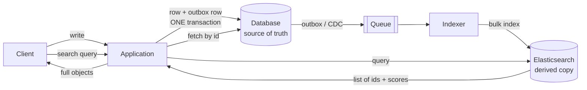

# Elasticsearch in a design

## 1. What this is, and why they ask it

Yesterday you learned what an [inverted index](../day-135-dependency-problems/README.md) is. Today is the
box on the architecture diagram: where the search cluster sits, what feeds it, what it is allowed to answer,
and what happens when it disagrees with the database.

The single most important thing about that box is what it is **not**. Elasticsearch is not your database. It
is a derived copy of your data, arranged for a different kind of question, and it can be rebuilt from scratch
at any time. Treating it as a source of truth is the mistake this lesson exists to prevent, and it is a
mistake that is very expensive to discover in production.

They ask this because "where does Elasticsearch sit, and how does it stay up to date?" is a design question
with a right answer and several tempting wrong ones. The tempting wrong ones are: write to both from the
application, use it as the primary store because it is fast, and let it return the data itself rather than
just identifiers. **Each of those works in a demo and fails within a year.**

By the end of this lesson you can draw the box and its arrows, choose a sync mechanism and defend it, size a
cluster from a document count, explain shards and replicas well enough to pick numbers, handle a reindex
without downtime, and say precisely what the cluster is allowed to be authoritative about.

---

## 2. The story

Sudha's shop sells sarees, and there are about four thousand of them in the storeroom at the back.

The storeroom is organised by supplier and by the date they came in, because that is what matters when you are
paying bills and checking what arrived. Racks with numbers. Nobody who comes into the shop ever sees it, and
nobody would find anything in it.

The front of the shop is a different thing entirely.

There are two windows and a long shelf behind the counter, and what goes there is chosen and arranged
completely differently: by colour, by occasion, by what is selling this month. Reds and maroons together for
wedding season. The lighter cottons at eye level in April. Whatever is in the film everybody is watching, at
the front.

The boy who works there, Vinod, spends the first forty minutes of every morning moving things between the two.
New stock comes out of the storeroom and into the window if it fits what the window is for. Things that
stopped moving go back. If a saree is sold, it comes out of the window that day, or somebody points at it and
asks for it and it is not there.

Two rules, and Sudha is very firm about both.

**The window is never the record.** If somebody asks whether they have the green Kanjivaram with the gold
border, Vinod does not say yes because he can see one in the window. He goes and checks the rack, because the
window is a display and the storeroom is the truth. Twice, years ago, somebody sold something that had already
been sold, because the window still had one out.

**And the window can be rebuilt.** In 2019 a pipe burst overnight and the entire front of the shop had to be
emptied and cleaned. Nothing was lost, because everything in the window also existed in the storeroom. It took
Vinod a day and a half to build the display again from scratch, and he grumbled the whole time, and at the end
of it the shop was exactly as it had been.

If the storeroom had burnt, the shop would have closed.

The thing Sudha will not do, and she has been asked, is keep the *only* copy of anything in the window. A
supplier once suggested leaving a consignment out front because it was selling fast and there was no space at
the back. She said no, and when he pushed she said it again without explaining, because she had explained it
to enough people already.

---

## 3. The idea in plain English

The storeroom is the database, the window is Elasticsearch, and Sudha's two rules are the whole design.

**Elasticsearch is a derived copy, arranged for a different question.** The database is organised for
correctness and for lookups by identifier. The search cluster is organised for "find things matching these
words, ranked". Same data, different arrangement, different purpose.

**Rule one: it is never the source of truth.** Anything authoritative — the price, the stock count, whether an
order exists — is answered by the database. **Search returns identifiers, and the application fetches the real
objects from the database.** That is the "check the rack" rule, and it buys you two things: a stale index can
show a slightly wrong *set* of results but never wrong *content*, and a deleted item is filtered out when you
try to fetch it.

**Rule two: it must be rebuildable from scratch.** If the cluster is lost entirely, you re-index from the
database and you are back. That single property is what makes the whole arrangement safe, and it means you
never need to treat search backups as critical.

**Its consequence is worth stating: never store data only in Elasticsearch.** Not user-generated content, not
audit records, not anything you cannot recreate. The moment something exists only there, it stops being a
derived copy and becomes a database you are operating badly.

**Now the box and its arrows.** Writes go to the database. Something moves them to the index. Reads for search
go to the cluster, come back as ids, and are hydrated from the database. That is the shape, and everything
else is a detail of the "something".

**The three ways to feed it, and one is wrong.**

**Dual write** — the application writes to the database and to the index in the same request handler. Simple,
and broken: there is no transaction across two systems, so a crash between the two leaves them permanently
inconsistent, and it will happen. **Name it to reject it.**

**Outbox** — the application writes the row and an outbox record in one database transaction; a separate
consumer reads the outbox and indexes. Atomic at the source, at-least-once delivery, idempotent because
indexing is keyed by document id. This is the [day 121](../day-121-trie-operations/README.md) pattern and it
is what most teams should build.

**Change data capture** — a tool reads the database's replication log and emits change events. No application
changes at all, catches writes from anywhere including manual ones and other services, and it is the more
robust option at the cost of another moving part.

**Whichever you choose, the index will drift, so a reconciliation job is not optional.** Consumers die, deploys
skip records, someone runs an UPDATE by hand. Over months the two diverge, and the only way to know is to
compare periodically and re-index the differences.

**Shards and replicas are the two numbers you have to pick.** A **shard** is a self-contained piece of the
index; the documents are divided across shards by a hash of the document id. A **replica** is a copy of a
shard on another node, serving reads and taking over if the primary fails.

- **More shards means more parallelism on write and more overhead on read**, because every search touches
  every shard and the results are merged.
- **Shard count is fixed when the index is created.** Changing it means reindexing into a new index — which is
  why it is a decision to get roughly right up front, and why aliases exist.
- **Replicas can be changed at any time** and are the lever for read throughput.

**Aliases are how you change anything without downtime.** An **alias** is a name that points at one or more
indices. The application always queries the alias. To change the mapping or the shard count, you build a new
index, re-index into it, and atomically switch the alias. **Never point an application at a concrete index
name**, because the first time you need to change the mapping you will have to take an outage to do it.

**And the thing that decides whether the whole design is honest: staleness.** There is always a window between
the write and the document being searchable — the refresh interval plus queue depth plus indexing time. **A
design that does not say what a user sees inside that window is unfinished**, and the usual answer is that
anything scoped to the user is read from the database, not from search.

---

## 4. The picture

The box and its arrows:



**What to notice.** The database has an arrow into Elasticsearch and Elasticsearch has none back. And the read
path goes **through** the database on the way out — search says *which*, the database says *what*. That is
Vinod checking the rack.

The three sync mechanisms, and where each can break:

```
DUAL WRITE                     OUTBOX                        CDC

app                            app                           app
 |--> DB          (ok)          |--> DB + outbox (one txn)     |--> DB
 |--> ES          (CRASH)       |                              |
                                 outbox -> consumer -> ES        replication log
 DB has it, ES does not.                                          -> connector -> ES
 Nothing knows.                 consumer retries.
 Permanent.                     at-least-once, idempotent.     catches ALL writes,
                                                               including manual ones
```

**What to notice.** Dual write's failure is *permanent and silent* — nothing is retrying, nothing knows. The
other two turn a crash into a delay.

Shards and replicas, made concrete:

```
index "products", 3 primary shards, 1 replica each

  node A          node B          node C
  +--------+      +--------+      +--------+
  | P0     |      | P1     |      | P2     |
  | R2     |      | R0     |      | R1     |
  +--------+      +--------+      +--------+

  a document's shard = hash(doc_id) % 3
  a search hits ALL THREE shards (any copy) and merges the results
  node B dies  ->  R1 on node C is promoted to primary; nothing is lost
```

**What to notice.** A search touches every shard, so more shards means more work per query, not less. Shards
buy you *write* parallelism and the ability to exceed one machine — not faster individual searches.

And the reindex with an alias, which is the operation you must know:

```
  app queries the alias "products"           products -> products_v1

  1. create products_v2 with the new mapping
  2. reindex products_v1 -> products_v2      (minutes to hours)
  3. catch up: replay anything written since step 2 started
  4. atomically switch:  products -> products_v2
  5. delete products_v1 after a safe interval

  the application never changed, and there was no downtime.
```

---

## 5. How it actually works

### The read path, in detail

```
1. user types "brass hinges"
2. app queries ES:  match on title^3 and description, filter category, size 20
3. ES returns:      [{id: 4471, score: 12.4}, {id: 991, score: 9.1}, ...]
4. app fetches:     SELECT * FROM products WHERE id IN (4471, 991, ...)
5. app orders the rows by the score order and returns them
```

Two details that matter in step 4. **Preserve the ranking** — the `IN` clause returns rows in whatever order
the database likes, so you re-sort by the search order in the application. And **a missing row is not an
error**: a product deleted since indexing simply will not come back, and the result list is one item shorter.
That is the deleted-item filter working, and it should be silent.

**The alternative — storing the full document in Elasticsearch and returning it directly — is faster and
worse.** One round trip instead of two, and every stale field is now visible to the user: an old price, a sold
item shown as available. **Store only what you need to search on and filter by, plus the id.**

### Mappings, and the one that bites

A **mapping** is the schema: which fields exist and how each is treated.

```json
{
  "properties": {
    "title":       { "type": "text", "analyzer": "english" },
    "brand":       { "type": "keyword" },
    "price":       { "type": "scaled_float", "scaling_factor": 100 },
    "category_id": { "type": "keyword" },
    "created_at":  { "type": "date" }
  }
}
```

**`text` versus `keyword` is the distinction to know.** `text` is analysed — tokenised, lowercased, stemmed —
and is what you search. `keyword` is stored whole and is what you filter, sort and aggregate on. A brand field
mapped as `text` cannot be aggregated sensibly; a title mapped as `keyword` cannot be searched by word.
**Getting this wrong is the single most common Elasticsearch mistake**, and fixing it requires a reindex.

**Mappings are mostly immutable.** You can add a field. You cannot change an existing field's type. That is
why aliases exist and why the reindex procedure is something to know rather than look up under pressure.

**And dynamic mapping is a trap at scale.** By default Elasticsearch guesses the type of a new field, so a
document with an unexpected key silently creates a field. On a system indexing user-supplied JSON this produces
**mapping explosion** — thousands of fields, enormous cluster state, and eventually a cluster that cannot
recover. Set `dynamic: strict` on anything user-influenced.

### Queries: filter versus query context

```json
{
  "query": {
    "bool": {
      "must":   [ { "match": { "title": "brass hinges" } } ],
      "filter": [ { "term":  { "category_id": "hardware" } },
                  { "range": { "price": { "lte": 500 } } } ]
    }
  }
}
```

**`must` scores; `filter` does not.** A filter clause is a yes/no test, so its results are cacheable and it
skips scoring entirely. **Put everything that is not a relevance signal into `filter`** — category, price
range, in-stock, date bounds. This is usually the largest easy performance win in an Elasticsearch query, and
it is also more correct: a category match should not make something *more relevant*, only *eligible*.

### The sync pipeline, concretely

```sql
-- one transaction
BEGIN;
UPDATE products SET title = $1, price = $2 WHERE id = $3;
INSERT INTO outbox (aggregate_id, type, payload) VALUES ($3, 'product.updated', $4);
COMMIT;
```

Then a consumer batches:

```
read up to 500 outbox rows
    -> build a bulk index request
    -> POST /_bulk
    -> mark the outbox rows processed
```

**Bulk, always.** Per-document indexing is roughly an order of magnitude slower than batching, and it creates
far more segments. Batches of a few hundred to a few thousand documents, or a few megabytes, whichever comes
first.

**Idempotency is free** because indexing is keyed by document id: indexing the same document twice overwrites
with identical content. That is what makes at-least-once delivery harmless.

### Refresh, and the thing not to do

A document is searchable only after the segment holding it is written, which happens on **refresh** — default
every **one second**.

```
refresh_interval: 1s      default; ~1 s until searchable
refresh_interval: 30s     fewer segments, much faster bulk indexing, 30 s stale
refresh_interval: -1      disabled — for a bulk backfill, then re-enable
```

**Never call `?refresh=true` on every write.** It forces a segment per document, the segment count explodes,
merging thrashes, and query latency collapses. It is the fix that makes everything worse, and it is extremely
common in code written by someone debugging a staleness complaint.

### Sizing

```
shard size            aim for 10-50 GB per shard
shards per node       keep well under a few hundred
heap                  31 GB maximum (above that, JVM pointer compression is lost)
                      and no more than 50% of the machine's RAM
                      -> the other half is page cache, which is where search
                         performance actually comes from
```

**The page-cache point is the one people miss.** Elasticsearch relies on the operating system caching index
files, so a node with 64 GB gives 31 GB to the heap and leaves 33 GB of cache. If your index is far larger
than the total cache across the cluster, queries hit disk and latency becomes unpredictable.

### Failure modes worth naming

- **Split brain** — solved since version 7 by proper quorum-based master election; dedicated master-eligible
  nodes are still good practice.
- **Yellow cluster** — all primaries assigned, some replicas not. Reads and writes work; you have no
  redundancy. Usually a node down or nowhere to put a replica.
- **Red cluster** — some primary shard is unassigned. **Part of the index is unavailable**, and searches
  return partial results by default, which is worse than failing. Set `allow_partial_search_results: false` if
  a partial answer would be misleading.
- **Mapping explosion** — from dynamic mapping on uncontrolled input.
- **Deep pagination** — `from: 100000` makes every shard build and sort 100,000 hits before discarding them.
  Use `search_after` with a sort key for deep paging, and cap the page depth for users.

---

## 6. The numbers

**Sizing a cluster from a document count.** 50 million products, average 2 KB indexed:

```
raw indexed content        50,000,000 x 2 KB       = 100 GB
index overhead (~1.2x)                             = 120 GB
x 1 replica                                        = 240 GB on disk
shards at 30 GB each       120 / 30                = 4 primary shards
                                                     (8 shard copies with replicas)
```

```
nodes: 3 minimum for quorum
disk per node              240 / 3                 = 80 GB, plus headroom -> 200 GB
RAM per node               want the working set cached
                           64 GB: 31 GB heap + 33 GB page cache
                           3 nodes -> ~100 GB of cache vs 120 GB of index  -> good
```

**Query throughput:**

```
simple match query, warm cache      5-20 ms
with aggregations                   50-200 ms
per node, simple queries            ~500-2,000 queries/s
```

**Indexing throughput:**

```
bulk indexing, per node             10,000-50,000 docs/s
single-document indexing            ~1,000/s     -> 10-50x worse
```

**The full reindex, which is the operation you must be able to estimate:**

```
50,000,000 documents at 20,000 docs/s per node
3 nodes                        = 60,000 docs/s
                               50,000,000 / 60,000 = ~14 minutes
```

**Fourteen minutes** — which is why an alias-based reindex is a routine operation rather than a project, and
why "we cannot change the mapping" is almost never true.

**Staleness, decomposed:**

```
outbox write to consumer poll      up to 1 s
bulk batch accumulation            up to 1 s
indexing                           ~50 ms
refresh interval                   up to 1 s
                                   ----------
typical end to end                 1-3 s
```

**And under load:**

```
consumer lagging by 10,000 documents at 20,000/s   = 0.5 s
consumer lagging by 5,000,000                      = 4 minutes
```

**Which is why you alert on the age of the oldest unindexed record, not on the refresh interval** — the
configured number is the floor, and the real number is whatever the pipeline is doing.

**Deep pagination cost:**

```
from: 0,      size: 20     each shard returns 20   ->  4 shards x 20 = 80 hits merged
from: 100000, size: 20     each shard builds and sorts 100,020 hits
                           4 x 100,020 = 400,080 hits, 400,000 discarded
                           -> seconds, and heap pressure
```

**Cost, roughly:**

```
3 nodes x 64 GB RAM, 500 GB SSD    ~$500-900/month self-managed on cloud VMs
managed Elasticsearch service      ~1.5-2x that
```

**Versus Postgres full-text search on the same data:** zero extra infrastructure, and a hard ceiling somewhere
around a few million documents. **The crossover is not really about documents; it is about whether you need
facets, typo tolerance and query volume off the primary database.**

---

## 7. The trade-offs

**You are adding a second copy of your data and a pipeline to maintain it.** That is one more system to run,
one more thing to monitor, one more source of pager alerts, and a permanent consistency gap. **Everything
below is a consequence of that one decision**, and it should be made deliberately rather than because search
is a feature.

**Staleness is not a bug you can fix, only a number you can choose.** One to three seconds normally, minutes
under load, hours if the pipeline breaks. The design must say what a user sees in that window, and the good
answer is that anything scoped to the user reads from the database.

**Shard count is chosen early and is awkward to change.** Too few and you cannot spread writes or exceed one
machine's disk; too many and every query pays the overhead of merging results from all of them, and cluster
state grows. Aliases make the change possible without downtime, and it is still a reindex.

**Elasticsearch is fast because it is memory-hungry.** Search performance depends on index files being in the
page cache, so the honest sizing rule is that you want cache comparable to your index size. **A cluster with
far less RAM than index will have unpredictable tail latency**, and no amount of query tuning fixes it.

**It is not transactional and never will be.** No cross-document transactions, no read-your-writes guarantee
without forcing a refresh, and partial search results on a red cluster by default. **Anything requiring
correctness must be answered by the database.**

**And the failure that costs most: treating it as a store.** Data written only to Elasticsearch cannot be
rebuilt, so the cluster becomes critical infrastructure with weaker durability guarantees than your database,
worse backup tooling, and a version upgrade path that occasionally requires a reindex. **If it cannot be
rebuilt from the database in an afternoon, the design has gone wrong.**

**When would I not use it?** Under a few million documents with modest query volume, where Postgres full-text
search is transactionally consistent and free. When the requirement is really structured filtering rather than
relevance — a dropdown of categories is better than a search box. When the team cannot operate a cluster,
where a managed service or Postgres is the honest choice. And when a vector or hybrid search product fits the
requirement better, which is increasingly common for semantic search — though modern Elasticsearch and
OpenSearch both do dense vectors too.

---

## 8. In the interview

### How it gets asked

- *"Where does Elasticsearch sit, and how does it stay up to date?"* — the direct version.
- *"Draw the write path and the read path for search."*
- *"Can you use Elasticsearch as your primary database?"* — the answer is no and the reasons matter.
- *"How do you change the schema without downtime?"* — aliases and reindex.
- *"How many shards?"*
- *"Your search is showing deleted products. Why?"*

### The first ninety seconds

> "It sits beside the database, not in front of it, and the single most important property is that **it is a
> derived copy that can be rebuilt from scratch.** Nothing lives only in Elasticsearch.
>
> **Write path:** the application writes the row and an outbox record in one database transaction. A consumer
> reads the outbox and bulk-indexes into Elasticsearch. I would specifically not dual-write from the
> application — writing to the database and then to the index in the same handler has no transaction across
> the two, so a crash in between leaves them permanently inconsistent with nothing retrying and nothing
> knowing. Change data capture off the replication log is the other good option; it catches writes from
> anywhere, including manual ones, at the cost of another component.
>
> **Read path, and this is the part people get wrong: search returns identifiers, and the application fetches
> the objects from the database.** Two round trips instead of one, and it buys two things. A stale index shows
> a slightly wrong result *set* but never wrong *content* — no old prices, no sold items shown as available.
> And a deleted item simply does not come back from the fetch, so it filters itself out.
>
> **Staleness is a number, not a bug.** Outbox poll plus batching plus indexing plus the one-second refresh
> interval is typically one to three seconds. The design has to say what a user sees in that window, and my
> answer is that anything scoped to the user — 'my listings', the item they just created — reads from the
> database, so the window is invisible to the person most likely to notice it.
>
> **And a reconciliation job**, because the index will drift regardless of the mechanism. Nightly comparison
> of counts and checksums by id range, re-indexing the differences.
>
> How many documents, and do you need facets and typo tolerance? Because under a few million with plain
> keyword search, Postgres full-text search is transactionally consistent and removes this entire diagram."

### The follow-ups

**"Can Elasticsearch be the primary database?"**

> "No, and I would give reasons rather than assert it.
>
> **No transactions.** No multi-document atomicity, so you cannot express 'decrement stock and create an
> order' as one operation.
>
> **No read-your-writes by default.** A document is not searchable for about a second after indexing, and
> forcing a refresh to fix that destroys performance by creating a segment per document.
>
> **Partial results on failure.** If a shard is unavailable, a search returns results from the remaining
> shards and a flag saying so — by default, quietly. For a display that is a reasonable trade; for anything
> authoritative it is silently wrong data.
>
> **Weaker durability posture and a harder upgrade path.** Major version upgrades have historically sometimes
> required a reindex, which is a routine operation for a derived copy and an outage for a store of record.
>
> There is a narrow case where it is defensible: log and metrics data, where the data is append-only, loss of
> a small fraction is tolerable, and the query pattern is exactly what it is built for. That is what the whole
> observability stack is. **But for anything a business depends on being correct, it is a copy** — and the test
> I would apply is: if the cluster were deleted right now, could I rebuild it from the database this afternoon?
> If not, the design is wrong."

**"How do you change the mapping without downtime?"**

> "Aliases, and the reason to set this up on day one is that mappings are mostly immutable — you can add a
> field but not change an existing field's type — so this will come up.
>
> The application never queries a concrete index name. It queries an alias, say `products`, which points at
> `products_v1`.
>
> To change the mapping: create `products_v2` with the new mapping; run a reindex from v1 to v2, which for 50
> million documents on three nodes is about fifteen minutes; keep the sync pipeline writing to **both** indices
> during that window, or replay the outbox from the reindex start point afterwards; then atomically switch the
> alias to point at v2. The switch is a single API call and is instant. Delete v1 after a day or two, once you
> are confident.
>
> **The catch-up step is the one people forget.** A reindex is a snapshot of a moving target, so anything
> written during those fifteen minutes is missing from v2 unless the pipeline is dual-writing or you replay.
> Dual-writing to both indices during the migration is the simplest correct answer.
>
> **And the sentence I would leave you with is: never point the application at a concrete index name.** It
> costs nothing on day one and it is the difference between a fifteen-minute background operation and a
> planned outage."

**"How many shards, and why?"**

> "From the data size, targeting 10 to 50 gigabytes per shard, and I would work it out rather than guess.
>
> Fifty million documents at 2 KB indexed is about 100 gigabytes, plus roughly 20% index overhead, so 120
> gigabytes. At 30 gigabytes per shard that is four primary shards, and with one replica, eight shard copies
> across three nodes.
>
> **Why not more shards?** Every search touches every shard and merges the results, so shard count is overhead
> on the read path, not a speed-up. Ten thousand tiny shards is a well-known way to make a cluster slow and
> its cluster state enormous.
>
> **Why not fewer?** A shard is the unit of distribution, so one shard means one node's disk and one node's
> write throughput, with no ability to spread. And it cannot be split later without a reindex.
>
> **Replicas are the read-throughput lever, and unlike shards they can be changed at any time.** So I would
> set the shard count from data volume with a little headroom for growth, and tune replicas afterwards based
> on query load.
>
> The RAM point matters more than the shard count, honestly. Search performance comes from index files being
> in the page cache, so I want total cache across the cluster comparable to the index size — 31 gigabytes of
> heap per node maximum, and no more than half the machine's memory, leaving the rest for cache. **A cluster
> with far less RAM than index has unpredictable tail latency and no query tuning fixes it.**"

**"Search is showing products that were deleted."**

> "Expected, and the design should already make it harmless — so I would check that first before treating it
> as an incident.
>
> **The mechanism:** the deletion updated the database and the delete event has not yet reached the index.
> Normal lag is one to three seconds; if it is minutes, the sync pipeline is backed up; if it is permanent, the
> pipeline is broken or the delete path bypassed it.
>
> **Why it should not matter:** search returns ids and the application fetches from the database, so a deleted
> product simply does not come back from the fetch and drops out of the result list silently. If deleted
> products are actually being *displayed*, then the read path is returning content straight from Elasticsearch
> — and that is the real bug, not the lag.
>
> **What I would check, in order.** Is the read path hydrating from the database? Is the consumer lagging —
> and I would look at the age of the oldest unprocessed outbox record rather than at a queue depth. Does the
> delete path actually write an outbox record, because soft deletes done with a direct `UPDATE` that bypasses
> the application layer are a very common cause. And does the reconciliation job exist, because if it does,
> this class of drift should be self-healing overnight.
>
> **The permanent fix, beyond the immediate cause, is a filter on the query** — `is_deleted: false` as a filter
> clause — plus the hydration step, so the same fact is enforced in two places."

### The model answer

*"Add search to an e-commerce site: 20 million products, 5,000 searches a second at peak, faceted filtering by
category, brand and price, and sellers update prices and stock constantly."*

> "The constantly-changing prices and stock are the interesting part of this, so let me get the shape down and
> then deal with that specifically.
>
> **Shape.** Postgres remains the source of truth. Elasticsearch holds a derived index. Writes go to Postgres
> with an outbox row in the same transaction; a consumer bulk-indexes. Search returns product ids; the
> application hydrates from Postgres — or, at 5,000 searches a second, from a Redis cache in front of Postgres
> keyed by product id, since that is a pure key lookup and eminently cacheable.
>
> **What goes in the index.** Title and description analysed for search, with the title boosted. Category,
> brand and price as `keyword` and numeric fields for filtering and faceting. An `is_active` flag. **Not** the
> full product body, not the seller's contact details, not anything I do not search or filter on — index bloat
> is the main cause of clusters that need more hardware than they should.
>
> **`text` versus `keyword` deliberately.** Brand is `keyword` so it can be aggregated for the facet counts;
> title is `text` so it can be searched by word. Getting that pair wrong requires a reindex to fix, so I would
> write the mapping explicitly and set `dynamic: strict`, because product data has seller-supplied attributes
> and dynamic mapping on those is how you get a mapping explosion.
>
> **Query structure:** the keyword match in `must`, and category, brand, price range and `is_active` in
> `filter`. Filters do not score and are cached, which at 5,000 queries a second is the largest easy win
> available. Facet counts come from aggregations in the same request.
>
> **Now the stock and price problem, which is the real question.** Prices and stock change far more often than
> titles do, and every change would otherwise mean reindexing the document. Two things.
>
> First, **I would not put stock in the index at all if I can avoid it.** Filtering out-of-stock items can
> happen at hydration time, in the database, where the number is authoritative. The cost is that the result
> count and the facet counts are slightly wrong, which for a product listing is acceptable and for a facet
> count is a product conversation. If out-of-stock filtering must be a facet, then stock goes in as a boolean
> `in_stock`, not a number — a boolean flips rarely, a count changes constantly.
>
> Second, **price does have to be in the index**, because filtering and sorting by price are core. So price
> changes do trigger reindexing, and I would make the indexer coalesce: if the same product is updated five
> times in ten seconds, index it once. That is a per-id deduplication window in the consumer and it can cut
> indexing load by an order of magnitude on a marketplace where sellers run repricing bots.
>
> **Sizing.** 20 million products at maybe 1 KB indexed is 20 GB, times 1.2 overhead, times two for a replica
> is about 50 GB on disk. That is one or two shards by the size rule — but at 5,000 queries a second I would
> use more nodes for query throughput, with replicas rather than shards, since replicas are the read lever and
> can be changed later.
>
> **Aliases from day one**, because the mapping will change — a marketplace always adds a new filterable
> attribute — and I want that to be a fifteen-minute background reindex and an atomic alias switch rather than
> a planned outage.
>
> **Monitoring:** query p99, the age of the oldest unprocessed outbox row, the zero-result search rate, and
> cluster health. **The zero-result rate is the one I would put in front of the product team**, because it is
> the clearest signal that search is failing users and the fix is usually synonyms rather than engineering.
>
> **And the nightly reconciliation**, comparing counts and checksums per id range. Over a year the index will
> drift — a consumer that died over a weekend, a bulk price import that bypassed the outbox — and this is the
> only mechanism that finds it."

---

## 9. Recall card

**Elasticsearch is a derived copy, never the source of truth, and must be rebuildable from the database in an
afternoon.** If something lives only there, the design is wrong.

**Write path: row + outbox in one transaction → consumer → bulk index.** Never dual-write from the application
— no transaction across two systems, and the inconsistency is permanent and silent. CDC is the alternative.

**Read path: search returns ids; the application hydrates from the database.** A stale index then shows a
slightly wrong *set* but never wrong *content*, and deleted items filter themselves out.

**Shards are fixed at creation and are read-path overhead (every query touches all of them); replicas are the
read-throughput lever and can change any time.** Size shards at 10–50 GB, keep heap ≤31 GB and ≤50% of RAM —
**the other half is page cache, which is where search speed comes from.**

**Query the alias, never a concrete index**, so a mapping change is a reindex plus an atomic switch instead of
an outage. `text` for searching, `keyword` for filtering and aggregating; put non-relevance conditions in
`filter`; and run a reconciliation job, because the index *will* drift.
