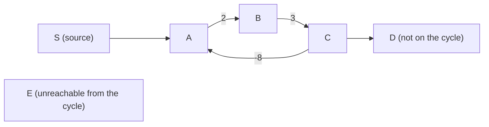

# Bellman-Ford, and what negative edges break

## 1. What this is, and why they ask it

Bellman-Ford finds shortest paths when edges can have negative weights. Dijkstra cannot, and yesterday's
lesson explained why in one sentence: **Dijkstra settles a vertex permanently, and a negative edge is exactly
a reason to unsettle one.**

Bellman-Ford's answer is to give up on settling. Instead of cleverly choosing what to expand next, it relaxes
**every edge**, over and over, `V − 1` times. That is slower — `O(V × E)` against `O((V + E) log V)` — and it
is correct in cases where Dijkstra is confidently wrong.

It also does something Dijkstra cannot do at all: **detect a negative cycle.** If a loop of edges has a
negative total, there is no shortest path — you can go round it again and get cheaper forever — and
Bellman-Ford finds that in one extra pass.

They ask it mainly as a follow-up: "why can't you use Dijkstra here?" The interviewer wants to hear the
proof step that fails, not just "negative weights". The algorithm itself is eight lines and the interesting
content is entirely in the reasoning, the negative-cycle detection, and knowing which of the four shortest-path
algorithms fits a given problem.

By the end of this lesson you can write Bellman-Ford and its cycle check from memory, say exactly why `V − 1`
rounds are enough, explain what "no shortest path" means, use the SPFA optimisation and say why it is not
always safe, and choose correctly between BFS, Dijkstra, Bellman-Ford and Floyd-Warshall.

---

## 2. The story

Gopal has eleven lorries and he has been sending goods between the same fourteen towns for nineteen years.

Most of it is straightforward. Nashik to Pune costs him a certain amount in diesel and driver time; he knows
the number and it does not move much.

The complication is the return loads.

If a lorry is going empty from Solapur back to Nashik anyway, and somebody in Solapur has goods for Nashik,
Gopal will take them for almost nothing — sometimes for genuinely nothing, and once or twice, when the
alternative was an empty run and a driver sitting idle, for less than nothing, because the customer also paid
the driver's food for two days and Gopal came out ahead on a leg that on its own is a loss.

So on his list of legs there are about a hundred and forty entries, and nine of them have a number in front of
them that is not a cost at all. It is a gain.

This is what makes his work different from the man in Nashik who does the same job and always takes the
cheapest leg he can see.

That man's method works perfectly on ordinary legs. Take the cheapest thing available, commit to it, move on.
It does not work on Gopal's list, and Gopal can tell you exactly why, because he lost money learning it in
2011.

He had goods for Aurangabad. The direct leg was 4,000 rupees and he took it, because it was the cheapest thing
in front of him and there was nothing to think about. What he did not consider was that going Nashik to
Solapur cost 6,000, and Solapur to Aurangabad was one of the return-load legs and would have *paid him* 3,000
— so the whole thing was 3,000 rupees, and he had paid 4,000 for the direct one.

He had committed to a number before he had looked at everything.

So what he does now takes longer and he does it on Sunday evenings. He goes down the whole list of a hundred
and forty legs, one at a time, and updates his best-known cost to every town. Then he does it again from the
top. Then again. He keeps going until a full pass through the list changes nothing at all, and then he stops,
because if a whole pass changes nothing, another one will not either.

It usually settles after five or six passes.

The one thing that would worry him — and it has never happened, but he checks — is if a pass kept changing
things forever. That would mean there was a circle of towns he could go round and come out ahead every time,
and if that were true on his list, then either somebody had quoted him something wrong, or he should stop
carrying goods and just drive the circle.

---

## 3. The idea in plain English

Gopal's Sunday evening is Bellman-Ford, and his 2011 mistake is Dijkstra on negative edges.

**A negative edge is one where taking it reduces your total.** In transport it is a return load. In finance it
is a rebate or an arbitrage. In a puzzle it is a move that gives resources back. **Physical distances are
never negative, which is why most shortest-path problems do not need this** — and why, when a problem does
have negative weights, it is usually a deliberate choice by whoever set it.

**Dijkstra fails because it settles.** When a vertex comes out of the priority queue, Dijkstra treats its
distance as final and never looks at it again. That is exactly Gopal committing to 4,000 rupees for the direct
leg. The proof from [day 136](../day-136-dijkstra/README.md) needed one clause — *since no edge is negative,
the remainder of the route cannot bring the total below what we already have* — and a negative edge deletes
that clause.

**Bellman-Ford gives up the cleverness.** No priority queue, no settling, no choosing what to expand. Just:
**go through every edge and relax it, then do that again, `V − 1` times.**

```
for round in 1 .. V-1:
    for every edge (u, v, w):
        if distance[u] + w < distance[v]:
            distance[v] = distance[u] + w
```

**Six lines, and there is no data structure in it at all.**

**Why `V − 1` rounds are exactly enough**, and this is the argument to have ready. A shortest path can visit at
most `V` vertices, so it has at most `V − 1` edges — any more and it would repeat a vertex, meaning it contains
a cycle, and a cycle with non-negative weight can be removed to make the path shorter or equal.

Now: **after round 1, every shortest path of one edge is correct.** After round 2, every shortest path of two
edges is correct — because its first edge was already right and this round relaxed the second. By induction,
after round `k`, every shortest path using at most `k` edges is correct. So `V − 1` rounds cover every possible
shortest path.

**Notice what that argument does not depend on:** the order you process the edges in. Any order works. A lucky
order finishes sooner, which is why the early-exit optimisation below is valid.

**Early exit: if a full pass changes nothing, stop.** Gopal's rule. If no distance improved in a whole round,
no distance can improve in the next one either, because the inputs to every comparison are unchanged. On real
graphs this usually terminates in far fewer than `V − 1` rounds.

**Now the negative cycle, which is the part Dijkstra cannot do at all.** A **negative cycle** is a loop whose
edge weights sum to less than zero. Go round it once and you are cheaper; go round it again and you are
cheaper still. **There is no shortest path** — not a large one, not an undefined one: the question has no
answer, because for any path you name, a shorter one exists.

**Detecting it is one extra round.** After `V − 1` rounds, everything reachable without a negative cycle is
final. So run one more round: **if anything still improves, that improvement can only have come from a
negative cycle.** Six extra lines, and it is the reason to reach for this algorithm even when Dijkstra would
work.

**And what "affected by a negative cycle" means matters.** Not every vertex is. The vertices whose distance is
genuinely `−∞` are those *reachable from* a negative cycle. A vertex the cycle cannot reach has a perfectly
well-defined shortest distance. **If you need to report which vertices are affected, run a traversal from every
vertex that improved on the extra round** and mark everything it reaches.

**SPFA is the practical speed-up, with a caveat.** Instead of blindly relaxing all `E` edges every round, keep
a queue of vertices whose distance just changed — only those can improve anything. That is the
**Shortest Path Faster Algorithm**, it is often dramatically faster on real graphs, and **its worst case is
still `O(V × E)`** and adversarial inputs exist that hit it. Competitive judges sometimes include such inputs
deliberately. Know it, use it, and do not claim it is asymptotically better.

---

## 4. The picture

Gopal's 2011 mistake, as a graph:

```
                    Nashik
                   /      \
             (4000)        (6000)
                 /          \
        Aurangabad          Solapur
                 \          /
                  \        /
                  (-3000)
                 (return load)

  DIJKSTRA:  pops Aurangabad at 4000, SETTLES it, never reconsiders.
             answer: 4000

  TRUTH:     Nashik -> Solapur -> Aurangabad = 6000 - 3000 = 3000

  Dijkstra is wrong by 1000, and reports no error.
```

**What to notice.** Dijkstra did not do anything careless. It popped the smallest available number, which is
its whole design. The graph simply violates the assumption its correctness rests on.

Bellman-Ford on the same graph, round by round:

```
vertices: N(ashik)=source, A(urangabad), S(olapur)
edges:    N->A 4000,  N->S 6000,  S->A -3000

start        N=0     A=inf   S=inf

round 1      relax N->A:  0 + 4000 = 4000 < inf   -> A = 4000
             relax N->S:  0 + 6000 = 6000 < inf   -> S = 6000
             relax S->A:  6000 - 3000 = 3000 < 4000 -> A = 3000   <- improved!

round 2      relax all three: nothing improves
             -> early exit

answer       A = 3000     correct
```

**What to notice at round 1.** `A` was improved twice in a single round, because the edges happened to be
processed in a helpful order. A different order would have taken two rounds. **Either is fine** — the
`V − 1` bound holds regardless of order, which is exactly what makes this algorithm so forgiving.

A negative cycle, and what it means:



```
the loop A -> B -> C -> A costs 2 + 3 - 8 = -3

go round once:    -3
go round twice:   -6
go round n times: -3n        ->  no lower bound  ->  NO shortest path

which vertices are -inf?
   A, B, C     on the cycle
   D           reachable FROM the cycle
   E           NOT reachable from it -> its distance is a normal, finite number
```

**What to notice.** "The graph has a negative cycle" does not mean every answer is meaningless. `E`'s distance
is perfectly well defined. Reporting "no solution" for the whole graph over-states the problem, and a good
answer distinguishes them.

And the four algorithms, on one picture:

```
    every edge costs the same?          ->  BFS            O(V + E)
    weights are only 0 and 1?           ->  0-1 BFS        O(V + E)
    weights non-negative?               ->  Dijkstra       O((V+E) log V)
    weights can be negative?            ->  Bellman-Ford   O(V x E)
    need ALL pairs, small V?            ->  Floyd-Warshall O(V^3)
    graph is a DAG?                     ->  topological    O(V + E)   any weights!
```

**What to notice on the last line.** On a directed acyclic graph, any weights — including negative ones — are
handled by a single pass in topological order, from
[day 135](../day-135-dependency-problems/README.md). That is faster than all of them, and it is the answer
people forget.

---

## 5. The code, built step by step

The edge list, because Bellman-Ford never asks for neighbours.

```python
edges = [(0, 1, 4000), (0, 2, 6000), (2, 1, -3000)]      # (from, to, weight)
```

**This is the one graph algorithm where an edge list is the right representation** — it iterates over all edges
and never over one vertex's neighbours, so converting to an adjacency list would be wasted work. That is worth
saying in an interview.

Now the core.

```python
INF = float("inf")

def bellman_ford(n: int, edges: list[tuple[int, int, float]], source: int) -> list[float]:
    distance = [INF] * n
    distance[source] = 0
    for _ in range(n - 1):                          # V - 1 rounds
        changed = False
        for u, v, w in edges:
            if distance[u] != INF and distance[u] + w < distance[v]:
                distance[v] = distance[u] + w
                changed = True
        if not changed:
            break                                   # a whole pass did nothing
    return distance
```

Eight lines and no data structure. Three things to point at.

**`distance[u] != INF` is not optional.** Without it, `inf + (-5)` is `inf`, which compares as not-less-than
`inf`, so it happens to work — until a weight is such that floating-point arithmetic misbehaves, or until you
use a sentinel like `10**18` instead of `inf`, at which case `10**18 - 5 < 10**18` is true and you start
propagating distances from unreachable vertices. **With an integer sentinel this check is mandatory**, and it
is good practice regardless.

**`changed` and the `break`** are Gopal's rule: a pass that improves nothing means every subsequent pass
improves nothing.

**The order of `edges` is irrelevant to correctness.** A helpful order finishes in fewer rounds; the `V − 1`
bound holds either way.

Now the negative-cycle check, which is one more round:

```python
def find_negative_cycle(n: int, edges, source: int) -> bool:
    distance = bellman_ford(n, edges, source)
    for u, v, w in edges:                           # the V-th round
        if distance[u] != INF and distance[u] + w < distance[v]:
            return True                             # still improving -> negative cycle
    return False
```

**After `V − 1` rounds everything is final unless a negative cycle exists**, so any further improvement proves
one does. Six lines, and it is the capability Dijkstra does not have.

To report *which* vertices are affected:

```python
def negative_infinity_vertices(n: int, edges, source: int) -> set[int]:
    distance = bellman_ford(n, edges, source)
    on_cycle = set()
    for u, v, w in edges:
        if distance[u] != INF and distance[u] + w < distance[v]:
            on_cycle.add(v)                         # v is reachable from a neg cycle

    # everything reachable from those is also -inf
    graph: dict[int, list[int]] = {i: [] for i in range(n)}
    for u, v, _ in edges:
        graph[u].append(v)
    stack, affected = list(on_cycle), set(on_cycle)
    while stack:
        node = stack.pop()
        for nxt in graph[node]:
            if nxt not in affected:
                affected.add(nxt)
                stack.append(nxt)
    return affected
```

The extra traversal is the honest part: a vertex is `−∞` if it is **reachable from** a negative cycle, not
merely if the graph contains one somewhere.

To recover the cycle itself:

```python
def extract_cycle(n: int, edges, source: int) -> list[int] | None:
    distance = [INF] * n
    parent: list[int | None] = [None] * n
    distance[source] = 0
    victim = None
    for round_number in range(n):                   # n rounds, not n-1
        victim = None
        for u, v, w in edges:
            if distance[u] != INF and distance[u] + w < distance[v]:
                distance[v] = distance[u] + w
                parent[v] = u
                victim = v
    if victim is None:
        return None
    for _ in range(n):                              # walk back n steps to land ON the cycle
        victim = parent[victim]
    cycle, node = [], victim
    while True:
        cycle.append(node)
        node = parent[node]
        if node == victim:
            break
    return cycle[::-1] + [victim]
```

**Walking back `n` steps before collecting is the trick**, and it is not obvious: the vertex that improved on
round `n` might not itself be on the cycle, only reachable from it. After `n` parent steps you are guaranteed
to be inside the cycle, because the parent chain must have entered it.

And SPFA, the queue-based version:

```python
from collections import deque

def spfa(n: int, adjacency: dict[int, list[tuple[int, float]]], source: int) -> list[float] | None:
    distance = [INF] * n
    distance[source] = 0
    in_queue = [False] * n
    times = [0] * n                                 # how often each vertex was queued
    queue = deque([source])
    in_queue[source] = True
    while queue:
        u = queue.popleft()
        in_queue[u] = False
        for v, w in adjacency[u]:
            if distance[u] + w < distance[v]:
                distance[v] = distance[u] + w
                if not in_queue[v]:
                    queue.append(v)
                    in_queue[v] = True
                    times[v] += 1
                    if times[v] >= n:
                        return None                 # queued n times -> negative cycle
    return distance
```

**Only vertices whose distance just changed can improve anything**, so there is no point relaxing edges out of
unchanged vertices. That is the whole optimisation, and on typical graphs it is several times faster.

`times[v] >= n` is the cycle check: a vertex cannot legitimately be improved `n` times, so reaching that count
means it is being fed by a negative cycle.

### The complete solution

```python
"""Bellman-Ford: shortest paths with negative weights, and negative-cycle detection."""

from __future__ import annotations

from collections import deque

INF = float("inf")


def bellman_ford(n: int, edges: list[tuple[int, int, float]], source: int) -> list[float]:
    """Shortest distances, assuming no reachable negative cycle. O(V x E)."""
    distance = [INF] * n
    distance[source] = 0
    for _ in range(n - 1):
        changed = False
        for u, v, w in edges:
            if distance[u] != INF and distance[u] + w < distance[v]:
                distance[v] = distance[u] + w
                changed = True
        if not changed:
            break
    return distance


def has_negative_cycle(n: int, edges, source: int) -> bool:
    """One extra round: any further improvement proves a negative cycle."""
    distance = bellman_ford(n, edges, source)
    return any(
        distance[u] != INF and distance[u] + w < distance[v]
        for u, v, w in edges
    )


def affected_by_negative_cycle(n: int, edges, source: int) -> set[int]:
    """Vertices whose true distance is minus infinity: reachable FROM a negative cycle."""
    distance = bellman_ford(n, edges, source)
    seeds = {v for u, v, w in edges if distance[u] != INF and distance[u] + w < distance[v]}
    graph: dict[int, list[int]] = {i: [] for i in range(n)}
    for u, v, _ in edges:
        graph[u].append(v)
    affected, stack = set(seeds), list(seeds)
    while stack:
        node = stack.pop()
        for nxt in graph[node]:
            if nxt not in affected:
                affected.add(nxt)
                stack.append(nxt)
    return affected


def spfa(n: int, edges, source: int) -> list[float] | None:
    """Queue-based Bellman-Ford. Faster in practice, same worst case. None = negative cycle."""
    adjacency: dict[int, list[tuple[int, float]]] = {i: [] for i in range(n)}
    for u, v, w in edges:
        adjacency[u].append((v, w))
    distance = [INF] * n
    distance[source] = 0
    in_queue = [False] * n
    times = [0] * n
    queue = deque([source])
    in_queue[source] = True
    while queue:
        u = queue.popleft()
        in_queue[u] = False
        for v, w in adjacency[u]:
            if distance[u] + w < distance[v]:
                distance[v] = distance[u] + w
                if not in_queue[v]:
                    queue.append(v)
                    in_queue[v] = True
                    times[v] += 1
                    if times[v] >= n:
                        return None
    return distance


if __name__ == "__main__":
    # Gopal's 2011 mistake. 0 Nashik, 1 Aurangabad, 2 Solapur.
    transport = [(0, 1, 4000), (0, 2, 6000), (2, 1, -3000)]
    print("bellman-ford:", bellman_ford(3, transport, 0))
    print("spfa        :", spfa(3, transport, 0))
    print("neg cycle?  :", has_negative_cycle(3, transport, 0))

    # A genuine negative cycle: 1 -> 2 -> 3 -> 1 sums to -3.
    # 0 source, 4 reachable from the cycle, 5 unreachable from it.
    cyclic = [
        (0, 1, 1), (1, 2, 2), (2, 3, 3), (3, 1, -8), (3, 4, 1), (0, 5, 7),
    ]
    print("neg cycle?  :", has_negative_cycle(6, cyclic, 0))
    print("affected    :", sorted(affected_by_negative_cycle(6, cyclic, 0)))
    print("spfa        :", spfa(6, cyclic, 0))
```

Running it:

```
bellman-ford: [0, 3000, 6000]
spfa        : [0, 3000, 6000]
neg cycle?  : False
neg cycle?  : True
affected    : [1, 2, 3, 4]
spfa        : None
```

Three things to look at. Aurangabad comes out at **3000**, not 4000 — the answer Dijkstra gets wrong.

The `affected` set is `{1, 2, 3, 4}`: the three vertices on the cycle plus vertex 4, which the cycle can
reach. **Vertex 5 is not in it**, because the cycle cannot reach it — its distance of 7 is perfectly
well-defined even though the graph contains a negative cycle. Reporting "no solution" for the whole graph
would over-state the problem.

And `spfa` returns `None` on the cyclic graph, detecting the cycle through the requeue counter rather than
through an extra round.

---

## 6. What it costs

**Bellman-Ford.**

```
rounds                         V - 1
edges relaxed per round        E
                               ----------
                               O(V x E) time
distance array                 O(V)
edge list                      O(E)
                               ----------
                               O(V + E) space
```

**Put numbers on it against Dijkstra:**

```
V = 10,000, E = 50,000
Bellman-Ford   10,000 x 50,000  = 500,000,000
Dijkstra       50,000 x 14      = 700,000
                                  -> ~700x more work
```

```
V = 1,000, E = 5,000
Bellman-Ford   5,000,000
Dijkstra       50,000
                                  -> 100x
```

**Bellman-Ford is not slightly slower, it is a different order of magnitude**, and that is why you only use it
when you have to. In Python, five hundred million operations is minutes; seven hundred thousand is instant.

**The early exit changes the practical picture a great deal:**

```
worst case                     V - 1 rounds
typical real graph             3-10 rounds until nothing changes
                               -> O(k x E) with k small
```

```
V = 10,000, E = 50,000, settles in 6 rounds
                               6 x 50,000 = 300,000    -> comparable to Dijkstra
```

**Say the worst case and then say the practical one**, because "`O(V × E)` but it usually terminates in a
handful of rounds" is a more useful statement than either half alone.

**SPFA:**

```
worst case                     O(V x E)      -- same
typical                        O(E) to O(k x E) with very small k
adversarial inputs             genuinely hit the worst case
```

**Do not claim SPFA is asymptotically better.** It is a constant-factor optimisation with a bad worst case
that judges sometimes construct on purpose.

**Detecting a negative cycle:**

```
one extra pass over all edges  O(E)
finding which vertices are -inf  one traversal, O(V + E)
extracting the cycle itself      O(V) after the main run
```

**All four algorithms, sized on the same graph:**

```
V = 1,000, E = 10,000

BFS             11,000            unweighted only
Dijkstra        100,000           non-negative
Bellman-Ford    10,000,000        negatives allowed
Floyd-Warshall  1,000,000,000     all pairs
```

**Floyd-Warshall's `O(V³)` is only viable to about `V = 500`:**

```
V = 100     1,000,000        instant
V = 500     125,000,000      about a minute in Python
V = 1,000   1,000,000,000    too slow
```

But note what it buys: **all pairs**, negative edges allowed, and negative-cycle detection (a negative value on
the diagonal). Running Bellman-Ford from every source is `O(V² × E)`, which is far worse — so for all-pairs
with negatives on a small graph, Floyd-Warshall is right.

**And Johnson's algorithm**, worth naming for all-pairs on a *sparse* graph with negatives: one Bellman-Ford
run to compute a re-weighting that makes every edge non-negative, then Dijkstra from every source. `O(V × E
log V)`, far better than `O(V³)` when `E ≪ V²`. Name it; you will not be asked to write it.

**Space in practice:**

```
V = 100,000, E = 500,000
distance array        800 KB
edge list as tuples   500,000 x ~72 bytes = 36 MB
```

**The edge list is the memory**, and holding edges as three parallel arrays rather than a list of tuples cuts
that by roughly five times in Python — worth knowing if it ever matters.

---

## 7. The traps

### Reaching for Bellman-Ford when Dijkstra would do

The most common real mistake, and it is not incorrect, just wasteful:

```python
bellman_ford(n, edges, source)          # all weights are positive
```

```
V = 10,000, E = 50,000
Bellman-Ford    500,000,000 operations
Dijkstra        700,000
```

```
Time Limit Exceeded
```

**Check the weights first.** All non-negative means Dijkstra. All equal means BFS. It is a DAG means one pass
in topological order, whatever the weights.

### Forgetting the `INF` guard

```python
for u, v, w in edges:
    if distance[u] + w < distance[v]:       # no check that u is reachable
        distance[v] = distance[u] + w
```

With `float("inf")` this happens to survive, because `inf + w` is `inf`. With an integer sentinel it does not:

```python
INF = 10**18
distance = [INF] * n
# ... relax an edge out of an unreachable u with w = -5
# 10**18 - 5 < 10**18  is TRUE
```

```
>>> bellman_ford_no_guard(4, [(0,1,1), (2,3,-5)], source=0)
[0, 1, 999999999999999995, 999999999999999990]
```

Distances propagating from vertices that cannot be reached at all. **With any integer sentinel the guard is
mandatory**, and competitive programming uses integer sentinels almost universally.

### Running `V` rounds instead of `V − 1`

```python
for _ in range(n):                          # one too many
```

Harmless for the distances — an extra round changes nothing on a graph with no negative cycle — but it
**silently destroys the cycle detection**, because the check "did round `V` change anything" has already been
absorbed into the main loop. Then you conclude there is no negative cycle when there is.

### Assuming a negative cycle means the whole answer is undefined

```python
if has_negative_cycle(n, edges, source):
    return "no solution"
```

Only vertices **reachable from** the cycle are `−∞`. On the example in section 5, vertex 5 has a perfectly
good distance of 7. **Reporting "no solution" for the whole graph over-states the problem**, and on problems
that ask for per-vertex answers it is simply wrong.

### Undirected graphs with negative edges

```python
edges = [(0, 1, -5), (1, 0, -5)]            # an "undirected" negative edge
```

An undirected edge of weight −5 is two directed edges of −5, and going back and forth along it is a negative
cycle of length two. **Every undirected graph with any negative edge has a negative cycle**, so the question
"shortest path in an undirected graph with negative weights" has no answer at all. If a problem states that,
it is either directed or you have misread it.

### Claiming SPFA is faster

```python
# "SPFA is O(E)"
```

It is not. Its worst case is `O(V × E)`, identical to plain Bellman-Ford, and constructed inputs exist that
achieve it — grid-like graphs with particular weight patterns. Competitive judges have included them
deliberately since around 2018. **Use it, and describe it as a practical optimisation.**

### The floating-point comparison

```python
if distance[u] + w < distance[v]:           # with float weights
```

With floating-point weights, an "improvement" of `1e-17` can keep firing round after round on a graph with no
negative cycle, and the algorithm never converges — reporting a negative cycle that does not exist. **Use
integers where possible**, and if you cannot, compare with a small epsilon: `distance[u] + w < distance[v] -
1e-9`.

---

## 8. In the interview

### How it gets asked

- *"Why can't you use Dijkstra here?"* — the most common form, and the answer is the proof step.
- *"Some edges have negative weights. Find the shortest path."*
- *"Detect whether an arbitrage opportunity exists between these currencies."* — the classic negative-cycle
  application.
- *"Cheapest flight with at most k stops."* — Bellman-Ford limited to `k + 1` rounds is the neat solution.
- *"How do you know there is no answer?"*
- *"Which shortest-path algorithm, and why?"* — the whole decision table.

### The first ninety seconds

> "Negative weights, so Dijkstra is out, and I want to say precisely why rather than just name the constraint.
>
> Dijkstra's correctness rests on one clause: when it pops a vertex, any cheaper route would have to leave the
> settled set through a vertex costing at least as much, and **since no edge is negative**, the remainder
> cannot bring the total lower. A negative edge deletes that clause — a longer route can still end up cheaper —
> so a settled vertex would need reopening, and Dijkstra never reopens. It does not give a slightly worse
> answer; its reasoning stops holding, and it returns a confidently wrong number with no error.
>
> So: Bellman-Ford. It gives up on settling entirely. Relax **every** edge, then do it again, `V − 1` times.
> No priority queue, no data structure at all, and an edge list rather than an adjacency list — this is the one
> graph algorithm that genuinely wants an edge list, because it never asks for a vertex's neighbours.
>
> **Why `V − 1` is exactly enough:** a shortest path has at most `V − 1` edges, because more would repeat a
> vertex. After round `k`, every shortest path using at most `k` edges is correct — by induction, since its
> first `k − 1` edges were already right and this round relaxed the last one. So `V − 1` rounds cover
> everything.
>
> **And one round more gives me something Dijkstra cannot do at all.** After `V − 1` rounds everything is
> final unless there is a negative cycle, so if a `V`-th round still improves something, a negative cycle
> exists — go round it again and you are cheaper forever, so there is no shortest path.
>
> Cost is `O(V × E)`, which on ten thousand vertices and fifty thousand edges is five hundred million
> operations against Dijkstra's seven hundred thousand — about seven hundred times more. So I would only use it
> when I have to, and I would add the early exit: if a whole pass improves nothing, stop, which on real graphs
> usually terminates in five or six rounds.
>
> Are negative cycles possible here, and do you want the distances or just whether a cycle exists?"

### The follow-ups

**"Give me a concrete example where Dijkstra fails."**

> "Three vertices. Source `S`, with `S → A` costing 1 and `S → B` costing 2, and `B → A` costing −5.
>
> Dijkstra pops `S` at 0 and relaxes both, so the heap holds `(1, A)` and `(2, B)`. It pops `A` at 1 — the
> smallest — and **settles it**. Then it pops `B` at 2 and relaxes `B → A`, finding `2 − 5 = −3`, which is
> better. But `A` is settled and Dijkstra never revisits a settled vertex, so depending on the implementation
> either the improvement is discarded or `A` is re-pushed and the reported answer is already wrong.
>
> The true distance to `A` is −3. Dijkstra says 1.
>
> **The general statement is that Dijkstra never reopens a settled vertex, and a negative edge is precisely a
> reason to reopen one.**
>
> The trap I would watch for in a real problem is negative weights that arrive through a transformation. If I
> am asked for the *maximum*-value path and I negate the weights to turn it into a minimisation, I have just
> created negative weights and invalidated Dijkstra. On a DAG that is fine — one pass in topological order
> handles any weights — but on a general graph it is Bellman-Ford, and if a negative cycle exists there is no
> answer."

**"Detect arbitrage between currencies."**

> "This is the classic application and the transformation is the interesting part.
>
> Each currency is a vertex. An exchange rate `r` from A to B is an edge. Arbitrage means a cycle whose rates
> **multiply** to more than 1 — you go round and end up with more money than you started.
>
> Bellman-Ford works with sums, not products, so I take logarithms: `log(r₁ × r₂ × r₃) = log r₁ + log r₂ +
> log r₃`. A product greater than 1 becomes a sum greater than 0. Then I negate, so the edge weight is
> `−log(rate)` — and now a profitable cycle is a **negative** cycle, which is exactly what Bellman-Ford
> detects.
>
> So: build the graph with weights `−log(rate)`, run Bellman-Ford, and run the extra round. If anything still
> improves, arbitrage exists. To report the actual sequence of trades, I walk the parent pointers back `V`
> steps to land on the cycle and then follow it round.
>
> **Two practical caveats I would name.** The weights are floats, so an improvement of `1e-17` can fire
> spuriously and report arbitrage that is not there — I would compare against an epsilon rather than exactly.
> And real exchange rates have spreads and fees, which are usually enough to remove any arbitrage the raw mid-
> rates suggest, so the model needs the fee subtracted from each edge before it means anything."

**"Cheapest flight with at most k stops."**

> "This is where Bellman-Ford is genuinely neater than Dijkstra, and it is because of what a *round* means.
>
> After `k` rounds of Bellman-Ford, every distance reflects the best path using **at most `k` edges** — that is
> exactly the induction from the correctness proof, read as a feature rather than a proof step. So 'at most `k`
> stops' means at most `k + 1` flights, which means running exactly `k + 1` rounds and stopping.
>
> The one detail that catches people: **each round must relax against the distances as they were at the start
> of the round**, not as they are being updated within it. Otherwise a single round can chain two flights
> together and you allow more stops than intended. So I copy the distance array at the start of each round and
> read from the copy while writing to the live one.
>
> Cost is `O(k × E)`, which for `k = 10` and five thousand flights is fifty thousand operations — much simpler
> and faster than the Dijkstra version, which needs the state expanded to `(city, stops)` and carries a heap.
>
> I would offer both and say I would write the Bellman-Ford one here, because the stop limit maps directly onto
> the round count and there is no state expansion to get wrong."

**"Which algorithm, and why?" — walk me through the decision.**

> "Five questions, in this order, and each one rules out work.
>
> **Is it a DAG?** If so, one pass in topological order handles *any* weights, including negative, in
> `O(V + E)`. That is faster than everything else and it is the answer people forget.
>
> **Does every edge cost the same?** BFS, `O(V + E)`.
>
> **Are the only weights 0 and 1?** 0-1 BFS with a deque — push zero-cost edges to the front, one-cost to the
> back. Still `O(V + E)`, no heap, no log factor.
>
> **Are all weights non-negative?** Dijkstra, `O((V + E) log V)`.
>
> **Can weights be negative?** Bellman-Ford, `O(V × E)`, and it also tells me whether there is a negative cycle
> — which is a question the others cannot answer at all.
>
> And separately: **do I need all pairs?** If `V` is small, Floyd-Warshall at `O(V³)` — viable to about 500 in
> Python — and it handles negatives and detects negative cycles on the diagonal. If `V` is large but the graph
> is sparse, Johnson's: one Bellman-Ford run to re-weight every edge to non-negative, then Dijkstra from every
> source, `O(V × E log V)`.
>
> The point of going through it in that order is that the cheapest applicable algorithm is usually several
> times faster than the general one, and **reaching for Bellman-Ford on a non-negative graph is a seven-
> hundred-fold slowdown for nothing.**"

### The model answer

*"A game where moving between rooms costs energy, and some rooms contain potions that restore energy. Find the
minimum energy needed to get from the entrance to the exit. Also tell me if the player can farm energy
forever."*

> "The potions make this negative-weight, and the farming question is a negative-cycle question, so this is
> Bellman-Ford on both counts. Let me build it up.
>
> **The model.** A vertex is a room. An edge from room A to room B is a passage, and its weight is
> `movement cost − potion value in B` — so a room with a large potion gives its incoming edges a negative
> weight. I would state that combination explicitly, because folding the room's value into the incoming edges
> is the modelling step, and doing it wrong — for instance charging the potion on the way out — gives a subtly
> different and wrong answer.
>
> **Why not Dijkstra.** With potions, a longer route through a well-stocked room can be cheaper than a direct
> one, so a room settled at some cost can turn out to be reachable for less. Dijkstra never reopens a settled
> vertex, so it would return the direct route's cost and be confidently wrong.
>
> **So Bellman-Ford**, `V − 1` rounds over the edge list, with the early exit when a pass changes nothing. On
> a game map of, say, a thousand rooms and four thousand passages, that is four million operations worst case
> and typically far less — well within budget for something computed once per level rather than per frame.
>
> **The farming question is the extra round, and it is the same code.** If a `V`-th pass still improves
> something, there is a cycle of rooms the player can loop round gaining energy indefinitely. I would report
> that as a level-design bug rather than as an answer, because it means the level has no minimum energy — any
> figure I gave would be wrong.
>
> **And I would be careful to answer it precisely rather than globally.** A negative cycle in one wing of the
> map does not make the whole map meaningless: only rooms **reachable from** the cycle have undefined cost.
> So I would report which rooms are affected — seed from the vertices that improved on the extra round, then
> traverse forwards — and give proper answers for the rest. For a level editor that is a far more useful
> output than 'this level is broken'.
>
> **Two edge cases from the domain.** If the exit is unreachable, the answer is infinity, and I need the
> `distance[u] != INF` guard so unreachable rooms do not propagate garbage — especially since I would use an
> integer sentinel here rather than a float, and with an integer sentinel that guard is mandatory rather than
> merely tidy. And if the *entrance* has a potion, that is a starting bonus rather than an edge weight, so it
> belongs in the initial distance, not in the graph.
>
> **The thing I would flag as a design question rather than an algorithm one:** the model assumes a potion can
> be collected every time you enter a room, which is what makes farming possible. If potions are one-shot, the
> state is `(room, set of potions taken)` and the state space is exponential — at which point this stops being
> a shortest-path problem and becomes a search problem, and I would want to know which the game means before
> writing anything."

---

## 9. Recall card

**Dijkstra settles a vertex permanently; a negative edge is exactly a reason to unsettle one.** That is the
proof clause that fails, and it is the answer to "why not Dijkstra".

**Bellman-Ford: relax every edge, `V − 1` times.** No data structure, and an **edge list** is the right
representation. `V − 1` because a shortest path has at most `V − 1` edges, and after round `k` every
`k`-edge shortest path is correct.

**One extra round detects a negative cycle** — anything still improving can only come from one. Only vertices
**reachable from** the cycle are `−∞`; the rest have valid answers.

**`O(V × E)` — about 700× Dijkstra at `V=10⁴, E=5×10⁴`** — so use it only when weights can be negative. Early
exit when a pass changes nothing usually terminates in a handful of rounds. SPFA is a practical speed-up with
the **same worst case**.

**The decision order: DAG → one topological pass (any weights); equal weights → BFS; 0/1 → deque BFS;
non-negative → Dijkstra; negative → Bellman-Ford; all pairs and small `V` → Floyd-Warshall.** And with an
integer sentinel, the `distance[u] != INF` guard is mandatory.
