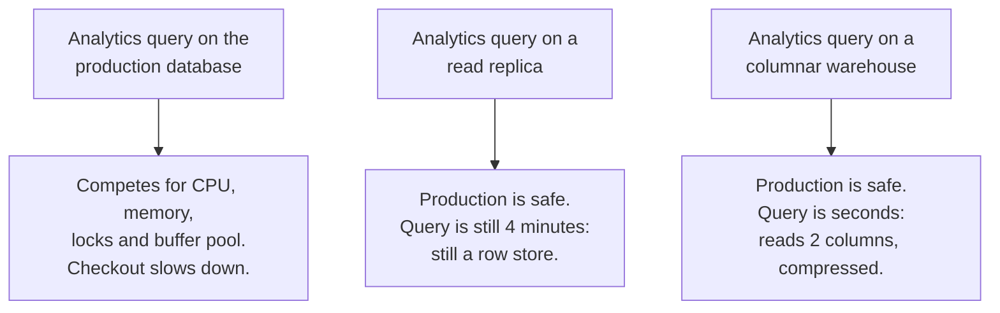

# Data warehouses: OLAP versus OLTP

## 1. What this is, and why they ask it

Your production database serves the application: small reads and writes, one order at a time, thousands per
second, every one of them needing to be fast because a user is waiting.

Then somebody from the business asks for revenue by region by month for the last three years, and that query
reads forty million rows. It takes four minutes. While it runs, the checkout gets slower, and nobody
immediately understands why.

Those are two genuinely different workloads. **OLTP** — online transaction processing — is many small
operations on a few rows each. **OLAP** — online analytical processing — is few enormous operations reading
most of a table but only a handful of its columns. A system tuned for one is bad at the other, and the
difference is not tuning, it is the physical layout of the bytes on disk.

They ask this because "the analytics query is locking the production table" is a real situation with a
standard resolution, and because the reasoning — **row storage versus column storage** — has arithmetic behind
it that you can produce on demand. It is also the question where "just add a read replica" is the tempting
answer that is only half right, and knowing why it is only half right is the point.

By the end of this lesson you can state the two workloads' properties, explain columnar storage and compute
the saving, say what a read replica does and does not solve, describe the star schema and the ETL path, and
choose between a warehouse, a lakehouse and just adding an index.

---

## 2. The story

Nandini's stationery shop opens at nine and the first hour is the worst.

Children on the way to school, wanting one pen, two pens, a geometry box because they lost theirs. Every
transaction is small and every one of them is over in twenty seconds — find it on the shelf, say the price,
take the money, next.

It is the whole shape of the business. Two hundred customers a day, almost none of them buying more than four
things, and the only thing that matters is that each one is quick, because there is a queue and the children
have a bell to catch.

Her husband does the accounts.

For eleven years he did them at the counter, on the same stool, in the gaps between customers. And the gaps
are fine for adding up yesterday, but once a month there was the monthly reckoning, and once a year the big
one, and those are not gaps-between-customers work. Those are two hours of going through everything —
every sale, all year, but only ever two things about each sale: what it was and what it cost. Never who bought
it, never what time, never anything else.

What happened every year, without fail, was that a customer would come in at half past eleven in the middle of
it and he would have to stop, find the pen, take the money, and then spend a minute finding his place again.
Customers waited. He lost his place. Some years it took him a whole day.

The change was Nandini's and it took her about four years to insist on it properly.

He does not do the accounts at the counter any more. On the last Sunday of the month he takes the whole thing
to the back room, where there is a table and nobody comes in, and he works through it in one go without being
interrupted. It takes ninety minutes instead of a day.

And the second half of the change, which mattered more than the first: **he no longer works from the shop's
own record.** He copies out what he needs the night before — just the two columns he actually uses — and works
from the copy. So even if a customer wanted something at eleven, the shop's record is on the counter where it
belongs and he is not holding it.

The copy is a day out of date. Nobody has ever cared. The question the accounts answer is "how did last month
go", and last month does not change.

---

## 3. The idea in plain English

The counter is OLTP and the back room is OLAP, and Nandini's two changes are the whole design.

**OLTP is the counter.** Many small operations, each touching a few rows, each needing to be fast because
somebody is waiting. Insert an order. Read one customer. Update a stock count. **Thousands per second, each
one milliseconds.**

**OLAP is the accounts.** Very few operations, each reading an enormous number of rows but only a few
**columns** of them. Total revenue by month. Average basket size by region. Conversion rate by campaign.
**A handful per hour, each one seconds to minutes.**

**The properties are opposite in every dimension:**

| | OLTP | OLAP |
|---|---|---|
| Rows per query | one to a few | millions |
| Columns per query | most of them | two or three |
| Query rate | thousands/second | a few per hour |
| Latency target | milliseconds | seconds to minutes |
| Writes | constant, small | bulk loads |
| Data age | right now | yesterday is fine |
| Optimised for | finding one row fast | scanning one column fast |

**And here is the thing that makes it a storage question rather than a tuning question.**

**A row store keeps a row's fields together on disk.** That is what a normal database does, and it is exactly
right for OLTP: fetching one order means reading one page and getting every field of it.

**It is exactly wrong for OLAP.** "Sum the amount column over forty million orders" has to read all forty
million rows — every field of every one — to get at one number per row. If a row is 400 bytes and the amount
is 8, **you read fifty times more data than you need.**

**A column store keeps each column together instead.** All the amounts contiguously, all the dates
contiguously, all the region ids contiguously. Now summing the amounts reads only the amount column: 8 bytes
per row instead of 400.

That is Nandini's husband copying out only the two columns he uses.

**And storing a column together makes it compress astonishingly well**, because the values are all the same
type and often very similar. A region column with twelve distinct values over forty million rows compresses to
almost nothing. **Typical warehouse compression is five to ten times on top of the column pruning**, so the
combined saving is often a hundredfold.

**A read replica is the tempting half-answer.** It gives you a second copy so the analytics query does not
compete for CPU and locks with the checkout. That is real and it is worth doing. **But the replica is still a
row store**, so the query still reads fifty times more bytes than it needs, still takes four minutes, and now
also generates replication lag that affects anything else reading from it. **It moves the problem off the
primary without making the query fast.**

**A warehouse is a separate system with a different physical layout**, loaded on a schedule, and that is the
complete answer.

**The data is reshaped as well as copied, and that is the star schema.** Production tables are normalised —
split up to avoid duplication, because updating one field in one place is the OLTP virtue. A warehouse does
the opposite: a big central **fact table** of events, each row a sale with numbers on it, surrounded by
**dimension tables** describing the things involved — customer, product, date, store. **Denormalised on
purpose**, because a join across five tables on forty million rows is expensive, and duplicating a product
name is free when storage is a column that compresses.

**And it lags, deliberately.** Loaded nightly, or hourly, and everybody accepts that. "How did last month go"
does not need a figure from four seconds ago, and pretending otherwise is how you end up back at the counter.

---

## 4. The picture

Row storage against column storage, on the same table:

```
TABLE orders:  id | customer_id | product | region | amount | created_at | ... (20 more)

ROW STORE — a row's fields are contiguous

  disk: [1|44|pen|MH|120|2026-01-02|...][2|91|book|KA|340|2026-01-02|...][3|...
         \_______ one row, ~400 bytes _______/

  "SELECT sum(amount)"  ->  must read every row to get at 8 bytes each
                            40,000,000 x 400 B = 16 GB read for 320 MB of data


COLUMN STORE — a column's values are contiguous

  disk: id:      [1][2][3][4]...
        customer:[44][91][12][7]...
        product: [pen][book][pen][pen]...
        region:  [MH][KA][MH][TN]...
        amount:  [120][340][95][210]...        <- read ONLY this
        created: [...]

  "SELECT sum(amount)"  ->  read one column
                            40,000,000 x 8 B = 320 MB
                            and it compresses to ~60 MB
```

**What to notice.** The row store reads 16 GB to compute a number that needs 320 MB of input. That is not a
constant factor you tune away — it is what "the fields of a row are next to each other" costs when you only
want one field.

The three options, and what each fixes:



**What to notice.** The middle option is a genuine improvement and an incomplete one. It is the right first
step and the wrong final answer.

The star schema:

```
                 dim_customer                dim_product
                 -------------               -----------
                 customer_id                 product_id
                 name, city,                 name, category,
                 segment, tier               brand, cost
                       \                       /
                        \                     /
                         \                   /
                       +---------------------+
                       |     fact_sales      |     <- one row per event
                       |---------------------|        millions to billions
                       | date_id             |
                       | customer_id         |        mostly foreign keys
                       | product_id          |        plus a few numbers
                       | store_id            |
                       | quantity            |
                       | amount              |
                       +---------------------+
                         /                 \
                        /                   \
                 dim_date                  dim_store
                 --------                  ---------
                 date_id                   store_id
                 day, month, quarter,      name, region,
                 year, is_holiday          country, opened
```

**What to notice.** The fact table is enormous and thin — mostly integers. The dimensions are small and wide.
A query joins the big table to a few small ones, which is a cheap shape, and the dimensions are duplicated
rather than normalised because a `dim_product` with a thousand rows costs nothing and a five-way join over a
billion rows costs plenty.

And the pipeline:

```
  production DB  --(nightly / hourly / CDC)-->  warehouse  -->  dashboards
       OLTP                                       OLAP           BI tools
    row store                                  column store      SQL

  the copy is HOURS old, and that is the design, not a defect
```

---

## 5. How it actually works

### Why columnar is fast, in four mechanisms

**1. Column pruning.** Read only the columns the query names. A query touching 3 of 25 columns reads about an
eighth of the data. This alone is usually the biggest factor.

**2. Compression.** Values in a column are the same type and often repetitive, so the standard encodings work
extremely well:

```
run-length      region column: MH,MH,MH,MH,KA,KA -> (MH,4),(KA,2)
dictionary      product names -> small integers plus a lookup table
delta           sorted dates or ids -> tiny differences
bit-packing     a column with 12 distinct values -> 4 bits per value, not 32
```

```
typical warehouse compression   5-10x on top of column pruning
```

**3. Vectorised execution.** Process a batch of values at a time rather than a row at a time, which keeps the
CPU pipeline full and lets the compiler use SIMD instructions. A row-at-a-time engine spends most of its time
on per-row overhead.

**4. Zone maps and partition pruning.** Each block of a column stores its minimum and maximum. A query
filtering on `created_at >= '2026-01-01'` skips every block whose maximum is earlier — **without reading it**.
Partitioning by date does the same at file granularity. On a well-partitioned table this often eliminates 95%
of the data before any reading starts.

### The separation of storage and compute

The change that defined the modern warehouse: **the data lives in object storage and the query engines are
stateless machines that read it.**

```
        object storage (S3 / GCS)         <- the data, columnar files
                  ^
                  |
    +-------------+-------------+
    |             |             |
 warehouse    warehouse    warehouse       <- compute, started and stopped
  cluster A    cluster B    cluster C         independently
 (analysts)   (nightly job) (ML team)
```

Three consequences worth stating:

- **Scale compute independently of data.** A query needing more power gets a bigger cluster for ten minutes.
- **Isolate workloads.** The analysts' cluster cannot slow down the nightly job's cluster, because they share
  only immutable files.
- **Pay for what you use.** Compute stops when nobody is querying, which is most of the time.

This is what Snowflake commercialised and what BigQuery does implicitly. **It is also why "the warehouse is
expensive" usually means "somebody left a cluster running", not "storage costs a lot"** — storage is object
storage prices.

### ETL, ELT and the modern shape

**ETL** — extract, transform, load — was the older shape: pull from production, reshape it on a separate
machine, load the clean result. Transformation happened before loading because warehouse compute was scarce
and expensive.

**ELT** is the modern one: extract, load the raw data, and transform **inside the warehouse** with SQL. Because
warehouse compute is now cheap and elastic, it is easier to load everything and reshape it in place — and it
means the raw data is still there when somebody wants to reshape it differently.

```
sources --> raw / bronze  --> cleaned / silver --> aggregated / gold --> dashboards
            (as-is)           (typed, deduped)     (star schema,
                                                    business metrics)
```

**dbt** is the tool that made this standard: transformations are version-controlled SQL files with declared
dependencies, which — and this is a nice connection — form a **DAG**, and running them in the right order is a
[topological sort](../day-134-topological-sort/README.md).

### How data gets there

- **Batch dump.** Nightly `SELECT * FROM orders WHERE updated_at > yesterday`. Simple, and it puts a large
  read on production at the worst possible moment unless it runs against a replica.
- **CDC — change data capture.** Read the database's replication log with something like Debezium and stream
  changes continuously. No load on production beyond what replication already costs, near-real-time, and it
  catches every write including manual ones. **This is the default choice now.**
- **Event streams.** Application events go to Kafka and are consumed into both the warehouse and elsewhere.
  Best for behavioural data — clicks, page views — that never existed in the production database at all.

### The systems

| | Type | Notes |
|---|---|---|
| **Snowflake** | cloud warehouse | separated storage/compute, per-second billing, very easy to operate |
| **BigQuery** | cloud warehouse | serverless, priced per byte scanned — partition or pay |
| **Redshift** | cloud warehouse | older node-based model, RA3 separates storage |
| **ClickHouse** | columnar OLAP DB | extremely fast, self-hostable, more operational work |
| **DuckDB** | embedded OLAP | in-process, no server — genuinely useful for a few hundred GB |
| **Databricks / Iceberg / Delta** | lakehouse | columnar files (Parquet) in object storage plus a table format giving transactions and schema evolution |

**DuckDB is worth knowing as the small-scale answer.** A few hundred gigabytes of Parquet queried in-process,
no cluster, no bill. For a startup's analytics that is often the whole solution, and offering it shows
judgement rather than reflex.

**The lakehouse** deserves one sentence: store data as open columnar files in object storage, and add a table
format — Iceberg, Delta Lake, Hudi — that provides atomic commits, schema evolution and time travel over those
files. **You get warehouse behaviour without the data being locked inside one vendor's system**, and any
engine can read it.

---

## 6. The numbers

**The core comparison, on one table.** 40 million orders, 25 columns, ~400 bytes per row:

```
table size                     40,000,000 x 400 B  = 16 GB
query: SELECT region, sum(amount) ... GROUP BY region
columns needed                 region (4 B) + amount (8 B) = 12 B
```

```
ROW STORE (production or a replica)
  bytes read                   16 GB
  at 500 MB/s                  32 seconds of pure I/O
  plus row-at-a-time processing of 40M rows
  realistically                2-5 minutes
```

```
COLUMN STORE
  bytes read                   40,000,000 x 12 B = 480 MB
  compressed ~6x               ~80 MB
  at 500 MB/s                  0.16 seconds
  plus vectorised processing
  realistically                1-3 seconds
```

**A hundredfold less I/O, and roughly a hundredfold faster.** Those two numbers are the whole argument and
they are worth being able to produce.

**With date partitioning, on a query for one month:**

```
partitioned by month, query touches 1 of 36 partitions
  bytes read                   80 MB / 36 = ~2 MB
  -> milliseconds
```

**Partition pruning is often a bigger factor than columnar storage itself**, and it is the first thing to check
when a warehouse query is slow.

**What the analytics query costs on production, if you let it:**

```
production DB: 16 GB buffer pool, serving 5,000 queries/s at ~2 ms
analytics query scans 16 GB
  -> evicts the ENTIRE buffer pool
  -> cache hit rate falls from ~99% to near zero
  -> every OLTP query starts hitting disk
  -> 2 ms becomes 20 ms, and the connection pool backs up
```

**The damage is not the four minutes — it is that the four minutes destroy the cache for everything else.**
That is the same buffer-pool argument as
[day 134](../day-134-topological-sort/README.md)'s blobs, and it is the reason "just run it at 3 a.m." is only
a partial answer.

**Read replica, costed:**

```
replica removes:      CPU contention, lock contention, buffer-pool damage on the primary
replica does NOT fix: 16 GB scanned, 2-5 minutes, and now the replica lags
                      during the scan, which affects anything else reading from it
```

**Storage cost:**

```
16 GB of orders in Postgres (gp3 SSD)      16 x $0.115  = $1.84/month
same data in a warehouse, compressed 6x    2.7 GB x $0.023 = $0.06/month
```

**Storage is never the reason a warehouse is expensive.** Compute is.

```
Snowflake, one medium cluster              ~$4/hour
  running 24/7                             ~$2,900/month
  running 2 hours/day                      ~$240/month
BigQuery                                   ~$5 per TB scanned
  a badly written unpartitioned query
  scanning 5 TB, run hourly                5 TB x $5 x 24 x 30 = $18,000/month
```

**That last line is the one to say out loud.** BigQuery's per-byte pricing makes partition pruning a financial
control, not just a performance one, and `SELECT *` on a large table is a genuinely expensive mistake.

**Freshness, and what each mechanism gives:**

```
nightly batch          up to 24 hours stale
hourly batch           up to 1 hour
CDC streaming          seconds to minutes
```

**Load volumes:**

```
40,000,000 orders/year at ~400 B          16 GB/year raw
plus events (page views, clicks) at 100x  ~1.6 TB/year
compressed in the warehouse               ~250 GB/year
```

**Behavioural events dwarf transactional data**, usually by one to two orders of magnitude, and that is what
actually sizes a warehouse.

---

## 7. The trade-offs

**A warehouse is a second copy, so it is stale and it can drift.** Nightly means up to a day behind. Everyone
accepts that for "how did last month go" and nobody accepts it for "is this order paid", so **the boundary
between the two has to be explicit** — and the failure mode is a dashboard quietly becoming the number
somebody makes an operational decision on.

**Denormalising trades storage and correctness-on-update for query speed.** A product name duplicated across
forty million fact rows is cheap in a compressed column and means the name is wrong in forty million places if
it changes. **Slowly changing dimensions** are the standard treatment: keep versions of the dimension row with
validity dates, so a historical sale still shows the price and category as they were. That is real complexity
and it is the correct answer when history matters.

**Columnar storage is bad at what row storage is good at.** Fetching one complete row means reading from 25
separate places. Updating a single field means rewriting a block. **Warehouses do not do single-row updates
well and are not meant to** — loads are bulk, and an `UPDATE ... WHERE id = ?` in a warehouse is a smell.

**Separated compute is elastic and easy to leave running.** The bill is per-second and the default is a
cluster nobody turned off. Per-byte-scanned pricing is the same trap from the other side: an unpartitioned
query in an hourly schedule can cost more than the entire rest of the platform.

**More copies means more places for the truth to differ.** Production, warehouse, and whatever the BI tool has
cached. **Two teams computing "revenue" slightly differently is the most common data problem in any company**,
and the technical answer — a single modelled definition in the transformation layer, with everything else
reading from it — is a governance decision as much as an engineering one.

**And the honest one: most companies do not need a warehouse.** A read replica plus good indexes handles a
very large amount of reporting. DuckDB over Parquet files handles a few hundred gigabytes with no
infrastructure at all. **Reaching for Snowflake at ten gigabytes of data is a decision that costs money every
month forever**, and saying that is a stronger answer than describing the architecture.

**When would I not use one?** Under about a hundred gigabytes, where a replica with the right indexes, or
DuckDB, is enough. When the requirement is genuinely real-time — that is a streaming system, not a warehouse.
When there is one analyst and one dashboard. And when the actual problem is one badly written query, which is
a five-minute fix rather than a platform.

---

## 8. In the interview

### How it gets asked

- *"The analytics query is locking the production table. What do you do?"* — the direct version.
- *"Why can't you just run reports off the production database?"*
- *"What is the difference between OLTP and OLAP?"*
- *"Why is columnar storage faster for analytics?"* — the arithmetic question.
- *"Is a read replica enough?"* — the half-answer question.
- *"Design the analytics pipeline for this system."*

### The first ninety seconds

> "These are two different workloads and the production database is built for exactly one of them.
>
> The application does OLTP: thousands of small operations a second, each touching a few rows, each needing to
> be milliseconds because a user is waiting. The report does OLAP: one query reading forty million rows but
> only two or three of their twenty-five columns, and it can take seconds.
>
> **The reason they cannot share a system is the physical layout.** A row store keeps a row's fields together,
> which is exactly right for fetching one order. For summing one column over forty million rows it means
> reading every field of every row — sixteen gigabytes of I/O to compute something that needs about three
> hundred megabytes of input. **Fifty times more data than the query needs.**
>
> And the damage is worse than the four minutes. Scanning sixteen gigabytes evicts the entire buffer pool, so
> the cache hit rate for ordinary queries collapses and every checkout starts hitting disk. **The report makes
> everything else slow, and nothing about the report looks wrong.**
>
> **Immediate fix: run it against a read replica.** That removes the CPU contention, the lock contention and
> the buffer-pool damage from the primary, and it is the right first step. **But it is only half an answer** —
> the replica is still a row store, so the query still reads sixteen gigabytes and still takes minutes, and it
> now creates replication lag that affects anything else reading from that replica.
>
> **The complete answer is a columnar warehouse**, loaded on a schedule. A column store keeps each column
> contiguous, so the same query reads two columns — about 480 megabytes, compressing to eighty — and the
> compression works well because a column holds one type with repetitive values. That is roughly a hundredfold
> less I/O, and with date partitioning on a single month it drops another thirtyfold.
>
> **The cost is staleness**, and it is deliberate: nightly or hourly, because 'how did last month go' does not
> need a figure from four seconds ago.
>
> How much data is there? Because under about a hundred gigabytes I would push back on building a warehouse at
> all — a replica with the right indexes, or DuckDB over Parquet files, does the job with no infrastructure."

### The follow-ups

**"Why exactly is columnar faster? Give me the numbers."**

> "Four mechanisms, and the first is the biggest.
>
> **Column pruning.** A table with twenty-five columns at four hundred bytes a row; a query needing two of
> them needs twelve bytes a row. In a row store you read all four hundred because that is how the row is laid
> out. Forty million rows: sixteen gigabytes against four hundred and eighty megabytes. **Thirty-three times
> less, before anything clever.**
>
> **Compression.** A column holds one type and usually repetitive values, so run-length, dictionary and
> bit-packing encodings all work extremely well — a region column with twelve distinct values needs four bits,
> not thirty-two. Five to ten times on top of the pruning, so the four hundred and eighty megabytes becomes
> about eighty.
>
> **Vectorised execution.** Process batches of values rather than one row at a time, which keeps the CPU
> pipeline full and enables SIMD. A row-at-a-time engine spends most of its cycles on per-row overhead rather
> than on the arithmetic.
>
> **Zone maps and partition pruning.** Each block stores the minimum and maximum of its column, so a filter on
> a date range skips blocks without reading them. **On a well-partitioned table this is often the single
> largest factor** — a query for one month out of three years touches one thirty-sixth of the data.
>
> Multiply them: sixteen gigabytes read becomes single-digit megabytes, and four minutes becomes under a
> second. And in BigQuery, where you are billed per byte scanned, the same arithmetic is the difference between
> a five-dollar query and an eighteen-thousand-dollar monthly bill."

**"Is a read replica enough?"**

> "It is the right first step and it is not the whole answer, and I would be explicit about which part it
> fixes.
>
> **What it fixes:** the analytics query no longer competes with the checkout for CPU, no longer takes locks
> that matter, and no longer evicts the primary's buffer pool. That is genuinely most of the *harm*, and it is
> a configuration change rather than a project, so I would do it today.
>
> **What it does not fix:** the query itself. The replica is byte-for-byte the same row store, so it still
> reads sixteen gigabytes and still takes minutes. The analyst's experience is unchanged.
>
> **And it introduces something new:** during that scan the replica's own I/O is saturated, so replication lag
> grows, and anything else reading from that replica — which is usually the application's own read traffic —
> now sees staler data. So I would want a replica dedicated to analytics, not the one serving the application.
>
> **The point at which a replica genuinely is enough:** small data, a handful of reports, and indexes that
> cover them. If the reports are 'yesterday's orders for this store', that is an indexed range scan on a
> replica and it is fine forever. It stops being enough when the queries are aggregations over most of the
> table, which is when you are doing OLAP on OLTP storage and no amount of indexing helps — an index does not
> reduce the bytes read when you are scanning everything anyway."

**"How does data get from production into the warehouse?"**

> "Three mechanisms, and I would choose based on freshness and on load.
>
> **Batch dump.** Nightly `SELECT ... WHERE updated_at > yesterday`. Simple, and it puts a large read on
> production at whatever time you schedule it — so it should run against a replica, not the primary. Freshness
> is up to twenty-four hours. It also silently misses hard deletes unless the application soft-deletes, which
> is a real correctness gap.
>
> **Change data capture.** Read the replication log with Debezium or equivalent and stream changes
> continuously. Near-real-time, no additional load on production beyond replication itself, and it catches
> every write — including manual ones and deletes, which is what fixes the batch version's gap. **This is what
> I would default to now.**
>
> **Event streams.** Application events published to Kafka and consumed into the warehouse. This is for
> behavioural data — page views, clicks, searches — which never existed in the production database at all, and
> which is usually one to two orders of magnitude more volume than the transactional data.
>
> Then the shape inside: land the raw data, transform in place with SQL — ELT rather than ETL, because
> warehouse compute is now cheap and elastic and keeping the raw layer means you can re-derive things you did
> not anticipate. dbt is the standard tool, and the transformations form a dependency graph that is run in
> topological order, which is the same machinery from day 134."

**"When would you not build a warehouse?"**

> "More often than people expect, and I think saying so is the right answer rather than describing the
> architecture reflexively.
>
> **Under about a hundred gigabytes**, a read replica with indexes designed for the reports handles it, and it
> is zero new infrastructure. If the reports are aggregations that need scans, **DuckDB over Parquet files
> exported nightly** is genuinely a complete solution — in-process, no server, no bill, and it will happily
> query a few hundred gigabytes on a laptop.
>
> **When the requirement is actually real-time**, a warehouse is the wrong tool regardless of size. 'Live
> orders in the last five minutes' is a streaming problem or a materialised view, not a nightly load.
>
> **When the real problem is one query.** Quite often 'analytics is killing the database' is a single missing
> index or a report written as a correlated subquery, and a five-minute fix beats a platform. I would look at
> that before proposing anything.
>
> **And the cost argument.** A Snowflake medium cluster is about four dollars an hour, so nearly three thousand
> a month if nobody turns it off — and the default is that nobody turns it off. For a company with ten
> gigabytes of data that is a permanent monthly cost for something a replica does for free.
>
> **The threshold I would use** is: more than one team asking analytical questions, more than a few hundred
> gigabytes, or reports that need to join behavioural events against transactional data. Any one of those, and
> a warehouse earns its place."

### The model answer

*"An e-commerce platform: 50 million orders a year, plus clickstream data. The analytics team needs dashboards,
the finance team needs monthly reports, and the ML team needs historical data for training. Design it."*

> "Three consumers with three different requirements, so let me establish the shape and then be specific about
> where each one lands.
>
> **Production stays untouched.** Postgres, row store, serving the application. No analytics query ever runs
> against it, and I would make that a rule rather than a convention, because the failure mode — one report
> evicting the buffer pool and slowing every checkout — is invisible in code review.
>
> **Ingestion, two paths, because the two data types are completely different.** Transactional data —
> orders, customers, products — via CDC off the replication log. Near-real-time, no extra load on production,
> and it captures deletes, which a nightly `WHERE updated_at >` dump silently misses. Clickstream — page views,
> searches, add-to-cart — goes from the application into Kafka and is consumed into the warehouse directly. It
> never existed in Postgres and should not.
>
> **The volume ratio is the sizing fact.** Fifty million orders a year at four hundred bytes is twenty
> gigabytes. Clickstream at, conservatively, a hundred events per order is five billion events a year — one to
> two terabytes raw, a few hundred gigabytes compressed. **The behavioural data is the warehouse, and the
> transactional data is a rounding error**, which is the opposite of most people's intuition.
>
> **Storage: columnar files in object storage with a table format** — Parquet plus Iceberg or Delta. That gives
> me atomic commits, schema evolution and time travel, and keeps the data readable by any engine rather than
> locked into one vendor. **Partitioned by date**, always, because a query for one month out of three years
> then touches a thirty-sixth of the data, and under per-byte pricing that is a financial control as much as a
> performance one.
>
> **Transformation in layers**, with dbt: raw as ingested, then cleaned and typed and deduplicated, then a star
> schema — a `fact_orders` table and a `fact_events` table surrounded by `dim_customer`, `dim_product`,
> `dim_date`, `dim_store`. Denormalised deliberately, and **`dim_product` as a slowly changing dimension with
> validity dates**, so that a sale from 2024 still shows the price and category as they were at the time.
> Finance will ask for that in the first month and retrofitting it is painful.
>
> **Now the three consumers, each getting what it needs.**
>
> **Analytics** query the gold layer through a BI tool. Their cluster is separate, so a badly written
> exploratory query cannot slow anything else down — which is the concrete benefit of separated storage and
> compute.
>
> **Finance** need the monthly close, and it needs to be *reproducible*: the same query run in March must give
> the same answer for January that it gave in February. So finance reads a snapshot table, written once when
> the month closes and never modified. **That is a governance requirement dressed as a technical one**, and it
> is the difference between a number people trust and one they argue about.
>
> **ML** read the same Parquet files directly from object storage, bypassing the warehouse engine entirely,
> because training reads whole datasets and does not want SQL. That is the lakehouse's main practical benefit
> — one copy of the data, several engines.
>
> **Freshness:** the transactional layer is minutes behind via CDC; the aggregated star schema rebuilds hourly.
> Nobody gets real-time from this, and I would say that explicitly, because the request will arrive. **If
> somebody needs 'orders in the last five minutes', that is a streaming aggregation, not a warehouse query**,
> and building it into the warehouse is how warehouses become slow and expensive.
>
> **And the one governance point I would insist on:** revenue is defined once, in the transformation layer, and
> every dashboard reads that definition. **Two teams computing revenue slightly differently is the most common
> data problem in any company**, and it is not solved by better tooling — it is solved by there being one
> place the definition lives."

---

## 9. Recall card

**OLTP: many small operations, few rows, most columns, milliseconds. OLAP: few huge operations, millions of
rows, two or three columns, seconds.** Opposite in every dimension, and the difference is the **physical
layout**, not tuning.

**Row store reads every field to get one:** 40M rows × 400 B = **16 GB** to sum a column that needs 320 MB.
**Column store reads only that column, compressed 5–10×** → ~80 MB, plus vectorised execution and zone maps.
**~100× less I/O**, and partition pruning often beats all of it.

**A read replica fixes the *harm* (CPU, locks, buffer-pool eviction) and not the *query*** — still a row
store, still minutes, and now it lags. It is the right first step and the wrong final answer.

**Star schema: one enormous thin fact table plus small wide dimensions, denormalised on purpose.** Slowly
changing dimensions when history must be right. **ELT with CDC** is the modern pipeline; transformations form
a DAG run in topological order.

**Storage is never the cost — compute is** ($0.06/month for the data, ~$2,900 for a cluster left running; a
5 TB unpartitioned hourly query is $18,000/month on per-byte pricing). **And under ~100 GB, a replica with
indexes or DuckDB over Parquet is the honest answer.**
