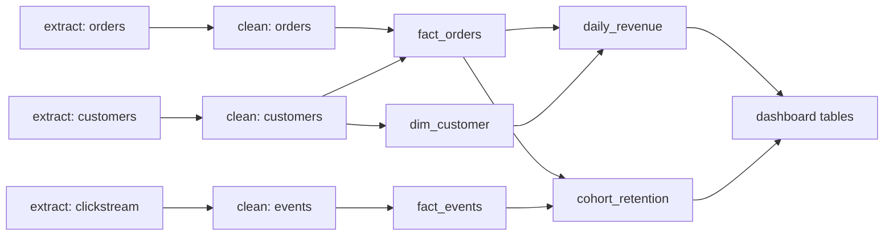

# ETL, batch pipelines, and where data goes to be counted

## 1. What this is, and why they ask it

Somebody looks at a dashboard and reads a number. "Yesterday's revenue: ₹48,21,600." That number did not exist
until about four in the morning, when a chain of about thirty jobs ran in a specific order, each one waiting
for the ones before it, and produced it.

That chain is a **batch pipeline**, and this lesson is about what it is made of: how jobs are ordered, what
happens when one fails at three in the morning, how you re-run yesterday without producing yesterday's revenue
twice, and how you notice when the number is wrong rather than merely late.

They ask this because pipelines are where data engineering actually lives, and because the interesting parts
are all failure handling. Writing a job that computes revenue is a `GROUP BY`. Writing one that can be safely
re-run, that handles a source arriving four hours late, that backfills six months of history without melting
the warehouse, and that fails loudly when the input is wrong — that is the job.

It is also the day where the graph track and the system design track meet: **a pipeline is a DAG, and running
it is a topological sort**, which is [day 134](../day-134-topological-sort/README.md). That is not a
coincidence or a cute analogy — Airflow's core object is literally called a DAG.

By the end of this lesson you can trace a number from a production write to a dashboard, design a job that is
safe to re-run, explain idempotency and backfills concretely, place data-quality checks, and say when a
pipeline should not be batch at all.

---

## 2. The story

The milk comes in between half past five and seven, and by eight o'clock Bhaskar needs one number.

He runs the collection centre for about two hundred and forty farmers. Each of them brings a can. It gets
weighed, a sample is drawn, the sample is tested for fat, and the two numbers together — litres and fat
percentage — decide what that farmer is paid for the day. At the end of the morning all of it goes into one
total that goes to the union, and that total is what the centre itself gets paid on.

The order is fixed and it cannot be shuffled. You cannot test the sample before you have drawn it. You cannot
draw the sample before the can is weighed, because the weighing is when the can is opened. And you certainly
cannot work out anybody's payment before the fat test is back from the machine.

Most mornings it runs like a clock and Bhaskar is done by twenty past eight.

The mornings he remembers are the other ones.

**The machine.** In 2021 the fat testing machine failed at ten past six, with about sixty cans already weighed
and sampled. The weighing was done and correct. Everything after it was stuck. When the replacement machine
came at half past nine, he did not re-weigh the sixty cans — that work was finished and still good. He picked
up from the testing step and carried on.

**The late farmer.** Nagappa's tempo breaks down perhaps once a month, and he arrives at half past nine with
eleven cans from the far village. By then the total has already gone to the union. So the eleven cans are
recorded against that day — they *are* that day's milk — and a corrected total goes up at eleven. The union
accepts corrections until the end of the day and after that they do not.

**The day it ran twice.** Two years ago a boy who was new fed the morning's sheet into the total a second time,
and the centre's figure came out at double. Nobody noticed for four days, because the number was plausible and
nobody had a reason to check it against anything. What Bhaskar does now is that the total is not built by
adding things up as they arrive. It is built by taking the day's records and computing the total from
scratch. Run it twice and you get the same number, because it is not adding, it is recalculating.

**And the one that taught him the most.** In 2019 a scale was out of calibration for nine days and every can
was weighed about 4% light. Nothing failed. Every job ran. Every number was produced on time and every one of
them was wrong, and it took a farmer complaining about his monthly payment to find it. Now the first thing
Bhaskar does every morning, before anything else, is put a known five-litre measure on the scale, and if it
does not read five, nothing else happens that day until it does.

---

## 3. The idea in plain English

Bhaskar's morning is a batch pipeline, and each of his four bad days is one of the four things this lesson is
about.

**A batch pipeline is a set of jobs with dependencies, run on a schedule.** Extract from the sources, reshape,
aggregate, load into tables people query. Each job waits for the ones it depends on.

**The dependencies form a DAG**, and running the pipeline means running the jobs in topological order. That is
[day 134](../day-134-topological-sort/README.md), applied directly: an orchestrator computes the order, runs
what has no unmet dependencies, and unblocks the next things as each finishes. **Jobs at the same level run in
parallel**, and the length of the longest chain is the pipeline's critical path — the fastest it can possibly
be.

**ETL versus ELT is about where the reshaping happens.** **ETL** — extract, transform, load — transforms on a
separate machine before loading, which is what you did when warehouse compute was scarce. **ELT** loads the raw
data first and transforms **inside** the warehouse with SQL. That is the modern default, for two reasons: the
warehouse's compute is elastic and cheap, and keeping the raw layer means you can re-derive things you did not
anticipate. **You cannot re-transform data you threw away.**

**Now the four properties that make a pipeline survivable.**

**One: jobs are partitioned by time, and a job owns exactly one partition.** The job that runs at 4 a.m. on
the 12th computes the figures **for the 11th**, and writes only the 11th's partition. It does not append to a
running total. That single design choice is what makes everything else possible.

**Two: re-running must be safe. That is idempotency, and here it means *overwrite*, not *append*.** Bhaskar's
boy fed the sheet in twice and doubled the total, because the total was built by adding. The fix was to compute
the total from the day's records instead — run it again, get the same answer. In SQL that is
`DELETE FROM revenue WHERE date = '2026-01-11'` followed by the insert, or an atomic partition replace.
**A job that appends is a job you can never safely re-run**, and you will need to re-run it.

**Three: failure resumes rather than restarts.** The fat machine broke and the weighing did not have to be
done again. In a pipeline, each job's success is recorded, so a retry starts from the failed job rather than
from the beginning. That means jobs must be small enough to be worth resuming, and it means the orchestrator
has to track state — which is most of what an orchestrator is for.

**Four: late data has a stated policy.** Nagappa arrives at half past nine and his milk belongs to that
morning. Sources are late constantly — a partner's file, a mobile app syncing after a day offline, a payment
provider's settlement report. **The two options are to reprocess the affected partition, or to fold the late
data into the current one**, and the pipeline must say which. Reprocessing is correct and means yesterday's
published number changes; folding forward is simpler and means individual days are slightly wrong while the
total over a month is right.

**Because partitions are overwritable, reprocessing is easy — which is the payoff for property one.**

**A backfill is the same mechanism run over history.** New metric, or a bug fixed: re-run the pipeline for the
last six months, one partition per day. This works **only** because each run overwrites its own partition and
touches nothing else, and it is why "can you backfill it?" is a question with a one-word answer in a
well-built pipeline and a project in a badly built one.

**And the last idea, which is Bhaskar's calibration check: a pipeline that runs successfully can still produce
wrong numbers.** Every job succeeded for nine days and every figure was 4% light. **Nothing in "did the job
run?" catches that.** So the pipeline needs assertions on the *data*, not only on the jobs — row counts within
expected bounds, no nulls in key columns, totals reconciling against the source — and a failed assertion has
to stop the pipeline rather than warn, because a wrong number that reaches a dashboard is worse than a missing
one.

---

## 4. The picture

The pipeline as a DAG, which is what an orchestrator actually holds:



**What to notice.** The three extracts have no dependencies, so they run in parallel — that is level zero of
the topological sort. `daily_revenue` cannot start until both `fact_orders` and `dim_customer` are finished.
**The number of levels is the critical path**, and the widest level tells you how many workers are worth
paying for. Both fall straight out of [day 134](../day-134-topological-sort/README.md).

Partitioned, idempotent processing:

```
  run for 2026-01-11, at 04:00 on 2026-01-12

     reads:   source rows WHERE created_at >= '2026-01-11'
                                AND created_at <  '2026-01-12'
     writes:  DELETE FROM daily_revenue WHERE date = '2026-01-11'
              INSERT ...                                    <- one transaction

  run it again  -> same input, same output. Nothing doubles.
  run it for 2026-01-10 -> touches only that partition. Nothing else moves.
```

```
  THE VERSION THAT CANNOT BE RE-RUN:

     INSERT INTO daily_revenue SELECT ... FROM orders WHERE ...
                    ^
              appends. Run twice, and the day is counted twice.
              And you WILL run it twice, because retries exist.
```

Failure and resume:

```
  extract  clean   fact    daily_revenue   dashboard
    OK  ->  OK  ->  OK  ->    FAILED    ->  (not started)
                                 |
                                 v
   03:12  retry: starts HERE, not at the beginning
          the three completed jobs are not re-run

  BUT: the retry must be safe, because "failed" might mean
       "wrote half the rows and then crashed"
       -> which is exactly why the write is DELETE + INSERT
          in one transaction, not an append
```

**What to notice.** Resuming is only safe because each job's write is idempotent. A job that failed halfway
through an append has already corrupted its output, and a retry makes it worse. **The two properties are not
independent** — resumability requires idempotency.

And the backfill:

```
  new metric added. Recompute the last 180 days.

  for each date in the last 180 days:
      run the pipeline for that date       <- each overwrites its own partition

  180 independent runs, parallelisable, each safe alone
  and none of them touches any other day
```

---

## 5. How it actually works

### The orchestrator

An **orchestrator** — Airflow, Dagster, Prefect, or a cloud equivalent — does five things:

1. Holds the dependency graph.
2. Triggers runs on a schedule.
3. Runs jobs in topological order, in parallel where possible.
4. Records each job's state, so a retry resumes.
5. Retries, alerts, and exposes the history.

Airflow's core object is literally a `DAG`:

```python
with DAG("daily_revenue", schedule="0 4 * * *", start_date=..., catchup=True) as dag:
    extract = PythonOperator(task_id="extract_orders", ...)
    clean   = PythonOperator(task_id="clean_orders", ...)
    fact    = PythonOperator(task_id="build_fact_orders", ...)
    revenue = PythonOperator(task_id="daily_revenue", ...)

    extract >> clean >> fact >> revenue          # the edges
```

**`catchup=True` is the backfill mechanism**: if the DAG is deployed with a start date six months ago, Airflow
schedules one run per day for the whole period. That only works if the jobs are partitioned and idempotent —
which is the whole point of both properties.

**The execution date is the parameter every job takes.** A run "for 2026-01-11" reads that day's slice and
writes that day's partition, regardless of when it actually executes. **A job that uses `now()` instead of the
execution date cannot be backfilled and cannot be re-run**, because re-running it tomorrow would compute
tomorrow's data. This is the single most common bug in badly written pipelines.

### Idempotent writes, three ways

```sql
-- 1. Delete and insert, in one transaction. Simple, works everywhere.
BEGIN;
DELETE FROM daily_revenue WHERE date = :execution_date;
INSERT INTO daily_revenue SELECT ... WHERE date = :execution_date;
COMMIT;
```

```sql
-- 2. Partition swap. Atomic, and no delete cost.
CREATE TABLE daily_revenue_20260111_new AS SELECT ...;
ALTER TABLE daily_revenue EXCHANGE PARTITION ... ;
```

```sql
-- 3. MERGE / upsert, keyed on the natural key.
MERGE INTO daily_revenue t USING staged s ON t.date = s.date AND t.region = s.region
WHEN MATCHED THEN UPDATE SET ...
WHEN NOT MATCHED THEN INSERT ...;
```

**Number one is the default and is right most of the time.** Number two is what warehouses and lakehouse table
formats do internally and is the cheapest at scale. Number three is needed when a partition's rows arrive from
several sources and no single job owns the whole partition.

**What none of them is: `INSERT` alone.**

### Incremental versus full refresh

```
FULL REFRESH      recompute the whole table from all history, every run
  simple, always correct, and gets slower forever
  right for small dimension tables

INCREMENTAL       compute only the new partition and add it
  fast, and drifts if a bug ever produced a wrong partition
  right for large fact tables

the practical compromise:
  incremental daily, plus a FULL refresh weekly or monthly
  -> the drift is bounded by the refresh interval
```

**That last line is the answer to "how do you know the incremental table is right?"** and it is the same
reconciliation idea as everywhere else in this phase.

### Late-arriving data

Two designs, and the pipeline must state which:

**Reprocess.** A source that can be up to three days late means the pipeline re-runs the last three days'
partitions every night, not just yesterday's. Costs three times the compute for those tables; gives correct
per-day figures. **The consequence to state out loud: a published number can change.** Anything downstream that
snapshotted it is now inconsistent.

**Fold forward.** Late rows are counted in the day they arrived. Individual days are wrong, the monthly total
is right, and no published number ever changes. **Right when the aggregate is what matters and stability is
worth more than per-day precision** — which is Bhaskar's normal policy, and the union's end-of-day cutoff is
the reprocessing window.

The related design detail: **partition by event time, not by arrival time.** A row that happened on the 11th
belongs in the 11th's partition even if it arrived on the 14th. Partitioning by arrival makes every query
about "what happened on the 11th" wrong.

### Data quality, and where the checks go

Bhaskar's five-litre measure. Three kinds of assertion, and they belong at different points:

```
SOURCE checks       before transforming
    row count within 50-200% of the trailing average
    no nulls in the primary key
    the max timestamp is recent (the source is not stale)

TRANSFORM checks    after each significant step
    row counts before and after a join (a fan-out means a duplicate key)
    no unexpected nulls introduced

OUTPUT checks       before anything is published
    the total reconciles against an independent source
    no day-over-day change beyond a threshold without a flag
    referential integrity: every fact row's dimension key exists
```

**A failed check must stop the pipeline, not warn**, because a wrong number on a dashboard is worse than a
missing one — a missing number gets investigated and a wrong one gets acted on. dbt calls these `tests`; Great
Expectations is the dedicated tool; a `CASE WHEN ... THEN RAISE` is a perfectly good version at small scale.

**The row-count fan-out check catches the most common transformation bug**: a join whose right side has
duplicate keys silently multiplies rows, and the total revenue quietly doubles. Comparing counts before and
after every join catches it every time, and almost nobody does it.

### Scheduling and SLAs

```
schedule    04:00 daily, computing the previous day
SLA         published by 08:00
runtime     typically 40 minutes
buffer      3+ hours for retries
```

**Alert on the SLA, not on the job.** "The pipeline failed at 04:12 and the retry succeeded at 04:30" is not an
incident. "It is 07:45 and yesterday's revenue does not exist" is. **A pipeline that pages someone for every
transient failure gets its alerts muted, and then the real one is missed.**

**And the dependency on an upstream source is the usual cause of a missed SLA.** A sensor — a job that waits
for a file to appear or a table to be updated — is how the pipeline expresses "do not start until the source
is ready", and it should time out and alert rather than wait forever.

---

## 6. The numbers

**A concrete pipeline.** 50 million orders a year, 5 billion clickstream events, 30 jobs:

```
daily volume
  orders             50,000,000 / 365    = 137,000 rows/day  x 400 B = 55 MB
  events          5,000,000,000 / 365    = 13,700,000/day    x 200 B = 2.7 GB
```

**The behavioural data is 50× the transactional data**, which is what actually sizes the pipeline.

**Runtime:**

```
extract (CDC, continuous)               0 min of batch time
clean + type events (2.7 GB)            ~8 min on a medium warehouse cluster
build fact tables                       ~12 min
aggregations                            ~15 min
quality checks                          ~5 min
                                        --------
critical path                           ~40 min
total compute across all jobs           ~90 min  (some run in parallel)
```

**With 30 jobs, 6 levels and a widest level of 8**, that is a 40-minute critical path against 90 minutes of
serial work — so parallelism saves more than half, and **more than 8 workers buys nothing**. Both numbers come
free from the topological levels.

**The backfill:**

```
180 days x 40 min sequential            = 120 hours = 5 days
180 days, 10 in parallel                = 12 hours
180 days, 30 in parallel                = 4 hours
```

**A backfill is embarrassingly parallel because each day's partition is independent** — that is the payoff for
the partitioning discipline, and it turns "we cannot recompute history" into an afternoon.

**But the parallelism has a limit that is not the orchestrator's:**

```
30 concurrent backfill runs on a shared warehouse cluster
  -> the cluster is saturated
  -> the DAILY pipeline, running at the same time, misses its SLA
```

**So backfills get their own compute or a concurrency limit**, and that is a real operational decision rather
than a detail.

**Cost:**

```
warehouse compute, medium cluster       ~$4/hour
daily pipeline, 90 min of compute       ~$6/day = $180/month
a 180-day backfill, 270 hours           ~$1,080 one-off
```

**Incremental versus full refresh:**

```
FULL refresh of fact_orders (2 years, 100M rows)
  scan + rewrite                        ~12 min, every night
  by year 5                             ~30 min, growing forever

INCREMENTAL (one day, 137k rows)
  ~30 seconds

full refresh monthly + incremental daily
  daily cost 30 s, monthly cost 12 min
  -> bounded drift, and the daily runtime stops growing
```

**Data quality thresholds, sized from history:**

```
trailing 28-day average row count       137,000
alert if today is                       < 68,500  or  > 274,000   (50% / 200%)

why so wide: a genuine sale day can double the volume
             a tighter bound pages someone every Diwali
```

**Late data, quantified:**

```
observed lateness of a partner's file
  p50    2 hours
  p95    14 hours
  p99    3 days
  max    9 days (a one-off outage)

reprocessing window = 3 days
  -> recompute 3 partitions nightly instead of 1
  -> 3x the compute for those tables, ~5 extra minutes
  -> catches 99% of late rows
the 1% beyond that is caught by the monthly full refresh
```

**That is the pattern for choosing any of these numbers: measure the distribution, cover p99 with the routine
mechanism, and cover the tail with a periodic full recompute.**

---

## 7. The trade-offs

**Batch is simple and it is always behind.** A nightly pipeline means the dashboard is up to 24 hours stale
plus the runtime. Hourly reduces it and multiplies the compute and the number of runs that can fail.
**The staleness is a chosen number and it must be stated**, because somebody will eventually make an
operational decision on a figure they assume is current.

**Idempotency costs you write efficiency.** Delete-and-insert rewrites the whole partition even when one row
changed, and a partition swap needs the full result materialised before the swap. Appending is cheaper and it
is unrepeatable — **and you will re-run, because retries and backfills are not optional.** It is not a close
trade.

**Incremental is fast and drifts; full refresh is correct and grows.** Incremental never notices that a
partition written six months ago was wrong. Full refresh gets slower every year until it does not fit in the
window. **The compromise — incremental daily, full monthly — bounds the drift and caps the runtime**, and it
is what most mature pipelines do.

**Reprocessing late data changes published numbers.** Correct per-day figures, and anyone who screenshotted
yesterday's dashboard now has a different number from today's. Folding forward keeps every published number
stable and makes individual days slightly wrong. **Neither is right in general** — it depends on whether the
audience cares about per-day precision or about the total, and it is a conversation with the audience rather
than an engineering choice.

**More jobs means more granular resumption and more orchestration overhead.** One enormous job restarts from
the beginning when it fails at 90%. Fifty small jobs resume precisely and give you fifty things to name,
monitor, and get the dependencies right between. **The unit should be "the smallest thing worth re-running
alone."**

**Data quality checks cost runtime and are the only thing that catches silent wrongness.** Bhaskar's nine days
of 4%-light weighings had a 100% job success rate. **"Did the job run?" and "is the number right?" are
different questions**, and only the second one matters to the person reading the dashboard.

**When would I not build a batch pipeline?** When the requirement is genuinely real-time — a fraud decision, a
live counter — which is streaming, and [day 132](../day-132-undirected-cycles/README.md)'s subject. When the
transformation is small enough to be a view or a materialised view in the warehouse, which needs no
orchestrator at all. And when there are three jobs and one schedule, where a cron entry and a shell script are
honest and an Airflow deployment is not.

---

## 8. In the interview

### How it gets asked

- *"How does yesterday's revenue number get onto the dashboard?"* — the direct version.
- *"A job failed at 3 a.m. What happens?"*
- *"How do you re-run yesterday without double-counting?"* — the idempotency question.
- *"We fixed a bug. Recompute the last six months."* — the backfill question.
- *"Every job succeeded and the number is wrong. How would you find out?"*
- *"Design the data pipeline for this system."*

### The first ninety seconds

> "It is a chain of jobs with dependencies, run on a schedule, and the dependencies form a DAG — so the
> orchestrator runs them in topological order, with everything at the same level in parallel.
>
> **The path:** production writes go to the warehouse continuously via change data capture. At 4 a.m. a run
> starts for the previous day. It cleans and types the raw data, builds the fact and dimension tables, computes
> the aggregates, runs quality checks, and writes the dashboard tables. About forty minutes for the critical
> path.
>
> **Two design properties make it survivable, and I would build both in from the start.**
>
> **Every job is partitioned by time and owns exactly one partition.** The run for the 11th reads the 11th's
> slice and writes the 11th's partition, and touches nothing else. Crucially it takes the date as a
> **parameter** — the execution date — never `now()`. A job that uses `now()` cannot be backfilled and cannot
> be re-run, and that is the most common bug in badly built pipelines.
>
> **Every write is idempotent, which here means overwrite rather than append.** Delete the partition and insert,
> in one transaction, or swap the partition atomically. If the job appends, running it twice doubles the day —
> and you *will* run it twice, because retries exist and backfills exist. Idempotency is also what makes
> resumption safe: a job that failed halfway through an append has already corrupted its output.
>
> **Those two properties give you the backfill for free.** 'Recompute the last six months' is a hundred and
> eighty independent runs, one per partition, and they parallelise — five days sequentially becomes four hours
> at thirty at a time.
>
> **And the thing I would raise before you ask: a pipeline that runs successfully can still produce wrong
> numbers.** Every job green, every figure wrong, because a source changed shape. So the pipeline asserts on
> the *data* — row counts within bounds of the trailing average, no nulls in keys, totals reconciling — and a
> failed assertion stops the run rather than warning, because a wrong number on a dashboard is worse than a
> missing one.
>
> How fresh does the number need to be? Because if the answer is minutes rather than hours, this is the wrong
> architecture."

### The follow-ups

**"A job fails at 3 a.m. Walk me through it."**

> "First, what does *not* happen: nobody gets paged. A transient failure at 3 a.m. with three hours of buffer
> before the SLA is not an incident, and paging on it is how alerts get muted.
>
> The orchestrator retries with backoff — three attempts, exponential — and **the retry starts from the failed
> job, not from the beginning**, because each job's success is recorded. The four jobs that already succeeded
> are not re-run. That is only safe because their writes were idempotent; with an append, a half-completed job
> has already written rows and the retry adds more.
>
> If all retries fail, the orchestrator marks the run failed and everything downstream is marked skipped rather
> than left pending — which is a forward traversal from the failed vertex, the same graph operation as
> everything else here. 'Skipped 14 jobs because build_fact_orders failed' is a much better report than
> fourteen timeouts.
>
> **The alert fires on the SLA, not on the failure.** If it is 07:45 and yesterday's revenue does not exist,
> that pages someone. The distinction matters: I want the on-call person woken for 'the number will not be
> there', not for 'a job needed a second attempt'.
>
> And the failure mode I would design against specifically is the **partial write** — a job that crashed after
> writing some rows. Delete-and-insert in one transaction makes that impossible: either the partition is the
> old version or the new one, never a mixture."

**"We found a bug in the revenue calculation. Recompute six months."**

> "In a well-built pipeline that is a command, and in a badly built one it is a project — so let me say what
> makes the difference.
>
> Because each run is parameterised by date and overwrites only its own partition, a backfill is a hundred and
> eighty independent runs. In Airflow that is `catchup` or a `dags backfill` command. They parallelise
> perfectly, since no two touch the same data.
>
> **The arithmetic:** forty minutes each, so a hundred and twenty hours sequentially — five days. Ten in
> parallel is twelve hours; thirty is four.
>
> **But the limit is not the orchestrator, it is the warehouse.** Thirty concurrent backfill runs saturate the
> cluster, and the *daily* pipeline running at the same time misses its SLA. So the backfill either gets its
> own compute — which separated storage and compute makes easy — or a concurrency limit that leaves headroom.
> I would set that deliberately rather than discover it.
>
> **Three practical things I would insist on.** Backfill into a **separate table** first and compare against
> the existing one, so I can see exactly what changed before publishing — a bug fix that changes revenue by 40%
> needs a human to look at it. Run it **newest first**, because recent data matters most and I want the fix
> visible today rather than in four hours. And **announce it**, because anyone who reported last quarter's
> figure from this table is about to have a different number.
>
> **What makes this impossible in a bad pipeline:** jobs that use `now()`, jobs that append, and aggregates
> maintained as running totals. All three mean history cannot be recomputed, only rebuilt from nothing."

**"Every job succeeded and the number is wrong. How would you have caught it?"**

> "Job success and data correctness are different questions, and only the second one matters to the person
> reading the dashboard. So the answer is assertions on the data, and I would place them at three points.
>
> **On the source, before transforming.** Row count within, say, fifty to two hundred percent of the trailing
> 28-day average — wide, deliberately, because a genuine sale day doubles the volume and a tight bound pages
> someone every festival. No nulls in the primary key. And the maximum timestamp is recent, which catches a
> source that has silently stopped updating — a job reading a stale table succeeds perfectly and produces
> yesterday's answer again.
>
> **After each join.** Compare the row count before and after. **A join whose right side has duplicate keys
> silently multiplies rows**, and the total quietly doubles. This is the most common transformation bug and
> almost nobody checks for it, and it is two lines.
>
> **On the output, before publishing.** Reconcile the total against something independent — the sum in the
> warehouse against the sum in production for the same window, allowing for a small tolerance. And a
> day-over-day change beyond a threshold requires a flag rather than passing silently.
>
> **A failed check stops the pipeline**, and downstream is skipped rather than fed bad input. That is the whole
> point: a missing number gets investigated, a wrong number gets acted on.
>
> **And the honest caveat:** none of this catches a source that is wrong in a plausible way — Bhaskar's scale
> reading 4% light for nine days passes every one of those checks. That is what the reconciliation against an
> independent source is for, and if there is no independent source, then the answer is that this number cannot
> be verified and everyone should know that."

**"How do you handle a source that arrives four hours late, sometimes three days late?"**

> "Measure the distribution first, then choose a mechanism that covers p99 and a periodic full recompute for
> the tail. I would not pick a number by feel.
>
> Say p50 is two hours, p95 is fourteen, p99 is three days. Then the routine mechanism is a **three-day
> reprocessing window**: every night, recompute the last three partitions rather than only yesterday's. That
> costs three times the compute for the affected tables — about five extra minutes here — and catches 99% of
> late rows. The remaining 1% is caught by the monthly full refresh.
>
> **Two design details that matter more than the window.** Partition by **event time**, not arrival time — a
> row that happened on the 11th belongs in the 11th's partition even if it arrives on the 14th, otherwise every
> question about 'what happened on the 11th' is wrong. And this only works because partitions are
> overwritable, which is the payoff for the idempotency discipline.
>
> **The consequence I would state explicitly is that published numbers change.** Yesterday's revenue as
> displayed this morning may not equal yesterday's revenue as displayed on Thursday. For an internal dashboard
> that is fine if people know. For a figure that goes into a board pack or an external report, it is not — so
> those read from a **snapshot table**, written once when the period closes and never modified. That separation
> between 'the live view, which may be revised' and 'the number of record, which is frozen' is the design, and
> it is a governance decision as much as a technical one.
>
> **The alternative — fold late rows into the day they arrived** — is simpler and keeps every published number
> stable, at the cost of individual days being slightly wrong. Right when the monthly aggregate is what matters
> and nobody looks at single days."

### The model answer

*"Design the pipeline that produces the daily business dashboard for an e-commerce platform: revenue, orders,
conversion rate, and cohort retention. It must be ready by 8 a.m."*

> "Let me work backwards from the 8 a.m. deadline, because that constrains everything else.
>
> **The shape.** Production Postgres feeds the warehouse continuously via CDC, so extraction is not part of the
> nightly window at all — the raw data is already there when the pipeline starts. That matters: an extraction
> step that pulls from production at 4 a.m. is both a load on production and the most likely thing to make me
> miss the SLA.
>
> **Schedule 04:00, SLA 08:00, expected runtime 40 minutes.** That leaves over three hours of buffer for
> retries and for an upstream source being late, which is where the buffer actually gets spent.
>
> **The DAG, in layers.** Clean and type the raw tables — orders, customers, events — in parallel, since they
> are independent. Then build `fact_orders`, `fact_events`, and the dimension tables. Then the aggregates:
> `daily_revenue`, `daily_orders`, `conversion_funnel`, `cohort_retention`. Then quality checks. Then publish
> to the dashboard tables. Six levels, about thirty jobs, widest level around eight — so eight workers, and
> more buys nothing. Those two numbers come free from the topological levels and I would put them in the
> design doc.
>
> **Every job takes the execution date as a parameter and overwrites exactly its own partition**, with a
> delete-and-insert in one transaction. That gives me safe retries, safe backfills, and safe reprocessing of
> late data with no additional machinery.
>
> **Cohort retention is the one that does not fit the pattern, and I would call that out.** It is inherently a
> full-history computation — a cohort's retention curve changes as time passes — so it cannot be a per-day
> partition. I would rebuild it incrementally where possible, and do a full recompute weekly, and be explicit
> that this table is the slowest job and the one most likely to grow past its window. **Every pipeline has one
> job like this and pretending it fits the general pattern is how the runtime quietly triples over two years.**
>
> **Late data:** I would measure the arrival distribution for each source. Payment settlement files are usually
> the worst offender — often a day or two behind — so a three-day reprocessing window on the revenue tables,
> which costs a few extra minutes.
>
> **Quality gates before publishing**, and these are the part I would defend hardest in review: order count
> within 50–200% of the trailing 28-day average; no nulls in `order_id` or `customer_id`; row counts checked
> before and after every join, because a duplicate dimension key silently doubling revenue is the failure that
> actually happens; and revenue reconciled against the sum in production for the same window, within a
> tolerance. **Failure stops the pipeline and the dashboard shows yesterday's data with a stale marker**,
> because a visibly stale number is much better than a confidently wrong one.
>
> **Alerting on the SLA, not on jobs.** A retry at 04:12 that succeeds is not an incident. 'It is 07:45 and
> revenue does not exist' pages someone.
>
> **And the two things I would agree with the business before building.** First, which numbers are allowed to
> change after publication and which are frozen — the live dashboard can be revised as late data arrives, but
> the month-end figures go into a snapshot table written once and never touched, or finance will find two
> different answers to the same question and stop trusting all of it. Second, that **revenue is defined once**,
> in one model, and every dashboard reads that definition. Two teams computing revenue slightly differently is
> the most common data problem in any company, and it is not a technical failure — it is a failure to decide."

---

## 9. Recall card

**A pipeline is a DAG and running it is a topological sort** — levels give the critical path and the useful
worker count. ELT (load raw, transform in the warehouse) over ETL, because you cannot re-transform what you
threw away.

**Two properties make it survivable: partition by time, and make every write idempotent — overwrite, never
append.** Jobs take the **execution date as a parameter**, never `now()`; a job using `now()` can be neither
re-run nor backfilled.

**Those two give you backfills for free:** 180 days is 180 independent runs, parallelisable — 5 days
sequentially, 4 hours at thirty at a time. The limit is warehouse capacity, not the orchestrator.

**Late data needs a stated policy:** reprocess a window sized from the measured p99 (correct per-day, but
published numbers change) or fold forward (stable, individual days wrong). **Partition by event time, not
arrival time.**

**A pipeline that runs successfully can still be wrong.** Assert on the data — row counts against the trailing
average, no nulls in keys, **counts before and after every join** (a duplicate key silently doubles revenue),
totals reconciled against the source — and **fail the run rather than warn**. Alert on the SLA, not on jobs.
