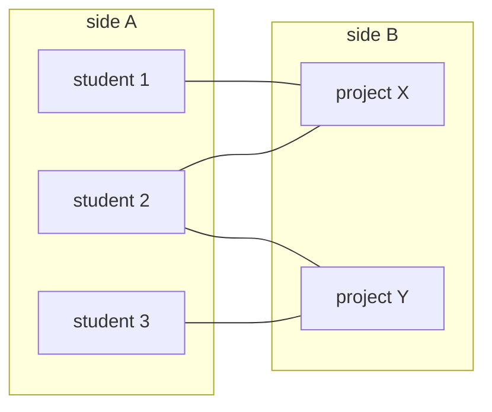

# Bipartite graphs and two-colouring

## 1. What this is, and why they ask it

A graph is **bipartite** if you can split its vertices into two groups such that every edge goes *between* the
groups and none stays inside one. Two teams with no conflicts within a team. Two tables where nobody sits
opposite someone they cannot bear.

Checking it is a traversal with one extra field: give the starting vertex a colour, give every neighbour the
opposite colour, and if you ever meet a vertex that already has the *same* colour as the one you came from,
no such split exists.

They ask it because it is the cleanest example of a whole category — **a constraint that propagates**. You do
not get to choose colours; the first choice forces everything reachable from it. And because the answer to
"when is it impossible?" is a single crisp fact worth knowing: **a graph is bipartite exactly when it contains
no cycle of odd length.**

It also hides in problems that never say "bipartite": splitting people into two groups, detecting a
contradiction in a set of "these two differ" statements, checking whether a matching problem is even
well-posed. **The tell is any problem about two sides, or about a relation that must never hold within a
group.**

By the end of this lesson you can two-colour with BFS and DFS, state and justify the odd-cycle rule, handle a
disconnected graph, return the two groups rather than just a boolean, and say what changes when the question
becomes three colours.

---

## 2. The story

There are two long tables in the hall and Kamala has ninety-four people to seat.

The list her mother-in-law gave her is not a seating plan. It is a list of pairs who must not be at the same
table, and it runs to about thirty lines, and every one of them has a history that Kamala has heard at least
twice.

Her aunt Sushila and Sushila's brother-in-law: not together. That one is from 1998 and concerns a scooter.
Ramesh and his cousin Prakash: not together. Prakash and his wife's brother: also not together. Kamala's
mother and one particular neighbour: absolutely not, and the reason was never explained to her.

She started on Wednesday evening expecting it to take an hour.

What she found straight away was that she had almost no choices. She put Sushila at the first table because
somebody had to go first. That immediately put the brother-in-law at the second table. But the brother-in-law
is also on the list with his own nephew, so the nephew goes back to the first table. And the nephew does not
speak to Kamala's mother's neighbour, so that neighbour goes to the second.

**One decision at the start, and eleven people placed with no further thought.** She was not solving anything
after the first name; she was just following.

The unrelated groups were easy. The people from her husband's office had no feuds at all, so they went
wherever there was room. And Ramesh's chain was separate from Sushila's chain entirely, so she started that
one fresh, with another arbitrary first choice.

Then she reached the five.

Her father-in-law's brothers, and it took her a long time to see what was wrong. The eldest will not sit with
the second. The second will not sit with the third. The third will not sit with the fourth, the fourth will
not sit with the fifth, and — this is the part — **the fifth will not sit with the eldest.** Five men, five
refusals, in a ring.

She placed the eldest at table one, so the second went to table two, the third back to table one, the fourth
to table two, and the fifth to table one. And the fifth and the eldest were now at the same table, which is
the one thing the ring said could not happen.

She tried it starting from a different brother. Same result. She tried it starting from the second table.
Same result.

At about eleven o'clock she understood that it was not that she was doing it badly. **Five people in a ring,
each refusing the next, cannot be split into two tables.** Six could. Four could. Five cannot, and no amount
of rearranging changes it.

She put a small third table by the window for two of them and told her mother-in-law it was for the elders.

---

## 3. The idea in plain English

Kamala's evening is two-colouring, and the five brothers are the odd cycle.

**A bipartite graph splits into two groups with no edge inside either group.** Two tables, and every pair on
the list ends up separated. The word means "two parts", and the groups are usually called the two **sides**.

**Colouring is the way to check it.** Give a vertex a colour — call them 0 and 1, or red and blue — and give
every neighbour the opposite. **You are not choosing; you are propagating.** Kamala placed Sushila and then
eleven people followed with no decision at all.

**The first choice in each component is arbitrary and does not matter.** Starting Sushila at the second table
just swaps the two sides. So the algorithm picks a colour for each unvisited start vertex and follows.

**A conflict is a neighbour that already has the same colour as you.** Not merely "already coloured" — already
coloured **the same**. A neighbour with the opposite colour is exactly what you wanted; that is the constraint
being satisfied, not violated. This is the check people get wrong, and it is the direct parallel of
[day 132](../day-132-undirected-cycles/README.md)'s "seen is not enough".

**When a conflict happens, no split exists**, and the reason is worth having: the conflict means you reached a
vertex two ways, along paths whose lengths have the same parity, which closes a cycle of **odd** length.

**The rule, in one line: a graph is bipartite if and only if it has no odd-length cycle.**

The argument in both directions is short. **If it is bipartite**, then walking along any cycle alternates
sides — side A, side B, side A — so returning to your starting vertex means you took an even number of steps.
So every cycle is even. **If every cycle is even**, then colouring by the parity of the distance from a start
vertex is consistent: two different routes to the same vertex must have the same parity, because otherwise
gluing them together would form an odd cycle.

**Kamala's five brothers are a cycle of length five.** Colours alternate 1, 2, 1, 2, 1 — and the fifth meets
the first, both at table one. Six brothers in a ring would work; five cannot.

**Trees are always bipartite**, because a tree has no cycles at all. So are grids, and any graph you can lay
out in alternating layers. **Any graph containing a triangle is not**, because a triangle is a cycle of
length three.

**The graph is probably not connected, and each piece is coloured independently.** Kamala's office group had
no constraints and Ramesh's chain was separate from Sushila's. So the algorithm needs the outer loop over all
vertices — the same requirement as
[connected components](../day-129-connected-components/README.md) — and **a graph is bipartite only if every
component is.**

**And the last thing: usually you want the two groups, not a boolean.** The colour array already holds them —
all the 0s and all the 1s — so returning the split costs one extra line and is what most real problems
actually ask for.

**Two colours is easy and three is not.** Deciding whether a graph can be coloured with three colours is
NP-complete: no known efficient algorithm, and nobody expects one. **Two-colouring is a linear-time
traversal; three-colouring is a research problem.** That cliff between two and three is worth knowing, because
an interviewer may ask.

---

## 4. The picture

Kamala's five brothers:

```
        1 ---- 2
       /        \
      5          3
       \        /
        \      /
          -- 4 --

  colour 1 as A
    2 must be B
    3 must be A
    4 must be B
    5 must be A
    ... and 5 is adjacent to 1, which is also A.   CONFLICT.

  cycle length 5 -> ODD -> not bipartite
```

Six brothers, same shape, one more person:

```
        1 ---- 2
       /        \
      6          3
      |          |
      5 ---- 4 --

  1=A  2=B  3=A  4=B  5=A  6=B
  6 is adjacent to 1: B and A.  Fine.

  cycle length 6 -> EVEN -> bipartite
  tables:  A = {1, 3, 5}    B = {2, 4, 6}
```

**What to notice.** One extra person changes it from impossible to trivial. Nothing else about the structure
differs — it is entirely the parity of the ring.

The propagation, traced with BFS:

```
graph:  0-1, 0-3, 1-2, 2-3, 3-4

step  queue      pop  neighbours    action                  colours
----  ---------  ---  -----------   ---------------------   -----------------
 1    [0]         0    1, 3          colour both 1           0:0 1:1 3:1
 2    [1,3]       1    0, 2          0 is 0, differs: ok
                                     colour 2 with 0         2:0
 3    [3,2]       3    0, 2, 4       0 is 0, differs: ok
                                     2 is 0, differs: ok
                                     colour 4 with 0         4:0
 4    [2,4]       2    1, 3          both 1, both differ: ok
 5    [4]         4    3             1, differs: ok

result: side A = {0, 2, 4}   side B = {1, 3}     bipartite
```

**What to notice at step 3.** Vertex 3 looks at vertex 2, which is already coloured — and that is **fine**,
because it is coloured differently. "Already coloured" is not a conflict; "already coloured the same" is.

And the conflict, on a triangle:

```
graph:  0-1, 1-2, 2-0

  colour 0 -> A
  colour 1 -> B     (neighbour of 0)
  colour 2 -> A     (neighbour of 1)
  now 2 looks at 0: both A.  CONFLICT.

  triangle = cycle of length 3 = odd  ->  never bipartite
```

The two-sides shape, which is what bipartite graphs usually look like when drawn deliberately:



**What to notice.** Many real bipartite graphs are bipartite *by construction* — students and projects, buyers
and sellers, jobs and machines — and nobody has to check. **The interesting problems are the ones where the
two sides are not given and you have to find out whether they exist**, which is Kamala's list.

---

## 5. The code, built step by step

BFS first, because the queue makes the propagation obvious.

```python
from collections import deque

def is_bipartite(graph: dict[int, list[int]], n: int) -> bool:
    colour = [-1] * n                             # -1 means uncoloured
    for start in range(n):                        # every component
        if colour[start] != -1:
            continue
        colour[start] = 0                         # arbitrary, and it does not matter
        queue = deque([start])
        while queue:
            vertex = queue.popleft()
            for neighbour in graph[vertex]:
                if colour[neighbour] == -1:
                    colour[neighbour] = 1 - colour[vertex]     # the opposite
                    queue.append(neighbour)
                elif colour[neighbour] == colour[vertex]:
                    return False                  # same colour: odd cycle
    return True
```

Twelve lines, and three of them carry it.

**`1 - colour[vertex]`** flips 0 to 1 and 1 to 0. Clean, and it makes "the opposite" one operation.

**`elif colour[neighbour] == colour[vertex]`** is the entire check, and note what it is *not*: it does not test
whether the neighbour has been coloured. Being coloured differently is the desired outcome.

**The outer loop over `range(n)`** handles disconnection, and the graph must be bipartite in *every*
component. `colour` doubles as the seen set, so there is no separate structure.

Returning the sides instead of a boolean is one line:

```python
def two_sides(graph: dict[int, list[int]], n: int) -> tuple[list[int], list[int]] | None:
    colour = _colour(graph, n)
    if colour is None:
        return None
    return ([v for v in range(n) if colour[v] == 0],
            [v for v in range(n) if colour[v] == 1])
```

**This is what most real problems want** — "split these into two groups" rather than "can they be split" — and
the colour array already holds the answer.

The DFS version, for comparison:

```python
def is_bipartite_dfs(graph: dict[int, list[int]], n: int) -> bool:
    colour = [-1] * n

    def visit(vertex: int, c: int) -> bool:
        colour[vertex] = c
        for neighbour in graph[vertex]:
            if colour[neighbour] == -1:
                if not visit(neighbour, 1 - c):
                    return False
            elif colour[neighbour] == c:
                return False
        return True

    return all(colour[v] != -1 or visit(v, 0) for v in range(n))
```

**Both work and both are `O(V + E)`.** I would write BFS on a graph that might be deep, for the usual reason:
a chain of a hundred thousand vertices overflows the recursion stack.

**BFS also gives you something DFS does not, cheaply: the odd cycle itself.** Keep parent pointers, and when a
conflict is found, walk both endpoints back to their common ancestor:

```python
def find_odd_cycle(graph: dict[int, list[int]], n: int) -> list[int] | None:
    colour = [-1] * n
    parent = [-1] * n
    for start in range(n):
        if colour[start] != -1:
            continue
        colour[start] = 0
        queue = deque([start])
        while queue:
            vertex = queue.popleft()
            for neighbour in graph[vertex]:
                if colour[neighbour] == -1:
                    colour[neighbour] = 1 - colour[vertex]
                    parent[neighbour] = vertex
                    queue.append(neighbour)
                elif colour[neighbour] == colour[vertex]:
                    return _build_cycle(parent, vertex, neighbour)
    return None
```

```python
def _build_cycle(parent: list[int], a: int, b: int) -> list[int]:
    """Walk both back to their meeting point; the two halves plus the edge form the cycle."""
    seen_a, node = set(), a
    while node != -1:
        seen_a.add(node)
        node = parent[node]
    meet = b
    while meet not in seen_a:
        meet = parent[meet]
    left, node = [], a
    while node != meet:
        left.append(node)
        node = parent[node]
    right, node = [], b
    while node != meet:
        right.append(node)
        node = parent[node]
    return [meet] + left[::-1] + right + [meet]
```

**Being able to show the offending cycle turns "impossible" into "here is why"**, which for Kamala's problem is
the difference between a useless answer and an actionable one.

And the variation that most interview problems actually are — the constraint is given as pairs of people who
must be separated, and the vertices are not numbered:

```python
def possible_split(n: int, dislikes: list[list[int]]) -> bool:
    """People are 1..n. dislikes[i] = [a, b] means a and b cannot share a group."""
    graph: dict[int, list[int]] = {v: [] for v in range(1, n + 1)}
    for a, b in dislikes:
        graph[a].append(b)
        graph[b].append(a)                        # undirected: BOTH directions
    ...
```

**The two appends are not optional**, and forgetting one gives a graph where the constraint only holds in one
direction — which produces a confident, wrong `True`.

### The complete solution

```python
"""Bipartite checking: two-colouring, the two sides, and the odd cycle."""

from __future__ import annotations

from collections import deque


def build(n: int, edges: list[tuple[int, int]]) -> dict[int, list[int]]:
    graph: dict[int, list[int]] = {v: [] for v in range(n)}
    for a, b in edges:
        graph[a].append(b)
        graph[b].append(a)                        # undirected: both directions
    return graph


def colour_graph(graph: dict[int, list[int]], n: int) -> list[int] | None:
    """Two-colour every component. Returns the colours, or None if impossible."""
    colour = [-1] * n
    for start in range(n):
        if colour[start] != -1:
            continue
        colour[start] = 0                         # arbitrary; it only swaps the sides
        queue = deque([start])
        while queue:
            vertex = queue.popleft()
            for neighbour in graph[vertex]:
                if colour[neighbour] == -1:
                    colour[neighbour] = 1 - colour[vertex]
                    queue.append(neighbour)
                elif colour[neighbour] == colour[vertex]:
                    return None                   # same colour across an edge
    return colour


def is_bipartite(graph: dict[int, list[int]], n: int) -> bool:
    return colour_graph(graph, n) is not None


def two_sides(graph: dict[int, list[int]], n: int) -> tuple[list[int], list[int]] | None:
    colour = colour_graph(graph, n)
    if colour is None:
        return None
    return ([v for v in range(n) if colour[v] == 0],
            [v for v in range(n) if colour[v] == 1])


def find_odd_cycle(graph: dict[int, list[int]], n: int) -> list[int] | None:
    """The offending cycle, so 'impossible' can be explained."""
    colour = [-1] * n
    parent = [-1] * n
    for start in range(n):
        if colour[start] != -1:
            continue
        colour[start] = 0
        queue = deque([start])
        while queue:
            vertex = queue.popleft()
            for neighbour in graph[vertex]:
                if colour[neighbour] == -1:
                    colour[neighbour] = 1 - colour[vertex]
                    parent[neighbour] = vertex
                    queue.append(neighbour)
                elif colour[neighbour] == colour[vertex]:
                    ancestors, node = set(), vertex
                    while node != -1:
                        ancestors.add(node)
                        node = parent[node]
                    meet = neighbour
                    while meet not in ancestors:
                        meet = parent[meet]
                    left, node = [], vertex
                    while node != meet:
                        left.append(node)
                        node = parent[node]
                    right, node = [], neighbour
                    while node != meet:
                        right.append(node)
                        node = parent[node]
                    return [meet] + left[::-1] + right
    return None


if __name__ == "__main__":
    # Kamala's five brothers in a ring: 0-1-2-3-4-0
    five = build(5, [(0, 1), (1, 2), (2, 3), (3, 4), (4, 0)])
    print("five brothers :", is_bipartite(five, 5), find_odd_cycle(five, 5))

    # Six in a ring.
    six = build(6, [(0, 1), (1, 2), (2, 3), (3, 4), (4, 5), (5, 0)])
    print("six brothers  :", is_bipartite(six, 6), two_sides(six, 6))

    # Two separate components, one of them a triangle.
    mixed = build(7, [(0, 1), (1, 2), (2, 0), (3, 4), (4, 5), (5, 6)])
    print("mixed         :", is_bipartite(mixed, 7))

    # A tree: always bipartite.
    tree = build(5, [(0, 1), (0, 2), (1, 3), (1, 4)])
    print("tree          :", is_bipartite(tree, 5), two_sides(tree, 5))
```

Running it:

```
five brothers : False [0, 1, 2, 3, 4]
six brothers  : True ([0, 2, 4], [1, 3, 5])
mixed         : False
tree          : True ([0, 3, 4], [1, 2])
```

Three things to look at. The five-brother ring is `False`, and `find_odd_cycle` names the five people
involved — which is the answer Kamala actually needed.

The six-ring splits cleanly into evens and odds, which is what alternating around an even cycle gives you.

`mixed` is `False` even though one of its two components — the path 3-4-5-6 — is perfectly bipartite. **The
whole graph is bipartite only if every component is**, and a single triangle anywhere ruins it.

And the tree is bipartite with sides `{0, 3, 4}` and `{1, 2}` — the even and odd depths. **Every tree is
bipartite**, because there are no cycles at all, let alone odd ones.

---

## 6. What it costs

**Time and space are a plain traversal.**

```
each vertex coloured once                      V
each edge examined twice (once per end)        2E
                                               -------------
                                               O(V + E) time
colour array                                   O(V)
queue or recursion stack                       O(V)
                                               -------------
                                               O(V) space
```

**No extra factor over BFS at all.** The colour array replaces the `seen` set rather than adding to it, so
this genuinely costs the same as a bare traversal.

Concretely:

```
V = 100,000, E = 300,000
100,000 + 600,000 = 700,000 steps    -> milliseconds
```

**Early exit is large in practice.** The moment a conflict is found you return, and a graph with a triangle
near the start is decided in a handful of steps. The worst case is a graph that *is* bipartite, where every
vertex and edge must be examined to be sure.

**The odd-cycle extraction adds:**

```
parent array                          O(V) extra space
walking back to the meeting point     O(V) once, only on failure
                                      -> same O(V + E) overall
```

**Memory at scale:**

```
V = 1,000,000
colour as a list of small ints        ~8 MB
parent as a list of ints              ~8 MB
queue at peak (widest level)          up to V
```

**Use a list indexed by vertex, not a dictionary**, when vertices are `0..n-1` — a Python dict of a million
entries is roughly ten times the memory of a list.

**Against the alternatives**, because "split into two groups" can be attacked other ways:

```
two-colouring (BFS/DFS)     O(V + E)          exact, linear
Union-Find with parity      O(E x alpha)      exact, and works as edges ARRIVE
brute force over subsets    O(2^V x E)        hopeless past V = 25
```

**The Union-Find version is worth knowing** — keep, alongside each element, the parity of its distance to its
representative, and an edge joining two elements already in the same group with the *same* parity is a
contradiction. Same idea, and it works online as constraints arrive, which a traversal does not.

```
V = 100,000 constraints arriving one at a time
re-running the traversal per constraint    100,000 x 400,000  = 4 x 10^10
Union-Find with parity                     100,000 x 4        = 400,000
```

**And the cliff at three colours:**

```
2-colouring     O(V + E)              a traversal
3-colouring     NP-complete           no known polynomial algorithm
                                      backtracking, ~O(3^V) worst case
                                      practical only for small V or special graphs
```

**Two is linear and three is intractable**, with nothing in between, and that is a genuinely surprising fact
worth being able to state.

---

## 7. The traps

### Treating "already coloured" as a conflict

The near-miss, and it fails on almost every bipartite graph:

```python
if colour[neighbour] != -1:
    return False                      # "already coloured, so conflict"
```

```
>>> is_bipartite_broken(build(4, [(0,1),(1,2),(2,3),(3,0)]), 4)
False                                 # a 4-cycle IS bipartite
```

A neighbour coloured the **opposite** is the constraint being satisfied. Only the **same** colour is a
conflict. This is exactly the "seen is not enough" mistake from
[day 132](../day-132-undirected-cycles/README.md), in a new costume.

### Only colouring one component

```python
colour[0] = 0
bfs_from(0)
return True
```

```
>>> mixed = build(7, [(0,1),(1,2),(2,0),(3,4),(4,5),(5,6)])
>>> single_component_version(mixed, 7)
# colours 0,1,2 -> finds the triangle -> False.  Correct here by luck.

>>> other = build(7, [(0,1),(1,2),(3,4),(4,5),(5,3)])
>>> single_component_version(other, 7)
True                                  # the triangle at 3-4-5 was never visited
```

**A graph is bipartite only if every component is**, and the sample input is usually connected so nothing warns
you. The outer loop over `range(n)` is required.

### Building the graph one-directionally

```python
for a, b in dislikes:
    graph[a].append(b)                # forgot graph[b].append(a)
```

The relation "cannot sit together" is symmetric, so the graph must be. With one direction, `b` never sees `a`
as a neighbour and the constraint is only half-enforced:

```
>>> possible_split_one_way(3, [[1,2],[1,3],[2,3]])
True                                  # a triangle. The answer is False.
```

**No error, and a confident wrong `True`** — which for a "can this be done" question is the worst direction to
be wrong in.

### Assuming the sides are balanced

```python
sideA, sideB = two_sides(graph, n)
assert len(sideA) == len(sideB)
```

Nothing requires the sides to be the same size. A star — one centre and nine leaves — is bipartite with sides
of size 1 and 9. **If the problem *also* requires equal sizes, that is a different and much harder problem**
(it becomes a partition problem, which is NP-hard), and noticing the difference is worth stating.

### Recursion depth on a long chain

```
Traceback (most recent call last):
  File "bipartite.py", line 9, in visit
    if not visit(neighbour, 1 - c):
  [Previous line repeated 995 more times]
RecursionError: maximum recursion depth exceeded
```

A path graph of a hundred thousand vertices is bipartite and takes a hundred thousand frames. `n <= 10^5` in
the constraints means write the BFS version.

### Trying to two-colour a directed graph

Bipartiteness is defined for undirected graphs. If you are handed directed edges, the question almost
certainly means "ignore the directions", and you should say so and build the graph symmetrically. Colouring
while respecting direction is a different and usually meaningless computation.

### Reaching for it when the problem needs three groups

```python
is_bipartite(graph, n)                # "can these be split into groups with no conflicts?"
```

If the problem allows three or more groups, this answers the wrong question — a triangle needs three and is
perfectly splittable. **And the three-colour version is NP-complete**, so if the problem genuinely asks for
three, either `n` is small enough for backtracking or the problem has extra structure you are meant to exploit.

---

## 8. In the interview

### How it gets asked

- *"Can these people be split into two teams with no conflicts?"* — LeetCode 886, the direct version.
- *"Is this graph bipartite?"* — LeetCode 785.
- *"Given statements that certain pairs are different, is there a contradiction?"*
- *"Split the students into two classrooms so that no two who fight are together."*
- *"Why is it impossible?"* — the odd-cycle question.
- *"Now do it with three groups."* — the NP-completeness question.

### The first ninety seconds

> "This is a bipartite check — can the vertices be split into two groups with every edge crossing between
> them — and it is a traversal with one extra array.
>
> Colour a start vertex 0. Colour every neighbour the opposite. **The check is: if a neighbour is already
> coloured the *same* as the vertex I am standing on, no split exists.** I want to be precise about that,
> because the common bug is treating 'already coloured' as the conflict — a neighbour coloured the opposite is
> exactly the constraint being satisfied, not violated.
>
> **The first colour in each component is arbitrary** — starting the other way round just swaps the two sides —
> so there is no searching or backtracking anywhere. Once one vertex is placed, everything reachable from it is
> forced.
>
> **The loop is over every vertex**, because the graph is probably disconnected and it is bipartite only if
> every component is. A single triangle in a component nobody visited makes the whole answer wrong, and the
> sample input is almost always connected so nothing warns you.
>
> **The reason a conflict means impossible is worth stating: a graph is bipartite exactly when it has no
> odd-length cycle.** Walking around a cycle alternates sides, so returning to where you started takes an even
> number of steps — an odd cycle cannot alternate, and a triangle is the smallest example.
>
> `O(V + E)` time and `O(V)` space, and the colour array replaces the seen set rather than adding to it, so it
> costs exactly what a plain BFS costs.
>
> I would write BFS rather than DFS here, because a path of a hundred thousand vertices is a legal input and
> would overflow the recursion stack.
>
> **And I would return the two groups rather than a boolean**, because that is usually what the problem
> actually wants and the colour array already holds it. Do you want the split, or just whether one exists?"

### The follow-ups

**"Why does an odd cycle make it impossible? Prove it."**

> "Both directions, and each is two sentences.
>
> **Bipartite implies no odd cycle.** In a bipartite graph every edge crosses between the two sides, so walking
> along a path alternates: A, B, A, B. To return to the vertex you started from you must be back on its
> original side, which takes an even number of steps. So every cycle has even length.
>
> **No odd cycle implies bipartite.** Colour each vertex by the parity of its distance from a chosen start.
> That is consistent as long as no two routes to the same vertex have different parities — and if they did,
> gluing those two routes together would form a cycle of odd length, which we assumed does not exist. So the
> colouring is well defined, and every edge joins vertices of different parity.
>
> **The algorithm is that second argument, executed.** BFS assigns exactly the parity of the distance, and the
> conflict check is the moment it discovers two routes of the same parity — which is the odd cycle.
>
> And I can produce the cycle itself if it helps: keep parent pointers, and on a conflict walk both endpoints
> back to their common ancestor. The two halves plus the offending edge form the odd cycle. **For a real
> problem that is much more useful than a boolean** — 'these five people are the reason' is actionable and
> 'impossible' is not."

**"The constraints arrive one at a time. After each, say whether a split still exists."**

> "Then a traversal is the wrong tool — re-running it after each constraint is `m` traversals, so at a hundred
> thousand constraints on a hundred thousand people that is around forty billion steps.
>
> The right structure is **Union-Find with parity**. Alongside each element I store the parity of its distance
> to its representative — 0 if it is on the same side as the root, 1 if the opposite. Then:
>
> A constraint 'a and b differ' means: find both roots. **If the roots differ**, merge, adjusting the parity so
> that `a` and `b` end up opposite. **If the roots are the same**, check the parities — if they are already
> opposite, the constraint is consistent and there is nothing to do; if they are the same, this constraint
> contradicts the existing ones and no split exists from here on.
>
> That is effectively constant per constraint, so a hundred thousand of them is four hundred thousand
> operations rather than forty billion.
>
> **It is the same idea as the traversal**, just carried incrementally: parity relative to a root instead of
> parity relative to a start vertex. And it is genuinely online, which the traversal cannot be — which is the
> same static-versus-dynamic rule as [day 138](../day-138-union-find/README.md)'s connected components."

**"Now split them into three groups."**

> "That is a completely different problem and I would say so immediately rather than attempt to extend the
> algorithm.
>
> **Two-colouring is linear because there is never a choice.** Once one vertex is placed, every neighbour is
> forced, and every neighbour of those, and so on — there is no branching, so a single traversal settles it.
>
> **With three colours there is a choice at every step.** A neighbour of a red vertex can be green or blue, and
> the consequences of that choice can only be discovered much later. So the algorithm becomes a search with
> backtracking, and **3-colourability is NP-complete** — one of the classic ones. There is no known polynomial
> algorithm and it is not expected that there is one.
>
> Practically: backtracking with constraint propagation solves realistic instances up to a few hundred vertices
> quickly, because good heuristics — colour the most constrained vertex first, order values to leave the most
> options — prune enormously. But the worst case is exponential.
>
> **The cliff between two and three is the interesting fact**, and it shows up elsewhere: 2-SAT is linear and
> 3-SAT is NP-complete, for essentially the same reason — with two options each constraint forces, and with
> three it merely restricts.
>
> If the problem genuinely needs three groups and `n` is large, I would look for extra structure — planar
> graphs are always four-colourable and there are efficient algorithms; interval graphs colour greedily — or
> ask whether an approximate answer is acceptable."

**"What if the two groups must be the same size?"**

> "Then it is a different and much harder problem, and I would separate the two requirements explicitly.
>
> Bipartiteness says a valid split into two sides exists. It says nothing about their sizes — a star with one
> centre and nine leaves is bipartite with sides of 1 and 9, and no rearrangement balances it, because the
> colouring is forced.
>
> **Where there is freedom is between components.** Each connected component has exactly two valid colourings —
> its own sides, and the same sides swapped — so with `k` components there are `2^k` ways to assign them, and
> the question becomes: can I choose an orientation for each component so that the totals balance?
>
> **That is a subset-sum problem.** Each component contributes a difference of `+d` or `−d` where `d` is the
> gap between its two sides, and I need those to sum to zero. Subset sum is NP-hard in general but has a
> pseudo-polynomial dynamic-programming solution in `O(k × total)`, which for realistic sizes is fine — and it
> is [day 149](../day-149-subset-sum/README.md).
>
> So the answer is: check bipartiteness first, `O(V + E)`; then, if balance is required, solve a subset-sum
> over the component differences. **Two separate problems, and noticing that the second one exists is the whole
> point of the question.**"

### The model answer

*"You have `n` people and a list of pairs who dislike each other. Split everyone into two groups so that no
group contains a disliking pair. Return the groups, or say it is impossible and explain why."*

> "This is a bipartite check, and the 'explain why' at the end changes what I build, so let me take that
> seriously rather than returning a boolean.
>
> **The model.** A vertex is a person. An edge joins two people who dislike each other, **undirected** — the
> relation is symmetric, so I add both directions when building. That is one line and forgetting it gives a
> confident wrong `True`, which for a 'can this be done' question is the worst way to be wrong.
>
> **The algorithm is BFS two-colouring.** Colour a start vertex 0, colour every neighbour the opposite, and
> report failure when a neighbour already carries the *same* colour. I would say precisely that, because
> checking 'already coloured' rather than 'coloured the same' fails on every even cycle — a four-person ring is
> perfectly splittable.
>
> **The loop runs over every person**, because a dislike list produces a very disconnected graph — most people
> have no constraints at all and form singleton components. A contradiction hiding in a component nobody
> visited is the realistic failure here, not a theoretical one.
>
> **BFS rather than DFS**, because the constraint chains can be long and I do not want a recursion limit
> deciding whether my answer is correct.
>
> **For the explanation, I keep parent pointers and extract the odd cycle on failure.** Then the answer is not
> 'impossible' but 'these five people form a ring of mutual dislikes, and a ring of odd length cannot be split
> into two' — which is something a person can act on, by adding a third group or by resolving one specific
> pair. **A boolean would be technically correct and useless**, and I think that is what the question is
> testing.
>
> **Cost:** `O(V + E)` time, `O(V)` space, with `V` people and `E` dislike pairs. For a thousand people and
> ten thousand pairs that is instant. I would use lists indexed by person rather than dictionaries, since
> people are numbered.
>
> **Two things I would clarify before coding.** Are people numbered from 0 or from 1 — LeetCode's version of
> this uses 1-based, which is an off-by-one waiting to happen. And do the groups need to be the same size?
> **If they do, that is a genuinely different problem**: bipartiteness gives me a valid split but says nothing
> about balance, and choosing which way round to orient each independent component to balance the totals is a
> subset-sum problem. I would want to know that before promising anything.
>
> **And if it turns out the constraints arrive over time** — people added to the list as the event is planned —
> I would switch to Union-Find with parity rather than re-running the traversal, because that is effectively
> constant per constraint against a full traversal each time."

---

## 9. Recall card

**Bipartite = split into two groups with every edge crossing between them.** Two-colour with BFS: colour the
start 0, neighbours get `1 - colour`, and **the conflict is a neighbour with the *same* colour** — already
coloured is not a conflict.

**A graph is bipartite ⟺ it has no odd-length cycle.** Walking a cycle alternates sides, so returning takes an
even number of steps. A triangle is the smallest counter-example; **every tree is bipartite.**

**Loop over every vertex** — the graph is bipartite only if *every* component is, and a triangle in an
unvisited component is the realistic bug. Build the graph in **both directions**; the relation is symmetric.

**`O(V + E)` time and `O(V)` space — the colour array replaces the seen set**, so it costs exactly what a plain
BFS costs. Return the two sides, not a boolean, and keep parents so you can show the odd cycle.

**Constraints arriving over time → Union-Find with parity** (effectively constant, versus a traversal each
time). **Three colours is NP-complete** — the cliff between 2 and 3 is real, and equal-sized groups is a
separate subset-sum problem.
