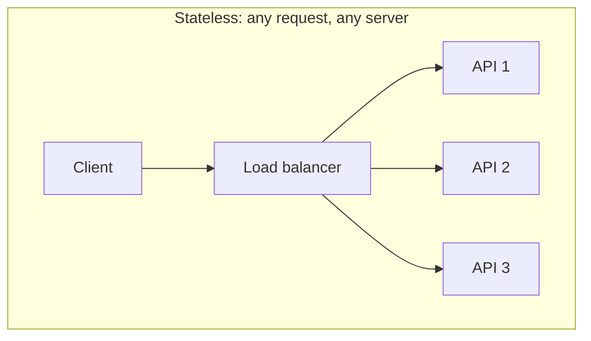
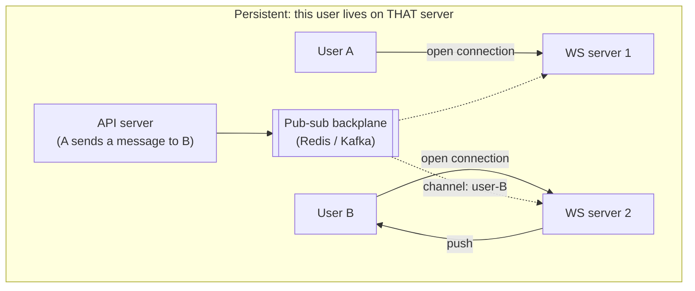

# Websockets, long polling, and server-sent events

## 1. What this is, and why they ask it

The web is built on the browser asking and the server answering. That works for everything except the case
where **the server knows something first** — a new message, a price change, a delivery moving, another player's
move — and needs to tell a browser that did not ask.

There are four ways to bridge that gap, and they are not four equivalent options. **Polling** asks
repeatedly. **Long polling** asks once and the server holds the request open until it has something.
**Server-sent events** keeps one connection open and streams updates down it. **WebSockets** upgrade the
connection to a genuine two-way channel.

They ask this because "how does the browser find out about a new message?" is a question in almost every chat,
feed, dashboard or collaborative design, and because the tempting answer — WebSockets, because it is the most
capable — is often the wrong one. **The correct answer usually depends on whether the client needs to send
anything back**, and on what holding a hundred thousand open connections does to your architecture.

The scaling half is what separates a good answer: an open connection is server state, and server state means
your stateless fleet is no longer stateless.

By the end of this lesson you can pick between the four from the requirement, quantify what polling costs at
scale, describe what changes in the architecture when connections are persistent, handle reconnection and
missed messages, and say why a chat system and a live dashboard get different answers.

---

## 2. The story

The tap in the bathroom has been dripping since Sunday and the plumber said he would come on Tuesday.

By eleven o'clock on Tuesday Anjali has rung the shop three times.

The first time the boy said he had gone to Kandivali and would come after. The second time, forty minutes
later, the same boy said the same thing in a slightly shorter way. The third time he said "he has not come
back yet, madam" before she had finished saying who she was.

This is the whole morning. She is working from home and she cannot go out, because if he arrives and the door
is not answered he will not come back until Thursday. So every twenty minutes or so she stops what she is
doing and rings, and every time the answer is no, and every one of those calls costs her about three minutes
of concentration and costs the boy at the shop his patience.

At half past twelve she tries something different. She rings and says: do not put the phone down. I will wait.
Tell me the moment he walks in.

The boy is not unwilling but it does not really work. He puts the receiver down on the counter and goes back
to what he was doing, and she can hear the shop but she cannot hear anything useful, and after eleven minutes
somebody else needs to make a call and he has to hang up. She rings again and they start over.

At twenty past one his father takes the phone, and being a practical man he says the obvious thing, which
nobody had said all morning.

"Give me your number. I will call you when he leaves."

And that is the end of it. She goes back to work and forgets about the tap. At four minutes past three the
phone rings, the father says "he is coming now, ten minutes", and she puts the kettle on.

The thing Anjali noticed afterwards, and mentioned to her husband, is that she had rung nine times and every
single one of those calls was wasted except the last one, which she did not even make. **Nine calls to find out
nothing, and one call in the other direction to find out everything.**

The thing the boy at the shop noticed is different and he mentioned it too. When four different people are all
ringing every twenty minutes, he does nothing else all day.

---

## 3. The idea in plain English

Anjali's morning is the four mechanisms, in the order she tried them.

**Polling is ringing every twenty minutes.** The client asks on a timer. Simple, works everywhere, needs
nothing special on either side.

**And almost every request is wasted.** Nine calls, one useful answer. That is the entire cost of polling, and
it scales badly in a specific way: **the load is set by the number of clients and the interval, not by how
often anything actually happens.** Ten thousand users polling every five seconds is two thousand requests a
second whether or not there is any news at all.

**It also decides your latency in advance.** Poll every five seconds and the average delay before a user sees
something is two and a half seconds. **Halving the delay doubles the load**, always, and that trade never gets
better.

**Long polling is "do not put the phone down".** The client asks, and the server **holds the request open** —
does not answer — until it has something to say or until a timeout. Then the client immediately asks again.

**It gives near-instant delivery with no wasted requests**, which is real. What it costs is exactly what
Anjali found: **the line is tied up.** Every waiting client occupies a connection and, on a traditional
thread-per-request server, a thread. And the connection gets dropped by something in the middle — a proxy, a
load balancer, a mobile network — after some number of seconds, which is why the timeout exists and why the
client must re-establish constantly.

**Server-sent events is the father's answer, one way.** One connection, opened once, and the server pushes
messages down it as they happen. It is ordinary HTTP with a `text/event-stream` response that never ends. The
browser's `EventSource` handles it, **including automatic reconnection**, which is a genuine advantage.

**It is one-directional: server to client only.** If the client needs to send something, it makes an ordinary
request, which is fine — that is what browsers do anyway.

**WebSockets is a phone line left open in both directions.** The connection starts as HTTP and is **upgraded**
to a persistent two-way channel over which either side can send at any time, with much lower per-message
overhead than HTTP.

**The choice is mostly about direction and frequency**, and the honest rule is:

- **Does the client need to send frequently, with low latency?** → WebSockets. Chat, collaborative editing,
  multiplayer games.
- **Only the server sends?** → Server-sent events. Live scores, notifications, dashboards, progress bars,
  streamed AI responses.
- **Updates are rare and latency does not matter much?** → Polling. Simplest thing that works, and often
  correct.
- **Need push and cannot use the others?** → Long polling as a fallback.

**Now the half that decides whether the design is any good: an open connection is server state.**

Your API servers were stateless — any request could go to any machine, and a machine dying cost one request.
**With persistent connections, a specific user is attached to a specific machine.** That changes four things
at once:

- **A deploy disconnects everybody.** Restarting a server drops every connection it holds, and they all
  reconnect at once — a [thundering herd](../day-125-what-a-graph-is/README.md), from your own deploy.
- **Sending a message means finding the right machine.** User B's connection is on server 7 and the message
  arrived at server 3. Server 3 has to get it to server 7, which needs a shared channel between servers.
- **Load balancing becomes uneven**, because connections are long-lived: a machine that came up early
  accumulates connections and never sheds them.
- **The connection count, not the request rate, becomes the capacity limit.**

**The standard answer to the second point is a pub-sub backplane.** Every server subscribes to the channels
for the users it holds; a message published anywhere reaches the server holding that user. That is
[day 131](../day-131-unweighted-shortest-path/README.md)'s fan-out, applied inside your own fleet.

**And the last idea, which is the one people forget: connections drop, so messages get missed.** A user on a
train loses the connection for forty seconds. **Push alone is not delivery.** The design needs a sequence
number or a cursor, so that on reconnect the client says "I last saw message 8814" and the server sends what
it missed. Without that, a WebSocket is a beautifully engineered way to silently lose messages.

---

## 4. The picture

The four mechanisms on a timeline, with the same event happening at t=7:

```
                 t=0    2    4    6    8   10
                  |     |    |    |    |    |
POLLING (every 2s)
  client:         ?     ?    ?    ?    ?    ?
  server:        no    no   no   no  YES   no
                                      ^
                                      event at t=7, delivered at t=8
                                      5 wasted requests

LONG POLLING
  client:         ?..............................
  server:                              YES        <- held open until t=7
  client:                              ?.......    <- immediately re-asks
                                      ^
                                      delivered at t=7. Zero waste.
                                      But the connection was held for 7s.

SERVER-SENT EVENTS
  client:         open ==========================>
  server:                              data: ...
                                      ^
                                      one connection, held forever,
                                      server pushes when it likes

WEBSOCKET
  client:         open <=========================>
  client:              ->  typing...
  server:                              <- data
                                      both directions, any time
```

**What to notice.** Long polling and SSE deliver at the same moment. The difference is that long polling
re-establishes the connection after every message and SSE does not — so for a chatty stream, SSE is far
cheaper, and for a rare event they are nearly identical.

The architecture change that persistent connections force:





**What to notice.** The API server that received A's message has no connection to B and no way to reach them
directly. It publishes to a channel; the server that *does* hold B's connection is subscribed and delivers.
**Every server subscribes only to the users it holds**, which is what keeps the backplane traffic proportional
to messages rather than to servers.

And the reconnection gap, which is the failure people design around last:

```
  t=0    connected, received up to message 8814
  t=12   train enters a tunnel. Connection drops.
         messages 8815, 8816, 8817 are published. The server pushes into a dead socket.
  t=52   connection re-established

  WITHOUT a cursor:  the client is now missing three messages, forever, silently.
  WITH a cursor:     client reconnects saying "last seen 8814"
                     server replies with 8815-8817, then resumes live
```

---

## 5. How it actually works

### Polling

```javascript
setInterval(async () => {
  const res = await fetch(`/api/messages?since=${lastId}`);
  const messages = await res.json();
  if (messages.length) render(messages);
}, 5000);
```

**Two things make polling much less bad than its reputation.** Sending `since=lastId` means the response is
usually empty rather than a full re-fetch. And an HTTP `304 Not Modified` with an `ETag` costs a few hundred
bytes rather than a full body.

**It is also the only mechanism that survives everything** — every proxy, every corporate firewall, every
ancient browser — and it is stateless, so it needs no architectural change at all. **For a notification badge
checked every thirty seconds, it is the correct answer**, and saying so is better than reaching for WebSockets.

### Long polling

```javascript
async function poll() {
  try {
    const res = await fetch(`/api/messages?since=${lastId}`, { signal: timeout(30000) });
    const messages = await res.json();
    if (messages.length) { render(messages); lastId = last(messages).id; }
  } catch (e) { /* timeout or drop */ }
  poll();                         // immediately ask again
}
```

Server side, the request is held until there is something or the timeout expires — typically 20 to 30 seconds,
chosen to be shorter than whatever the intermediaries will tolerate.

**On a thread-per-request server this is a disaster**: ten thousand waiting clients is ten thousand blocked
threads, and each is about a megabyte of stack. **On an async server it is fine** — a waiting request is a
suspended coroutine costing a few kilobytes. That difference is why long polling was painful in 2010 and is
merely unfashionable now.

**The gap is the subtle bug.** Between the server answering and the client re-asking there is a window of a
few milliseconds. A message published in that window is missed unless the client sends `since=lastId` and the
server serves from a buffer rather than only from live events. **`since` is not an optimisation here, it is
correctness.**

### Server-sent events

```javascript
const es = new EventSource("/api/stream");
es.onmessage = (e) => render(JSON.parse(e.data));
```

```
HTTP/1.1 200 OK
Content-Type: text/event-stream
Cache-Control: no-cache

id: 8815
data: {"from":"anjali","text":"he is coming"}

: heartbeat
```

Four things it gives you free, and they are why it is underused:

- **Automatic reconnection.** `EventSource` retries with a delay the server can set via a `retry:` field.
- **The `Last-Event-ID` header.** On reconnect the browser automatically sends the id of the last event it
  received, so **the resume-from-cursor mechanism is built into the protocol** rather than something you invent.
- **Plain HTTP.** Proxies, compression, authentication cookies and HTTP/2 multiplexing all work unchanged.
- **Text framing** with no library needed on either side.

**Its limits:** one direction only; text only, so binary must be encoded; and over HTTP/1.1 it consumes one of
the browser's six connections per domain, which HTTP/2 fixes by multiplexing.

**The colon-prefixed heartbeat line matters more than it looks.** Proxies close idle connections, so an
otherwise-silent stream must emit a comment every 15–30 seconds to stay alive.

### WebSockets

```javascript
const ws = new WebSocket("wss://example.com/socket");
ws.onmessage = (e) => render(JSON.parse(e.data));
ws.send(JSON.stringify({ type: "typing" }));
```

The handshake is an HTTP request with `Upgrade: websocket`; after the `101 Switching Protocols` response the
connection is a bidirectional frame-based channel.

**Per-message overhead is 2 to 14 bytes**, against several hundred for an HTTP request with headers and
cookies. **That is the real argument for WebSockets on a chatty channel** — not "it is real-time", but that a
typing indicator costing 6 bytes instead of 700 changes what is affordable.

**What you take on:** heartbeats (ping/pong) to detect dead connections, because TCP will happily keep a dead
connection open for minutes; reconnection with backoff and jitter, written by you; message ordering and
delivery guarantees, also yours; and `wss://` in production, without which corporate proxies mangle the
upgrade.

### The scaling shape

**Sticky sessions or a connection-aware router.** The load balancer must send a reconnecting client's traffic
to a server that can serve it — or, better, any server, with a backplane doing the routing.

**The pub-sub backplane** is the standard pattern. Redis pub-sub is the common choice for chat because
messages are ephemeral; Kafka when the stream must be durable and replayable.

```
message arrives at API server 3, for user B
    -> PUBLISH channel:user-B  {...}
    -> WS server 7 is SUBSCRIBEd to channel:user-B (it holds B's connection)
    -> pushes down B's socket
```

**Each server subscribes only to its own users' channels**, so backplane traffic scales with messages, not
with `messages × servers`.

**And the deploy problem needs a deliberate answer.** Restarting a fleet of WebSocket servers disconnects
everyone at once, and they all reconnect within a second. The mitigations are: **jittered reconnect in the
client**, shipped from day one because you cannot deploy a fix to disconnected clients; **draining** — stop
accepting new connections, then close existing ones gradually over minutes; and a rolling restart that takes
one server at a time.

### Push notifications are a different thing

When the app is closed, none of this applies — there is no connection to hold. That is APNs and FCM, going
through the operating system, and it is [tomorrow's](../day-141-multi-source-bfs/README.md) lesson.
**"Real-time while the app is open" and "notify when it is closed" are two separate systems**, and a design
that conflates them is incomplete.

---

## 6. The numbers

**What polling costs.** 100,000 concurrent users, polling every 5 seconds:

```
100,000 / 5 s                          = 20,000 requests/second
each request: headers + cookies        ~800 bytes up, ~300 down
bandwidth                              20,000 x 1.1 KB = 22 MB/s = 176 Mbps
```

```
if 1% of polls return anything:
    useful responses    200/s
    wasted requests     19,800/s        -> 99% waste
```

**And halving the latency doubles all of it:**

```
poll every 5 s   -> 20,000 req/s, average delay 2.5 s
poll every 1 s   -> 100,000 req/s, average delay 0.5 s
poll every 0.5 s -> 200,000 req/s, average delay 0.25 s
```

**With WebSockets:**

```
100,000 open connections
memory per connection (async server)   ~10-50 KB
                                       100,000 x 30 KB = 3 GB
per message overhead                   ~6 bytes + payload
actual message rate                    200/s
bandwidth                              200 x 200 bytes = 40 KB/s
```

**176 Mbps against 40 KB/s** — a factor of about four thousand — because the traffic is now proportional to
events rather than to clients times frequency.

**Connections per server:**

```
Node.js / Go / async Python, tuned     ~50,000-100,000 connections per machine
                                       (file descriptors, memory, and the
                                        ephemeral port range are the limits)
100,000 users                          2-4 machines for connections alone
1,000,000 users                        20-40 machines
```

**Compare that with a stateless API fleet**, where a machine handles thousands of requests a second and there
is no per-user cost at all. **Persistent connections make your capacity a function of *users online*, not of
*requests*,** and that is a different sizing conversation.

**The backplane:**

```
1,000,000 users, average 1 message received per user per minute
messages/s                             1,000,000 / 60 = 16,667
each published once to the backplane   16,667 publishes/s
Redis pub-sub capacity                 ~1,000,000 messages/s -> comfortable
```

**But if every server subscribed to everything:**

```
16,667 messages/s x 40 servers         = 666,667 deliveries/s
                                         and every server filters out 97.5%
```

**Per-user channels rather than a firehose is the difference between comfortable and impossible**, and it is
the design detail that matters most in the backplane.

**The deploy herd:**

```
40 servers x 25,000 connections        = 1,000,000 clients
rolling restart, all at once           1,000,000 reconnects in ~1 second
                                       -> the replacement servers are overwhelmed
with 30 s of jitter                    ~33,000 reconnects/s   -> survivable
rolling one server at a time           25,000 at a time       -> invisible
```

**Long polling on a threaded server:**

```
10,000 waiting clients x 1 MB thread stack  = 10 GB
                                              -> not viable

on an async server: 10,000 suspended coroutines x ~10 KB = 100 MB
                                              -> fine
```

**Latency comparison:**

```
polling, 5 s interval          0-5 s, average 2.5 s
long polling                   ~network round trip, ~50 ms
SSE                            ~50 ms
WebSocket                      ~50 ms, and much lower per-message cost
```

**All three push mechanisms deliver at essentially the same speed.** The choice is about direction, overhead
and operational complexity — not about latency, which is a common misconception.

---

## 7. The trade-offs

**Polling wastes requests and buys simplicity.** Ninety-nine percent waste at a five-second interval, and in
exchange: no server state, no connection management, no deploy problem, no reconnection logic, works through
every proxy in existence, and any server can serve any request. **For infrequent updates that is a good trade
and reaching past it is over-engineering.**

**Persistent connections make your fleet stateful, and that is the real cost.** A user is bound to a machine.
Deploys disconnect everyone. Load balancing goes uneven because connections never rebalance on their own.
Capacity is measured in concurrent users rather than requests a second. **None of that is hard, and all of it
is work you did not have before.**

**WebSockets give you two directions and hand you everything else.** Heartbeats, reconnection, backoff,
ordering, delivery guarantees, message framing — all yours to write. SSE gives you reconnection and event ids
for free and takes away one direction. **If the client does not need to send frequently, SSE is a much
smaller amount of code for the same user experience**, and it is chronically under-chosen.

**Push is not delivery.** Every one of these mechanisms drops messages when the connection drops, and it drops
constantly on mobile. **A cursor or sequence number is not optional** — without it, a message published during
a forty-second tunnel is gone with no error anywhere. SSE has this built in as `Last-Event-ID`; with
WebSockets you build it.

**The backplane is another system in the critical path.** Redis pub-sub is fast and fire-and-forget, so a
message published while a server is momentarily disconnected is lost — which is
[day 131](../day-131-unweighted-shortest-path/README.md)'s warning, and it matters here because chat messages
are exactly the thing you must not lose. **Store the message durably first, then publish the notification**,
so the push is an optimisation and the store is the source of truth.

**And more real-time than the product needs is a cost with no benefit.** A dashboard refreshed every ten
seconds is indistinguishable from one refreshed continuously, to a human looking at a number. **The question
is not "can we push?" but "does anyone notice the difference?"**

**When would I not use any of them?** When updates are rare and the user can pull to refresh — most content
apps. When the "real-time" requirement came from a diagram rather than a user. And when the app is closed,
where none of this works and the answer is a platform push notification.

---

## 8. In the interview

### How it gets asked

- *"How does the browser find out about a new message?"* — the direct version.
- *"Design a live dashboard / notification system / chat."*
- *"Why not just poll?"* — the arithmetic question.
- *"You have a million concurrent connections. What breaks?"* — the scaling question.
- *"A deploy disconnected every user at once. What now?"*
- *"WebSockets or server-sent events?"*

### The first ninety seconds

> "Four options, and the choice comes down to two questions: does the client need to send, and how often does
> anything actually happen.
>
> **Polling** is the client asking on a timer. Simple, stateless, works through every proxy — and at a
> five-second interval with a hundred thousand users that is twenty thousand requests a second, of which about
> ninety-nine percent return nothing. And the latency is fixed in advance: halving it doubles the load,
> forever.
>
> **Long polling** holds the request open until there is something. Near-instant delivery with no waste, at
> the cost of an occupied connection per waiting client — fine on an async server, ruinous on a
> thread-per-request one.
>
> **Server-sent events** is one HTTP connection held open with the server streaming down it. One direction
> only, and it gives me two things free that I would otherwise write: **automatic reconnection, and the
> `Last-Event-ID` header**, so resuming from where the client left off is built into the protocol.
>
> **WebSockets** upgrade to a genuine two-way channel. Per-message overhead of a few bytes against several
> hundred for an HTTP request, which is what makes something like a typing indicator affordable.
>
> **My rule: if the client sends frequently, WebSockets. If only the server sends, SSE. If updates are rare,
> polling — and I would defend that rather than treat it as a failure.**
>
> **The part I would flag before you ask is that persistent connections make the fleet stateful.** A user is
> now bound to a specific machine, so sending them a message from a different machine needs a pub-sub
> backplane; a deploy disconnects everyone at once and they all reconnect together; load balancing goes uneven
> because long-lived connections never rebalance; and capacity becomes a function of users online rather than
> requests per second.
>
> **And push is not delivery.** Connections drop constantly on mobile, so every design needs a cursor —
> 'I last saw message 8814' — or a forty-second tunnel silently loses three messages.
>
> Does the client need to send, and how often do updates actually happen?"

### The follow-ups

**"Why not just poll? Give me the numbers."**

> "Sometimes just poll — I would say that first, because for infrequent updates it is the right answer and
> everything else is over-engineering.
>
> The arithmetic for when it stops working: a hundred thousand concurrent users at a five-second interval is
> twenty thousand requests a second. Each request carries headers and cookies — call it 800 bytes up and 300
> down — so about 22 megabytes a second, 176 megabits, of traffic that mostly says 'nothing new'. If one
> percent of polls return something, ninety-nine percent of that is waste.
>
> **And it does not improve as you tune it.** The load is set by clients times frequency, not by how often
> anything happens. Poll every second instead and it is a hundred thousand requests a second. **The latency
> and the load are locked together and you can only trade one for the other.**
>
> The same workload over WebSockets is a hundred thousand open connections — about three gigabytes of memory
> across a few machines — carrying two hundred actual messages a second at a few hundred bytes each. Forty
> kilobytes a second against twenty-two megabytes.
>
> **Where polling stays correct:** a notification badge checked every thirty seconds, a status page, anything
> where a minute of delay is invisible. And I would make it a *conditional* poll — send the last-seen id or an
> `ETag`, so the usual response is empty or a 304 rather than a full payload. That alone often makes polling
> viable at ten times the scale people assume."

**"A million concurrent connections. What breaks first?"**

> "Not bandwidth — the messages are small. Four things, roughly in this order.
>
> **Memory per connection.** Ten to fifty kilobytes each on a tuned async server, so a million connections is
> tens of gigabytes across the fleet. At fifty thousand connections per machine that is twenty machines doing
> nothing but holding sockets.
>
> **File descriptors and ephemeral ports.** Both need raising from their defaults, and the port range limits
> outbound connections per source address — which matters for the backplane rather than for clients.
>
> **The backplane, if it is designed wrong.** If every server subscribes to every message, sixteen thousand
> messages a second across forty servers is six hundred and sixty thousand deliveries a second, of which each
> server discards 97 percent. **Per-user or per-room channels fix that** and it is the single most important
> design decision in the backplane.
>
> **And deploys, which is the one that actually causes incidents.** Restarting forty servers holding
> twenty-five thousand connections each means a million clients reconnecting within about a second. The
> replacement servers fall over, clients retry, and it becomes self-sustaining. **Three mitigations, all
> required:** jittered reconnect in the client — shipped from day one, because you cannot deploy a fix to
> disconnected clients; connection draining, so a server stops accepting new connections and closes existing
> ones over minutes; and a rolling restart, one machine at a time, so only twenty-five thousand reconnect at
> once.
>
> **And I would question the requirement.** A million *concurrent* connections is a large product. If it is
> really a million registered users with fifty thousand online, the answer is much smaller."

**"WebSockets or server-sent events?"**

> "SSE unless the client needs to send frequently, and I think SSE is chronically under-chosen.
>
> **What SSE gives me free:** automatic reconnection in the browser, with a retry interval the server can set;
> the `Last-Event-ID` header sent automatically on reconnect, so **resume-from-cursor is part of the protocol**
> rather than something I design; and plain HTTP, so proxies, compression, auth cookies and HTTP/2
> multiplexing all work with no special handling.
>
> **What it costs:** one direction, and text only. But the client can still send — with an ordinary HTTP
> request, which is what browsers are for. For notifications, live scores, a dashboard, a progress bar, or
> streaming a model's output token by token, that is completely sufficient and it is a fraction of the code.
>
> **WebSockets earn their place when the client sends often and latency matters on that path too.** Chat with
> typing indicators, collaborative editing, multiplayer games. The per-message overhead is a few bytes against
> several hundred for an HTTP request, so a typing indicator every keystroke is affordable over a socket and
> absurd over HTTP.
>
> **The hidden cost of WebSockets is everything the protocol does not give you:** heartbeats, because TCP will
> hold a dead connection open for minutes; reconnection with backoff and jitter; message ordering; delivery
> guarantees; and framing. Every one of those is code you write and get wrong once.
>
> One practical note: use `wss://` in production regardless. Plain `ws://` gets mangled by corporate proxies
> often enough that it is not worth debugging."

**"How do you make sure no message is lost?"**

> "By not relying on the push for delivery, and I would state that as the principle before the mechanism.
>
> **The message is written durably first — to the database — and the push is a notification that something
> changed.** If the push is lost, the message still exists and the client will get it on its next fetch. If I
> invert that and treat the socket as the delivery mechanism, then a dropped connection is lost data.
>
> **Then the cursor.** Every message has a monotonically increasing id per conversation. The client remembers
> the last id it rendered. On connect or reconnect it says 'I last saw 8814', and the server sends everything
> since, then switches to live push. **SSE gives me exactly this via `Last-Event-ID`; with WebSockets I send it
> in the first frame after connecting.**
>
> **The subtle gap is between the catch-up and the live stream.** A message published while the server is
> sending the backlog can be missed or duplicated. The clean way is: subscribe to the live stream **first**,
> buffer what arrives, then fetch the backlog, then replay the buffer, discarding anything at or below the last
> id delivered. Ordering by id makes deduplication trivial.
>
> **And the client must deduplicate anyway**, because at-least-once is the only guarantee available — the
> client can receive a message, fail to render it, and reconnect asking for the same range. Rendering keyed by
> message id makes a duplicate a no-op.
>
> **The related failure I would name:** Redis pub-sub is fire-and-forget, so a message published while a
> WebSocket server is briefly disconnected from Redis is gone. That is fine precisely *because* the message is
> already in the database and the cursor mechanism will catch it. **Fire-and-forget is acceptable for the
> notification and never for the data.**"

### The model answer

*"Design the real-time layer for a chat application: one-to-one and group chats, typing indicators, read
receipts, presence, and it must work on mobile networks."*

> "Chat is the case where WebSockets genuinely win, so let me say why rather than assume it, and then spend
> most of the time on the parts that are not the protocol choice.
>
> **WebSockets, because the client sends constantly.** Typing indicators, read receipts and presence pings all
> go client-to-server, frequently, and at a few bytes of overhead per frame against several hundred for an HTTP
> request. A typing indicator every keystroke is affordable over a socket and absurd otherwise. **If this were
> notifications only, I would use SSE and write half as much code.**
>
> **The write path, and this is the most important decision: the message is persisted before it is pushed.**
> Client sends over the socket; the server writes it to the message store with a monotonic per-conversation
> id; then it publishes to the backplane; then it acknowledges to the sender. **The socket is a delivery
> optimisation and the database is the source of truth.** If I invert that, a dropped connection is lost data
> rather than delayed data.
>
> **Fan-out via a pub-sub backplane, on per-conversation channels.** The server holding the sender's connection
> publishes to `conversation:4471`; every server holding a participant of that conversation is subscribed and
> pushes down the relevant sockets. **Per-conversation rather than a firehose**, or every server processes
> every message in the system and discards almost all of it.
>
> **Mobile is the requirement that shapes the rest**, because connections drop constantly — tunnels, lifts,
> handovers between towers, and the operating system suspending the app.
>
> **So: a cursor, and it is not optional.** The client stores the last message id it rendered per conversation.
> On every connect it sends that; the server replies with everything since, then switches to live. Subscribe
> first, buffer, fetch the backlog, replay the buffer discarding anything already delivered — otherwise there
> is a gap between the catch-up and the live stream. And the client deduplicates by message id, because
> at-least-once is the only guarantee on offer.
>
> **Heartbeats both ways**, because TCP holds dead connections open for minutes and a phone that walked into a
> lift looks perfectly connected. Ping every thirty seconds, close after two misses — and the client uses those
> same misses to trigger reconnection with backoff **and jitter**, which must ship in the first release because
> I cannot deploy a fix to clients that are not connected.
>
> **Presence is the part I would deliberately make cheap.** 'Online' is the existence of a connection plus a
> recent heartbeat, held in Redis with a TTL of about a minute, refreshed by the heartbeat. **I would not push
> presence changes for everyone to everyone** — that is `n²` traffic in a large group and it is the classic way
> chat systems melt. Presence is fetched when a conversation is opened, and pushed only for the small set of
> conversations currently on screen.
>
> **Typing indicators are fire-and-forget and never persisted.** They expire after a few seconds client-side,
> they are throttled to at most one per second per user, and losing one costs nothing. **Being explicit about
> which data is durable and which is ephemeral is most of what keeps this affordable.**
>
> **Deploys:** rolling, one server at a time, with draining — stop accepting new connections, then close
> existing ones over a few minutes rather than all at once. Twenty-five thousand clients reconnecting is
> invisible; a million is an outage of your own making.
>
> **And when the app is closed, none of this works**, which is the boundary I would draw explicitly. There is
> no socket to push down, so undelivered messages go to APNs or FCM as a platform push notification — a
> completely separate path, with its own delivery semantics, and the two systems have to agree on what has
> already been seen so the user is not notified twice for a message they read on the web."

---

## 9. Recall card

**Four mechanisms:** polling (simple, stateless, ~99% waste, latency and load locked together), long polling
(instant, holds a connection per waiting client), **SSE** (one HTTP stream, server→client only, and it gives
you **automatic reconnect plus `Last-Event-ID`** free), **WebSockets** (two-way, ~6 bytes per message, and
everything else is yours to write).

**Choose on direction and frequency:** client sends often → WebSockets; server only → SSE; rare updates →
polling, and defend it.

**Persistent connections make a stateless fleet stateful.** A user is bound to a machine, so cross-server
delivery needs a **pub-sub backplane on per-user or per-room channels** — a firehose makes every server discard
97% of everything.

**Push is not delivery.** Persist the message first and treat the push as a notification; every client carries
a **cursor** so a reconnect resumes from the last id. Subscribe-then-backfill-then-replay closes the gap, and
clients deduplicate by id.

**Deploys are the incident.** A million clients reconnecting in one second takes down the replacements —
**jittered reconnect shipped from day one**, connection draining, and rolling one server at a time. And when
the app is closed, none of this applies: that is a platform push notification.
