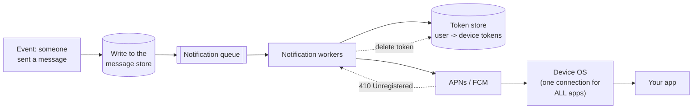

# Push notifications, end to end

## 1. What this is, and why they ask it

Yesterday's mechanisms all require the app to be open and connected. A push notification is what happens when
it is not — the phone is in a pocket, the app was killed three days ago, and a message still has to appear on
the lock screen.

**You cannot reach the device.** Your servers have no route to a phone behind a mobile carrier's network, and
even if they did, the operating system would not let a sleeping app receive anything. **The only channel is
Apple's APNs or Google's FCM**, which maintain their own persistent connection to every device and are the
only software permitted to wake an app.

So the whole design is: get a token, keep it fresh, hand your message to the platform, and accept that you
have no idea whether it arrived.

They ask this because almost every consumer product needs it, because "how does a notification actually reach
the device?" has a specific answer most people have never traced, and because the interesting parts are the
ones nobody thinks about until production — **token invalidation, fan-out at scale, and the fact that delivery
is not guaranteed and not reported.**

By the end of this lesson you can trace a notification from a database write to a lock screen, name every
component, handle token lifecycle properly, size a fan-out to ten million devices, and say what you do about
the delivery guarantee you do not have.

---

## 2. The story

Lakshmi's son is in the hostel at Manipal and she cannot ring his room, because there is no phone in the room
and there never was.

What there is, is a number for the hostel office, and a man called Devaraj who sits at the desk from six in
the morning until ten at night, and a board behind him with three hundred and eighty pegs on it.

The arrangement is that she rings the office, says the room number, and Devaraj decides what happens next.

Most of the time it is fine. She rings at half past seven, he sends the boy up, and her son comes down and
rings her back from the desk phone. Perhaps ten minutes.

But the things she has learnt over two years are all about what Devaraj will and will not do, and none of them
were explained to her at the start.

**He will not knock after ten.** Unless she says the word "urgent", in which case he will, once, and if there
is no answer that is the end of it. She used the word for a real emergency in the first month and he came
straight up, and she has been careful with it since.

**He does not tell her whether the message got through.** She rings, she says the room number, he says
"right", and the call ends. Whether her son was in the room, whether he was asleep, whether the boy actually
went up — none of that comes back to her. She finds out when he rings, or she does not find out.

**And the room number goes stale.** Her son changed rooms in the second year and did not think to tell her,
and for eleven days she rang and gave the old number and Devaraj sent the boy to the old room, where a
different boy said he did not know any Prakash. Nobody rang her to say the number was wrong. She only found
out because she happened to mention the room number in a conversation and her son said that was not his room
any more.

**And he will not carry the same message four times.** She rang three times in one afternoon once, worried
about something, and the third time he said, quite kindly, that he had already sent the boy twice and would
send him once more at six when the mess opened and everybody would be downstairs anyway.

Her sister, whose daughter is in a hostel with two hundred and forty girls, described a Sunday evening when
thirty parents rang within about twenty minutes because the exam results had come out. The woman at that desk
took every call and then sent one boy round the whole building with a list, floor by floor, which took
seventy minutes and was the only way it could have been done.

---

## 3. The idea in plain English

Devaraj is APNs and FCM, and every one of Lakshmi's four lessons is a property of push notification systems.

**You cannot reach the device directly.** A phone on a mobile network has no public address, moves between
networks, and sleeps. **The operating system holds one persistent connection to Apple's or Google's servers**
and everything for every app on that phone comes down that single connection — which is why battery life is
tolerable at all, and why you cannot have your own.

**So the flow is always three hops:** your server → the platform (APNs or FCM) → the device's operating system
→ your app. **You only control the first hop.**

**A device token is the room number.** When your app first runs, it asks the operating system for permission
and receives a **token** — an opaque string identifying this app on this device. The app sends it to your
server, and your server stores it against the user. **That token is the only way anyone can address that
device**, and every notification you send names it.

**Tokens go stale, and nobody tells you.** The user reinstalls, restores from a backup, updates the OS, or
deletes the app. **The old token stops working and no message arrives to say so.** Lakshmi rang the old room
for eleven days.

**What you get instead is a rejection, and only when you send.** APNs returns `410 Unregistered`; FCM returns
`UNREGISTERED` or `INVALID_ARGUMENT`. **That response is the only notification-of-invalidation you will ever
receive, and you must act on it by deleting the token** — because if you do not, you accumulate dead tokens
forever and eventually most of what you send goes nowhere.

**Delivery is not guaranteed and not reported.** Devaraj says "right" and the call ends. APNs accepts your
request and returns success, and that success means *accepted for delivery*, not delivered. The phone may be
off, out of coverage for a week, or the user may have muted your app. **There is no acknowledgement from the
device**, and any design that assumes one is wrong.

**The consequence is the important one: a push is a nudge, not a delivery mechanism.** The message itself
lives in your database. The push says "there is something new", and the app fetches the real content when it
opens. **If the push is lost, the user still sees the message when they next open the app.** Invert that —
put the only copy of the content in the notification — and a lost push is lost data.

**Priority is the "urgent" word.** Both platforms have a high and a normal priority. **High priority wakes the
device immediately** and is for something the user genuinely wants now — a message, a call, a delivery
arriving. **Normal priority is batched by the OS** and may be delayed to save battery. Marking everything
high is abuse, and both platforms throttle apps that do it.

**Collapsing is Devaraj refusing to carry the same message four times.** Both platforms support a
**collapse key**: a new notification with the same key replaces any undelivered one. Three unread-count
updates while the phone was off become one. **Without it, a user who was offline for a day opens their phone
to forty notifications**, which is how apps get their notifications turned off permanently.

**And the exam-results Sunday is fan-out.** One event, thirty parents — or ten million devices. The sending
itself is a queue and a pool of workers, and the platform's own rate limits are usually not the constraint;
**your ability to read ten million tokens and make ten million HTTP calls is.**

---

## 4. The picture

The path, end to end:



**What to notice.** The message is written to the store **before** anything is queued — the push is triggered
by a durable fact, not the other way round. And the only feedback loop is the dotted one: a rejection telling
you a token is dead. **There is no arrow from the device back to you saying "received".**

The three hops, and who controls each:

```
  YOUR SERVER  ---(1)--->  APNs / FCM  ---(2)--->  DEVICE OS  ---(3)--->  YOUR APP

  (1) you control this.        HTTP/2 request with a token and a payload.
                               You get a response: accepted, or a token error.

  (2) you control NOTHING.     Platform's persistent connection to the device.
                               May be delayed, batched, or dropped entirely.
                               No feedback of any kind.

  (3) the OS decides.          Shows it, or wakes your app, or does neither
                               if the user muted you or is in Focus mode.
```

**What to notice.** Two of the three hops are outside your system, and the two you do not control are the ones
that decide whether anyone sees it.

The token lifecycle, which is where the bugs live:

```
   app installed
        |
        v
   ask permission ----> DENIED ----> no token, ever. Handle this.
        |
        v GRANTED
   OS issues a token
        |
        v
   app sends token to your server  --->  store (user, token, platform, updated_at)
        |
        |   ... user reinstalls / restores a backup / updates the OS
        v
   token silently becomes INVALID
        |
        v
   you send        --->  APNs returns 410 Unregistered
        |
        v
   DELETE the token. This is the ONLY signal you will get.
```

And the fan-out shape, for a broadcast:

```
  one event -> 10,000,000 devices

  BAD:  one worker loops over 10 million tokens
        at 50 ms per HTTP call = 138 hours

  GOOD: chunk the token list, push chunks onto a queue,
        N workers each hold a persistent HTTP/2 connection
        and pipeline many requests down it

        500 workers x 200 requests/s = 100,000/s
        10,000,000 / 100,000 = 100 seconds
```

---

## 5. How it actually works

### APNs and FCM, concretely

**APNs** (Apple Push Notification service) speaks HTTP/2. You authenticate with a JWT signed by a key from
your developer account, and you send one request per device token:

```
POST /3/device/<device-token>
authorization: bearer <jwt>
apns-topic: com.example.app
apns-priority: 10                 # 10 = immediate, 5 = power-efficient
apns-push-type: alert             # alert | background | voip | ...
apns-collapse-id: chat-4471       # replaces an undelivered one with the same id
apns-expiration: 1767225600       # discard after this time

{"aps": {"alert": {"title": "Prakash", "body": "on my way"}, "badge": 3, "sound": "default"}}
```

**The connection is the thing to get right.** HTTP/2 lets you multiplex many requests over one connection, so
you open a small number of persistent connections and pipeline down them. Opening a connection per
notification is the classic mistake and it caps you at a fraction of the throughput.

**FCM** (Firebase Cloud Messaging) is Google's, and it also fronts Android's own transport. Its HTTP v1 API
takes one message per request, with a `token` and separate `android`, `apns` and `webpush` blocks so one call
can target several platforms.

**FCM can also relay to APNs**, which is why many teams use FCM as a single interface for both — one API, one
integration, at the cost of an extra hop and a dependency on Google for iOS delivery.

### The payload limits, which shape the design

```
APNs      4 KB   (5 KB for some types)
FCM       4 KB
```

**Four kilobytes is not much**, and it is the technical reason the "push is a nudge" rule is not merely good
practice. A message body, a title, an image URL, a deep link and some metadata fill it quickly. **Send the
ids, not the content**, and let the app fetch.

### Silent pushes

A **background** or **data-only** push wakes your app without showing anything, so it can fetch and update
before the user opens it.

```json
{"aps": {"content-available": 1}}
```

**Both platforms treat these as a privilege and throttle them heavily.** iOS in particular decides when — or
whether — to deliver a background push based on battery, network, and how the user actually uses your app.
**A silent push is a hint, not a scheduled task**, and any design that relies on one firing promptly will fail
in the field.

### Token management, which is most of the work

```sql
CREATE TABLE device_tokens (
    user_id     BIGINT      NOT NULL,
    token       TEXT        NOT NULL,
    platform    TEXT        NOT NULL,        -- ios | android | web
    app_version TEXT,
    created_at  TIMESTAMPTZ NOT NULL,
    last_seen   TIMESTAMPTZ NOT NULL,        -- refreshed on every app open
    PRIMARY KEY (token)
);
CREATE INDEX ON device_tokens (user_id);
```

**Token, not user, is the primary key**, because one user has several devices and a device can change hands.

Four rules that keep this healthy:

- **Refresh `last_seen` whenever the app opens** and re-register the token, because tokens change silently.
- **Delete on a `410` or `UNREGISTERED` response.** This is the only invalidation signal in existence.
- **Prune tokens unseen for, say, six months.** They are almost certainly dead and you are paying to send to
  them.
- **Handle the same token appearing for a different user** — a shared or resold device. The new registration
  wins, and the old association must be removed, or you will send one user's private messages to another
  person's phone. **That is the token bug that becomes a security incident.**

### Fan-out at scale

For a broadcast to millions, the shape is a queue and a pool:

```
1. select token ranges (by id, not OFFSET) into chunks of ~1,000
2. push each chunk onto a queue
3. workers pull chunks, hold persistent HTTP/2 connections, pipeline requests
4. record failures; delete invalidated tokens
```

**Chunk by primary-key range, never `LIMIT/OFFSET`** — deep offsets over ten million rows get quadratically
slower, and rows shifting under a paginated scan cause both duplicates and misses.

**And the notification itself should be built once and shared**, not rendered per device, unless it is
personalised. Rendering ten million payloads when one would do is a surprising amount of CPU.

### Deduplication and rate limiting the user

**Per-user throttling is a product requirement, not a nicety.** A user who receives forty notifications in an
evening turns them off, and turning them off is permanent in practice.

```
per user:  at most N notifications per hour, per category
           collapse repeated updates of the same object
           respect quiet hours in the user's timezone
           batch low-priority ones into a digest
```

**The collapse key does part of this at the platform** — replacing an undelivered notification with a newer
one of the same key — but only for undelivered ones. **Anything already delivered is delivered**, so the
throttling has to happen on your side as well.

### Web push

Browsers use the **Web Push protocol** with **VAPID** keys, via a service worker. Different API, same shape —
a subscription endpoint instead of a device token, the same lack of delivery guarantee, and the same
invalidation-on-410 rule. **Payloads are encrypted end-to-end**, so the push service cannot read them, which is
a genuine difference from APNs and FCM.

### What you can and cannot measure

```
sent           you know:  you made the request
accepted       you know:  the platform returned success
delivered      you DO NOT KNOW
opened         you know:  IF the app reports it back to you
```

**"Delivery rate" in a push dashboard is almost always "acceptance rate"**, and being clear about that is worth
saying. The only real signal is **opens**, reported by your own app when the notification is tapped — and that
under-counts, because a user may read the content in the notification without opening anything.

---

## 6. The numbers

**Fan-out to ten million devices.**

```
tokens                                 10,000,000
per-request latency to APNs            ~20-50 ms
requests per persistent connection     HTTP/2 multiplexing, many in flight
realistic per worker                   ~200 requests/second
```

```
one worker                             10,000,000 / 200 = 50,000 s = 14 hours
100 workers                            500 s = 8 minutes
500 workers                            100 s
```

**The constraint is your outbound capacity, not the platform's limits.** APNs has no published per-app rate
limit for ordinary alerts; FCM's quotas are generous. **What runs out is your workers, your connections, and
your token-reading throughput.**

**Reading the tokens is not free either:**

```
10,000,000 rows at ~200 bytes          2 GB
scanned by primary-key range in 10,000 chunks of 1,000
at ~5 ms per chunk query               50 seconds of database time
```

```
with LIMIT/OFFSET instead:
  chunk 10,000 is OFFSET 9,999,000     -> the database scans 10M rows to skip them
  total work                           ~ O(n^2 / chunk) -> hours
```

**Token decay, which decides how much of your fan-out is wasted:**

```
typical annual token churn             30-50%
  reinstalls, device changes, uninstalls, OS restores

10,000,000 tokens, never pruned, after 2 years
  live                                 ~4,000,000
  dead                                 ~6,000,000
                                       -> 60% of every send goes nowhere
```

```
with deletion on 410 and a 6-month unseen prune:
  dead tokens                          <5%
```

**Sixty percent waste against five percent** is the entire argument for taking token hygiene seriously, and it
is also a 60% reduction in fan-out time.

**Payload sizes:**

```
limit                                  4 KB
a full message body + metadata         ~1-2 KB
ids and a short preview only           ~300 bytes

10,000,000 x 1.5 KB                    = 15 GB of outbound per broadcast
10,000,000 x 0.3 KB                    = 3 GB
```

**Engagement, which is the number the product actually cares about:**

```
push opt-in rate, iOS                  ~40-60% (explicit permission)
push opt-in rate, Android              higher historically; Android 13+ also asks
open rate, well-targeted               ~5-10%
open rate, generic broadcast           ~1-2%
uninstall / disable after over-sending measurable within weeks
```

**Those numbers are why per-user throttling is an engineering requirement.** Sending twice as much does not
double engagement; it reduces the audience permanently.

**Latency, end to end:**

```
event -> your queue                    ~10 ms
queue -> worker picks it up            ~100 ms - 2 s (depends on backlog)
worker -> APNs accepted                ~30 ms
APNs -> device (high priority, awake)  ~1-3 s
APNs -> device (normal priority)       seconds to minutes, OS-batched
APNs -> device (off / no coverage)     stored and retried, or DISCARDED at expiry
```

**Expiry matters and is under-used:**

```
apns-expiration: now + 3600            a chat message: pointless after an hour
apns-expiration: 0                     deliver now or discard entirely
```

**Without an expiry, a phone that was off for three days receives a stale flood on being switched on** — which
is the other half of the collapse-key problem.

---

## 7. The trade-offs

**You have no delivery guarantee and no way to get one.** The platform tells you it accepted the request and
nothing else. **So the push can never be the delivery mechanism** — the content lives in your store and the
push is a nudge. Every design that puts the only copy in the notification loses data the first time a phone is
switched off.

**You depend on two companies you cannot influence.** APNs and FCM outages happen, their policies change, and
their rate limits and throttling behaviour are theirs to adjust. There is no alternative channel: **this is a
genuine, unavoidable single point of dependency** and the honest mitigation is a fallback to email or SMS for
anything critical, not a clever architecture.

**Priority is a shared resource you can abuse and lose.** Marking everything high-priority works until the
platform starts throttling your app, at which point your genuinely urgent notifications are delayed too.
**The cost of over-using priority is paid later and by the notifications you care most about.**

**Token storage grows and rots.** Millions of rows, thirty to fifty percent churning annually, and no signal
of invalidation except a rejection when you send. Without the delete-on-410 discipline and an unseen-prune, a
majority of your fan-out eventually goes nowhere — and you pay for all of it in time and workers.

**Fan-out to millions takes minutes, not seconds, and that is a product decision.** Ten million devices at a
hundred thousand a second is a hundred seconds. For a breaking-news alert that spread is acceptable; for
"the auction closes now" it is not, and the answer is to prioritise — send to the users for whom the timing
matters first — rather than to try to make the whole thing instant.

**And the biggest cost is not technical.** Over-notifying is the fastest way to lose a channel permanently:
users disable notifications and do not re-enable them. **Every notification should have a reason a user would
agree with**, and per-user throttling, collapsing, quiet hours and digests are engineering work in service of
that.

**When would I not use push?** When the message is not time-sensitive — an in-app inbox the user checks is
better and costs nothing. When it is critical and must be received, where push is the wrong channel entirely
and SMS or email with a delivery receipt is the honest answer. And when the app is open, where you already
have a connection and yesterday's mechanisms deliver instantly and free.

---

## 8. In the interview

### How it gets asked

- *"How does a push notification actually reach the device?"* — the direct version.
- *"Design a notification system."* — [day 152](../day-152-longest-increasing-subsequence/README.md) is the
  full case study; this is the mechanism inside it.
- *"A user says they did not get a notification. How would you investigate?"*
- *"Send a notification to ten million users. How long does it take?"*
- *"How do you handle a user who reinstalls the app?"* — the token question.
- *"How do you stop notification fatigue?"*

### The first ninety seconds

> "The key fact is that **I cannot reach the device.** A phone on a mobile network has no address I can call,
> and even if it did, the operating system would not let a sleeping app receive anything. The OS holds one
> persistent connection to Apple's APNs or Google's FCM, shared by every app on the phone — which is why
> battery life is tolerable — and that connection is the only channel.
>
> So there are three hops: my server to the platform, the platform to the device OS, the OS to my app. **I
> control the first one and nothing else.**
>
> **The addressing is a device token.** On first run the app asks for permission and the OS issues an opaque
> token; the app sends it to me and I store it against the user, keyed by token because one user has several
> devices.
>
> **Then the flow:** an event happens, I write the actual content to my database, and *then* I enqueue a
> notification job. Workers read the tokens for that user and make one HTTP/2 request per token, over
> persistent multiplexed connections.
>
> **Two things I would state up front, because they shape the whole design.**
>
> **There is no delivery guarantee and no delivery report.** The platform returns 'accepted', which means
> accepted for delivery, not delivered. The phone may be off for a week. **So the push is a nudge, not the
> message** — the content lives in my store, the notification says 'something new', and the app fetches on
> open. If I put the only copy in the payload, a phone that was switched off has lost it, and the 4 KB payload
> limit is a hint that this is not what it is for.
>
> **And tokens go stale silently.** Reinstall, restore from backup, uninstall — the token dies and nobody tells
> me. **The only signal I will ever get is a `410 Unregistered` when I try to send**, and I must delete on it.
> Without that discipline, thirty to fifty percent annual churn means a majority of my sends eventually go
> nowhere.
>
> Is this per-user notifications, or a broadcast to everyone? Because the fan-out arithmetic is the interesting
> part of the second one."

### The follow-ups

**"A user says they did not receive a notification. Walk me through the investigation."**

> "Down the chain, and the useful thing to say first is that **I can only observe the first hop**, so most of
> the diagnosis is elimination.
>
> **Did the event happen and did we enqueue it?** Check the message exists in the store and the notification
> job was created. This catches the majority of real cases and it is not really a push problem at all.
>
> **Did we have a token for that user?** Very common: permission never granted, or the token was deleted after
> a `410` and never re-registered because the app has not been opened since. If there is no token, nothing was
> ever going to arrive.
>
> **Did we send, and what did the platform say?** This is the last thing I can actually see. Accepted, or a
> token error, or a rate-limit response. If it was accepted, my system did everything it could.
>
> **After that, I am guessing, and I would say so.** The phone may have been off, the user may have muted the
> app or the category, they may be in a Focus mode, the notification may have been collapsed by a newer one
> with the same key, or it may have expired before the device came back online. Normal-priority notifications
> are batched by the OS and can be delayed for a long time on a device that is idle.
>
> **What I would build to make this answerable:** a per-notification audit record — event id, user, token,
> platform response, timestamp — retained for a few weeks. And an `opened` event reported by the app when the
> notification is tapped, which is the only real signal that anything arrived, while acknowledging it
> under-counts because people read the text without tapping.
>
> **The honest summary is that 'delivered' is not a state I can observe**, and a dashboard that shows a
> delivery rate is showing an acceptance rate."

**"Send to ten million users. How long, and what breaks?"**

> "About a hundred seconds with five hundred workers, and the constraints are mine rather than the platform's.
>
> **The arithmetic:** each request to APNs is twenty to fifty milliseconds, but with HTTP/2 I multiplex many in
> flight over a persistent connection, so a worker realistically sustains around two hundred a second. Ten
> million over five hundred workers at two hundred a second is a hundred seconds. One worker would take
> fourteen hours.
>
> **What breaks first, in order.**
>
> **Reading the tokens, if I paginate wrongly.** Chunking with `LIMIT/OFFSET` means chunk ten thousand is
> `OFFSET 9,999,000`, and the database scans ten million rows to skip them — so the scan alone becomes
> quadratic and takes hours. **Chunk by primary-key range**, which is constant per chunk and also immune to
> rows shifting under the scan and causing duplicates or misses.
>
> **Connection handling.** Opening a connection per notification instead of reusing persistent HTTP/2
> connections caps throughput at a fraction and burns CPU on TLS handshakes.
>
> **Dead tokens.** With thirty to fifty percent annual churn and no pruning, sixty percent of ten million
> requests after two years go to tokens that no longer exist — so I am spending sixty percent of my hundred
> seconds on nothing, and generating six million error responses to process.
>
> **And the thing I would raise as a product question:** a hundred seconds of spread means some users get it
> a minute and a half after others. For breaking news that is fine. For 'the auction closes now' it is not, and
> the answer is to order the fan-out by who cares — active users, users in the relevant timezone — rather than
> to attempt to make ten million requests instantaneous."

**"How do you handle a user who reinstalls the app?"**

> "The old token becomes invalid silently and a new one is issued, and there are three separate things to get
> right.
>
> **Re-register on every app open, not only on install.** Tokens can change without a reinstall — OS updates,
> backup restores — so the app should send its current token each time it starts, and I upsert it. That is
> cheap and it repairs most drift without any signal.
>
> **Delete on rejection.** When APNs returns `410 Unregistered` or FCM returns `UNREGISTERED`, that token is
> permanently dead and I remove it immediately. **This is the only invalidation signal that exists**, and
> ignoring it is how a token table becomes mostly garbage.
>
> **Prune by `last_seen`.** A token not seen for six months belongs to an app that has not been opened for six
> months, and sending to it is almost certainly wasted. I would prune rather than keep it forever.
>
> **And the case that is a security problem rather than an efficiency one:** the same token appearing for a
> different user. That happens when a device is sold, or shared, or when someone logs out and someone else logs
> in. **If I key the table by user and let the old row survive, I will send one person's private messages to
> another person's phone.** So the token is the primary key, a new registration reassigns it, and logout
> deletes it — and that last one is the step people forget.
>
> The related detail: on logout I should also tell the app to discard its local copy, because otherwise it may
> re-register the same token on the next launch under the previous session."

**"How do you stop notification fatigue?"**

> "It is the most important engineering constraint in the system and it does not look like one, because the
> failure is a permanent loss of the channel rather than an outage.
>
> **Collapse keys, at the platform.** A new notification with the same collapse id replaces an undelivered one.
> Three unread-count updates while the phone was off become one. That handles the specific case of a device
> that was offline, which is where the worst floods come from.
>
> **Per-user, per-category rate limits, on my side.** The collapse key only affects undelivered notifications;
> anything already on the lock screen stays. So I enforce a cap — at most so many per hour per category — with
> a counter per user, and anything over it is dropped or deferred into a digest.
>
> **Quiet hours in the user's own timezone.** Which requires storing the timezone, and defaulting it sensibly
> from the device rather than from the server's clock.
>
> **Digests for anything low-value.** 'Six people liked your photo' rather than six notifications. That is a
> batching job on a schedule rather than a per-event push, and it usually removes the majority of volume.
>
> **Expiry**, which is under-used: a chat notification is pointless four hours later, so `apns-expiration` an
> hour out means a phone switched on tomorrow does not receive a flood of stale ones.
>
> **And the numbers that make the case:** opt-in is roughly forty to sixty percent on iOS, a well-targeted
> notification gets maybe five to ten percent opens and a generic broadcast one to two, and disabling is
> effectively permanent. **Sending twice as much does not double engagement; it shrinks the audience
> forever.** That is the argument I would make to a product manager who wants a daily broadcast."

### The model answer

*"Design push notifications for a messaging app: one-to-one and group chats, ten million users, and a
notification must appear promptly when the app is closed."*

> "Let me establish the principle first, because it determines the rest: **the push is a nudge and the message
> lives in my store.** The 4 KB payload limit and the absence of any delivery guarantee both point the same
> way, and inverting this — putting the only copy of the content in the notification — loses messages the first
> time a phone is switched off.
>
> **The write path.** A message arrives over the WebSocket from yesterday's lesson, is persisted with a
> monotonic per-conversation id, and is published to the real-time backplane for anyone currently connected.
> **Only then** is a notification job enqueued, for the recipients who are *not* currently connected — which is
> a cheap check against the presence store, and it avoids notifying someone who is looking at the message as it
> arrives.
>
> **The notification workers** read the recipient's tokens — token as primary key, so several devices per user
> — and send one HTTP/2 request each over persistent multiplexed connections.
>
> **Payload:** sender name, a short preview, the conversation id, the message id, and the unread badge count.
> Ids, not content. The app fetches the conversation on open, which also means the notification cannot go stale
> in a way the user sees.
>
> **High priority**, because a chat message is exactly the case high priority exists for — and precisely
> *because* I use it here, I would use normal priority for everything else in the product, so the platform does
> not start throttling the one thing that matters.
>
> **Collapse key per conversation.** A phone that has been off for two hours receives one notification per
> conversation, not forty. `apns-collapse-id: conv-4471`, and the payload carries the unread count so the
> replaced notification still conveys 'you have eleven messages here'. **This single setting is the difference
> between a usable product and one people mute.**
>
> **Expiry of about an hour.** A chat notification from yesterday afternoon is noise, and without an expiry the
> platform stores and delivers it when the device reconnects.
>
> **Group chats are the fan-out case.** A message in a group of two hundred is two hundred notification jobs.
> I would enqueue one job per recipient rather than one job that loops, so that a failure retries one recipient
> rather than the group, and so the work spreads across workers. For very large groups I would also apply a
> per-user rate limit, because a busy group is the single most common cause of someone disabling notifications
> for an entire app.
>
> **Token hygiene, because at ten million users it is a real cost.** Re-register on every app open. Delete on
> `410` or `UNREGISTERED`. Prune tokens unseen for six months. And **delete the token on logout** — otherwise
> a sold or shared device receives the previous owner's private messages, which is a security incident rather
> than a bug.
>
> **What I would monitor:** notifications enqueued, accepted, and rejected by reason; token deletions per day,
> because a spike means an app release broke registration; the queue's oldest-message age, because a backlog
> here is directly visible to users; and open rate per category, which is the only real signal that anything
> arrives.
>
> **And the boundary I would draw explicitly:** when the app is open, this path is not used at all — the
> WebSocket delivers, and sending a push as well produces a notification for a message the user is currently
> reading. That check against presence is small and it is the difference between a polished product and an
> irritating one."

---

## 9. Recall card

**You cannot reach the device.** The OS holds one connection to APNs/FCM shared by every app, and that is the
only channel. Three hops — your server → platform → OS → app — and **you control only the first.**

**A push is a nudge, not the message.** Content lives in your store; the payload carries ids and a preview
(4 KB limit). There is **no delivery guarantee and no delivery report** — "accepted" means accepted, and
`delivered` is not a state you can observe.

**Tokens go stale silently.** The **only** invalidation signal is a `410 Unregistered` / `UNREGISTERED` when
you send — delete on it, re-register on every app open, prune by `last_seen`, and **delete on logout**, or a
resold device gets someone else's messages.

**Fan-out is your capacity, not the platform's:** ~200 req/s per worker with persistent HTTP/2, so 10M devices
is ~100 s at 500 workers. **Chunk tokens by key range, never `LIMIT/OFFSET`.** Untended tokens churn 30–50% a
year, so most of a send eventually goes nowhere.

**Fatigue is the real failure mode:** collapse keys, per-user per-category caps, quiet hours, digests, and an
expiry. Opt-in is ~40–60%, disabling is permanent, and **sending more shrinks the audience rather than growing
engagement.**
