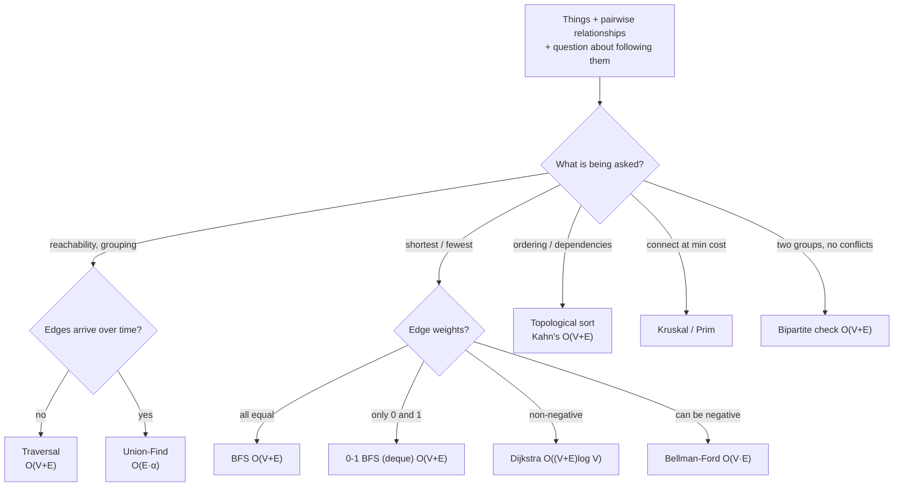

# Graphs revision and mock round

## 1. What this is, and why they ask it

Eighteen days ago you did not know what a vertex was. Today the phase closes, and the way to close it is not
to reread it — it is to solve two problems you have not seen, out loud, with a clock running.

This lesson has two halves. The first compresses the phase into what it actually is: **one modelling question,
one traversal, and about eight variations on it.** The second is a mock round — two unseen problems worked
through as an interview, including the part where you are stuck and have to keep talking.

The reason a revision day exists is that graph interviews are not lost at the algorithm. They are lost in the
first ninety seconds, when a candidate reads "given a list of accounts with email addresses" and does not see
a graph. **Every algorithm in this phase is twenty lines you can write from memory. The gap is recognition**,
and recognition is a different skill that has to be practised on its own.

By the end of today you can state the modelling question in two sentences, choose the right traversal from a
decision table without hesitating, quote every cost, name the eight recurring bugs, and take two unseen
problems from statement to working code while explaining yourself.

---

## 2. The story

Bhima has decorated for weddings, political rallies, a hospital's opening, three school annual days and one
funeral he would rather not discuss, and he will tell you they are all the same job.

People find that annoying when he says it, especially the families, because a wedding is not a rally. But he
has been doing it since 1996 and what he means is quite specific.

Whatever the event, he stands in the empty space on the first visit and answers the same six questions, in the
same order, before he opens his mouth about colours or flowers or anything anybody actually wants to talk
about.

Where do people come in, and where does that push them once they are through the gate. Where is the thing
everyone will look at, and can it be seen from the back. Where does the food go, because that is where the
crowd will actually stand regardless of where you want them. Where do the cables run, and can somebody trip
over them. Where do the people who are working move, and does that cross where the guests move. And what
happens if it rains.

Six answers, and after that the job is mostly arranging.

The families think their event is unique. And in the details it is — a rally needs the stage high and a
wedding needs it low, a school function has four hundred children who will not stay where you put them. But
the six questions do not change, and Bhima has never once found an event where they did.

The young man who worked with him for two years never got this. He was better than Bhima with his hands and
he had a much better eye for colour. What he did every single time was start with the decoration. He would
work out something beautiful for the entrance, and then discover that the entrance was where the catering van
had to reverse in, and everything had to be moved on the morning.

Bhima said the same sentence to him for two years and it never took. **The job is not the decorating. The job
is the six questions, and then the decorating is easy.**

---

## 3. The idea in plain English

Bhima's six questions are what this phase actually was.

**The whole phase is one modelling question and one traversal.** Everything else is a variation.

**The modelling question, in two sentences you say out loud before writing anything:**

> **"A vertex is ___. An edge from A to B means ___."**

If you cannot finish both, you do not understand the problem yet and no amount of code will help. If you can,
the code is mechanical.

**Then four classification words**, and each rules something in or out:

| Question | Why it matters |
|---|---|
| **Directed or undirected?** | Decides cycle detection entirely — two different algorithms. |
| **Weighted or unweighted?** | Decides shortest path: BFS or Dijkstra or Bellman-Ford. |
| **Cyclic or acyclic?** | A DAG allows topological sort and one-pass DP with any weights. |
| **Connected?** | Almost never. Decides whether you need the outer loop. |

**The recognition question, in one line:** *are there things, and pairwise relationships between them, and is
the question about following those relationships?* If yes, it is a graph, whatever the story says.

**And the tells that mean a specific algorithm:**

| The problem says | The answer is |
|---|---|
| "fewest steps", "minimum number of moves" | BFS |
| "shortest path" with numbers on the edges | Dijkstra |
| "shortest path" with negative numbers | Bellman-Ford |
| "in what order", "can all X be finished" | Topological sort |
| "how many groups", "count the islands" | Connected components |
| "are these connected?" **as edges arrive** | Union-Find |
| "connect everything at minimum cost" | Kruskal or Prim |
| "split into two teams" | Bipartite check |
| "nearest", "until everything is" | Multi-source BFS |
| "is there a circular dependency" | Directed cycle detection |

**Three modelling moves that turn awkward problems into ordinary ones**, and these are the ones worth
carrying:

**One: the implicit graph.** Grids, puzzle states and word ladders have no edge list — neighbours are computed
from the coordinates or the state. **You never build the graph**, you write a neighbour function, and every
algorithm works unchanged. Candidates who wait to be handed an edge list do not recognise these.

**Two: make the shared property a vertex.** "Accounts that share an email" as a graph over accounts needs `n²`
comparisons to find the edges. Put the *emails* in the graph as vertices too, and it is one linear pass. The
same move handles "employees on a shared project", "stones in the same row or column".

**Three: the virtual source.** "Dig a well here, or lay a pipe to a neighbour" looks like two kinds of
decision. Add one extra vertex representing the water supply, make each well an edge from it, and there is
only one kind of decision — a minimum spanning tree. The same trick turns multi-source BFS into single-source.

**And the shape of every traversal in the phase is the same eight lines:**

```
seen = {start}
frontier = [start]
while frontier:
    current = take from frontier
    for neighbour in neighbours(current):
        if neighbour not in seen:
            seen.add(neighbour)          # mark on PUSH, always
            add neighbour to frontier
```

**Change what "take from frontier" means and you have a different algorithm.** Take from the front — BFS. Take
from the back — DFS. Take the cheapest — Dijkstra. Take from the front but push zero-cost edges to the front —
0-1 BFS. **That substitution is the whole phase, and saying it out loud shows you see the structure rather
than four memorised procedures.**

---

## 4. The picture

The decision path, which is the thing to have automatic:



**What to notice.** Every leaf is `O(V + E)` except two, and both exceptions are earned: Dijkstra pays a `log`
for arbitrary weights, Bellman-Ford pays a factor of `V` for negative ones. **If your answer is more expensive
than `O(V + E)`, you should be able to say which property forced it.**

The one shape, four algorithms:

```
   seen = {start};  frontier = [start]
   while frontier:
       current = TAKE(frontier)
       for nb in neighbours(current):
           if not seen: mark, PUSH(frontier, nb)

   TAKE = popleft,  PUSH = append          ->  BFS          O(V+E)
   TAKE = pop,      PUSH = append          ->  DFS          O(V+E)
   TAKE = heappop,  PUSH = heappush        ->  Dijkstra     O((V+E) log V)
   TAKE = popleft,  PUSH = appendleft/append by cost
                                           ->  0-1 BFS      O(V+E)
```

The eight recurring bugs, on one page:

```
1. edge direction reversed          -> a valid answer to the WRONG graph. Silent.
2. built from the edge list         -> isolated vertices vanish. PHANTOM CYCLE.
3. only one component searched      -> undercount. Sample inputs are connected.
4. marked on pop, not on push       -> queue holds E entries. MemoryError / TLE.
5. undirected edge added once       -> reachable one way only. Silent.
6. "seen" used as the cycle test    -> directed: fails on a diamond
                                       undirected: fails on ONE edge
7. recursion on a long chain        -> RecursionError; raising the limit -> segfault
8. missing bounds check on a grid   -> grid[-1] WRAPS. Wrong answer, no error.
```

**Five of the eight produce no error at all.** That is the whole reason to keep this list.

---

## 5. The code, built step by step

Six templates. Learn these and you can write any graph problem in an interview without designing anything
under pressure.

### Template 0 — build, and the neighbour function

```python
from collections import defaultdict

def build(n: int, edges, directed: bool = False):
    graph = {v: [] for v in range(n)}        # from range(n), NOT from the edges
    for a, b in edges:
        graph[a].append(b)
        if not directed:
            graph[b].append(a)               # BOTH directions, or bug 5
    return graph
```

```python
FOUR = ((-1, 0), (1, 0), (0, -1), (0, 1))

def neighbours(r, c, rows, cols):
    for dr, dc in FOUR:
        nr, nc = r + dr, c + dc
        if 0 <= nr < rows and 0 <= nc < cols:    # all four comparisons
            yield nr, nc
```

**`range(n)` and not the edge list** — that one choice prevents bugs 2 and 3. **All four bounds comparisons** —
`grid[-1]` is the last row, so a missing check wraps the grid silently.

### Template 1 — BFS, distances and the path

```python
from collections import deque

def bfs(graph, start, goal=None):
    dist = {start: 0}
    parent = {start: None}
    queue = deque([start])
    while queue:
        v = queue.popleft()
        if v == goal:
            break
        for nb in graph[v]:
            if nb not in dist:
                dist[nb] = dist[v] + 1
                parent[nb] = v
                queue.append(nb)
    return dist, parent
```

`dist` is also the seen set. Mark on push. `deque`, never `list.pop(0)`.

**Multi-source is one change:** seed `dist` and `queue` with every source before the loop.

### Template 2 — DFS with three colours (directed cycles, topological order)

```python
WHITE, GREY, BLACK = 0, 1, 2

def has_cycle(graph, n):
    colour = [WHITE] * n
    def visit(v):
        colour[v] = GREY                      # on the CURRENT PATH
        for nb in graph[v]:
            if colour[nb] == GREY:
                return True
            if colour[nb] == WHITE and visit(nb):
                return True
        colour[v] = BLACK                     # after the loop
        return False
    return any(colour[v] == WHITE and visit(v) for v in range(n))
```

**Grey means ancestor.** Black is a finished region and is fine. Two states report a cycle on a diamond.

### Template 3 — Kahn's (order, cycle check, parallel schedule)

```python
def kahn(graph, n):
    indeg = [0] * n
    for v in range(n):
        for nb in graph[v]:
            indeg[nb] += 1
    queue = deque(v for v in range(n) if indeg[v] == 0)
    order = []
    while queue:
        v = queue.popleft()
        order.append(v)
        for nb in graph[v]:
            indeg[nb] -= 1
            if indeg[nb] == 0:
                queue.append(nb)
    return order if len(order) == n else None      # None = cycle
```

**Prefer this to the DFS version:** it detects cycles structurally, never recurses, and processing one whole
level at a time gives you a parallel schedule for free.

### Template 4 — Dijkstra (and Prim, one line apart)

```python
import heapq

def dijkstra(graph, n, source):
    dist = [float("inf")] * n
    dist[source] = 0
    heap = [(0, source)]
    while heap:
        cost, v = heapq.heappop(heap)
        if cost > dist[v]:
            continue                              # stale: lazy deletion
        for nb, w in graph[v]:
            if cost + w < dist[nb]:
                dist[nb] = cost + w
                heapq.heappush(heap, (cost + w, nb))
    return dist
```

**`(cost, vertex)` — cost first.** Return on the **pop**, not the discovery. And Prim's is this with
`heappush(heap, (w, nb))` instead of `(cost + w, nb)` — **one term.**

### Template 5 — Union-Find

```python
class DSU:
    def __init__(self, n):
        self.p = list(range(n)); self.sz = [1]*n; self.groups = n
    def find(self, x):
        while self.p[x] != x:
            self.p[x] = self.p[self.p[x]]         # path halving
            x = self.p[x]
        return x
    def union(self, a, b):
        ra, rb = self.find(a), self.find(b)
        if ra == rb: return False                 # already together -> cycle / redundant
        if self.sz[ra] < self.sz[rb]: ra, rb = rb, ra
        self.p[rb] = ra; self.sz[ra] += self.sz[rb]; self.groups -= 1
        return True
```

**Both optimisations, always.** The boolean return is what makes it reusable, and Kruskal's is this plus a
sort.

### The complete solution

```python
"""The graph phase on one page: build, traverse, order, connect."""

from __future__ import annotations

import heapq
from collections import deque

INF = float("inf")
WHITE, GREY, BLACK = 0, 1, 2


def build(n, edges, directed=False):
    graph = {v: [] for v in range(n)}
    for a, b in edges:
        graph[a].append(b)
        if not directed:
            graph[b].append(a)
    return graph


def bfs_dist(graph, sources):
    """Single- or multi-source. Seed with every source before the loop."""
    dist = {s: 0 for s in sources}
    queue = deque(sources)
    while queue:
        v = queue.popleft()
        for nb in graph[v]:
            if nb not in dist:
                dist[nb] = dist[v] + 1
                queue.append(nb)
    return dist


def components(graph, n):
    """The outer loop with a SHARED seen set is the whole algorithm."""
    seen, pieces = set(), []
    for start in range(n):
        if start in seen:
            continue
        piece, stack = [], [start]
        seen.add(start)
        while stack:
            v = stack.pop()
            piece.append(v)
            for nb in graph[v]:
                if nb not in seen:
                    seen.add(nb)
                    stack.append(nb)
        pieces.append(piece)
    return pieces


def kahn(graph, n):
    indeg = [0] * n
    for v in range(n):
        for nb in graph[v]:
            indeg[nb] += 1
    queue = deque(v for v in range(n) if indeg[v] == 0)
    order = []
    while queue:
        v = queue.popleft()
        order.append(v)
        for nb in graph[v]:
            indeg[nb] -= 1
            if indeg[nb] == 0:
                queue.append(nb)
    return order if len(order) == n else None


def dijkstra(graph, n, source):
    dist = [INF] * n
    dist[source] = 0
    heap = [(0, source)]
    while heap:
        cost, v = heapq.heappop(heap)
        if cost > dist[v]:
            continue
        for nb, w in graph[v]:
            if cost + w < dist[nb]:
                dist[nb] = cost + w
                heapq.heappush(heap, (cost + w, nb))
    return dist


def is_bipartite(graph, n):
    colour = [-1] * n
    for start in range(n):
        if colour[start] != -1:
            continue
        colour[start] = 0
        queue = deque([start])
        while queue:
            v = queue.popleft()
            for nb in graph[v]:
                if colour[nb] == -1:
                    colour[nb] = 1 - colour[v]
                    queue.append(nb)
                elif colour[nb] == colour[v]:      # SAME colour, not merely coloured
                    return False
    return True


class DSU:
    def __init__(self, n):
        self.p, self.sz, self.groups = list(range(n)), [1] * n, n

    def find(self, x):
        while self.p[x] != x:
            self.p[x] = self.p[self.p[x]]
            x = self.p[x]
        return x

    def union(self, a, b):
        ra, rb = self.find(a), self.find(b)
        if ra == rb:
            return False
        if self.sz[ra] < self.sz[rb]:
            ra, rb = rb, ra
        self.p[rb] = ra
        self.sz[ra] += self.sz[rb]
        self.groups -= 1
        return True


def kruskal(n, weighted_edges):
    dsu, total, chosen = DSU(n), 0, []
    for w, a, b in sorted(weighted_edges):
        if dsu.union(a, b):
            total += w
            chosen.append((a, b, w))
    return (total, chosen) if len(chosen) == n - 1 else (-1, chosen)


if __name__ == "__main__":
    g = build(7, [(0, 1), (0, 2), (1, 3), (4, 5), (5, 6), (4, 6)])
    print("dist from 0 :", bfs_dist(g, [0]))
    print("multi-source:", bfs_dist(g, [0, 4]))
    print("components  :", components(g, 7))
    print("bipartite?  :", is_bipartite(g, 7))          # 4-5-6 is a triangle

    dag = build(6, [(0, 2), (1, 2), (2, 3), (2, 4), (3, 5), (4, 5)], directed=True)
    print("topo order  :", kahn(dag, 6))
    cyc = build(3, [(0, 1), (1, 2), (2, 0)], directed=True)
    print("cyclic      :", kahn(cyc, 3))

    wg = {0: [(1, 4), (2, 1)], 1: [(3, 1)], 2: [(1, 2), (3, 5)], 3: []}
    print("dijkstra    :", dijkstra(wg, 4, 0))
    print("kruskal     :", kruskal(4, [(1, 0, 2), (4, 0, 1), (2, 2, 1), (5, 2, 3), (1, 1, 3)]))
```

Running it:

```
dist from 0 : {0: 0, 1: 1, 2: 1, 3: 2}
multi-source: {0: 0, 4: 0, 1: 1, 2: 1, 5: 1, 6: 1, 3: 2}
components  : [[0, 2, 1, 3], [4, 6, 5]]
bipartite?  : False
topo order  : [0, 1, 2, 3, 4, 5]
cyclic      : None
dijkstra    : [0, 3, 1, 4]
kruskal     : (4, [(0, 2, 1), (1, 3, 1), (2, 1, 2)])
```

Three things to look at. `dist from 0` reaches only four of seven vertices — the other component is
unreachable, which is why `components` exists and why the outer loop is not optional.

`bipartite?` is `False` because of the triangle at 4-5-6, **even though the component containing vertex 0 is
perfectly bipartite.** A graph is bipartite only if every component is.

And `dijkstra` gives vertex 1 a distance of **3**, via vertex 2 at cost 1 plus 2 — not the direct edge of
weight 4. That is the whole reason Dijkstra exists rather than BFS.

---

## 6. What it costs

Every cost in the phase, in one table.

| Algorithm | Time | Space | When |
|---|---|---|---|
| BFS / DFS | `O(V + E)` | `O(V)` | reachability, components, fewest steps |
| Multi-source BFS | `O(V + E)` | `O(V)` | nearest source — `k` does not appear |
| 0-1 BFS | `O(V + E)` | `O(V)` | weights are only 0 and 1 |
| Bipartite check | `O(V + E)` | `O(V)` | two groups; colour array *is* the seen set |
| Topological sort | `O(V + E)` | `O(V)` | ordering; also detects cycles |
| DAG shortest/longest path | `O(V + E)` | `O(V)` | **any** weights, including negative |
| Dijkstra | `O((V + E) log V)` | `O(V + E)` | non-negative weights |
| Bellman-Ford | `O(V × E)` | `O(V)` | negative weights; detects negative cycles |
| Floyd-Warshall | `O(V³)` | `O(V²)` | all pairs, `V ≲ 500` |
| Union-Find | `O(E × α)` ≈ `O(E)` | `O(V)` | grouping as edges arrive |
| Kruskal | `O(E log E)` | `O(V + E)` | MST — the **sort** dominates |
| Prim (heap) | `O(E log V)` | `O(V + E)` | MST on a sparse graph |
| Prim (dense) | `O(V²)` | `O(V)` | MST on a dense graph or a matrix |

**The numbers that make those concrete**, on `V = 100,000` and `E = 300,000` — a typical sparse graph:

```
BFS / DFS / topological     700,000 steps
Dijkstra                    5,100,000        ~7x BFS
Bellman-Ford                30,000,000,000   ~40,000x BFS
Floyd-Warshall              10^15            impossible
```

**And the two comparisons worth having ready:**

```
multi-source vs one BFS per source
  500 sources, 1,000,000 cells
  multi-source     3,000,000
  per-source       1,500,000,000       -> 500x

traversal vs Union-Find, edges arriving one at a time
  m = 100,000 edges, V = 100,000
  traversal per edge  30,000,000,000
  Union-Find             400,000       -> 75,000x
```

**Representation, from [day 126](../day-126-graph-representation/README.md):**

```
adjacency list    O(V + E) space,  O(degree) to list neighbours   -> the default
adjacency matrix  O(V^2) space,    O(1) edge test, O(V) neighbours -> dense, or V < 200
```

```
V = 1,000, E = 3,000
  matrix  1,000,000 cells (0.6% full)
  list        7,000 slots           -> 140x
```

**And the memory shape at scale:**

```
V = 1,000,000, E = 5,000,000
  adjacency entries  2E = 10,000,000 x 8 B  = 80 MB
  vertex objects     1,000,000 x 56 B       = 56 MB
```

**`E` is the memory, never `V`** — "can I fit this graph" is always a question about the edges.

---

## 7. The traps

The eight bugs of this phase, with the symptom first, because five of them produce no error.

### 1. The edge direction reversed

```python
graph[course].append(prerequisite)        # the input says the opposite
```

Produces a perfectly valid topological order **of the reversed graph**. And for the boolean version — "is
there a cycle" — the answer is even *correct*, because a graph has a cycle exactly when its reverse does. So
the bug hides until someone reads the order.

**Defence: write the meaning as a sentence, then check on a two-vertex example by hand.**

### 2. Built from the edge list

```python
graph = defaultdict(list)
for a, b in edges: ...
```

A vertex in no edge never becomes a key.

```
>>> kahn(from_edges_only, n=5)
None                                      # reports a cycle on an acyclic graph
```

**A phantom cycle**, because `len(order) == n` cannot hold. Build from `range(n)`.

### 3. Only one component searched

```python
return len(bfs_dist(graph, [0]))          # "the number of vertices"
```

Correct on a connected sample, wrong on the hidden test. **"All", "every", "how many groups" means the outer
loop.**

### 4. Marked on pop, not on push

```python
v = queue.popleft()
if v in seen: continue
seen.add(v)
for nb in graph[v]: queue.append(nb)      # pushed unchecked
```

Answer correct, queue holds `E` entries instead of `V`.

```
MemoryError
```

**Say "each vertex enters the queue at most once" as you write it. If that sentence is not true, the code is
wrong.**

### 5. The undirected edge added once

```python
graph[a].append(b)                        # graph[b].append(a) forgotten
```

```
>>> reachable(g, "x", "y"), reachable(g, "y", "x")
(True, False)
```

Silent, and on a bipartite or "possible partition" problem it produces a confident wrong `True`.

### 6. "Seen" used as the cycle test

**Directed**, two states instead of three:

```
>>> has_cycle_two_state(diamond, 4)       # 0->1->3, 0->2->3
True                                       # there is no cycle
```

**Undirected**, no parent check:

```
>>> has_cycle_no_parent(build(2, [(0,1)]), 2)
True                                       # two vertices, ONE edge
```

**Two different problems that share a word.** Directed needs grey/black; undirected needs the parent
exclusion.

### 7. Recursion on a long chain

```
RecursionError: maximum recursion depth exceeded
```

and the "fix":

```python
sys.setrecursionlimit(10**6)
```

```
Segmentation fault (core dumped)
```

**`n <= 10^5` in the constraints means write it iteratively**, or use Kahn's, which never recurses.

### 8. The missing bounds check on a grid

```python
if grid[r + dr][c + dc] == "1":           # no bounds check
```

`grid[-1]` is the **last row**, so the top of the grid connects to the bottom. Falling off the right edge
raises `IndexError`; falling off the top does not. **Half the failures crash and half are silent**, which is
the worst combination.

---

## 8. In the interview

### How it gets asked

Never as "traverse this graph". These:

- *"Given courses and prerequisites, can they all be finished? Now give me an order."*
- *"Count the islands."* / *"How many provinces?"*
- *"Given accounts with emails, merge the ones belonging to the same person."*
- *"Find the shortest transformation from one word to another."*
- *"Cheapest flight from A to B with at most k stops."*
- *"Connect all the points at minimum cost."*
- *"Can these people be split into two teams?"*
- *"How long until every orange rots?"*

**The tell, in one line: things, plus pairwise relationships, plus a question about following them.**

### The mock round

Two problems. Twenty minutes each. Say everything out loud, including the parts where you are stuck.

---

**Problem 1.** *"You are given `n` stones on a 2D plane, each at some `(row, col)`. A stone can be removed if
it shares a row or a column with another stone that is still on the plane. Return the maximum number of stones
you can remove."*

**Minute 0 to 4 — model it, and do not code.**

> "Let me not code, because the modelling here is the entire problem and the first model I would reach for is
> wrong.
>
> **The obvious model:** a vertex is a stone, and an edge joins two stones sharing a row or a column. Finding
> those edges means comparing every pair — `n²`. For a thousand stones that is a million comparisons, which is
> survivable, but it is the wrong shape and I think there is better.
>
> **The insight about the answer, first.** Take any connected group of stones. I claim I can remove all but
> one of them: repeatedly remove a stone that is a *leaf* in a spanning tree of the group, and it always shares
> a row or column with something still present. So **from a component of size `k` I remove `k − 1`.**
>
> So the answer is `n − (number of connected components)`. That reduces the whole problem to counting
> components.
>
> **Now the better model, so I do not pay `n²`.** Instead of connecting stones to stones, I make the **rows and
> columns** the vertices, and each stone an edge joining its row to its column. Two stones in the same row are
> then automatically connected through that row vertex, and I never compared any pair of stones.
>
> A vertex is a row index or a column index. An edge is a stone. Undirected, unweighted."

**Minute 4 to 12 — write it.**

```python
def remove_stones(stones: list[list[int]]) -> int:
    dsu = DSU(20000)                     # rows 0..9999, columns offset by 10000
    seen = set()
    for r, c in stones:
        dsu.union(r, c + 10000)          # a stone joins its ROW to its COLUMN
        seen.add(r)
        seen.add(c + 10000)
    roots = {dsu.find(x) for x in seen}
    return len(stones) - len(roots)
```

Say while typing: *"The offset is so row 3 and column 3 are different vertices — without it, a stone at (3, 3)
would join a vertex to itself and, worse, rows and columns would merge wrongly. And I count roots only over
the indices that actually appear, not over all twenty thousand, or every unused row is its own component."*

**Minute 12 to 16 — cost.**

> "One pass over the stones, two `find`s and a `union` each, so `O(n × α)` — effectively `O(n)`. Space is the
> Union-Find array, `O(rows + cols)`.
>
> Against the naive model: `n²` comparisons to build the edges, then a traversal. At a thousand stones that is
> a million against a thousand. **Making the shared property a vertex is what removed the quadratic step**, and
> it is the same move as the accounts-and-emails problem."

**Minute 16 to 20 — the follow-up.**

> *"Prove that you can always remove all but one from a component."*
>
> "Take a spanning tree of the component. Repeatedly remove a leaf: a leaf has a neighbour still present, and
> being adjacent means sharing a row or a column, so the removal is legal. Removing a leaf leaves a smaller
> tree, so I can repeat until one vertex remains. Hence `k − 1` from a component of `k`, and the total is
> `n − components`."

---

**Problem 2.** *"A network of `n` servers connected by cables. Some cables are optional and some are critical.
Find the cheapest set of cables that keeps every server connected, but the answer must also tell me which
cables could be removed later without disconnecting anything."*

**Minute 0 to 5 — recognise, and ask.**

> "Two questions bundled together, and they are different algorithms, so let me separate them.
>
> **'Cheapest set that keeps everything connected' is a minimum spanning tree.** Vertices are servers, edges are
> cables with costs, undirected. Kruskal's, because the input is an edge list and because Union-Find gives me
> the cycle check for free.
>
> **'Which could be removed without disconnecting anything' is a different question**, and I want to check what
> it means. Removed *from the original network*, or *from the spanning tree*? Because if it is from the
> spanning tree, the answer is none — every edge of a tree is a bridge, by definition. So I think it means: in
> the original graph, which cables lie on a cycle, since those can go.
>
> Is that the right reading?"

**Minute 5 to 14 — write it.**

```python
def cheapest_and_removable(n, cables):
    """cables: (cost, a, b). Returns (total, kept, removable)."""
    dsu = DSU(n)
    total, kept, removable = 0, [], []
    for cost, a, b in sorted(cables):
        if dsu.union(a, b):
            total += cost
            kept.append((a, b, cost))
        else:
            removable.append((a, b, cost))     # both ends already connected -> a cycle
    if len(kept) != n - 1:
        return -1, kept, removable             # the network is not connected at all
    return total, kept, removable
```

Say while typing: *"The `else` branch is free — an edge Kruskal's rejects is exactly an edge whose endpoints
were already connected, which means it closes a cycle, which means it is removable. **One loop answers both
questions.** And the `len(kept) != n - 1` check catches a network that was already disconnected, which returns
a plausible total otherwise."*

**Minute 14 to 18 — cost and correctness.**

> "`O(E log E)` dominated by the sort; the Union-Find part is effectively free. Space `O(V + E)`.
>
> **Why greedy is correct here** — the cut property. Split the vertices any way you like; the cheapest edge
> crossing between the two halves belongs to some minimum spanning tree, because if a tree used a different
> crossing edge you could swap it for the cheaper one and still have a spanning tree of no greater weight.
> Kruskal's is repeated application of that.
>
> **One thing I should be honest about:** with tied costs there are several minimum spanning trees, so the
> `kept` and `removable` sets are not unique — only the total is. If the operator needs a specific answer, I
> need a tie-break rule."

**Minute 18 to 20 — when it goes wrong.**

If you have not seen the "rejected edge is removable" trick, say so and keep working:

> "I do not immediately see how to get the removable set out of the same pass. Let me solve the two separately
> first — Kruskal's for the tree, and then for each edge test whether removing it disconnects the graph, which
> is `O(E × (V + E))` and too slow but correct — and then look for something better."

**That is a passing answer.** Being stuck out loud with a correct fallback beats silence, and the interviewer
will usually offer the hint once they see a working baseline.

### The model answer

*"Why did you choose that algorithm?"* — the question that ends most graph interviews.

> "Four things, in this order.
>
> **What is being asked.** Reachability and grouping is a traversal. Fewest steps is BFS. Ordering is
> topological sort. Cheapest total connection is a minimum spanning tree. Those are different questions and
> they do not share an answer.
>
> **What the edges look like.** Unweighted means BFS and I would say so rather than reach for Dijkstra, which
> is about seven times more work on a sparse graph for an answer BFS already has. Non-negative weights means
> Dijkstra. Negative means Bellman-Ford, and I would name the exact clause of Dijkstra's proof that fails.
> And if it is a DAG, one pass in topological order handles any weights, including negative — faster than all
> of them, and the answer people forget.
>
> **Whether the graph changes.** Static and asked once, a traversal. Edges arriving over time, Union-Find —
> that is `m × α` against `m × (V + E)`, which at a hundred thousand edges is four hundred thousand steps
> against thirty billion.
>
> **And the size.** `V` under a couple of hundred makes an adjacency matrix and even Floyd-Warshall reasonable.
> Above ten thousand, a matrix does not fit and the representation choice is forced.
>
> **The thing I check before all of that** is whether the graph even needs building. Grids, word ladders and
> puzzle states are implicit — I write a neighbour function and never materialise an edge list — and problems
> about a shared property get an extra vertex for the property, which turns an `n²` edge-building step into one
> linear pass."

---

## 9. Recall card

**Two sentences before any code:** "A vertex is ___. An edge from A to B means ___." Then four words:
**directed? weighted? cyclic? connected?** — and connected is almost never.

**One shape, four algorithms.** `seen`, a frontier, mark on push. Take from the front → BFS; from the back →
DFS; cheapest → Dijkstra; front-with-zero-cost-edges-pushed-front → 0-1 BFS.

**Everything is `O(V + E)` except two earned exceptions:** Dijkstra pays `log V` for arbitrary weights,
Bellman-Ford pays `V` for negative ones. **On a DAG, one topological pass handles any weights** — the cheapest
option and the one most often missed.

**Three modelling moves:** implicit graphs (never build the edges); **make the shared property a vertex**
(removes an `n²` step); and the virtual source (turns two kinds of decision into one).

**Eight bugs, five of them silent:** reversed direction; built from the edge list (phantom cycle); one
component only; marked on pop; undirected edge added once; "seen" as the cycle test (diamond for directed, one
edge for undirected); recursion on a long chain; and a missing grid bounds check (`grid[-1]` **wraps**).
