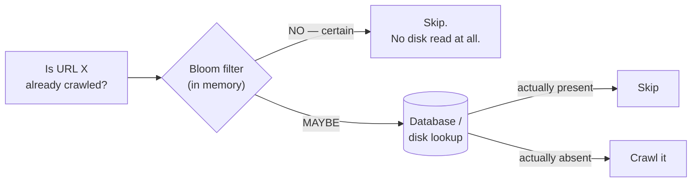

# Bloom filters and probabilistic structures

## 1. What this is, and why they ask it

Sometimes you do not need the right answer. You need a very cheap answer that is never wrong in the direction
that matters.

A **Bloom filter** answers "have I seen this before?" using a fraction of the memory a real set would need. It
has one specific, well-behaved flaw: it can say **"maybe"** when the truth is no, but it can never say **"no"**
when the truth is yes. **No false negatives, some false positives**, and you choose the false-positive rate by
choosing how much memory to spend.

That trade — a little accuracy for a lot of memory — is a whole family of tools. **HyperLogLog** counts
distinct items in twelve kilobytes regardless of whether there are a thousand or a billion. **Count-Min
Sketch** estimates how often each item has appeared without storing the items.

They ask this because it shows whether you can recognise when exactness is not the requirement, and because
the arithmetic is genuinely striking: **a billion URLs in 1.2 GB instead of 100 GB, at a 1% error rate.**
There is also a good follow-up — "what if a false positive is expensive?" — where the answer is about which
direction the error points, not about tuning the rate.

By the end of this lesson you can explain how a Bloom filter works, size one from a required error rate, name
the operations it cannot do, place it correctly in a design so that a false positive is harmless, and say
what HyperLogLog and Count-Min Sketch are for.

---

## 2. The story

There are about four thousand people who come through the main gate of the mill, and Yadav has been on that
gate for nineteen years.

He does not know four thousand faces. Nobody does. What he has instead is something much rougher and it works
better than it has any right to.

Over the years he has built up an impression — not of individuals, but of features. He knows the shape of the
people who work there. Tall men with beards, a particular kind of blue helmet, the way the loading crew walk
because of the boots, the sort of bag the office staff carry, the times of day each shift arrives.

So when somebody comes up to the gate, what happens in Yadav's head takes about a second.

If **nothing matches** — wrong time of day, wrong bag, a manner that is not any of the manners he knows — he
stops them. And he is right. In nineteen years he has never once stopped somebody who turned out to work
there, because anybody who works there has *some* combination of features he recognises. **When Yadav says
"you don't work here", that is the end of it.**

If things **do** match, he lets them through and looks at the card.

And that is the part people misunderstand about him. Matching does not mean he knows you. Plenty of people
match. A tall man with a beard carrying a canvas bag at half past seven in the morning matches perfectly and
may well be a salesman, and about eleven times a month somebody like that gets waved towards the gate and then
has to explain themselves at the card desk four steps later.

Yadav is completely untroubled by this. The card desk is right there. It costs the salesman fifteen seconds.

What the arrangement saves is the other three thousand nine hundred people, who do not have to be looked up in
anything, because Yadav sorted them in a second at the gate.

The manager suggested once that Yadav should just check every card. Yadav pointed out, without any
particular heat, that four thousand card checks at fifteen seconds each is sixteen hours, and the shift change
happens in twenty minutes.

---

## 3. The idea in plain English

Yadav's gate is a Bloom filter, and the eleven salesmen a month are the false positives.

**A Bloom filter is a bit array plus a few hash functions.** Start with, say, a million bits, all zero. To
**add** an item, hash it with `k` different hash functions, get `k` positions, and set those bits to 1. To
**check** an item, hash it the same way and look at those `k` bits.

**If any of them is 0, the item was definitely never added.** Adding it would have set that bit, and bits are
never cleared. **That is the no-false-negatives guarantee, and it is absolute.**

**If all `k` bits are 1, the item was probably added.** Or the bits were set by other items that happened to
hash there. That is a **false positive**, and it is Yadav's salesman: every feature matched, and it was
somebody else's features.

**No false negatives, some false positives.** Say it in that order and be precise about which is which,
because the whole usefulness of the structure depends on the error pointing in a direction you can tolerate.

**The false-positive rate is a dial you set with memory.** More bits per item means fewer collisions means
fewer false positives.

```
10 bits per item   ->  ~1% false positives
14 bits per item   ->  ~0.1%
20 bits per item   ->  ~0.01%
```

**Compare that with storing the items.** A URL averages 100 bytes — 800 bits. Ten bits per item is **eighty
times less memory**, and the price is that one lookup in a hundred says "maybe" when it should say "no".

**It cannot delete.** Clearing a bit would break some other item that also set it, and you would have created
a false *negative* — which destroys the only guarantee the structure has. If you need deletion, a **counting
Bloom filter** stores small counters instead of bits and decrements them, at four times the memory and with a
risk of counter overflow.

**It cannot list its members**, and it cannot tell you how many it holds. There is nothing in it but bits. If
you need the items back, you need the items.

**Now the placement rule, which is the whole design skill: put the filter where a false positive costs a
cheap extra check, and never where it costs correctness.**

Yadav's card desk is four steps away. The filter says "maybe", and the real check is right there and cheap.
That is the correct shape:

```
Bloom says NO      ->  definitely absent. Stop. Save the expensive lookup.
Bloom says MAYBE   ->  do the expensive lookup, which gives the true answer.
```

**The filter never decides anything on its own.** It only skips work when it is certain, and it is only ever
certain about absence.

**And that is why the direction of the error matters more than its size.** "Might this cached key exist?" —
a false positive costs one wasted disk read. Fine. "Is this username taken?" — a false positive tells a user
their name is unavailable when it is free, which is wrong output, and the fix is to treat a "maybe" as
"go and check the database", never as a yes.

**Two relatives, worth knowing by name.**

**HyperLogLog** answers "how many *distinct* items?" using about 12 KB, with roughly 0.8% error, **regardless
of the count** — a thousand or a billion, the same 12 KB. It works by watching the longest run of leading
zeros in the hashes it has seen, which is a proxy for how many distinct things must have been hashed. Redis
has it built in as `PFADD` and `PFCOUNT`.

**Count-Min Sketch** estimates *how many times* each item has appeared, in fixed memory, by keeping a small
grid of counters and taking the minimum across several hash rows. It **over-estimates and never
under-estimates**, which is the same one-directional error, and it is what streaming systems use for
"heavy hitters" — the top few items by frequency.

**The common shape across all three: bounded memory, one-directional error, and a cheap exact check available
when the answer matters.**

---

## 4. The picture

A Bloom filter with `m = 16` bits and `k = 3` hashes:

```
initially:
  index  0  1  2  3  4  5  6  7  8  9 10 11 12 13 14 15
  bits   0  0  0  0  0  0  0  0  0  0  0  0  0  0  0  0

add("cat")     -> hashes to 2, 7, 11
  bits   0  0  1  0  0  0  0  1  0  0  0  1  0  0  0  0

add("dog")     -> hashes to 4, 7, 13          (7 already set — that is fine)
  bits   0  0  1  0  1  0  0  1  0  0  0  1  0  1  0  0

check("cat")   -> 2, 7, 11  ->  1, 1, 1  ->  MAYBE (and it is there)
check("bird")  -> 3, 9, 14  ->  0, ...   ->  NO, definitely.  Stop at the first 0.
check("fish")  -> 2, 4, 13  ->  1, 1, 1  ->  MAYBE  <- FALSE POSITIVE
                                              never added; those bits were set
                                              by "cat" and "dog"
```

**What to notice on the last line.** "fish" was never added, and every bit it checks happens to be set by
other items. **Nothing is wrong; that is the designed behaviour**, and the only defence is the exact check
afterwards.

The error rate against memory:

```
  bits per item     false positive rate      memory for 1 billion items
  -------------     -------------------      --------------------------
        8                 ~2.5%                       1.0 GB
       10                 ~1%                         1.25 GB
       14                 ~0.1%                       1.75 GB
       20                 ~0.01%                      2.5 GB
       -----------------------------------------------------------
  storing the URLs themselves (~100 bytes each)      100 GB
```

**What to notice.** Going from 1% to 0.01% error costs twice the memory and is still forty times smaller than
storing the data. **The curve is very forgiving** — you rarely have to agonise over the exact rate.

Where the filter goes in a system:



**What to notice.** The expensive lookup happens only on "maybe", and a false positive costs one unnecessary
trip to the database — which returns the truth. **The filter is a shortcut on the negative path and nothing
else.**

And the three structures side by side:

```
                   answers                     memory        error direction
  Bloom filter     "have I seen X?"            ~10 bits/item  never says NO wrongly
  HyperLogLog      "how many distinct?"        ~12 KB total   ±0.8%, either way
  Count-Min        "how often was X seen?"     fixed grid     never UNDER-estimates
```

---

## 5. How it actually works

### The implementation, in twenty lines

```python
import hashlib
import math


class BloomFilter:
    def __init__(self, expected_items: int, false_positive_rate: float = 0.01) -> None:
        # m = -n ln(p) / (ln 2)^2      bits
        self.m = math.ceil(-expected_items * math.log(false_positive_rate) / (math.log(2) ** 2))
        # k = (m / n) ln 2             hash functions
        self.k = max(1, round((self.m / expected_items) * math.log(2)))
        self.bits = bytearray((self.m + 7) // 8)

    def _positions(self, item: str):
        """Two hashes, combined k ways — Kirsch-Mitzenmacher. One digest, k positions."""
        digest = hashlib.sha256(item.encode()).digest()
        h1 = int.from_bytes(digest[:8], "big")
        h2 = int.from_bytes(digest[8:16], "big") | 1        # odd, so it never cycles early
        for i in range(self.k):
            yield (h1 + i * h2) % self.m

    def add(self, item: str) -> None:
        for pos in self._positions(item):
            self.bits[pos // 8] |= 1 << (pos % 8)

    def __contains__(self, item: str) -> bool:
        return all(self.bits[pos // 8] & (1 << (pos % 8)) for pos in self._positions(item))
```

Three details worth pointing at.

**The two formulas are the whole sizing**, and they are worth knowing rather than deriving:
`m = -n ln(p) / (ln 2)²` bits, and `k = (m/n) ln 2` hash functions. **For a 1% rate that works out to about
9.6 bits per item and 7 hash functions**, which is the pair of numbers to remember.

**You do not need `k` independent hash functions.** One good hash split into two halves, combined as
`h1 + i·h2`, is provably as good — the Kirsch-Mitzenmacher result — and it means one digest per operation
rather than seven.

**`all(...)` short-circuits**, so a "no" usually costs one or two bit reads rather than seven. **Negative
lookups, which are the common case, are the cheapest.**

### Choosing `k`, and why more is not better

More hash functions means more bits set per item, so the array fills faster; fewer means more collisions per
position. **There is an optimum**, and it is `k = (m/n) ln 2` — the value that makes the array roughly half
ones and half zeros.

```
m/n = 10 bits per item
  k = 3   ->  false positive rate ~1.7%
  k = 7   ->  ~0.82%      <- optimal
  k = 12  ->  ~1.3%
```

**Both too few and too many are worse**, which surprises people, and "roughly half the bits set" is the
intuition for why.

### The variants

**Counting Bloom filter.** Replace each bit with a 4-bit counter; `add` increments, `remove` decrements.
Deletion works. Costs **4× the memory**, and a counter can saturate at 15 and then be wrong forever.

**Scalable Bloom filter.** The rate degrades as you add more items than you sized for. A scalable filter is a
chain of filters, each larger and with a tighter rate, and a lookup checks all of them. Handles unknown
cardinality at the cost of multiple lookups.

**Cuckoo filter.** Supports deletion, is a bit smaller than a Bloom filter at low error rates, and gives
better cache locality because a lookup touches two buckets rather than `k` scattered bits. The trade is that
insertion can fail when the table is nearly full. **Worth naming as the modern alternative.**

### HyperLogLog

The question is "how many distinct items", and the trick is that you do not need to remember them.

Hash each item and look at the leading zeros. Seeing a hash with 10 leading zeros suggests you have probably
hashed about 2¹⁰ distinct things, because that pattern has a one-in-1024 chance. **The maximum leading-zero
run you have seen is an estimate of the count** — a very noisy one, so HyperLogLog splits the hash space into
thousands of buckets, tracks the maximum per bucket, and averages them harmonically.

```
16,384 buckets x 6 bits each  = 12 KB
standard error                = 1.04 / sqrt(16384) = 0.8%
```

```
PFADD visitors user:8814
PFCOUNT visitors                    -> ~1,203,447
PFMERGE all visitors_a visitors_b   -> the union, no double counting
```

**`PFMERGE` is the property that makes it genuinely useful:** two HyperLogLogs can be merged into one, so
per-hour counts combine into a day and per-server counts combine into a fleet — **without double-counting
anyone**, which a plain sum cannot do.

**Twelve kilobytes for a billion distinct users**, against roughly 8 GB for a real set of 64-bit ids.

### Count-Min Sketch

A grid of counters — `d` rows, `w` columns — with one hash function per row. To record an item, increment one
counter in each row. To query, take the **minimum** of those `d` counters.

**Collisions only ever add**, so every counter is an over-estimate, and the minimum is the tightest of the
`d` over-estimates. **It never under-estimates**, which is the one-directional error again.

```
w = 2000, d = 5, 4-byte counters    = 40 KB
error                               ~ 2/w x total count, with probability 1 - 2^-d
```

**Used for heavy hitters** — the top few items by frequency in a stream — where the frequent ones are
estimated very accurately and the rare ones are noise, which is exactly the right way round.

### Where they actually appear

- **Cassandra, HBase, RocksDB, LevelDB.** Each SSTable has a Bloom filter, so a read that would miss skips the
  file entirely without a disk seek. **This is the highest-impact use of Bloom filters in practice** — it turns
  "check every file" into "check the one file that might have it".
- **Web crawlers.** "Have I already fetched this URL?" over billions of URLs.
- **Chrome's safe browsing** historically shipped a Bloom filter of malicious URLs so the common case — a safe
  URL — needed no network call.
- **CDNs.** "Has this object been requested before?", to avoid caching one-hit objects.
- **Redis:** HyperLogLog built in; Bloom and Cuckoo filters via the RedisBloom module.
- **Analytics.** Unique visitors per hour/day/month, merged with `PFMERGE`.

---

## 6. The numbers

**Memory, which is the whole argument.** One billion URLs at ~100 bytes each:

```
exact set (Python)      1e9 x ~150 bytes with overhead     = 150 GB
exact set (compact)     1e9 x 100 bytes                    = 100 GB
Bloom, p = 1%           1e9 x 9.6 bits                     = 1.2 GB
Bloom, p = 0.1%         1e9 x 14.4 bits                    = 1.8 GB
Bloom, p = 0.01%        1e9 x 19.2 bits                    = 2.4 GB
```

**A hundred gigabytes to 1.2**, and the difference between "a cluster" and "one machine's memory".

**The sizing formulas, and the numbers to carry:**

```
m = -n ln(p) / (ln 2)^2        bits
k = (m / n) ln 2               hash functions

p = 1%      ->  9.6 bits/item,   k = 7
p = 0.1%    ->  14.4 bits/item,  k = 10
p = 0.01%   ->  19.2 bits/item,  k = 13
```

**Roughly 5 bits per item for each additional factor of ten in accuracy** — that is the shape of the curve and
it is worth knowing, because it means high accuracy is affordable.

**What overfilling does.** The rate is only what you designed for if you add the number of items you sized
for:

```
sized for 1,000,000 items at p = 1%     -> m = 9.6 Mbit
actually inserted 5,000,000
  bits set        far more than half
  actual rate     ~63%
```

**Sixty-three percent false positives, and nothing reports it.** The filter still never gives a false
negative, so it is not *wrong* — it is just useless, and the only symptom is that the expensive path is taken
almost every time. **Monitor the fill ratio, not just the hit rate.**

**Query cost:**

```
positive lookup       k bit reads = 7        (all must be checked)
negative lookup       ~1-2 bit reads         (short-circuits at the first 0)
one hash              ~100 ns
                      -> ~100-200 ns per lookup, entirely in memory
vs a disk seek        ~100 us     -> 500-1,000x
vs a network round trip ~500 us   -> 2,500-5,000x
```

**Saved work in the SSTable case**, which is the killer application:

```
10 SSTables, key present in one
  without filters   10 disk seeks x 100 us    = 1 ms
  with filters      1 seek + 10 x 200 ns      = ~100 us
                    -> 10x, and it grows with the number of files
```

**HyperLogLog:**

```
16,384 buckets x 6 bits              = 12 KB
error                                ~0.81%
counting 1 billion distinct ids
  exact set of 8-byte ids            = 8 GB
  HyperLogLog                        = 12 KB
                                     -> ~700,000x
```

```
merging 24 hourly HLLs into a day    -> one PFMERGE, no double counting
merging 24 exact sets                -> 8 GB x 24 to union
```

**Count-Min Sketch:**

```
w = 2,000, d = 5, 4-byte counters    = 40 KB
error bound                          ~2/w x N = 0.1% of the total count
tracking 10,000,000 distinct terms
  exact counts (hash map)            ~800 MB
  sketch                             40 KB
                                     -> 20,000x
```

**And the honest limit:** at 0.1% of the *total* count, an item seen 50 times in a stream of 10 million is
lost in the noise. **These structures are accurate about the frequent and useless about the rare**, which is
usually exactly what you want and occasionally exactly what you do not.

---

## 7. The trade-offs

**You trade accuracy for memory, and the error is one-directional.** That direction is the whole point: a
Bloom filter never says "no" wrongly, so a "no" can be acted on and a "maybe" always needs the real check.
**Placing it so that a false positive costs a cheap extra lookup, rather than a wrong answer, is the design
decision** — everything else is arithmetic.

**You cannot delete, list, or count.** No removal without moving to a counting or cuckoo filter at extra
memory. No way to enumerate what is in it. No way to ask how many items it holds. **If any of those is
needed, this is the wrong structure** and the answer is a real set, possibly on disk.

**The size must be chosen up front and overfilling degrades silently.** Size for a million and insert five
million, and the false-positive rate goes from 1% to 63% with no error, no warning, and no symptom except that
the expensive path is now always taken. **Monitoring the fill ratio is not optional**, and a scalable Bloom
filter is the answer when the cardinality is genuinely unknown.

**A false positive is only cheap if the exact check is cheap.** In the SSTable case it is one local disk seek.
If the exact check is a cross-region database query costing 80 milliseconds, a 1% false positive rate on a
million lookups a second is ten thousand unnecessary cross-region queries a second — which is a bigger problem
than the memory you saved. **Cost the false-positive path, not just the rate.**

**Distributed use needs care.** The filter is a shared mutable structure; two servers each keeping their own
copy will diverge as they add different items. Options are one shared filter behind a service, per-shard
filters where each shard owns its keys, or periodic rebuilds broadcast to everyone. **"Just put a Bloom filter
in front of it" quietly assumes a single writer.**

**And HyperLogLog and Count-Min have their own limits.** HyperLogLog gives a count and cannot tell you *who*,
so "how many distinct users" is answerable and "which users" is not. Count-Min is accurate for heavy hitters
and noise for the tail, and its error is proportional to the **total** stream volume rather than to the item's
own count.

**When would I not use them?** When the exact answer is required and there is no cheap fallback — a
correctness check, an authorisation decision. When the data fits comfortably in memory as a real set, where a
`set` is simpler, exact, deletable and enumerable. And when the population is small: at ten thousand items the
memory saving is a few hundred kilobytes and not worth the extra concept in the codebase.

---

## 8. In the interview

### How it gets asked

- *"How do you check whether a URL has been crawled, using little memory?"* — the direct version.
- *"Design a web crawler."* — [day 151](../day-151-counting-ways/README.md), where this is a component.
- *"How do you count unique visitors without storing every user id?"* — HyperLogLog.
- *"What is a Bloom filter and when is it wrong?"*
- *"What if a false positive is expensive?"* — the placement question.
- *"How do you find the top 10 most frequent items in a stream?"* — Count-Min Sketch.

### The first ninety seconds

> "A Bloom filter, and the key property is the direction of its error: **it can say 'maybe' when the truth is
> no, but it can never say 'no' when the truth is yes.** No false negatives, some false positives.
>
> **How it works:** a bit array and `k` hash functions. To add an item, hash it `k` ways and set those `k`
> bits. To check, hash it the same way and look. **If any bit is zero it was definitely never added** — adding
> it would have set that bit, and bits are never cleared. If all `k` are set, it was probably added, or those
> bits were set by other items.
>
> **The memory argument is the reason to use it.** A billion URLs at a hundred bytes each is a hundred
> gigabytes as a real set. A Bloom filter at a one percent false-positive rate is 9.6 bits per item — about
> 1.2 gigabytes. **That is the difference between a cluster and one machine's memory.** And the sizing formula
> is `m = -n ln(p) / (ln 2)²` bits with `k = (m/n) ln 2` hashes; for one percent that is 9.6 bits and 7
> hashes, which is worth remembering as a pair.
>
> **Where it goes matters more than the rate.** The filter sits in front of the expensive lookup. A 'no' skips
> the lookup entirely and is always correct. A 'maybe' does the lookup, which gives the true answer. **So a
> false positive costs one unnecessary lookup and never a wrong answer** — the filter is a shortcut on the
> negative path and never decides anything on its own.
>
> **What it cannot do**, which I would state up front: it cannot delete, cannot list its contents, and cannot
> tell you how many items it holds. And **the size must be chosen in advance** — insert five times what you
> sized for and the rate goes from one percent to sixty-three, silently, with the only symptom being that the
> expensive path is now always taken.
>
> How many items, and how expensive is the fallback lookup? Because if the fallback is a cross-region query,
> a one percent rate might be too many."

### The follow-ups

**"What if a false positive is expensive?"**

> "Then either move the filter or accept a lower rate, and I would work out which by costing the false-positive
> path rather than by tuning the number blindly.
>
> **First, the arithmetic.** A one percent rate on a million lookups a second is ten thousand false positives a
> second. If the exact check is a local disk seek at a hundred microseconds, that is a second of disk time per
> second across the fleet — noticeable but survivable. If it is a cross-region query at eighty milliseconds,
> that is eight hundred seconds of latency per second, which is not a rate problem, it is a design problem.
>
> **So the cheapest fix is usually more memory.** Going from 1% to 0.01% costs twice the bits — 9.6 to 19.2
> per item — and reduces the false positives a hundredfold. **Bits are cheap and the curve is very forgiving**,
> so I would reach for that before anything clever.
>
> **The structural fix is to check whether the filter is in the right place.** It belongs in front of something
> cheap and local. If the only exact check is expensive and remote, the filter is saving the wrong thing.
>
> **And the case where a false positive is not merely expensive but wrong** — 'is this username taken', 'is
> this user authorised' — the answer is that the filter must not decide. A 'maybe' means go and check, always.
> If somebody has written code where a 'maybe' short-circuits to a yes, that is a correctness bug and no rate
> is low enough to make it acceptable."

**"Count unique visitors without storing every user id."**

> "HyperLogLog, and the numbers are the argument: about twelve kilobytes for roughly 0.8% error, **regardless
> of whether there are a thousand distinct users or a billion**. A real set of a billion 8-byte ids is 8
> gigabytes.
>
> **The intuition:** hash every id and watch the leading zeros. A hash with ten leading zeros has a one-in-1024
> chance, so seeing one suggests you have probably hashed about a thousand distinct things. The longest run you
> have seen is a noisy estimate of the count — so HyperLogLog splits the hash space into 16,384 buckets, tracks
> the longest run per bucket, and combines them with a harmonic mean, which brings the error down to about
> 1.04 over the square root of the bucket count.
>
> **The property that makes it genuinely useful in a design is mergeability.** Two HyperLogLogs can be merged
> into one that counts their union — `PFMERGE` in Redis. So I keep one per hour, and a day is the merge of
> twenty-four of them, and a month is the merge of thirty days, **with no double counting**, which summing
> hourly counts cannot do. Same for per-server counters merged across a fleet.
>
> **The limit I would state:** it tells you *how many*, never *who*. 'A hundred thousand distinct users' is
> answerable; 'which users' is not, and if somebody later asks for the list, this structure has nothing to
> give them. That is a requirements question worth asking before choosing it."

**"Where do Bloom filters actually get used in real systems?"**

> "The one with the biggest impact, and the one people do not know, is inside LSM-tree storage engines —
> Cassandra, HBase, RocksDB, LevelDB.
>
> Data is spread across many immutable files on disk. A read for a key that is not present would have to check
> every file, each a disk seek. **So every file carries a small Bloom filter of the keys it contains**, held in
> memory. A lookup checks the filters first, and skips every file whose filter says no.
>
> **The arithmetic:** ten files, key present in one. Without filters, ten seeks at a hundred microseconds — a
> millisecond. With them, one seek plus ten bit-array checks at a couple of hundred nanoseconds — about a
> hundred microseconds. Ten times faster, and it improves as the number of files grows.
>
> **And it is exactly the right shape for the structure**, which is why it is such a good example: a 'no' is
> certain and saves a seek; a 'maybe' costs one seek that would have happened anyway; and the filter is built
> once when the file is written and never modified, so the no-deletion limitation does not apply at all.
>
> Other real uses: web crawlers for 'have I fetched this URL', which is the classic; CDNs deciding whether an
> object has been requested before, so one-hit objects are not cached; and Chrome historically shipped a Bloom
> filter of malicious URLs so that the common case — a safe URL — needed no network call, which is the same
> shape again."

**"Top ten most frequent items in a stream, in bounded memory."**

> "Count-Min Sketch, plus a small heap.
>
> **The sketch** is a grid of counters — say five rows by two thousand columns, one hash per row. To record an
> item, increment one counter in each row. To query its count, take the **minimum** of those five counters.
> Collisions only ever add, so every counter over-estimates, and the minimum is the tightest over-estimate.
> **It never under-estimates**, which is the same one-directional error as a Bloom filter.
>
> **Then the heap.** After each update I query the item's estimate, and keep a min-heap of the top ten by
> estimate. That gives the heavy hitters with bounded memory for both parts.
>
> **The sizing:** five by two thousand at four bytes is forty kilobytes. Against a real hash map over ten
> million distinct terms at roughly eight hundred megabytes, that is twenty thousand times less.
>
> **The limit is important and I would state it.** The error bound is proportional to the *total* stream volume
> — roughly `2/w` times `N` — not to the individual item's count. So an item seen fifty times in a stream of ten
> million is completely lost in the noise. **These structures are accurate about the frequent and useless about
> the rare**, which for 'top ten' is exactly the right way round, and for 'did this specific rare item appear'
> is exactly the wrong tool."

### The model answer

*"Design the deduplication for a web crawler that will fetch a billion pages: before fetching a URL, decide
whether it has already been seen."*

> "The core question is 'have I seen this URL', a billion times over, and the naive answer does not fit in
> memory — so let me do the arithmetic first because it frames everything.
>
> **A billion URLs at a hundred bytes each is a hundred gigabytes as a real set**, and in Python with object
> overhead considerably more. That is a cluster to hold something whose only purpose is to answer yes or no.
>
> **A Bloom filter at one percent is 9.6 bits per URL — 1.2 gigabytes.** One machine's memory, comfortably.
>
> **What a false positive costs here is the crucial question, and the answer is unusually forgiving: one page
> not crawled.** A one percent false-positive rate means about one percent of genuinely new URLs are wrongly
> believed to have been seen and are skipped. For a crawler that is acceptable — the web is not a fixed set,
> pages are re-discovered through other links, and no single page is critical. **Being explicit that a false
> positive here means a missed page and not a duplicate fetch is the thing I would want to be judged on**,
> because the error direction matters: the filter never wrongly says 'new', so **duplicate fetching — the
> expensive failure — cannot happen.**
>
> **If missing one percent of pages is not acceptable**, the filter goes in front of an exact store rather than
> replacing it: a 'no' skips the lookup, a 'maybe' checks a key-value store on disk. That gets exactness back
> and still eliminates 99% of the disk lookups, which is the entire point.
>
> **Sizing for growth.** I would size for two billion rather than one, because overfilling degrades silently —
> insert five times the design capacity and the rate goes from 1% to 63% with no error and no symptom except
> that everything is now a maybe. **I would monitor the fill ratio**, the fraction of bits set, and alert when
> it approaches half, which is the point of optimal fill.
>
> **Distribution, which is the part that is easy to hand-wave.** A billion-URL crawler is many machines, and a
> single shared filter is a bottleneck while per-machine filters diverge. So I would **shard by URL hash**:
> each crawler worker owns a slice of the hash space and holds the filter for its own slice. A URL is routed to
> its owner, which is the only machine that needs to answer for it. That gives one writer per filter, no
> coordination, and the same total memory split across machines.
>
> **Normalisation before hashing**, which is a correctness issue rather than a structural one: lowercase the
> host, strip default ports, sort or drop tracking query parameters, resolve `..` segments. Otherwise the same
> page under three URL spellings occupies three filter entries and gets fetched three times, and no amount of
> filter tuning fixes it.
>
> **What I would also use, separately:** HyperLogLog to report how many distinct domains and URLs have been
> seen, at twelve kilobytes each, because the Bloom filter cannot tell me how many items it holds. Two
> structures, two questions, both in bounded memory.
>
> **And what I would not do:** delete from it. A crawl frontier does not need removal, and if a policy change
> means re-crawling a domain, the honest answer is to rebuild the filter — or shard finely enough that one
> domain's slice can be rebuilt alone."

---

## 9. Recall card

**A Bloom filter is a bit array plus `k` hashes: "no" is certain, "maybe" is not.** No false negatives, some
false positives — and **the direction is the whole point**, because a "no" can be acted on and a "maybe"
always needs the real check.

**Sizing: `m = -n ln(p)/(ln 2)²` bits, `k = (m/n) ln 2` hashes.** For 1%: **9.6 bits per item, 7 hashes** —
a billion URLs in **1.2 GB instead of 100 GB**, and roughly 5 more bits per extra factor of ten in accuracy.

**Place it so a false positive costs a cheap extra lookup, never a wrong answer.** The canonical use is an
SSTable filter in an LSM store: a "no" skips a disk seek, a "maybe" costs one that would have happened anyway,
and the file is immutable so deletion never comes up.

**It cannot delete, list, or count**, and **overfilling degrades silently** — five times the design capacity
takes 1% to 63% with no error. Monitor the fill ratio. Counting or cuckoo filters if you need removal.

**Relatives:** **HyperLogLog** — distinct count in ~12 KB at ~0.8% error at *any* cardinality, and **mergeable**
(`PFMERGE`) so hours combine into days without double counting. **Count-Min Sketch** — frequency in fixed
memory, **never under-estimates**, accurate for heavy hitters and noise for the tail.
