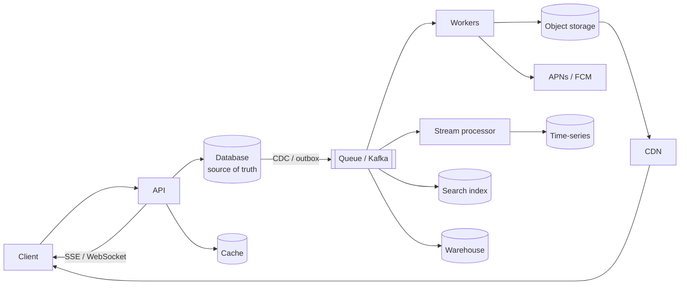

# Building blocks revision and interview questions

## 1. What this is, and why they ask it

Sixteen days ago you knew what a database was. Since then you have met queues, logs, object stores, search
indexes, warehouses, time-series stores, real-time channels, push notifications, geospatial indexes and
probabilistic structures. Today the phase closes.

The way to close it is not to reread it. It is to be able to hear a requirement and say, in one sentence,
which component it belongs to and why — because that is exactly what the next phase asks of you. **Every
high-level design question from day 145 onwards is an exercise in picking these boxes and defending the
choice.**

This lesson has two halves. The first is the decision table: one line per component saying what it is for,
what it is not for, and the number that decides. The second is a mock round on a system you have not seen,
worked through as an interview — including the follow-ups where "we'll use Kafka" has to become a reason.

They ask this phase's material as follow-ups rather than as questions of its own: *"you need search, a queue
and a cache — which technologies, and why?"* The answer that scores is not a list of product names. It is
the requirement each one is answering and the one you would drop if pushed.

By the end of today you can place any of the fifteen components from a requirement, quote the number that
justifies it, name what you give up, and take an unseen design from a blank slate to a defended architecture.

---

## 2. The story

Kadam has built or renovated about ninety houses and he does not lay a single brick.

What he does, on the first visit, is walk through the place with the owner and sort what they are saying into
piles. The owner talks for twenty minutes about what they want — more light in the kitchen, the damp on the
north wall, a bathroom upstairs, and could the stairs be moved.

By the end of it Kadam has, in his head, five separate jobs belonging to five different people, in an order
that cannot be changed.

The damp is not a painting job even though the owner described it as one. It is a plumbing job, or a
waterproofing job, and painting it before that is fixed is money set on fire. The bathroom upstairs is not
one job, it is a plumbing job and a waterproofing job and a tiling job, and they have to happen in that order
or you do them twice. Moving the stairs is structural and needs the engineer, and until the engineer answers,
nothing else about the ground floor can be quoted.

**Most of what he is paid for is knowing which trade a sentence belongs to**, and knowing when the owner's
description of the problem is not the problem.

The owner who caused him the most trouble was an engineer himself, and very clear about what he wanted, and
what he wanted was to use one man for everything because he had found a mason who was cheap and willing. The
mason did the tiling, which was acceptable, and the plumbing, which was not, and the electrical work, which
they had to open the walls again for eight months later.

Kadam's line to him at the time, which he says he regrets slightly because it was rude, was that the mason
had never once said "that is not my work" — and that a man who never says that is not a specialist, he is a
volunteer.

The other kind of trouble is the opposite and it is more common now. People arrive having read things, and
they want a particular imported waterproofing system for a bathroom in a two-room flat where a hundred and
forty rupees of ordinary work would do the same job for fifteen years.

Kadam does not argue with those ones for very long. He quotes both and lets them decide.

---

## 3. The idea in plain English

Kadam's first visit is what a design interview's first ten minutes should be, and both of his difficult owners
are recognisable.

**The whole phase is one skill: hearing a requirement and naming the component that answers it.** Not knowing
what Kafka is — knowing what question Kafka is the answer to, and what question it is not.

**Here is the entire phase as a decision table.**

| The requirement sounds like | The component | The number that decides |
|---|---|---|
| "the user shouldn't wait for this" | **task queue** (SQS, Rabbit) | latency saved; availability stops being a product |
| "several teams want this event" | **log / pub-sub** (Kafka, SNS→SQS) | consumers > 1, or replay needed |
| "replay it after a bug fix" | **Kafka** specifically | retention window |
| "count things as they arrive" | **stream processor** (Flink) | watermark lag; state per key |
| "store the uploaded file" | **object storage** (S3) | ~$0.023/GB storage vs $0.09/GB egress |
| "find text, ranked" | **search index** (Postgres FTS, Elasticsearch) | document count; do you need facets? |
| "metrics and dashboards" | **time-series store** (Prometheus) | series cardinality, not point volume |
| "analysts want to query everything" | **warehouse** (Snowflake, BigQuery) | data volume; is it >100 GB? |
| "produce a daily number" | **batch pipeline** (Airflow + dbt) | SLA and backfill needs |
| "the browser must find out immediately" | **SSE or WebSocket** | does the client also send? |
| "notify when the app is closed" | **APNs / FCM** | nothing else can reach the device |
| "find things near me" | **geo index** (Redis GEO, PostGIS, H3) | write rate vs read rate |
| "have I seen this before, cheaply" | **Bloom filter** | memory saved vs false-positive cost |
| "read this a lot, it rarely changes" | **cache** (Redis, CDN) | hit rate; what does staleness cost? |
| "it must be correct and queryable" | **the database** | the default, and the burden of proof is on leaving it |

**The last row is the important one.** Every other component in this table is something you added because the
database could not do the job well enough. **The database is the default and everything else needs a
justification**, which is the opposite of how these designs usually get built.

**Three questions place almost any component**, and asking them out loud is most of the first ten minutes:

**One: does the user need the answer to continue?** No means it can be asynchronous — a queue, a batch job, a
push notification. Yes means it is on the request path and everything about it is a latency budget.

**Two: how stale can it be?** Zero means the database. Seconds means a cache or a search index or a stream.
Hours means a warehouse or a batch pipeline. **Every derived copy in a system has a staleness number, and a
design that has not stated it has not been finished.**

**Three: what is the read-to-write ratio?** Read-heavy means caches, replicas, precomputation, derived
indexes. Write-heavy means queues, partitioning, and asking whether the writes need to be durable at all —
driver locations do not.

**And two failure modes, both of which Kadam met.**

**The mason who never says "that is not my work."** Using one component for everything. Metrics in the
relational database. Files in the database. Analytics on the production primary. Search with `LIKE`. Each of
those works at small scale and each has a specific number where it stops — and the phase was largely about
those numbers.

**The owner who wanted the imported system for a two-room flat.** Reaching for Kafka when one consumer and no
replay requirement means a queue is simpler; for Elasticsearch at fifty thousand documents when Postgres
full-text search is transactionally consistent and free; for a warehouse at ten gigabytes. **Every component
is a permanent operational cost**, and "we might need it later" is not a reason to pay it now.

**The sentence that ties the phase together:** almost every component here is **a derived copy of data that
lives somewhere else**, arranged for a different question. The search index, the warehouse, the cache, the
materialised view, the geo index. **Derived copies go stale, drift, and need rebuilding — and every one of
them needs a sync mechanism and a reconciliation job**, which is the part that never appears on the
architecture diagram and is where the real work is.

---

## 4. The picture

The whole phase as one architecture, with the arrows that matter:



**What to notice.** Every arrow out of the database is a **derived copy**, and every one of them is
asynchronous and therefore stale. The database has no incoming arrows from any of them. **If your diagram has
an arrow pointing back into the source of truth from a derived store, something is wrong.**

The three questions, as a decision path:

```
  "does the user need the answer to continue?"
        |
        +-- YES ---> on the request path
        |            -> database, cache, search index
        |            -> latency budget applies to everything here
        |
        +-- NO ----> off the request path
                     -> queue -> worker
                     -> "what does the user see meanwhile?"   <- always ask

  "how stale can it be?"
        0        -> the database, or a synchronous read-through cache
        seconds  -> cache, search index, stream processor
        minutes  -> materialised view, precomputed feed
        hours    -> warehouse, batch pipeline

  "read-to-write ratio?"
        1000:1   -> cache, replicas, precompute, denormalise
        1:1000   -> queue, partition, and ask if the writes must be durable
```

The numbers that decide, on one page:

```
LATENCY LADDER            memory 100 ns | SSD 100 us | same-DC 0.5 ms
                          | cross-region 80 ms | cross-planet 200 ms

STORAGE COST/GB/MONTH     object $0.023 | DB SSD $0.115 | egress $0.09/GB
                          -> egress usually dwarfs storage

THROUGHPUT, ONE NODE      Redis 100k ops/s | Kafka 100k msg/s | Postgres 10k writes/s
                          Postgres hot row ~200/s | ES 10-50k docs/s bulk
                          Prometheus 500k-1M samples/s

WHEN TO SWITCH            Postgres FTS -> Elasticsearch:  ~1-5M documents
                          Postgres -> warehouse:          ~100 GB
                          replica -> columnar:            when queries scan, not seek
                          one node -> sharding:           when the working set > RAM

STALENESS DEFAULTS        ES refresh 1 s | CDC seconds | nightly batch 24 h
                          Kafka retention 7 d | push: no guarantee at all
```

---

## 5. How it actually works

The phase, compressed. One block per component: what it is, the one number, and the thing people get wrong.

### Queues and logs

**Task queue** (SQS, RabbitMQ): one message, one consumer, per-message retries and a dead-letter queue.
**Log** (Kafka): messages retained, several consumer groups read independently, replay by rewinding an offset.

```
work  -> task queue     "send this email"      one owner, done, gone
event -> log            "user 4471 signed up"  many readers, replayable
```

**The one number:** a queue absorbs bursts and does not create capacity. Size consumers at **~2× average**,
because drain rate is `M − L`, not `M`. **Alert on oldest-message age, never on depth.**

**What people get wrong:** at-least-once is not optional, so **every consumer must be idempotent**; and the
visibility timeout bug — a job longer than the timeout is redelivered while still running, and the work
happens twice with no crash.

### Kafka specifics

Ordering is **per partition only**; the key chooses the partition. **Within a consumer group members compete;
between groups everyone sees everything.** More consumers than partitions means idle consumers.

```
acks=all, replication.factor=3, min.insync.replicas=2   for anything that matters
```

**What people get wrong:** `min.insync.replicas=1` looks safe and permits silent data loss; and a skewed key
gives a hot partition that no amount of extra brokers fixes.

### Stream processing

Bucket by **event time**, not processing time. A **watermark** is `max event time seen − a measured
allowance`, set above p99 of the observed delay. Late events need a stated policy — drop, fold forward, or
reopen the window with an **allowed lateness** that multiplies your state linearly.

**What people get wrong:** an idle partition freezes the whole job's watermark, and the symptom is a dashboard
that stops updating with no error.

### Object storage

Flat key namespace, no partial writes, ~11 nines durability, 20–100 ms first byte. **Presigned URLs so bytes
never touch your servers**; multipart for large files; a CDN in front, always.

```
storage $0.023/GB/month  |  egress $0.09/GB
40 TB of images: ~$900 storage, ~$54,000 egress before a CDN
```

**What people get wrong:** no transaction spans the store and the database — **create the row first in
`PENDING`**, drive completion from the store's event, and run a reconciliation job.

### Search

An **inverted index**: term → sorted list of doc ids. `LIKE '%x%'` cannot use a B-tree and scans everything —
~500 ms on a million rows against ~2 ms. The **analysis pipeline must be identical** at index and query time.
BM25 for ranking; tune field boosts, not parameters.

```
Postgres FTS (tsvector + GIN)   up to ~1-5M docs, transactionally consistent
Elasticsearch                   beyond that, or for facets and typo tolerance
```

**What people get wrong:** using it as a source of truth. **Search returns ids; the application hydrates from
the database.**

### Time-series

Append-only, ordered, similar consecutive values, regular timestamps → delta-of-delta plus XOR compression
takes **16 bytes per point to ~1.5.** Downsample: raw 15 days, 1-minute 90 days, 1-hour 2 years — about **18×
less** — storing min/max/sum/count, not just the mean.

**What people get wrong:** **cardinality, not point volume, kills these systems.** Memory scales with the
number of *series*. Never label with a user id, request id, or a path containing ids.

### Warehouse

Row store reads every field to get one: **16 GB scanned to sum a column needing 320 MB.** Columnar prunes
columns, compresses 5–10×, vectorises, and skips blocks by zone maps — **~100× less I/O.** Star schema, ELT
with CDC, transformations as a DAG.

**What people get wrong:** a read replica fixes the *harm* (CPU, locks, buffer pool) and not the *query* — it
is still a row store. And **under ~100 GB, a replica with indexes or DuckDB over Parquet is the honest
answer.**

### Batch pipelines

A DAG run in topological order. Two properties make it survivable: **partition by time**, and **every write
idempotent — overwrite, never append.** Jobs take the **execution date as a parameter**, never `now()`.

**What people get wrong:** a pipeline that runs successfully can still be wrong. Assert on the data — row
counts against the trailing average, **counts before and after every join** — and fail the run rather than
warn.

### Real-time channels

```
polling      simple, stateless, ~99% waste, latency and load locked together
long polling instant, one held connection per waiting client
SSE          one-way, and gives you reconnect + Last-Event-ID free
WebSocket    two-way, ~6 bytes/message, everything else is yours to write
```

**What people get wrong:** persistent connections make a stateless fleet **stateful** — cross-server delivery
needs a pub-sub backplane on per-user channels, and a deploy disconnects everyone at once.

### Push notifications

Three hops, you control one. **No delivery guarantee and no delivery report.** The **only** token-invalidation
signal is a `410` when you send. Fan-out is your capacity, not the platform's: ~200 req/s per worker.

**What people get wrong:** putting the content in the payload. **A push is a nudge; the message lives in your
store.**

### Geospatial

A B-tree indexes one dimension. Reduce 2D to 1D preserving nearness: **geohash prefixes** (precision 6 ≈
1.2 × 0.6 km), and query the cell **plus its eight neighbours** — for a 500 m radius, ~70% of query points
need it. **The index narrows; an exact distance filter always follows.**

**What people get wrong:** live locations are ephemeral and belong in Redis with a TTL, not in the durable
database.

### Probabilistic structures

**Bloom filter:** "no" is certain, "maybe" is not. 9.6 bits/item at 1% — a billion URLs in 1.2 GB instead of
100 GB. **Place it so a false positive costs a cheap extra lookup, never a wrong answer.**
**HyperLogLog:** distinct count in ~12 KB at any cardinality, and **mergeable**. **Count-Min:** frequency,
never under-estimates.

**What people get wrong:** overfilling degrades silently — five times the design capacity takes 1% to 63%.

---

## 6. The numbers

The figures worth having memorised, because quoting one is what turns an assertion into an argument.

**Latency:**

```
memory read            100 ns
SSD random read        100 us          1,000x memory
same-datacentre hop    0.5 ms          5,000x
cross-region (US-EU)   80 ms
cross-planet           200 ms
```

**Throughput, one node:**

```
Redis                  ~100,000 ops/s
Kafka                  ~100,000 msg/s per broker (~100-300 MB/s)
Postgres writes        ~10,000/s indexed; a hot row ~200/s
Elasticsearch          10,000-50,000 docs/s bulk; ~1,000/s single-document
Prometheus             500,000-1,000,000 samples/s
WebSocket connections  50,000-100,000 per machine
Push notifications     ~200 req/s per worker
```

**Storage and cost:**

```
object storage         $0.023 /GB/month
DB SSD (gp3)           $0.115 /GB/month        5x
egress to internet     $0.09  /GB              usually the whole bill
warehouse compute      ~$4/hour per cluster    ~$2,900/month if left running
```

**Compression and sizing:**

```
time-series            16 B/point -> ~1.5 B      ~10x
search index           20-50% of source text (100% with positions)
warehouse columnar     5-10x on top of column pruning
Bloom filter, 1%       9.6 bits/item
HyperLogLog            12 KB at any cardinality
```

**Switching points:**

```
Postgres FTS -> Elasticsearch     ~1-5 million documents, or facets needed
Postgres -> warehouse             ~100 GB, or a second team asking questions
replica -> columnar               when queries scan rather than seek
single node -> shard              when the working set exceeds RAM
polling -> push                   when clients x frequency >> event rate
```

**Staleness defaults:**

```
Elasticsearch refresh        1 s
CDC to warehouse             seconds to minutes
nightly batch                up to 24 h
Kafka retention              7 days (the window you have to notice a lagging consumer)
push notification            no guarantee, ever
```

**And the derived numbers that carry an argument:**

```
egress vs storage       40 TB images: $900 storage, $54,000 egress
row vs column           16 GB scanned vs 320 MB needed -> ~100x
polling vs WebSocket    100k users @5 s: 176 Mbps vs 40 KB/s
Bloom vs exact set      1e9 URLs: 1.2 GB vs 100 GB
multi-source vs per-source (any fan-out shape): k separate passes vs one
sync vs async signup    2,400 ms -> 86 ms; 99.5% -> 99.9% availability
```

**A worked example of the arithmetic an interviewer wants**, on a fan-out question:

```
10,000 orders/s, 2 KB each, 5 consumers
  point-to-point (1 queue)     10,000 x 2 KB          = 20 MB/s
  SNS -> 5 SQS queues          50,000 x 2 KB          = 100 MB/s, 5 stored copies
  Kafka, 5 consumer groups     20 MB/s stored, 100 MB/s out, ONE copy
  7-day retention              20 MB/s x 604,800      = 12 TB (Kafka)
                                                        60 TB (5 SQS copies)
```

**Five lines, and the choice between SNS→SQS and Kafka stops being a preference.**

---

## 7. The trade-offs

The five that recur, each as the sentence you would actually say.

**Every component is a derived copy, and derived copies go stale.** "The search index, the cache, the
warehouse and the geo index are all copies of data that lives in the database. Each has a staleness number I
should state, a sync mechanism, and a reconciliation job — and the reconciliation job is the part that never
appears on the diagram and is where the real work is."

**Synchronous couples availability; asynchronous costs you the answer.** "Five services in series at three
nines is 99.5% — three and a half hours a month. Moving four of them off the request path makes it 99.9%. But
the caller now gets an acknowledgement instead of a result, so the design owes an answer to *what does the
user see meanwhile*."

**Every added component is a permanent operational cost.** "A Kafka cluster, an Elasticsearch cluster and a
Flink job are three things to run, monitor, upgrade and be paged for. At small scale Postgres does all three
jobs adequately and is one system. The burden of proof is on leaving the database, not on staying."

**Exactness against cost.** "A Bloom filter, a HyperLogLog, a sampled metric and a downsampled rollup are all
the same trade: a bounded error for a large saving. The question is always which *direction* the error points
and whether a cheap exact check is available when it matters."

**And the meta one: more real-time than the product needs is a cost with no benefit.** "A dashboard refreshed
every ten seconds is indistinguishable from one refreshed continuously, to a human reading a number. The
question is not 'can we stream it' but 'would anyone notice'."

**And what I would not add**, which is worth having ready as a list: Kafka when there is one consumer and no
replay requirement; Elasticsearch under a million documents; a warehouse under a hundred gigabytes; a stream
processor when a nightly batch is looked at once a day; WebSockets when only the server sends; a distributed
lock when a unique constraint would do; and a cache before measuring the hit rate you would get.

---

## 8. In the interview

### How it gets asked

Rarely as a topic. As follow-ups, in the middle of a design:

- *"You need search, a queue and a cache. Which technologies, and why?"*
- *"Why Kafka and not SQS here?"*
- *"Where does that data actually live?"*
- *"How does the search index stay up to date?"*
- *"What happens when that component is down?"*
- *"How stale can this be?"*

### The mock round

*"Design the backend for a food delivery app. Restaurants, menus, orders, live tracking of the delivery
partner, and search. Assume a few million users. Forty-five minutes."*

**Minute 0 to 4 — sort the requirements into piles before choosing anything.**

> "Let me sort what you have said into piles, because these are four quite different systems and they need
> different components.
>
> **Transactional and must be correct:** the order itself, payment, inventory of what a restaurant currently
> has. That is a relational database and I would not move it anywhere.
>
> **Read-heavy and rarely changing:** menus, restaurant details, images. Cache and CDN territory.
>
> **Search:** finding restaurants and dishes by keyword, filtered by location and cuisine.
>
> **Write-heavy and ephemeral:** the delivery partner's location, every few seconds.
>
> **And asynchronous:** notifications, the analytics feed, the restaurant's own dashboard.
>
> Two questions before I draw anything. What is the read-to-write ratio on orders — I would guess heavily
> read, because customers check status repeatedly. And how fresh does the tracking need to be: every second,
> or every ten? Because that changes the mechanism entirely."

**Minute 4 to 14 — the components, each with the reason.**

> "**Orders, payments, inventory: Postgres.** These need transactions — decrement stock and create an order
> atomically — and they are small. A few million users placing maybe a hundred thousand orders a day is about
> one and a half writes a second average, tens at peak. This is not a scale problem and I would resist anyone
> making it one.
>
> **Menus and restaurant data: Postgres plus Redis.** Read-heavy, rarely changing, so a cache with a
> few-minutes TTL and explicit invalidation when a restaurant updates its menu. **The staleness number is
> minutes and I would state it**, because 'this dish is unavailable' arriving five minutes late is a real
> customer experience.
>
> **Images: object storage behind a CDN.** Presigned URLs for restaurant uploads so bytes never touch my
> servers. And the number that matters here is egress: menu images served to a few million users is the
> largest single line on the infrastructure bill unless the CDN hit rate is high, so I would size the
> thumbnails deliberately rather than serve originals.
>
> **Search: Postgres full-text to start.** A few million users does not mean a few million restaurants — it is
> probably tens of thousands, each with a few dozen dishes, so maybe a million searchable documents. **That is
> squarely in Postgres's range**, it is transactionally consistent with the menu, and it removes an entire
> system. I would move to Elasticsearch when I need faceted filtering with counts, typo tolerance, or the
> query volume becomes a problem for the primary — and I would say that as the trigger rather than build it
> now.
>
> **Live tracking: Redis GEO with a TTL.** A delivery partner reporting every four seconds is the write-heavy
> part, and **that data is completely disposable** — a location from four seconds ago has no value, and if the
> whole store were lost every partner re-reports within four seconds. So it does not belong in Postgres at
> all. `GEOADD` per ping, `GEOSEARCH` for 'partners near this restaurant', and a thirty-second TTL so a
> partner who goes offline disappears with no cleanup job.
>
> **Async work: a queue.** Order confirmation notifications, restaurant printer jobs, the analytics feed.
> SQS-shaped rather than Kafka-shaped for the work items, because each has one owner and needs per-message
> retry and a dead-letter queue."

**Minute 14 — first interruption.** *"Why not Kafka for all of it?"*

> "Because most of what I listed is *work* rather than *events*, and Kafka is bad at work.
>
> A notification job has one owner, must be retried individually if it fails, and needs a dead-letter queue
> when it fails permanently. **Kafka has no per-message acknowledgement**, so a poison message blocks its
> partition and I would have to build retry topics myself — which is real code that SQS gives me free.
>
> **Where I would use Kafka is the event stream**: `OrderPlaced`, `OrderDelivered`, `PartnerAssigned`. Those
> are facts that several teams want — analytics, the restaurant dashboard, fraud, and later somebody who does
> not exist yet — and one of them will want to replay a month after fixing a bug. **That is the test: more than
> one consumer, or replay needed.**
>
> And there is a storage argument at volume: five consumers via SNS to five SQS queues stores five copies;
> Kafka with five consumer groups stores one. At a hundred thousand orders a day that difference is
> irrelevant, so I would not use it as the reason today — but it is why the answer changes at scale.
>
> **So: Kafka for the event backbone, a task queue for work items.** Both, doing different jobs, rather than
> forcing one to do the other's."

**Minute 20 — second interruption.** *"How does search stay in step with the menu?"*

> "The outbox pattern, and I would reject the tempting alternative first.
>
> **Not a dual write** — updating Postgres and then the index in the same request handler. There is no
> transaction across two systems, so a crash between them leaves them permanently inconsistent with nothing
> retrying and nothing knowing. It will happen.
>
> **Instead:** the menu update and an outbox row go into the same database transaction. A consumer reads the
> outbox and bulk-updates the index. Atomic at the source, at-least-once delivery, and indexing is idempotent
> because it is keyed by document id.
>
> **If I stay on Postgres full-text**, none of this applies at all — a generated `tsvector` column is updated
> in the same transaction as the row, so there is no sync and no staleness. **That is a genuine argument for
> staying** and it is worth more than the feature list.
>
> **And whichever I use, a reconciliation job**, nightly, comparing counts and checksums by id range. Over
> months the index drifts — a dead consumer, a bulk import that bypassed the outbox — and this is the only
> mechanism that finds it.
>
> **One design detail:** search returns restaurant and dish ids, and the application hydrates them from
> Postgres. So a stale index shows a slightly wrong result *set* but never wrong *content* — no old prices, no
> dishes that were removed an hour ago."

**Minute 28 — third interruption.** *"The customer wants to watch the delivery move on a map."*

> "That is a push channel, and the choice depends on whether the client sends anything.
>
> **It does not** — the customer only receives position updates. **So server-sent events, not WebSockets**,
> and I would defend that: SSE gives me automatic reconnection and the `Last-Event-ID` header for free, it is
> plain HTTP so proxies and auth cookies work unchanged, and it is a fraction of the code. WebSockets would
> hand me heartbeats, reconnection and framing to implement for a capability I do not need.
>
> **Update rate is a product decision with a cost.** Every second is not needed — a map marker moving every
> three to five seconds looks smooth and is a fifth of the traffic. I would push interpolated positions rather
> than raw pings.
>
> **The scaling shape:** an open connection makes the fleet stateful. The customer's connection lives on one
> server and the partner's location arrives at another, so I need a pub-sub backplane — Redis pub-sub on a
> per-order channel, so each server subscribes only to the orders it is watching rather than to everything.
>
> **And deploys become an incident if I ignore them.** Restarting the fleet disconnects every watching
> customer at once and they all reconnect within a second. Jittered reconnect in the client, shipped in the
> first release because I cannot deploy a fix to disconnected clients, plus connection draining and a rolling
> restart.
>
> **When the app is closed, none of this works** — that is APNs or FCM, a completely separate path, for 'your
> order has been picked up' and 'your order is arriving'."

**Minute 36 — fourth interruption.** *"The business wants a dashboard of orders per restaurant per hour."*

> "That is analytics, and the first thing I would say is: **not on the production database.**
>
> A query aggregating orders by restaurant by hour over a year scans most of the orders table. On the primary
> it competes for CPU and locks — and worse, it evicts the buffer pool, so every ordinary query starts hitting
> disk and checkout gets slower for reasons nobody can see. **The damage is not the four minutes, it is what
> the four minutes do to everything else.**
>
> **At this size, a read replica is probably enough**, and I would say that rather than propose a warehouse. A
> hundred thousand orders a day is thirty-six million a year — tens of gigabytes. A replica with an index on
> `(restaurant_id, created_at)` answers that in well under a second, and it is a configuration change rather
> than a project.
>
> **The trigger for a warehouse** is any of: the data passing roughly a hundred gigabytes; a second team asking
> questions and interfering with the first; or the queries becoming full scans rather than indexed seeks —
> which is when a row store is doing a hundred times more I/O than the query needs and no index helps.
>
> **When that happens:** CDC from Postgres into a columnar warehouse, transformations as a dbt DAG run
> nightly, partitioned by date so a query for one month touches one thirty-sixth of the data. And the
> pipeline's jobs take the execution date as a parameter and overwrite their own partition, so backfills and
> retries are free.
>
> **And the number that decides:** at ten gigabytes, a Snowflake cluster left running costs about $2,900 a
> month for something a replica does for nothing. I would not build it until one of those three triggers
> fires."

**Minute 42 — the last one.** *"What would you cut if you had two weeks?"*

> "Postgres, Redis, object storage with a CDN, and one queue. That is it.
>
> **Search becomes Postgres full-text** — one generated column and a GIN index, no second system, no sync, no
> staleness.
>
> **Live tracking becomes polling every five seconds.** Ten thousand concurrent customers watching at five
> seconds is two thousand requests a second, which one machine handles, and it needs no connection state, no
> backplane and no deploy story. **The SSE version is better and it is not week-two work.**
>
> **Kafka waits** until there is a second consumer of the event stream. Today there is one.
>
> **The warehouse waits** until a replica stops being enough.
>
> **What I would not cut:** the outbox for anything crossing a system boundary, idempotency on every consumer,
> and the object-store-plus-CDN for images — because retrofitting the first two is a rewrite, and serving
> images from application servers is a bill that arrives before anything else does."

### The model answer

*"You need search, a queue and a cache. Which technologies, and why?"*

> "I would answer with the requirement each one is solving rather than a product name, because the names
> depend on scale and the requirements do not.
>
> **The cache is answering 'this is read far more often than it changes'.** Redis, in front of the database,
> keyed by whatever the read path looks up. The number that justifies it is the read-to-write ratio and the
> hit rate — and I would measure the hit rate rather than assume it, because a cache below about 80% is mostly
> adding a network hop. **And the design owes a staleness number**: a five-minute TTL means a user can see a
> five-minute-old price, and whether that is acceptable is a product question, not mine.
>
> **The queue is answering 'the user should not wait for this'.** SQS or equivalent, for work items with one
> owner. The win is both latency — a signup goes from 2.4 seconds to under a hundred milliseconds — and
> availability, because my signup stops being the product of five services' uptime. **The costs I would name
> up front: I lose the answer, so I must decide what the user sees meanwhile; delivery is at-least-once, so
> every consumer must be idempotent; and failures become quiet, so a dead-letter queue with an alert on its
> depth is not optional.**
>
> **Search is answering 'find text, ranked'.** And here my answer depends on a number: under a few million
> documents, Postgres full-text search — a `tsvector` column and a GIN index — because it is a genuine inverted
> index, it is transactionally consistent with the data, and it removes an entire system and its sync pipeline.
> Beyond that, or if I need facets with counts, typo tolerance or the query volume off the primary,
> Elasticsearch — and then I owe an outbox, a reconciliation job and a staleness number.
>
> **The thing I would say that ties them together:** the cache and the search index are both **derived copies**
> of data that lives in the database. Every derived copy goes stale, drifts, and needs a rebuild path. So for
> each one I want three things stated — how it is kept in sync, how stale it can be, and what happens when it
> is down — and **if the answer to the third is 'the site is broken', it is not a cache, it is a dependency.**
>
> **And I would ask what I could remove.** If there is one consumer and no replay, the queue can be a database
> table with a status column and a polling worker, and that is one fewer system to run. **The burden of proof
> is on adding a component, not on keeping the database.**"

---

## 9. Recall card

**Every component here is a derived copy of something in the database, arranged for a different question.**
Each one needs a **staleness number, a sync mechanism, and a reconciliation job** — and the reconciliation job
is the part that never makes it onto the diagram.

**Three questions place almost anything:** does the user need the answer to continue (sync or async)? how
stale can it be (0 → database; seconds → cache/search/stream; hours → warehouse)? what is the read-to-write
ratio (read-heavy → cache and precompute; write-heavy → queue, partition, and ask if it must be durable)?

**Work → task queue (per-message retry, DLQ). Events → log (many readers, replay).** Postgres FTS to ~1–5M
docs; a replica to ~100 GB; SSE unless the client also sends; Redis GEO for anything moving.

**The numbers that carry an argument:** egress $0.09/GB vs storage $0.023 (40 TB ⇒ $54,000 vs $900); row-store
scan 16 GB vs 320 MB needed (~100×); polling 176 Mbps vs WebSocket 40 KB/s; Bloom 1.2 GB vs 100 GB;
time-series 16 B → 1.5 B per point.

**The two failure modes: one component doing every job, and an imported system for a two-room flat.** Every
addition is a permanent operational cost, so **the burden of proof is on leaving the database.**
