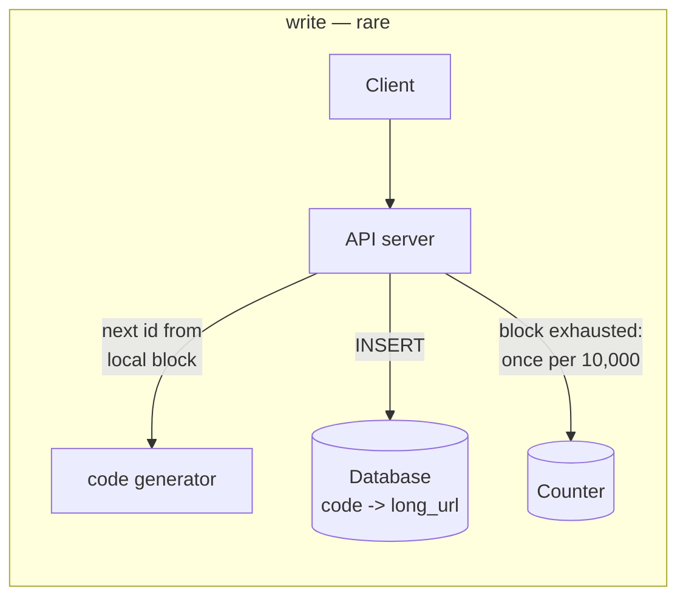
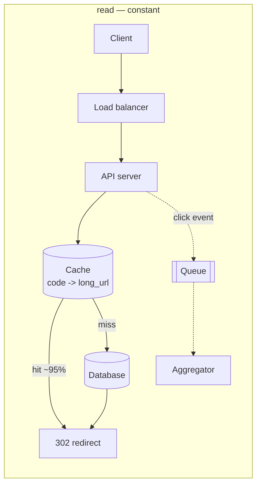

# Design a URL shortener

## 1. What this is, and why they ask it

Take `https://example.com/products/2026/winter-collection/item?id=88471&ref=email` and give back
`https://sho.rt/aK9x2b`. When somebody visits the short one, redirect them to the long one.

That is the whole product, and it is the most-asked system design question there is — partly because it is
small enough to finish in forty-five minutes, and partly because it looks trivial and is not. The interesting
parts are not where people expect: not the storage, which is small, and not the read throughput, which a cache
handles. **The interesting parts are how you generate the code and what happens at the redirect.**

It is also the first case study, so today does two things at once: the design itself, and a demonstration of
[yesterday's script](../day-145-climbing-stairs/README.md) run end to end with the clock on it.

**The specific thing being tested is whether you reach for scale you do not need.** A hundred million URLs a
month is forty writes a second. Candidates who start sharding are answering a question nobody asked; candidates
who work out the number first and then say "this fits on one machine, so the design problem is elsewhere" are
demonstrating exactly the judgement the round exists to measure.

By the end of this lesson you can run the six phases on this prompt, defend a code-generation scheme with
arithmetic, place the cache correctly, answer the 301-versus-302 question — which is a product decision — and
name the parts that are genuinely hard.

---

## 2. The story

Deepak's sweet shop has one counter for paying and one for collecting, about eleven feet apart, and in the
week before Diwali the queue goes out of the door.

The system is a small pad of numbered slips. You order at the first counter, you pay, he tears off a slip with
a number on it and writes what you ordered in his book against that number, and you go and stand at the second
counter and hold up the slip.

The number means nothing. It is not the price, it is not the order, it is not the time. **It is just a short
thing that stands for a long thing** — two kilos of kaju katli, half a kilo of soan papdi, and a box, which
would take fifteen seconds to say again at the second counter and takes half a second as "sixty-two".

Three things about it that Deepak has learnt, all of them the hard way.

**The numbers run out.** The pad goes to five hundred and in that week he gets through it by four in the
afternoon. So he starts again at one, which is fine, because by four o'clock nobody from the morning is still
waiting. **But once, in 2019, somebody came back at five with a slip from the morning** — they had left and
come back — and the number had been reused, and there was a very awkward conversation about a box of
barfi.

**People ask for particular numbers.** A man whose shop number is 108 asks for slip 108 every single year and
is pleased when he gets it. Deepak lets him, and it costs nothing, and it means that when the pad reaches 108
he has to skip it, which he sometimes forgets.

**And the slip is not the record.** If a slip is lost, the order still exists — it is written in the book
against that number, and Deepak can find it if the customer can say what they ordered. **The book is the
truth; the slip only says where to look in it.** A slip with nothing behind it in the book is worthless, and he has
never once had the opposite problem.

The other thing, which he does not think about because it has always been true, is that the second counter
never needs to know anything except the number. It does not need to know who paid, or when, or how much. It
looks up the number, hands over the box. **That is the entire job of the second counter and it is why one boy
can do it at the speed he does.**

---

## 3. The idea in plain English

Deepak's slip is a short code and his book is the mapping, and all three of his lessons are design decisions.

**The product is one mapping and two operations.** `code → long URL`, with "create a code for this URL" and
"look up this code and redirect". Everything else — analytics, expiry, custom codes, abuse prevention — is
built around that.

**Phase 1, requirements.** In scope: shorten, redirect, optional custom alias, and a click count. Out of scope:
user accounts, ads, link previews. Non-functional, and these decide the design:

- **The redirect is on somebody else's critical path.** A person clicked a link in a message; the shortener
  sits between them and the page they wanted. **Single-digit milliseconds, or it is a visible delay.**
- **Availability matters more than consistency.** A redirect that works with a slightly stale target beats one
  that fails. Conversely, an unavailable shortener breaks every link anyone has ever shared.
- **Extremely read-heavy.** A URL is created once and followed many times.

**Phase 2, scale, and this is where the design is decided.** Say a hundred million new URLs a month:

```
100,000,000 / 30 days / 86,400 s   = ~40 writes per second
peak x5                            = ~200 writes/s
reads at 100:1                     = ~4,000 reads/s, ~20,000 peak
storage: 500 bytes x 100M/month    = 50 GB/month, 600 GB/year
```

**Those numbers say something specific and it is worth saying out loud: none of this is hard.** Two hundred
writes a second is one modest database. Six hundred gigabytes a year fits on one disk for a decade.
**So the design problem is not scale — it is the code generation and the redirect latency**, and a candidate
who starts sharding has not read their own arithmetic.

**Phase 3, the API.** Two endpoints, and the second one is the whole product:

```
POST /urls   {long_url, custom_alias?, expires_at?}  -> {short_url}
GET  /{code}                                          -> 301 or 302 redirect
```

**And the data model is one table** with `code` as the primary key, because the redirect is a single
primary-key lookup and nothing else. That is the second counter: it needs the number and nothing more.

**Now the part that actually matters: how do you make the code?**

**Option one: hash the URL and take the first few characters.** Deterministic, so the same URL always gives
the same code. **And it collides** — two different URLs hashing to the same prefix — so every write needs a
read to check, and a retry loop with a salt when it does. It also makes "the same URL twice" return the same
code, which is either a feature or a bug depending on whether users expect distinct links.

**Option two: random codes.** Generate seven random base-62 characters, check for a collision, retry. Simple,
unguessable, and the collision probability grows as the space fills — which is fine for a long time and
requires monitoring.

**Option three: a counter, encoded in base 62.** Take the next integer and encode it. **No collisions at all,
by construction**, and the codes are as short as possible for the number of URLs issued. The problem is that a
single global counter is a bottleneck and a single point of failure — and the codes are sequential, therefore
guessable, so anyone can enumerate every link ever shortened.

**The practical answer is option three with two fixes**, and this is the thing to be able to defend:

**Block allocation.** Each application server asks a central counter for a block of ten thousand ids at a time
and hands them out locally. That turns coordination from once per URL into once per ten thousand, and a server
crashing wastes at most ten thousand codes out of trillions.

**And a shuffled alphabet or an ID transformation**, so codes are not sequentially guessable. The simplest is
to use a fixed permutation of the base-62 alphabet; a stronger one is to multiply the counter by a large odd
number modulo the space, which is reversible and scatters consecutive ids.

**How long should the code be?** This is arithmetic, and it is the number to produce:

```
base 62 (a-z, A-Z, 0-9)
  6 characters   62^6 = 56,800,000,000        at 100M/month -> ~47 years
  7 characters   62^7 = 3,500,000,000,000     -> ~3,000 years
```

**Six characters is enough for forty-seven years**, which is longer than the product will exist. **Seven gives
you room to be wrong**, and one extra character is cheap. Say both numbers and pick.

**Phase 4, the design, and it is deliberately boring.**

```
write:  client -> API -> get a code from the local block -> insert -> return
read:   client -> API -> cache lookup -> (miss) database -> redirect
```

**The redirect is one cache lookup and one HTTP response.** That is why it can be single-digit milliseconds.

**And the click count does not go on the read path.** Incrementing a counter in the database on every redirect
turns a read-only path into a write-heavy one and puts a hot row in front of your most latency-sensitive
operation. **Push an event onto a queue and aggregate asynchronously.**

**Phase 5, the deep dive, and there are two candidates.**

**The cache**, because the read path is the product. URL popularity is extremely skewed — a handful of links
get most of the traffic — so a small cache covers a large fraction. **And the right eviction policy follows
from the access pattern**, which is that a link is hot for a short period after it is shared and then almost
never used again.

**Or the 301-versus-302 decision**, which is more interesting because it is not technical:

- **301 Permanent** — browsers cache it, so subsequent clicks never reach your servers. **Fast, cheap, and you
  lose all analytics after the first click**, and you can never change where the link points.
- **302 Found** — not cached, so every click comes to you. **Every click is counted and the target can be
  changed**, at the cost of a round trip every time and all the traffic.

**That is a product decision presented as a status code**, and recognising it as such is the point.

**Phase 6, wrap-up.** The bottleneck is the redirect read, which is a cache problem. What breaks at ten times
the load is nothing structural — more cache and more replicas. What is genuinely hard and was left out:
**abuse**, because a shortener is a perfect tool for hiding a malicious destination, and every real one needs
scanning, rate limiting and a takedown path.

---

## 4. The picture

The two paths:





**What to notice.** The click event is a dotted line off the critical path — the redirect is returned without
waiting for it. **Putting an increment on the read path is the single most common mistake in this design**, and
it converts four thousand reads a second into four thousand writes a second against one hot row.

Code generation, compared:

```
HASH THE URL                    RANDOM                      COUNTER + BASE 62

md5(url)[:7]                    7 random base-62 chars      id=1000000 -> "4c92"
  deterministic                   unguessable                 no collisions EVER
  COLLIDES -> read before          collides -> read before     no read before write
    every write                      every write               sequential -> guessable
  same URL -> same code           same URL -> new code
                                                            + block allocation
                                                              -> 1 coordination
                                                                 per 10,000
                                                            + shuffled alphabet
                                                              -> not enumerable
```

The length arithmetic:

```
  base 62:  a-z (26) + A-Z (26) + 0-9 (10)

  length   space              at 100M/month
  ------   ----------------   -------------
    5        916,132,832      ~9 months
    6     56,800,235,584      ~47 years
    7  3,521,614,606,208      ~2,900 years

  -> 6 is enough; 7 is the safe choice and costs one character
```

The 301/302 trade, which is the decision people miss:

```
  301 PERMANENT                          302 FOUND

  browser caches the redirect            browser asks every time
  2nd click never reaches you            every click reaches you

  + almost zero traffic after the 1st    + every click counted
  + fastest possible for the user        + the target can be CHANGED later
  - no analytics beyond the first        - every click costs a round trip
  - the link can NEVER be repointed      - all the traffic is yours to serve

  -> a commercial shortener uses 302, because clicks are the product
  -> an internal one might use 301, because traffic is the cost
```

---

## 5. How it actually works

### Base-62 encoding

```python
ALPHABET = "abcdefghijklmnopqrstuvwxyzABCDEFGHIJKLMNOPQRSTUVWXYZ0123456789"
BASE = len(ALPHABET)          # 62


def encode(number: int) -> str:
    if number == 0:
        return ALPHABET[0]
    out = []
    while number:
        number, remainder = divmod(number, BASE)
        out.append(ALPHABET[remainder])
    return "".join(reversed(out))


def decode(code: str) -> int:
    value = 0
    for character in code:
        value = value * BASE + ALPHABET.index(character)
    return value
```

**Base 62 rather than base 64** because the two extra characters in base 64 are `+` and `/`, which need
URL-encoding and defeat the purpose. **And some shorteners drop `0`, `O`, `l` and `1`** to avoid transcription
errors when somebody reads a code aloud — which takes it to base 58 and is a real product decision if links
are ever spoken or printed.

### Block allocation

```python
class CodeGenerator:
    """Each server holds a block of ids and refills from a central counter."""

    BLOCK = 10_000

    def __init__(self, counter_store):
        self.counter = counter_store
        self.next_id = 0
        self.block_end = 0

    def next_code(self) -> str:
        if self.next_id >= self.block_end:
            start = self.counter.increment_by(self.BLOCK)   # atomic, e.g. Redis INCRBY
            self.next_id, self.block_end = start, start + self.BLOCK
        code_id = self.next_id
        self.next_id += 1
        return encode(scatter(code_id))
```

**One atomic operation per ten thousand URLs.** At two hundred writes a second that is one coordination call
every fifty seconds — so the central counter is not a bottleneck by any measure, and if it is briefly
unavailable, servers keep working until their blocks run out.

**A server restarting abandons the rest of its block**, which wastes up to ten thousand codes out of
fifty-six billion. **That is a rounding error and it is the right trade**, and saying so pre-empts the obvious
objection.

### Making codes unguessable

```python
# a large odd number, coprime with the space -> a reversible scramble
MULTIPLIER = 8_648_838_431
SPACE = 62 ** 7

def scatter(n: int) -> int:
    return (n * MULTIPLIER) % SPACE
```

**Consecutive ids map to scattered codes**, so `aK9x2b` gives no hint about `aK9x2c`, and it is reversible if
you ever need the original id. **This is obfuscation, not security** — anyone determined can still probe — and
the honest position is that **short links are not private and should never be treated as an access control
mechanism.** If a link must be secret, it needs authentication, not a longer code.

### The schema

```sql
CREATE TABLE urls (
    code        VARCHAR(8) PRIMARY KEY,
    long_url    TEXT        NOT NULL,
    created_at  TIMESTAMPTZ NOT NULL DEFAULT now(),
    expires_at  TIMESTAMPTZ,
    creator_ip  INET,
    is_disabled BOOLEAN     NOT NULL DEFAULT false
);
CREATE INDEX ON urls (expires_at) WHERE expires_at IS NOT NULL;
```

**`code` as the primary key** makes the redirect a single index lookup with no join — which is the entire read
path and the reason it can be fast.

**`is_disabled` rather than deleting** so that a takedown returns a clear "this link was removed" rather than a
404 that looks like a bug, and so that the code is never reissued.

**Custom aliases live in the same table** with the same uniqueness constraint, which is what makes "this alias
is taken" a database error rather than application logic. **The generated codes must not collide with custom
ones**, and the cleanest way is to require custom aliases to be at least a different length, or to reserve them
in the same counter space.

### The read path

```python
def redirect(code: str):
    target = cache.get(code)                      # ~0.2 ms
    if target is None:
        row = db.fetch_one("SELECT long_url, is_disabled, expires_at FROM urls WHERE code = %s", code)
        if row is None:
            return http_404()
        if row.is_disabled or expired(row):
            return http_410()                     # Gone, not 404 — it existed
        target = row.long_url
        cache.set(code, target, ttl=3600)
    queue.publish({"code": code, "at": now(), "ip": ..., "ua": ...})   # fire and forget
    return http_302(target)
```

**The click event is published and not awaited.** If the queue is down, the redirect still works — analytics is
not worth failing a redirect for, and that priority should be explicit in the code rather than accidental.

**Negative caching matters too:** a code that does not exist should be cached as "not found" for a short
period, or a bot probing random codes generates a database query per probe.

### Caching

```
cache the code -> long_url mapping, TTL a few hours
expected hit rate:  90-99%
```

**The access pattern is extremely skewed and time-bounded:** a link is shared, gets a burst of traffic over
hours or days, and then almost nothing. **LRU is close to ideal for that shape** — the hot links stay resident
and the long tail evicts itself.

```
memory for 10,000,000 hot entries x ~200 bytes  = ~2 GB
```

**Two gigabytes covers ten million hot links**, which for most shorteners is well beyond the working set.

**Invalidation is the one wrinkle.** If a link can be edited or disabled, the cached copy must be evicted —
otherwise a takedown does not take effect for an hour. A short TTL bounds it; explicit invalidation on
disable makes it immediate.

### Analytics without hurting the redirect

```
redirect -> publish {code, timestamp, ip, user_agent, referrer} -> queue
                                                                    |
                                             aggregator -> counts per code per hour
                                                        -> raw events to object storage
```

**Aggregate rather than counting per click.** A per-code hourly counter is a tiny amount of data; storing every
click is a large amount and is only needed if the product sells per-visitor analytics.

**And the counter must not be a hot row in the main database.** Either a separate store, or Redis with periodic
flushing, or an append-only table aggregated in batches.

### Expiry and cleanup

**A background job deletes rows past `expires_at`**, in batches, off-peak. **Codes are not reused** even after
expiry — the space is enormous and reuse recreates Deepak's barfi problem, where an old link suddenly points
somewhere new.

### Abuse, which is the part nobody plans for

**A shortener is an ideal tool for hiding a malicious destination**, and every real one is attacked within
days of launch. The minimum:

- **Rate limit creation by IP and by account**, or one script creates a million links overnight.
- **Check destinations against a safe-browsing list** at creation and periodically afterwards, because a
  domain can be clean at creation and compromised later.
- **A preview page** — `sho.rt/aK9x2b+` showing the destination without following it.
- **A takedown path**, and `is_disabled` rather than deletion so the code is never reissued.
- **Block redirects to your own domain** and to `javascript:` or `data:` URIs, which is a stored-XSS vector.

**Naming abuse unprompted is a strong signal**, because it is the requirement that separates a design exercise
from a product.

---

## 6. The numbers

**The phase-2 arithmetic, in full:**

```
new URLs                100,000,000 / month
                        100,000,000 / 30 / 86,400        = ~40 writes/s
peak (x5)                                                = ~200 writes/s

reads at 100:1                                           = ~4,000 reads/s
peak                                                     = ~20,000 reads/s

storage per row         code 8 + url 200 + metadata 100  = ~500 bytes (with overhead)
per month               100,000,000 x 500 B              = 50 GB
per year                                                 = 600 GB
after 5 years                                            = 3 TB
```

**The decision that follows:** two hundred writes a second and three terabytes over five years is **one
database**. No sharding, no partitioning, no distributed anything. **The read path is the only thing that needs
thought, and it is a cache.**

**Code length:**

```
62^5 =          916,132,832      ~9 months at 100M/month
62^6 =       56,800,235,584      ~47 years
62^7 =    3,521,614,606,208      ~2,900 years
```

**Collision probability, if you choose random codes instead** — the birthday problem:

```
7 characters, space 3.5 x 10^12
after 10,000,000 codes issued:
  P(a given new code collides) = 10^7 / 3.5x10^12 = ~1 in 350,000

after 100,000,000 issued:
  ~1 in 35,000
```

**So random codes need a uniqueness check on write, and the retry rate stays negligible for a long time** —
but it grows, and it is a number to monitor rather than assume.

**Cache sizing:**

```
hot entries          10,000,000
per entry            code 8 B + url 200 B + overhead    = ~250 B
                     10,000,000 x 250 B                 = 2.5 GB
```

```
hit rate 95%:
  4,000 reads/s x 0.05 = 200 database reads/s     -> trivial
hit rate 50%:
  2,000 database reads/s                          -> still fine, but 10x the load
```

**Latency budget:**

```
cache hit            0.2 ms
+ network in/out     ~1 ms
+ application        ~0.5 ms
                     ---------
                     ~2 ms at the server

cache miss           + 1-5 ms database read
```

**Under five milliseconds either way**, which is what makes the "single-digit milliseconds" requirement
achievable without heroics.

**Bandwidth:**

```
a redirect response is headers only    ~500 bytes
20,000 reads/s x 500 B                = 10 MB/s = 80 Mbps
```

**Trivial**, which is worth noting because it means no CDN is required for the redirect itself — unlike almost
every other design in this phase.

**What 301 costs and saves:**

```
average clicks per link              ~10
with 302: every click hits you       10 requests per link
with 301: only the first per browser ~1-2 requests per link

-> 301 cuts read traffic by roughly 5-10x
-> and eliminates 80-90% of your analytics
```

**Analytics volume:**

```
4,000 clicks/s x 86,400              = 345,000,000 events/day
raw event ~200 bytes                 = 69 GB/day  -> object storage, partitioned
aggregated: counts per code per hour = a few million rows/day -> tiny
```

**Storing every raw click is 25 TB a year; storing hourly aggregates is gigabytes.** Which you need is a
product question, and the answer decides an order of magnitude of cost.

---

## 7. The trade-offs

**Counter-based codes against random ones.** The counter guarantees no collisions, needs no read before write,
and produces the shortest possible codes — at the cost of a coordination point and sequential (therefore
enumerable) ids. Random codes need a uniqueness check on every write and a retry path, and are unguessable by
construction. **Block allocation plus a scrambling multiply gets most of both**, and that is the answer I
would defend.

**301 against 302, and it is a product decision.** 301 makes the second click free and permanent — no traffic,
no analytics, and the link can never be repointed. 302 gives you every click and the ability to change the
destination, at the cost of serving every request forever. **A commercial shortener uses 302 because clicks are
the product; an internal link service might use 301 because traffic is the cost.**

**Analytics depth against write volume.** Counting per code per hour is a few million rows a day. Storing every
click with IP, user agent and referrer is 69 GB a day. **The second is only worth it if somebody is paying for
per-visitor reporting**, and it should be an explicit choice rather than a default.

**Custom aliases are a small feature with a large surface.** They need a uniqueness check, a reserved-word
list — nobody should get `/admin` or `/login` — a length rule that keeps them out of the generated space, and
a policy on impersonation. **They are the feature most likely to produce a security incident**, and worth
saying so.

**Caching against invalidation.** A long TTL gives a high hit rate and means a takedown or an edit takes an
hour to propagate. A short one is fresher and shifts load to the database. **For a system whose main abuse
response is disabling links, that lag is a real cost**, so explicit invalidation on disable is worth the extra
code.

**And the meta trade: this system does not need to scale, and the temptation is to make it.** Two hundred
writes a second is one machine. **The failure mode of this interview is designing for a scale the arithmetic
does not support**, and the arithmetic takes three minutes.

**When would I build it differently?** If codes must be unguessable for security reasons, random with a
uniqueness check rather than a scrambled counter — and I would still say that short links are not a security
mechanism. If it is internal and analytics do not matter, 301 and a much simpler system. And if it must be
multi-region with low latency everywhere, the mapping is immutable once created, so it replicates trivially and
the whole thing becomes a read-only edge cache with a slow write path — which is a genuinely different and much
simpler architecture.

---

## 8. In the interview

### How it gets asked

- *"Design a URL shortener like bit.ly."* — the standard prompt.
- *"How do you generate the short code?"* — the deep dive most interviewers pick.
- *"How long should the code be?"* — the arithmetic question.
- *"301 or 302?"* — the one that separates candidates.
- *"How do you handle a link that gets a million clicks in an hour?"*
- *"Someone is using it to hide phishing links."* — the abuse question.

### The first ninety seconds

> "Let me pin down scope, size it, and then design against the numbers.
>
> **In scope:** create a short code for a URL, redirect on visit, optional custom alias, and basic click
> counts. **Out of scope:** user accounts, ads, link previews — tell me if any of those should be in.
>
> **The non-functional requirements decide more than the functional ones here.** The redirect sits on somebody
> else's critical path — a person clicked a link and is waiting — so single-digit milliseconds. Availability
> matters more than consistency, because a redirect that works with a slightly stale target beats one that
> fails, and an outage breaks every link anyone has ever shared. And it is extremely read-heavy: created once,
> followed many times.
>
> **Sizing, and this decides the shape.** Say a hundred million new URLs a month. That is about forty writes a
> second average, two hundred at peak. At a hundred-to-one read ratio, four thousand reads a second, twenty
> thousand peak. Storage at five hundred bytes a row is fifty gigabytes a month, six hundred a year, three
> terabytes over five years.
>
> **So: none of this is hard.** Two hundred writes a second is one modest database. Three terabytes fits on
> one disk. **There is no sharding problem here and I would resist inventing one.** The read path needs a
> cache, and that is the extent of the scaling work.
>
> **Which means the design problem is elsewhere, and it is two things:** how the code is generated, and the
> redirect itself — specifically whether it is a 301 or a 302, which turns out to be a product decision rather
> than a technical one.
>
> Shall I do the API and data model, and then go deep on the code generation?"

### The follow-ups

**"How do you generate the code?"**

> "Three options, and I would go through why I reject two of them.
>
> **Hashing the URL** — take an MD5 or SHA and use the first few characters. Deterministic, so the same URL
> always gives the same code, which is either a feature or a bug depending on the product. **But it collides**,
> so every write needs a read to check, and a retry with a salt when it does. That is a read before every
> write on a path that otherwise needs none.
>
> **Random codes** — seven random base-62 characters, check for a collision, retry. Unguessable by
> construction, which is genuinely valuable. Still needs a uniqueness check on write, and the collision rate
> grows as the space fills, so it is a number to monitor.
>
> **A counter encoded in base 62** — no collisions at all, by construction, no read before write, and the
> shortest possible codes. Two problems: a single global counter is a bottleneck and a single point of failure,
> and the codes are sequential and therefore enumerable.
>
> **I would take the counter and fix both.** **Block allocation:** each server takes ten thousand ids at a time
> from a central counter, so coordination happens once per ten thousand URLs — at two hundred writes a second
> that is one call every fifty seconds, and a server crash wastes up to ten thousand codes out of fifty-six
> billion, which is a rounding error. **And a scrambling step** — multiply the id by a large odd number modulo
> the space — so consecutive ids map to scattered codes and the sequence is not walkable.
>
> **I would be explicit that scrambling is obfuscation and not security.** Short links are not private and
> should never be used as an access control mechanism. If a link needs to be secret, it needs authentication."

**"How long should the code be?"**

> "Base 62 gives me 62 to the power of the length, so:
>
> **Six characters is fifty-six billion**, which at a hundred million a month is about forty-seven years.
> **Seven is three and a half trillion**, about three thousand years.
>
> **Six is genuinely enough** — no product outlives forty-seven years of continuous operation at that rate.
> **But I would use seven**, because one extra character costs nothing in a link that is already twenty
> characters with the domain, and it gives me an order of magnitude of headroom for being wrong about the
> growth rate. **Getting this wrong is expensive**: extending the length later means old and new codes have
> different lengths, which is fine technically and looks untidy, and shortening it is impossible.
>
> **Base 62 rather than base 64** because base 64's extra characters are `+` and `/`, which need URL-encoding
> and defeat the point. **And some shorteners drop `0`, `O`, `l` and `1`** to base 58, so codes can be read
> aloud or printed without transcription errors — which is worth doing if links ever appear offline, and
> costs about ten percent more length.
>
> **If codes were random rather than sequential**, the length calculation changes: the birthday problem means
> collisions start mattering well before the space is full. At seven characters and ten million codes issued,
> a new code collides about one time in three hundred and fifty thousand — negligible, and it grows linearly,
> so it is something to monitor rather than ignore."

**"301 or 302?"**

> "302, for a commercial shortener — and the interesting thing is that this is a product decision wearing a
> technical costume.
>
> **A 301 is a permanent redirect and browsers cache it.** So the first click reaches me and every subsequent
> click from that browser goes straight to the destination. **That is fantastic for cost and latency** — it
> cuts read traffic by five to ten times at typical click-per-link rates — and it costs me two things I cannot
> get back. **I lose all analytics after the first click**, because I never see those requests. And **I can
> never repoint the link**, because browsers have cached the answer and there is no way to tell them
> otherwise.
>
> **A 302 is temporary and is not cached**, so every click comes to me. I count every one, and I can change
> the destination later — which matters enormously for the abuse case, because disabling a malicious link only
> works if clicks still reach my servers.
>
> **For bit.ly-style products, clicks are literally the product** — they sell the analytics — so it is 302 and
> the extra traffic is the cost of doing business.
>
> **For an internal link shortener** where nobody is measuring anything and traffic is a cost, 301 is
> defensible and much cheaper.
>
> **The answer I would give is: 302, and here is what it costs me and what it buys** — because the interviewer
> is checking whether I know there is a decision here at all, rather than which one I picked."

**"Someone is using it to hide phishing links."**

> "That is the requirement most people leave out, and it is the one that makes this a product rather than an
> exercise. A shortener is an ideal tool for hiding a destination, and every real one is attacked within days.
>
> **Five things, roughly in order of value.**
>
> **Rate limit creation**, by IP and by account. Without it one script creates a million links overnight, which
> is both an abuse vector and a capacity problem.
>
> **Check the destination at creation** against a safe-browsing list, and **recheck periodically**, because a
> domain that was clean when the link was made can be compromised a week later. That periodic recheck is the
> part people miss.
>
> **A preview mode** — appending a character to the code shows the destination instead of following it — so a
> cautious user can look before clicking, and so security tools can inspect.
>
> **A takedown path**, and disable rather than delete: `is_disabled` returns a clear 410 Gone, and the code is
> never reissued to someone else. **Deleting the row would let the code be reused**, which is exactly the
> failure where an old shared link suddenly points somewhere new.
>
> **And block redirects to `javascript:` and `data:` URIs**, and to my own domain — the first is a stored-XSS
> vector and the second creates redirect loops.
>
> **The thing this changes about the architecture** is that disabling must take effect immediately, which means
> explicit cache invalidation rather than waiting out a TTL. **And it is the argument against 301**, because a
> permanently cached malicious redirect cannot be recalled at all."

### The model answer

*"Design a URL shortener. Forty-five minutes."* — the wrap-up, phase 6, which is what the whole session builds
to.

> "Let me close out with the bottleneck, the failure modes, what I would monitor, and what I left out.
>
> **The bottleneck is the redirect read**, and it is a cache problem rather than a database one. At four
> thousand reads a second with a ninety-five percent hit rate, the database sees two hundred reads a second,
> which is nothing. **If the cache were cold or the hit rate collapsed, the database would see four thousand
> primary-key lookups a second, which one machine still handles** — so the cache is an optimisation rather than
> a load-bearing dependency, which is a nice property and worth saying.
>
> **What breaks at ten times the traffic:** nothing structural. More cache, more read replicas, more
> application servers. **The write path at two thousand a second is still one database.** The first thing that
> would actually need rethinking is the analytics ingestion, at three and a half billion events a day.
>
> **The failure modes I would design for.** The counter service being unavailable — servers keep issuing codes
> from their current block, so it is invisible for up to ten thousand URLs per server, and that is exactly why
> block allocation is worth it. The cache being unavailable — every read falls through to the database, which
> handles it. And a hot link getting a million clicks in an hour — that is one cache entry serving three
> hundred requests a second, which is what caches are for, and the click events go to a queue so the write
> amplification is absorbed.
>
> **What I would monitor:** redirect p99, cache hit rate, the block counter's remaining space, the rate of 404s
> — a spike means someone is enumerating codes — and the creation rate per IP.
>
> **What I deliberately left out and would do next**, in order: **abuse prevention**, which I think is
> genuinely the most important missing piece and which I would not ship without; per-link analytics beyond a
> count; expiry, which is a background job over an indexed `expires_at`; and multi-region, which for this
> system is unusually easy because the mapping is immutable once created — it replicates trivially and the
> whole thing becomes a read-only edge cache with a slow write path.
>
> **And the thing I would want to leave you with** is that the arithmetic in phase two — forty writes a second,
> three terabytes over five years — is what let me spend the session on code generation and the redirect
> semantics rather than on sharding a database that does not need it."

---

## 9. Recall card

**Do the arithmetic first: 100M URLs/month is ~40 writes/s, ~200 peak, ~600 GB/year.** That is **one
database** — so the design problem is code generation and redirect latency, and **inventing a sharding problem
is how this round is lost.**

**Code generation: counter + base-62, with two fixes.** **Block allocation** (10,000 ids per server, so
coordination once per 10,000 and a crash wastes a rounding error) and **a scrambling multiply** so codes are
not enumerable — while saying plainly that this is obfuscation, not security.

**Length from arithmetic: 62⁶ = 57 billion ≈ 47 years; 62⁷ = 3.5 trillion.** Six is enough, seven is the safe
choice, and base 62 rather than 64 because `+` and `/` need escaping.

**301 vs 302 is a product decision.** 301 is cached by the browser — 5–10× less traffic, **no analytics after
the first click, and the link can never be repointed**. 302 gives every click and the ability to disable a
malicious link, which is why commercial shorteners use it.

**The click count never goes on the read path** — publish to a queue, aggregate asynchronously. And **abuse is
the requirement people forget**: rate-limit creation, scan destinations at creation *and periodically*, offer a
preview, and **disable rather than delete** so codes are never reissued.
