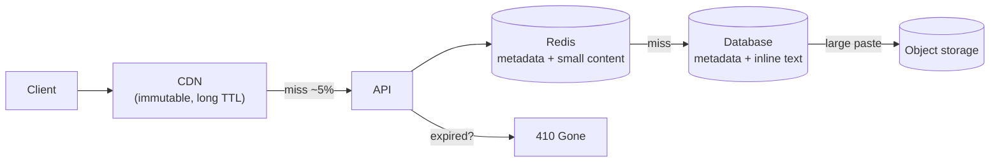

# Design a pastebin

## 1. What this is, and why they ask it

Paste some text, get a link, send the link to somebody. They open it and see the text. Optionally it expires,
optionally it is private, and optionally it is syntax-highlighted.

It looks like [yesterday's URL shortener](../day-146-house-robber/README.md) and it is a different problem in
one specific way: **the thing being stored is large.** A shortened URL is two hundred bytes and lives happily
in a database row. A paste can be a megabyte of log output, and that changes where the content goes, what the
database holds, how the read path works, and what the bill looks like.

They ask it because it is the smallest design where **"where do the bytes actually live"** is the central
question rather than a detail, and because it has a clean, quantifiable answer:
[day 134](../day-134-topological-sort/README.md)'s blob-versus-database argument, applied.

It also has a second interesting property: **the read pattern is extremely skewed and extremely
time-bounded.** Almost every paste is read a handful of times in the hour after it is created and then never
again — except for the one in ten thousand that gets posted somewhere popular and receives a hundred thousand
requests in twenty minutes. **Designing for both of those at once is the actual work.**

By the end of this lesson you can run the script on this prompt, decide where the text lives with arithmetic,
handle expiry without a scan, cope with a viral paste, and say what makes this different from a shortener.

---

## 2. The story

The noticeboard in the lobby of Mr Iyer's building is a green felt rectangle about four feet across, and he
has looked after it since he retired in 2016 because nobody else would.

Anybody can put something on it. Most of what goes up is small and dull — a plumber's number, a lost cat, a
request to stop parking across the gate — and most of it is read by whoever happens to walk past in the two or
three days after it appears, and then by nobody, ever.

His one rule, which he prints at the top and which people mostly follow, is that everything must have a date
on it. **Anything more than a month old comes down**, and he does that walk on the first Sunday of the month
with a bin bag. It takes eleven minutes.

Without the rule the board fills up in about six weeks and then nothing new can go up, which is what it was
like before he took it over.

Two things about the board have surprised him.

**The first is the size.** Somebody put up a four-page society circular in February — the whole thing, printed
out and stuck up with four pins across the middle of the board — and for eleven days there was nowhere to put
anything else. It was not that the circular was unimportant. It was that the board is for short things, and
one long thing on it costs the space of thirty short ones. **He now asks people to put up a note saying where
the long thing can be read, and to leave the long thing somewhere else.**

**The second is the crowd.** In August the water was going to be cut for two days and somebody put up the
notice at seven in the morning. By half past eight there were maybe thirty people in the lobby, at once, all
trying to read the same piece of card, and two arguments, and somebody's child crying.

The notice itself was fine. The board was fine. **What could not cope was the lobby**, which is nine feet wide
and was never designed for thirty people, and the fact that every single one of them had to come to the same
physical spot to read the same forty words.

The management committee's answer, which Mr Iyer thought was obvious and took them three meetings to arrive
at, was to also put a copy on each of the four floors.

---

## 3. The idea in plain English

Mr Iyer's board is a pastebin, and both of his surprises are the design.

**The product is: store a blob of text, give back a link, serve it on request.** Optionally with an expiry, a
visibility setting, and a title.

**Phase 1, requirements.** In scope: create a paste, read a paste by its link, optional expiry, optional
"unlisted" visibility, and a size limit. Out of scope: accounts, editing, comments, folders. Non-functional:

- **Extremely read-heavy**, like a shortener — created once, read a handful of times.
- **But the size is the difference.** A paste is kilobytes to megabytes, not bytes.
- **The read distribution has a long tail and a violent head.** Most pastes get five reads; one in ten
  thousand gets a hundred thousand.
- **Availability over consistency.** A slightly stale paste is fine; an unavailable one breaks a link somebody
  shared.

**Phase 2, scale.** Say a million new pastes a day, averaging 10 KB:

```
1,000,000 / 86,400              = ~12 writes per second
peak x5                         = ~60 writes/s
reads at 10:1                   = ~120 reads/s, ~600 peak
storage 1,000,000 x 10 KB       = 10 GB/day
                                = 3.6 TB/year
```

**And that is the sentence that decides everything: twelve writes a second is nothing, and 3.6 terabytes a
year is not nothing.** Compare with the shortener, which was forty writes a second and 600 GB a year of tiny
rows. **The traffic is smaller here and the storage is six times larger**, and that inverts which part of the
design is hard.

**So the central decision is where the text lives**, and it is [day 134](../day-134-topological-sort/README.md)
applied:

**The database holds the metadata; object storage holds the text.** The row is an id, a key, a size, a
content type, a creation time, an expiry and a visibility flag — about two hundred bytes. The text is an
object in S3 or equivalent.

**Why, in numbers.** Ten kilobytes per paste in the database means 3.6 TB of database, which costs about five
times object storage per gigabyte, goes into every backup — turning a two-minute restore into an hour — and
pollutes the buffer pool so that every metadata query gets slower. In object storage it is 3.6 TB at two cents
a gigabyte and the database stays at 70 GB of rows, which fits in memory.

**That is Mr Iyer's circular: the board is for short things, and the long thing goes somewhere else with a
note saying where.**

**But there is a real threshold, and this is where the pastebin differs from a photo service.** Most pastes are
small. A one-kilobyte paste in object storage costs a round trip of twenty to a hundred milliseconds to fetch
one kilobyte, which is absurd — the metadata query was faster and returned a similar amount of data.

**So the honest design is a threshold**: text under a few kilobytes goes in the database row, and anything
larger goes to object storage with the key in the row. **One extra column and one branch on the read path**,
and it removes a network round trip for the majority of pastes while keeping the storage sane for the large
ones.

**Phase 3, the API.**

```
POST /pastes   {content, expires_in?, visibility?, syntax?}  -> {id, url}
GET  /{id}                                                    -> the paste (HTML or raw)
GET  /{id}/raw                                                -> text/plain
```

**And the id is the same problem as yesterday's short code** — a counter in base 62 with block allocation and
a scrambling step — with one difference. **Unlisted pastes rely on the id being unguessable**, so the
scrambling is not merely tidy here, it is the entire access control. **Which means it should be said plainly
that it is weak access control**, and anything genuinely private needs authentication.

**Phase 4, the shape.**

```
write: client -> API -> (small? row : object storage) -> insert metadata -> return id
read:  client -> CDN -> API -> cache -> (row or object storage) -> render
```

**Phase 5, and there are two things worth going deep on.**

**Expiry**, because doing it naively is a scan. `DELETE FROM pastes WHERE expires_at < now()` over a table
with hundreds of millions of rows, every few minutes, is a large repeated scan and it competes with the read
path.

**The good answers, in order:** **partition the table by expiry date**, so expiring a day is dropping a
partition — instant, no scan, no vacuum. **Or push it to the storage layer**: object storage lifecycle rules
delete objects by age without any job of yours running, and Redis or DynamoDB TTLs do the same. **And filter
on read regardless**, because a paste is logically expired the moment its time passes, whether or not anything
has deleted it yet — so the read path checks `expires_at` and returns 410 Gone, and the deletion is a storage
cleanup rather than a correctness mechanism.

**And the viral paste**, which is Mr Iyer's lobby. One paste in ten thousand gets a hundred thousand requests
in twenty minutes. **That is a hot-key problem, and the answer is a CDN**, because the content is immutable
once written — a paste is never edited — so it is perfectly cacheable with a long TTL and no invalidation
worry.

**Immutability is the property that makes this easy**, and it is worth saying: because a paste never changes,
every layer can cache it indefinitely, and the only reason to invalidate is deletion or expiry.

**Phase 6.** The bottleneck is the read path for hot pastes, solved by the CDN. What is genuinely hard and was
left out: **abuse**, again — a pastebin is used to publish stolen credentials and malware, and every real one
needs scanning, rate limiting and a takedown path.

---

## 4. The picture

Where the bytes go, and why:

```
  PASTE, 10 KB average

  IN THE DATABASE                        SPLIT

  pastes                                 pastes                objects
  +----+---------------------+           +----+--------+       +----------+
  | id | content (10 KB)     |           | id | key    |       | key -> 10 KB |
  +----+---------------------+           +----+--------+       +----------+
  | id | content (900 KB)    |           | id | key    |       | key -> 900 KB|
  +----+---------------------+           +----+--------+       +----------+

  3.6 TB/year in the database            70 GB/year in the database
  -> every backup carries it             -> restore in minutes
  -> buffer pool polluted                -> metadata fits in memory
  -> $0.115/GB                           -> $0.023/GB for the bulk
```

**What to notice.** The right-hand database is fifty times smaller and holds exactly the fields that get
queried. **Nothing queries the content**, so nothing is lost by moving it.

The threshold, which is the refinement:

```
  content size < ~4 KB          -> store INLINE in the row
                                   one database read, no second round trip

  content size >= ~4 KB         -> store in object storage, key in the row
                                   one database read + one object fetch

  a 1 KB paste from object storage:
     DB read for metadata     ~1 ms
     object fetch             ~30 ms          <- to move 1 KB
     -> 30x the latency for no benefit
```

The read path, with both branches:



**What to notice.** The expiry check happens at the API on every read, **before** anything is served, because
a paste is logically gone the moment its time passes — the deletion job is housekeeping, not the mechanism.

Expiry without a scan:

```
  NAIVE                                   PARTITIONED BY EXPIRY DAY

  DELETE FROM pastes                      pastes_2026_03_01
   WHERE expires_at < now()               pastes_2026_03_02
                                          pastes_2026_03_03
  -> scans, writes dead tuples,              ...
     autovacuum has to reclaim them
  -> on a hot table at volume,            expiring a day:
     this alone can be unsustainable        DROP TABLE pastes_2026_03_01
                                          -> instant, no scan, no vacuum

  AND, regardless:  object storage lifecycle rules delete the blobs by age
                    with no job of yours running at all
```

The traffic distribution, which is why a CDN is not optional:

```
  1,000,000 pastes/day

  999,900 of them:   ~5 reads each      = ~5,000,000 reads
      100 of them:   ~1,000 reads each  = ~100,000 reads
        1 of them:   100,000 reads in 20 minutes

  the ONE is 83 requests/second on a single key
  -> the average load says 120 reads/s
  -> the actual load is one key doing most of it, in bursts

  immutable content -> a CDN absorbs it entirely
```

---

## 5. How it actually works

### The schema

```sql
CREATE TABLE pastes (
    id           VARCHAR(10)  PRIMARY KEY,
    content      TEXT,                        -- inline, when small
    object_key   TEXT,                        -- set instead, when large
    size_bytes   INTEGER      NOT NULL,
    syntax       VARCHAR(20),
    visibility   VARCHAR(10)  NOT NULL DEFAULT 'unlisted',
    created_at   TIMESTAMPTZ  NOT NULL DEFAULT now(),
    expires_at   TIMESTAMPTZ,
    is_removed   BOOLEAN      NOT NULL DEFAULT false,
    CHECK ((content IS NULL) != (object_key IS NULL))   -- exactly one of the two
);
```

**The `CHECK` constraint is worth having**, because "exactly one of these two columns is set" is a rule the
application will otherwise break under some code path, and the failure is a paste that renders as blank.

**`is_removed` rather than deleting**, so a takedown returns a clear 410 and the id is never reissued.

### The write path

```python
INLINE_LIMIT = 4096          # bytes

def create_paste(content: str, expires_in=None, syntax=None) -> str:
    data = content.encode()
    if len(data) > MAX_SIZE:                       # 1 MB, say
        raise TooLarge()

    paste_id = code_generator.next_code()          # base-62 counter, scrambled

    if len(data) <= INLINE_LIMIT:
        db.insert(id=paste_id, content=content, size_bytes=len(data), ...)
    else:
        key = f"pastes/{paste_id[:2]}/{paste_id}"
        object_store.put(key, data, content_type="text/plain")
        db.insert(id=paste_id, object_key=key, size_bytes=len(data), ...)

    return paste_id
```

**Note the object key includes a prefix from the id** — `pastes/aK/aK9x2b`. That is a habit worth keeping even
though modern object stores no longer need it for performance: it keeps a listing browsable, and it makes
prefix-based operations possible.

**And the ordering matters, as on [day 133](../day-133-directed-cycles/README.md): the object is written
before the row.** Here that is the right way round, unlike the photo case, because the client is sending the
content in the same request — so an object with no row is an orphan cleaned up by a nightly job, whereas a row
with no object is a paste that renders as an error. **Whichever failure you prefer, pick it deliberately.**

### The read path

```python
def get_paste(paste_id: str):
    meta = cache.get(f"paste:{paste_id}")
    if meta is None:
        meta = db.fetch_one("SELECT * FROM pastes WHERE id = %s", paste_id)
        if meta is None:
            return http_404()
        cache.set(f"paste:{paste_id}", meta, ttl=3600)

    if meta.is_removed:
        return http_410("removed")
    if meta.expires_at and meta.expires_at < now():
        return http_410("expired")                 # logically gone, whether deleted or not

    if meta.content is not None:
        body = meta.content                        # inline: already in hand
    else:
        body = object_store.get(meta.object_key)   # large: one more fetch

    return http_200(body, cache_control="public, max-age=31536000, immutable")
```

**`immutable` in the `Cache-Control` header is the important line.** A paste never changes, so browsers and
CDNs can hold it forever and never revalidate. **That single header is what absorbs a viral paste**, and it is
free.

**But it interacts with deletion**, and that has to be stated: once a CDN has cached a paste for a year, a
takedown requires an explicit invalidation. So `max-age` for public pastes is long, and for anything that
might be removed it is shorter — or every removal issues a CDN purge, which is a real operation with a real
latency.

### Expiry, three mechanisms and you want all three

**One: check on read.** The paste is gone the moment its time passes, regardless of whether anything has
deleted it. **This is the correctness mechanism** and it is one comparison.

**Two: let the storage expire it.** Object storage lifecycle rules delete objects older than `n` days with no
job of yours. Redis and DynamoDB have TTLs. **Free, and nothing of yours runs.**

The complication is that expiry is per-paste and lifecycle rules are per-prefix, so the usual arrangement is
prefixes by retention class:

```
pastes/1day/...     lifecycle: delete after 1 day
pastes/1week/...    lifecycle: delete after 7 days
pastes/forever/...  no rule
```

**Three: partition the database by expiry.** Then expiring a day is `DROP TABLE`, which is instant and
reclaims the space immediately — against a `DELETE` that scans, writes dead tuples and hands the problem to
autovacuum on a hot table.

**A `DELETE FROM ... WHERE expires_at < now()` job is the answer people give and it is the one that does not
scale**, and being able to say why is the point of the question.

### The viral paste

```
one paste, 100,000 requests in 20 minutes = ~83 requests/second on ONE key
```

**Three layers absorb it, and the first does almost all of the work:**

- **The CDN**, because the content is immutable. A 95%+ hit rate is realistic and the origin sees a handful of
  requests.
- **The application cache**, so origin misses do not reach the database.
- **And the database is a primary-key lookup**, which is the cheapest thing it does.

**The one that would not cope is object storage at high request rates for a large paste**, which is why
caching the *content* — not just the metadata — for large hot pastes is worth doing. **A one-megabyte paste
served a hundred thousand times is a hundred gigabytes of egress**, and at nine cents a gigabyte that is nine
dollars for one paste, which is fine once and is not fine if it is a pattern.

### Rendering and syntax highlighting

**Do it once, at write time, not per read.** Highlighting a large file is CPU-heavy, and doing it on every
request turns a cache-friendly static response into a computation.

**Or do it in the browser**, which is what most pastebins actually do — ship the raw text and a small
highlighting library, and the server never renders anything. **That makes the response identical for every
viewer, which makes it perfectly cacheable**, and it moves the CPU to the client. It is the better answer and
it is worth saying why: cacheability, not CPU cost.

### Abuse, which is the requirement people forget

A pastebin is one of the standard tools for publishing stolen credentials, malware and personal data.

- **Rate limit creation** by IP, hard.
- **Scan content on write** for credential patterns — API keys, private keys, database connection strings —
  and either block or flag. Several real services do exactly this and notify the affected provider.
- **A takedown path** and `is_removed` rather than deletion.
- **A size limit**, or it becomes free file hosting.
- **And CAPTCHA or an account requirement above some rate**, because unauthenticated bulk creation is what
  makes it attractive.

**Naming this unprompted is a strong signal**, because it is the difference between designing a feature and
designing a service.

---

## 6. The numbers

**The sizing, in full:**

```
new pastes                1,000,000 / day
                          1,000,000 / 86,400            = ~12 writes/s
peak x5                                                 = ~60 writes/s
reads at 10:1                                           = ~120 reads/s, ~600 peak

average size              10 KB
storage per day           1,000,000 x 10 KB             = 10 GB/day
per year                                                = 3.6 TB/year
after 5 years                                           = 18 TB
```

**Compare with the shortener:**

```
                  shortener            pastebin
writes/s          40                   12
storage/year      600 GB               3,600 GB
row size          500 B                10,000 B
```

**Fewer writes, six times the storage** — which is exactly why the design differs, and it is one line of
comparison worth making explicitly.

**Where the storage decision comes from:**

```
3.6 TB/year in the database
  storage cost      3,600 GB x $0.115/GB      = $414/month, and growing
  backup            3.6 TB nightly            -> hours, not minutes
  restore at 200 MB/s                         = 5 hours
  buffer pool       polluted by 10 KB rows    -> metadata queries slow down

3.6 TB/year in object storage
  storage cost      3,600 GB x $0.023/GB      = $83/month
  database          1,000,000 x 200 B/day     = 200 MB/day = 70 GB/year
  restore of 70 GB at 200 MB/s                = 6 minutes
```

**Five times the storage cost, and a restore that goes from six minutes to five hours** — and the second
number is the one that matters during an incident.

**The inline threshold, justified:**

```
distribution of paste sizes (typical)
  50% under 1 KB
  80% under 4 KB
  99% under 100 KB
   1% up to 1 MB

with a 4 KB inline threshold:
  80% of reads      one database query, ~1 ms
  20% of reads      one query + one object fetch, ~30 ms

with everything in object storage:
  100% of reads     ~30 ms, including 1 KB pastes
```

**The threshold removes a thirty-millisecond round trip for eighty percent of reads** and keeps the database
at:

```
80% x 1,000,000 x ~2 KB average inline   = 1.6 GB/day = 580 GB/year
```

**Which is larger than metadata alone and far smaller than everything**, and that is the trade.

**Expiry, and why the naive version fails:**

```
500,000,000 rows after ~18 months
DELETE FROM pastes WHERE expires_at < now()   run every 5 minutes
  index scan on expires_at                    finds, say, 3,500 rows
  writes 3,500 dead tuples
  autovacuum must reclaim them, on a hot table, continuously

partition by expiry day:
  DROP TABLE pastes_2026_03_01                instant, space reclaimed immediately
```

**The viral paste:**

```
100,000 requests in 20 minutes on one key    = ~83 requests/second
CDN hit rate on immutable content            ~99%
origin sees                                  ~1 request/second

egress if it is a 1 MB paste
  100,000 x 1 MB                             = 100 GB
  at $0.09/GB from origin                    = $9
  through a CDN at ~$0.02/GB                 = $2, and the origin serves ~1 GB
```

**Cache sizing:**

```
hot pastes (last hour, plus the viral few)   ~100,000 entries
average cached size (metadata + small body)  ~3 KB
                                             = 300 MB
```

**Trivial**, which is the point — the working set is small because the access pattern is time-bounded.

**Id space, same arithmetic as the shortener:**

```
62^8 = 218,340,105,584,896        at 1M/day -> ~600,000 years
62^7 =   3,521,614,606,208        at 1M/day -> ~9,600 years
```

**Seven or eight characters**, and eight is common for pastebins precisely because unlisted pastes rely on the
id being hard to guess — **more length is cheap and it raises the cost of enumeration.**

---

## 7. The trade-offs

**Content in object storage against content in the database.** The split keeps the database small, fast to
back up and fast to restore, and cuts storage cost fivefold — at the cost of a second round trip on every
large read, two systems that can disagree, and a reconciliation job to find orphans and broken links. **The
inline threshold buys back most of the latency for most pastes** and adds a branch and a `CHECK` constraint.

**Expiry as a delete job against expiry as a storage policy.** A job is explicit and visible and becomes a
continuous scan on a large hot table. Lifecycle rules and partition drops are free and coarse — per-prefix or
per-day, not per-paste. **The workable answer is both, plus the read-time check that makes the whole thing
correct regardless of when deletion actually happens.**

**A long cache lifetime against removability.** Immutable content with a year-long `max-age` is what makes a
viral paste cost nothing — and it means a takedown needs an explicit CDN purge, and any copy already in a
browser is unreachable. **For a service whose main abuse response is removal, that is a real cost**, and the
usual compromise is a shorter TTL for anything not yet through content scanning.

**Unguessable ids as access control.** "Unlisted" means "the id is hard to guess", which is not
authentication. It is fine for sharing a stack trace with a colleague and it is not fine for anything
sensitive — **and the honest design says so in the interface**, because users will otherwise paste credentials
into it and assume privacy. Real privacy needs accounts and authorisation, which is a much larger product.

**Server-side rendering against client-side.** Rendering syntax highlighting on the server costs CPU per
request and produces responses that vary by options, which hurts cacheability. Doing it in the browser makes
every response byte-identical and therefore perfectly cacheable, and costs the client a library download.
**The cacheability argument is the real one**, not the CPU.

**And the size limit is a product decision with a large blast radius.** Raise it and the service becomes free
file hosting, with the storage bill and the abuse surface that implies. **A megabyte is generous for text and
useless for anything else**, which is exactly why it is the common choice.

**When would I build it differently?** If pastes were editable, immutability goes and with it the aggressive
caching — the whole design becomes more like a document store. If most pastes were tiny, everything inline and
no object storage at all. And if it were internal with a hundred users, one Postgres table and a cron job, and
none of this is worth building.

---

## 8. In the interview

### How it gets asked

- *"Design pastebin."* — the standard prompt.
- *"Where does the text actually go?"* — the central question.
- *"What happens when a paste goes viral?"* — the hot-key question.
- *"How do you expire pastes?"* — where the naive answer is a scan.
- *"How is this different from a URL shortener?"* — the comparison question.
- *"Someone is pasting stolen passwords."* — abuse.

### The first ninety seconds

> "This looks like a URL shortener and differs in one way that changes the design: **the stored thing is
> large.**
>
> **Scope:** create a paste, read it by link, optional expiry, optional unlisted visibility, a size limit.
> Out: accounts, editing, comments. **Non-functional:** read-heavy, availability over consistency, and — the
> one that matters — **paste sizes are kilobytes to megabytes, and the read distribution has a violent head**:
> most pastes get a handful of reads and one in ten thousand gets a hundred thousand in twenty minutes.
>
> **Sizing.** A million pastes a day at 10 KB average is about twelve writes a second — nothing — and ten
> gigabytes a day, 3.6 terabytes a year. **Compare with the shortener: fewer writes and six times the
> storage.** So the traffic is easy and the storage is the problem, which is the opposite of what people
> expect.
>
> **Which makes the central decision: where do the bytes live.** Metadata in the database, content in object
> storage. In numbers: 3.6 terabytes in the database is five times the storage cost, it goes into every backup
> so a restore goes from six minutes to five hours, and 10 KB rows pollute the buffer pool so every metadata
> query slows down. In object storage the database stays at seventy gigabytes a year and fits in memory.
>
> **With one refinement I would raise unprompted:** most pastes are small, and fetching a one-kilobyte paste
> from object storage costs a thirty-millisecond round trip to move one kilobyte. **So content under about four
> kilobytes goes inline in the row.** That covers roughly eighty percent of pastes with a single database read
> and keeps the large ones out of the database entirely — one extra column and one branch.
>
> **And the property that makes the rest easy: a paste is immutable.** It is never edited. So every layer can
> cache it forever with `Cache-Control: immutable`, and a viral paste is absorbed by the CDN with no
> invalidation to worry about.
>
> Shall I go into expiry, or the viral case?"

### The follow-ups

**"How is this different from a URL shortener?"**

> "Three ways, and the first causes the other two.
>
> **The payload is four orders of magnitude larger.** Two hundred bytes against ten kilobytes. That moves the
> content out of the database, introduces a second storage system, and creates the orphan-and-broken-link
> problem that a shortener does not have.
>
> **The read pattern is more extreme.** A shortened link gets a fairly even spread of clicks over its life. A
> paste is read five times in the first hour and then never — except the rare one that is posted somewhere
> popular. **So the working set is small and time-bounded, and the tail is essentially dead**, which makes
> caching unusually effective and makes expiry genuinely valuable rather than cosmetic.
>
> **And expiry is a first-class feature rather than an afterthought.** A shortener's links are usually
> permanent; a pastebin's are usually not, and 'delete a hundred million rows a day without a scan' is a real
> design problem that a shortener never has.
>
> **What is the same:** the id generation — a base-62 counter with block allocation and a scrambling step — the
> read-heavy shape, the cache in front of a primary-key lookup, and the abuse problem. **So I would reuse the
> code-generation design wholesale and say so**, rather than deriving it again."

**"A paste goes viral. What happens?"**

> "It is a hot-key problem, and it is unusually easy here because **the content is immutable.**
>
> **The numbers:** a hundred thousand requests in twenty minutes is about eighty-three requests a second on one
> key. That is not a lot in absolute terms, but it is all on a single row and a single object, so nothing
> spreads it.
>
> **The CDN absorbs essentially all of it.** Because the paste never changes, I serve
> `Cache-Control: public, max-age=31536000, immutable`, and every edge caches it for a year. At a
> ninety-nine percent hit rate the origin sees about one request a second.
>
> **Below that, the application cache** holds the metadata and, for large hot pastes, the content too — because
> otherwise every origin miss is an object-storage fetch, and object storage is the layer that would actually
> struggle at high request rates.
>
> **And the number worth quoting is the egress.** A one-megabyte paste served a hundred thousand times is a
> hundred gigabytes. At nine cents a gigabyte from origin that is nine dollars for one paste — fine once, and
> not fine as a pattern. Through a CDN the origin serves about a gigabyte of it.
>
> **The cost of the aggressive caching** is that removal needs an explicit purge, and anything already in a
> browser cannot be recalled. **For a service whose abuse response is takedown, that is a real trade**, and I
> would shorten the TTL for pastes that have not yet been through content scanning."

**"How do you expire pastes without a nightly scan of a hundred million rows?"**

> "Three mechanisms, and the naive one is the one to reject first.
>
> **The naive version** is `DELETE FROM pastes WHERE expires_at < now()` on a schedule. On a table with
> hundreds of millions of rows that scans an index, writes dead tuples, and hands the reclamation to autovacuum
> on a table that is also serving reads. **At volume it competes with the read path continuously.**
>
> **First, and most importantly: check expiry on read.** A paste is logically gone the moment its time passes,
> whether or not anything has deleted it. One comparison, and the 410 is returned. **This makes correctness
> independent of when deletion happens**, which is what lets the deletion be lazy and coarse.
>
> **Second: partition the database table by expiry day.** Then expiring a day is `DROP TABLE`, which is instant
> and reclaims the space immediately, with no scan and no vacuum.
>
> **Third: let object storage do the blobs.** Lifecycle rules delete objects by age with no job of mine
> running. The complication is that lifecycle rules are per-prefix and expiry is per-paste, so the arrangement
> is prefixes by retention class — `pastes/1day/`, `pastes/1week/`, `pastes/forever/` — and a paste goes into
> the prefix matching its requested lifetime.
>
> **The result is that nothing of mine scans anything**, and the only code involved is one comparison on the
> read path."

**"Someone is pasting stolen credentials."**

> "That is what pastebins are actually used for at scale, and a design that does not mention it is incomplete.
>
> **Scan on write.** Regular expressions for the obvious credential shapes — AWS keys, private key headers,
> database connection strings, bearer tokens. On a match, either block the paste or flag it for review, and
> several real services go further and **notify the provider whose keys were leaked**, which is a genuinely
> good use of the position.
>
> **Rate limit creation** by IP, hard, and require a CAPTCHA or an account above a low threshold. Unauthenticated
> bulk creation is what makes it attractive as a dumping ground.
>
> **A size limit**, or it becomes free file hosting with a completely different abuse profile.
>
> **A takedown path with `is_removed` rather than deletion**, so the id is never reissued and the response is a
> clear 410 rather than a 404 that looks like a bug.
>
> **And the caching interaction, which is the technically interesting part:** aggressive immutable caching is
> what makes the viral case cheap, and it directly fights takedown. So I would use a **shorter TTL until a
> paste has passed content scanning**, and a longer one afterwards — which costs a little cache efficiency on
> brand-new pastes and preserves the ability to remove something quickly.
>
> **And I would be explicit in the product that 'unlisted' is not private.** It means the id is hard to guess.
> Users will paste credentials into it believing otherwise, and saying so plainly in the interface is part of
> the design."

### The model answer

*"Design pastebin. What happens when a paste goes viral?"* — the deep dive, phase 5.

> "Let me take the viral case properly, because it is where the design's central property pays off.
>
> **The situation:** one paste, a hundred thousand requests in twenty minutes, so about eighty-three a second
> concentrated on a single id. Everything else on the system is unaffected — twelve writes a second and a
> hundred and twenty reads a second spread across a million ids — so this is purely a hot-key problem.
>
> **The property that makes it easy is immutability.** A paste is written once and never edited. That means
> every caching layer can hold it indefinitely without any invalidation logic, which is a luxury most systems
> do not have.
>
> **Layer one: the CDN.** `Cache-Control: public, max-age=31536000, immutable`. Every edge holds it, and
> because the requests come from many places, many edges each fetch it once. At a ninety-nine percent hit rate
> the origin sees about one request a second — the problem is gone before it reaches my infrastructure.
>
> **Layer two: the application cache**, for the origin misses. For a small paste I cache the whole thing —
> metadata and content together — so a hit is one Redis read. **For a large paste I would cache the content
> too, and that is the decision worth explaining**: without it, every origin miss is an object-storage fetch,
> and object storage is the layer least suited to a high request rate on one key. A megabyte in Redis for a
> paste doing a hundred requests a second is an obviously good trade for the duration of the burst.
>
> **Layer three: the database**, which is a primary-key lookup on a row that is certainly in its buffer pool by
> the third request. It was never going to be the problem.
>
> **The cost, and I would put a number on it.** If it is a one-megabyte paste, a hundred thousand reads is a
> hundred gigabytes of transfer. From origin at nine cents a gigabyte that is nine dollars for one paste;
> through a CDN the origin serves about a gigabyte and the CDN carries the rest at a lower rate. **Nine dollars
> is fine once and is a business problem if it is a daily occurrence**, which is an argument for a size limit
> and for rate limiting reads per id if it ever becomes one.
>
> **What I would monitor:** requests per id, so a spike is visible; CDN hit rate, because a drop means
> something is defeating caching — usually a query parameter varying, or a `Vary` header I did not intend; and
> origin egress.
>
> **And the failure mode I would name:** if the paste is removed while it is viral, the CDN is holding it for a
> year and a purge across every edge takes minutes. **So the removal path must issue the purge, and I would
> keep the TTL shorter for pastes that have not yet been scanned** — accepting a slightly worse hit rate in the
> first minutes of a paste's life in exchange for being able to take it down quickly. That is the one place
> where the aggressive caching and the abuse response genuinely conflict, and I would rather resolve it
> deliberately than discover it during an incident."

---

## 9. Recall card

**Same shape as a shortener, one difference: the payload is 10 KB, not 200 bytes.** Fewer writes (~12/s) and
**six times the storage** (3.6 TB/year) — so the storage decision is the design, not the traffic.

**Metadata in the database, content in object storage** — 5× cheaper per GB, and a restore of 6 minutes
instead of 5 hours. **With an inline threshold at ~4 KB**, because fetching a 1 KB paste from object storage
is a 30 ms round trip to move 1 KB, and it covers ~80% of pastes with one database read.

**A paste is immutable**, so `Cache-Control: immutable` with a long `max-age` — and that single header absorbs
a viral paste (100,000 reads in 20 minutes ≈ 83 req/s on one key) at a ~99% CDN hit rate.

**Expiry: check on read** (that is the correctness mechanism), **partition by expiry day** so removal is a
`DROP TABLE`, and **let object-storage lifecycle rules delete the blobs** via retention-class prefixes. A
`DELETE ... WHERE expires_at < now()` job is the answer that does not scale.

**"Unlisted" means the id is hard to guess, not private** — say so in the product. And abuse is the forgotten
requirement: **scan for credentials on write**, rate-limit creation, cap the size, and `is_removed` rather than
delete — which conflicts with long cache TTLs, so shorten them until a paste is scanned.
