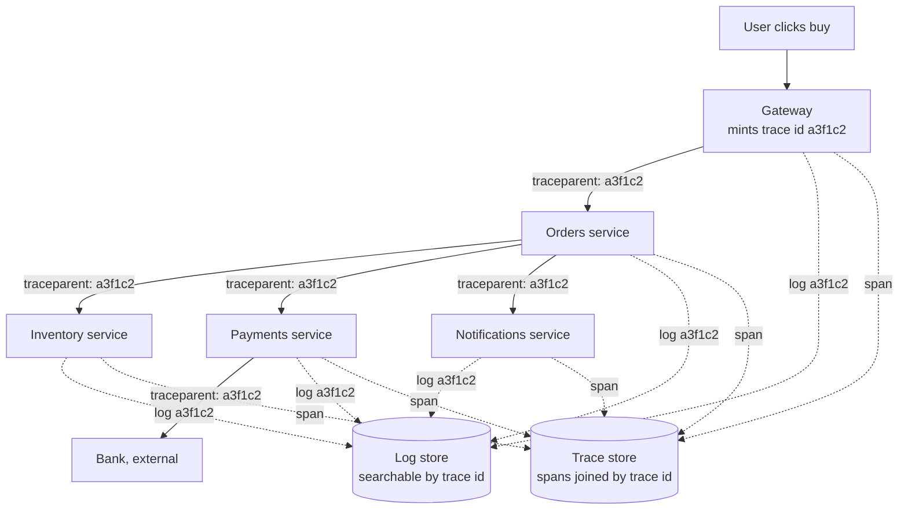

# Logging and distributed tracing

## 1. What this is, and why they ask it

**A log line is one sentence about one thing that happened.** **A trace is the story of one request across
every service it touched.** Logs tell you what went wrong; traces tell you where.

[Yesterday](../day-171-binary-and-bits/02-system-design-monitoring-metrics-and-alerting.md) you learnt that
metrics detect a problem and cannot explain it. **Today is the other two pillars, and the single field that
makes them useful: an identifier carried along with the request from the first service to the last.**

They ask it because **the modern version of "the site is slow" has no obvious owner.** A page load touches
eight services. Each one looks healthy. Each one's own numbers are fine. **Somebody has to be able to say
which of the eight ate the four seconds**, and if nobody wired that up in advance, nobody can.

**And because it separates people who have run something from people who have only designed something.** The
candidate who says "I would add logging" has said nothing. **The candidate who says "every log line carries
the trace id, we sample traces at one percent but keep every trace that errored, and we never log the
authorisation header" has clearly debugged a production incident at two in the morning.**

By the end of this lesson you can explain what a span is, describe how the identifier gets from one service to
the next, size a logging bill and be shocked by it, choose a sampling strategy and say what it costs you, and
name the fields that must never appear in a log line.

---

## 2. The story

The trunk was steel, painted green, and it had gone from Chennai on the ninth of June and had not arrived.

Savitri's son was starting at the college in Guwahati and everything he owned for the next three years was
inside it — bedding, a stove, the good plates, a cricket bat that had been his uncle's. She had sent it by
train because everyone said the train was safe, and it was, and it was also gone.

She went to the office at the station on the fourth of July, which was the third time. The same man was
behind the counter. He was not unkind. He simply had nothing to tell her, because the trunk was not in
Guwahati and that was all his book said.

**Then a different clerk came on at four o'clock and asked for the paper.**

Savitri had kept it in a plastic folder, folded twice — the long thin receipt they had given her in Chennai,
with the number printed at the top in fat black type.

**The new man turned it over.**

On the back there were marks. Savitri had never looked at the back of it. There were four rubber stamps, in
different inks, each one with a place and a date, and a fifth mark in pencil.

He read them out to her as though he were reading a bus timetable.

**"Chennai, ninth. Vijayawada, eleventh. Kharagpur, fourteenth."**

Then he stopped.

**"And nothing after Kharagpur."**

He said it three weeks earlier than anybody had said anything, and he said it in about eleven seconds, and he
had not made a single telephone call.

Savitri asked how he knew.

**"Every place it passes through puts its own mark on the back with the same number on the front. So I do not
have to ask four stations where your box is. I only have to find the last station that admits it had it."**

He wrote the number on a slip and handed it to a boy.

**"It is at Kharagpur. It has been at Kharagpur for twenty days. Somebody there put it against the wrong
wall, and until now nobody had all four marks in one hand at the same time."**

---

## 3. The idea in plain English

**The number printed on the front of Savitri's receipt is the whole lesson.** Every place the trunk passed
through wrote its own mark, **and every mark carried the same number.** Nobody had to search. They only had to
put the marks in one place and read them in order.

### Logs, first

**A log line is one record of one event, written by one service, at one moment.** "Order 8812 accepted."
"Payment declined, code 51." "Took 340 milliseconds."

**A log is written for a human who is not there yet.** That single fact decides everything about how you write
one.

**Levels** say how loud a line is:

```
   DEBUG   only useful when you are already inside the problem
   INFO    the normal life of the system: this happened, that finished
   WARN    something odd that did not stop anything
   ERROR   this request failed
   FATAL   the process is going down
```

**In production you keep INFO and above, and turn DEBUG on for one service when you need it.** Leaving DEBUG
on everywhere is the fastest way to make the whole system expensive and unsearchable at the same time.

### Structured logging, which is the one habit that matters

**A log line should be a set of named fields, not an English sentence.**

```
   BAD    "Order 8812 for user 4471 failed after 340ms: card declined"

   GOOD   {"event": "order_failed", "order_id": 8812, "user_id": 4471,
           "duration_ms": 340, "reason": "card_declined",
           "trace_id": "a3f1c2", "service": "payments", "level": "error"}
```

**The bad one is readable by a person and useless to a machine.** To count how many orders failed for card
declines you would have to pull the sentence apart with pattern matching, and the pattern breaks the moment
somebody rewords the message.

**The good one you can filter, count and group.** And critically, **you can ask "show me every line with this
trace id"** — which is the entire point of the next section.

### The problem: one request, many services

**A single page load in a real product touches five to ten services.** Each of them logs. **Each of their logs
is a separate pile.**

```
   user clicks "buy"
     -> gateway        logs: "request in"
     -> orders         logs: "order created"
     -> inventory      logs: "stock reserved"
     -> payments       logs: "charge sent"
     -> payments       logs: "charge took 3.9 seconds"
     -> notifications  logs: "email queued"

   Six lines, in five different places, written by five
   different machines, with five different clocks.

   NOTHING connects them.
```

**And that is Savitri's problem exactly.** Four stations, four books, and no way to ask one question that
touches all four.

### The fix: one identifier, carried

**When a request first enters the system, the front door generates a random identifier — the trace id — and
attaches it to the request.** Every service that handles that request **puts the trace id on every log line it
writes**, and **passes it on** to every service it calls.

**That is the rubber stamp with the same number on the front.**

**Passing it on means putting it in the request header.** The standard is **W3C Trace Context**, and the header
is called `traceparent`:

```
   traceparent: 00-a3f1c2d4e5f60718293a4b5c6d7e8f90-b7ad6b7169203331-01
                ^^ ^------------ trace id ---------^ ^--- span id ---^ ^^
                |                                                      |
             version                                              flags (sampled?)
```

**Every service reads that header, logs the trace id, and sends a new one downstream with its own span id.**

### Spans, and what a trace really is

**A span is one unit of work with a start time and an end time.** "The payments service handled this call."
"This query ran." **A span has a name, a duration, a span id, and the span id of its parent.**

**A trace is all the spans that share a trace id, arranged by their parent links into a tree.**

```
   TRACE a3f1c2                                    total 4,010 ms

   gateway.handle                     0 ----------------------- 4010
     orders.create                      20 ------------------- 3990
       inventory.reserve                  30 --- 95
       payments.charge                        100 ----------- 3960
         bank.authorise                         120 -------- 3890
       notifications.queue                                  3965 - 3985
```

**Read that and you have your answer in one second.** The four seconds is not in the gateway, not in orders,
not in inventory. **It is `bank.authorise`, and everything above it is just waiting.**

**That picture is the reason tracing exists.** No amount of staring at five separate piles of log lines gets
you there as fast.

### Sampling, because you cannot keep all of it

**Keeping a full trace of every request is unaffordable, and section 6 does the arithmetic.** So you keep some
fraction.

**Head sampling** decides at the front door — "keep one request in a hundred" — and puts that decision in the
`traceparent` flags so every downstream service agrees. **It is cheap and simple, and its flaw is obvious: the
one request you want to look at is almost certainly one of the ninety-nine you threw away.**

**Tail sampling** buffers all the spans of a trace until the request finishes, then decides: **keep it if it
errored, keep it if it was slow, otherwise keep one in a hundred.** **You get exactly the traces you want, and
you pay for it by holding every in-flight trace in memory somewhere.**

**The practical answer, and the one to say in an interview: head-sample the boring traffic at one percent, and
always keep errors and anything over the p99.**

### What must never be in a log line

**Logs get copied, shipped, and kept for months, and far more people can read them than can read the
production data itself.** So:

```
   NEVER LOG
     passwords, even hashed
     authorisation headers, bearer tokens, session cookies
     full card numbers, CVVs
     one-time passwords
     full addresses, phone numbers, identity numbers

   LOG INSTEAD
     user_id (an internal number)
     card_last4
     "auth: present" rather than the header
```

**This is not a compliance box to tick.** **The most common way a real secret escapes is that somebody logged
the whole request object once, during a bug hunt, and never took it out.**

---

## 4. The picture

One request, one identifier, five services:



**Notice that the trace id is minted once, at the front door, and never regenerated.** Every solid arrow
carries it forward in a header; every dotted arrow writes it into a store. **One search on `a3f1c2` returns
every line and every span from the whole journey** — which is the clerk turning the receipt over.

The waterfall, which is what you actually look at:

```
   TRACE a3f1c2          total 4,010 ms
   time (ms)  0     500   1000  1500  2000  2500  3000  3500  4000
              |     |     |     |     |     |     |     |     |

   gateway.handle
   [==========================================================]  4010

     orders.create
     [========================================================]   3970

       inventory.reserve
       [=]                                                          65

       payments.charge
        [======================================================]   3860

         bank.authorise
          [===================================================]    3770

       notifications.queue
                                                             [=]    20

   READ IT TOP DOWN AND ASK WHERE THE WIDTH IS.
   Everything above bank.authorise is a bar that is wide only
   because it is WAITING for the bar below it.

   The answer is: the bank took 3.77 seconds.
   Nothing you own is slow.
```

**That last line is the most valuable output of a tracing system**, and it is the one metrics can never give
you: **the service that looks slowest on a dashboard is usually the one waiting for the real culprit.**

---

## 5. How it actually works

### Getting the identifier from one service to the next

**There are two halves, and both are libraries you do not write yourself.**

**Propagation** is reading `traceparent` from the incoming request and putting it on every outgoing one. **The
standard is W3C Trace Context**, and the reason a standard matters is that your services are not all in the
same language. **A Python service and a Java service and a Go service all read the same header.**

**Context storage** is the awkward half. Between reading the header and making the outgoing call, **the trace
id has to travel through your own code** — through function calls that know nothing about tracing.

```
   Python:   contextvars       (works across async/await)
   Java:     ThreadLocal + the OpenTelemetry Context
   Go:       context.Context, passed explicitly as the first argument
   Node:     AsyncLocalStorage
```

**This is where propagation actually breaks in practice.** The moment work hops onto a background worker, a
message queue, or a pool, **the context is gone unless somebody carried it across deliberately.** A trace that
stops halfway is almost always this.

### What emits the data

**OpenTelemetry is the answer to give.** It is the vendor-neutral standard — one set of libraries that
produces logs, metrics and traces, and one agent (**the OpenTelemetry Collector**) that receives them and
forwards them wherever you like.

**The reason it matters commercially is lock-in.** Instrumenting your code with a vendor's own agent means
re-instrumenting everything when you change vendor. **Instrumenting with OpenTelemetry means changing one
line of collector configuration.**

**And most of the instrumentation is automatic.** Auto-instrumentation wraps the common libraries — the HTTP
client, the web framework, the database driver — so **a service gets useful spans without anyone editing
business code.** Hand-written spans are for the parts that are specific to you.

### Where it all goes

```
   LOGS
     Elasticsearch + Kibana ("ELK")   search anything, expensive to run
     Grafana Loki                     indexes only labels, stores the rest
                                      compressed. Much cheaper, less flexible
     Splunk                           the enterprise default, famously costly
     Managed: Datadog Logs, CloudWatch Logs

   TRACES
     Jaeger          the open-source default, from Uber
     Zipkin          the original, from Twitter
     Grafana Tempo   cheap: object storage, search by trace id only
     Managed: Datadog APM, Honeycomb, AWS X-Ray, Google Cloud Trace

   SHIPPING
     Fluent Bit / Fluentd / Vector    read log files, forward them
     OpenTelemetry Collector         receive, sample, batch, forward
```

**The design choice worth knowing is Loki's and Tempo's.** Elasticsearch indexes every word of every log line,
which is why you can search for anything and why it costs so much. **Loki indexes only a handful of labels —
service, level, environment — and keeps the message body compressed and unsearched.** You give up free-text
search over everything and you get an order of magnitude off the bill.

### How a log line gets out of the process

**Write to standard output, and let something else deal with it.** That is the modern answer and it is worth
knowing why.

```
   the process writes JSON lines to stdout
     -> the container runtime captures them to a file
       -> a shipper (Fluent Bit) tails that file
         -> forwards, batched, to the store
```

**The service should never make a network call to write a log line.** If it does, then a slow log store makes
your product slow, **and an unreachable log store makes your product unavailable** — which is a genuinely
famous class of outage.

**Writing is also asynchronous inside the process**: the application appends to a small in-memory buffer and a
background writer flushes it. **The cost of that is real and you should name it — if the process crashes hard,
the last few lines in the buffer are gone**, and those are exactly the lines about the crash.

### What happens when the logging system fails

**The rule from yesterday applies here too: the monitoring stack must be able to fail without taking the
product with it.**

```
   log store unreachable    -> shipper buffers to local disk, then drops
                               the OLDEST. The product keeps serving.

   local disk full          -> this one HAS taken sites down. Log files
                               that nobody rotates fill the disk, and then
                               every write in the whole process fails.
                               Rotation and a size cap are not optional.

   trace store unreachable  -> spans are dropped. Nothing user-facing
                               notices. This is the correct behaviour.
```

---

## 6. The numbers

**Take the same system as yesterday: 100 million requests a day.**

```
   100,000,000 requests / 86,400 seconds = 1,157 requests/second average
   peak is roughly 3x the average       = ~3,500 requests/second
```

**Logs, and this is the number that shocks people.**

```
   services touched per request                    8
   log lines each service writes per request       3
   -----------------------------------------------
   log lines per request                          24

   24 x 100,000,000 = 2,400,000,000 lines/day

   a structured JSON line, with a trace id,
   timestamps and a dozen fields              ~ 300 bytes

   2.4e9 x 300 bytes = 720,000,000,000 bytes
                     = 720 GB PER DAY, raw
```

**Compare that with yesterday's metrics: about 9 GB a day. Logs are eighty times the volume.**

```
   compressed, roughly 10:1                     72 GB/day
   kept for 30 days                          2,160 GB = 2.16 TB
```

**Now price it, because this is the part candidates never do.**

```
   MANAGED (typical list price, ~$0.50 per GB ingested):
     720 GB/day x $0.50            = $360/day
                                   = $10,800/month
                                   = $129,600/year

   SELF-HOSTED on object storage:
     72 GB/day compressed x 30 days = 2.16 TB
     2.16 TB x $0.023/GB-month      = ~$50/month for the storage
     plus the search cluster:        3 machines x $300 = ~$900/month

   -> The managed logging bill can genuinely exceed the bill for
      the servers running the product. This is not a joke and it is
      the reason sampling and level discipline exist.
```

**Traces.**

```
   spans per request (8 services, some with 2 spans)   ~12
   bytes per span (name, ids, timings, a few tags)     ~500 bytes

   UNSAMPLED:
     12 x 100,000,000 = 1,200,000,000 spans/day
     1.2e9 x 500 bytes = 600,000,000,000 = 600 GB/day

   HEAD-SAMPLED AT 1%:
     600 GB x 0.01 = 6 GB/day          -> affordable

   PLUS every errored trace (say 0.5% of requests):
     600 GB x 0.005 = 3 GB/day

   -> ~9 GB/day, and you keep the traces you actually want.
```

**The three pillars, side by side, at this scale:**

```
   METRICS      9 GB/day       detect
   TRACES       9 GB/day       localise    (1% + all errors)
   LOGS       720 GB/day       diagnose

   -> Logs are 40x the other two COMBINED.
   -> Which is why the first cost lever anyone pulls is log level,
      and the second is retention.
```

**Retention, priced.**

```
   30 days of hot, searchable logs      2.16 TB    ~$900/month cluster
    7 days hot + 90 days in cold storage
      hot:  7 x 72 GB = 504 GB          smaller cluster, ~$300/month
      cold: 90 x 72 GB = 6.5 TB in S3 Glacier at $0.004/GB
                                        = ~$26/month

   -> Three-quarters off, and the cost is that a 60-day-old
      investigation takes hours instead of seconds.
```

**One more, on cardinality — the same trap as yesterday, wearing different clothes.**

```
   A trace id is a HIGH-CARDINALITY VALUE: every request has
   a different one. 100 million distinct values a day.

   In a LOG store that is fine - it is a field in the document,
   and Elasticsearch or Loki look it up.

   In a METRICS store it is fatal - it would create 100 million
   time series a day.

   -> Trace ids go in logs and spans. NEVER in a metric label.
      This is the single most useful sentence connecting the two days.
```

---

## 7. The trade-offs

**Sampling: you save ninety-nine percent of the cost and you lose the exact trace somebody asks about.**

**Head sampling** is decided at the front door and is cheap, stateless, and consistent across services. **It
throws away the interesting requests at the same rate as the boring ones**, so when a customer rings up with a
request id, the trace is usually gone.

**Tail sampling** keeps what matters, and to do it the collector must hold **every span of every in-flight
trace** until the request completes — typically thirty seconds of buffer. **At 3,500 requests a second with
twelve spans of 500 bytes each, that is 3,500 × 12 × 500 × 30 ≈ 630 MB of memory held constantly**, and the
collector becomes a stateful thing that can itself fall over.

**I would not use tail sampling if** the collector fleet has to be simple and stateless, or the traffic is so
spiky that the buffer would need to be sized for a peak you cannot predict. **I would use it if** the product
has paying customers who report specific failed requests, because head sampling makes those unanswerable.

**Log levels: DEBUG everywhere is a 5-10x bill and an unsearchable haystack.**

**Turning DEBUG on globally is the most common self-inflicted cost incident there is.** The right shape is
**INFO by default, with the ability to raise one service to DEBUG at runtime, for a while, without a
redeploy.** That last clause is worth saying — a debug switch that needs a deployment is a debug switch nobody
uses during an incident.

**Structured logging: machine-readable costs you human-readable.**

**A wall of JSON is genuinely harder to read with your eyes than a wall of sentences.** The trade is worth it
because you almost never read logs with your eyes any more — you filter them. **But keep a human-formatted
output for local development**, or every engineer will quietly hate the system.

**Free-text search costs an order of magnitude.**

**Elasticsearch lets you search for any word in any line, and you pay for a full index of every log line ever
shipped.** Loki indexes a few labels and greps the rest at query time. **I would use Elasticsearch if
investigations routinely start from an unknown string — an error message somebody pasted into chat. I would
use Loki if investigations almost always start from a service, a time window, and a trace id**, which in a
well-instrumented system they do.

**Synchronous versus asynchronous writing.**

**Synchronous is honest — the line is on disk before the function returns — and it puts disk latency on the
request path.** Asynchronous is fast and **loses the buffered lines if the process dies**, which is precisely
when you wanted them. **The usual compromise: asynchronous for INFO, synchronous flush for ERROR and FATAL.**

**And the honest limitation of the whole approach: tracing tells you where the time went, not why.**

**The waterfall says `bank.authorise` took 3.77 seconds.** It does not say whether the bank was slow, the
connection pool was empty, or a retry happened twice with a backoff between them. **You still need the logs
inside that span**, which is why the trace id on every log line is the thing that makes both useful. **Neither
pillar is sufficient. That is why there are three.**

---

## 8. In the interview

### How it gets asked

- *"A request took four seconds. How do you find out which service was slow?"* — the direct form.
- *"How would you debug an issue that only affects one user?"* — trace id, and how the user gives it to you.
- *"What would you log?"* — they are listening for structure and for what you refuse to log.
- *"How do you connect logs across microservices?"* — correlation id, propagated in a header.
- *"Your logging bill is a hundred thousand a year. Cut it."* — sampling, levels, retention tiers.

### The first ninety seconds

On "a request took four seconds, find the slow service":

> "**I would look at the trace, and the reason I can is that the design has one identifier per request that
> every service carries.**
>
> **Concretely: the gateway mints a random trace id when the request first arrives.** It puts it in the
> `traceparent` header on every downstream call, **and every service does the same** — reads it, logs it on
> every line it writes, passes it on. **That is the W3C Trace Context standard, so it works across languages.**
>
> **Each service also emits a span: a piece of work with a name, a start, an end, its own id, and its parent's
> id.** All the spans with the same trace id form a tree, **and drawn as a waterfall that tree tells you where
> the four seconds went in about one second of looking.**
>
> **The thing to read for is which bar is wide because it is working, and which is wide because it is
> waiting.** In a typical case the gateway span is 4,000 milliseconds and so is the orders span and so is the
> payments span — **they are all just waiting on `bank.authorise`, which is 3,770.** So the answer is the
> external bank call, and nothing I own is slow.
>
> **Then I switch to logs to find out why**, filtered by that same trace id. **That is what makes the two work
> together: the trace localises, the logs explain.**
>
> **I would mention sampling, because at any real volume I am not keeping every trace.** Full traces of 100
> million requests a day is about 600 GB a day. **So: one percent head sampling for normal traffic, and keep
> every trace that errored or breached the p99.** That way the four-second request is one I still have."

### The follow-ups

**"What exactly do you put in a log line, and what do you refuse to put in?"**

> "**Structured, not prose.** A JSON object of named fields — `event`, `service`, `level`, `trace_id`,
> `user_id`, `duration_ms`, and whatever is specific to that event. **Not `'Order 8812 failed after 340ms'`**,
> because to count those I would have to pull the sentence apart with pattern matching, **and the pattern
> breaks the day somebody rewords the message.**
>
> **The mandatory fields are timestamp, level, service, and trace id.** The trace id is the one that turns
> five separate piles into one story.
>
> **What I refuse to log: anything that is a secret or identifies a person more than I need.** Passwords —
> including hashed ones. Authorisation headers, bearer tokens, session cookies. Full card numbers. One-time
> codes. Full addresses and phone numbers. **I log `user_id` and `card_last4` and `'auth: present'`.**
>
> **The reason is not compliance, it is blast radius.** **Logs are copied, shipped and kept for months, and
> far more people can read them than can read the production data.** **And the realistic way a token leaks is
> not a decision — it is somebody logging the whole request object during a bug hunt and never taking it out.**
> So I would want redaction in the logging library itself, by field name, **so that it is the default rather
> than a thing every engineer has to remember.**
>
> **One more: levels.** INFO and above in production, **with a runtime switch to raise a single service to
> DEBUG without a redeploy.** DEBUG everywhere is a five- to tenfold bill and an unsearchable haystack, and a
> debug switch that needs a deployment is one nobody uses during an incident."

**"How does the trace id actually get from one service to the next, and where does that break?"**

> "**Two halves. Between services it is a header — `traceparent`. Inside a service it is a context object.**
>
> **The incoming middleware reads the header and puts the trace id into a context store: `contextvars` in
> Python, the OpenTelemetry `Context` on a `ThreadLocal` in Java, an explicit `context.Context` in Go,
> `AsyncLocalStorage` in Node.** The outgoing client reads it back out and sets the header. **Both ends are
> library code — nobody writes this by hand, and auto-instrumentation wraps the common HTTP clients and
> database drivers so most services get spans without touching business code.**
>
> **Where it breaks, in practice, is every hop that is not a direct call.**
>
> **A message queue.** The trace id has to be put into the message's own metadata by the producer and read
> back out by the consumer. **If nobody did that, the trace stops at the queue** and the consumer's work looks
> like an unrelated orphan trace.
>
> **A thread pool or a background job.** The context lives on the request's thread or task; hand the work to a
> pool and it is gone.
>
> **A third party.** You cannot make the bank propagate your header, **so the trace ends at your side of that
> call** — which is fine, because your span still measures how long they took.
>
> **The symptom is always the same and it is worth recognising: a trace that just stops halfway.** That is
> almost never a broken tracing system. **It is a hop where nobody carried the context across.**"

**"Your logging bill is a hundred and thirty thousand a year. Cut it in half, and tell me what it costs you."**

> "**Four levers, and I would pull them in this order, because they get progressively more painful.**
>
> **First, levels.** Confirm nothing is running at DEBUG in production. **That alone is often five to ten
> times the volume of a single service.** Cost: nothing, if the runtime switch exists.
>
> **Second, retention tiering.** Instead of thirty days of hot searchable storage, keep **seven days hot and
> ninety days in object storage.** At 72 GB a day compressed, that is 504 GB in the hot cluster instead of
> 2.16 TB, **and 6.5 TB in Glacier at four-tenths of a cent per gigabyte, which is about twenty-six dollars a
> month.** **Cost: an investigation into something sixty days old takes hours instead of seconds.** For most
> products that is the right trade.
>
> **Third, sampling the successful requests.** **Keep every log line for anything that errored, and one in ten
> for requests that succeeded normally.** Successful INFO lines are the bulk of the volume and the least
> useful. **Cost: you can no longer reconstruct an arbitrary successful request** — which matters if support
> needs to prove what happened for a specific customer, so I would confirm that before doing it.
>
> **Fourth, move off per-gigabyte-ingested pricing.** At 720 GB a day, a store that indexes only labels — Loki
> or Tempo on object storage — is roughly an order of magnitude cheaper. **Cost: no free-text search over the
> message body.** **I would only do this if investigations normally start from a service, a time window and a
> trace id, rather than from an error string somebody pasted into chat.**
>
> **The first two are free wins and I would do them today. The last two are real trades and I would want the
> support team in the room.**"

### The model answer

*"Design the observability for the system you have just drawn."*

> "**Three pillars, and it is a sequence, not a menu: metrics to detect, traces to localise, logs to
> diagnose.**
>
> **Metrics are cheap and aggregated, so they can cover everything and page somebody.** The four golden
> signals per service — latency split by success and failure, traffic, errors as a fraction, saturation — with
> percentiles rather than averages. **About 9 GB a day at this scale.**
>
> **Traces are the middle layer and the one people forget.** The gateway mints a trace id per request, every
> service propagates it in `traceparent` and emits spans with parent links, **and the waterfall shows where the
> time went across all eight services in one picture.** **Unsampled that is 600 GB a day, so: one percent head
> sampling, plus every trace that errored or breached the p99. That brings it to about 9 GB a day** and keeps
> the traces anyone will actually ask about.
>
> **Logs are the expensive layer, so they are the last resort rather than the first.** Structured JSON, INFO
> and above, **every line carrying the trace id.** At eight services, three lines each, 300 bytes a line and
> 100 million requests, **that is 720 GB a day — eighty times the metrics volume**, and on managed per-gigabyte
> pricing it is over a hundred thousand a year. **So seven days hot, ninety days cold, and a runtime DEBUG
> switch per service rather than DEBUG everywhere.**
>
> **The one field that makes all three work together is the trace id.** **It goes on every span and every log
> line — and never on a metric label, because it is unbounded and would create a hundred million time series a
> day.**
>
> **For emitting it I would use OpenTelemetry**, because it is vendor-neutral: one instrumentation, and the
> collector decides where the data goes. **Changing observability vendor becomes a configuration change rather
> than re-instrumenting fifty services.**
>
> **Two operational points I would not leave out.** **Services write logs to standard output and a shipper
> forwards them** — never a network call on the request path, **or a slow log store makes the product slow and
> an unreachable one makes it unavailable.** **And the whole stack lives in a separate failure domain from the
> product**, or the outage takes away the thing you were going to use to investigate the outage.
>
> **The workflow this buys is the one I would describe last, because it is the point of all of it.** The alert
> fires on a symptom from a metric. **The trace tells you which of eight services owns the time.** **The logs
> for that trace id tell you why.** **Three steps, minutes rather than hours, and none of it is possible unless
> somebody put the identifier in before the incident.**"

---

## 9. Recall card

**One identifier, minted at the front door, carried everywhere.** The trace id goes in the **`traceparent`
header (W3C Trace Context)** between services and in a **context object** (`contextvars`, `ThreadLocal`,
`context.Context`, `AsyncLocalStorage`) inside one — **and it goes on every log line.** **A trace that stops
halfway is almost always a hop nobody carried context across: a queue, a thread pool, a third party.**

**A SPAN is one unit of work with a name, a duration, an id and a parent id. A TRACE is every span sharing a
trace id, as a tree.** Read the waterfall and ask **which bar is wide because it is working and which is wide
because it is waiting** — the slow-looking service is usually just waiting for the real culprit.

**Structured, not prose**: `{"event":..., "trace_id":..., "duration_ms":...}`, because you cannot count
sentences. **Mandatory fields: timestamp, level, service, trace id.** **NEVER log passwords, auth headers,
tokens, full card numbers or one-time codes** — redact by field name in the library, because the real leak is
somebody logging the whole request object during a bug hunt.

**The arithmetic that decides everything.** 100M requests × 8 services × 3 lines × 300 bytes =
**720 GB/day of logs**, against **9 GB/day of metrics** — **eighty times** — and over **$100k/year** on
per-gigabyte pricing. Traces unsampled are 600 GB/day; **1% head sampling plus every error and every p99
breach** brings it to ~9 GB/day. Cut the log bill with **levels, then retention tiers (7 days hot + 90 cold),
then sampling successes, then a label-only store like Loki.**

**Metrics detect, traces localise, logs diagnose — in that order.** **Trace ids belong in logs and spans and
NEVER in a metric label** (100M series a day). **Write logs to stdout and let a shipper forward them**, never a
network call on the request path; **rotate the files, or a full disk takes the process down**; and keep the
whole stack **in a separate failure domain** from the product.
