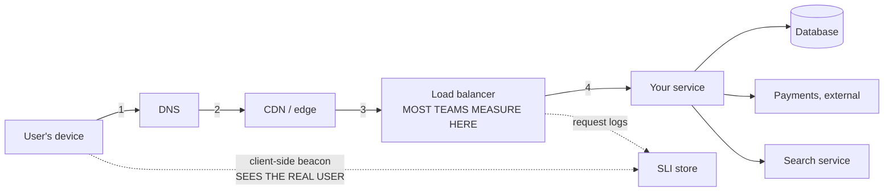

# SLAs, SLOs, and error budgets

## 1. What this is, and why they ask it

**An SLI is something you measure. An SLO is the target you hold yourself to. An SLA is the promise you make
to a customer, with money attached.** Three words, three different audiences, and candidates mix them up
constantly.

**The error budget is the idea underneath all three, and it is the one worth having.** If your target is 99.9
percent, you are saying **0.1 percent of the time it may be broken — and that 0.1 percent is a resource you
are allowed to spend.**

**Which means the right number of outages is not zero.** A month with no failures at all does not mean you
were careful. **It usually means you were too slow, too cautious, or spending money on capacity you did not
need.**

They ask it because **"how available should this be?" is a question every design interview reaches**, and
because **the honest answer involves arithmetic that most candidates cannot do on the spot.** "Highly
available" is not an answer. **"Three nines, which is forty-three minutes a month, and here is what that rules
out" is one.**

**And because it exposes whether you have ever shipped anything.** The candidate who wants five nines for a
photo-sharing app has not priced five nines. **Twenty-six seconds of downtime a month is a budget no human can
respond inside** — it means every recovery must be automatic, which changes the whole design and multiplies
the bill.

By the end of this lesson you can define all three terms without hesitating, convert any number of nines into
minutes, compute an error budget in failed requests, work out what a chain of dependencies does to your
availability, and explain why a target of 100 percent is a mistake rather than an ambition.

---

## 2. The story

The lorry had to be at the harbour by four in the morning, and that was the only line in the agreement anybody
ever read out.

Mustafa had been making ice for the fish sellers at Malpe for nineteen years. The boats came in between two
and half past three. **If the ice was there, the catch went into the boxes cold and went up to Bangalore. If
it was not, the fish sat in the open, and by nine o'clock it was worth about half.**

The agreement he signed every year had one sentence about time and one about money. **Ice by four. Late, and
he took ten percent off that morning's bill.**

**What took him about eleven years to work out was that the agreement was not his target.**

**His own target, which he never told anybody, was half past three.**

The half hour was not politeness. It was for the things that happen. The lorry not starting on a cold morning.
The boy who loaded it not turning up. The one Tuesday a year when the machine tripped and everything had to be
shifted by hand.

**And he had a second number in his head, which surprised his son when he finally explained it.**

**Two.**

**Two late mornings a month were acceptable.** Not good. Acceptable. He had watched it for nineteen years, and
the seller who shouted loudest about lateness still bought from him every week, **because two was inside what
everyone had quietly decided was normal.**

His son wanted to make it none.

So Mustafa worked it through for him, out loud, standing by the shed.

**"To never be late I need a second lorry. And a second driver for it. And that lorry stands there doing
nothing three hundred and sixty-three days a year."**

He asked the boy what a second lorry cost. Then he asked what two late mornings cost. **The boy did the two
sums and stopped arguing.**

**"The two late mornings are not a failure," Mustafa said. "The two are what I am spending in order to run
this on one lorry."**

And then the line his son repeated for years afterwards.

**"And if I have not been late once all month, I have not been careful. I have been slow."**

Because a month with nothing late meant he had been leaving at half past two every single morning, **and
standing about at the harbour for an hour, paying a boy to stand about with him.**

---

## 3. The idea in plain English

**Mustafa has all three of today's terms and he never named any of them.**

```
   "the time the lorry arrives"          <- the SLI: the measurement
   "half past three, my own target"      <- the SLO: the internal goal
   "by four, or ten percent off"         <- the SLA: the contract, with money
   "two late mornings a month"           <- the ERROR BUDGET
```

### SLI — the indicator

**An SLI is a number you actually measure, expressed as a fraction of good events over valid events.**

```
   AVAILABILITY   successful requests / all valid requests
   LATENCY        requests under 300 ms / all requests
   FRESHNESS      records updated within 5 minutes / all records
   CORRECTNESS    orders billed correctly / all orders
```

**Writing it as good-over-valid rather than as a count is the discipline that matters**, and it is the same
point as yesterday's "errors as a fraction, never a count".

**Two details decide whether the number means anything.**

**Where you measure.** Measured at your load balancer, a request that never arrived because DNS was broken is
invisible — **your graph says 100 percent while every user sees an error.** Measured in the client, you see
the user's reality **and you also see their bad wifi**, which is not your fault and not something you can fix.
**Say which one you chose and why.**

**What counts as valid.** A request that returns 400 because the client sent nonsense is not your failure.
**Excluding it is correct; excluding too much is how a team makes its numbers look good and its users
miserable.**

### SLO — the objective

**An SLO is the target for that indicator, over a stated window.**

```
   "99.9% of requests succeed, measured over a rolling 28 days"
   "99% of requests complete in under 300 ms, over 28 days"
```

**The window is part of the objective, not decoration.** A daily window makes one bad hour a catastrophe; a
quarterly window lets you hide a whole bad week. **Twenty-eight days is the common choice because it contains
exactly four of every weekday**, so weekly traffic patterns do not distort it.

**The SLO is internal. Nobody outside sees it. You are allowed to miss it** — that is what makes it a useful
management tool rather than a promise.

### SLA — the agreement

**An SLA is a contract with a customer: a promise, and a consequence when you break it.** The consequence is
almost always **service credits** — money back off the next bill — rather than damages.

**The SLA is always looser than the SLO, and the gap is deliberate.** Mustafa promised four o'clock and aimed
for half past three. **If your promise and your target are the same number, then the first time you miss your
target you are also paying a penalty**, and you have no room to detect a problem before it becomes a
liability.

```
   typical shape:
     SLA to customers   99.9%     (43 min/month, with credits)
     SLO internally     99.95%    (22 min/month, no money involved)
     alerting fires at  99.97%    (13 min/month)

   -> three layers, each tighter than the last, so a problem
      is noticed, then breaches an internal goal, and only
      then costs anybody money.
```

**Real ones are worth knowing.** **AWS EC2 promises 99.99 percent for a region and gives credits of 10, 25 or
100 percent as the number falls.** **Google Cloud and Azure are shaped the same.** **And every one of them
requires you to notice and to file a claim** — nobody sends the money automatically, which tells you something
about how these are really used.

### The error budget, which is the useful idea

**If the SLO is 99.9 percent, then 0.1 percent is yours to spend.**

```
   30 days = 43,200 minutes

   99.9% available  ->  0.1% unavailable
                    ->  43,200 x 0.001 = 43.2 minutes a month

   THAT IS THE BUDGET. Not an accident allowance - a resource.
```

**And you spend it on things you want:**

```
   shipping a risky change
   a migration with a chance of going wrong
   an experiment
   turning off a redundant machine to save money
   a deliberate failure test
```

**The rule the budget buys is simple and it settles arguments that otherwise never end.** **Budget remaining →
ship it. Budget spent → stop shipping features and fix reliability until it recovers.** **The engineers and
the product managers stop negotiating with each other and start reading the same number.**

**And Mustafa's last line is the part people find genuinely counter-intuitive.** **An unspent budget is
waste.** If you finished the month at 99.99 percent against a 99.9 target, **you were over-cautious or
over-provisioned**, and both cost money that bought nothing anybody asked for.

### Why 100 percent is the wrong target

**Three reasons, and all three are worth saying.**

**It is unachievable.** The user's phone, their network, DNS, the undersea cable — **most of the path is not
yours**, and a user on a train sees failures you cannot prevent.

**It is unaffordable.** **Each additional nine costs roughly ten times more than the last**, and the gain is
progressively less visible to anybody.

**It is invisible.** **If the user's own connection is 99 percent reliable, they cannot tell the difference
between your 99.99 and your 99.999.** You would be paying ten times as much for something no one can perceive.

### What the nines actually mean

**Learn this table. It is the single most quoted thing in this whole phase.**

```
   AVAILABILITY   PER MONTH (30 days)   PER YEAR

   99%            7 hours 12 min        3.65 days
   99.5%          3 hours 36 min        1.83 days
   99.9%          43.2 minutes          8.76 hours
   99.95%         21.6 minutes          4.38 hours
   99.99%         4.32 minutes          52.6 minutes
   99.999%        25.9 seconds          5.26 minutes
```

**Look at the last row and think about what it means operationally.** **Twenty-six seconds a month is less
time than it takes a person to read an alert and open a laptop.** **At five nines, no human is in the recovery
path.** Everything must fail over automatically, which means the design changes: **health checks in seconds,
automatic promotion of replicas, traffic that reroutes itself.** That is why the price is what it is.

### Burn rate, so you find out early

**The problem with a monthly budget is that you can burn all of it in twenty minutes and only notice at the end
of the month.** So you alert on **how fast you are spending it.**

```
   burn rate = actual error rate / allowed error rate

   SLO 99.9%  ->  allowed error rate 0.1%

   errors at 0.1%  ->  burn rate 1     budget lasts exactly the month
   errors at 1%    ->  burn rate 10    budget gone in 3 days
   errors at 10%   ->  burn rate 100   budget gone in 7 hours
```

**The standard shape is two alerts, and it is worth knowing because it is a genuinely good design.**

```
   FAST:  burn rate 14.4x sustained for 1 hour
          -> 2% of the monthly budget in an hour. Page someone.

   SLOW:  burn rate 6x sustained for 6 hours
          -> 5% of the budget. A ticket, not a page.
```

**The fast one catches the outage. The slow one catches the leak** — the 0.6 percent error rate that nobody
notices and that eats the whole month. **One alert cannot do both**, because a threshold tight enough to catch
the leak fires constantly on ordinary noise.

---

## 4. The picture

Where the indicator is measured, and what it sees:



**Measuring at the load balancer is easy and slightly dishonest.** It cannot see requests that never arrived —
**a DNS failure or a dead edge shows as 100 percent availability while every user gets nothing.** Measuring in
the client sees the truth **and also sees the user's own broken wifi, which you cannot fix and should not be
judged on.**

**The answer to give: measure server-side for the SLO you manage against, and keep a client-side signal to
catch the failures the server-side view is blind to.**

The budget, drawn as a month:

```
   ERROR BUDGET, 99.9% SLO, 30-day month
   Total budget: 43.2 minutes

   day 1                            day 15                    day 30
   |--------------------------------|-------------------------|

   [====================================================]  43.2 min
    ^
    a healthy month spends it gradually:

   [#####............................................]   9 min used
                                                          34 spare
   -> ship freely


   a bad deploy on day 4:

   [##############################################...]   41 min used
    ^^^^^^^^^^^^^^^^^^^^^^^^^^^^^^^^^^^^^^
    one 38-minute outage
   -> 1.2 minutes left for 26 days. FREEZE features.


   a month with nothing spent:

   [.................................................]   0 min used
   -> NOT a triumph. You were too cautious, or you are
      paying for capacity nobody needed.
```

Dependencies multiply, and this is the diagram people find alarming:

```
   Your service calls five things to serve one request.
   Each one is independently 99.9% available.

     you ---> auth       99.9%
          --> database   99.9%
          --> payments   99.9%
          --> search     99.9%
          --> storage    99.9%

   IN SERIES, availability MULTIPLIES:

     0.999 ^ 5 = 0.995

   -> 99.5%, which is 3 hours 36 minutes a month.

   You promised 43 minutes. You have built 216.

   THE FIX IS NOT "ask them to try harder":
     - make calls optional (search fails -> hide the box)
     - cache the last good answer
     - put redundancy IN PARALLEL, where it helps:

     two independent replicas, each 99%:
       fails only if BOTH fail: 0.01 x 0.01 = 0.0001
       -> 99.99%

   IN SERIES you multiply availabilities and get WORSE.
   IN PARALLEL you multiply failure rates and get BETTER.
   That one sentence is the whole of reliability arithmetic.
```

---

## 5. How it actually works

### Choosing the indicator

**Start from the user, not from the machine.** The question is "what does a bad minute feel like to somebody
using this?" — **and the answer is almost never CPU.**

```
   a checkout service     -> can they pay?        availability + correctness
   a video player         -> does it start, and   startup latency +
                             does it stutter?      rebuffer ratio
   a search box           -> does it answer, and  availability + p95 latency
                             is it fast?
   a data pipeline        -> is today's data      freshness
                             there by 9 a.m.?
```

**Three to five SLIs per service is the practical number.** More than that and nobody remembers them, **and an
SLO nobody remembers is not a control on anything.**

### Measuring it

**Two honest sources, and they answer different questions.**

**Request logs** — count the good ones and the valid ones. **Cheap, accurate, and blind to anything that
failed before it reached you.**

**Synthetic probes** — a robot somewhere else on the internet asking for your home page every thirty seconds.
**It catches the DNS and edge failures the logs cannot see**, and it says nothing about real users, because it
is not one.

**Real-user monitoring** — a small piece of code in the app that reports what actually happened to actual
people. **The most honest signal and the most contaminated one**, because it includes every broken phone and
every train tunnel.

**In practice: SLO from server-side logs, synthetics as a safety net for total outages, and real-user data to
argue about what the SLO should be.**

### Where the numbers live

```
   Prometheus + Grafana        recording rules compute the ratio;
                               Grafana's SLO panels or Sloth generate
                               the burn-rate alerts for you
   Nobl9 / Datadog SLOs        managed: define the SLI, get budget
                               tracking and burn alerts
   Google Cloud Monitoring     SLOs are first-class objects
   OpenSLO                     a YAML spec for defining SLOs
                               portably, if you dislike lock-in
```

**The mechanical part matters less than one design decision: the budget must be visible on the same dashboard
as the feature work.** **A budget nobody looks at changes nobody's behaviour**, and then the whole exercise is
paperwork.

### What happens when the budget runs out

**This is the part that has to be agreed in advance, in writing, while everybody is calm.**

```
   BUDGET HEALTHY (> 25% left)
     ship normally, take risks, run experiments

   BUDGET LOW (< 25%)
     no risky changes; deploys need a reviewer;
     reliability work is prioritised

   BUDGET EXHAUSTED (0%)
     FEATURE FREEZE. Only reliability work and
     critical security fixes ship until the rolling
     window recovers.
```

**The freeze is the entire point of the mechanism.** **Without a consequence, the SLO is a wish.** With one,
**the decision to stop shipping is made by arithmetic rather than by whoever argues hardest in the meeting** —
and that is genuinely why teams adopt this.

**And there has to be an escape hatch**, agreed in advance: **who can override the freeze, and what they have
to write down when they do.** A rule with no override gets ignored the first time it is inconvenient, and then
it is dead.

### The SLA side

**The contract is a legal document and it is written defensively.**

```
   what it defines:
     the measurement, precisely (whose clock, which requests count)
     the exclusions (scheduled maintenance, force majeure,
       the customer's own misuse, beta features)
     the credit schedule
     the claim process and its deadline

   what a credit schedule looks like (typical cloud shape):
     99.99% or better    no credit
     99.0% - 99.99%      10% of the monthly bill
     95.0% - 99.0%       25%
     below 95.0%         100%
```

**Notice what the money actually is.** **Ten percent of one month's bill is not compensation for a business
that lost a day's trading.** **The SLA is not insurance. It is a statement of seriousness**, and it exists so
that both sides have a number to point at.

**And notice the exclusion for scheduled maintenance**, which is how a provider gets to take a system down on
purpose without breaching anything. **If you are asked to design an SLA, that clause is the one to remember**,
because without it you have accidentally promised never to do planned work.

---

## 6. The numbers

**The nines, computed rather than recited.**

```
   a 30-day month = 30 x 24 x 60 = 43,200 minutes
   a 365-day year = 525,600 minutes

   99%      1% of 43,200      = 432 min   = 7 h 12 min/month
                                          = 3.65 days/year
   99.5%    0.5%              = 216 min   = 3 h 36 min/month
   99.9%    0.1%              = 43.2 min/month
                                          = 8.76 hours/year
   99.95%   0.05%             = 21.6 min/month
   99.99%   0.01%             = 4.32 min/month
                                          = 52.6 min/year
   99.999%  0.001%            = 25.9 seconds/month
                                          = 5.26 min/year
```

**The budget in requests, which is often the more useful form.**

```
   100,000,000 requests/day x 30 = 3,000,000,000 requests/month

   SLO 99.9%  ->  0.1% may fail
              ->  3,000,000,000 x 0.001 = 3,000,000 failed requests

   -> THREE MILLION failures a month is "meeting the target".

   Which reframes an incident usefully:
     a 20-minute outage at 1,157 requests/second
     = 1,200 seconds x 1,157 = 1,388,400 requests

     -> that single incident spent 46% of the monthly budget.
```

**Burn rate, with the arithmetic shown.**

```
   allowed error rate at 99.9% = 0.001

   observed 1% errors:
     burn rate = 0.01 / 0.001 = 10x
     43.2 minutes of budget / 10 = the month's budget lasts
     30 days / 10 = 3 DAYS

   observed 10% errors:
     burn rate = 100x
     30 days / 100 = 7.2 HOURS

   observed 0.15% errors (barely visible on any graph):
     burn rate = 1.5x
     30 days / 1.5 = 20 days
     -> you run out on day 20 and nobody ever noticed a problem.
        This is exactly what the slow-burn alert is for.
```

**The standard two-alert configuration, and where its numbers come from.**

```
   FAST alert: 14.4x burn for 1 hour
     1 hour is 1/720 of a 30-day month
     14.4 x (1/720) = 2% of the budget consumed
     -> page

   SLOW alert: 6x burn for 6 hours
     6 hours is 1/120 of the month
     6 x (1/120) = 5% of the budget consumed
     -> ticket

   The 14.4 is not magic: it is the number that makes one
   hour equal 2% of a monthly budget.
```

**Dependencies in series.**

```
   n dependencies, each 99.9%:

   n = 1   0.999^1 = 0.9990   ->  43 min/month
   n = 3   0.999^3 = 0.9970   ->  130 min/month
   n = 5   0.999^5 = 0.9950   ->  216 min/month
   n = 10  0.999^10 = 0.9900  ->  432 min/month  (7 hours)
   n = 20  0.999^20 = 0.9802  ->  855 min/month  (14 hours)

   -> A twenty-service request path cannot be more than
      98% available if every hop is three nines.

   -> This is a real and often decisive argument in the
      microservices-versus-monolith discussion.
```

**Redundancy in parallel, which is the counter-move.**

```
   two independent instances, each 99%:
     both fail:  0.01 x 0.01 = 0.0001
     available:  99.99%

   three, each 99%:
     0.01^3 = 0.000001  ->  99.9999%

   BUT "independent" is doing enormous work in that sentence.
   Two machines in the same rack share a power supply.
   Two regions share a deployment pipeline and a DNS provider.

   Real-world correlation is why measured availability is
   always worse than the multiplication says.
```

**The cost of a nine, roughly.**

```
   99%      one machine, restart it when it breaks
   99.9%    two machines, a load balancer, on-call, monitoring
   99.99%   multi-zone, automatic failover, replicated storage,
            tested runbooks, staged deploys
   99.999%  multi-region active-active, no human in the recovery
            path, chaos testing, and a team that does only this

   Each step is roughly 10x the engineering and infrastructure
   cost of the one before.

   Concretely, for a service costing $10,000/month at 99.9%:
     99.99%  -> ~$40,000-100,000/month
     99.999% -> a dedicated team, so add salaries

   -> Ask what the downtime actually costs before buying a nine.
      If an hour of downtime costs $5,000, spending $90,000 a
      month to prevent 39 minutes of it is a bad trade.
```

---

## 7. The trade-offs

**A tighter SLO buys confidence and costs velocity.**

**Every nine you add takes engineering time away from features and spends it on redundancy, testing and
automation.** That is the correct trade for a payments system and the wrong one for an internal dashboard.
**I would not set a 99.99 percent SLO on anything whose users would not notice the difference** — and the way
to find out is to look at what they actually complain about.

**A long measurement window is forgiving and slow; a short one is honest and jumpy.**

**A 28-day rolling window absorbs a bad afternoon and tells you about a bad fortnight.** **A 24-hour window
makes every incident a crisis and drives teams to hide small failures.** **A quarterly window lets a genuinely
bad month be averaged away.** **I would use 28 days by default and add a 7-day view for the team's own
awareness**, without attaching consequences to the short one.

**Measuring server-side is cheap and flatters you. Measuring client-side is honest and unfair.**

**Server-side logs cannot see what never arrived** — and total outages are exactly the case where they go
silent and your dashboard reads 100 percent. **Client-side telemetry sees the real experience and includes
every failure of the user's own network.** **I would set the SLO on server-side data, because that is what the
team controls, and keep synthetic probes as the tripwire for the failures that make the logs go quiet.**

**Excluding requests makes the number meaningful, or makes it meaningless.**

**Excluding 4xx client errors is right — a malformed request is not your outage.** **Excluding "planned
maintenance" can be right too.** **But every exclusion is a place where the number stops describing the user's
experience**, and there is a real failure mode where a team's SLO is green for a year while support tickets
climb. **The test I would apply: if the SLI is healthy and users are complaining, the SLI is wrong, and the
exclusions are the first place to look.**

**The error budget policy only works if the freeze is real.**

**A budget with no enforcement is a dashboard.** The whole value is that the decision to stop shipping is made
by arithmetic instead of by argument. **But a rigid freeze with no override gets ignored the first time
something urgent appears**, and after that nobody believes any of it. **I would want the override written down
in advance: who can grant it and what they have to record.**

**And the honest limit of the whole framework: it says nothing about how bad a failure was.**

**Three million failed requests spread thinly over a month is a mild annoyance. Three million in one twenty
minute window, all on the checkout page, is a front-page incident.** **Same budget consumption, wildly
different reality.** **I would not use error budgets as the only measure of health** — they sit alongside
incident reviews, not instead of them.

---

## 8. In the interview

### How it gets asked

- *"What does three nines mean in minutes per month?"* — the direct one, and it is checked instantly.
- *"What availability would you target for this system, and why?"* — they want a number and a justification.
- *"What is the difference between an SLA and an SLO?"* — a definitions question, and a filter.
- *"You have a 99.9% target and you just had a 20-minute outage. Now what?"* — budget arithmetic.
- *"Your service calls six others. What is your availability?"* — the multiplication.
- *"Why not aim for 100%?"* — the question that finds out whether you have ever operated anything.

### The first ninety seconds

On "what does three nines mean, in minutes":

> "**Forty-three minutes a month.**
>
> **The arithmetic is worth doing out loud: a thirty-day month is 43,200 minutes, and 0.1 percent of that is
> 43.2 minutes.** Over a year it is 8.76 hours.
>
> **And the rest of the table, because the shape matters more than any single row.** **99 percent is seven
> hours a month.** **99.9 is forty-three minutes.** **99.99 is four minutes.** **99.999 is twenty-six
> seconds.**
>
> **Twenty-six seconds is the row that changes the design rather than the budget.** **It is less time than a
> person needs to read a page and open a laptop, so at five nines no human is in the recovery path.**
> Everything must fail over automatically. **That is why each nine costs roughly ten times the last one.**
>
> **I would also give the budget in requests, because it is more useful in an argument.** At a hundred million
> requests a day, a month is three billion, **so 99.9 percent permits three million failed requests.** **And a
> twenty-minute outage at about 1,150 requests a second is 1.4 million requests — nearly half the month's
> budget in one incident.**
>
> **The thing I would want to add is the framing.** **That 0.1 percent is not an accident allowance, it is a
> budget I am allowed to spend** — on risky deploys, migrations, experiments, or running with less redundancy
> than the paranoid option. **And if I end the month having spent none of it, that is not a triumph. It means
> I was too cautious or paying for capacity nobody needed.**"

### The follow-ups

**"What is the difference between an SLA, an SLO and an SLI?"**

> "**An SLI is the measurement. An SLO is the internal target for it. An SLA is the external promise, with
> money attached.**
>
> **The SLI is a ratio of good events over valid events** — successful requests over all valid requests,
> or requests under 300 milliseconds over all requests. **A ratio, never a count**, so that it means the same
> thing on a quiet Sunday and a busy Monday.
>
> **The SLO adds a target and a window: 99.9 percent over a rolling 28 days.** **The window is part of the
> objective** — a daily window makes one bad hour a catastrophe and a quarterly one lets you hide a bad week.
> **Twenty-eight days is the usual choice because it contains four of each weekday**, so weekly patterns do not
> distort it.
>
> **The SLA is the contract, and the important structural fact is that it is always looser than the SLO.**
> **Typically the SLA is 99.9 and the SLO is 99.95, with alerting tighter still.** **If the promise and the
> target are the same number, then the moment you miss your target you are already paying penalties** — you
> have left yourself no room to notice a problem before it becomes a liability.
>
> **The consequence in an SLA is service credits, not damages** — the cloud shape is ten percent of the bill,
> then twenty-five, then a hundred as it gets worse. **And the credit is not compensation.** Ten percent of a
> monthly bill does not cover a customer's lost trading day. **The SLA is a statement of seriousness rather
> than insurance**, and you usually have to file a claim to get anything at all."

**"Your service depends on six others. What is your availability?"**

> "**Worse than any of them, and this is arithmetic rather than pessimism.**
>
> **Calls in series multiply.** If every dependency is 99.9 percent available and I need all six to answer,
> **0.999 to the sixth is 0.994 — about 99.4 percent, which is roughly four and a half hours a month.**
> **I promised forty-three minutes and I have built two hundred and sixty.**
>
> **So the first question I would ask is: do I actually need all six?** **Most of them are not really
> required.** If search is down I can hide the search box. If recommendations are down I can show the popular
> list. **Every dependency I can make optional comes out of the multiplication entirely.**
>
> **The second lever is caching the last good answer**, which turns a dependency's outage into stale data
> rather than an error.
>
> **The third is redundancy, and the key point is that it has to be in parallel to help.** **In series you
> multiply availabilities and it gets worse. In parallel you multiply failure rates and it gets better.** Two
> independent instances at 99 percent each fail together only 0.01 times 0.01 of the time — **99.99 percent.**
>
> **And I would flag the word 'independent', because it is doing enormous work.** **Two machines in one rack
> share a power supply. Two regions share a deployment pipeline and a DNS provider.** **Correlated failure is
> why measured availability is always worse than the multiplication predicts**, and the honest version of the
> answer includes that.
>
> **One last point, because it is a real design argument.** **A twenty-hop request path cannot beat 98 percent
> if each hop is three nines.** **That is one of the strongest concrete arguments against splitting a system
> into very many services**, and it is worth having ready for tomorrow's kind of question."

**"You are at 99.9%, you just had a twenty-minute outage on the fourth of the month. What happens now?"**

> "**First the arithmetic, because everything else follows from it.** **The monthly budget is 43.2 minutes.
> Twenty minutes is 46 percent of it, spent on day four.**
>
> **So we have about 23 minutes left for 26 days**, and the burn rate we can afford from here is less than
> half of normal.
>
> **What that triggers should already be written down, agreed while everyone was calm.** **My policy would
> be: above 25 percent budget remaining, ship normally. Below 25 percent, no risky changes and deploys need a
> second reviewer. At zero, feature freeze — only reliability work and critical security fixes.**
>
> **We are at 54 percent remaining, so not frozen, but into the cautious band.** **Concretely: postpone the
> migration that was scheduled for next week, keep shipping small low-risk changes, and put whatever caused
> the outage at the top of the list.**
>
> **The reason to have this written in advance is that it takes the decision away from whoever argues hardest
> on the day.** **The budget number decides, not the meeting.** That is genuinely why teams adopt this — it
> ends a recurring fight between shipping and stability by making it arithmetic.
>
> **I would also want a burn-rate alert so that the next one is caught in an hour rather than at month end.**
> **The standard shape is two alerts: 14.4 times burn sustained over an hour, which is two percent of the
> monthly budget, and that pages someone; and 6 times over six hours, which is five percent, and that files a
> ticket.** **The fast one catches an outage; the slow one catches a leak** — a 0.15 percent error rate that
> looks like nothing on a graph but eats the whole month by day twenty. **One alert cannot do both jobs.**
>
> **And the honest caveat I would add: the budget says how much, not how bad.** **Three million failures
> spread over a month is an annoyance; three million in twenty minutes, all on checkout, is a front-page
> incident.** Same number, different reality — **so the budget sits alongside incident reviews rather than
> replacing them."**

### The model answer

*"What availability should this system have, and how would you manage it?"*

> "**I would start by refusing to answer in the abstract, and ask what a bad minute costs.**
>
> **If this is checkout for a business doing a hundred thousand a day, an hour of downtime costs about four
> thousand, and paying for another nine is easy to justify. If it is an internal reporting dashboard, nobody
> notices an hour** — and a 99.99 percent target would be spending real money on something no user can
> perceive.
>
> **Then I would name the indicator before the target, because the target is meaningless without it.** For a
> checkout: **successful payment attempts over valid payment attempts, measured at the service, over a rolling
> 28 days.** Probably a latency SLI beside it — **99 percent of attempts completing in under two seconds** —
> because a checkout that works and takes eleven seconds is a failure that no availability number captures.
>
> **Say the target is 99.9 percent. That is 43 minutes a month, or three million failed requests out of three
> billion.** **The SLA I would offer customers would be looser — 99.5 percent, with service credits — so that
> missing my internal target does not immediately cost money and I keep room to react.**
>
> **The 0.1 percent is then an error budget I actively spend**: on risky deploys, on migrations, on running
> one fewer replica than the paranoid option. **And the policy attached to it is the part that makes it work.
> Above 25 percent remaining, ship freely. Below, no risky changes. At zero, feature freeze until the rolling
> window recovers** — with a named person who can override it and a note saying why.
>
> **I would alert on burn rate, not on the budget being gone.** **14.4 times over an hour pages; 6 times over
> six hours makes a ticket.** Otherwise you find out at month end.
>
> **Two pieces of arithmetic I would put on the table unprompted.**
>
> **First, dependencies multiply in series.** Six dependencies at three nines each puts my ceiling at 99.4
> percent, **so I cannot promise three nines until I have made most of those calls optional or cached.**
> **Redundancy only helps in parallel** — two independent instances at 99 percent give 99.99, because failure
> rates multiply rather than availabilities.
>
> **Second, each nine is roughly ten times the cost.** **99.999 percent is 26 seconds a month, which is less
> time than a human needs to react, so it means no person in the recovery path at all** — automatic failover,
> multi-region, chaos testing, and a team whose whole job is that. **I would only propose it where downtime is
> measured in millions.**
>
> **And I would close with the sentence that gets the least agreement and is the most useful.** **A month
> where I spent none of the budget is not a good month.** **It means I was too cautious, or I was paying for
> capacity nobody needed, and both of those are money that bought nothing.**"

---

## 9. Recall card

**SLI is the MEASUREMENT (good events / valid events — a ratio, never a count). SLO is the INTERNAL TARGET
plus a window ("99.9% over a rolling 28 days"). SLA is the EXTERNAL CONTRACT with money attached, and it is
ALWAYS LOOSER than the SLO** — same number means the first internal miss is already a penalty. Typical
layering: **SLA 99.9 / SLO 99.95 / alert at 99.97.** Credits are a statement of seriousness, not insurance.

**The table, from 43,200 minutes in a 30-day month.** **99% = 7h12m · 99.9% = 43.2 min · 99.99% = 4.32 min ·
99.999% = 25.9 seconds.** **Twenty-six seconds is less time than a human needs to read an alert, so at five
nines nothing human is in the recovery path** — and each nine costs roughly **10×** the last.

**The error budget is a RESOURCE, not an accident allowance.** 99.9% of 3 billion monthly requests =
**3,000,000 failures allowed**; a 20-minute outage at 1,157 req/s spends **46% of the month in one incident.**
Spend it on risky deploys, migrations and experiments. **Policy: >25% left ship freely; <25% no risky changes;
0% feature freeze** — with a named override, or the rule dies the first time it is inconvenient. **An unspent
budget means you were too cautious or over-provisioned.**

**Alert on BURN RATE, or you find out at month end.** burn = actual error rate / allowed. **1% errors against a
0.1% allowance = 10× = budget gone in 3 days.** Standard pair: **14.4× for 1 hour (2% of budget) pages; 6× for
6 hours (5%) tickets** — the fast one catches outages, the slow one catches the 0.15% leak that eats the month
invisibly.

**IN SERIES YOU MULTIPLY AVAILABILITIES AND GET WORSE; IN PARALLEL YOU MULTIPLY FAILURE RATES AND GET BETTER.**
Six dependencies at 99.9% → **0.999⁶ = 99.4%**, four and a half hours a month; twenty hops caps you at 98%.
Fix by making calls **optional**, caching the last good answer, or adding **independent** parallel replicas
(two at 99% → 99.99%) — and "independent" is doing enormous work, because shared racks, pipelines and DNS
correlate failures. **100% is the wrong target: unachievable, unaffordable, and invisible behind the user's
own connection.**
