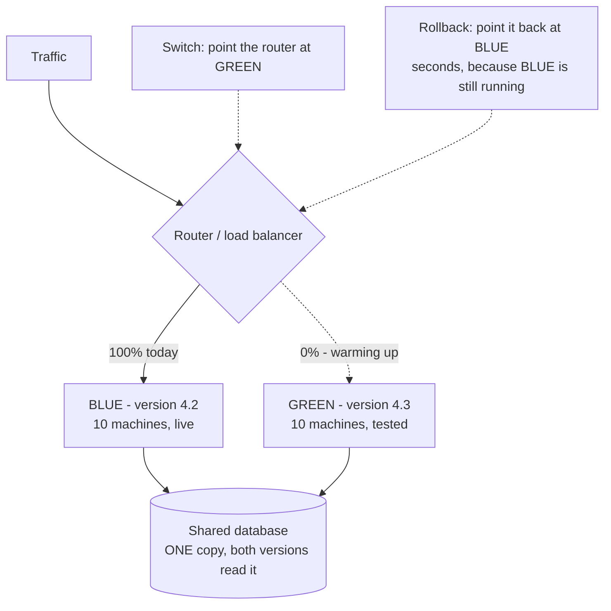

# Deployments: blue-green, canary, and rollback

## 1. What this is, and why they ask it

**A deployment is the act of replacing running software with different software while people are using it.**
Nothing stops. The traffic keeps arriving. **And somewhere in the middle, two versions of your system are
running at the same time.**

**That last sentence is the whole topic.** Every strategy below is an answer to "how much of the traffic sees
the new version, for how long, and how fast can I undo it?"

**And undoing it is the part that matters most.** **The single most valuable number in this lesson is how long
it takes you to get back to the previous version** — because the majority of production incidents are caused
by a change, and the fastest cure for a bad change is not fixing it. **It is putting the old one back.**

They ask it because **it is where design meets operations**, and because it is the part of the job that
candidates who have only built side projects have never had to think about. **On your laptop you stop the
program and start it again. With live traffic you cannot.**

**And because the follow-up is always the database**, which is the one thing you cannot keep two copies of.
**Anybody can say "blue-green".** The interesting answer is what happens to the schema when the old code and
the new code both have to read it.

By the end of this lesson you can describe five deployment strategies and say when each is right, explain what
a readiness check does that a liveness check does not, migrate a database schema without downtime, size the
extra capacity a blue-green switch needs, and say how long a one-percent canary must run before it means
anything.

---

## 2. The story

Nagaraj had printed wedding cards for twenty-six years, and the thing he was known for was that he had never
once had to reprint a whole order.

**He had reprinted single cards.** Everybody does. A name spelled the way the family said it and not the way
they wanted it. **What he had never done was run off a thousand and then find that all thousand were wrong.**

His method was three things, and he had never written any of them down.

**The first was that before a run he pulled one card. One.** He inked the plate, ran a single sheet, and
carried it out to the front where the light from the street was better, **and he would not print the second
one until somebody from the family had read the first one out loud.**

**The second was that he never changed two things in the same job.** New ink and new card stock together — no.
**If the gold came out looking flat, he wanted to know which of the two had done it**, and with both changed at
once there was no way to know.

**The third one the boys in the shop thought was superstition. He kept the old plate.** Even after the new one
was made and approved and already running. **The old plate stayed on the shelf behind him until the finished
order was boxed and gone.**

His nephew asked him about that once. If the new plate was approved, why keep the old one taking up the shelf?

**Nagaraj told him about a job in 1994.**

A new plate, checked, approved, read out loud by the bride's father himself. **And a hairline crack in it that
did not show at all until about the four hundredth impression**, when a thin white line began appearing
through one corner of the border.

**Four hundred cards were spoiled.** But the old plate was on the shelf, and he was printing again in eleven
minutes.

**"Approved is not the same as proved," he said. "Approved means it looked right on one card. The four
hundredth card is a different question, and nobody can answer it in advance."**

Then the part his nephew remembered.

**"I do not keep the old plate because I think the new one is bad. I keep it because eleven minutes is the
difference between a mistake and a disaster."**

---

## 3. The idea in plain English

**Nagaraj has the three ideas of this lesson and he has them in the right order.** **The single proof card is a
canary. One change at a time is the rule that makes a failure diagnosable. And the old plate on the shelf is
rollback** — the thing that turns a bad release into an inconvenience.

### The five strategies

**Every one of them is a different answer to "who sees the new version, and for how long?"**

**Recreate.** Stop the old, start the new. **Simple, and it means downtime** — as long as the new version takes
to start. **It is the right answer for a batch job, an internal tool, or anything that genuinely cannot run two
versions at once.**

**Rolling update.** Replace the machines a few at a time. **No extra capacity, no downtime, and it is the
default in Kubernetes.** **The cost is that both versions run side by side for the whole rollout, and going
back is another slow rollout.**

**Blue-green.** Run two complete environments. **Blue is live; green has the new version and no traffic.** Test
green, then **switch all traffic at once.** **Rollback is switching back — seconds.** **The cost is double the
infrastructure for the duration, and the database is shared, which is where it gets hard.**

**Canary.** Send **a small slice of real traffic** — one percent — to the new version. **Watch its error rate
and latency against the old one. Increase slowly: 1%, 5%, 25%, 50%, 100%.** **This is the only strategy that
finds problems that need real traffic to appear**, which is most of them. **The cost is that it is slow, and it
only works if your metrics are good enough to tell one percent apart from noise.**

**Feature flags.** Ship the code with the new behaviour switched off, **then turn it on separately.**
**Deployment and release become two different events**, which is the single most useful idea in the list. **You
can enable it for internal staff first, then one percent of users, then everyone — with no deploy at all.**

### The idea underneath all of them

**During any of these, two versions of your code are running at the same time and talking to the same data.**

**So every change must work with the version before it.** This is called **backward compatibility**, and in
practice it means:

```
   NEW code must work with OLD data
   OLD code must not break on NEW data
   NEW code must handle responses from OLD instances of other services
```

**And that is why some changes cannot be made in one step at all**, which is the next section.

### Health checks, and the two kinds

**A rolling update needs to know when a new instance is ready for traffic. That is a readiness check.**

```
   LIVENESS   "are you alive, or should I kill and restart you?"
              A failed liveness check RESTARTS the container.

   READINESS  "should I send you traffic right now?"
              A failed readiness check REMOVES you from the
              load balancer but leaves you running.
```

**The difference matters during a deployment.** A service that takes forty seconds to warm its caches is
**alive but not ready** — **and if you only have a liveness check, the load balancer sends real traffic to it
immediately and those users get errors.** **If you wire the liveness check to the same slow condition, the
platform kills it before it ever finishes starting, and you get a restart loop.**

**A readiness check must test the things the service needs to serve**, and must not test its downstream
dependencies too aggressively — **or one slow dependency takes your whole fleet out of the load balancer at
once.**

### Rolling back, and rolling forward

**Rollback: put the previous version back.** **Roll forward: fix the bug and deploy again.**

**During an incident, roll back.** **Rolling forward means writing code under pressure and shipping it
untested**, and it takes as long as the fix takes. **Rollback takes as long as a deploy — or seconds, if you
are blue-green.**

**The number worth having is: how long from "this is bad" to "the old version is serving"?** **A team that can
answer "under five minutes" can afford to take risks. A team that answers "about an hour" cannot**, and will
compensate by deploying rarely, which makes each deployment bigger and more dangerous. **That loop is real and
it is worth naming in an interview.**

### The database, which is the hard part

**You can have two versions of your code. You cannot have two versions of your data.**

**So schema changes are done in stages, and the pattern is called expand and contract.**

```
   Say you want to rename `name` to `full_name`.

   THE OBVIOUS WAY - and it breaks everything:
     rename the column, deploy the new code
     -> between those two moments, the old code is
        querying a column that no longer exists

   EXPAND AND CONTRACT - five deploys, no downtime:

   1. EXPAND    add `full_name`, leave `name` alone.
                Old code is unaffected.
   2. DUAL WRITE deploy code that writes BOTH columns
                and still reads `name`.
   3. BACKFILL  copy existing rows into `full_name`,
                in batches, in the background.
   4. READ NEW  deploy code that reads `full_name`.
                Still writing both, so rollback is safe.
   5. CONTRACT  once nothing reads `name`, stop writing
                it, then drop it - weeks later.
```

**Five steps, and the reason for each is that at no moment is any running version of the code looking at
something that is not there.**

**The rule that generates all of it: every schema change must be additive first and destructive last, with a
gap in between long enough that you could still roll back.** **Dropping a column is the last thing you do, and
it should feel boringly overdue when you do it.**

---

## 4. The picture

Blue-green, and the moment of the switch:



**The important box is the shared database.** **Blue-green duplicates the compute and cannot duplicate the
data**, so **the schema must work for both versions at once** — which is exactly why expand-and-contract
exists. **And blue stays running after the switch**, unused, for as long as you want the ability to go back in
seconds.

Canary, as a sequence of decisions:

```
   TIME ->

   00:00   1% to new     watch error rate, p99, saturation
           |
           |--- 30 min --- enough requests to say anything
           v
   00:30   5% to new     watch again
           |
   01:00   25% to new
           |
   01:30   50% to new
           |
   02:00   100%          old version stays running a while

   AT ANY POINT: shift back to 0% and stop.
   That is the whole value of the shape.


   AUTOMATIC ABORT RULES, agreed in advance:
     new version's error rate > 2x old version's   -> abort
     new version's p99 > 1.5x old version's        -> abort
     any burn-rate alert fires                     -> abort
```

**Compare the canary against the old version, not against a fixed threshold.** **If Monday morning is naturally
noisier than Sunday night, a fixed threshold either fires constantly or never fires.** **The old version is
serving the same traffic at the same moment, and it is the only fair control.**

Rolling update, machine by machine:

```
   10 machines, maxSurge 2, maxUnavailable 0

   step 0   [OOOOOOOOOO]                 10 old, serving
   step 1   [OOOOOOOOOO] + [NN]          add 2 new, wait for READY
   step 2   [OOOOOOOO..] + [NN]          remove 2 old
   step 3   [OOOOOOOO..] + [NNNN]        add 2 more
   ...
   step 10  [..........] + [NNNNNNNNNN]  done

   O = old version   N = new version

   maxSurge 2       -> you may temporarily run 12 machines
   maxUnavailable 0 -> you never drop below 10 serving

   -> zero capacity loss, at the price of 20% extra
      machines during the rollout.

   AND NOTE: between step 1 and step 10, BOTH VERSIONS ARE
   SERVING REAL USERS. Anything that is not compatible with
   the previous version breaks here, not in testing.
```

Expand and contract, drawn as a timeline:

```
   deploy:   1        2         3        4        5
             |        |         |        |        |
   column    add      write     backfill read     drop
   `full_    it       both      old rows new      `name`
   name`

   old code  works    works     works    ---      ---
   new code  ---      works     works    works    works

   ^ AT EVERY POINT, BOTH ROWS ARE SAFE.
     That is the property the whole dance exists to preserve.

   The gap between step 4 and step 5 is deliberate and long
   - days or weeks - because until you drop the column you
   can still roll back to any earlier version.
```

---

## 5. How it actually works

### The platform pieces

**Kubernetes does rolling updates natively.** A `Deployment` has `maxSurge` and `maxUnavailable`, **and it
waits for each new pod's readiness probe before removing an old one.** **Rollback is one command — `kubectl
rollout undo` — because the previous ReplicaSet definition is still stored.**

**Blue-green and canary need something that can split traffic.**

```
   Argo Rollouts     canary and blue-green as first-class
                     Kubernetes objects, with analysis steps
                     that query Prometheus and abort on their own
   Flagger           the same idea, driven by a service mesh
   Istio / Linkerd   weighted traffic splitting at the mesh layer
   AWS CodeDeploy    blue/green for ECS and Lambda, with
                     automatic rollback on a CloudWatch alarm
   Spinnaker         multi-cloud pipelines, from Netflix
   Nginx / Envoy     weighted upstreams, if you want no platform
```

**Feature flags are a different product entirely** — **LaunchDarkly, Unleash, Flagsmith, or a table in your own
database.** They live in the application, not the infrastructure, **which is exactly why they can turn a
feature on for one customer.**

### What "watch the canary" actually means

**Automatic analysis is what makes canaries useful rather than theatre.** A human staring at a dashboard for
two hours will miss things and will get bored.

```
   every 60 seconds, for the duration of the step:
     query: error rate of the canary
     query: error rate of the stable version
     if canary_errors > 2 x stable_errors -> ABORT
     if canary_p99 > 1.5 x stable_p99     -> ABORT
     else                                 -> continue
```

**The comparison is against the stable version at the same moment**, for the reason in section 4. **And the
abort action is "shift traffic back to zero percent", which takes effect as fast as the load balancer can be
reconfigured** — usually seconds.

### Session affinity, and the thing people forget

**If a user's first request goes to the new version and their second goes to the old one, they can see
something appear and then vanish.** **For a stateless read that is harmless. For a multi-step flow it is a
bug.**

**The fix is sticky routing during a canary — hash the user id and send the same user consistently to the same
side.** **That also makes the comparison more honest**, because you are measuring "one percent of users had a
complete experience of the new version" rather than "one percent of requests were random".

### Connection draining

**When you take a machine out, it still has requests in flight.**

```
   1. stop sending NEW requests to it (remove from the load balancer)
   2. WAIT for in-flight requests to finish - typically 30 seconds
   3. send SIGTERM; the process stops accepting and finishes work
   4. after a grace period, SIGKILL

   Skip step 2 and every request in flight becomes a 502.
   At 1,000 requests/second with a 200 ms average, that is
   about 200 requests killed PER MACHINE, and with 10 machines
   in a rolling update that is 2,000 failed requests per deploy
   - invisible in testing, obvious in the error graph.
```

### Automatic rollback, tied to yesterday's numbers

**The strongest version of this is to wire the deployment to the error budget.**

```
   deploy -> canary at 1% -> burn-rate alert fires -> abort
                                                      automatically

   and after full rollout:
     if the fast burn-rate alert (14.4x for 1 hour) fires
     within 2 hours of a deploy, roll back FIRST and
     investigate afterwards.
```

**"Roll back first, investigate afterwards" is the correct default and it is worth saying explicitly**, because
the instinct under pressure is to understand the problem before undoing it. **Understanding takes an hour.
Undoing takes five minutes.**

### What cannot be rolled back

**Some changes are one-way, and knowing which is a mark of experience.**

```
   ROLLBACK-SAFE          NOT ROLLBACK-SAFE
   ------------           ------------------
   code                   a dropped column
   configuration          a data migration that rewrote rows
   a feature flag         a message published to a queue
                            that consumers already processed
                          an email sent
                          a payment taken
                          a schema change the old code
                            cannot read
```

**For the right-hand column the answer is not a better rollback. It is not doing it in one step** — expand and
contract, feature flags, and a long gap before anything destructive.

---

## 6. The numbers

**How long a canary must run before it means anything.**

```
   100,000,000 requests/day = 1,157 requests/second
   canary at 1%             = 11.6 requests/second

   Suppose the new version has a 0.5% error rate.
   To see 100 errors - enough to be confident it is not noise:

     100 errors / (11.6 req/s x 0.005) = 1,724 seconds
                                       = ~29 minutes

   -> A 1% canary needs about half an hour to say anything
      about a moderately rare failure.

   For a RARER bug, at 0.05%:
     100 / (11.6 x 0.0005) = 17,241 s = ~4.8 HOURS

   -> This is the honest limitation of canaries and it is
      worth stating: a 1% canary running for 10 minutes
      detects an outage, not a subtle regression.

   At 5% traffic the same 0.5% bug shows in ~6 minutes.
   -> which is why the ramp exists, rather than sitting
      at 1% for hours.
```

**Blue-green capacity.**

```
   fleet: 100 machines at $0.10/hour

   steady state          100 x $0.10 = $10/hour
   during blue-green     200 x $0.10 = $20/hour

   deploy window: 1 hour of overlap, 20 deploys a month
     extra cost = 100 machines x $0.10 x 1 h x 20
                = $200/month

   -> On a fleet costing $7,200/month, that is under 3%.
      Cheap.

   fleet: 2,000 machines
     extra = 2,000 x $0.10 x 1 h x 20 = $4,000/month
   -> still small against $144,000/month, but now large
      enough that people argue about it, and it is why
      big fleets use rolling or canary rather than
      blue-green.
```

**Rolling update duration.**

```
   100 machines, batches of 10, each batch:
     start new instances        20 s
     wait for readiness         40 s
     drain and stop old         30 s
   ------------------------------------
                                90 s per batch

   10 batches x 90 s = 900 s = 15 minutes to roll forward
                             = 15 minutes to roll BACK

   -> The rollback time is the same as the deploy time,
      and that is the weakness of rolling updates.

   Blue-green rollback: one router change, ~5 seconds.
   Canary abort:        one weight change, ~5 seconds.
```

**Requests lost to a deploy without connection draining.**

```
   1,000 requests/second, 200 ms average duration
   -> in-flight at any instant = 1,000 x 0.2 = 200 requests

   per machine killed abruptly:      200 failed requests
   100-machine rolling update:       20,000 failed requests

   against a 99.9% monthly budget of 3,000,000 failures:
     20,000 / 3,000,000 = 0.67% of the month's budget
     x 20 deploys/month = 13% of the budget

   -> 13% of your entire error budget spent on nothing but
      not waiting 30 seconds. This is a real and common
      finding when teams first measure it.
```

**The database migration, sized.**

```
   backfilling a new column across 500,000,000 rows

   naive: UPDATE users SET full_name = name;
     -> one enormous transaction, a lock, replication lag
        measured in hours, and a very bad afternoon

   batched: 10,000 rows at a time, 100 ms pause between
     500,000,000 / 10,000 = 50,000 batches
     50,000 x (50 ms work + 100 ms pause) = 7,500 s
                                          = ~2 hours

   -> Two hours of background work with no lock and no
      user impact, against a single statement that would
      have taken the site down.
```

---

## 7. The trade-offs

**Blue-green buys the fastest rollback there is and costs double capacity and a shared database.**

**Switching back is a router change — seconds — and that is genuinely hard to beat.** But you pay for two full
environments during the window, **and the database is not duplicated**, so every change still has to work with
both versions. **I would not use blue-green if the fleet is large enough that doubling it is a real bill, or if
the deploy involves any schema change that is not already backward compatible** — in that case the fast
rollback is an illusion, because the code can go back and the data cannot.

**Canary is the only strategy that finds problems real traffic causes, and it is slow.**

**Nagaraj's crack showed at the four hundredth impression, not the first.** Load-dependent bugs, memory leaks,
cache-miss storms and lock contention **do not appear in staging and do not appear in the first minute.** **The
cost is time — half an hour at one percent to detect a 0.5 percent error rate, nearly five hours for a 0.05
percent one — and good enough metrics to compare the two versions honestly.** **I would not canary a change
with no user-visible signal to measure**, because then the canary is just a slower deploy.

**Rolling updates are free and their rollback is as slow as their rollout.**

**No extra capacity, no traffic-splitting infrastructure, and it is the platform default.** **But if the new
version is bad, going back is another fifteen minutes of the same slow process**, and for the whole of that
time some users are still on the bad version. **I would use rolling for routine, low-risk changes and reach
for something else when the change is one I am nervous about.**

**Feature flags decouple deploying from releasing, and they accumulate.**

**Being able to turn a feature on for internal staff, then one percent, then everyone, with no deploy, is the
most flexible control in the list** — and it makes rollback instantaneous for anything the flag covers. **The
cost is flag debt: every flag is a branch in the code, and `n` flags mean `2^n` combinations nobody has
tested.** **I would insist that every flag has an owner and a removal date**, and that the number of live flags
is a metric somebody looks at.

**Automatic rollback is right far more often than it feels.**

**Rolling back on an alert without understanding the problem feels wrong and is almost always correct.**
Understanding takes an hour under pressure; undoing takes five minutes. **The exception is the case where the
rollback itself is dangerous** — a migration has already rewritten data, or the old version genuinely cannot
read the new schema. **Which is the argument for making sure that case never exists.**

**And the honest limit of all of it: deployment strategy cannot save you from an irreversible action.**

**A sent email, a taken payment, a consumed message, a dropped column.** **None of those come back because you
changed a router weight.** **The answer there is not a better deploy strategy, it is designing the change so
that the irreversible step happens last and separately** — which is what expand-and-contract is for, and what
feature flags are for.

---

## 8. In the interview

### How it gets asked

- *"How do you deploy a change to a service handling live traffic?"* — the direct one.
- *"What is blue-green, and what does it cost you?"* — definitions plus the capacity answer.
- *"You deployed and the error rate went up. What now?"* — roll back first, and they want to hear it fast.
- *"How do you rename a database column with no downtime?"* — expand and contract, and this is the real test.
- *"How long should a canary run?"* — arithmetic, and most candidates have none.
- *"What is the difference between a liveness and a readiness probe?"* — a Kubernetes-flavoured filter.

### The first ninety seconds

On "how do you deploy to a live service":

> "**The thing I would say first is that during any deployment, two versions of my code are running at the same
> time and reading the same data.** **Every strategy below is an answer to who sees the new one and for how
> long, and everything that goes wrong comes from that overlap.**
>
> **For a routine change I would use a rolling update**, which is the Kubernetes default. Replace the machines
> a few at a time, **waiting for each new one's readiness check before removing an old one.** **No extra
> capacity, no downtime.** **The weakness is that rolling back is another rollout — if it takes fifteen minutes
> to go forward, it takes fifteen minutes to come back.**
>
> **For a change I am nervous about I would canary.** **Send one percent of real traffic to the new version and
> compare its error rate and p99 against the old version serving the same traffic at the same moment.** Then
> 5, 25, 50, 100 percent, with automatic abort rules agreed in advance — **error rate more than twice the
> stable version, or p99 more than one and a half times, and it shifts back to zero.**
>
> **The reason to compare against the stable version rather than a fixed threshold** is that traffic patterns
> move; a fixed number either fires constantly or never.
>
> **Where I need the fastest possible rollback, blue-green.** Two complete environments, switch the router, and
> **going back is a router change — seconds.** **The costs are double capacity for the window and the fact that
> the database is shared**, so the schema still has to work for both versions.
>
> **And underneath all of them, feature flags**, because they separate deploying from releasing. **The code
> ships switched off, and turning it on is not a deploy at all.**
>
> **The number I would want the team to know is the time from 'this is bad' to 'the old version is serving'.**
> **Under five minutes means you can afford to take risks. An hour means you will deploy rarely, which makes
> every deploy bigger and more dangerous** — and that loop is how teams end up frightened of their own release
> process."

### The follow-ups

**"You deployed twenty minutes ago and the error rate has tripled. Walk me through the next ten minutes."**

> "**I roll back first and investigate afterwards, and I would want to be unambiguous about that order.**
>
> **The instinct is to understand the problem before undoing it. That instinct is wrong under time pressure.**
> **Understanding takes an hour. Undoing takes five minutes, and it stops the bleeding for users while I
> think.**
>
> **Concretely: shift traffic back to the previous version.** If it is blue-green, that is a router change and
> the old environment is still running, so it takes seconds. **If it is a rolling update, it is `kubectl
> rollout undo`, and it takes as long as the rollout did.** **If it is behind a feature flag, I turn the flag
> off and nothing needs deploying at all.**
>
> **Then I confirm the error rate actually recovered**, because if it did not, the deploy was not the cause and
> I have just wasted five minutes usefully — **I now know it is something else, which is real information.**
>
> **Then I check the error budget, because that decides what happens next.** **Twenty minutes at three times
> the normal error rate is a meaningful slice of a monthly budget**, and if it took us into the low band, the
> policy says no more risky changes today.
>
> **The one case where I would not roll back immediately is when the rollback is itself dangerous** — if a
> migration has already rewritten data the old code cannot read. **And the fact that this case exists is
> exactly why schema changes are done in additive steps with the destructive one last**, so that rolling back
> stays a safe, boring option for as long as possible.
>
> **Afterwards: roll forward with the fix, through a canary this time, and write down what the deployment
> process failed to catch.**"

**"Rename a column in a table with five hundred million rows, with no downtime."**

> "**Not in one step. Five deploys, and the reason for each is that no running version of the code may ever
> look at something that is not there.**
>
> **The obvious approach — rename the column, then deploy the new code — breaks in the gap between those two
> actions**, when the old code is still querying a column that no longer exists. **And during a rolling update
> that gap is minutes long and involves real users.**
>
> **So: expand and contract.**
>
> **One, expand.** Add `full_name` as a new nullable column. **Purely additive; the old code does not know it
> exists and is completely unaffected.**
>
> **Two, dual write.** Deploy code that writes both columns and still reads the old one. **Now every new row is
> correct in both places, and rollback is still trivial.**
>
> **Three, backfill.** Copy the existing rows across, **in batches, in the background.** **At five hundred
> million rows I would do ten thousand at a time with a pause between batches — about fifty thousand batches,
> roughly two hours.** **A single `UPDATE` across the whole table would hold a lock and put replication hours
> behind, which is a far worse outage than the deploy I was trying to avoid.**
>
> **Four, read new.** Deploy code that reads `full_name`. **Still writing both, so if this deploy is bad I can
> roll back to step three and everything still works.**
>
> **Five, contract.** Once nothing reads the old column — **and I would wait days or weeks, not hours** — stop
> writing it, then drop it. **Dropping the column should feel boringly overdue by the time you do it.**
>
> **The general rule this comes from is worth stating: additive first, destructive last, with a long enough gap
> that you could still roll back.** **And the reason the database is the hard part of deployment is simply that
> you can run two versions of your code and you cannot run two versions of your data.**"

**"What is the difference between a liveness probe and a readiness probe, and why does it matter here?"**

> "**Liveness asks 'are you alive, or should I kill and restart you?' Readiness asks 'should I send you traffic
> right now?'** **A failed liveness check restarts the container. A failed readiness check takes it out of the
> load balancer and leaves it running.**
>
> **It matters during a deployment because a new instance is usually alive well before it is useful.** **A
> service that takes forty seconds to warm caches and open connection pools is alive at second one and ready at
> second forty.** **With only a liveness check, the load balancer starts sending real traffic at second one and
> those users get errors or timeouts** — and in a rolling update the platform also thinks the batch succeeded
> and moves on to kill more old machines.
>
> **The classic failure in the other direction is worse: wiring the liveness check to the slow condition.**
> **Then the platform kills the container before it ever finishes starting, and you get a restart loop that
> looks like a crash bug and is actually a configuration mistake.**
>
> **One design point on readiness that people get wrong: it should test what the service needs to serve, but be
> careful about testing downstream dependencies.** **If every instance reports not-ready because one shared
> dependency is slow, the entire fleet leaves the load balancer at the same moment** — and a partial outage
> becomes a total one.
>
> **And related, on the way out: connection draining.** **When you remove a machine, stop sending it new
> requests, then wait for the in-flight ones — thirty seconds is typical — before stopping the process.** **At
> a thousand requests a second with a two-hundred-millisecond average there are two hundred requests in flight
> at any instant.** **Killing ten machines without draining is two thousand failed requests per deploy, twenty
> deploys a month, which is over a tenth of a three-nines error budget spent on nothing but impatience.**"

### The model answer

*"Design the release process for the system you have just drawn."*

> "**I would start from the number that decides everything else: how fast can I get back to the previous
> version.** **My target is under five minutes, because that is what makes it safe to deploy often, and
> deploying often is what keeps each change small enough to reason about.**
>
> **The default path is a rolling update with proper readiness checks and connection draining** — a new
> instance takes no traffic until it says it is ready, and a leaving instance finishes its in-flight requests
> before it stops. **Those two settings alone are worth a large slice of the error budget.**
>
> **Anything user-facing or risky goes through a canary.** **One percent of traffic, sticky by user id so that
> a user gets a consistent experience, with automatic analysis comparing the canary against the stable version
> — not against a fixed threshold, because traffic patterns move.** **Abort rules agreed in advance: double the
> error rate, or one and a half times the p99, and it shifts back to zero automatically.**
>
> **I would be honest about how long that takes.** **At a hundred million requests a day, one percent is about
> twelve requests a second, so detecting a 0.5 percent error rate with any confidence takes about half an
> hour** — and a subtler 0.05 percent bug would take nearly five hours. **That is why the ramp exists: 1, 5,
> 25, 50, 100, with the later steps giving statistical power the first one cannot.**
>
> **Behind all of it, feature flags, so that deploying and releasing are separate events.** **The code ships
> off; enabling it is a configuration change with instant rollback.** **With the discipline that every flag has
> an owner and a removal date**, because otherwise `n` flags become `2^n` untested combinations.
>
> **Database changes never ride along with code changes.** **Expand and contract: add, dual write, backfill in
> batches, read new, and drop the old thing weeks later.** **Additive first, destructive last.** **The backfill
> is batched — ten thousand rows with a pause — because one large `UPDATE` across five hundred million rows is
> a longer outage than anything I was trying to prevent.**
>
> **And I would wire the deployment to the error budget from yesterday.** **If the fast burn-rate alert fires
> within two hours of a deploy, roll back automatically and investigate afterwards.** **Roll back first is the
> right default**, because understanding takes an hour and undoing takes minutes.
>
> **The one thing no deployment strategy can fix is an irreversible action** — a payment taken, an email sent,
> a message consumed, a column dropped. **For those the answer is not a better rollback, it is arranging the
> change so the irreversible step is last, small, and separately controlled.**
>
> **If I had to reduce all of it to one sentence: keep the old version running until you are sure, change one
> thing at a time, and make sure that going back is always the cheapest option available.**"

---

## 9. Recall card

**Every deployment runs TWO VERSIONS AT ONCE against ONE DATABASE** — that overlap is where everything goes
wrong, so every change must be backward compatible with the version before it. **Five strategies: RECREATE**
(downtime, fine for batch), **ROLLING** (free, no extra capacity, but rollback is as slow as rollout),
**BLUE-GREEN** (rollback in seconds, costs 2× capacity, database still shared), **CANARY** (the only one that
finds load-dependent bugs, and it is slow), **FEATURE FLAGS** (deploy ≠ release; instant rollback; costs flag
debt, `n` flags = `2ⁿ` untested combinations).

**The number that decides your culture: time from "this is bad" to "the old version is serving."** Under five
minutes and you can take risks; an hour and you deploy rarely, which makes each deploy bigger and more
dangerous. **ROLL BACK FIRST, INVESTIGATE AFTERWARDS** — understanding takes an hour, undoing takes minutes.

**LIVENESS restarts the container; READINESS removes it from the load balancer and leaves it running.** A
service is alive long before it is ready — **only a liveness check means real users hit a cold instance;
wiring liveness to the slow condition gives a restart loop.** **Do not make readiness depend hard on a shared
dependency, or the whole fleet leaves the load balancer at once.** **Drain connections for ~30 s**: 1,000
req/s × 200 ms = **200 in-flight per machine**, so an undrained 10-machine rollout throws away 2,000 requests,
and twenty deploys a month is **13% of a three-nines error budget.**

**Canary arithmetic, which almost nobody has.** 1% of 100M requests/day = 11.6 req/s, so detecting a **0.5%
error rate takes ~29 minutes**, and a 0.05% one takes ~4.8 hours. **A ten-minute 1% canary detects an outage,
not a regression** — hence the 1/5/25/50/100 ramp. **Compare against the stable version at the same moment,
never a fixed threshold.**

**You can run two versions of code; you cannot run two versions of data.** **EXPAND AND CONTRACT: add column →
dual write → backfill in batches → read new → drop the old one weeks later.** **Additive first, destructive
last, with a gap long enough that rollback still works.** Backfill 500M rows in 10,000-row batches (~2 hours),
never one `UPDATE`. **And no strategy rolls back an irreversible action** — a sent email, a taken payment, a
consumed message, a dropped column — **so arrange for the irreversible step to be last, small, and separately
controlled.**
