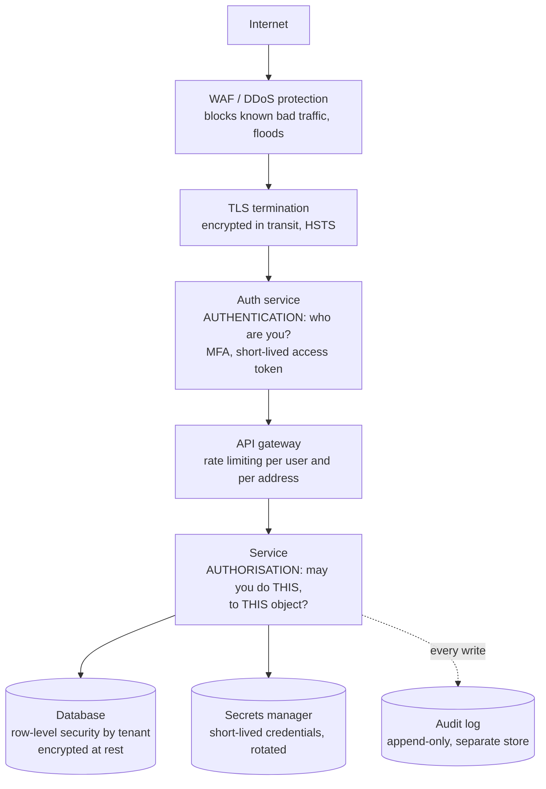

# Security in a design interview

## 1. What this is, and why they ask it

**Security in a design interview is not a separate subject. It is four questions asked about the system you
have already drawn.** **Who are you? What are you allowed to do? Is anybody watching the wire? And what happens
when one part of this is compromised?**

**Two words carry most of it, and candidates run them together.** **Authentication is proving who you are.
Authorisation is deciding what you may do.** **Knowing somebody's name does not entitle them to the
strongroom**, and most real breaches are failures of the second one, not the first.

**And the organising idea is defence in depth.** **You assume every single layer will eventually fail**, and
you arrange things so that no one failure is enough on its own.

They ask it because **almost every design interview ends with "and what about security?"** — often in the last
five minutes, often as a test of whether you have anything at all. **A candidate who says "we would use HTTPS
and hash the passwords" has said the two things everybody says.** **A candidate who says "the token is
short-lived so a leaked one is worth fifteen minutes, and every query is scoped by tenant id because that is
where the real bug always is" has clearly worked on something real.**

**And because it is the area where the gap between knowing the words and knowing the mechanism is widest.**
Everybody has heard of SQL injection. **Far fewer can say what a parameterised statement actually does
differently.**

By the end of this lesson you can give a structured three-minute security answer for any system, store
passwords correctly and say why, choose between sessions and tokens with the trade-off named, list the attacks
that actually happen with the fix for each, and price the things security costs you.

---

## 2. The story

The branch had eleven people in it and one strongroom, and the door of the strongroom had two locks that were
nothing like each other.

**Kannan had the key to one. The manager had the key to the other.** Neither would turn on its own. It had been
built that way, and the bank had built a great many branches that way for a great many years.

What Kannan noticed in his first month was that **the two locks were not really about trust.** Everybody in
that branch trusted everybody else. Devraj, who made the tea and carried the ledgers, had been there thirty-one
years and would sooner have walked into the sea than taken ten rupees. **But Devraj could not open the
strongroom. Neither could Kannan on his own. Neither could the manager.**

He asked about it once, and got an answer he thought was strange at the time.

**"It is not that I do not trust you. It is that if money ever goes missing, I want to be able to say, in front
of everybody, that it could not have been you alone."**

Then, after a moment: **"The lock protects you more than it protects the bank."**

There were other rules and Kannan absorbed them without ever being told why. **Everybody signed the register on
the way in, with the time.** Nobody carried a bag through that door. **And the cash at the counter each morning
was only what the day was expected to need** — everything else stayed behind the two locks, so that whatever
happened at the counter, it could only be that much.

Then the thing that actually taught him something.

**For about four months in his second year, the manager kept his key in the top drawer of his desk.**

It was easier. He was in and out of the strongroom eleven times a day and hunting for the key each time was
tiresome, and the drawer was three feet from where he sat.

**Nothing happened.** No money went missing. Nobody noticed.

**And that was the whole problem, because for four months there had been one lock on that door and not two**,
and the only reason anybody ever found out was that the manager was transferred and the new one asked, on his
first morning, where the second key was kept.

**Nothing went wrong is not the same as nothing was wrong.**

---

## 3. The idea in plain English

**Kannan's branch has almost every idea in this lesson.** **Two locks is separation of duties. The register is
an audit log. The small amount of cash at the counter is blast radius. And the key in the drawer is what
happens to every control that is inconvenient.**

### The two words

```
   AUTHENTICATION  "who are you?"
                   a password, a token, a certificate, a fingerprint
                   -> answered ONCE, at the edge

   AUTHORISATION   "are you allowed to do this?"
                   -> answered EVERY TIME, on every request,
                      for every object
```

**Devraj was thoroughly authenticated — everyone knew exactly who he was — and completely unauthorised.**

**Most real-world breaches are authorisation failures.** The attacker is a perfectly legitimate logged-in user
**who asks for somebody else's data and gets it.** Which is the next idea.

### The bug that actually happens

**It has a name — insecure direct object reference — and it is the single most common serious flaw in real
systems.**

```
   GET /invoices/8812      -> your invoice. Fine.
   GET /invoices/8813      -> somebody else's invoice.

   The user is authenticated. The endpoint checked
   that they are logged in. It never checked that
   invoice 8813 BELONGS to them.
```

**The fix is not "use unguessable ids".** That is hiding, not securing. **The fix is that every read and every
write is scoped by the owner:** `WHERE id = 8813 AND account_id = <the caller's account>`. **The ownership
check is in the same statement as the fetch, so it cannot be forgotten separately.**

**In a multi-tenant system this is the whole ball game.** **Every single query carries the tenant id**, and the
strongest version pushes it below the application entirely — **row-level security in Postgres, so a query
without a tenant filter returns nothing rather than everything.**

### Storing passwords

**Three rules, and the reasons matter more than the rules.**

**Never store the password.** Store a hash of it — a one-way transformation.

**Never use a fast hash.** SHA-256 is designed to be fast, **and fast is exactly wrong here**, because an
attacker with a stolen file can try billions of guesses a second. **Use a deliberately slow function designed
for passwords: bcrypt, scrypt, or Argon2id.**

**Always salt.** A salt is a random value stored alongside the hash and mixed in before hashing. **Without it,
two users with the same password have the same hash** — so one crack breaks both, and precomputed tables of
common passwords work directly. **bcrypt and Argon2 salt automatically; you do not have to remember.**

```
   bcrypt with a work factor of 12 takes about 250 ms
   per hash on ordinary hardware.

   That is deliberate. It is slow for you once per login,
   and catastrophic for an attacker doing it a billion times.
```

**And the work factor is a dial you turn up as hardware gets faster**, which is why the cost is stored inside
the hash string itself.

### Sessions or tokens

**Two ways to remember that somebody logged in.**

```
   SESSION COOKIE
     the client holds a random id
     the SERVER holds the session data
     -> revoking is instant: delete the row
     -> needs shared session storage across machines

   JWT (a signed token)
     the client holds the claims, signed
     the server holds NOTHING
     -> no lookup, scales trivially
     -> CANNOT BE REVOKED before it expires
```

**That last line is the whole trade and it is the answer interviewers want.** **A JWT is valid until it
expires, full stop.** If somebody's account is compromised at 10:00 and you disable it at 10:01, **their token
still works until it expires.**

**So the practical shape is a short-lived access token and a long-lived refresh token.**

```
   access token   15 minutes, a JWT, sent on every request
   refresh token  30 days, stored server-side, revocable

   -> a stolen access token is worth 15 minutes
   -> revoking the refresh token ends the session at the
      next renewal, so within 15 minutes
```

**That is Kannan's counter float. Keep only what the moment needs where it can be taken.**

### Encryption, in two places

**In transit: TLS, everywhere, including inside your own network.** **The old model — a hard shell and a soft
inside — fails the moment anything gets inside**, which it eventually does. **Service-to-service traffic uses
mutual TLS, where both ends present a certificate**, so a service proves what it is and not merely where it is.

**At rest: disk and field.** **Whole-disk or whole-volume encryption is nearly free and protects against a
stolen disk or a decommissioned drive.** **It protects against nothing else** — an attacker with access to your
running application sees decrypted data, because the application has the key.

**Say that limitation out loud**, because "we encrypt at rest" is said constantly by people who think it means
more than it does.

**Field-level encryption is the stronger version**: encrypt specific columns — identity numbers, card details —
with a key held elsewhere. **The cost is that you can no longer index or search those columns**, which is a real
design constraint, not a footnote.

### Secrets

**A secret in the repository is a secret that is public.** Repository history is forever, **and rotating a
leaked key is much harder than never committing it.**

```
   WHERE SECRETS GO
     a secrets manager: HashiCorp Vault, AWS Secrets Manager,
     GCP Secret Manager, Azure Key Vault

   BETTER: no long-lived secret at all
     the machine has an identity (an IAM role, a workload
     identity) and receives short-lived credentials
     automatically, rotated every few hours
```

**The direction of travel is worth stating: fewer secrets, shorter lives, automatic rotation.** **A credential
that lasts an hour needs far less protecting than one that lasts three years.**

### The attacks that actually happen

**Five, with the mechanism of the fix, because naming the attack is not the answer.**

**SQL injection.** Building a query by pasting strings together, so that input can become code.
**The fix is parameterised statements**, and the mechanism matters: **the query text and the values travel to
the database separately, so the value is never parsed as SQL at all.** **Escaping is a weaker fix that people
get wrong; parameterisation makes it structurally impossible.**

**Cross-site scripting.** Attacker-supplied text is rendered as HTML, so their script runs in your users'
browsers. **The fix is encoding on output, in the context you are outputting into** — HTML body, attribute and
JavaScript all need different encoding. **Plus a Content Security Policy, which stops inline scripts running
even if one slips through.** **That is defence in depth in one line.**

**Cross-site request forgery.** Another site makes the user's browser send an authenticated request to yours.
**The fix is `SameSite` cookies, plus a token the other site cannot read.**

**Server-side request forgery.** Your service fetches a URL supplied by a user, and the user supplies an
internal address — the cloud metadata endpoint, for instance, which hands out credentials. **The fix is an
allowlist of destinations, never a blocklist**, and blocking internal address ranges at the network.

**Credential stuffing.** Not a clever attack at all: **passwords leaked from some other site, tried against
yours in bulk.** **The fix is multi-factor authentication, rate limiting per account and per address, and
checking new passwords against known-breached lists.**

### Blast radius, and the key in the drawer

**Assume each layer fails. Ask what the next one stops.**

```
   the edge is breached      -> internal traffic is still
                                authenticated (mTLS)
   a service is compromised  -> its credentials only reach
                                its own data (least privilege)
   the database is dumped    -> passwords are slow-hashed,
                                sensitive fields separately
                                encrypted
   an insider acts alone     -> two people are required for
                                the dangerous operations
```

**And every one of these degrades the way the manager's key degraded.** **Controls that are inconvenient get
worked around, quietly, by well-meaning people, and the system keeps working perfectly the whole time.** **Which
is why the audit log and the periodic review exist** — not to catch thieves, but to notice that the second lock
stopped being a lock four months ago.

---

## 4. The picture

The layers, and what each one stops:



**Read it as a sequence of independent failures.** **The WAF stops the noise. TLS stops the wire. Authentication
answers who. Authorisation answers whether — and that box is where the real bugs live**, because it is the only
one that has to be right on every single request for every single object.

**And notice the audit log is a separate store.** **If the same credentials that write your data can also
rewrite your audit trail, you do not have an audit trail** — you have a log that an attacker edits on the way
out.

Authentication against authorisation, drawn as the mistake:

```
   REQUEST:  GET /invoices/8813
             Authorization: Bearer <valid token for user 41>

   WHAT A BROKEN SERVICE CHECKS:
     [x] is the token valid and unexpired?      YES
     [x] is user 41 a real, active user?        YES
     -> 200 OK, here is invoice 8813

   WHAT IT MUST ALSO CHECK:
     [ ] does invoice 8813 belong to user 41?   NO

   THE FIX, and note where it lives:
     SELECT * FROM invoices
      WHERE id = 8813
        AND account_id = 41      <- in the SAME statement

   Not a separate `if` two lines above. In the query.
   A separate check is a check somebody can forget to write
   on the next endpoint.
```

The password path, and why slowness is the feature:

```
   REGISTER
     password ---> bcrypt(password, random salt, cost 12)
                     ~250 ms
                 ---> $2b$12$<22-char salt><31-char hash>
                          ^   ^      ^
                       algo cost   salt, stored WITH the hash

   LOGIN
     candidate ---> bcrypt with the SAME salt and cost
                ---> compare, in constant time

   WHY SLOW IS THE POINT

     SHA-256, fast:  ~10,000,000,000 guesses/second on a GPU
     bcrypt cost 12: ~4 guesses/second per core

     8 lowercase letters = 26^8 = 208,827,064,576 candidates

     with SHA-256:  208.8e9 / 1e10 = 21 SECONDS
     with bcrypt:   208.8e9 / 4    = 52.2e9 seconds
                                   = about 1,650 YEARS
                                     on one core

   Same password. Same attacker. The only difference is
   the cost of one guess.
```

---

## 5. How it actually works

### Logging somebody in, in practice

**Almost nobody should build this themselves any more, and saying so is a mark of judgement rather than
laziness.**

```
   OAuth 2.0      a framework for DELEGATED ACCESS -
                  "let this app act on my behalf"
   OpenID Connect a thin layer on top of OAuth 2.0 that
                  actually does LOGIN, and returns an
                  ID token saying who the user is

   -> "Sign in with Google" is OIDC.
   -> Managed identity providers: Auth0, Okta, AWS Cognito,
      Firebase Auth, Keycloak if you want to host it.
```

**What you get by not building it: password reset flows that are not vulnerable, MFA, breached-password checks,
device fingerprinting, and somebody else's security team.** **What you give up: control, and a dependency whose
outage stops all logins.**

### Multi-factor authentication

```
   something you KNOW   a password
   something you HAVE   a phone, a hardware key
   something you ARE    a fingerprint, a face

   SMS codes      better than nothing, defeated by SIM swapping
   TOTP apps      good, phishable (the code can be relayed)
   WebAuthn /     BEST: the key is bound to the site's domain,
   passkeys       so a phishing site cannot use it at all
```

**That last point is the one worth knowing.** **WebAuthn is phishing-resistant by construction** — the
credential simply will not produce a signature for the wrong domain, **so it does not rely on the user
noticing anything.**

### Managing keys

**Envelope encryption is how this is actually done, and it is a neat idea.**

```
   1. generate a random DATA key for this record
   2. encrypt the data with the data key
   3. encrypt the DATA KEY with a MASTER key held in a
      key management service (AWS KMS, GCP KMS, Vault)
   4. store the encrypted data and the encrypted data key
      together

   THE MASTER KEY NEVER LEAVES THE KMS.

   Rotating the master key means re-encrypting only the
   small data keys - not terabytes of data.
```

**And the access control on the master key is the real control**: **who may call "decrypt" is a policy, it is
logged, and it can be revoked without touching any data.**

### The audit log

**Different from application logs, and the differences are the point.**

```
   APPLICATION LOG          AUDIT LOG
   ---------------          ---------
   for debugging            for accountability
   sampled, dropped freely  never dropped
   30-day retention         years, often legally mandated
   engineers can write      APPEND-ONLY; nobody can edit
   whatever                 or delete, including admins

   EVERY ENTRY:
     who (the authenticated identity, not the machine)
     what (the action)
     which object (the id)
     when (a trusted clock)
     from where (address, device)
     and the outcome - INCLUDING DENIED ATTEMPTS
```

**Denied attempts are the ones with the most information in them.** **A hundred denials from one account in a
minute is the clearest signal you will ever get**, and a system that only logs successes is blind to exactly
the thing you want to see.

### Least privilege, mechanically

```
   the reporting service can READ the orders table
     -> and cannot write to it
     -> and cannot see the users table at all
   the batch job's credentials expire in 1 hour
   the admin panel requires a second approval for
     refunds over a threshold
```

**Kannan's two locks, generalised.** **The test is not "do we trust this service?" It is "if this service is
completely taken over tonight, what exactly can the attacker reach?"**

### What to do when it goes wrong

**Having an answer here separates people who have been through it.**

```
   1. CONTAIN     revoke credentials, rotate keys, disable
                  the affected path. Before understanding.
   2. PRESERVE    snapshot the logs and the machines before
                  restarting anything - restarting destroys
                  the evidence
   3. ASSESS      what was reachable, what was actually
                  taken, whose data
   4. NOTIFY      regulators and users, inside the legal
                  window - 72 hours under GDPR
   5. FIX         and then the honest question: why did no
                  layer stop this, and which layer had
                  quietly stopped working
```

**Step five is the manager's key in the drawer.** **The interesting finding in most reviews is not that a
control was missing. It is that one existed in the design, and had been bypassed for months** — and everything
kept working the whole time.

---

## 6. The numbers

**Why a slow hash is the whole defence.**

```
   ATTACKER SPEED, on stolen hashes, with a GPU rig:
     MD5           ~ 100,000,000,000 guesses/second
     SHA-256       ~  10,000,000,000 guesses/second
     bcrypt (12)   ~               4 guesses/second/core

   -> bcrypt is roughly 2.5 BILLION times slower per guess.

   AN 8-CHARACTER LOWERCASE PASSWORD:
     26^8 = 208,827,064,576 possibilities

     SHA-256:  208.8e9 / 1e10       =        21 seconds
     bcrypt:   208.8e9 / 4          = 52.2e9 seconds
                                    = 1,655 years (1 core)
               even with 10,000 cores: ~2 months

   ADD TWO CHARACTERS - 10 lowercase letters:
     26^10 = 141,167,095,653,376
     SHA-256: 141.2e12 / 1e10 = 3.9 hours
     bcrypt:  141.2e12 / 4    = 1.1 MILLION years

   -> length beats complexity, by a very long way.
```

**What that costs you at the front door.**

```
   bcrypt cost 12 = ~250 ms of CPU per login

   one core:      4 logins/second
   16-core box:  64 logins/second

   -> 100,000 users all logging in at 9 a.m. over 10 minutes
      = 167 logins/second
      -> you need ~3 such machines JUST for password hashing

   -> AND IT IS A DENIAL-OF-SERVICE VECTOR: an attacker
      sending 1,000 bogus login attempts a second consumes
      250 CPU-seconds per second of wall clock.

   Which is why login endpoints are rate limited separately
   and more strictly than anything else.
```

**Token lifetimes, as blast radius.**

```
   a stolen access token is worth its remaining lifetime

     lifetime 15 min   -> at most 15 minutes of access
     lifetime 24 h     -> a working day
     lifetime 30 days  -> a month, and you cannot stop it

   with 15-minute access tokens and revocable refresh tokens:
     time from "disable this account" to "they are locked out"
     = at most 15 minutes

   with a 30-day JWT and no denylist:
     = 30 days.

   -> The entire argument for short expiry, in one comparison.
```

**Audit log volume, since it is kept for years.**

```
   100,000,000 requests/day, but only WRITES are audited
   say 5% are writes:              5,000,000 events/day
   ~500 bytes per structured entry

   5,000,000 x 500 = 2,500,000,000 bytes = 2.5 GB/day

   7-year retention (a common financial requirement):
     2.5 GB x 365 x 7 = 6,387 GB = ~6.4 TB

   in object storage at $0.023/GB-month:
     6,387 GB x $0.023 = ~$147/month at full size

   -> Cheap, and non-negotiable. Compare with the 720 GB/day
      of application logs, which you sample and delete.
```

**TLS, so you can answer "isn't it expensive?"**

```
   full handshake:      ~1-2 ms of CPU, two round trips (TLS 1.2)
   TLS 1.3:             one round trip
   resumed session:     ~0 round trips, negligible CPU
   bulk encryption:     hardware-accelerated, ~1% overhead

   at 3,500 requests/second with 90% session resumption:
     350 full handshakes/s x 1.5 ms = 0.5 CPU-seconds/second
     -> about half a core.

   -> The "TLS is too slow" objection is twenty years out
      of date, and worth saying so plainly.
```

**Rate limits worth quoting.**

```
   login attempts        5 per account per 15 minutes
                         20 per IP address per minute
   password reset        3 per account per hour
   general API           1,000 per user per minute
   expensive endpoints   10 per user per minute

   -> per ACCOUNT and per ADDRESS, both. Per address alone
      is defeated by a botnet; per account alone lets one
      attacker spray one guess across a million accounts,
      which is exactly how credential stuffing works.
```

---

## 7. The trade-offs

**JWTs buy stateless scale and cost you revocation.**

**No session lookup means any machine can verify a request with only a public key**, which is genuinely
valuable at scale. **The price is that a token is valid until it expires and nothing can stop it.** The
mitigations all reintroduce state: **a denylist of revoked tokens is a lookup on every request, which is the
thing you were avoiding.** **I would use short-lived JWTs with revocable refresh tokens for a large API, and
plain server-side sessions for a normal web application** — where the session store is a Redis lookup nobody
notices and instant revocation is worth having.

**Every security control costs usability, and usability failures become security failures.**

**MFA on every action is more secure and drives people to write codes down.** **Ninety-day password rotation
was industry standard for twenty years and has been withdrawn by NIST**, because it made people pick
`Summer2024!` and then `Autumn2024!`. **The manager's key in the drawer is the general form of this.** **I
would rather have a control people can live with permanently than a stricter one that is quietly bypassed
within six months.**

**Encryption at rest protects against much less than people think.**

**It defends against a stolen disk, a mislaid backup and a badly decommissioned drive. That is the list.** **It
does nothing against a compromised application, because the application holds the key and reads plaintext.**
**Field-level encryption with keys in a separate service is the real defence for sensitive columns, and it
costs you indexing and search on those columns** — which frequently means the feature has to be redesigned.
**I would encrypt whole volumes always, because it is nearly free, and encrypt individual fields only where the
data genuinely warrants losing query ability.**

**A stronger password hash is a denial-of-service surface.**

**bcrypt at cost 12 is 250 milliseconds of CPU that an unauthenticated stranger can make you spend.** **A
thousand bogus logins a second consumes 250 CPU-seconds every second.** **So the login endpoint needs tighter
rate limiting than anything else in the system**, and that limit needs to be per account and per address at
once.

**Rate limiting logins prevents brute force and enables lockout abuse.**

**Locking an account after five failures stops guessing and lets anybody lock anybody else out** by failing
five times against their address. **The better shape is exponential backoff plus a CAPTCHA rather than a hard
lock**, and to count failures per address as well as per account.

**Buying identity is usually right, and it is a dependency.**

**A managed identity provider gives you flows that took other people years to get right.** **The cost is that
if it is down, nobody can log in, including your own staff during the incident.** **I would use one for
almost anything, and I would make sure there is a break-glass path for administrators that does not depend on
it.**

**And the honest limit: none of this survives a determined insider or a supply-chain compromise.**

**Two locks stop one person acting alone; they do not stop two people agreeing.** **A dependency you pulled in
last week can read everything your process can read.** **The answer there is not another control at the edge —
it is least privilege, so that any single compromised component reaches very little, plus an audit trail an
attacker cannot edit.** **I would say plainly that the goal is not preventing all breaches. It is making sure
that no single failure is sufficient, and that you find out.**

---

## 8. In the interview

### How it gets asked

- *"What are the security concerns in this design?"* — the open one, in the last five minutes.
- *"How do you store passwords?"* — and the follow-up is always "why not SHA-256?"
- *"How do you handle authentication between services?"* — mTLS, or signed tokens.
- *"A user's account is compromised. Walk me through what happens."* — revocation, and token lifetime.
- *"How do you stop one customer seeing another customer's data?"* — the tenant question, and the real answer.
- *"What would you log for security purposes?"* — the audit log, and why it is separate.

### The first ninety seconds

On "what are the security concerns in this design":

> "**I would go through it in four layers, because that keeps it structured rather than a list of
> buzzwords.**
>
> **First, identity — authentication.** **Who is making this request?** Login through an identity provider
> using OpenID Connect rather than building it myself, **multi-factor available and mandatory for anything
> privileged, and passwords stored with bcrypt or Argon2id, never a fast hash.** **A short-lived access token —
> fifteen minutes — with a revocable refresh token behind it.**
>
> **Second, permission — authorisation, and this is where the real bugs are.** **Authentication is answered
> once at the edge; authorisation has to be answered on every request for every object.** **The most common
> serious flaw in real systems is that an endpoint checks you are logged in and never checks the thing you
> asked for is yours.** **So the ownership condition goes in the query itself — `WHERE id = ? AND account_id =
> ?` — not in a separate check two lines above, because a separate check is one somebody forgets to write on
> the next endpoint.**
>
> **Third, the data.** **TLS everywhere including between internal services, because a hard shell with a soft
> inside fails the moment anything gets in.** **Volume encryption at rest, which is nearly free — and I would
> be honest that it only protects against a stolen disk, not against a compromised application.** **Field-level
> encryption with keys in a key management service for anything genuinely sensitive, accepting that I lose the
> ability to index those columns.** **And no secrets in the repository — a secrets manager, or better,
> short-lived credentials issued to the machine's own identity.**
>
> **Fourth, the attacks that actually happen.** **Parameterised statements for injection, output encoding plus
> a content security policy for scripting, SameSite cookies for request forgery, an allowlist for anything
> that fetches a user-supplied URL, and rate limiting per account and per address for credential stuffing.**
>
> **And running through all four: assume each layer fails and ask what the next one stops.** **The question I
> keep asking is not 'do we trust this service' but 'if this service is taken over tonight, what exactly can
> the attacker reach?'"**

### The follow-ups

**"How do you store passwords, and why not SHA-256?"**

> "**bcrypt, scrypt or Argon2id, with a salt, and a work factor tuned so one hash takes around a quarter of a
> second.**
>
> **Not SHA-256, and the reason is that SHA-256 is fast, which is exactly the wrong property.** **A GPU rig does
> about ten billion SHA-256 guesses a second.** **An eight-character lowercase password is twenty-six to the
> eighth, about 209 billion possibilities — so twenty-one seconds to try all of them.**
>
> **bcrypt at cost twelve does about four guesses per second per core.** **The same 209 billion candidates take
> around 1,650 years on a core**, and even with ten thousand cores it is a couple of months. **Same password,
> same attacker; the only thing that changed is the cost of one guess.**
>
> **The salt is separate and does a different job.** **It is a random value stored with the hash, so two users
> with the same password get different hashes.** **Without it, one crack breaks every account sharing that
> password, and precomputed tables of common passwords work directly.** **bcrypt and Argon2 handle the salt
> automatically, which is another reason to use them rather than assemble something.**
>
> **The work factor is stored inside the hash string, so it can be raised over time** — you re-hash on next
> login.
>
> **Two things I would add that people miss.** **Compare in constant time**, or the comparison itself leaks
> information. **And this is a denial-of-service surface**: 250 milliseconds of CPU that an unauthenticated
> stranger can make me spend, **so the login endpoint gets stricter rate limiting than anything else in the
> system — per account and per address.**
>
> **And the thing that beats all of it: length.** **Two extra lowercase characters multiply the search space by
> 676**, so the honest advice is a long passphrase and a breached-password check, **rather than complexity
> rules that make people write `Password1!` and rotation policies that make them write `Password2!`.**"

**"A customer says they can see another customer's data. What went wrong, and how do you prevent it?"**

> "**An authorisation check that was never written, almost certainly.** **The user is properly authenticated —
> this is not somebody breaking in, it is a legitimate user asking for an id that is not theirs and being
> given it.**
>
> **The endpoint checked the token was valid and the user was real, and then fetched the record by id without
> checking who owns it.** **It has a name — insecure direct object reference — and it is the most common
> serious flaw in real systems.**
>
> **The fix that does not work is unguessable ids.** **That is hiding, not securing** — the id still leaks
> through a URL somebody shares, a support ticket, a referrer header.
>
> **The fix that works is that ownership is part of the fetch, not a separate step.** `WHERE id = ? AND
> account_id = ?`, **in the same statement**, so there is no version of the code where the fetch succeeded and
> the check was skipped.
>
> **At the design level, the stronger answer is to stop relying on every developer remembering.** **Push the
> tenant filter below the application — row-level security in Postgres, where the session carries the tenant id
> and a query without the filter returns nothing rather than everything.** **The failure mode becomes 'no rows'
> instead of 'somebody else's rows', which is the right direction for a mistake to fail in.**
>
> **Then the response, since it has already happened.** **Contain first: disable the path or revoke the tokens
> before I understand it.** **Preserve the logs and any affected machines before restarting anything, because
> restarting destroys the evidence.** **Then work out from the audit log exactly which records were read and by
> whom — which is only possible if reads of sensitive objects were audited, so that decision has to have been
> made months earlier.** **Then notify, inside the legal window — seventy-two hours under GDPR.**
>
> **And the review question I would want asked afterwards is not 'who wrote the bug'. It is 'what would have
> caught this' — a test that asserts one tenant cannot read another's row, and a default-deny data layer.**"

**"How do services authenticate to each other, and how do you manage the secrets?"**

> "**Mutual TLS, and as few long-lived secrets as I can arrange.**
>
> **For service-to-service, both ends present a certificate, so each side proves what it is rather than merely
> where it is.** **The old model assumed anything inside the network was trustworthy, and that fails completely
> the moment one thing inside is compromised.** **A service mesh — Istio or Linkerd — will issue and rotate
> those certificates automatically, which matters because certificate management by hand is where this falls
> apart.**
>
> **For secrets, the first rule is that nothing goes in the repository.** **History is forever, and rotating a
> leaked key is much harder than never committing it** — so a scanner in continuous integration that fails the
> build on a committed credential is worth having.
>
> **Beyond that, the direction of travel is fewer secrets with shorter lives.** **The best version is no stored
> secret at all: the machine has an identity — an IAM role, a workload identity — and receives credentials
> automatically that expire in an hour.** **A credential that lasts an hour needs far less protecting than one
> that lasts three years.**
>
> **Where a real secret is unavoidable — a third-party key — it lives in a secrets manager, Vault or the cloud
> provider's, with access controlled per service and every read logged.**
>
> **For data keys, envelope encryption.** **Generate a data key per record, encrypt the data with it, encrypt
> the data key with a master key that never leaves the key management service.** **Rotating the master key then
> re-encrypts a few small keys instead of terabytes of data**, and the real control is the policy on who may
> call decrypt — which is logged, and revocable without touching any data.
>
> **Underneath all of it, least privilege.** **The reporting service reads orders and cannot write them and
> cannot see users at all.** **The question is never 'do we trust this service'. It is 'if this is taken over
> tonight, what can the attacker reach?'"**

### The model answer

*"What are the security concerns in this design?"*

> "**I would answer in four layers and then say the thing that ties them together, because otherwise this
> becomes a list of words.**
>
> **Identity.** **Login via an identity provider using OpenID Connect rather than built by me — password reset
> and MFA and breached-password checks are things other people have spent years getting right.** **Passwords,
> where I hold them, in bcrypt or Argon2id with a salt and a quarter-second work factor: SHA-256 falls to a GPU
> in twenty-one seconds for an eight-character password, bcrypt takes over a thousand years on a core.**
> **WebAuthn for anything privileged, because it is phishing-resistant by construction — the credential will
> not sign for the wrong domain, so it does not depend on the user noticing.** **Fifteen-minute access tokens
> with revocable refresh tokens, so a stolen token is worth fifteen minutes and disabling an account takes
> effect within fifteen.**
>
> **Permission, and I would spend the most time here because this is where real breaches are.** **Authentication
> is answered once; authorisation is answered on every request for every object.** **The ownership condition
> goes in the query, not in a check beside it. In a multi-tenant system, row-level security below the
> application, so a missing filter returns nothing instead of everything.** **Least privilege on every service
> credential — read-only where reading is all it does, and no access at all to tables it has no business in.**
> **And separation of duties for the genuinely dangerous operations, so that no single person or single
> credential is sufficient.**
>
> **Data.** **TLS everywhere including internally, with mutual TLS between services and certificates rotated by
> the mesh.** **Volume encryption at rest, which is nearly free — and I would be explicit that it protects
> against a stolen disk and nothing else, because the application holds the key.** **Field-level encryption
> with a key management service for genuinely sensitive columns, accepting that I lose indexing on them.** **No
> secrets in the repository; short-lived credentials from a workload identity wherever possible.**
>
> **Attacks.** **Parameterised statements, so values never reach the parser as code. Output encoding plus a
> content security policy. SameSite cookies. An allowlist for any user-supplied URL the server fetches. Rate
> limiting per account and per address, because per address alone is beaten by a botnet and per account alone
> lets one guess be sprayed across a million accounts.**
>
> **And the audit log, which is not the application log.** **Append-only, in a separate store that the
> application's own credentials cannot rewrite, kept for years — who, what, which object, when, from where,
> and the outcome including denials.** **Denied attempts carry the most signal: a hundred denials from one
> account in a minute is the clearest alert you will ever get.**
>
> **What ties it together is defence in depth, and I would define it as an assumption rather than a slogan.**
> **Every layer will eventually fail. The design question is what the next one stops.** **If the edge is
> breached, internal traffic is still authenticated. If a service is compromised, its credentials reach only
> its own data. If the database is dumped, the passwords are slow-hashed and the sensitive fields are
> separately encrypted.**
>
> **And the failure mode I would want reviewed regularly is not a missing control.** **It is a control that
> exists in the design and was quietly worked around six months ago because it was inconvenient** — and everything
> kept working perfectly the entire time, **which is exactly why nobody noticed.**"

---

## 9. Recall card

**AUTHENTICATION is who you are, answered ONCE at the edge. AUTHORISATION is what you may do, answered ON EVERY
REQUEST FOR EVERY OBJECT — and that is where real breaches live.** The classic bug is **insecure direct object
reference**: a valid user asks for `/invoices/8813` and gets it. **The fix is not unguessable ids (that is
hiding); it is `WHERE id = ? AND account_id = ?` in the SAME statement**, and in multi-tenant systems
**row-level security below the application, so a missing filter returns nothing rather than everything.**

**Passwords: bcrypt / scrypt / Argon2id, salted, ~250 ms per hash. Never a fast hash.** SHA-256 at 10¹⁰
guesses/s cracks an 8-character lowercase password (26⁸ = 209 billion) in **21 seconds**; bcrypt at 4
guesses/s/core takes **~1,650 years**. **The salt stops one crack breaking every shared password.** **Length
beats complexity** — two more characters is ×676. **And 250 ms of CPU a stranger can spend is a DoS vector, so
rate-limit login hardest, per account AND per address.**

**JWT = stateless scale, NO REVOCATION until expiry. Session = a lookup, instant revocation.** The practical
shape: **15-minute access token + revocable refresh token**, so a stolen token is worth 15 minutes and
disabling an account takes effect within 15. **TLS everywhere including internally (mTLS between services) —
a hard shell with a soft inside fails the moment anything gets in.** **Encryption at rest protects against a
stolen disk AND NOTHING ELSE**, because the application holds the key; field-level encryption is the real
defence and **costs you indexing.** **No secrets in the repo — history is forever; prefer short-lived
workload-identity credentials, and envelope encryption with a master key that never leaves the KMS.**

**The five that actually happen, with the mechanism:** **SQL injection → parameterised statements** (query and
values travel separately, so values are never parsed as SQL); **XSS → context-correct output encoding + CSP**;
**CSRF → SameSite cookies + a token**; **SSRF → an allowlist of destinations, never a blocklist**; **credential
stuffing → MFA, per-account and per-address limits, breached-password checks.** **WebAuthn is
phishing-resistant by construction** — it will not sign for the wrong domain.

**Defence in depth is an assumption: every layer will fail; the question is what the next one stops.** Ask **"if
this service is taken over tonight, what can the attacker reach?"** — not "do we trust it". **The audit log is
NOT the application log**: append-only, a separate store the app cannot rewrite, years of retention, and it
records **denied** attempts, which carry the most signal. 5M writes/day × 500 B = **2.5 GB/day, 6.4 TB over
seven years, ~$147/month** — cheap and non-negotiable. **And the finding in most reviews is not a missing
control; it is one that was quietly bypassed months ago while everything kept working.**
