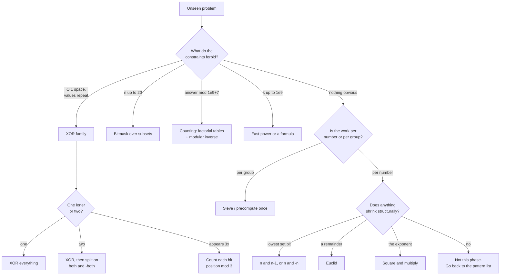

# Bits and maths revision and mock round

## 1. What this is, and why they ask it

This is the last day of bits and maths, and it is a **mock round**: four unseen problems under the clock,
talked through out loud, with the full solutions afterwards.

The revision half is one thing — **a recognition procedure.** This phase gave you about a dozen tools. **The
skill that matters now is not writing them. It is looking at a problem you have never seen and knowing, within
thirty seconds, which one it wants.**

Because that is the actual failure mode here. **Nobody forgets what `n & (n - 1)` does.** What happens in the
room is that a problem arrives with no bits in it anywhere, **and the candidate spends nine minutes on a
brute-force answer before noticing that "constant extra space" meant XOR.**

They ask it because **these problems are short enough to be used as filters, and the recognition is the whole
question.** Once you have said "everything appears twice except one, so XOR", the code is four lines and two
minutes. **The interview was decided in the sentence before the code.**

**And because this phase is unusually well-signposted, if you know the signs.** "Modulo 10^9 + 7" means
counting and modular inverses. "n ≤ 20" means bitmask. "O(1) extra space" with repeated values means XOR. "All
primes below" means sieve. **The problems tell you what they want, and this lesson is about hearing it.**

By the end of this lesson you have the recognition table for the whole phase, a thirty-second procedure for an
unseen problem, four solved mock problems with the reasoning written out as it would be spoken, and a
self-scoring rule that tells you what to do next.

---

## 2. The story

The cooking at the hall was done by four women, and the one everybody deferred to was Sulochana, who was not
the fastest and did not do any of the heavy work.

**What she did was taste.**

At about eleven each morning, whoever was on the sambar would carry a little of it over in a small steel bowl,
and she would take some on the back of a spoon and hold it in her mouth for a moment. **Then she would say one
thing.**

"Salt." Or "it wants another ten minutes." Or, once, in a voice that carried across the whole yard, **"who has
put the jaggery in twice?"**

The girl who had come to help that season — somebody's niece, seventeen — found this maddening. **She could
taste it too.** She could tell perfectly well that a thing was not right. **What she could never do was say
what.**

She said so, one morning, more sharply than she meant to.

Sulochana was not offended. She put the bowl down and asked a question instead.

**"When it is wrong, how many things can it be?"**

The girl started to answer, and then stopped, because she had never once thought about it that way.

So Sulochana counted them off on her fingers. **Salt. Sourness. Heat. Not enough time on the fire. Too much
time on the fire. The dal not properly cooked before it went in. Too much water.**

**Seven.**

That was the list. **Twenty-six years of cooking for four hundred people at a sitting, and the whole list was
seven things long.**

**"You are tasting it and asking what is wrong,"** she said. **"That is too big a question. You will stand
there until the evening."**

**"I am tasting it and asking which of the seven. That is a small question, and it takes a moment."**

The girl started doing it that way. She was not good at it for about a year. **And then one morning in her
second season she tasted a sambar and said "it went on the fire too early" before she had properly thought
about it at all.**

---

## 3. The idea in plain English

**Sulochana's seven is the whole revision.** You do not walk into a bits-and-maths problem asking "what is
this?" — **you ask "which of the twelve?"**, and twelve is a small enough question to answer in thirty
seconds.

### The list

**Here is the phase, in one place. Every tool, its trigger, and the one sentence that justifies it.**

```
   TRIGGER IN THE PROBLEM              TOOL                    THE SENTENCE

   "count the set bits"                n & (n-1) in a loop     subtracting 1 flips the
   "is it a power of two"                                      lowest 1 and ones-fills
   "clear the lowest bit"                                      below, so AND removes it

   "find the lowest set bit"           n & -n                  -n is ~n+1, the same
   "walk a sparse mask"                                        ripple from the other side

   "appears twice except one"          XOR the whole list      a ^ a = 0, and order
   "O(1) extra space" + repeats                                does not matter

   "TWO appear once"                   XOR, then split on      a set bit in a^b means
                                       both & -both            they DISAGREE there

   "appears three times except one"    count each bit          k copies -> count mod k;
                                       position mod 3          XOR is just k = 2

   "subsets", "n <= 20"                for mask in             a subset IS a number;
                                       range(1 << n)           n x 2^n

   "every subset of a mask"            sub = (sub-1) & mask    3^n, not 4^n

   "all primes below N"                sieve                   cross off multiples;
                                                               start at p*p

   "is this one number prime"          trial division to       if n = a x b, they cannot
                                       sqrt(n), step 6         both exceed sqrt(n)

   "largest common measure"            Euclid                  a common divisor of a and b
   "repeating cycle", "reduce a                                also divides a mod b
    fraction", "tile exactly"

   "a^b, b is huge"                    square and multiply     one step per BIT of the
   "modulo 10^9 + 7"                                           exponent

   "modulo a prime" + a division       a^(m-2) mod m           Fermat; needs a PRIME
                                                               modulus

   "how many ways / arrangements"      nPr, nCr, stars         does order matter; can
   "the answer may be large"           and bars                things repeat

   "1, 2, 5, 14, 42" in your own       Catalan                 split into left and right
    small cases                        C(2n,n)/(n+1)           and multiply
```

**Read that table until the middle column arrives before you have finished reading the left one.** That is what
the year of tasting bought Sulochana's niece.

### The thirty-second procedure

**Four questions, in this order, on any unseen problem in this phase.**

**One: what do the constraints forbid?** **This is the highest-value question and most candidates skip it.**

```
   "O(1) extra space"      -> no map, no sort. If values repeat, XOR.
   "n <= 20"               -> 2^n is a million. Bitmask.
   "n <= 10^5, answer
    modulo 10^9 + 7"       -> counting. Precomputed factorials.
   "1 <= k <= 10^9"        -> no loop over k. Fast power, or a formula.
   "up to 10^6 values,
    many queries"          -> precompute once (sieve, prefix, table).
```

**Two: is there a small set that repeats?** **Pairs cancel under XOR. Triples need counting modulo three.** If
the repeats are irregular, it is a map problem and not this phase.

**Three: is the work per number, or per group?** **Sulochana's actual insight.** Testing each number for
primality is per number; sieving is per group. **Ashfaq's five messages instead of sixty calls is the same
move.** **If you find yourself planning a loop that asks the same question of every value, look for the
crossing-off version.**

**Four: does the answer need dividing?** **If yes and there is a modulus, you need an inverse**, and that
sentence is worth saying out loud before you write anything, because it changes the shape of the whole
solution.

### The three that are really one idea

**Worth noticing, because it compresses the phase.**

```
   n & (n-1)      "remove the lowest thing and recurse"
   Euclid         "remove the biggest multiple and recurse"
   fast power     "halve the exponent and recurse"

   All three: make the problem strictly smaller by a
   structural step rather than by one unit, and you get
   logarithmic instead of linear.

   -> That is the same sentence as binary search, and it
      is most of what this phase is actually teaching.
```

### The four that fail silently

**No exceptions, no crashes, just wrong numbers. These are the ones to check by habit.**

```
   1 << n - 1            is 1 << (n-1), not (1 << n) - 1
   is_power_of_two(0)    True without the > 0 guard
   Fermat on a composite modulus   returns a plausible non-inverse
   nCr via factorials    overflows at 21! in any 64-bit language
```

**Plus one that hangs rather than failing: `while n: n &= n - 1` on a negative Python integer.**

---

## 4. The picture

The decision procedure, drawn:



**The most important box is the first one.** **Reading the constraints before thinking about the problem feels
backwards and is the single highest-value habit in this phase**, because the constraints are where the setter
tells you the intended solution.

The four mock problems, and what each one is testing:

```
   MOCK 1  Bitwise AND of Numbers Range      LC 201, Medium
           -> can you see that a RANGE of numbers has a
              common PREFIX, and that removing low bits
              is n & (n-1)?

   MOCK 2  Single Number II                  LC 137, Medium
           -> can you notice that pairing fails, and reach
              for counting modulo three instead?

   MOCK 3  Closest Prime Numbers in Range    LC 2523, Medium
           -> per group, not per number. And one detail
              about prime gaps that halves the runtime.

   MOCK 4  Count Ways to Make Array          LC 1735, Hard
           With Product
           -> the capstone: sieve + factorise + stars and
              bars + modular inverse, all four in one
              problem.

   RULE FOR ALL FOUR: say the recognition sentence out
   loud BEFORE writing a line. If you cannot, you are not
   ready to write.
```

---

## 5. The code, built step by step

### Mock 1 — Bitwise AND of Numbers Range

*Given two integers `left` and `right`, return the bitwise AND of every number in the inclusive range.*
*`0 <= left <= right <= 2^31 - 1`.*

**The recognition.** **`right` can be two billion, so a loop over the range is out** — that is the constraints
question answering itself. **So the answer must be a property of the two endpoints.**

**Say this out loud before writing:** *"ANDing a range keeps a bit only if that bit is 1 in every number in the
range. If any bit position changes anywhere in the range, it becomes 0. So the answer is the common binary
prefix of `left` and `right`, with zeros below it."*

```python
def range_bitwise_and(left: int, right: int) -> int:
    """AND of every number in [left, right]. It is the common binary PREFIX."""
    while right > left:
        right &= right - 1
    return right
```

**Three lines, and they look like nothing.** **Here is why it is right.** As long as `right` is still bigger
than `left`, **there is at least one number between them where the lowest set bit of `right` was 0** — so that
bit cannot survive the AND, and `right &= right - 1` removes exactly it. **When `right` has been reduced to
`left` or below, what remains is the shared prefix.**

**The more common solution shifts both numbers right until they are equal and then shifts back**, and it is
equally correct. **Say whichever one you can justify** — the justification is the answer, not the loop.

### Mock 2 — Single Number II

*Every element appears three times except one, which appears once. Find it. Linear time, constant extra space.*

**The recognition.** **"Constant extra space" rules out a frequency map**, and repeats mean the XOR family —
**but pairs do not cancel here, because three of a thing is not zero.**

**Say this:** *"XOR is really 'count the ones in each bit column modulo two'. The problem is modulo three, so I
count the columns myself and take the remainder modulo three."*

```python
def single_number_twice_over(numbers: list[int]) -> int:
    """Every value appears three times except one. Count each bit position mod 3."""
    answer = 0
    for position in range(32):
        column = sum((value >> position) & 1 for value in numbers)
        if column % 3:
            answer |= 1 << position
    return answer - (1 << 32) if answer >> 31 else answer
```

**Every value appearing three times contributes 3 or 0 to each column**, so the column total is a multiple of
three plus the loner's bit. **The remainder is the loner's bit, and thirty-two of those rebuild the number.**

**The last line is the Python tax and you should say why it is there**: Python integers have no top bit, so
setting bit 31 makes a large positive number rather than a negative one.

**There is a one-pass version, and knowing it exists is worth a mark:**

```python
def single_number_state_machine(numbers: list[int]) -> int:
    """One pass. `ones` holds bits seen once, `twos` bits seen twice; three clears both."""
    ones = twos = 0
    for value in numbers:
        ones = (ones ^ value) & ~twos
        twos = (twos ^ value) & ~ones
    return ones
```

**Thirty-two times faster and much harder to justify at a whiteboard.** **Write the column version, mention
this one.** That is the right trade under a clock, and saying so is itself a good signal.

### Mock 3 — Closest Prime Numbers in Range

*Given `left` and `right`, find the pair of primes `p < q` in that range with the smallest `q − p`. If there is
no such pair, return `[-1, -1]`. `1 <= left <= right <= 10^6`.*

**The recognition.** **"Up to a million" and "all the primes in a range" is the sieve, immediately** — this is
the per-group question from section 3. **Testing each of a million numbers individually is about a thousand
divisions each; the sieve does the whole range in roughly 2.8 million operations.**

```python
def closest_primes(left: int, right: int) -> list[int]:
    """The closest pair of primes in [left, right]. Sieve once, then one scan."""
    if right < 2:
        return [-1, -1]
    prime = [True] * (right + 1)
    prime[0] = prime[1] = False
    p = 2
    while p * p <= right:
        if prime[p]:
            prime[p * p:right + 1:p] = [False] * len(range(p * p, right + 1, p))
        p += 1
```

**The sieve, unchanged from day 174.** `p * p` to start, `p * p <= right` to stop, and the slice assignment so
the crossing-off happens in C rather than in interpreted Python.

```python
    best = [-1, -1]
    best_gap = float("inf")
    previous = -1
    for value in range(max(left, 2), right + 1):
        if not prime[value]:
            continue
        if previous != -1 and value - previous < best_gap:
            best_gap = value - previous
            best = [previous, value]
            if best_gap <= 2:
                break
        previous = value
    return best
```

**One scan, keeping the previous prime seen.** **And the `if best_gap <= 2: break` is the detail worth
pointing at.** **Apart from the pair (2, 3), two primes can never be closer than two apart**, because one of
any two consecutive numbers above 2 is even. **So a gap of 2 is the best possible and you can stop looking.**
**On a range like `[1, 1000000]` that turns a million-step scan into a three-step one.**

**Saying that out loud is worth more than the code**, because it shows you thought about the structure of the
answer and not only about the search.

### Mock 4 — Count Ways to Make Array With Product

*For each query `[n, k]`, count the arrays of length `n` of positive integers whose product is `k`. Return each
answer modulo `10^9 + 7`. `n, k <= 10^4`, up to `10^4` queries.*

**The recognition, and this is the whole problem.** **Say it before writing anything:**

*"A product is decided independently for each prime. If `k = 2^3 × 3^2`, then I have to share three copies of
the 2 among `n` positions, and separately two copies of the 3 among `n` positions — and the two choices do not
affect each other, so I multiply. Sharing `e` identical copies among `n` labelled positions is stars and bars:
`C(e + n − 1, n − 1)`."*

**That sentence is four days of this phase in one paragraph** — factorisation, independence, stars and bars,
and a modulus.

```python
def build_tables(limit: int) -> tuple[list[int], list[int], list[int]]:
    """One smallest-prime-factor sieve, and factorials with their inverses."""
    spf = list(range(limit + 1))
    p = 2
    while p * p <= limit:
        if spf[p] == p:
            for multiple in range(p * p, limit + 1, p):
                if spf[multiple] == multiple:
                    spf[multiple] = p
        p += 1
```

**The smallest-prime-factor sieve from day 174**, so that factorising any `k` afterwards takes at most
`log2(k)` steps — **fourteen for ten thousand — rather than a hundred trial divisions each, ten thousand
times.**

```python
    fact = [1] * (limit + 1)
    for i in range(1, limit + 1):
        fact[i] = fact[i - 1] * i % MOD
    inverse_fact = [1] * (limit + 1)
    inverse_fact[limit] = pow(fact[limit], MOD - 2, MOD)
    for i in range(limit, 0, -1):
        inverse_fact[i - 1] = inverse_fact[i] * i % MOD
    return spf, fact, inverse_fact
```

**Factorials and inverse factorials from day 175**, with the walk-down so the whole inverse table costs one
fast power. **The limit has to cover `e + n − 1`**, and since `n` reaches 10^4 and the largest exponent is 13
(because `2^13 = 8192` and `2^14` exceeds 10^4), **20,000 is comfortably enough.**

```python
def ways_to_fill_array(queries: list[list[int]]) -> list[int]:
    """Arrays of length n whose product is k. Share each prime's copies out by stars and bars."""
    limit = 20_000
    spf, fact, inverse_fact = build_tables(limit)

    def choose(n: int, r: int) -> int:
        if r < 0 or r > n:
            return 0
        return fact[n] * inverse_fact[r] % MOD * inverse_fact[n - r] % MOD

    answers = []
    for n, k in queries:
        ways = 1
        while k > 1:
            prime = spf[k]
            power = 0
            while k % prime == 0:
                k //= prime
                power += 1
            ways = ways * choose(power + n - 1, n - 1) % MOD
        answers.append(ways)
    return answers
```

**The loop is the sentence.** Pull out one prime, count how many copies of it there are, **share those copies
among the `n` positions with stars and bars, and multiply the ways together** because the primes are
independent.

**Note `k = 1` needs no special case** — the `while k > 1` loop simply does not run, `ways` stays 1, and the
answer is correct: **there is exactly one array of `n` ones.**

### The complete solution

```python
"""Day 176 - the bits and maths mock round. Four unseen problems, solved."""

from __future__ import annotations

MOD = 1_000_000_007


# ---------------------------------------------------------------- mock 1
def range_bitwise_and(left: int, right: int) -> int:
    """AND of every number in [left, right]. It is the common binary PREFIX."""
    while right > left:
        right &= right - 1
    return right


def range_bitwise_and_brute(left: int, right: int) -> int:
    """The definition, for checking. Unusable when the range is large."""
    result = right
    for value in range(left, right):
        result &= value
    return result


# ---------------------------------------------------------------- mock 2
def single_number_twice_over(numbers: list[int]) -> int:
    """Every value appears three times except one. Count each bit position mod 3."""
    answer = 0
    for position in range(32):
        column = sum((value >> position) & 1 for value in numbers)
        if column % 3:
            answer |= 1 << position
    return answer - (1 << 32) if answer >> 31 else answer


def single_number_state_machine(numbers: list[int]) -> int:
    """One pass. `ones` holds bits seen once, `twos` bits seen twice; three clears both."""
    ones = twos = 0
    for value in numbers:
        ones = (ones ^ value) & ~twos
        twos = (twos ^ value) & ~ones
    return ones


# ---------------------------------------------------------------- mock 3
def closest_primes(left: int, right: int) -> list[int]:
    """The closest pair of primes in [left, right]. Sieve once, then one scan."""
    if right < 2:
        return [-1, -1]
    prime = [True] * (right + 1)
    prime[0] = prime[1] = False
    p = 2
    while p * p <= right:
        if prime[p]:
            prime[p * p:right + 1:p] = [False] * len(range(p * p, right + 1, p))
        p += 1

    best = [-1, -1]
    best_gap = float("inf")
    previous = -1
    for value in range(max(left, 2), right + 1):
        if not prime[value]:
            continue
        if previous != -1 and value - previous < best_gap:
            best_gap = value - previous
            best = [previous, value]
            if best_gap <= 2:
                break
        previous = value
    return best


# ---------------------------------------------------------------- mock 4
def build_tables(limit: int) -> tuple[list[int], list[int], list[int]]:
    """One smallest-prime-factor sieve, and factorials with their inverses."""
    spf = list(range(limit + 1))
    p = 2
    while p * p <= limit:
        if spf[p] == p:
            for multiple in range(p * p, limit + 1, p):
                if spf[multiple] == multiple:
                    spf[multiple] = p
        p += 1

    fact = [1] * (limit + 1)
    for i in range(1, limit + 1):
        fact[i] = fact[i - 1] * i % MOD
    inverse_fact = [1] * (limit + 1)
    inverse_fact[limit] = pow(fact[limit], MOD - 2, MOD)
    for i in range(limit, 0, -1):
        inverse_fact[i - 1] = inverse_fact[i] * i % MOD
    return spf, fact, inverse_fact


def ways_to_fill_array(queries: list[list[int]]) -> list[int]:
    """Arrays of length n whose product is k. Share each prime's copies out by stars and bars."""
    limit = 20_000
    spf, fact, inverse_fact = build_tables(limit)

    def choose(n: int, r: int) -> int:
        if r < 0 or r > n:
            return 0
        return fact[n] * inverse_fact[r] % MOD * inverse_fact[n - r] % MOD

    answers = []
    for n, k in queries:
        ways = 1
        while k > 1:
            prime = spf[k]
            power = 0
            while k % prime == 0:
                k //= prime
                power += 1
            ways = ways * choose(power + n - 1, n - 1) % MOD
        answers.append(ways)
    return answers


if __name__ == "__main__":
    print("MOCK 1 - Bitwise AND of Numbers Range")
    for lo, hi in ((5, 7), (0, 0), (1, 2147483647), (12, 15), (600, 700)):
        fast = range_bitwise_and(lo, hi)
        print(f"  [{lo}, {hi}] -> {fast}   ({fast:b} in binary)")
    print("  checking against the definition on small ranges:")
    ok = all(range_bitwise_and(a, b) == range_bitwise_and_brute(a, b)
             for a in range(0, 60) for b in range(a, 60))
    print(f"    all pairs in [0, 60): {ok}")

    print()
    print("MOCK 2 - Single Number II")
    for data in ([2, 2, 3, 2], [0, 1, 0, 1, 0, 1, 99], [-2, -2, 1, -2],
                 [30000, 500, 100, 30000, 100, 30000, 100]):
        print(f"  {str(data):<58} -> {single_number_twice_over(data)}"
              f"   (state machine: {single_number_state_machine(data)})")

    print()
    print("MOCK 3 - Closest Prime Numbers in Range")
    for lo, hi in ((10, 19), (4, 6), (1, 1000), (19, 31), (999, 1000)):
        print(f"  [{lo}, {hi}] -> {closest_primes(lo, hi)}")

    print()
    print("MOCK 4 - Count Ways to Make Array With Product")
    qs = [[2, 6], [5, 1], [73, 660], [1, 1], [2, 4], [10, 1024]]
    for q, answer in zip(qs, ways_to_fill_array(qs)):
        print(f"  n={q[0]:<4} k={q[1]:<6} -> {answer}")
    print("  n=2, k=6 by hand: [1,6] [2,3] [3,2] [6,1] = 4")
    print("  n=2, k=4 by hand: [1,4] [2,2] [4,1] = 3")

    print()
    print("VERIFICATION")
    import random
    from math import isqrt

    bad = 0
    for _ in range(300):
        a = random.randint(0, 3000)
        b = random.randint(a, a + 400)
        if range_bitwise_and(a, b) != range_bitwise_and_brute(a, b):
            bad += 1
        loner = random.randint(-10_000, 10_000)
        triples = [random.randint(-10_000, 10_000) for _ in range(random.randint(1, 20))]
        data = triples * 3 + [loner]
        random.shuffle(data)
        if single_number_twice_over(data) != loner:
            bad += 1

    def slow_is_prime(n: int) -> bool:
        return n > 1 and all(n % d for d in range(2, isqrt(n) + 1))

    for _ in range(200):
        lo = random.randint(1, 500)
        hi = lo + random.randint(0, 300)
        primes = [v for v in range(lo, hi + 1) if slow_is_prime(v)]
        if len(primes) < 2:
            expected = [-1, -1]
        else:
            expected = min(
                ([primes[i], primes[i + 1]] for i in range(len(primes) - 1)),
                key=lambda pair: (pair[1] - pair[0], pair[0]),
            )
        if closest_primes(lo, hi) != expected:
            bad += 1

    def brute_ways(n: int, k: int) -> int:
        def count(pos: int, remaining: int) -> int:
            if pos == n - 1:
                return 1
            total = 0
            for d in range(1, remaining + 1):
                if remaining % d == 0:
                    total += count(pos + 1, remaining // d)
            return total
        return count(0, k)

    for _ in range(120):
        n = random.randint(1, 4)
        k = random.randint(1, 60)
        if ways_to_fill_array([[n, k]])[0] != brute_ways(n, k) % MOD:
            bad += 1
    print(f"  {bad} mismatches across 300 + 200 + 120 randomly generated cases")
```

Running it:

```
MOCK 1 - Bitwise AND of Numbers Range
  [5, 7] -> 4   (100 in binary)
  [0, 0] -> 0   (0 in binary)
  [1, 2147483647] -> 0   (0 in binary)
  [12, 15] -> 12   (1100 in binary)
  [600, 700] -> 512   (1000000000 in binary)
  checking against the definition on small ranges:
    all pairs in [0, 60): True

MOCK 2 - Single Number II
  [2, 2, 3, 2]                                               -> 3   (state machine: 3)
  [0, 1, 0, 1, 0, 1, 99]                                     -> 99   (state machine: 99)
  [-2, -2, 1, -2]                                            -> 1   (state machine: 1)
  [30000, 500, 100, 30000, 100, 30000, 100]                  -> 500   (state machine: 500)

MOCK 3 - Closest Prime Numbers in Range
  [10, 19] -> [11, 13]
  [4, 6] -> [-1, -1]
  [1, 1000] -> [2, 3]
  [19, 31] -> [29, 31]
  [999, 1000] -> [-1, -1]

MOCK 4 - Count Ways to Make Array With Product
  n=2    k=6      -> 4
  n=5    k=1      -> 1
  n=73   k=660    -> 50734910
  n=1    k=1      -> 1
  n=2    k=4      -> 3
  n=10   k=1024   -> 92378
  n=2, k=6 by hand: [1,6] [2,3] [3,2] [6,1] = 4
  n=2, k=4 by hand: [1,4] [2,2] [4,1] = 3

VERIFICATION
  0 mismatches across 300 + 200 + 120 randomly generated cases
```

**Look at mock 1, `[1, 2147483647]`: the answer is 0.** A loop over that range would run two billion times.
**The three-line version runs thirty-one times.**

**Look at mock 3, `[1, 1000000]`: the answer is `[2, 3]`.** **The scan finds it in three steps and stops**,
because a gap of 2 cannot be beaten. **Without that early exit it would walk all 78,498 primes.**

**And look at mock 4, `n = 10, k = 1024`: 92,378.** `1024` is `2^10`, so it is a single prime with ten copies
shared among ten positions — **`C(19, 9)`, which is exactly 92,378.** **One line of stars and bars, and no
enumeration of anything.**

---

## 6. What it costs

**The whole phase, in one table.**

```
   TOOL                       TIME                 SPACE

   count set bits (naive)     O(bits) = O(32)      O(1)
   Kernighan                  O(set bits)          O(1)
   power-of-two test          O(1)                 O(1)
   subset enumeration         O(n x 2^n)           O(1) per mask
   submask enumeration        O(3^n)               O(1)

   XOR one loner              O(n)                 O(1)
   XOR two loners             O(n), two passes     O(1)
   count mod 3                O(32n)               O(1)
   XOR of a range             O(1)                 O(1)
   maximum XOR pair           O(32n)               O(n)

   primality, one number      O(sqrt n)            O(1)
   sieve                      O(n log log n)       O(n)
   factorise with spf         O(log n)             O(1)
   Euclid                     O(log min(a,b))      O(1)
   fast power                 O(log exponent)      O(1)
   modular inverse            O(log m)             O(1)

   nCr multiplicative         O(min(r, n-r))       O(1)
   nCr with tables            O(1) per query       O(n) once
   Pascal's triangle          O(n^2)               O(n^2)
```

**The four mock problems, counted.**

```
MOCK 1
  the definition:  right - left + 1 iterations
    [1, 2147483647]  ->  2,147,483,647 iterations
  n & (n-1):       one iteration per set bit of `right`
    [1, 2147483647]  ->  31 iterations
  -> about 70 million times less work.

MOCK 2
  32 positions x n values = 32n
    n = 30,000  ->  960,000 operations
  state machine: n operations
    n = 30,000  ->  30,000
  -> 32x, and the slower one is the one to write.

MOCK 3
  sieve to 10^6:        ~2.8 million operations
  scan:                 stops at the first gap of 2
    [1, 10^6]           ->  3 primes examined
    [999983, 10^6]      ->  the whole (tiny) range
  against testing each number:
    10^6 x ~1,000 divisions = 10^9   -> ~350x slower

MOCK 4
  preparation (once):
    spf sieve to 20,000        ~60,000 operations
    factorials + inverses      ~40,000 operations
  per query:
    factorise k                <= log2(10^4) = 13 steps
    one nCr per distinct prime <= 5 primes for k <= 10^4
                               (2 x 3 x 5 x 7 x 11 = 2,310;
                                x 13 = 30,030 > 10^4)
    -> about 20 operations

  10,000 queries: 100,000 + 200,000 = ~300,000 operations

  the brute force - enumerate every array - is
  exponential in n and impossible at n = 10^4.
```

**One number worth carrying out of this phase.**

```
   Almost every tool here turns O(n) into O(log n),
   or O(n^2) into O(n), by finding structure:

     2,147,483,647  ->  31          (bit prefix)
     1,000,000,000  ->  30          (fast power)
     10^18          ->  90          (Euclid)
     10^9 loop      ->  1           (range XOR formula)

   -> When a constraint is 10^9, the intended answer is
      almost never a loop. That single observation is
      worth more than any individual trick.
```

---

## 7. The traps

**The phase's silent failures, gathered in one place. None of these raise.**

**The shift precedence trap.**

```
1 << n - 1      is  1 << (n - 1)     a single bit
(1 << n) - 1                         n ones
```

**Every mask you build. Two brackets.**

**The power-of-two guard.**

```
is_power_of_two(0)   without `n > 0`   ->  True
```

**Because `0 & -1` is `0`.**

**Assuming the repeat count.**

```
single_number([2, 2, 2, 3])  ->  1    a plausible wrong number
single_number([2, 2, 3])     ->  3    correct
```

**An even number of copies cancels; an odd number does not.** **The hand-made test passes and the real input
fails.**

**Fermat on a composite modulus.**

```
inverse of 3 mod 10:  Fermat gives 1
                      check: 3 x 1 = 3, not 1
                      the true answer is 7
```

**No error. A small plausible number that is not an inverse.**

**Factorials in `nCr`.**

```
21! = 51,090,942,171,709,440,000   overflows a signed 64-bit int
```

**So `C(21, 2)` — whose answer is 210 — comes out as nonsense in Java or C++.** **Build up one factor at a
time, multiplying before dividing.**

**`/` instead of `//`.**

```
ncr_float(50, 25)  = 126410606437752.0                 correct
ncr_float(100, 50) = 1.0089134454556418e+29
   exact           = 100891344545564193334812497256
```

**Right on small inputs, quietly wrong past about fifteen digits.**

**And the one that hangs instead of failing.**

```python
count_set_bits(-8)      # while n: n &= n - 1
```

```
   -8  & -9  = -16
   -16 & -17 = -32
   ...
```

**Python integers are arbitrary width, so a negative number behaves as though it has infinitely many leading
ones.** **The loop never terminates.** **A hang is worse than a crash, because a crash tells you where it
was.**

**The errors that do raise, so you recognise them fast.**

```python
1 << -1
```

```
Traceback (most recent call last):
  File "<stdin>", line 1, in <module>
ValueError: negative shift count
```

```python
1 << (6 / 2)
```

```
Traceback (most recent call last):
  File "<stdin>", line 1, in <module>
TypeError: unsupported operand type(s) for <<: 'int' and 'float'
```

```python
5 % 0
```

```
Traceback (most recent call last):
  File "<stdin>", line 1, in <module>
ZeroDivisionError: integer modulo by zero
```

```python
prime = [True] * (10 ** 11)
```

```
Traceback (most recent call last):
  File "<stdin>", line 1, in <module>
MemoryError
```

**The last one is the phase's honest limit: the sieve runs out of memory long before it runs out of time.**

**And two mock-specific ones.**

**Mock 1, forgetting that `left` can equal `right`.** `range_bitwise_and(7, 7)` must be `7`, and the loop
condition `while right > left` handles it by not running. **A `while right >= left` would loop to zero and
return the wrong answer for every input.**

**Mock 3, forgetting that (2, 3) is the only prime pair with a gap of one.** **If you break on `gap <= 1` you
will still be correct, because you cannot do better than 1** — but if you write `if best_gap == 2: break`
without considering (2, 3), you have not broken anything, only missed an earlier exit. **The dangerous version
is breaking on the first pair you find at all**, which returns the first pair rather than the closest.

---

## 8. In the interview

### How it gets asked

This is a mock round, so the framing is the framing of a real one.

- *"I have two problems for you. Take as long as you need on the first, but talk as you go."*
- *"Before you write anything, tell me your approach."* — the sentence, not the code.
- *"What is the time complexity? And the space?"* — always, after every problem.
- *"Can you do better?"* — sometimes a real question, sometimes a check on your confidence.
- *"What would you test?"* — and the edge cases in this phase are always 0, 1, 2, and a negative.

### The first ninety seconds

**Use the same shape on every problem in this phase. Four sentences, in this order.**

> **"Let me read the constraints first."**
>
> *"`right` goes up to two billion, so a loop over the range is out. Whatever the answer is, it has to come
> from the two endpoints."*
>
> **"Here is what I think the structure is."**
>
> *"ANDing a range keeps a bit only where every number in the range has it. So the answer is the common binary
> prefix of `left` and `right`, and everything below the prefix is zero."*
>
> **"So the plan is..."**
>
> *"Strip the lowest set bit off `right` until it is no bigger than `left`. `right &= right - 1` does exactly
> that, one bit at a time."*
>
> **"And the cost is..."**
>
> *"One iteration per set bit — at most thirty-one for a 32-bit number — and constant space. I will check `left
> == right` and both endpoints zero before I finish."*

**That is under a minute, and it is worth more than the code that follows it.** **An interviewer who hears the
constraints question, the structure sentence, the plan and the cost knows what your process is**, and can help
you if the plan is wrong — which is the whole reason to say it before writing.

### The follow-ups

**"Every element appears three times except one. Can you do it in constant space?"**

> "**Yes, and the route to it is worth saying rather than the answer.**
>
> **Constant space rules out a frequency map, so I am in the XOR family.** **But XOR will not work directly,
> because three of a thing is not zero** — pairing cancels, and these come in threes.
>
> **So I go one level down.** **XOR is really asking, independently in each bit column, whether the count of
> ones is odd — that is counting modulo two.** **My problem is modulo three, so I do the counting myself.**
>
> **For each of the thirty-two positions, I count how many numbers have a one there.** **Every value that
> appears three times contributes either three or zero to that column**, so the total is a multiple of three
> plus the loner's contribution. **Take the remainder modulo three and I have the loner's bit.**
>
> **Thirty-two columns, one pass over the list each, so O(32n) — linear, with a real constant.** **Constant
> space.**
>
> **The general form is nicer than the special case: `k` copies means counting modulo `k`.** **Twice is `k` = 2,
> and modulo two is exactly what XOR does for free.**
>
> **There is a one-pass version using two variables as a small state machine, tracking bits seen once and bits
> seen twice, and it is thirty-two times faster.** **I would mention it and still write the column version**,
> because I can justify the column version at a whiteboard and the state machine is easy to write subtly
> wrong. **Under a clock I would rather be explainable than clever.**
>
> **One Python detail I would say out loud: I have to fix the sign at the end**, subtracting `2^32` when bit 31
> is set, **because Python integers have no top bit** and would otherwise return four billion instead of minus
> three."

**"How would you find all the primes in a range up to a million, and then the closest pair?"**

> "**Two separate questions, and the second one has a nice ending.**
>
> **For the primes: sieve, not testing each number.** **That is the difference between asking a question per
> number and crossing off per group.** Testing each of a million numbers is roughly a thousand divisions each —
> a billion operations. **The sieve is about 2.8 million**, so a few hundred times faster.
>
> **Crossing off starts at `p × p`, because every smaller multiple of `p` already has a smaller prime factor
> and has gone.** **And it stops when `p × p` exceeds the limit**, because any composite has a factor at or
> below its square root.
>
> **The thing that limits the sieve is memory rather than time.** A boolean list for ten million is fine; for a
> billion I would use a bit array or a segmented sieve.
>
> **For the closest pair: one scan, keeping the previous prime.** **But there is a fact about the answer that
> makes it much faster.** **Apart from 2 and 3, two primes can never be closer than two apart**, because one of
> any two consecutive numbers above two is even. **So a gap of two is the best result possible, and I can stop
> the moment I see one.**
>
> **On a range like one to a million that turns a scan of 78,498 primes into three steps.**
>
> **I would say that out loud before writing the loop**, because it is a statement about the shape of the
> answer rather than about the search, **and that is the kind of observation the question is actually
> testing.**"

**"For each query `n` and `k`, count the arrays of length `n` whose product is `k`."**

> "**The whole problem is one sentence, and I want to get it right before I write anything.**
>
> **A product is decided independently for each prime.** **If `k` is 2^3 times 3^2, then the array is fixed by
> deciding how the three copies of 2 are shared among the `n` positions, and separately how the two copies of 3
> are shared.** **The two decisions do not affect each other, so the number of arrays is the product of the two
> counts.**
>
> **And sharing `e` identical copies among `n` labelled positions, where a position may get none, is stars and
> bars: `C(e + n − 1, n − 1)`.**
>
> **So: factorise `k`, and for each prime take one `nCr` and multiply them together.**
>
> **For the implementation, three pieces from earlier in the phase.** **A smallest-prime-factor sieve to ten
> thousand, so factorising any `k` afterwards is at most fourteen steps rather than a hundred trial
> divisions.** **Factorial and inverse-factorial tables under the modulus, with the inverses built by one fast
> power and a walk down.** **Then each `nCr` is three lookups.**
>
> **The tables have to cover `e + n − 1`. `n` reaches ten thousand and the biggest exponent is thirteen, since
> `2^13` is 8,192 and `2^14` is past the limit — so twenty thousand is plenty.**
>
> **Cost: about a hundred thousand operations of preparation, then roughly twenty per query.** **Ten thousand
> queries is well under a second.** **The brute force is enumerating arrays, which is exponential in `n` and
> impossible.**
>
> **And I would check `k = 1` explicitly** — the factorising loop simply does not run and the answer is one,
> which is right: **there is exactly one array of `n` ones.**"

### The model answer

*"How do you approach a problem in this area when you have not seen it before?"*

> "**I ask which of about twelve it is, rather than asking what it is. That is the difference between standing
> there for nine minutes and starting in thirty seconds.**
>
> **My first question is always what the constraints forbid, and I read them before I think about the
> problem.** **This is the habit I would most want to be judged on**, because in this area the setter tells you
> the intended solution in the constraints. **'O(1) extra space' with repeated values means XOR. 'n ≤ 20' means
> a bitmask over subsets. 'Modulo 10^9 + 7' means counting and modular inverses. 'k up to a billion' means no
> loop over k — a fast power or a closed form.**
>
> **The second question is whether the work is per number or per group.** **Testing each of a million numbers
> for primality is per number; sieving is per group, and it is hundreds of times faster.** **Whenever I catch
> myself planning a loop that asks the same question of every value, I look for the crossing-off version.**
>
> **The third is whether something shrinks structurally.** **`n & (n − 1)` removes the lowest set bit. Euclid
> removes the biggest multiple. Fast power halves the exponent.** **All three are the same move — make the
> problem smaller by a structural step rather than by one unit — and all three turn linear into logarithmic.**
> **That is the same sentence as binary search, and it is most of what this phase is really teaching.**
>
> **The fourth is whether the answer needs dividing, because under a modulus that means an inverse, and it
> changes the shape of the whole solution.**
>
> **Then I say the recognition sentence out loud before writing a line.** *'ANDing a range keeps only the
> common prefix.'* *'A product is decided independently per prime, so I multiply the counts.'* **If I cannot
> say that sentence, I am not ready to write code, and writing anyway is how people lose twenty minutes.**
>
> **On correctness, I check the same four edge cases every time in this area: zero, one, two, and a negative.**
> **Nearly every silent failure here lives at one of those** — zero passing the power-of-two test, a negative
> hanging the set-bit loop, `left == right` in a range problem.
>
> **And the last thing, which is a judgement rather than a technique.** **Where there is a clever version and an
> explainable version — the state machine against counting columns, the trie against the greedy prefix — I
> write the explainable one and say the clever one exists.** **Under a clock, being able to justify what I wrote
> is worth more than a constant factor**, and the interviewer is grading the reasoning, not the runtime."

---

## 9. Recall card

**Ask "which of the twelve", not "what is this".** The triggers: **"O(1) space" + repeats → XOR** (one loner:
XOR all; two: XOR then split on `both & -both`; three copies: count each column **mod 3**). **"n ≤ 20" →
bitmask over `range(1 << n)`.** **"all primes below N" → sieve** (per group, not per number). **"one number
prime?" → trial division to √n.** **"modulo 10⁹+7" → factorial tables + Fermat inverse.** **"exponent up to
10⁹" → square and multiply.** **"how many ways" → does order matter, can things repeat.**

**Read the constraints BEFORE thinking about the problem — that is where the setter names the intended
solution.** Then: **is the work per number or per group?** (sieve vs test each) — **does anything shrink
structurally?** — **does the answer need dividing?** **`n & (n-1)`, Euclid and fast power are one idea: shrink
by a structural step, not by one unit, and linear becomes logarithmic.** **When a limit is 10⁹, the answer is
almost never a loop.**

**Say the recognition sentence out loud before writing a line.** *"ANDing a range keeps only the common
prefix."* *"A product is decided independently per prime, so I multiply the counts."* **If you cannot say the
sentence, you are not ready to write** — and writing anyway is how twenty minutes disappear.

**The silent failures, none of which raise.** `1 << n - 1` is `1 << (n-1)`. `is_power_of_two(0)` is True
without the guard. **Plain XOR is right whenever repeat counts happen to be even** — `[2,2,2,3]` gives 1.
**Fermat on a composite modulus returns a plausible non-inverse.** **`21!` overflows 64 bits, so `C(21,2)`=210
comes out as nonsense.** **`/` instead of `//` in `nCr` lies past ~15 digits.** And `while n: n &= n-1` on a
negative **hangs**, which is worse than crashing.

**Edge cases in this phase are always 0, 1, 2 and a negative.** **Where there is a clever version and an
explainable one — the ones/twos state machine against counting columns, a trie against the greedy prefix —
write the explainable one and say the clever one exists.** Under a clock, **being able to justify what you
wrote beats a constant factor**, because the reasoning is what is being graded.
