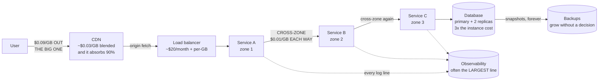

# Cost: the constraint nobody mentions

## 1. What this is, and why they ask it

**Every architecture has a monthly bill, and almost no candidate ever says what it is.**

**Cost is a design constraint exactly like latency or availability.** A design that meets every requirement and
costs forty times what the business earns is not a good design that happens to be expensive. **It is a wrong
design**, in the same way that a design that loses data is wrong.

**And the money is almost never where people expect.** It is rarely the compute. **It is the data moving
between machines, the logs nobody reads, the environment that has been running since a project was cancelled,
and the replica that exists because somebody was nervous eighteen months ago.**

They ask it because **it separates people who have owned a system from people who have only designed one.**
Anybody can add a caching layer. **Very few candidates can say that the caching layer costs about five hundred
dollars a month and saves two thousand in data transfer**, which is the sentence that makes the decision
obvious rather than aesthetic.

**And because it is the last unclaimed differentiator in a design interview.** By the final ten minutes you and
the other candidates have all drawn a load balancer, a few services, a database and a cache. **"This runs at
about thirty thousand a month, and here are the two changes that halve it" is something the interviewer will
almost certainly not have heard that week.**

By the end of this lesson you can price an architecture from first principles, name the four line items that
dominate real bills, explain why data transfer is the one that surprises everybody, choose between on-demand,
committed and spot capacity, and give a cost per user and per thousand requests for a system you have just
drawn.

---

## 2. The story

The bill came every two months, and for eleven years Ramesh had paid it without reading it.

Then one cycle it went from about four thousand rupees to nearly seven, and he read it very carefully indeed,
**and it told him nothing at all.** It was one number, and a date.

**He assumed it was the copier.** It was the biggest thing in the shop. It ran all day. It got warm enough that
he had put a small fan behind it.

His nephew, who fitted air conditioning for a firm in the city, came on a Sunday with a little meter that
clipped round a wire. **They went round the shop and measured everything, one thing at a time**, which took
most of the afternoon and involved moving a great deal of furniture.

**The copier was not the problem.** It was large, but it only actually drew anything while it was copying, and
that was perhaps two hours spread across the eleven the shop was open.

**Three things were the problem, and not one of them was doing any work at all.**

**The fridge in the back room**, which had held cold drinks in 2016 and had held nothing since, and had been
running, empty, for four years.

**The tube lights over the shelves at the back** — eight of them, on from seven in the morning until he locked
up — in a part of the shop no customer had walked into in months.

**And the second copier.** The one he kept in case the first one failed. It was on standby. **It had been on
standby for two years and eight months.**

**Together they came to more than the copier.**

That afternoon he switched the fridge off at the wall, took six of the eight tubes out, and put the standby
machine on its own switch that he turned on only when he needed it.

**The next bill was three thousand eight hundred.** Lower than before the jump.

What he said afterwards, to anybody who would listen, was not really about electricity.

**"For eleven years I paid one number. And the whole time, more than half of it was for things that were not
doing anything — and I could not see it, because nobody had ever shown me the bill broken up."**

---

## 3. The idea in plain English

**Ramesh's shop is a cloud bill.** **One number, no breakdown, and the largest share going to things that are
switched on and doing nothing.** The meter on the wire is cost allocation. **And the empty fridge is the most
common finding in every cost review ever conducted.**

### The four line items

**Almost every bill is dominated by four things, and they are worth naming in this order.**

```
   COMPUTE        machines, containers, functions
                  -> the one everybody thinks about
                  -> usually 30-50% of the bill

   STORAGE        disks, object storage, backups, snapshots
                  -> cheap per gigabyte, and it only ever grows

   DATA TRANSFER  bytes moving between places
                  -> the one that surprises people
                  -> free IN, charged OUT, and charged
                     BETWEEN your own machines

   MANAGED        databases, queues, search, observability
   SERVICES       -> expensive per unit, cheap in salaries
                  -> the observability bill is often the
                     single largest line
```

**And a fifth that is not on the bill at all: people.** **An engineer costs more per month than a substantial
fleet of machines**, which is why "we will build it ourselves to save money" is usually wrong, and why saying so
is a mark of judgement.

### Data transfer, and why it surprises everybody

**This is the part worth learning properly, because it is where the shock is.**

```
   INTO the cloud                    free
   OUT to the internet               ~$0.09 per GB
   BETWEEN availability zones        ~$0.01 per GB, EACH WAY
   BETWEEN regions                   ~$0.02 per GB
   WITHIN one zone, private address  free
```

**Read the second line again.** **Storing a gigabyte for a month costs about two and a third cents. Sending
that same gigabyte to a user once costs nine cents.** **Serving it is four times more expensive than keeping
it**, and if it is popular, it is served thousands of times.

**And the third line is the one that catches architects.** **Every internal call that crosses an availability
zone is charged in both directions.** A chatty service mesh spread across three zones for availability
**generates a data-transfer bill that can exceed the cost of the machines themselves** — and nothing in the
architecture diagram shows it.

### Ways to pay for compute

```
   ON-DEMAND      full price, no commitment
                  -> the default, and the most expensive

   COMMITTED      reserved instances or savings plans:
                  commit for 1 or 3 years
                  -> roughly 40% off for 1 year,
                     up to 60-70% for 3 years
                  -> you pay whether you use it or not

   SPOT           spare capacity, taken back with about
                  two minutes' notice
                  -> 70-90% off
                  -> only for work that can be interrupted

   SERVERLESS     pay per request and per millisecond
                  -> near zero when idle
                  -> more expensive than committed capacity
                     once traffic is steady and high
```

**The shape to aim for: commit to your steady baseline, use on-demand for the daily peak, and put anything
interruptible on spot.** **A fleet that is 100% on-demand is paying roughly double for its baseline**, and that
is often the single easiest saving available.

### Storage tiers

**Storage is cheap and unbounded, which is exactly why it grows without anybody deciding.**

```
   OBJECT STORAGE, per GB per month (order of magnitude)

     standard              $0.023
     infrequent access     $0.0125     + a retrieval charge
     archive, instant      $0.004      + a larger retrieval charge
     deep archive          $0.00099    + hours to retrieve

   -> deep archive is about 23x cheaper than standard.

   AND THE TRAP: retrieval is charged, and so are requests.
   Millions of tiny objects in a cheap tier can cost more
   in request charges than the storage saved.
```

**Lifecycle rules are the mechanism: after 30 days move to infrequent access, after 90 to archive, after a year
delete.** **The decision that actually matters is the delete**, and it is the one nobody wants to make.

### Where the money really goes

**Two findings appear in almost every cost review, and both are Ramesh's shop.**

**Idle resources.** **Development and test environments running at nights and weekends** — which is 128 of the
168 hours in a week, **so switching them off outside working hours removes about three quarters of their
cost.** **Unattached disks. Old snapshots. Load balancers with nothing behind them. The environment for a
project that was cancelled and nobody deleted.**

**Over-provisioning.** **Machines sized for a peak that never came, or sized by copying whatever the last
project used.** **A fleet running at 8% CPU is paying twelve times what it needs**, and it looks perfectly
healthy on every dashboard.

**And the third, which is newer and now enormous: observability.** **From day 172, a hundred million requests a
day generates about 720 GB of logs, which on managed per-gigabyte pricing is over ten thousand dollars a
month.** **It is routine for a team's logging bill to exceed the bill for the servers that produced the logs.**

### Making the bill readable

**Ramesh could not act until he had the meter.** The equivalent is **tagging**: every resource labelled with a
team, an environment and a service, **so the single number becomes a table.**

```
   WITHOUT TAGS   "$29,000 this month"
                  -> nobody owns it, so nobody reduces it

   WITH TAGS      checkout service, production:  $8,400
                  checkout service, staging:     $1,900
                  search service, production:    $6,100
                  untagged:                      $4,600   <- always
                                                             the
                                                             problem
```

**The "untagged" row is where the empty fridges live**, and getting it to zero is usually the highest-value
first move in a cost programme. **You cannot switch off what you cannot see, and you cannot ask anybody to
switch it off if nobody's name is on it.**

### The order to optimise in

**Highest leverage first, because effort is finite and engineering time is expensive.**

```
   1. DELETE what is not used            free, and often 10-30%
   2. SWITCH OFF what is not needed
      right now (non-production
      outside working hours)             free, ~70% of those
   3. RIGHT-SIZE what is oversized       small effort, 20-40%
   4. COMMIT to the baseline             a signature, ~40%
   5. TIER the storage                   a lifecycle rule
   6. STOP THE BYTES MOVING              a CDN, compression,
                                         co-locating chatty
                                         services
   7. CHANGE THE ARCHITECTURE            weeks of work. Last.
```

**Almost everybody starts at seven.** **The first two are free and frequently bigger.**

---

## 4. The picture

Where the money goes on a single request path:



**Two arrows on that diagram cost more than most of the boxes.** **The one leaving to the user, and the ones
crossing between zones** — and neither of them appears as a component in any normal architecture drawing, which
is exactly why they are missed.

The bill, broken up — the thing Ramesh never had:

```
   MONTHLY BILL, 100M requests/day, 1 TB/day served

   observability (managed logs)     $10,800    36%   <-- largest
   cross-zone data transfer          $6,420    22%   <-- invisible
   compute, 100 machines on-demand   $7,300    25%
   internet egress (no CDN)          $2,700     9%
   database, 3 nodes                 $1,752     6%
   cache, 2 nodes                      $511     2%
   backups and snapshots               $100     0%
                                    -------
                                    $29,583

   THE TWO LARGEST LINES ARE THINGS NOBODY DRAWS.
   Compute - the thing everybody discusses - is a quarter.
```

Idle cost, drawn as a week:

```
   a non-production environment, 168 hours in a week

   Mon Tue Wed Thu Fri Sat Sun
   |---|---|---|---|---|---|---|

   USED:     ###   ###   ###   ###   ###
             9-6   9-6   9-6   9-6   9-6      = 45 hours

   BILLED:   ############################     = 168 hours

   -> 123 hours a week, 73% of the cost, for an
      environment with nobody in it.

   A schedule that stops it at 7pm and starts it at 8am,
   weekdays only, costs nothing to implement and removes
   about three quarters of the bill for every non-production
   environment you have.

   THAT IS RAMESH'S FRIDGE.
```

---

## 5. How it actually works

### Reading the bill

**Every cloud provider produces a detailed usage export — AWS's Cost and Usage Report, GCP's billing export to
BigQuery, Azure's cost exports.** **It is a row per resource per hour, and it is the only honest source.** The
console's summary view aggregates in ways that hide exactly the things you are looking for.

```
   AWS      Cost Explorer for the summary, CUR for the truth
   GCP      billing export into BigQuery, then query it
   Azure    Cost Management + exports
   Kubernetes  Kubecost or OpenCost, because a cluster's bill
               arrives as one line and you need it per namespace
   Terraform   Infracost, which prices a change in the pull
               request, before it is merged
```

**That last one is the interesting mechanism.** **Infracost puts "this change adds $840/month" into the code
review**, which moves the decision to the moment when changing it is free. **Every other tool tells you after
you have already been charged.**

### Tagging, and why it is a policy problem

**The technology is trivial: a key-value label on every resource.** **The difficulty is entirely
organisational** — a tag that is optional is a tag that is missing on a third of everything.

```
   the enforcement that works:
     a policy that REFUSES to create an untagged resource
     (AWS Service Control Policies, Azure Policy, or
      a Terraform check in CI)

   the enforcement that does not work:
     a wiki page asking people to remember
```

**And then the bill becomes a table by team, which is where the behaviour changes.** **Showback is sending each
team their number. Chargeback is actually billing it to their budget.** **Showback changes behaviour almost as
much as chargeback and causes far fewer arguments**, which is why most organisations stop there.

### Anomaly detection

**A cost bug does not page anybody, and that is why it runs for a month.**

```
   a runaway retry loop        millions of extra requests
   a log level left at DEBUG   5-10x the log volume
   a test that forgot to
     delete its resources      a fleet nobody knows about
   a misconfigured lifecycle
     rule                      terabytes never expiring

   -> All of these are silent, all of them last until
      the invoice, and all of them are found instantly by
      a daily spend alert per tag.
```

**A daily budget alert per team, with a threshold on the rate of change rather than the absolute number**, is
about an hour of setup and routinely catches things worth thousands. **It is the same shape as a burn-rate
alert from day 173, applied to money.**

### The cost of a nine, revisited

**From day 173: each additional nine costs roughly ten times the last.** **Cost is where that becomes
concrete.**

```
   99.9%    two machines, one zone, ordinary on-call
            ~$10,000/month
   99.99%   multi-zone, automatic failover, replicated
            storage, tested runbooks
            ~$40,000-100,000/month
   99.999%  multi-region active-active, no human in the
            recovery path
            + a team whose whole job is this

   THE QUESTION TO ASK FIRST:
     what does an hour of downtime actually cost?

   If an hour costs $5,000 and the budget for 99.9% is
   43 minutes a month:
     expected loss = 43/60 x $5,000 = ~$3,600/month

   Paying $60,000/month extra to avoid $3,600/month of
   expected loss is a bad trade, and saying so out loud
   is worth more than any amount of redundancy.
```

### Unit economics

**The number that makes cost a design input rather than an afterthought.**

```
   cost per DAU        = monthly bill / daily active users
   cost per request    = monthly bill / monthly requests
   cost per GB stored
   cost per order / per stream / per message

   -> The point is the DIRECTION over time.

   A bill that grows from $29k to $35k while users grow
   40% is a system getting CHEAPER per user, which is
   healthy.

   A bill that grows 40% while users grow 5% is a leak,
   and unit cost finds it months before the total does.
```

**And it connects the engineering to the business.** **If the product earns $0.30 per active user per month and
costs $0.006 to serve, there is room. If it costs $0.40, the architecture has to change** — and that is a real
conversation an engineer can start, with a number.

---

## 6. The numbers

**Price the system from day 172 and day 173: 100 million requests a day, 1 TB served a day, 5 million daily
active users.**

**Compute.**

```
   100 machines, $0.10/hour, 730 hours in a month

   100 x $0.10 x 730 = $7,300/month   on-demand

   with a 1-year commitment at ~40% off:
     $7,300 x 0.60 = $4,380/month     saving $2,920

   with 30% of the fleet on spot at ~75% off:
     70 machines committed:  70 x 0.10 x 730 x 0.60 = $3,066
     30 machines spot:       30 x 0.10 x 730 x 0.25 =   $548
                                                      -------
                                                       $3,614

   -> $7,300 down to $3,614. A 50% cut, no code changed.
```

**Internet egress — the line people forget.**

```
   1 TB/day x 30 days = 30 TB = 30,000 GB

   direct from the origin at $0.09/GB:
     30,000 x $0.09 = $2,700/month

   through a CDN, blended ~$0.03/GB at this volume,
   absorbing 90% of requests:
     30,000 x $0.03 = $900/month
     plus the CDN's own request charges, say $100
                                          --------
                                            $1,000

   -> $2,700 -> $1,000, and the pages get faster as well.

   FOR SCALE: storing that same 30 TB for a month costs
     30,000 x $0.023 = $690.
   Sending it out once costs $2,700.
   -> SERVING IS ~4x MORE EXPENSIVE THAN STORING.
```

**Cross-zone transfer — the line nobody draws.**

```
   8 internal service calls per request
   100,000,000 requests/day
   -> 800,000,000 internal calls/day

   average response 20 KB:
     800,000,000 x 20 KB = 16,000,000,000 KB
                         = 16,000 GB/day = 16 TB/day

   with services spread over 3 zones, about two thirds of
   calls cross a zone boundary:
     16,000 x 0.66 = 10,560 GB/day crossing

   charged BOTH WAYS at $0.01/GB = $0.02/GB:
     10,560 x $0.02 = $211/day
                    = $6,420/month

   -> MORE THAN THE ENTIRE SAVING FROM COMMITTING THE
      COMPUTE, and it appears on no architecture diagram.

   THE FIX, and it is not "use fewer zones":
     - zone-aware routing: prefer a callee in your own zone,
       fall back across zones only when yours is unhealthy
       -> cuts the crossing fraction from 66% to ~5%
       -> $6,420 -> ~$490
     - batch the calls: 8 calls at 20 KB -> 3 calls at 40 KB
       is 16 TB -> 6 TB
     - compress internal responses: 20 KB -> 4 KB
```

**Observability, from day 172.**

```
   8 services x 3 log lines x 100,000,000 requests
     = 2,400,000,000 lines/day
   x 300 bytes = 720 GB/day

   managed logging at $0.50/GB ingested:
     720 x $0.50 = $360/day = $10,800/month

   -> the LARGEST single line on this bill.

   with 7 days hot + 90 days in archive, and sampling
   successful requests at 1 in 10:
     ingested volume falls to ~200 GB/day
     200 x $0.50 = $100/day = $3,000/month
   -> $10,800 -> $3,000
```

**The database and the cache.**

```
   database: 1 primary + 2 replicas, $0.80/hour each
     3 x $0.80 x 730 = $1,752/month
   backups, 2 TB of snapshots at $0.05/GB:
     2,000 x $0.05 = $100/month
   cache: 2 nodes at $0.35/hour
     2 x $0.35 x 730 = $511/month
```

**The whole bill, and then the same bill optimised.**

```
   BEFORE                                AFTER
   observability      $10,800            $3,000    sample + tier
   compute             $7,300            $3,614    commit + spot
   cross-zone          $6,420              $490    zone-aware
   egress              $2,700            $1,000    CDN
   database            $1,752            $1,752    unchanged
   cache                 $511              $511    unchanged
   backups               $100              $100    unchanged
                     --------          --------
                      $29,583           $10,467

   -> a 65% reduction, and not one line of product code
      changed. Every saving came from configuration,
      commitment, or routing.
```

**Unit economics.**

```
   5,000,000 daily active users
   3,000,000,000 requests/month

   BEFORE:
     $29,583 / 5,000,000 DAU     = $0.0059 per user/month
     $29,583 / 3,000,000,000 x 1000
                                 = $0.0099 per 1,000 requests

   AFTER:
     $10,467 / 5,000,000         = $0.0021 per user/month
                                 = $0.0035 per 1,000 requests

   -> about six-tenths of a cent per user per month,
      falling to two-tenths.

   If the product earns $0.30 per active user per month,
   infrastructure is 2% of revenue before, 0.7% after.
   THAT is the sentence that ends the conversation.
```

---

## 7. The trade-offs

**Committing to capacity buys 40% and costs you flexibility for one to three years.**

**A one-year commitment is roughly 40% off; three years is 60-70%.** **You pay whether you use it or not.** **I
would not commit if the traffic might halve, if a migration to a different instance family is likely, or if the
product is young enough that the whole architecture could change.** **I would commit to the baseline — the
capacity that has been running every hour for six months — and leave the peak on demand.** **Committing to the
peak is how teams end up paying for capacity they stopped using in month three.**

**Spot capacity is 70-90% off and can be taken away in two minutes.**

**Right for stateless web servers behind a load balancer, batch jobs, CI runners and anything that can be
restarted.** **Wrong for a database primary, a stateful leader, or anything holding a long-running session.**
**And it needs the application to handle a termination notice gracefully**, which is engineering work — so the
saving is not free, it is deferred into a different budget.

**Managed services cost more per unit and less in total.**

**A managed database is perhaps two to three times the raw instance cost.** **An engineer's month is worth more
than a substantial fleet.** **I would run managed by default and self-host only where the scale makes the
multiplier genuinely large and there is a team to own it.** **The comparison people get wrong is machine cost
against machine cost; the honest comparison includes the on-call rota.**

**Serverless is cheapest when idle and expensive when busy.**

**At low or spiky traffic, paying per request beats paying for machines that are mostly idle.** **There is a
crossover point** — roughly where sustained utilisation would keep a committed instance meaningfully busy —
**above which committed capacity is several times cheaper.** **I would use serverless for spiky, low-volume or
unpredictable workloads and for glue, and reach for committed capacity for a steady high-traffic path.**

**Multi-zone redundancy buys availability and costs you data transfer.**

**Three zones is the standard answer for availability and it puts a per-gigabyte charge on your internal
chatter, both ways.** **The wrong response is to collapse to one zone**, which trades a real availability
requirement for a bill. **The right response is zone-aware routing — prefer a callee in your own zone, cross
only when yours is unhealthy — which keeps the redundancy and removes most of the charge.**

**Cheaper storage tiers cost you retrieval, and sometimes more than they save.**

**Deep archive is about twenty-three times cheaper per gigabyte.** **It also charges for retrieval and takes
hours.** **And request charges on millions of small objects can exceed the storage saved entirely** — so the
tiering decision depends on object size and access pattern, not only on age.

**And cost optimisation itself is not free.**

**Engineering time spent on cost is engineering time not spent on the product.** **Spending three weeks to save
four hundred dollars a month is a loss**, and the discipline is to do the free things first — delete, switch
off, commit — and only then consider anything that needs a design change. **I would say plainly that the last
item on the optimisation list is 'change the architecture', and that most teams start there.**

---

## 8. In the interview

### How it gets asked

- *"What does this system cost to run per month?"* — rare, and devastating if you have nothing.
- *"Your bill doubled last month. How do you find out why?"* — tagging, the usage export, anomaly alerts.
- *"How would you cut this bill in half?"* — the ordered list, cheapest effort first.
- *"On-demand, reserved or spot?"* — and they want the reasoning, not the discount numbers.
- *"Is this worth building ourselves?"* — the comparison that includes salaries.
- *"Why not just add more machines?"* — a cost question wearing a scaling costume.

### The first ninety seconds

On "what does this system cost to run":

> "**Let me price it, and I will do it in four line items because that is where nearly all of it lands.**
>
> **Compute.** About a hundred machines at ten cents an hour, times 730 hours, **is $7,300 a month on demand.**
> **Committing to the baseline for a year takes roughly 40% off, and putting the stateless third on spot takes
> 75% off that portion — so about $3,600.** **That is a halving with no code changed.**
>
> **Data transfer, and this is the one I would want to raise before being asked.** **A terabyte a day out to
> users is 30 TB a month, and internet egress is about nine cents a gigabyte — $2,700.** **Through a CDN at a
> blended three cents it is about $1,000, and the pages get faster too.**
>
> **For scale: storing those same 30 TB for a month costs about $690, and sending them out once costs $2,700.
> Serving is four times more expensive than storing**, which is not most people's intuition.
>
> **Then the line nobody draws: cross-zone transfer.** **Eight internal calls per request at a hundred million
> requests a day is 800 million internal calls, at maybe 20 KB each — 16 TB a day.** **Spread over three zones,
> about two thirds of that crosses a boundary, and it is charged in both directions at a cent a gigabyte.**
> **That is roughly $6,400 a month, which is more than the entire saving from committing the compute.**
>
> **And observability, which at this scale is often the largest single line.** **720 GB of logs a day at fifty
> cents a gigabyte ingested is $10,800 a month** — **more than the servers that produced them.**
>
> **All in, about $29,500 a month.** **At five million daily active users that is about six-tenths of a cent
> per user per month, or a cent per thousand requests.**
>
> **And the two largest lines — logs and cross-zone traffic — are both things that appear nowhere on the
> architecture diagram**, which is exactly why they are the ones that are wrong."

### The follow-ups

**"Cut that bill in half."**

> "**I would go in order of effort, because the free things are usually bigger than the clever ones.**
>
> **First, delete and switch off, which costs nothing.** **Non-production environments run 168 hours a week and
> are used for about 45.** **A schedule that stops them outside working hours removes about three quarters of
> their cost.** **Plus unattached disks, old snapshots, load balancers with nothing behind them, and whatever
> is in the 'untagged' row — which in every organisation I have seen is where the abandoned projects live.**
>
> **Second, sample and tier the logs.** **They are the largest line at $10,800.** **Keeping every line for
> errors and one in ten for successful requests, with seven days hot and ninety in archive, takes the ingested
> volume to about 200 GB a day — roughly $3,000.** **That is a $7,800 saving from a configuration change, and
> the cost is that reconstructing an arbitrary successful request is no longer possible, so I would check with
> support before doing it.**
>
> **Third, zone-aware routing for the internal calls.** **Right now two thirds of internal traffic crosses a
> zone boundary and is charged both ways — $6,400.** **Preferring a callee in the same zone and only crossing
> when your zone is unhealthy takes the crossing fraction to a few percent, so about $490.** **The redundancy
> is unchanged; only the routing preference changed.**
>
> **Fourth, commit the baseline and put the stateless tier on spot — $7,300 to about $3,600.** **A one-year
> commitment on the capacity that has been running every hour for six months, and on-demand for the peak.**
>
> **Fifth, a CDN for the egress — $2,700 to about $1,000.**
>
> **That is $29,500 down to about $10,500 — a 65% cut — and not one line of product code changed.** **Every
> saving came from configuration, commitment or routing.**
>
> **What I would not do first is redesign anything.** **That is weeks of work and it is last on the list**, and
> most teams start there because it is the interesting part."

**"On-demand, reserved, or spot?"**

> "**All three, on different parts of the fleet, and the split follows how predictable each part is.**
>
> **The baseline goes on a commitment.** That is the capacity that has genuinely been running every hour for
> six months. **A one-year commitment is about 40% off; three years is 60 to 70%.** **The cost is that I pay
> whether I use it or not, so I commit to the floor and never to the peak** — committing to the peak is how
> teams end up paying for capacity they stopped using in month three.
>
> **The daily peak above that baseline goes on demand.** **It is the most expensive way to buy an hour and the
> cheapest way to buy flexibility**, and for a few hours a day that is the right trade.
>
> **Anything interruptible goes on spot: 70 to 90% off, taken back with about two minutes' notice.** **Stateless
> web servers behind a load balancer, batch jobs, CI runners, anything that can be restarted.** **Not a database
> primary, not a stateful leader, not a long-running session.**
>
> **And I would be honest that spot is not free money — the application has to handle a termination notice
> gracefully, drain connections and exit.** **That is engineering work, so the saving is partly moved into a
> different budget.**
>
> **The two cases where I would not commit at all: if the traffic might halve, or if the product is young
> enough that the architecture could change entirely inside a year.** **A three-year commitment on a
> six-month-old product is a bet, not a saving.**
>
> **And I would mention serverless as the fourth option.** **It is cheapest when idle and more expensive than
> committed capacity when busy** — so it is right for spiky, unpredictable or low-volume work, and wrong for a
> steady high-traffic path."

**"Your bill doubled last month and nobody knows why. What do you do?"**

> "**First, get the breakdown, because the summary view will not tell me.** **The detailed usage export — a row
> per resource per hour — is the only honest source.** **The console's grouped view aggregates in exactly the
> way that hides this.**
>
> **Then compare month to month by tag, by service and by usage type**, and the answer usually falls out of one
> of four buckets.
>
> **Something was created and forgotten** — a test that provisioned a fleet and did not clean up. **A log level
> left at DEBUG**, which is five to ten times the volume. **A retry loop that started firing**, which multiplies
> request counts and data transfer at the same time. **Or a lifecycle rule that was wrong, so nothing has been
> expiring.**
>
> **The 'untagged' row is where I would look first**, because that is where anything nobody owns ends up.
>
> **The real answer, though, is that this should not have taken a month to notice.** **A cost anomaly does not
> page anybody, which is why it runs until the invoice.** **A daily spend alert per tag, thresholded on the
> rate of change rather than the absolute number, is about an hour of setup and catches all four of those in a
> day.** **It is the same shape as a burn-rate alert, applied to money.**
>
> **And the preventive version is putting the price in the pull request** — a tool like Infracost that comments
> 'this change adds $840 a month' during code review. **That moves the decision to the moment when changing it
> is free**, which is the only time anybody actually reconsiders."

### The model answer

*"What does this system cost to run per month, and would you change anything because of it?"*

> "**I would price the four lines that dominate every bill, and then say which two of them are wrong.**
>
> **Compute is about $7,300 — a hundred machines at ten cents an hour.** **Storage and backups are small, a few
> hundred.** **The database and cache together are around $2,300.** **Egress to users is $2,700 for 30 TB a
> month.** **Cross-zone internal traffic is about $6,400.** **And observability is $10,800.** **Total, roughly
> $29,500 a month.**
>
> **The first thing worth saying about that list is its shape.** **Compute — the thing we have spent most of
> this interview discussing — is a quarter of it.** **The two largest lines, logging and cross-zone traffic, do
> not appear anywhere on the diagram I drew.** **Which is precisely why they are the ones that are wrong.**
>
> **The unit economics: at five million daily active users, that is about six-tenths of a cent per user per
> month, or a cent per thousand requests.** **If the product earns thirty cents per active user, infrastructure
> is about two percent of revenue, which is healthy.** **The number I would actually watch is the direction —
> a bill growing 40% while users grow 5% is a leak, and unit cost finds it months before the total does.**
>
> **The two changes I would make on cost grounds, and they are both routing rather than redesign.**
>
> **Zone-aware routing for internal calls.** **Two thirds of 16 TB a day crosses a zone boundary and is charged
> both ways.** **Preferring a callee in the same zone, falling back across zones only when yours is unhealthy,
> keeps the availability properties completely intact and takes that line from $6,400 to about $500.**
>
> **Sampling and tiering the logs.** **Every line for errors, one in ten for successful requests, seven days
> hot and ninety in archive — $10,800 to about $3,000.** **The cost is real and I would name it: reconstructing
> an arbitrary successful request becomes impossible, so I would confirm with whoever handles customer support
> before doing it.**
>
> **Then the things that need no design opinion at all: commit the baseline compute and put the stateless tier
> on spot, and put a CDN in front of the egress.** **Together that is about $29,500 down to $10,500.**
>
> **And the sentence I would end on, because it is the one that connects this to the rest of the design.**
> **Cost is a constraint like latency and availability, not a report you read afterwards.** **The reason I
> would raise it in the last ten minutes of a design conversation is that the cheapest time to change an
> architecture is before it exists** — and the two most expensive lines in this one are both things that would
> have been free to arrange differently on the whiteboard, and cost weeks to change afterwards."

---

## 9. Recall card

**Cost is a design constraint, not a report.** Four line items dominate: **COMPUTE (usually only 30-50%),
STORAGE (cheap, only grows), DATA TRANSFER (the surprise), MANAGED SERVICES (observability is often the largest
single line)** — plus a fifth that is not on the bill: **people**, which is why "build it ourselves to save
money" is usually wrong.

**Data transfer is where the shock is. IN is free; OUT to the internet is ~$0.09/GB; BETWEEN ZONES is ~$0.01/GB
EACH WAY.** Storing 30 TB for a month is ~$690; **sending it out once is $2,700 — serving is 4× more expensive
than storing.** And **cross-zone chatter appears on no architecture diagram**: 8 internal calls × 100M requests
× 20 KB = 16 TB/day, two-thirds crossing, both ways ≈ **$6,420/month — more than the entire saving from
committing the compute.** **Fix it with zone-aware routing, not by collapsing to one zone.**

**Buy compute three ways at once: COMMIT the baseline** (~40% off for 1 year, 60-70% for 3, and you pay whether
you use it), **ON-DEMAND for the peak**, **SPOT for anything interruptible** (70-90% off, two minutes' notice,
never a stateful leader). **Serverless is cheapest idle and dearest busy.** **Commit to the floor, never the
peak.**

**Optimise in order of effort, because the free things are bigger.** **1. Delete what is unused. 2. Switch off
non-production outside working hours (used 45 of 168 hours — ~73% saving, and it is Ramesh's empty fridge).
3. Right-size. 4. Commit. 5. Tier storage. 6. Stop the bytes moving — CDN, compression, co-location. 7. Change
the architecture — LAST, and where everyone starts.** A worked example goes **$29,500 → $10,500, a 65% cut,
with no product code changed.**

**You cannot reduce what you cannot see.** **Tag everything and enforce it with a policy that refuses untagged
resources** — the "untagged" row is where abandoned projects live. **Showback changes behaviour almost as much
as chargeback with far fewer arguments.** **A cost bug pages nobody, so it runs until the invoice** — set a
daily spend alert per tag on the RATE of change, and price changes in the pull request. **Track cost per DAU
and per 1,000 requests: the direction matters more than the total, and a bill growing faster than usage is a
leak.** **And before buying a nine, ask what an hour of downtime actually costs.**
