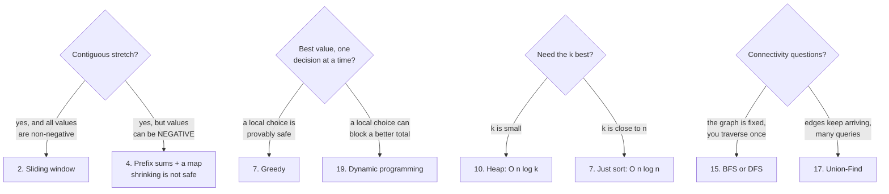

# The twenty patterns, on one page

## 1. What this is, and why they ask it

**There are about twenty patterns, and almost every interview problem is one of them.**

**Not twenty algorithms — twenty shapes.** "A contiguous stretch with a constraint" is one shape, and it does
not matter whether the elements are letters or numbers or costs. **Once you have named the shape, the code is
something you have already written many times.**

**This lesson is the index.** Every pattern, the sentence that gives it away, the template, and what it costs.
**Nothing here is new.** You have met all twenty across the last hundred and seventy-six days. **What is new is
having them in one place, in a form you can search from a one-line problem description.**

They ask it because **recognition is the actual skill, and it is the one that fails under pressure.** Nobody
forgets how to write a sliding window. **What happens in the room is that a problem arrives, the candidate does
not recognise it, and spends nine minutes on a brute force before the shape arrives** — by which point there is
no time to write it.

**And because interviewers can hear the difference.** "This is asking for the longest contiguous stretch with
at most two distinct values, so it is a sliding window" **is a different answer from "let me try some loops"**,
even when both eventually produce the same code.

By the end of this lesson you have all twenty patterns with their triggers and templates, a procedure for
matching an unseen problem to one of them, a table that turns a constraint into a technique, and the honest
list of patterns that get confused with each other.

---

## 2. The story

The enquiry counter at the station was a window about two feet across with a brass grille in it, and the man
behind it was called Raghavan, and he almost never opened the book.

**There was a book.** A thick one, with a soft cover and a rubber band round it, holding every train that
passed through. **It lived on the shelf behind him and he touched it perhaps twice a week.**

People came to that window with a sentence.

*"I have to be in Nagpur by Friday morning."* *"My mother is old, she cannot change in the middle of the
night."* *"Can I go to Belgaum and come back the same day?"*

**And Raghavan would look at them for about two seconds and say a train, and a time, and which side of the
platform.**

His son, who was doing a diploma and had started thinking about how things worked, asked him one evening how
many trains he had memorised.

**Raghavan said he had not memorised any trains.**

"Then what?"

**He said there were only about twenty questions.** Not twenty trains. **Twenty questions.**

And he counted some of them off on his hand. Somebody who has to arrive by a particular hour. Somebody who
cannot change trains. Somebody who wants the cheapest thing available. Somebody travelling with a small child,
who needs a day train and does not know to ask for one. Somebody going and returning the same day. **Somebody
who does not want a train at all and wants the bus, and has not worked that out yet.**

**"Once I know which of the twenty it is, there are only two or three trains it can be. Then I look."**

His son said that still meant knowing all the trains.

**"No," Raghavan said. "It means knowing which two to check."**

And then the thing his son remembered for a long time afterwards.

**"The people who are slow at this counter are not slow because they do not know the trains. They are slow
because they are still listening to the whole sentence."**

**"I stop listening after about six words. By then I know which question it is."**

---

## 3. The idea in plain English

**Raghavan's twenty questions are the twenty patterns.** **You are not matching a problem to a solution. You are
matching a problem to a shape**, and the shape has two or three known solutions attached to it.

**Here they are. Read the middle column first — that is the sentence that gives each one away.**

### 1. Two pointers

**The tell: the input is sorted, and you want a pair — or you are rearranging in place.**

```
   left, right = 0, len(a) - 1
   while left < right:
       if condition(a[left], a[right]):  ...
       elif too_small: left += 1
       else:           right -= 1
```

**Why it works: sorting makes the decision unambiguous.** Sum too small, the only way up is to move `left` in.
**O(n) time, O(1) space.** *Two Sum II, Container With Most Water, 3Sum, Trapping Rain Water.*

### 2. Sliding window

**The tell: a CONTIGUOUS subarray or substring, with a constraint — "longest with at most k distinct".**

```
   left = 0
   for right in range(len(a)):
       add a[right] to the window
       while window is invalid:
           remove a[left]; left += 1
       best = max(best, right - left + 1)
```

**Why it works: the right edge only moves forward and so does the left, so each element is added once and
removed once.** **O(n), not O(n²).** *Longest Substring Without Repeating Characters, Minimum Window Substring,
Sliding Window Maximum (with a monotonic deque).*

### 3. Fast and slow pointers

**The tell: a cycle, a middle, or an nth-from-the-end — in one pass and constant space.**

```
   slow = fast = head
   while fast and fast.next:
       slow = slow.next
       fast = fast.next.next
       if slow is fast: cycle found
```

**Why it works: two speeds close a gap of one per step, so if there is a loop they must meet.** *Linked List
Cycle, Middle of the Linked List, Find the Duplicate Number.*

### 4. Prefix sums and difference arrays

**The tell: many range queries over unchanging data, or "how many subarrays sum to k".**

```
   prefix[0] = 0
   prefix[i] = prefix[i-1] + a[i-1]
   sum(l..r) = prefix[r+1] - prefix[l]
```

**Why it works: a range is the difference of two prefixes.** **O(n) once, O(1) per query.** *Subarray Sum
Equals K, Range Sum Query, Product of Array Except Self, Corporate Flight Bookings.*

### 5. Binary search on a sorted array

**The tell: sorted, and you want a position.**

```
   low, high = 0, len(a)
   while low < high:
       mid = (low + high) // 2
       if a[mid] < target: low = mid + 1
       else:               high = mid
   return low
```

**Why it works: half the search space goes every step.** **O(log n).** *Search in Rotated Sorted Array, First
Bad Version, Find First and Last Position.*

### 6. Binary search on the answer

**The tell: "minimise the maximum", "smallest capacity such that", "minimum speed to finish in h hours".**

```
   low, high = smallest_possible, largest_possible
   while low < high:
       mid = (low + high) // 2
       if feasible(mid): high = mid
       else:             low = mid + 1
   return low
```

**Why it works: feasibility is monotone — if a capacity of 15 works, so does 16.** **You are searching the
answers, not the input.** *Koko Eating Bananas, Capacity to Ship Packages, Split Array Largest Sum.*

### 7. Sort, then sweep

**The tell: intervals, or a greedy choice that only works in the right order.**

```
   events.sort(key=the_right_key)
   for event in events:
       one decision, never revisited
```

**Why it works: sorting removes the interactions, so a local decision becomes a global one.** **The whole
difficulty is the sort key**: by END time for "most non-overlapping", by START for "merge". *Merge Intervals,
Non-overlapping Intervals, Meeting Rooms II, Minimum Number of Arrows.*

### 8. Hashing: maps, sets and frequency

**The tell: "have I seen this before", or counting how often things occur.**

```
   seen = {}
   for i, value in enumerate(a):
       if target - value in seen: return seen[target-value], i
       seen[value] = i
```

**Why it works: it trades memory for lookups.** **O(n) time, O(n) space** — and that space is what a "constant
extra space" constraint is forbidding. *Two Sum, Group Anagrams, Longest Consecutive Sequence, Top K Frequent.*

### 9. Stack, and the monotonic stack

**The tell: matching pairs, or "the next greater / previous smaller element".**

```
   stack = []
   for i, value in enumerate(a):
       while stack and a[stack[-1]] < value:
           answer[stack.pop()] = value
       stack.append(i)
```

**Why it works: each position is pushed once and popped once**, so the nested loop is still O(n) in total.
*Valid Parentheses, Daily Temperatures, Largest Rectangle in Histogram, Next Greater Element.*

### 10. Heap: top-k and k-way merge

**The tell: the k largest, a running median, or merging sorted sequences.**

```
   import heapq
   heap = []
   for value in a:
       heapq.heappush(heap, value)
       if len(heap) > k: heapq.heappop(heap)
```

**Why it works: you never need the whole thing sorted — only the boundary.** **O(n log k), not O(n log n).**
*Kth Largest Element, Top K Frequent Elements, Merge k Sorted Lists, Find Median from Data Stream.*

### 11. Linked list pointer surgery

**The tell: reversing, reordering or splitting a list, in place.**

```
   dummy = Node(0, head)
   previous, current = None, head
   while current:
       nxt = current.next
       current.next = previous
       previous, current = current, nxt
```

**The dummy node is the trick**: it removes the special case where the head itself changes. *Reverse Linked
List, Merge Two Sorted Lists, Remove Nth Node From End, Reorder List.*

### 12. Tree traversal, depth-first and breadth-first

**The tell: anything about a tree that is not specifically about a BST.**

```
   def walk(node):
       if not node: return base_case
       left  = walk(node.left)
       right = walk(node.right)
       return combine(left, right, node.val)
```

**Why it works: a tree is defined recursively, so the solution usually is too.** **DFS for paths and depths,
BFS for levels and shortest hops.** *Maximum Depth, Diameter, Path Sum, Level Order Traversal, Lowest Common
Ancestor.*

### 13. Binary search tree properties

**The tell: the word BST — which means inorder is sorted, and you can prune by bounds.**

```
   def valid(node, low, high):
       if not node: return True
       if not (low < node.val < high): return False
       return valid(node.left, low, node.val) and valid(node.right, node.val, high)
```

**The mistake this prevents: checking only against the parent.** *Validate BST, Kth Smallest Element in a BST,
Convert Sorted Array to BST.*

### 14. Backtracking

**The tell: "return ALL" — every permutation, every subset, every valid board.**

```
   def walk(state):
       if complete(state): record(state); return
       for choice in options(state):
           apply(choice)
           walk(state)
           undo(choice)          <- the line people forget
```

**Why it works: you explore a tree of choices and prune branches that cannot succeed.** **The output is
exponential, so the cost is too — and that is not a failure, it is the question.** *Subsets, Permutations,
N-Queens, Word Search, Combination Sum.*

### 15. Graph traversal and topological sort

**The tell: things connected to things, or an order with prerequisites.**

```
   BFS for fewest hops, DFS for reachability.
   Topological sort: repeatedly take a node with
   in-degree 0, remove it, and decrement its neighbours.
```

**A grid is a graph** — that is the recognition people miss most often. **O(V + E).** *Number of Islands,
Course Schedule, Clone Graph, Rotting Oranges, Word Ladder.*

### 16. Shortest paths

**The tell: weighted edges and a cheapest route.**

```
   Dijkstra: a heap of (distance, node), pop the nearest
   unfinished node, relax its edges. NO NEGATIVE WEIGHTS.
   0-1 weights: a deque instead of a heap.
   Negative weights: Bellman-Ford.
```

**BFS is Dijkstra when every edge costs the same**, which is worth saying out loud. *Network Delay Time,
Cheapest Flights Within K Stops, Path With Minimum Effort.*

### 17. Union-Find

**The tell: "are these two connected", asked many times, while things are being joined.**

```
   def find(x):
       while parent[x] != x:
           parent[x] = parent[parent[x]]     # path halving
           x = parent[x]
       return x
```

**Why it works: near-constant time per operation, with path compression and union by rank.** **Use it instead
of repeated traversal when the graph is growing.** *Number of Provinces, Redundant Connection, Accounts Merge,
Kruskal's MST.*

### 18. Trie

**The tell: prefixes of strings — or bits of numbers treated as a path.**

```
   node = root
   for letter in word:
       node = node.children.setdefault(letter, {})
   node["$"] = True
```

**Why it works: shared prefixes are stored once**, so lookup costs the length of the word rather than the size
of the dictionary. *Implement Trie, Word Search II, Design Add and Search Words, Maximum XOR of Two Numbers.*

### 19. Dynamic programming

**The tell: "how many ways", or "the best value", with subproblems that repeat.**

```
   dp[state] = best_or_count over transitions of
               dp[smaller_state]
```

**Why it works: the same subproblem is solved once and reused.** **The whole difficulty is naming the state.**
*Climbing Stairs, House Robber, Coin Change, Longest Common Subsequence, Edit Distance, Unique Paths.*

### 20. Bits and maths

**The tell: constant space with repeated values, subsets of a small set, or an answer modulo a prime.**

```
   XOR for pairs that cancel; n & (n-1) for set bits;
   1 << n for subsets; the sieve for many primes;
   Euclid for a GCD; square and multiply for a big power.
```

*Single Number, Counting Bits, Subsets, Count Primes, Pow(x, n), Unique Paths as nCr.*

### The procedure

**Four questions, in this order, and the first one is the one people skip.**

**One: what do the constraints forbid?** `n ≤ 20` means exponential is intended. `n ≤ 10^3` means `O(n²)` is
fine and a 2D table is in range. `n ≤ 10^5` means `O(n log n)` at worst. **"O(1) extra space" forbids the hash
map, which is usually the obvious answer.**

**Two: what is the shape of the output?** **"Return all" is backtracking** — the output itself is exponential.
**"Return the number of ways" is DP or counting, never enumeration.** **"Return the best value" is DP or
greedy.** **"Return a position" is binary search.**

**Three: what is the structure of the input?** **Sorted → two pointers or binary search. A tree → traversal. A
grid → a graph. Prefixes of strings → a trie. Things being joined → union-find.**

**Four: is the obvious answer too slow, and in a fixable way?** **Nested loops recomputing the same sums →
prefix sums. Nested loops finding the next bigger thing → monotonic stack. Recursion re-solving the same
subproblem → DP. Sorting everything to get the top five → a heap.**

---

## 4. The picture

The whole index, on one screen:

```
   #   PATTERN                    THE TELL                          COST
   --  -------------------------  --------------------------------  ---------------
    1  Two pointers               sorted + a pair, or in place      O(n) / O(1)
    2  Sliding window             CONTIGUOUS stretch + constraint   O(n) / O(k)
    3  Fast and slow pointers     cycle, middle, nth from end       O(n) / O(1)
    4  Prefix sums                many range queries; sums to k     O(n) then O(1)
    5  Binary search              sorted, want a position           O(log n)
    6  Binary search on answer    "minimise the maximum"            O(n log range)
    7  Sort, then sweep           intervals; greedy needing order   O(n log n)
    8  Hashing                    "seen before"; counting           O(n) / O(n)
    9  Monotonic stack            next greater / previous smaller   O(n) / O(n)
   10  Heap                       top-k, running median, k-merge    O(n log k)
   11  Linked list surgery        reverse, reorder, split in place  O(n) / O(1)
   12  Tree traversal             anything tree-shaped              O(n) / O(h)
   13  BST properties             inorder is sorted; prune bounds   O(h)
   14  Backtracking               "return ALL"                      O(b^d)
   15  Graph traversal / topo     connected; prerequisites; grids   O(V + E)
   16  Shortest paths             weighted, cheapest route          O(E log V)
   17  Union-Find                 "connected?" while joining        ~O(1) each
   18  Trie                       prefixes; bits as a path          O(length)
   19  Dynamic programming        ways / best, overlapping subs     O(states x trans)
   20  Bits and maths             O(1) space + repeats; mod p       O(n) or O(log n)
```

The constraint table, which is the setter telling you the answer:

```
   THE CONSTRAINT SAYS          THE INTENDED SOLUTION IS ABOUT

   n <= 12                      permutations: n! is 479 million
   n <= 20                      subsets: 2^n is a million.
                                Bitmask or backtracking.
   n <= 100                     O(n^3) is fine. Interval DP, Floyd-Warshall.
   n <= 1,000                   O(n^2) is fine. A 2D DP table.
   n <= 100,000                 O(n log n). Sort, heap, binary search.
   n <= 1,000,000               O(n). One pass, prefix sums, counting.
   n <= 10^9                    O(log n) or a formula. NOT a loop.

   "O(1) extra space"           no map, no sort-copy.
                                Two pointers, or XOR if values repeat.
   "in place"                   two pointers, or index-as-a-marker
   "answer modulo 10^9 + 7"     counting: DP or combinatorics
   "already sorted"             two pointers or binary search - and if
                                you were going to sort anyway, ask why
                                they told you
   "return all"                 backtracking; the output is exponential
   "streaming / one pass"       heap, or running counters
```

The confusable pairs, drawn as the question that separates them:



**Every one of those four splits is a place where the wrong choice still produces plausible-looking code**, and
they are the four confusions worth being able to state out loud.

---

## 5. The code, built step by step

**The patterns are data, so let us write them as data** — and then a small tool that ranks them against a
problem description. **It is a keyword matcher and nothing cleverer**, which is exactly the point: **the
recognition is a lookup, not an insight.**

### The patterns, as records

```python
@dataclass(frozen=True)
class Pattern:
    number: int
    name: str
    tell: str
    cost: str
    triggers: tuple[str, ...] = field(default=())
```

**`tell` is the sentence that gives the pattern away; `triggers` are the phrases that appear in problem
statements.** Writing them out is itself the revision — **if you cannot list five trigger phrases for a
pattern, you do not really have it.**

### Matching whole words, and why

```python
def mentions(text: str, phrase: str) -> bool:
    """Whole words only. Without the boundaries, 'substring' matches 'bst'."""
    return re.search(rf"(?<!\w){re.escape(phrase)}(?!\w)", text) is not None
```

**The first version of this used plain substring matching, and it classified "longest substring without
repeating characters" as a binary-search-tree problem** — because the letters `b`, `s`, `t` appear inside
`substring`. **That is a real bug from writing this lesson**, and it is a decent illustration of why the
recognition step in your own head needs boundaries too. **"Sorted" in a problem statement is a trigger.
"Assorted" is not.**

### The classifier

```python
def classify(description: str, top: int = 3) -> list[tuple[Pattern, list[str]]]:
    """Score every pattern by how many of its trigger phrases appear. Keyword matching."""
    text = description.lower()
    scored = []
    for pattern in PATTERNS:
        hits = [phrase for phrase in pattern.triggers if mentions(text, phrase)]
        if hits:
            scored.append((pattern, hits))
    scored.sort(key=lambda pair: (-len(pair[1]), pair[0].number))
    return scored[:top]
```

**Sorting by the number of matched triggers, then by pattern number for a stable tie-break.** **Returning the
top three rather than one is deliberate** — in a real interview you should have two or three candidate shapes
in mind and choose between them, **not lock onto the first thing that fires.**

### The constraint reader

```python
def constraint_hints(description: str) -> list[str]:
    """The constraints usually name the intended solution. Read them first."""
    text = description.lower()
    return [f"{phrase!r} -> {advice}" for phrase, advice in CONSTRAINT_TELLS
            if mentions(text, phrase)]
```

**Separate from the pattern matcher, because it is a separate habit.** **The constraints are read first and
they often decide the answer on their own** — `n ≤ 20` and "return all" between them rule out fifteen of the
twenty patterns before you have thought about the problem at all.

### Seven templates, verbatim

**These are the ones worth being able to type without thinking.** Each is short enough to write from memory
under a clock.

```python
def two_pointers_pair_sum(numbers: list[int], target: int) -> tuple[int, int] | None:
    """Sorted input. Too big -> move right in. Too small -> move left out."""
    left, right = 0, len(numbers) - 1
    while left < right:
        total = numbers[left] + numbers[right]
        if total == target:
            return left, right
        if total < target:
            left += 1
        else:
            right -= 1
    return None
```

```python
def sliding_window_longest_unique(text: str) -> int:
    """Grow the right edge always; pull the left edge in only while the rule is broken."""
    last_seen: dict[str, int] = {}
    best = left = 0
    for right, letter in enumerate(text):
        if letter in last_seen and last_seen[letter] >= left:
            left = last_seen[letter] + 1
        last_seen[letter] = right
        best = max(best, right - left + 1)
    return best
```

**`last_seen[letter] >= left` is the line that matters.** **A letter seen before the window started is not in
the window**, and forgetting that comparison is the classic sliding-window bug.

```python
def binary_search_on_answer(weights: list[int], days: int) -> int:
    """Guess a capacity, ask 'is it enough', and halve the range. The answer is monotone."""
    def days_needed(capacity: int) -> int:
        used, current = 1, 0
        for weight in weights:
            if current + weight > capacity:
                used += 1
                current = 0
            current += weight
        return used

    low, high = max(weights), sum(weights)
    while low < high:
        middle = (low + high) // 2
        if days_needed(middle) <= days:
            high = middle
        else:
            low = middle + 1
    return low
```

**`low = max(weights)` and not `min`** — a capacity smaller than the heaviest single item can never work.
**Getting the bounds right is most of this pattern**, and the feasibility function is usually the easy half.

```python
def monotonic_stack_next_greater(numbers: list[int]) -> list[int]:
    """Keep a stack of positions still waiting for an answer. Each is pushed and popped once."""
    answer = [-1] * len(numbers)
    waiting: list[int] = []
    for i, value in enumerate(numbers):
        while waiting and numbers[waiting[-1]] < value:
            answer[waiting.pop()] = value
        waiting.append(i)
    return answer
```

**The stack holds positions, not values**, because you have to write the answer back where it belongs.

```python
def bfs_shortest_unweighted(graph: dict[int, list[int]], start: int, goal: int) -> int:
    """Unweighted -> BFS, and the first time you reach a node is the shortest way."""
    from collections import deque
    seen = {start}
    queue = deque([(start, 0)])
    while queue:
        node, distance = queue.popleft()
        if node == goal:
            return distance
        for neighbour in graph.get(node, ()):
            if neighbour not in seen:
                seen.add(neighbour)
                queue.append((neighbour, distance + 1))
    return -1
```

**Mark as seen when you enqueue, not when you dequeue.** **Marking on dequeue lets the same node enter the
queue many times**, which is the commonest BFS bug and turns a linear traversal into something much worse.

```python
def backtracking_subsets(items: list[int]) -> list[list[int]]:
    """Choose, recurse, un-choose. The un-choose is the line people forget."""
    out: list[list[int]] = []
    chosen: list[int] = []

    def walk(start: int) -> None:
        out.append(chosen[:])
        for i in range(start, len(items)):
            chosen.append(items[i])
            walk(i + 1)
            chosen.pop()

    walk(0)
    return out
```

**`chosen[:]` copies.** **Appending `chosen` itself stores a reference to a list that is about to change**, and
you end up with a result full of identical empty lists.

```python
def dp_one_dimension(coins: list[int], amount: int) -> int:
    """Fewest coins. State = the amount; transition = one coin. Overlapping subproblems."""
    best = [0] + [float("inf")] * amount
    for value in range(1, amount + 1):
        for coin in coins:
            if coin <= value:
                best[value] = min(best[value], best[value - coin] + 1)
    return -1 if best[amount] == float("inf") else int(best[amount])
```

**Say the state out loud before writing the loop.** *"`best[v]` is the fewest coins that make exactly `v`."*
**If you cannot say that sentence, the loop will be wrong in a way that is very hard to find.**

### The complete solution

```python
"""Day 177 - the twenty patterns as data, plus a classifier that ranks them by trigger."""

from __future__ import annotations

import re
from dataclasses import dataclass, field


@dataclass(frozen=True)
class Pattern:
    number: int
    name: str
    tell: str
    cost: str
    triggers: tuple[str, ...] = field(default=())


PATTERNS: list[Pattern] = [
    Pattern(1, "Two pointers",
            "sorted input, and you are looking for a PAIR or moving in place",
            "O(n) time, O(1) space",
            ("sorted", "pair", "two numbers", "in place", "palindrome",
             "remove duplicates", "reverse", "container", "closest")),
    Pattern(2, "Sliding window",
            "a CONTIGUOUS subarray or substring, with a constraint",
            "O(n) time, O(k) space",
            ("subarray", "substring", "contiguous", "consecutive", "at most",
             "longest", "shortest", "window", "without repeating")),
    Pattern(3, "Fast and slow pointers",
            "a cycle, a middle, or an nth-from-the-end, in one pass",
            "O(n) time, O(1) space",
            ("cycle", "middle", "loop", "nth from the end", "linked list",
             "duplicate number", "happy number")),
    Pattern(4, "Prefix sums and difference arrays",
            "many RANGE queries, or 'subarray sums to k'",
            "O(n) build, O(1) per query",
            ("range sum", "subarray sum", "sums to", "between indices",
             "range update", "running total", "equals k")),
    Pattern(5, "Binary search on a sorted array",
            "sorted, and you want a position",
            "O(log n) time, O(1) space",
            ("sorted", "search", "find the position", "insert position",
             "rotated", "first occurrence", "last occurrence")),
    Pattern(6, "Binary search on the answer",
            "MINIMISE THE MAXIMUM, or 'smallest capacity such that'",
            "O(n log range) time",
            ("minimise the maximum", "minimum largest", "smallest capacity",
             "minimum capacity", "minimum speed", "k days", "split into k",
             "maximise the minimum")),
    Pattern(7, "Sort, then sweep",
            "intervals, or a greedy choice that needs the right order",
            "O(n log n) time",
            ("intervals", "meetings", "merge", "overlap", "schedule",
             "non-overlapping", "earliest", "deadline", "rooms")),
    Pattern(8, "Hashing: maps, sets and frequency",
            "'have I seen this', or counting occurrences",
            "O(n) time, O(n) space",
            ("count", "frequency", "duplicate", "anagram", "seen before",
             "group", "unique", "two sum")),
    Pattern(9, "Stack, and the monotonic stack",
            "matching pairs, or NEXT GREATER / previous smaller",
            "O(n) time, O(n) space",
            ("next greater", "previous smaller", "brackets", "parentheses",
             "valid", "nesting", "histogram", "temperatures", "undo")),
    Pattern(10, "Heap: top-k and k-way merge",
            "the k largest, a running median, or merging sorted lists",
            "O(n log k) time, O(k) space",
            ("k largest", "k smallest", "top k", "most frequent", "median",
             "merge k", "closest points", "priority")),
    Pattern(11, "Linked list pointer surgery",
            "reversing, reordering, or splitting a list in place",
            "O(n) time, O(1) space",
            ("linked list", "reverse", "reorder", "swap nodes", "dummy",
             "merge two lists", "partition list")),
    Pattern(12, "Tree traversal, depth-first and breadth-first",
            "anything about a tree that is not specifically a BST",
            "O(n) time, O(h) or O(width) space",
            ("tree", "depth", "path", "level order", "leaves", "diameter",
             "lowest common ancestor", "serialize")),
    Pattern(13, "Binary search tree properties",
            "a BST - inorder is sorted, and you can prune by bounds",
            "O(h) time",
            ("binary search tree", "bst", "inorder", "kth smallest",
             "validate", "insert into", "delete from")),
    Pattern(14, "Backtracking",
            "GENERATE all valid arrangements, with pruning",
            "O(branches^depth)",
            ("all permutations", "all combinations", "all subsets", "generate",
             "n-queens", "sudoku", "word search", "partition into")),
    Pattern(15, "Graph traversal and topological sort",
            "things connected to things; ordering with prerequisites",
            "O(V + E) time",
            ("graph", "connected", "islands", "course", "prerequisite",
             "dependency", "cycle detection", "reachable", "shortest path unweighted")),
    Pattern(16, "Shortest paths",
            "weighted edges and a cheapest route",
            "Dijkstra O(E log V)",
            ("shortest path", "cheapest", "minimum cost", "weighted",
             "network delay", "flights", "cheapest flights")),
    Pattern(17, "Union-Find",
            "'are these two connected', many times, with things joining",
            "near O(1) per operation",
            ("connected components", "union", "merge accounts", "redundant connection",
             "number of provinces", "minimum spanning tree", "kruskal")),
    Pattern(18, "Trie",
            "PREFIXES of strings, or bits treated as a path",
            "O(length) per operation",
            ("prefix", "autocomplete", "dictionary", "word search ii",
             "starts with", "maximum xor", "replace words")),
    Pattern(19, "Dynamic programming",
            "count the ways, or the best value, with OVERLAPPING subproblems",
            "O(states x transitions)",
            ("how many ways", "number of ways", "minimum cost", "maximum profit",
             "longest", "can you reach", "coin change", "make change", "knapsack",
             "edit distance", "stock")),
    Pattern(20, "Bits and maths",
            "constant space with repeats, subsets of a small set, or a modulus",
            "usually O(n) or O(log n)",
            ("xor", "bits", "set bits", "power of two", "prime", "gcd",
             "modulo", "10^9 + 7", "appears twice", "n <= 20")),
]

CONSTRAINT_TELLS: list[tuple[str, str]] = [
    ("o(1) extra space", "with repeats -> XOR (20). Otherwise two pointers (1)."),
    ("constant extra space", "with repeats -> XOR (20). Otherwise two pointers (1)."),
    ("n <= 20", "bitmask over subsets (20), or backtracking (14)."),
    ("n <= 25", "meet in the middle, or bitmask (20)."),
    ("modulo 10^9 + 7", "counting: DP (19) or combinatorics (20)."),
    ("already sorted", "two pointers (1) or binary search (5)."),
    ("sorted", "two pointers (1) or binary search (5)."),
    ("o(log n)", "binary search (5) or a heap (10)."),
    ("n up to 10^5", "O(n log n) at worst - so sorting is affordable, O(n^2) is not."),
    ("n up to 10^3", "O(n^2) is affordable - a 2D DP table is in range (19)."),
    ("return all", "backtracking (14) - the output itself is exponential."),
    ("return the number of ways", "DP (19) or combinatorics (20), never enumeration."),
]


def mentions(text: str, phrase: str) -> bool:
    """Whole words only. Without the boundaries, 'substring' matches 'bst'."""
    return re.search(rf"(?<!\w){re.escape(phrase)}(?!\w)", text) is not None


def classify(description: str, top: int = 3) -> list[tuple[Pattern, list[str]]]:
    """Score every pattern by how many of its trigger phrases appear. Keyword matching."""
    text = description.lower()
    scored = []
    for pattern in PATTERNS:
        hits = [phrase for phrase in pattern.triggers if mentions(text, phrase)]
        if hits:
            scored.append((pattern, hits))
    scored.sort(key=lambda pair: (-len(pair[1]), pair[0].number))
    return scored[:top]


def constraint_hints(description: str) -> list[str]:
    """The constraints usually name the intended solution. Read them first."""
    text = description.lower()
    return [f"{phrase!r} -> {advice}" for phrase, advice in CONSTRAINT_TELLS
            if mentions(text, phrase)]


# --------------------------------------------------------------- templates

def two_pointers_pair_sum(numbers: list[int], target: int) -> tuple[int, int] | None:
    """Sorted input. Too big -> move right in. Too small -> move left out."""
    left, right = 0, len(numbers) - 1
    while left < right:
        total = numbers[left] + numbers[right]
        if total == target:
            return left, right
        if total < target:
            left += 1
        else:
            right -= 1
    return None


def sliding_window_longest_unique(text: str) -> int:
    """Grow the right edge always; pull the left edge in only while the rule is broken."""
    last_seen: dict[str, int] = {}
    best = left = 0
    for right, letter in enumerate(text):
        if letter in last_seen and last_seen[letter] >= left:
            left = last_seen[letter] + 1
        last_seen[letter] = right
        best = max(best, right - left + 1)
    return best


def binary_search_on_answer(weights: list[int], days: int) -> int:
    """Guess a capacity, ask 'is it enough', and halve the range. The answer is monotone."""
    def days_needed(capacity: int) -> int:
        used, current = 1, 0
        for weight in weights:
            if current + weight > capacity:
                used += 1
                current = 0
            current += weight
        return used

    low, high = max(weights), sum(weights)
    while low < high:
        middle = (low + high) // 2
        if days_needed(middle) <= days:
            high = middle
        else:
            low = middle + 1
    return low


def monotonic_stack_next_greater(numbers: list[int]) -> list[int]:
    """Keep a stack of positions still waiting for an answer. Each is pushed and popped once."""
    answer = [-1] * len(numbers)
    waiting: list[int] = []
    for i, value in enumerate(numbers):
        while waiting and numbers[waiting[-1]] < value:
            answer[waiting.pop()] = value
        waiting.append(i)
    return answer


def bfs_shortest_unweighted(graph: dict[int, list[int]], start: int, goal: int) -> int:
    """Unweighted -> BFS, and the first time you reach a node is the shortest way."""
    from collections import deque
    seen = {start}
    queue = deque([(start, 0)])
    while queue:
        node, distance = queue.popleft()
        if node == goal:
            return distance
        for neighbour in graph.get(node, ()):
            if neighbour not in seen:
                seen.add(neighbour)
                queue.append((neighbour, distance + 1))
    return -1


def backtracking_subsets(items: list[int]) -> list[list[int]]:
    """Choose, recurse, un-choose. The un-choose is the line people forget."""
    out: list[list[int]] = []
    chosen: list[int] = []

    def walk(start: int) -> None:
        out.append(chosen[:])
        for i in range(start, len(items)):
            chosen.append(items[i])
            walk(i + 1)
            chosen.pop()

    walk(0)
    return out


def dp_one_dimension(coins: list[int], amount: int) -> int:
    """Fewest coins. State = the amount; transition = one coin. Overlapping subproblems."""
    best = [0] + [float("inf")] * amount
    for value in range(1, amount + 1):
        for coin in coins:
            if coin <= value:
                best[value] = min(best[value], best[value - coin] + 1)
    return -1 if best[amount] == float("inf") else int(best[amount])


if __name__ == "__main__":
    print("THE TWENTY PATTERNS")
    for p in PATTERNS:
        print(f"  {p.number:>2}. {p.name:<44} {p.cost}")

    print()
    print("THE CLASSIFIER, ON EIGHT REAL PROBLEM DESCRIPTIONS")
    problems = [
        "Given a sorted array, find two numbers that add up to a target.",
        "Find the length of the longest substring without repeating characters.",
        "Given an array, return the number of ways to make change for an amount.",
        "Find the minimum capacity of a ship to carry all weights within k days.",
        "Return all subsets of a list where n <= 20.",
        "Given a list of intervals, merge all overlapping intervals.",
        "For each temperature, find how many days until a warmer one. Next greater.",
        "Every number appears twice except one. Find it with O(1) extra space.",
    ]
    for text in problems:
        print(f"\n  \"{text}\"")
        for hint in constraint_hints(text):
            print(f"      constraint: {hint}")
        for pattern, hits in classify(text):
            print(f"      -> {pattern.number:>2}. {pattern.name:<38} (matched: {', '.join(hits)})")

    print()
    print("SEVEN TEMPLATES, RUN")
    print(f"  two pointers      two_pointers_pair_sum([1,3,4,6,8,11], 10) = "
          f"{two_pointers_pair_sum([1, 3, 4, 6, 8, 11], 10)}")
    print(f"  sliding window    longest unique in 'abcabcbb' = "
          f"{sliding_window_longest_unique('abcabcbb')}")
    print(f"  search the answer capacity for [1..10] in 5 days = "
          f"{binary_search_on_answer(list(range(1, 11)), 5)}")
    print(f"  monotonic stack   next greater of [73,74,75,71,69,72,76,73] = "
          f"{monotonic_stack_next_greater([73, 74, 75, 71, 69, 72, 76, 73])}")
    graph = {1: [2, 3], 2: [4], 3: [4, 5], 4: [6], 5: [6], 6: []}
    print(f"  BFS               shortest 1 -> 6 = {bfs_shortest_unweighted(graph, 1, 6)}")
    print(f"  backtracking      subsets of [1,2,3] = {backtracking_subsets([1, 2, 3])}")
    print(f"  1-D DP            fewest coins for 11 from [1,2,5] = "
          f"{dp_one_dimension([1, 2, 5], 11)}")

    print()
    print("VERIFICATION")
    bad = 0
    if two_pointers_pair_sum([1, 3, 4, 6, 8, 11], 10) != (2, 3):
        bad += 1
    if sliding_window_longest_unique("abcabcbb") != 3:
        bad += 1
    if sliding_window_longest_unique("bbbbb") != 1:
        bad += 1
    if sliding_window_longest_unique("") != 0:
        bad += 1
    if binary_search_on_answer([1, 2, 3, 4, 5, 6, 7, 8, 9, 10], 5) != 15:
        bad += 1
    if monotonic_stack_next_greater([73, 74, 75, 71, 69, 72, 76, 73]) != [74, 75, 76, 72, 72, 76, -1, -1]:
        bad += 1
    if bfs_shortest_unweighted(graph, 1, 6) != 3:
        bad += 1
    if len(backtracking_subsets([1, 2, 3, 4, 5])) != 32:
        bad += 1
    if dp_one_dimension([1, 2, 5], 11) != 3 or dp_one_dimension([2], 3) != -1:
        bad += 1
    if len(PATTERNS) != 20:
        bad += 1
    if len({p.number for p in PATTERNS}) != 20:
        bad += 1
    print(f"  {bad} failures across 11 checks, including that there are exactly 20 patterns")
```

Running it:

```
THE TWENTY PATTERNS
   1. Two pointers                                 O(n) time, O(1) space
   2. Sliding window                               O(n) time, O(k) space
   3. Fast and slow pointers                       O(n) time, O(1) space
   4. Prefix sums and difference arrays            O(n) build, O(1) per query
   5. Binary search on a sorted array              O(log n) time, O(1) space
   6. Binary search on the answer                  O(n log range) time
   7. Sort, then sweep                             O(n log n) time
   8. Hashing: maps, sets and frequency            O(n) time, O(n) space
   9. Stack, and the monotonic stack               O(n) time, O(n) space
  10. Heap: top-k and k-way merge                  O(n log k) time, O(k) space
  11. Linked list pointer surgery                  O(n) time, O(1) space
  12. Tree traversal, depth-first and breadth-first O(n) time, O(h) or O(width) space
  13. Binary search tree properties                O(h) time
  14. Backtracking                                 O(branches^depth)
  15. Graph traversal and topological sort         O(V + E) time
  16. Shortest paths                               Dijkstra O(E log V)
  17. Union-Find                                   near O(1) per operation
  18. Trie                                         O(length) per operation
  19. Dynamic programming                          O(states x transitions)
  20. Bits and maths                               usually O(n) or O(log n)

THE CLASSIFIER, ON EIGHT REAL PROBLEM DESCRIPTIONS

  "Given a sorted array, find two numbers that add up to a target."
      constraint: 'sorted' -> two pointers (1) or binary search (5).
      ->  1. Two pointers                           (matched: sorted, two numbers)
      ->  5. Binary search on a sorted array        (matched: sorted)

  "Find the length of the longest substring without repeating characters."
      ->  2. Sliding window                         (matched: substring, longest, without repeating)
      -> 19. Dynamic programming                    (matched: longest)

  "Given an array, return the number of ways to make change for an amount."
      constraint: 'return the number of ways' -> DP (19) or combinatorics (20), never enumeration.
      -> 19. Dynamic programming                    (matched: number of ways, make change)

  "Find the minimum capacity of a ship to carry all weights within k days."
      ->  6. Binary search on the answer            (matched: minimum capacity, k days)

  "Return all subsets of a list where n <= 20."
      constraint: 'n <= 20' -> bitmask over subsets (20), or backtracking (14).
      constraint: 'return all' -> backtracking (14) - the output itself is exponential.
      -> 14. Backtracking                           (matched: all subsets)
      -> 20. Bits and maths                         (matched: n <= 20)

  "Given a list of intervals, merge all overlapping intervals."
      ->  7. Sort, then sweep                       (matched: intervals, merge)

  "For each temperature, find how many days until a warmer one. Next greater."
      ->  9. Stack, and the monotonic stack         (matched: next greater)

  "Every number appears twice except one. Find it with O(1) extra space."
      constraint: 'o(1) extra space' -> with repeats -> XOR (20). Otherwise two pointers (1).
      -> 20. Bits and maths                         (matched: appears twice)

SEVEN TEMPLATES, RUN
  two pointers      two_pointers_pair_sum([1,3,4,6,8,11], 10) = (2, 3)
  sliding window    longest unique in 'abcabcbb' = 3
  search the answer capacity for [1..10] in 5 days = 15
  monotonic stack   next greater of [73,74,75,71,69,72,76,73] = [74, 75, 76, 72, 72, 76, -1, -1]
  BFS               shortest 1 -> 6 = 3
  backtracking      subsets of [1,2,3] = [[], [1], [1, 2], [1, 2, 3], [1, 3], [2], [2, 3], [3]]
  1-D DP            fewest coins for 11 from [1,2,5] = 3

VERIFICATION
  0 failures across 11 checks, including that there are exactly 20 patterns
```

**Look at the second problem: sliding window is first, and dynamic programming also fires on "longest".** **That
is correct behaviour, not noise.** "Longest" genuinely appears in both families — **longest substring without
repeating characters is a window; longest increasing subsequence is DP** — and the thing that separates them is
whether the answer has to be contiguous. **The classifier cannot know that. You have to.**

**Look at the fifth: two constraint hints fire before any pattern does**, and between them they have already
told you the answer. **That is the habit the whole lesson is trying to build.**

**And look at the last one: "appears twice" plus "O(1) extra space".** **Neither phrase mentions bits at all**,
and together they name the technique exactly.

---

## 6. What it costs

**The complexity ladder, which is the thing to have in your head when you read a constraint.**

```
   at roughly 10^8 simple operations per second:

   O(1)            any n
   O(log n)        any n              n = 10^9 -> 30 steps
   O(n)            n <= 100,000,000
   O(n log n)      n <= 5,000,000     sorting is affordable
   O(n sqrt n)     n <= 1,000,000
   O(n^2)          n <= 10,000
   O(n^2 log n)    n <= 2,000
   O(n^3)          n <= 500
   O(2^n)          n <= 22
   O(n * 2^n)      n <= 20
   O(n!)           n <= 11
```

**Read that table backwards to use it.** **`n = 500` in the statement means `O(n³)` is intended, and that is
Floyd-Warshall or interval DP.** **`n = 20` means exponential is intended, and that is a bitmask.**

**What each pattern costs, and what it replaced.**

```
   PATTERN                COST           REPLACES              GAIN AT n = 100,000

   Two pointers           O(n)           O(n^2) nested loops   10^10 -> 10^5
   Sliding window         O(n)           O(n*k) re-scanning    depends on k
   Prefix sums            O(n) + O(1)/q  O(n) per query        1,000 queries:
                                                               10^8 -> 10^5
   Binary search          O(log n)       O(n) scan             100,000 -> 17
   Search the answer      O(n log range) O(range * n)          10^9 range -> 30
                                                               feasibility checks
   Sort then sweep        O(n log n)     O(n^2) pairwise       10^10 -> 1.7 x 10^6
   Hashing                O(n)           O(n^2) search         10^10 -> 10^5
   Monotonic stack        O(n)           O(n^2) look-ahead     10^10 -> 10^5
   Heap top-k             O(n log k)     O(n log n) full sort  k=10: 3.3x fewer
                                                               comparisons
   Union-Find             ~O(1) each     O(V+E) per query      1,000 queries:
                                                               10^8 -> 10^3
   Trie                   O(length)      O(dictionary size)    50,000 words -> 10
   DP                     O(states)      O(2^n) recomputation  2^40 -> 10^6
   Bitmask                O(n * 2^n)     O(n!)                 n=20: 10^18 -> 10^7
```

**Every row is the same move: notice that work is being repeated, and stop repeating it.**

**Space, which is asked less and matters as much.**

```
   O(1)        two pointers, fast/slow, binary search,
               XOR, in-place reversal, bit tricks
   O(k)        sliding window (the window's contents),
               heap of size k
   O(n)        hashing, prefix sums, union-find, 1-D DP,
               BFS queue, recursion on a linked list
   O(h)        tree recursion - h is the HEIGHT, so
               O(log n) balanced and O(n) in a stick
   O(n^2)      2-D DP tables, adjacency matrices
   O(2^n)      the output of a subsets problem, which is
               not a cost you can avoid

   -> When a problem says O(1) space, it is forbidding the
      hash map. That is nearly always the point.
```

**And the cost of the recognition itself, which is the real subject.**

```
   NOT recognising the pattern:
     ~9 minutes of brute force
     then the shape arrives with 20 minutes left
     -> a rushed implementation, and no time to test

   Recognising it in 30 seconds:
     3 minutes stating the plan and the cost
     10 minutes writing it carefully
     5 minutes testing
     -> and time left for the follow-up

   Same knowledge. Same code. Entirely different interview.
```

---

## 7. The traps

**These are not coding bugs. They are recognition failures — the pattern that looks right and is not.**

**Sliding window on an array containing negative numbers.**

```
   "longest subarray with sum at most k",  a = [4, -1, 2, 1], k = 4

   The window logic says: when the sum exceeds k, shrink
   from the left.

   With negatives that is WRONG - shrinking can INCREASE
   the sum, because you might remove a negative number.

   -> the answer is prefix sums plus a map, not a window.
```

**The window pattern needs the invariant that removing an element moves you in a predictable direction.**
**Non-negative values give you that; negatives do not.** **This produces plausible wrong answers on some inputs
and correct ones on others**, which is the worst kind of failure.

**Greedy where a local choice can block a better total.**

```
   coins = [1, 3, 4], amount = 6

   greedy, biggest first:  4 + 1 + 1 = three coins
   optimal:                3 + 3     = two coins
```

**Greedy is right only when you can argue that taking the best-looking option now never prevents a better
total later.** **If you cannot make that argument in a sentence, it is DP.** **And "it passed the examples" is
not the argument.**

**Two pointers on unsorted input.**

**The entire justification is that when the sum is too small, the only way to increase it is to move `left`
inward.** **On unsorted data that is not true, and the loop happily walks past the answer** with no error at
all.

**BFS marking as seen on dequeue rather than enqueue.**

```python
while queue:
    node = queue.popleft()
    seen.add(node)                 # TOO LATE
    for neighbour in graph[node]:
        if neighbour not in seen:
            queue.append(neighbour)
```

**The same node gets enqueued many times before it is ever dequeued.** **The answer is still correct.** **The
queue can grow to O(E) instead of O(V), and on a dense graph the program simply stops finishing.**

**Dijkstra on negative edges.**

**Dijkstra assumes that once a node is popped, its distance is final** — which is only true if edges never
reduce a distance later. **With a negative edge that assumption breaks and you get a wrong answer, silently.**
**Bellman-Ford handles it; say the name.**

**Backtracking without the undo.**

```python
chosen.append(items[i])
walk(i + 1)
# chosen.pop()  <- missing
```

**Every branch inherits the previous branch's choices**, and the output is a growing list of nonsense. **The
undo is one line and it is the line people forget under pressure.**

**Appending the mutable state instead of a copy.**

```python
out.append(chosen)         # WRONG
out.append(chosen[:])      # right
```

```
[[], [], [], [], [], [], [], []]
```

**Eight identical empty lists**, because every entry is the same object and it was emptied on the way back up.
**No error, and the shape of the output is right, which makes it confusing.**

**Recursion depth on a linked list or a degenerate tree.**

```python
def length(node):
    return 0 if node is None else 1 + length(node.next)
```

```
Traceback (most recent call last):
  File "<stdin>", line 9, in <module>
  File "<stdin>", line 8, in length
  File "<stdin>", line 8, in length
  File "<stdin>", line 8, in length
  [Previous line repeated 996 more times]
RecursionError: maximum recursion depth exceeded
```

**Python's default limit is 1,000.** **A tree that is really a chain of 10,000 nodes hits it**, and so does a
linked list. **Use an iterative version, and say why.**

**Integer division on the binary search midpoint.**

**`(low + high) // 2` is safe in Python because integers are unbounded.** **In C++ or Java it can overflow when
both are near the maximum**, and the standard fix is `low + (high - low) // 2`. **Worth knowing because it gets
asked, and because it was a real bug in the JDK for nine years.**

**And the meta-trap: locking onto the first pattern that fires.**

**"Longest" fires both sliding window and DP.** **"Sorted" fires both two pointers and binary search.**
**"Minimum cost" fires both Dijkstra and DP.** **Hold two or three candidates and choose between them with a
second question** — is it contiguous? is the graph weighted? — **rather than committing to the first match and
forcing the problem to fit.**

---

## 8. In the interview

### How it gets asked

- *"How would you approach this?"* — before any code. The pattern name belongs in the first sentence.
- *"Have you seen a problem like this before?"* — they mean the shape, not the exact problem.
- *"Why that approach?"* — the justification, which is what separates recognition from guessing.
- *"Can you do better?"* — usually means a different pattern entirely, not a tweak.
- *"What if the array were not sorted?"* — checking whether you know why your solution works.

### The first ninety seconds

**Use this shape on every problem, whatever it is. Four moves.**

> **"Let me read the constraints first."**
>
> *"n is up to a hundred thousand, so O(n²) is out — that would be ten billion operations. O(n log n) is fine.
> And it says the array is already sorted, which is unusual to mention unless it matters."*
>
> **"So the shape I think this is..."**
>
> *"It is asking for a pair with a given sum, in a sorted array. That is two pointers — one at each end, moving
> inward."*
>
> **"And the reason that works is..."**
>
> *"Because sorting makes the decision unambiguous. If the sum is too small, the only way to increase it is to
> move the left pointer in — the right one is already at the largest value available. So each step eliminates
> a possibility for certain, and nothing is missed."*
>
> **"Cost, before I write..."**
>
> *"O(n) time, since each pointer only moves inward, and O(1) extra space. The alternative is a hash map, which
> is also O(n) time but O(n) space — and given the array is sorted, two pointers is strictly better."*

**That is under a minute, and it does four things**: it shows you read the constraints, it names the pattern,
**it justifies the pattern rather than reciting it**, and it states the cost before writing rather than being
asked afterwards.

### The follow-ups

**"Given this problem, which pattern, and why that one?"**

> "**I work through four questions, and they are quick.**
>
> **First, what do the constraints forbid?** **That is the highest-value question and it is the one people
> skip.** `n ≤ 20` means exponential is intended, so it is a bitmask or backtracking. **`n ≤ 1,000` means
> `O(n²)` is fine and a two-dimensional table is in range.** **`n ≤ 10^9` means no loop over `n` at all — a
> formula or something logarithmic.** **And 'constant extra space' is almost always forbidding a hash map,
> which is the obvious answer they are steering me away from.**
>
> **Second, what shape is the output?** **'Return all' is backtracking — the output itself is exponential, so
> the cost is not a failure.** **'Return the number of ways' is dynamic programming or counting, never
> enumeration.** **'Return the best value' is DP or greedy. 'Return a position' is binary search.**
>
> **Third, what structure does the input have?** **Sorted means two pointers or binary search. A tree means
> traversal. A grid is a graph — that is the one people miss most often. Prefixes of strings means a trie.
> Things being joined together, with repeated connectivity questions, means union-find.**
>
> **Fourth, if the obvious answer is too slow, what exactly is it repeating?** **Re-summing the same range
> means prefix sums. Re-scanning ahead for the next larger element means a monotonic stack. Re-solving the
> same subproblem means DP. Sorting everything to get the top five means a heap.**
>
> **And I would hold two or three candidates rather than one.** **'Longest' fires both sliding window and DP,
> and the question that separates them is whether the answer has to be contiguous.** **'Minimum cost' fires
> both Dijkstra and DP, and the question is whether it is a graph with weights.** **Committing to the first
> match and forcing the problem to fit is how people lose twenty minutes.**"

**"What if I told you the array was not sorted?"**

> "**Then two pointers is gone, and I want to say why rather than just switching.**
>
> **The entire justification for two pointers is that when the sum is too small, moving the left pointer inward
> is the only way to increase it — because the right pointer is already on the largest available value.**
> **On unsorted data that is not true, and the loop walks straight past the answer with no error at all.** That
> is a silent wrong answer, which is the worst kind.
>
> **So I have two options and the choice depends on the constraints.**
>
> **Sort it first, then two pointers: `O(n log n)` time and `O(1)` extra space** — though sorting destroys the
> original positions, so if the answer is a pair of indices I would need to sort pairs of value and index.
>
> **Or a hash map in one pass: `O(n)` time and `O(n)` space.** For each value, ask whether `target − value` has
> been seen already.
>
> **If the problem said 'constant extra space', that sentence has just ruled out the map and told me to
> sort.** **If it said 'O(n) time', it has ruled out the sort and told me to use the map.** **Which is really
> the answer to your question: the constraints choose, not my preference.**
>
> **And the general habit this points at: when a problem tells me something is sorted, I ask why they
> mentioned it.** **If they went to the trouble of saying it, the intended solution almost certainly uses
> it.**"

**"You said sliding window. What would break that?"**

> "**Negative numbers, and it is worth being precise about why.**
>
> **The window pattern relies on one invariant: removing an element from the left moves the window's value in a
> predictable direction.** With non-negative values, **shrinking always reduces the sum**, so 'while the window
> is invalid, shrink' is a correct rule.
>
> **With negatives, shrinking can increase the sum**, because the element you removed was pulling it down.
> **The 'while invalid, shrink' loop then either shrinks past the answer or stops in the wrong place** — and
> the failure is input-dependent, so it passes some tests and fails others.
>
> **The replacement is prefix sums with a map.** **Compute a running total, and for each position ask how many
> earlier prefix values would give the target difference.** That works regardless of sign, because it never
> assumes anything about direction.
>
> **The same class of question applies elsewhere and I would look for it.** **Greedy needs an exchange argument
> — that taking the best-looking option now never blocks a better total later; `coins = [1, 3, 4]` and
> `amount = 6` breaks it, because greedy takes 4 + 1 + 1 and the answer is 3 + 3.** **Dijkstra needs
> non-negative edge weights, because it assumes a popped node is final.** **Binary search needs monotonicity —
> if 15 works, 16 must work too.**
>
> **In every case the pattern has a precondition, the precondition is one sentence, and the failure when it is
> violated is a wrong answer rather than a crash.** **So I state the precondition out loud when I name the
> pattern, which is also the fastest way for you to stop me if I have got it wrong.**"

### The model answer

*"You have solved a few hundred problems. What did you actually learn?"*

> "**That there are about twenty shapes, and almost everything is one of them.**
>
> **Not twenty algorithms — twenty shapes.** 'A contiguous stretch with a constraint' is one shape, and it does
> not matter whether the elements are letters, numbers or prices. **'Every subset of a small set' is another.
> 'The best value with overlapping subproblems' is another.** **Once I have named the shape, the code is
> something I have already written many times, and the interview stops being about invention.**
>
> **The skill that actually improved is recognition, not implementation.** **Nobody forgets how to write a
> sliding window.** **What happens under pressure is that the problem arrives, I do not recognise it, and I
> spend nine minutes on a brute force — and then the shape arrives with twenty minutes left and a rushed
> implementation.** **Same knowledge, same code, entirely different result.**
>
> **So the habit I built is to read the constraints before the problem.** **`n ≤ 20` means exponential is
> intended. `n ≤ 1,000` means a two-dimensional table is in range. `n ≤ 10^9` means no loop at all.**
> **'Constant extra space' is almost always forbidding the hash map that would otherwise be the obvious
> answer.** **The setter tells you the intended solution in the constraints, and most candidates read them
> last.**
>
> **The second habit is holding two or three candidate shapes rather than one.** **'Longest' fires both sliding
> window and DP; the separating question is whether the answer must be contiguous.** **'Minimum cost' fires
> both Dijkstra and DP; the question is whether it is weighted graph.** **Committing to the first thing that
> fires is how you spend twenty minutes forcing a problem to fit.**
>
> **The third is stating the precondition when I name the pattern.** **Two pointers needs sorted input.
> Sliding window needs values that do not change direction on you — negatives break it. Greedy needs an
> exchange argument. Dijkstra needs non-negative weights. Binary search needs monotonicity.** **Every one of
> those, when violated, gives a wrong answer rather than a crash** — so saying the precondition out loud is
> both how I check myself and how you can stop me early if I am wrong.
>
> **And the thing underneath all of it, which took much longer to learn than any pattern.** **Almost every one
> of the twenty is the same move: notice that work is being repeated, and stop repeating it.** **Prefix sums
> stop re-summing. A monotonic stack stops re-scanning ahead. DP stops re-solving. A heap stops sorting things
> you were going to throw away. A sieve stops asking each number a question the group could answer.**
>
> **So when I meet something genuinely new, and none of the twenty fit, that is the question I fall back on:
> what is this doing more than once?**"

---

## 9. Recall card

**Twenty shapes, not twenty algorithms.** **1 two pointers** (sorted + a pair) · **2 sliding window**
(contiguous + constraint) · **3 fast/slow** (cycle, middle) · **4 prefix sums** (range queries, sums to k) ·
**5 binary search** (sorted, want a position) · **6 binary search on the ANSWER** ("minimise the maximum") ·
**7 sort then sweep** (intervals, greedy) · **8 hashing** ("seen before", counting) · **9 monotonic stack**
(next greater) · **10 heap** (top-k, k-merge) · **11 linked-list surgery** · **12 tree traversal** · **13 BST
properties** · **14 backtracking** ("return ALL") · **15 graph traversal + topo sort** (a grid IS a graph) ·
**16 shortest paths** · **17 union-find** ("connected?" while joining) · **18 trie** (prefixes) · **19 DP**
(ways/best, overlapping) · **20 bits and maths**.

**Read the constraints BEFORE the problem — the setter names the intended solution there.** `n ≤ 20` →
exponential/bitmask. `n ≤ 1,000` → O(n²), a 2-D table. `n ≤ 10⁵` → O(n log n). `n ≤ 10⁹` → a formula, never a
loop. **"O(1) extra space" is forbidding the hash map.** **"Return all" → backtracking. "Number of ways" → DP
or counting. "Best value" → DP or greedy. "A position" → binary search.**

**Then: what structure does the input have** (sorted → two pointers/binary search; tree → traversal; grid →
graph; prefixes → trie; things joining → union-find), **and what is the slow version repeating?** Re-summing →
prefix sums. Re-scanning ahead → monotonic stack. Re-solving → DP. Sorting to take five → heap. **Almost every
pattern is the same move: notice repeated work and stop repeating it.**

**Say the PRECONDITION when you name the pattern**, because violating one gives a wrong answer, not a crash.
**Two pointers needs sorted. Sliding window breaks on NEGATIVES** (shrinking can raise the sum — use prefix
sums + a map). **Greedy needs an exchange argument** (`coins=[1,3,4]`, `amount=6`: greedy 4+1+1, optimal 3+3).
**Dijkstra needs non-negative weights. Binary search needs monotonicity.**

**Hold two or three candidates, never one.** "Longest" fires window AND DP — the separating question is
*contiguous?*. "Minimum cost" fires Dijkstra AND DP — *weighted graph?*. "Sorted" fires two pointers AND binary
search. **Recognition is the whole game: thirty seconds to the shape leaves ten minutes to write and five to
test; nine minutes of brute force leaves a rushed implementation of the same code.** And the perennial bugs:
**BFS marks seen on ENQUEUE**, backtracking needs the **undo**, and you append **`chosen[:]`**, not `chosen`.
