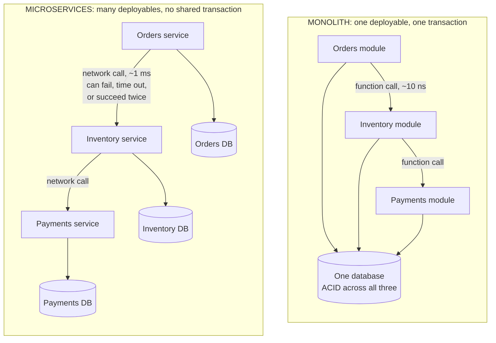

# Microservices versus monolith, argued both ways

## 1. What this is, and why they ask it

**A monolith is one deployable thing. Microservices are many deployable things, each owning its own data.**
That is the whole definition, and everything else follows from it.

**The question is almost never "which is better".** It is **"which is right for this system, this team, and
this year"** — and the honest answer changes as any of those three change.

**What is being tested is whether you can argue both sides.** **A candidate who says "microservices, because
they scale" has recited something.** **A candidate who says "microservices here, because these two parts have
genuinely different scaling profiles and different teams — but I would keep these four together, because
splitting them would put a network call in the middle of a transaction" has actually thought about it.**

They ask it because **it is the highest-stakes architectural decision most teams make, and the most commonly
got wrong in both directions.** **Teams of eight split a working system into forty services and spend two years
regretting it.** **Teams of two hundred keep one repository long past the point where nobody can deploy without
coordinating six other people.**

**And because the interviewer usually asks you to argue the opposite afterwards.** "Now convince me you are
wrong." **That is not hostility — it is the actual question**, and having only one side rehearsed is how it
goes badly.

By the end of this lesson you can define both properly, give four real arguments for each, name the point at
which splitting becomes right, describe the modular monolith and why it is the usual correct answer, and put
numbers on what a split costs in availability, latency, money and human attention.

---

## 2. The story

The family had run one restaurant on the main road for thirty-one years, and there was one kitchen at the back
of it.

The son came home from Bangalore in 2019 with an idea he had watched work there. **Six stalls instead of one
kitchen.** One for biryani. One for chaat. One for the tandoor. One for sweets. One for juices. One for dosas.
**Each with its own man in charge, its own money box and its own fire.**

His father said no for two years, and then said yes.

**The first year was very good.**

The biryani man could change his prices on a Tuesday without asking anybody, and did, twice. **When the dosa
grinder broke, the other five kept working** — in the old days a broken grinder had once shut the entire place
for a day and a half. **And the tandoor man, who was ambitious, nearly doubled his takings, because for the
first time nothing was stopping him.**

**The second year was harder, and it was harder in a way nobody had predicted.**

**A customer who wanted biryani and a lassi now queued twice.** Paid twice. And if the lassi came first he
stood there holding it while he waited for the rest.

**There was an argument every single evening about the cold room**, because six people wanted things out of it
and it belonged to none of them.

**And the thing that actually hurt: nobody could say how much the restaurant had taken that day** until all six
boxes had been counted and matched up, which ran until about eleven at night **and came out wrong roughly twice
a week.**

The father, who had been quiet about the whole business for two years, said one thing at the end of that
second year, and his son wrote it down.

**"Before, it was one kitchen and one problem. Now it is six kitchens — and one problem between every two of
them."**

**They kept the stalls.** It was clearly right for the biryani and the tandoor, which were each big enough to
stand on their own. **And they put the sweets and the juices back together into one counter, because between
them they were one man's work — and two boxes to count.**

---

## 3. The idea in plain English

**The father's sentence is the whole lesson.** **Splitting one thing into six does not give you six problems.
It gives you six things plus the relationships between them**, and relationships grow much faster than things
do.

### The definitions, properly

```
   MONOLITH
     one codebase, one build, one deployment
     one database, one transaction boundary
     calls between parts are FUNCTION CALLS
     -> to change anything, you deploy everything

   MICROSERVICES
     many codebases, many builds, many deployments
     EACH SERVICE OWNS ITS OWN DATA
     calls between services are NETWORK CALLS
     -> each part deploys on its own schedule
```

**The line that actually matters is the second one in each block: who owns the data.** **Many services sharing
one database is not microservices** — it is a monolith with extra network calls, and it has the costs of both
and the benefits of neither. **That arrangement has a name, and it is the most common failure in this whole
area: the distributed monolith.**

### The case FOR splitting

**Four arguments, and each one has a condition attached.**

**Independent deployment.** **The biryani man changes his prices without asking anybody.** In a monolith, every
change waits for the whole build, the whole test suite and one shared release. **This is the strongest
argument, and it only bites when several teams are contending for the same pipeline.**

**Independent scaling.** **Image processing needs eight times the CPU of everything else.** In a monolith you
scale the whole thing, so you pay for eight times the memory and eight times the database connections you did
not need. **Real, and it only matters when the profiles genuinely differ by a lot.**

**Fault isolation.** **The dosa grinder breaks and five stalls keep working.** In a monolith, a memory leak in
the reporting code takes down checkout with it. **But this only holds if the calls are optional** — if checkout
cannot complete without inventory, splitting them has not isolated anything.

**Team autonomy.** **Conway's law says a system ends up shaped like the organisation that built it.** **With
one team, one deployable is natural. With twelve teams, one deployable means twelve teams negotiating every
release**, and the architecture is fighting the organisation chart.

### The case AGAINST splitting

**Four arguments, and these are the ones candidates rarely have ready.**

**You lose transactions.** **This is the big one.** In a monolith, "reserve stock and take payment" is one
database transaction: **both happen or neither does, and the database guarantees it.** **Across services there
is no such guarantee.** You are into sagas, compensating actions, and eventual consistency — **which is not a
library you import, it is a permanent increase in the difficulty of every feature that touches two services.**

**Availability multiplies downward.** From [day 173](../day-173-xor/02-system-design-slas-slos-and-error-budgets.md):
**in series, availabilities multiply.** **Eight services at 99.9% each gives 99.2%** — five and a half hours a
month instead of forty-three minutes. **You did not build anything less reliable; you just needed all eight of
them to work.**

**Every call gets a hundred thousand times slower.** **A function call is about ten nanoseconds. A network call
in the same zone is about a millisecond.** **And the network call can fail, time out, or succeed twice**, none
of which a function call can do.

**Operational overhead per service, forever.** **A pipeline, a dashboard, alerts, a runbook, a repository,
dependency updates, a security patch cycle, and somebody on call.** **Multiply by the number of services.**
That is the counting of six money boxes at eleven at night.

### The middle answer, which is usually the right one

**A modular monolith: one deployable, with hard internal boundaries.**

```
   one build, one deployment, one transaction boundary
   BUT:
     clear modules with published interfaces
     no module reaching into another's tables
     enforced by tooling, not by good intentions
```

**You get most of the benefit of the boundaries — clear ownership, independent reasoning, easy extraction
later — without the network, the transactions or the operations.** **And when a module genuinely needs to be
split out, the seam is already there.**

**This is what several well-known companies do deliberately.** **Shopify runs a large modular monolith on
purpose.** **Segment famously split into microservices and then moved back, publishing why** — the operational
load on a small team outweighed everything they had gained.

**The order that works: monolith first, modular monolith as it grows, and extract services one at a time when a
specific pressure justifies a specific extraction.** **Not "we are going to be big one day, so let us start with
forty services."**

### When splitting is actually right

**Look for a specific pressure, not a general aspiration.**

```
   SPLIT WHEN                          NOT WHEN

   several teams are blocked on         one team of six, and the
   one release train                    release train works fine

   one component's scaling profile      "it might need to scale
   is genuinely 10x different           one day"

   one part has a much higher           everything has the same
   reliability requirement              requirement

   one part changes weekly and          everything changes at
   another changes yearly               about the same rate

   a bounded context is already         you have not found a real
   obvious in the domain                boundary and are splitting
                                        by technical layer
```

**That last row is the one to say out loud. Split by business capability, never by technical layer.**
**"Orders", "payments", "inventory" are services. "The API layer", "the business logic layer", "the data
layer" are not** — three services that must all be deployed together for any change is the distributed
monolith again, with three times the operations and none of the independence.

---

## 4. The picture

The two shapes, side by side:



**The important difference is not the number of boxes. It is the arrows and the databases.** **In the monolith,
"reserve stock and take payment" is one transaction the database guarantees.** **In the split version there is
no such guarantee anywhere**, and getting it back is the hardest ongoing cost of the decision.

Why six kitchens is not six problems:

```
   THINGS versus RELATIONSHIPS

   services   possible pairs = n(n-1)/2
   --------   ---------------------------
      1                0
      2                1
      3                3
      6               15      <- the restaurant
     10               45
     20              190
     40              780

   You did not create 40 problems. You created 40 things
   and up to 780 relationships, each of which is:
     a network call that can fail
     a contract that can drift
     a deployment order that can matter
     an argument about who owns the cold room

   In practice not every pair talks - but the number that
   DO grows much faster than the count of services, and
   nobody plans for it.
```

The availability arithmetic, which is the strongest single argument:

```
   every service is a very good 99.9%
   a request needs ALL of them

   services   availability      downtime per month
   --------   ------------      ------------------
      1       0.999             43 minutes
      2       0.998             86 minutes
      4       0.996             2 hours 53 min
      8       0.992             5 hours 44 min
     16       0.984             11 hours 30 min

   NOBODY BUILT ANYTHING WORSE.
   Each service is exactly as reliable as before.
   You just need all of them at once.

   THE FIXES, in order of value:
     make calls OPTIONAL      (search down -> hide the box)
     cache the last good answer
     make calls ASYNCHRONOUS  (a queue, so a slow service
                               delays rather than fails)
     add redundancy IN PARALLEL within each service
```

The latency arithmetic:

```
   in-process function call     ~10 nanoseconds
   network call, same zone      ~0.5-1 millisecond
                                = 50,000 to 100,000x slower

   a request that made 8 internal calls:
     as a monolith    8 x 10 ns   = 80 nanoseconds
     as services      8 x 1 ms    = 8 milliseconds

   -> 8 ms added to EVERY request, before any work is done.

   And that is the happy path. Each call can also:
     time out, and be retried (doubling the work)
     succeed but lose the response (so the caller retries
       something that already happened - hence idempotency)
     succeed slowly, holding a connection open
```

---

## 5. How it actually works

### Getting transactions back, and what it costs

**You cannot have ACID across services, so you replace it with a saga: a sequence of local transactions, each
with a compensating action if a later step fails.**

```
   ORDER SAGA
     1. orders:    create order (pending)
     2. inventory: reserve stock       -> compensate: release stock
     3. payments:  charge card         -> compensate: refund
     4. orders:    mark order confirmed

   If step 3 fails, run step 2's compensation.

   WHAT THIS COSTS YOU, and it is not small:
     - there is a window where stock is reserved and
       payment has not happened. Someone can see it.
     - compensations can THEMSELVES fail, so they need
       retries, and the retries need to be idempotent
     - a refund is not the inverse of a charge - the money
       moved, and the customer saw it
     - you now need a state machine per business process,
       and somewhere to run it
```

**Two ways to run one.** **Choreography** — each service emits an event and others react. **Simple to start,
and nobody can see the whole flow.** **Orchestration** — one coordinator drives the steps. **Visible and
debuggable, and it is a component that can itself fail.** **Temporal, AWS Step Functions and Camunda exist
because this is genuinely hard.**

**The honest sentence for an interview: "splitting these two services means every feature that touches both
becomes a saga, and I would rather keep them together than pay that on every future feature."**

### Communication styles

```
   SYNCHRONOUS (HTTP/REST, gRPC)
     simple, immediate, and it COUPLES AVAILABILITY -
     if the callee is down, the caller fails
     -> use for reads you cannot proceed without

   ASYNCHRONOUS (Kafka, SQS, RabbitMQ)
     the caller does not wait; the callee catches up
     -> the callee being down becomes a DELAY, not a failure
     -> availability stops multiplying
     -> the cost is eventual consistency: for a while, two
        services disagree, and the product has to tolerate it
```

**Turning a synchronous call into an asynchronous one is the single most effective way to stop availability
multiplying**, and it is worth naming as a concrete lever rather than a style preference.

### Data, which is where it really gets hard

**Each service owns its data, so nobody else may read its tables.** **Which immediately raises: how does the
orders service show a customer's name?**

```
   OPTION 1  call the users service on every request
             -> couples availability, adds latency

   OPTION 2  keep a local copy of the fields you need,
             updated by events
             -> fast and resilient
             -> DUPLICATED DATA, eventually consistent,
                and it can drift

   OPTION 3  the caller joins two responses
             -> pushes the problem outward, often to the
                gateway or the client
```

**There is no clean answer, and that is the point.** **In a monolith this was a `JOIN`.** **Every one of those
three options is worse than a `JOIN`, and you are choosing which kind of worse.**

**Reporting across services is the same problem at a larger scale**, and the usual answer is to stream
everything into a warehouse and query it there — **which is a whole additional system that the monolith did not
need.**

### The extraction pattern

**Nobody rewrites. The pattern is the strangler fig.**

```
   1. put a facade in front of the monolith
   2. build ONE new service alongside it
   3. route just that functionality to the new service
   4. when it is proven, delete the old code
   5. repeat, one capability at a time - for years

   -> the system works throughout
   -> each step is individually reversible
   -> and you can stop at any point, which matters,
      because you usually should stop before "everything"
```

**"We will rewrite it as microservices" is the answer that has destroyed the most companies in this area.**
**"We will extract the payment integration first, because it changes weekly and everything else changes
monthly" is a plan.**

### What you have to build before the first split

**This is the part that sinks small teams, and naming it is a strong signal.**

```
   centralised logging with a trace id       (day 172)
   distributed tracing                       (day 172)
   metrics and alerting per service          (day 171)
   a deployment pipeline per service         (day 174)
   service discovery
   a contract-testing story
   a local development story - how does an
     engineer run this on a laptop?
   an on-call rota that covers all of it

   -> With three services, you can improvise.
      With thirty and no platform team, this IS the job,
      and feature work stops.
```

---

## 6. The numbers

**Availability, in series.**

```
   n services, each 99.9%, all required:

   0.999^1  = 0.9990  ->  43 minutes/month
   0.999^2  = 0.9980  ->  86 minutes
   0.999^4  = 0.9960  ->  173 minutes  (2h 53m)
   0.999^8  = 0.9920  ->  344 minutes  (5h 44m)
   0.999^16 = 0.9841  ->  690 minutes  (11h 30m)

   -> Eight services turns a three-nines promise into
      roughly two-and-a-half nines, with nothing built worse.

   To keep 99.9% end to end with 8 required services,
   each one needs about 99.9875% - which is between three
   and four nines, and from day 173 each nine is ~10x
   the cost.
```

**Latency.**

```
   in-process call        ~10 ns
   same-zone network call ~500,000 ns (0.5 ms)
   -> 50,000x

   a request making 8 internal calls:
     monolith:      8 x 10 ns    = 0.00008 ms
     services:      8 x 0.5 ms   = 4 ms

   with serialisation, TLS and connection handling,
   1 ms per call is more realistic:  8 ms per request

   -> On a 50 ms budget that is 16% spent on the
      architecture before any work happens.
   -> And it compounds: if each of the 8 has a p99 of
      20 ms, the chance a request avoids ALL of them is
      0.99^8 = 92%, so 8% of requests hit at least one
      slow call.
```

**Money, from day 176.**

```
   8 internal calls x 100,000,000 requests/day x 20 KB
     = 16 TB/day of internal traffic

   spread across 3 zones, 2/3 crossing, $0.01/GB each way:
     10,560 GB/day x $0.02 = $211/day = $6,420/month

   THE MONOLITH'S EQUIVALENT COST: zero.
   Function calls do not appear on a bill.
```

**Human cost, which is the one that actually decides it.**

```
   PER SERVICE, PER MONTH, roughly:
     dependency and security updates      1 hour
     pipeline maintenance                 0.5 hour
     dashboards and alert tuning          0.5 hour
     on-call share, incidents, runbooks   1 hour
                                        ---------
                                          ~3 hours

   40 services x 3 hours = 120 hours/month
                         = 0.75 of a full-time engineer,
                           spent entirely on upkeep

   With 12 engineers, that is 6% of the entire team's
   capacity before anybody writes a feature.

   AND THE COGNITIVE COST:
     40 services / 12 engineers = 3.3 services each
     -> nobody can hold the system in their head
     -> "who owns this?" becomes a daily question
```

**Team size, which is the real trigger.**

```
   1 team of 6         -> a monolith. Splitting adds pure cost.
   3 teams of 6        -> a modular monolith. Boundaries in
                          the code, one deployment.
   8 teams of 6        -> the release train is now the
                          bottleneck. Extract along team lines.
   50 teams            -> microservices, and a platform team
                          whose whole job is the paved road.

   THE RULE OF THUMB: a service per TEAM, not per developer,
   and never more services than you have people to own them.
```

**And the counting-the-boxes number.**

```
   relationships between n services = n(n-1)/2 possible

    6 services ->  15
   20 services -> 190
   40 services -> 780

   Even if only 10% of pairs actually talk:
     40 services -> 78 real integrations
     each one: a contract, a failure mode, a version,
     a deployment ordering question
```

---

## 7. The trade-offs

**This section is the lesson, so here is each side stated as strongly as it deserves.**

**The case for microservices, at its strongest.**

**When several teams are contending for one release train, the release train becomes the bottleneck and it does
not get better.** Every change waits for the slowest test suite and the most nervous reviewer. **Independent
deployment is not a performance argument, it is an organisational one, and it is the one that actually
matters.**

**When one component genuinely needs ten times the resources of the rest, scaling the whole thing is real
money.** **And when one part must be far more reliable than the rest — payments against recommendations —
keeping them together means either over-engineering everything or under-protecting the important part.**

**And fault isolation is real when the calls are optional.** **A memory leak in the reporting code taking down
checkout is a genuine monolith failure**, and it happens.

**The case for the monolith, at its strongest.**

**Transactions.** **A single database guarantees that stock is reserved and payment is taken together, or
neither.** **Splitting them turns that guarantee into a saga with compensating actions, a visible inconsistency
window, and refunds that are not really the inverse of charges.** **Every future feature that touches two
services pays that tax, forever.**

**Availability.** **Eight services at three nines is two-and-a-half nines end to end, with nothing built
worse.**

**Simplicity, which is not a soft argument.** **One repository, one deployment, one place to look, and a
`JOIN` instead of three bad options for showing a customer's name.** **An engineer can run the whole thing on a
laptop, and that single fact is worth more to a small team's velocity than almost anything else on this page.**

**And speed of change, early on.** **Boundaries drawn before you understand the domain are boundaries in the
wrong places** — and a wrong boundary between two services is enormously more expensive to move than a wrong
boundary between two modules.

**Which is why the middle option is usually right.**

**A modular monolith gives you the boundaries without the network.** **Ownership, independent reasoning, and a
seam to extract along later — with one transaction, one deployment and no distributed anything.** **Shopify
does this deliberately. Segment split and moved back, publicly, because the operational load outweighed the
gains for the size of team they had.**

**I would not start with microservices** unless the organisation is already large enough that the release
train is a real bottleneck on day one. **I would not stay with a single undivided monolith** past the point
where several teams are blocked on each other. **And I would extract one service at a time, along team and
domain lines, when a specific pressure names a specific extraction.**

**And the thing I would refuse to do in either direction: split by technical layer.** **Three services that
must all be deployed together is a distributed monolith — every cost of the split, none of the independence.**

---

## 8. In the interview

### How it gets asked

- *"Would you build this as microservices?"* — and there is always a follow-up.
- *"Now argue the opposite."* — the actual question. Having one side rehearsed is how this goes badly.
- *"When would you split a monolith?"* — they want a trigger, not an aspiration.
- *"How do you handle a transaction across two services?"* — sagas, and what they cost.
- *"Your eight services are each 99.9% available. What is the system's availability?"* — arithmetic.
- *"How would you migrate?"* — strangler fig, and "not a rewrite".

### The first ninety seconds

On "would you build this as microservices":

> "**My default would be a modular monolith, and I would split later along a specific pressure. Let me say why,
> and then I am happy to argue it the other way.**
>
> **The definition I am working from is that microservices means many independently deployable services, each
> owning its own data.** **The data ownership is the part that matters** — many services sharing one database
> is a distributed monolith, which has the costs of both and the benefits of neither.
>
> **The strongest argument for splitting is organisational, not technical.** **When several teams are
> contending for one release train, the train becomes the bottleneck and it does not improve on its own.**
> **With one team of six, that pressure does not exist, and splitting is pure cost.**
>
> **The strongest argument against is transactions.** **In one database, 'reserve stock and take payment' is
> atomic — both or neither, guaranteed.** **Across services there is no such guarantee anywhere**, so it
> becomes a saga with compensating actions, a window where stock is reserved and payment has not happened, and
> a refund that is not really the inverse of a charge. **Every future feature touching both services pays that
> tax.**
>
> **And there is arithmetic I would put on the table unprompted.** **Availabilities multiply in series. Eight
> services at 99.9% each gives 99.2% end to end — five and three-quarter hours a month instead of
> forty-three minutes.** **Nothing was built worse; you just need all eight at once.** **And every internal call
> goes from about ten nanoseconds to about a millisecond, so eight calls add eight milliseconds to every
> request before any work happens.**
>
> **So my answer is: modular monolith now — hard internal boundaries, published interfaces, no module touching
> another's tables — and extract a service when something specific justifies it.** **A component whose scaling
> profile is genuinely ten times different, or a team that is blocked, or a part that changes weekly while
> everything else changes yearly.**"

### The follow-ups

**"Now argue the opposite. Convince me microservices are right here."**

> "**Happily, and there are four arguments, each with a condition.**
>
> **Independent deployment, which is the real one.** **Right now every change — a one-line copy fix — waits for
> the whole build, the whole test suite and one shared release.** **With twelve teams, that means twelve teams
> negotiating every release, and the coordination cost grows faster than the team does.** **Conway's law says
> the system ends up shaped like the organisation; if the organisation is twelve teams and the architecture is
> one deployable, the architecture is fighting the organisation and the organisation always wins.**
>
> **Independent scaling.** **If image processing needs eight times the CPU of everything else, in a monolith I
> scale the whole thing** — paying for eight times the memory, eight times the database connections and eight
> times the licence count that nothing needed. **Splitting that one component out is often the cheapest change
> available.**
>
> **Fault isolation, with the condition stated.** **A memory leak in the reporting code should not take down
> checkout, and in a monolith it does.** **But this only holds if the calls are optional** — if checkout cannot
> complete without inventory, splitting them has isolated nothing and only added a network hop.
>
> **And technology freedom, which I would rank last but not at zero.** **The one component that genuinely
> belongs in a different language — a machine-learning model, something that needs a specific runtime — can
> have it, without dragging the whole codebase along.**
>
> **The honest version of my position is that both answers are right at different sizes**, and the mistake is
> treating it as a permanent identity rather than a decision you revisit. **The father in the restaurant kept
> the stalls that deserved to be stalls and put the sweets and the juices back together, because between them
> they were one man's work and two money boxes to count. That is the right shape of answer.**"

**"How do you handle a transaction that spans two services?"**

> "**You do not — you replace it with a saga, and I want to be honest about what that costs rather than making
> it sound like a pattern you just apply.**
>
> **A saga is a sequence of local transactions, each with a compensating action.** **Create the order, reserve
> the stock, charge the card, confirm the order** — and if the charge fails, run the compensation for the
> reservation and release the stock.
>
> **Four costs, and I would name all four.**
>
> **There is a visible window** where stock is reserved and payment has not happened. **Somebody can observe
> that state, so the product has to have an answer for what it means.**
>
> **Compensations can themselves fail**, so they need retries, and retries mean every step must be idempotent —
> which is real work on every operation, not a library.
>
> **Compensations are not true inverses.** **A refund is not the opposite of a charge: the money moved, the
> customer saw it, and there may be a fee.** **Some things cannot be compensated at all** — an email that has
> been sent.
>
> **And you now need a state machine per business process and somewhere to run it.** **Choreography — each
> service emits events and others react — is easy to start and nobody can see the whole flow.
> Orchestration — one coordinator drives it — is visible and debuggable, and is itself a component that can
> fail.** **Temporal and Step Functions exist precisely because this is hard.**
>
> **Which is why my design rule is the other way round.** **I look at which operations must be atomic, and I
> keep those inside one service.** **Orders and order-items belong together. Orders and recommendations do
> not.** **If a proposed boundary would put a network call in the middle of something that has to be atomic,
> that is the strongest possible argument that the boundary is in the wrong place.**"

**"How would you migrate an existing monolith, and how do you know when to stop?"**

> "**Strangler fig, one capability at a time, and the stopping question is the more interesting half.**
>
> **The pattern: put a facade in front of the monolith, build one new service alongside it, route just that
> functionality across, prove it, then delete the old code.** **The system works throughout, and every step is
> individually reversible.** **What I would not do is a rewrite — 'we will rebuild it as microservices' is the
> plan that has destroyed the most projects in this area, because it means a long period where you are
> maintaining two systems and shipping nothing.**
>
> **I would choose the first extraction by pressure, not by architecture diagram.** **The part that changes
> weekly while everything else changes yearly. The part with a genuinely different scaling profile. The part a
> separate team already owns in practice.** **And I would prefer something at the edge with few dependencies,
> because the first extraction is where you build the platform.**
>
> **Which is the thing I would flag before starting: there is a fixed cost that arrives with service number
> two.** **Centralised logging with a trace id, distributed tracing, per-service metrics and alerts, a pipeline
> per service, service discovery, contract testing, and a story for how an engineer runs this on a laptop.**
> **With three services you can improvise; with thirty and no platform team, that becomes the job and feature
> work stops.**
>
> **And when to stop, which almost nobody asks.** **I would stop when the next extraction has no specific
> justification.** **Concretely: about three hours per service per month of upkeep — dependency updates,
> pipeline, dashboards, on-call share.** **Forty services is a hundred and twenty hours a month, three-quarters
> of an engineer, before anybody writes a feature. With twelve engineers that is six percent of capacity spent
> on existing.**
>
> **The rule I would actually apply is a service per team, not per developer** — **and never more services than
> there are people to own them.** **Segment split and then publicly moved back for exactly this reason. Putting
> two small services back together is a perfectly respectable outcome, and treating the split as
> irreversible is how teams end up with forty things and nobody who understands any twenty of them.**"

### The model answer

*"Would you build this as microservices? Now argue the opposite."*

> "**I will give you my answer, the strongest version of the other side, and then the thing that actually
> decides it.**
>
> **My answer is a modular monolith now, extracting services later along specific pressures.** **One
> deployable, one transaction boundary, but hard internal module boundaries with published interfaces and no
> module reaching into another's tables — enforced by tooling rather than good intentions.** **That gives me
> ownership and clear reasoning and a seam to extract along, without the network, the sagas or the
> operations.**
>
> **The argument for splitting, at full strength.** **It is organisational before it is technical. When several
> teams contend for one release train, the train is the bottleneck and it does not improve.** **Conway's law
> says the system takes the shape of the organisation, and if that fight is on, the organisation wins.** **Add
> genuinely different scaling profiles — one component needing eight times the CPU — and fault isolation where
> a leak in reporting currently takes down checkout, and that is a real case, not a fashionable one.**
>
> **The argument against, at full strength.** **You lose transactions, and that is permanent.** 'Reserve stock
> and take payment' stops being atomic and becomes a saga with compensating actions, an observable
> inconsistency window, refunds that are not inverses of charges, and idempotency required on every operation.
> **Every future feature that touches both services pays it.** **Availability multiplies downward: eight
> services at 99.9% is 99.2% end to end, five and three-quarter hours a month against forty-three minutes,
> with nothing built worse.** **Every call goes from ten nanoseconds to a millisecond, so eight calls add eight
> milliseconds before any work happens — and about six and a half thousand dollars a month of cross-zone
> traffic that function calls never generated.** **And roughly three hours per service per month of upkeep,
> which at forty services is three-quarters of an engineer doing nothing but maintenance.**
>
> **What actually decides it is not the architecture. It is the number of teams.** **One team of six: a
> monolith, and splitting is pure cost. Three teams: a modular monolith. Eight teams blocked on one release
> train: extract along team lines. Fifty teams: microservices, and a platform team whose whole job is making
> that survivable.**
>
> **Two things I would refuse in either direction.** **I would not split by technical layer — an API layer, a
> logic layer and a data layer as three services must all be deployed together, which is every cost of the
> split and none of the independence.** **And I would not treat the decision as permanent.** **Segment split
> and publicly moved back because the operational load outweighed the gains at their size.** **Putting two
> services back together is a respectable outcome.**
>
> **If I had to reduce it to one sentence, I would use the restaurant's.** **Splitting one thing into six does
> not give you six problems — it gives you six things and a problem between every two of them**, and the number
> of relationships grows much faster than the number of services. **So each split has to be paid for by
> something specific, and 'we might be big one day' does not pay for it.**"

---

## 9. Recall card

**A MONOLITH is one deployable with one transaction boundary; MICROSERVICES are many deployables, each OWNING
ITS OWN DATA.** **The data ownership is the definition** — many services sharing one database is a
**distributed monolith**: every cost of the split, none of the independence. **Never split by technical layer;
split by business capability.**

**FOR (each with a condition): independent DEPLOYMENT** (the real one — a release train several teams contend
for), **independent SCALING** (only when profiles differ ~10×), **FAULT ISOLATION** (only if the calls are
optional), **TEAM AUTONOMY** (Conway's law: the architecture fights the org chart and the org chart wins).
**AGAINST: you LOSE TRANSACTIONS** (sagas, compensations, an observable inconsistency window, refunds that are
not inverses, idempotency everywhere — paid on every future feature); **availability MULTIPLIES DOWNWARD**;
**every call is ~100,000× slower and can now fail, time out or succeed twice**; **~3 hours/service/month of
upkeep, forever.**

**The arithmetic to have ready.** **8 services at 99.9% = 0.999⁸ = 99.2% → 5h 44m/month instead of 43
minutes, with nothing built worse.** In-process call ~10 ns against a network call ~1 ms → **8 calls add 8 ms
to every request**. 16 TB/day of internal traffic ≈ **$6,420/month cross-zone**, where function calls cost
nothing. **40 services × 3 h = 120 h/month = 0.75 of an engineer on upkeep alone.** And relationships are
**n(n−1)/2** — 6 services is 15 pairs, 40 is 780.

**The usual right answer is the MODULAR MONOLITH**: one deployable and one transaction, with hard internal
boundaries enforced by tooling. Shopify does it deliberately; **Segment split and publicly moved back.**
**Migrate with the STRANGLER FIG — a facade, then one capability at a time, each step reversible — never a
rewrite.** And there is a **fixed platform cost that arrives with service number two**: tracing, per-service
metrics and pipelines, service discovery, contract tests, and a laptop story.

**Team count decides it, not taste.** 1 team → monolith. 3 teams → modular monolith. 8 teams blocked on one
release train → extract along team lines. 50 teams → microservices plus a platform team. **A service per TEAM,
never per developer, and never more services than there are people to own them.** **Splitting one thing into
six gives you six things and a problem between every two of them** — so every split must be paid for by a
specific pressure, and "we might be big one day" does not pay for it.
