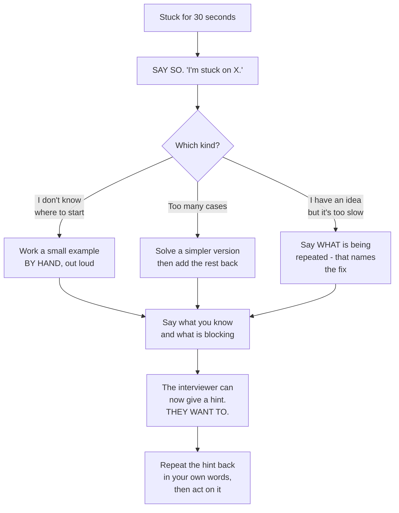

# How to think out loud in a coding round

## 1. What this is, and why they ask it

**A coding interview is graded on what you say, not on what you were thinking.** The interviewer cannot see
inside your head. **If you solve it silently and correctly, you get a lower score than someone who solves it
out loud and correctly** — and often a lower score than someone who talks well and does not quite finish.

**That is not unfair, and it is worth understanding why.** They are not testing whether you can produce
working code alone in a room. **They are testing what it would be like to work through a hard problem with you
in the next chair**, because that is the job. **Silence is the answer to a different question.**

**This lesson is a script.** The first five minutes, said in a fixed order, every time. **Having a script is
what stops the freeze**, because when a hard problem lands and your head goes blank, **you do not need an
idea — you need the next sentence**, and the script always has one.

They ask it because **it is the difference between two candidates with identical knowledge.** **One spends nine
minutes silently trying things and then writes hurriedly. The other spends ninety seconds naming the shape,
three minutes agreeing an approach, and then writes calmly with time left to test.** **Same person, same
ability, different outcome** — and the second one also gets helped when they go wrong, because the interviewer
could hear where they were.

By the end of this lesson you have the opening script word for word, the four clarifying questions that apply
to almost every problem, a time budget for a forty-five minute round, three specific moves for when you are
stuck, a phrasebook of what to say and what never to say, and a full worked example with the spoken words
alongside the code.

---

## 2. The story

There was a table outside the taluk office, under a blue tarpaulin tied to the railing, and a man sat at it
called Shivanna, and people paid him ten rupees to fill in their forms.

**He had been there nineteen years.** The forms themselves had changed four times.

What people noticed, if they queued long enough to watch, was that **he did not start writing when somebody sat
down.** Sometimes he did not start for two or three minutes. **And there was always a queue, and the man in the
chair would shift about and look at it.**

He asked questions instead. **Always the same ones, always in the same order.**

Whose name goes on it. Which office it is going to. What date it is needed by. Whether they had the previous
receipt. **And then the last one, which annoyed people more than the other four put together: "Now tell me, in
your own words, what you are actually trying to get."**

His nephew, who helped in the afternoons during the holidays, asked him one day why he wasted the time. **The
form was right there. He could simply start.**

Shivanna said something the boy thought was strange.

**"The form is easy. Anybody can fill in a form."**

"Then why all the questions?"

**"Because a form filled in wrongly comes back in six weeks. By then the date has passed and the man has to
start again."** He put the pen down. **"And in nineteen years I have never once seen a form come back because
of bad handwriting. They come back because we answered a different question from the one he was asking."**

The nephew said that the man in the chair does not like waiting.

**"He does not like waiting three minutes. He likes it a great deal better than waiting six weeks."**

And then the last thing, which the nephew only properly understood a season later, after he had done one badly
wrong himself.

**"Also — I say all five questions out loud, even when I already know the answers. Because if I have got it
wrong in my head, that is when he stops me."**

**"Then. Not afterwards."**

---

## 3. The idea in plain English

**Shivanna's five questions are the opening script, and his last sentence is the whole reason for it.** **You
say your understanding out loud so that the interviewer can correct you in the first two minutes rather than
the last two.**

### The arc of a forty-five minute round

```
   0-2    RESTATE the problem in your own words
   2-5    CLARIFY: the four questions, plus anything specific
   5-7    EXAMPLES: work one small one by hand, out loud
   7-10   APPROACH: brute force, its cost, then the better idea
          and its cost. AGREE it before writing.
   10-30  CODE, narrating decisions
   30-38  TEST by hand: the example, then edge cases
   38-45  COMPLEXITY, and the follow-up question

   -> A third of the round happens before you write anything.
      That feels wrong and it is correct.
```

**The most common failure is spending minutes 0 to 9 writing code that solves the wrong problem.** **The second
most common is spending them silently.**

### Restating, which takes twenty seconds and saves ten minutes

> *"So — I am given a list of integers, in no particular order, and I need to return the length of the longest
> run of consecutive whole numbers that appears in it. They do not have to be next to each other in the list.
> Have I got that right?"*

**Two things happen here.** **You find out immediately if you have misread it.** **And the interviewer learns
that you read carefully**, which is a thing they are marking.

### The four questions that always apply

**Ask these on every problem, even when you can guess the answers.** Shivanna asks all five out loud even when
he knows.

```
   1. HOW BIG?    "What is the range of n? And the values?"
                  -> this decides the algorithm, and they
                     usually answer with the intended one

   2. WHAT WEIRD INPUTS?
                  "Can it be empty? Can there be duplicates?
                   Negative numbers? Is it already sorted?"

   3. WHAT DO I RETURN WHEN THERE IS NO ANSWER?
                  "Empty list, or -1, or an exception?"

   4. CAN I MODIFY THE INPUT?
                  "May I sort it in place, or does the caller
                   still need it?"
```

**Then one or two specific to the problem.** For a string problem: character set, case sensitivity. For a
graph: directed or not, can there be cycles, is it connected.

**And listen to the answers, because they are hints.** **"n can be up to a hundred thousand" has just told you
O(n²) is out.** **"Assume it fits in memory" has just told you it is not a streaming problem.**

### Working an example by hand

**Take the smallest interesting input and say what the answer is and why.**

> *"So with `[100, 4, 200, 1, 3, 2]`, the runs are: 100 on its own, 200 on its own, and 1, 2, 3, 4. So the
> answer is 4. Let me also check what happens with an empty list — I would return 0."*

**This is where you notice things.** **Half the time you find an edge case the problem statement did not
mention**, and finding it here is worth far more than finding it in minute forty.

### Stating the approach before writing it

**Always say the brute force first, with its cost, even when you already know the good answer.**

> *"The obvious approach is: for each number, keep walking upwards while the next one exists, and track the
> longest. With a set for the lookups, each step is constant. But in the worst case — a single long run — I
> walk the whole run from every starting point, so that is O(n²)."*
>
> *"The fix is one line. I only start walking from a number that has no predecessor in the set. Every run then
> gets walked exactly once, so the total is O(n)."*
>
> *"O(n) time and O(n) space for the set. Shall I write that?"*

**Three things that paragraph does.** **It shows you can find a working answer** — a candidate who leaps to a
clever solution and gets it wrong has shown nothing. **It shows you can improve one.** **And "shall I write
that?" gives the interviewer a place to redirect you before you spend twenty minutes.**

**If they say "can you do better?", they mean it. If they say "sounds good", start typing.**

### Narrating while you code

**Narrate decisions, not keystrokes.**

```
   NOT THIS   "Now I'm writing a for loop... i equals zero...
               opening a bracket..."

   THIS       "I'm using a set rather than a list so the
               lookups are constant time."
              "I'll handle the empty case first so the main
               loop doesn't have to."
              "I'm iterating over the set rather than the
               original list, which also removes duplicates
               for free."
```

**Every sentence should be a reason.** **And silence for more than about twenty seconds should be filled — even
with "give me a second, I am working out whether this needs to be strictly less than or less than or
equal."** **That sentence is genuinely useful to the interviewer**; a blank stare is not.

### The three moves when you are stuck

**Being stuck is normal and is not the failure. Being stuck and silent is the failure.** **Say that you are
stuck, then use one of these.**

**Shrink the problem.** *"Let me solve it for the case where all the numbers are distinct and positive, and
then add the rest back."*

**Solve a special case by hand.** *"Let me work through a four-element example completely and see what I
actually do."* **This finds the algorithm surprisingly often, because you already know how to do it — you just
have not watched yourself doing it.**

**Say what you know and what is blocking.** *"I know I need constant-time lookups, so a set. And I know the
brute force repeats work. What I have not found is how to avoid walking the same run twice."*

**That third one is the most valuable thing you can say when stuck**, because it is precisely the sentence
that lets the interviewer give you a hint. **They want to.** A hint costs you far less than five silent
minutes.

### Taking a hint

**When a hint arrives, take it. Do not defend the previous idea.**

> *"Ah — so if I only start from numbers that have no predecessor, each run is walked once. Yes, that makes
> it linear. Let me change that."*

**Repeat the hint back in your own words before acting on it.** **It confirms you understood it**, and it is
the difference between "took the hint" and "was told the answer", which are marked very differently.

### Testing out loud

**Do not say "I think that is right."** **Run it, with your mouth.**

```
   1. the example from the problem, traced through the code
   2. the empty input
   3. one element
   4. all elements the same
   5. the case you were worried about while writing
```

**And say the values as you go.** *"present is the set of all six. First value 100 — is 99 in the set? No, so
this is a start. Walk up: is 101 in? No. Length 1. Best is 1."*

**Finding your own bug during this is a strong positive**, not a negative. **It is the single most reliable way
to convert "wrote code" into "wrote correct code" in the interviewer's notes.**

### What is actually being graded

**Most companies score four axes separately, and knowing them changes what you do with your time.**

```
   PROBLEM SOLVING   did you get to a good approach, and how?
   CODING            is it clean, correct, and would it compile?
   COMMUNICATION     could I follow you? did you take hints?
   TESTING           did you verify it, or did you hope?
```

**Two of those four are things you can be excellent at even on a problem you do not finish.** **Which is why
"almost finished, communicated superbly, found their own bug" beats "finished, said nothing" far more often
than candidates expect.**

---

## 4. The picture

The round as a timeline, with what the interviewer is writing:

```
   MINUTES   YOU                          THEY ARE NOTING
   -------   ---------------------------  -------------------------
    0 -  2   restate in your own words     "read it carefully"
    2 -  5   the four questions            "thinks about edge cases
                                            before, not after"
    5 -  7   work a small example aloud    "checks understanding
                                            against a concrete case"
    7 - 10   brute force + cost,           "can find A solution, then
             then better + cost,            improve it. Not guessing."
             then "shall I write that?"    "gave me a chance to
                                            redirect"
   10 - 30   code, narrating DECISIONS     "I can follow the reasoning"
                                           "clean, named things well"
   30 - 38   trace the example by hand,    "tests without being asked"
             then edge cases                "found their own bug"
   38 - 45   state complexity,             "knows what it costs"
             answer the follow-up           "has depth beyond the
                                            first answer"

   NOTE WHERE THE FIRST LINE OF CODE IS.
   Minute ten. Nearly a quarter of the round has gone, and
   that is the CORRECT allocation.
```

The phrasebook — what to say, and what it replaces:

```
   INSTEAD OF                    SAY

   (silence)                     "Give me a second, I'm working out
                                  whether this bound is inclusive."

   "This is easy."               "I think this is the sliding window
                                  shape. Let me check that against an
                                  example."

   "I've seen this one."         "I've seen something like this. Let
                                  me restate it to be sure it's the
                                  same problem."

   "It should work."             "Let me trace the example. present
                                  is {100, 4, 200, 1, 3, 2}. First
                                  value 100 - is 99 in the set? No..."

   "I don't know."               "I'm stuck on how to avoid walking
                                  the same run twice. I know I need
                                  constant-time lookups, so a set.
                                  What I don't have yet is..."

   "No, because..."              "That's a good point - let me think
   (defending a hint)             about it. So if I only start from
                                  numbers with no predecessor..."

   "Is this right?"              "I believe this is correct. Let me
                                  verify with the example, and then
                                  the empty case."

   "I'd need to look it up."     "I'd use a heap here. The API is
                                  heappush and heappop; let me write
                                  it and you can correct the exact
                                  names."
```

The stuck procedure, as a flow:



**The box that matters is the first one.** **Thirty seconds of silence is the limit** — after that, saying "I
am stuck on X" is strictly better than continuing to look thoughtful, **because it is the only thing that lets
anybody help you.**

---

## 5. The code, built step by step

**Here is a complete worked example, with the spoken words next to each piece.** The problem: *given an
unsorted list of integers, return the length of the longest sequence of consecutive integers. It must run in
O(n).*

### Minute 0-2: restate

> *"So I have a list of integers in no particular order, possibly with duplicates, and I need the length of the
> longest run of consecutive whole numbers that appears anywhere in it — they do not have to be adjacent in the
> list. For `[100, 4, 200, 1, 3, 2]` the answer would be 4, from 1, 2, 3, 4. Is that right?"*

### Minute 2-5: the four questions

> *"A few things before I start. How large can the list be? ... A hundred thousand, right, so O(n²) is about
> ten billion operations and is out.*
>
> *Can the list be empty? ... Then I return 0.*
>
> *Can there be duplicates? ... Yes — so I should be careful that a repeated number does not inflate a run.*
>
> *Negative numbers? ... Yes, fine, that does not change anything.*
>
> *And am I allowed to modify the input, or use extra space? ... The problem says O(n) time, which rules out
> sorting, so I will need extra space anyway."*

**Notice that "it must be O(n)" has already eliminated the sort-and-scan answer**, and saying so out loud shows
you understood why the constraint was there.

### Minute 5-7: a small example, by hand

> *"Let me take `[100, 4, 200, 1, 3, 2]`. Putting them in a set: 100, 4, 200, 1, 3, 2. The runs I can see are
> 100 on its own, 200 on its own, and 1, 2, 3, 4 together. So the longest is 4."*

### Minute 7-10: the brute force, then the fix

> *"The straightforward approach: put everything in a set for constant-time lookups. Then for each value, walk
> upwards — value plus one, value plus two — while the next one is present, and keep the longest."*

```python
def longest_consecutive_brute(numbers: list[int]) -> tuple[int, int]:
    """The honest first answer. Returns (answer, steps taken) so we can count the cost."""
    present = set(numbers)
    steps = 0
    best = 0
    for value in present:
        length = 1
        current = value
        while current + 1 in present:
            current += 1
            length += 1
            steps += 1
        best = max(best, length)
    return best, steps
```

> *"That is correct, but let me look at its cost, because I do not think it is linear. If the input is one long
> run — nought to n minus one — then starting from 0 I walk n steps, from 1 I walk n minus one, and so on. That
> is n(n−1)/2, so it is O(n²) in the worst case. For a thousand elements that is half a million inner steps
> rather than a thousand."*
>
> *"And the reason is that I walk the same run over and over from every point inside it."*
>
> *"So the fix is: only start walking from a number that is the beginning of a run — one whose predecessor is
> not in the set. Then each run is walked exactly once, and the total work across all runs is at most n."*
>
> *"That is O(n) time and O(n) space. Shall I write it?"*

**That is the whole interview, and it happened before any real code was written.**

### Minute 10-30: the code, with the decisions said

```python
def longest_consecutive(numbers: list[int]) -> tuple[int, int]:
    """Only start walking from a number with no predecessor. One line, and it is O(n)."""
    present = set(numbers)
    steps = 0
    best = 0
    for value in present:
        if value - 1 in present:
            continue                      # not the start of a run - skip it
```

> *"A set, not a list, because I need constant-time membership. Iterating over the set rather than the original
> list also deduplicates for free, which handles the duplicates question from earlier."*
>
> *"And this `continue` is the entire optimisation — if `value - 1` is present, this is the middle of a run and
> somebody else will walk it."*

```python
        length = 1
        current = value
        while current + 1 in present:
            current += 1
            length += 1
            steps += 1
        best = max(best, length)
    return best, steps
```

> *"Starting `length` at 1 because the value itself counts. And `best` starts at 0 so that the empty input
> returns 0 without a special case — let me double-check that: if the set is empty, the loop body never runs
> and we return 0. Good."*

**Saying "let me double-check that" and then checking it is worth more than getting it right silently.**

### Minute 30-38: testing, out loud

> *"Let me trace the example. The set is {1, 2, 3, 4, 100, 200}.*
>
> *Take 1: is 0 in the set? No, so this is a start. Walk: 2 present, 3 present, 4 present, 5 not. Length 4.
> Best is 4.*
>
> *Take 2: is 1 in the set? Yes — skip. Same for 3 and 4.*
>
> *Take 100: is 99 in? No. Walk: 101 not present. Length 1.*
>
> *Take 200: same, length 1.*
>
> *Answer 4. Correct.*
>
> *Now the edge cases. Empty list: the set is empty, the loop never runs, returns 0. Single element: no
> predecessor, walk finds nothing, length 1. All duplicates, `[1,1,1,1]`: the set is just {1}, so length 1 —
> good, that was the duplicates worry. Negatives, `[-3,-2,-1,5]`: −3 has no predecessor, walks to −1, length
> 3. Correct."*

### Minute 38-45: complexity, said properly

> *"Time is O(n). That deserves a sentence, because there is a nested loop and it looks quadratic. The inner
> `while` only runs for values that begin a run, and across all runs it visits each element at most once — so
> the total inner work is bounded by n, not multiplied by it.*
>
> *Space is O(n) for the set.*
>
> *If I were not allowed extra space, I would sort and scan, which is O(n log n) time and O(1) extra — and the
> problem's O(n) requirement is exactly what rules that out."*

### The complete solution

```python
"""Day 178 - one problem, solved the way it should be solved out loud."""

from __future__ import annotations


def longest_consecutive_brute(numbers: list[int]) -> tuple[int, int]:
    """The honest first answer. Returns (answer, steps taken) so we can count the cost."""
    present = set(numbers)
    steps = 0
    best = 0
    for value in present:
        length = 1
        current = value
        while current + 1 in present:
            current += 1
            length += 1
            steps += 1
        best = max(best, length)
    return best, steps


def longest_consecutive(numbers: list[int]) -> tuple[int, int]:
    """Only start walking from a number with no predecessor. One line, and it is O(n)."""
    present = set(numbers)
    steps = 0
    best = 0
    for value in present:
        if value - 1 in present:
            continue                      # not the start of a run - skip it
        length = 1
        current = value
        while current + 1 in present:
            current += 1
            length += 1
            steps += 1
        best = max(best, length)
    return best, steps


def longest_consecutive_clean(numbers: list[int]) -> int:
    """The version you would actually submit, without the step counter."""
    present = set(numbers)
    best = 0
    for value in present:
        if value - 1 in present:
            continue
        length = 1
        while value + length in present:
            length += 1
        best = max(best, length)
    return best


if __name__ == "__main__":
    print("THE EXAMPLE FROM THE PROBLEM")
    data = [100, 4, 200, 1, 3, 2]
    print(f"  {data}")
    print("  runs: 100 | 200 | 1,2,3,4   -> answer 4")
    print(f"  brute force: {longest_consecutive_brute(data)}   (answer, inner steps)")
    print(f"  with the guard: {longest_consecutive(data)}")

    print()
    print("THE EDGE CASES I WOULD TEST OUT LOUD")
    for case, expected in (
        ([], 0),
        ([7], 1),
        ([1, 1, 1, 1], 1),
        ([1, 2, 0, 1], 3),
        ([-3, -2, -1, 5], 3),
        ([9, 1, 4, 7, 3, -1, 0, 5, 8, -1, 6], 7),
    ):
        got = longest_consecutive_clean(case)
        print(f"  {str(case):<36} -> {got:<3} expected {expected}"
              f"   {'ok' if got == expected else 'WRONG'}")

    print()
    print("WHY THE ONE-LINE GUARD IS THE WHOLE ANSWER")
    print("  a single run of consecutive numbers, 0..n-1:")
    print("   n      brute steps     guarded steps")
    for n in (10, 100, 1000, 5000):
        run = list(range(n))
        _, brute_steps = longest_consecutive_brute(run)
        _, good_steps = longest_consecutive(run)
        print(f"  {n:>5}   {brute_steps:>12,}   {good_steps:>14,}")
    print()
    print("  brute force walks the whole run from EVERY starting point")
    print("  -> n(n-1)/2 steps.  The guard walks it once -> n-1 steps.")

    print()
    print("VERIFICATION")
    import random

    bad = 0
    for _ in range(3000):
        size = random.randint(0, 40)
        sample = [random.randint(-20, 20) for _ in range(size)]

        present = set(sample)
        expected = 0
        for value in present:
            if value - 1 not in present:
                length = 1
                while value + length in present:
                    length += 1
                expected = max(expected, length)

        if longest_consecutive_clean(sample) != expected:
            bad += 1
        if longest_consecutive(sample)[0] != expected:
            bad += 1
        if longest_consecutive_brute(sample)[0] != expected:
            bad += 1
    print(f"  {bad} mismatches over 3,000 random lists, 3 implementations each")
```

Running it:

```
THE EXAMPLE FROM THE PROBLEM
  [100, 4, 200, 1, 3, 2]
  runs: 100 | 200 | 1,2,3,4   -> answer 4
  brute force: (4, 6)   (answer, inner steps)
  with the guard: (4, 3)

THE EDGE CASES I WOULD TEST OUT LOUD
  []                                   -> 0   expected 0   ok
  [7]                                  -> 1   expected 1   ok
  [1, 1, 1, 1]                         -> 1   expected 1   ok
  [1, 2, 0, 1]                         -> 3   expected 3   ok
  [-3, -2, -1, 5]                      -> 3   expected 3   ok
  [9, 1, 4, 7, 3, -1, 0, 5, 8, -1, 6]  -> 7   expected 7   ok

WHY THE ONE-LINE GUARD IS THE WHOLE ANSWER
  a single run of consecutive numbers, 0..n-1:
   n      brute steps     guarded steps
     10             45                9
    100          4,950               99
   1000        499,500              999
   5000     12,497,500            4,999

  brute force walks the whole run from EVERY starting point
  -> n(n-1)/2 steps.  The guard walks it once -> n-1 steps.

VERIFICATION
  0 mismatches over 3,000 random lists, 3 implementations each
```

**Look at the step counts: at n = 5,000 it is 12.5 million against 5,000 — two and a half thousand times.**
**And the difference in the code is one `continue`.**

**That contrast is the thing to say out loud in the room.** Not "I added a check", but **"the check means each
run is walked once instead of once per element inside it, which is n(n−1)/2 against n."**

---

## 6. What it costs

**The solution.**

```
building the set:        n insertions          O(n)
the outer loop:          n values              O(n)
the inner while:         ACROSS ALL RUNS, each
                         element is visited at
                         most once             O(n) TOTAL
                                              --------
                                               O(n) time
                                               O(n) space for the set
```

**The inner loop is the part that needs saying properly**, because it looks nested and quadratic. **The guard
means only run-starters enter the inner loop, and the runs are disjoint** — so all the inner work together is
bounded by n.

**The brute force, counted.**

```
one run of length n, no guard:

  start at 0: n steps
  start at 1: n-1 steps
  ...
  start at n-1: 1 step

  total = n(n-1)/2

  n = 10    ->            45
  n = 100   ->         4,950
  n = 1,000 ->       499,500
  n = 5,000 ->    12,497,500

with the guard: n - 1 steps, always.

  n = 5,000 ->         4,999
  -> 2,500x
```

**The time budget, which is the arithmetic nobody does.**

```
   A 45-MINUTE ROUND, minus 5 for introductions and 5 for
   your questions at the end = 35 minutes of problem.

   SPENT WELL                    SPENT BADLY
   ------------                  -----------
   2  restate                    0  (starts coding)
   3  clarify                    9  silent trial and error
   2  example by hand            0
   3  approach + agree           1  "I'll use a hash map"
   20 code, narrating            18 code, silent
   5  test out loud              2  "I think that works"
   ---                           ---
   35                            30, and 5 minutes of the
                                 interviewer asking questions
                                 you should have answered

   SAME PERSON. SAME CODE.
   The left column also leaves room for the follow-up
   question, which is where the strongest signal is.
```

**The cost of silence, made concrete.**

```
   Interviewers typically score four axes.
   Suppose each is out of 4:

   CANDIDATE A: finishes, says almost nothing
     problem solving 3, coding 3,
     communication 1, testing 1        = 8/16

   CANDIDATE B: does not quite finish, narrates
   throughout, finds own bug, takes a hint well
     problem solving 3, coding 2,
     communication 4, testing 4        = 13/16

   -> This is not a trick. Two of the four axes are
      things you control completely, on any problem,
      including one you do not finish.
```

**And the cost of one clarifying question.**

```
   asking "how large can n be?"        ~8 seconds
   discovering in minute 25 that your
   O(n^2) solution was never going
   to be accepted                      ~25 minutes

   -> The four questions cost about a minute in total
      and are the cheapest insurance in the round.
```

---

## 7. The traps

**These are not code bugs. They are the things that lose rounds that the candidate could have won.**

**Starting to code in minute one.**

**It feels productive and it is the single most expensive mistake.** **You are optimising for looking busy in
front of somebody who is marking whether you think before acting.** **And if you have misread the problem,
every minute after that is wasted.**

**Going silent for two minutes.**

**From the other chair, silence is indistinguishable from being lost.** The interviewer cannot tell whether you
are three seconds from the answer or have no idea, **so they either interrupt — breaking your thought — or wait
and mark you down.** **Both are avoidable with one sentence: "I am working out whether the bound is
inclusive."**

**Narrating keystrokes instead of decisions.**

```
   "Now I'm going to write a for loop, i from zero to n..."
```

**This is worse than silence in one specific way: it fills the time without carrying information**, and the
interviewer stops listening. **Then when you do say something important, they miss it.**

**Defending an idea after a hint.**

**A hint means they have seen the problem hundreds of times and you have seen it once.** **"No, because..." is
the most expensive two words in the round.** **The correct response is to repeat the hint back in your own
words and act on it** — that reads as collaboration, and the alternative reads as something they will have to
manage every week if they hire you.

**Saying "this is easy".**

**If you finish quickly, it sounded arrogant. If you then get stuck, it sounds much worse.** **And it tells the
interviewer to make the follow-up harder**, which is not what you wanted.

**Not testing, or "testing" by asserting.**

```
   "I think that's right."          <- not a test
   "It should handle the empty case" <- not a test
```

**A test is you saying the values.** *"The set is empty, so the loop never runs, so we return best, which is
0."* **Anything else is a hope with a confident voice.**

**Asking no questions at all.**

**Every problem statement is deliberately incomplete.** **A candidate who never asks about empties, duplicates
or size is telling the interviewer they will build from an ambiguous ticket without checking**, and that is a
real and specific concern about how someone works.

**Announcing that you have seen the problem before, and stopping there.**

**Say it — hiding it is worse — but say it correctly.** *"I have seen something like this, so let me restate it
to be sure it is the same problem, and I will explain the reasoning rather than just recalling the code."*
**Reciting a memorised solution without being able to justify it is very visible, and it is worse than not
having seen it.**

**Leaving the complexity until you are asked.**

**Stating it unprompted is a small thing that reads as professional.** **Being asked "and what is the
complexity?" after you have said you are done reads as an omission**, even when your answer is right.

**And the one nobody warns you about: not managing the clock.**

**At minute 25 with no code, say so.** *"I want to make sure I get something working, so let me code the
straightforward version now and optimise if there is time."* **That sentence turns a probable fail into a pass
surprisingly often**, because it demonstrates exactly the judgement the job requires.

---

## 8. In the interview

### How it gets asked

- *"Talk me through your approach before you write any code."* — the explicit version, and a gift.
- *"What are you thinking?"* — you have been silent too long. Answer it, then keep narrating.
- *"Are you sure?"* — usually means no. Go back and check rather than defending.
- *"Can you do better?"* — they mean it. There is a better answer and they expect you to find it.
- *"How would you test this?"* — say specific inputs and their expected outputs, not categories.

### The first ninety seconds

**This is the script. It is the same shape on every problem.**

> **Restate.** *"So — I am given an unsorted list of integers, and I need the length of the longest run of
> consecutive whole numbers appearing anywhere in it, not necessarily adjacent. With `[100, 4, 200, 1, 3, 2]`
> that would be 4, from 1, 2, 3, 4. Have I understood it?"*
>
> **Clarify.** *"Four quick things. How big can the list be? Can it be empty? Can there be duplicates or
> negatives? And is there a space constraint, or may I sort it?"*
>
> **Listen to the answers.** *"A hundred thousand — so O(n²) is ten billion operations and is out. And it must
> be O(n), which also rules out sorting."*
>
> **Approach, brute force first.** *"The obvious version puts everything in a set and, from each value, walks
> upwards while the next one is present. Correct, but on a single long run I walk it from every starting point,
> so that is O(n²)."*
>
> **Then the fix, with its reason.** *"The improvement is one line: only start walking from a value whose
> predecessor is not in the set. Then each run is walked exactly once, so the total inner work is bounded by n.
> O(n) time, O(n) space."*
>
> **Then hand over.** *"Shall I write that?"*

**Under ninety seconds, and it has done six things**: shown you read carefully, surfaced the edge cases,
extracted the constraints, produced a working solution, improved it with a stated reason, **and given the
interviewer a place to redirect you before you spend twenty minutes.**

### The follow-ups

**"You've been quiet for a while. What are you thinking?"**

> "**Sorry — let me say where I am.**
>
> **What I know: I need constant-time membership checks, so a set. And I know the brute force repeats work,
> because on a long run it walks the same run from every element inside it.**
>
> **What I am stuck on is how to avoid that repetition without doing extra bookkeeping.**
>
> **What I was about to try is working a small example completely by hand** — `[1, 2, 3, 4]` — **and watching
> what I actually do, because I suspect I naturally start from the 1 and not from the 3, and I want to see why.**"

**Then, having done it:** *"Right — I start from the 1 because there is nothing below it. So the rule is: only
begin a walk at a value whose predecessor is absent."*

**That answer does three things.** **It states knowledge, blockage and next move separately**, which is the
most useful possible thing for the interviewer to hear. **It shows a concrete technique for getting unstuck
rather than just more staring.** **And it gives them a precise place to offer a hint** — which they would like
to do, because an interview where the candidate never gets anywhere produces no signal for them either.

**"Can you do better?"**

> "**Let me look at where the work is going rather than guessing at a different structure.**
>
> **The set lookups are already constant, so that is not it. The cost is in the inner walk, so the question is:
> what am I doing more than once?**
>
> **On a single long run — nought to n minus one — I start at 0 and walk n steps. Then I start at 1 and walk
> n minus one steps, over the same elements. That is n(n−1)/2, which for a thousand elements is half a million
> inner steps instead of a thousand.**
>
> **So the repetition is walking a run from every point inside it, when I only need to walk it from the
> beginning.**
>
> **The fix is to skip any value whose predecessor is in the set — that value is in the middle of a run and
> somebody else will cover it. One `continue`.**
>
> **And I would want to justify why that is genuinely linear, because the code still looks nested. Only
> run-starters enter the inner loop, the runs are disjoint, and together they contain at most n elements — so
> all the inner work summed is bounded by n rather than multiplied by it.**
>
> **O(n) time, O(n) space.**"

**"How would you test this?"**

> "**Specific inputs with specific expected outputs, and I would say them out loud rather than describing
> categories.**
>
> **First the given example, traced through my actual code.** The set is {1, 2, 3, 4, 100, 200}. Take 1 — is 0
> present? No, so it is a start; walk 2, 3, 4, stop at 5; length 4. Take 2 — 1 is present, skip. Take 100 — 99
> absent, walk, 101 absent, length 1. **Answer 4, correct.**
>
> **Then the empty list.** The set is empty, the loop body never runs, `best` is still 0. **Returns 0.**
>
> **Then a single element**, `[7]`: no predecessor, nothing above, length 1.
>
> **Then all duplicates**, `[1,1,1,1]`: the set collapses to {1}, so 1. **That is the duplicates case I asked
> about at the start, and it works because I iterate over the set rather than the list.**
>
> **Then negatives**, `[-3,-2,-1,5]`: −3 has no predecessor, walks to −1, length 3.
>
> **And then the case I was actually nervous about while writing: a run that is broken in the middle** —
> `[9,1,4,7,3,-1,0,5,8,6]`, which is −1 to 9 with 2 missing. **Two runs: −1,0,1 of length 3, and 3 to 9 of
> length 7. Answer 7.**
>
> **The last one is the useful habit: test the thing you were unsure about while you were writing it, not just
> the standard edge cases.** **That is where my own bugs actually live.**"

### The model answer

*"Talk me through your approach before you write any code."*

> "**Gladly — and I would want to do that even if you had not asked, because I would rather find out now that I
> have misunderstood something than in twenty minutes.**
>
> **First, let me say the problem back.** I have an unsorted list of integers, possibly with duplicates, and I
> need the length of the longest run of consecutive whole numbers appearing anywhere in it — **not necessarily
> next to each other in the list.** For `[100, 4, 200, 1, 3, 2]`, that is 4.
>
> **Second, four things I always want to know.** **How large can the input be — because that decides the
> approach.** **Whether it can be empty, and what I return then.** **Whether duplicates and negatives are
> possible.** **And whether there is a space constraint, or whether I may sort.**
>
> **And I would listen carefully to those answers, because they are usually hints.** **'A hundred thousand'
> means O(n²) is ten billion operations and is out. 'It must be O(n)' also rules out sorting, which is the
> other obvious approach — so the constraint has already told me quite a lot about the intended solution.**
>
> **Third, I would work the example by hand before proposing anything.** Runs of 100, of 200, and 1 through 4 —
> so the answer is 4. **That takes twenty seconds and it is where I usually notice something the statement did
> not say.**
>
> **Fourth, the brute force, out loud, with its cost — even though I can see the better answer.** **Put
> everything in a set, and from each value walk upwards while the next is present.** **Correct, but on a single
> long run I walk it from every starting point, which is n(n−1)/2 — half a million steps for a thousand
> elements instead of a thousand.**
>
> **I say the brute force first deliberately.** **It proves I can produce a working solution before optimising
> one, and a candidate who jumps straight to something clever and gets it slightly wrong has shown less.**
>
> **Fifth, the improvement, with the reason rather than the trick.** **The repetition is walking a run from
> every point inside it. So: only begin a walk at a value whose predecessor is absent from the set.** One
> `continue`. **Each run is then walked exactly once, so the total inner work across all runs is bounded by n.
> O(n) time and O(n) space for the set.**
>
> **Then I would stop and hand it back: 'shall I write that?'** — **because if you were going to steer me
> somewhere else, this is the cheapest possible moment for it.**
>
> **While I write, I will say the decisions rather than the keystrokes** — why a set rather than a list, why I
> iterate the set rather than the input, what the `continue` is doing. **And when I have finished I will trace
> the example out loud with actual values, then the empty list, one element, all duplicates and negatives**,
> **before I say the word 'done'.**"

---

## 9. Recall card

**You are graded on what you SAY, not what you thought.** The interviewer cannot see inside your head, and they
are not testing whether you can code alone in a room — **they are testing what it is like to solve a hard
problem sitting next to you.** **Most companies score four separate axes: problem solving, coding,
COMMUNICATION and TESTING** — and two of those you can be excellent at even on a problem you do not finish.

**The arc of 45 minutes: 0-2 restate · 2-5 the four questions · 5-7 an example by hand · 7-10 brute force with
its cost, then the better idea with its cost, then "shall I write that?" · 10-30 code · 30-38 test out loud ·
38-45 complexity and the follow-up.** **The first line of code is at minute TEN, and that is correct.** **Always
say the brute force first** — it proves you can find a solution before improving one.

**The four questions, on every problem, even when you can guess: HOW BIG? WHAT WEIRD INPUTS (empty,
duplicates, negatives, already sorted)? WHAT DO I RETURN WHEN THERE IS NO ANSWER? MAY I MODIFY THE INPUT?**
**Listen to the answers — "n up to 100,000" has just ruled out O(n²).** They cost about a minute and are the
cheapest insurance in the round.

**Narrate DECISIONS, not keystrokes.** "I'm using a set so lookups are constant" — not "now I open a bracket".
**Thirty seconds is the silence limit**; after that say what you are doing, even "I'm working out whether this
bound is inclusive". **When stuck: say so, then shrink the problem, or work a small case by hand, or state what
you know and what is blocking** — that last sentence is what lets the interviewer give you a hint, and **they
want to.** **Take hints by repeating them back in your own words; "no, because…" is the most expensive phrase
in the round.**

**Test by SAYING THE VALUES, not by asserting.** "The set is empty, so the loop never runs, so it returns 0" is
a test; "I think that's right" is a hope. **Test the thing you were unsure about while writing**, which is where
your bugs actually live — **finding your own bug is a strong positive.** **State the complexity unprompted.**
**And manage the clock: at minute 25 with nothing working, say "let me get the straightforward version down
first and optimise if there is time"** — that sentence turns a probable fail into a pass surprisingly often.
