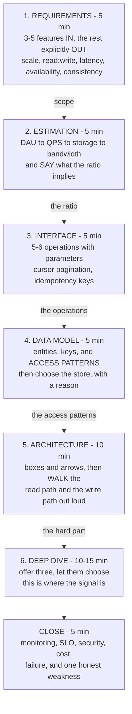

# The system design interview framework, memorised

## 1. What this is, and why they ask it

**A system design interview is forty-five minutes with no structure in it unless you bring one.** The
interviewer says "design a photo-sharing service" and then stops talking. **What happens next is entirely up to
you, and that is the test.**

**So you bring a fixed order and you run it every time.** **Requirements. Estimation. Interface. Data model.
Architecture. Deep dive.** Six beats, in that order, out loud, with the clock in mind.

**The order is not arbitrary.** **Each beat's output is the next beat's input.** You cannot choose a database
before you know the read-to-write ratio, **and you cannot know the read-to-write ratio before you have asked
how many users there are.** **Starting with the architecture — which is what almost everybody does, because it
is the enjoyable part — means guessing at things you could have known.**

They ask it because **the job is ambiguous and the interview is a sample of the job.** **Nobody at work hands
you a complete specification either.** The skill being measured is whether you can take four vague words, turn
them into a scoped problem with numbers attached, and then make defensible decisions.

**And because a framework is what stops the two classic failures.** **Going too broad** — forty minutes of
boxes with nothing examined — **and going too narrow** — thirty minutes on the caching layer before anybody has
agreed what the product does.

By the end of this lesson you have all six beats with what belongs in each, the sentences that open and close
them, a time budget, the reference numbers to have memorised, a worked estimation from a hundred million users
down to gigabytes per second, and the closing checklist that most candidates never reach.

---

## 2. The story

Kondappa had cooked at weddings for thirty-four years, and he had one question he asked before any other, and
he would not move until somebody answered it.

**"How many plates?"**

Not the menu. Not the date. Not who the bride's people were and what they expected. **How many plates.**

Families found this irritating, particularly the ones who had come to talk about food and wanted to talk about
food. **They would start telling him about the aunt who needed the paneer done a particular way**, and he would
let them finish, and then say it again.

**How many plates.**

Because everything came out of that number. **Four hundred plates and eleven hundred plates are not the same
wedding with more of it.** Four hundred could be done on three fires. **Eleven hundred needed six** — and six
fires needed a different sort of yard, and men who could work six fires, and a lorry for the vessels, **and the
thing nobody ever thought of, which was somewhere to wash eleven hundred plates between the two sittings.**

Once he had the number, the rest went in a fixed order and he never varied it. **Plates. Then sittings — one or
two. Then the menu. Then the vessels. Then the fires. Then the men. Then the timings, worked backwards from
when the food had to be on the table.**

His son-in-law watched him do this for two seasons and then asked whether the order ever changed.

**"Once," Kondappa said.**

There had been a wedding in 1998 where the family were old customers and he liked them, **and they had begun
with the menu, because the grandmother had views**, and he had gone along with it because it would have been
rude not to.

**Two days before, somebody mentioned the second sitting.**

**"We had planned the whole thing for six hundred. It was six hundred twice."**

They managed. He did not sleep for two nights, and he sent a boy on a scooter to three villages for extra
vessels.

**"The order is not a habit," he said. "The order is so that the thing you cannot change is decided before the
things you can."**

---

## 3. The idea in plain English

**"How many plates" is scale estimation, and Kondappa's fixed order is the framework.** **The reason it is
fixed is his last sentence: decide the things you cannot change first.**

### The six beats

```
   1. REQUIREMENTS       5 min   what are we building, and for whom
   2. ESTIMATION         5 min   how many plates
   3. INTERFACE          5 min   what can a caller actually do
   4. DATA MODEL         5 min   what is stored, and how is it read
   5. ARCHITECTURE      10 min   the boxes, and the request path
   6. DEEP DIVE      10-15 min   one hard thing, properly
                     ---------
                        45 min
```

**Announce this at the start. It takes fifteen seconds and it changes the whole round.**

> *"Before I start drawing — here is how I would like to use the time. About five minutes agreeing
> requirements and scope, five on scale estimates, then the API and data model, then the architecture, and I
> would like to leave fifteen minutes to go deep on whichever part you find most interesting. Does that work?"*

**Now you are driving.** **And the interviewer has been given a chance to say "actually, skip the API, I want
to spend the time on the feed" — which is enormously useful information you would otherwise have to guess.**

### Beat 1 — Requirements

**Two kinds, and candidates routinely give only the first.**

**Functional: what it does.** **Get to three to five core features and explicitly park the rest.**

> *"For a photo-sharing service, I will assume the core is: a user can post a photo, a user can follow another
> user, and a user can see a feed of photos from the people they follow. I am going to leave out comments,
> direct messages, stories and search unless you want them in. Is that the right core?"*

**Naming what you are excluding is as valuable as naming what you are including.** **It shows you can scope**,
and it stops the round sprawling.

**Non-functional: what it must be like.** **These are the ones that actually shape the design.**

```
   SCALE          how many users, how many actions each
   READ:WRITE     the single most design-shaping ratio
   LATENCY        "the feed loads in under 200 ms"
   AVAILABILITY   three nines? four? (day 173)
   CONSISTENCY    must a new post appear instantly for
                  everyone, or is a few seconds acceptable?
   DURABILITY     may we ever lose a photo? (no)
```

**The consistency question is the one that separates people.** **"A like count can be a few seconds stale, but
a payment cannot" is the kind of sentence that shows you know consistency is a product decision, not a
technical default.**

### Beat 2 — Estimation

**How many plates.** **The point is not precision — it is that the numbers decide the architecture.**

```
   DAU  ->  actions per user per day  ->  per second
        ->  peak = 2-3x average
        ->  bytes per action  ->  storage per day, per year
        ->  bytes served      ->  bandwidth
```

**And the conclusion has to be said out loud, or the arithmetic was decoration.**

> *"So that is about 23,000 reads a second against 230 writes — a hundred to one. That ratio is what tells me
> to build this read-optimised: heavy caching, read replicas, and probably fan-out on write so that reading a
> feed is a single lookup."*

**That last sentence is the entire reason for the beat.**

### Beat 3 — Interface

**Five or six operations, with their parameters. It takes three minutes and it forces precision.**

```
   POST   /photos            (image, caption)        -> photo_id
   GET    /feed              (cursor, limit)         -> [photo]
   POST   /users/{id}/follow                         -> ok
   GET    /users/{id}/photos (cursor, limit)         -> [photo]
```

**Two details worth including because they show experience.** **Pagination by cursor rather than by page
number** — offsets get slower as they grow and give inconsistent results when things are being inserted. **And
an idempotency key on anything that creates something**, so a retry does not double-post.

### Beat 4 — Data model

**The entities, their key fields, and — the part that matters — how they are read.**

```
   users     (user_id, name, created_at)
   photos    (photo_id, user_id, url, caption, created_at)
   follows   (follower_id, followee_id, created_at)
   feed      (user_id, photo_id, created_at)    <- materialised

   ACCESS PATTERNS, which decide the store:
     "photos by one user, newest first"   -> partition by user_id,
                                             sort by created_at
     "the feed for one user"              -> partition by user_id
     "who follows this user"              -> a second table with the
                                             other key order
```

**Design from the access patterns, not from a tidy entity diagram.** **In a key-value or wide-column store you
duplicate data so that every read is one lookup**, and saying that deliberately — rather than apologising for
it — is what shows you have used one.

**Then choose, with a reason.** *"Photos are blobs, so object storage plus a CDN, never a database. Metadata is
relational and small, so Postgres. The feed is enormous, append-only, and read by user id, so a wide-column
store partitioned by user."*

### Beat 5 — Architecture

**Now draw. Client, load balancer, services, stores, caches, queues.** **And then walk the request path for the
main flows, out loud.**

> *"A write: the client uploads directly to object storage using a pre-signed URL — the photo never passes
> through my service, which saves a great deal of bandwidth. The service then writes the metadata row, and
> publishes an event. A worker fans the photo out into the feed table of each follower."*
>
> *"A read: the feed service looks up the user's feed rows from the cache, falls back to the store on a miss,
> and returns photo ids. The client fetches the images from the CDN."*

**Walking the paths is what turns a diagram into a design.** **A drawing with no narrated path is just
boxes.**

### Beat 6 — Deep dive

**This is where the actual signal is, and where many candidates never arrive because they spent thirty minutes
on beats one to five.**

**Offer a choice.** *"There are three things I find interesting here: the fan-out problem for users with
millions of followers, how the feed cache is kept fresh, and how we shard the metadata. Which would you like?"*

**And if they leave it to you, pick the one with a real trade-off**, not the one you find easiest.

```
   THE STANDARD DEEP DIVES
     fan-out on write vs on read, and the hybrid
     hot keys / celebrity users
     caching: what, where, and how it is invalidated
     sharding: the key, and what happens when it is uneven
     the failure story: what happens when this box dies
     consistency: what a user sees during the gap
```

### The closing checklist

**Five minutes at the end, and almost nobody does this. It is the cheapest way to stand out.**

```
   MONITORING     the four golden signals, and what pages   (day 171)
   SLOs           the target, in minutes, and the budget    (day 173)
   SECURITY       auth, authz, the data you would not log   (day 175)
   COST           what this costs a month, roughly          (day 176)
   FAILURE        what happens when each box dies
   WHAT I'D DO
   DIFFERENTLY    one honest limitation of the design
```

**That last item is worth more than it looks.** *"The weakness of this design is the fan-out worker — if it
falls behind, feeds go stale and nothing alerts on it, so I would put a lag metric on it and page on that."*
**A candidate who can name their own design's weak point is telling you they have operated something.**

---

## 4. The picture

The round, with what belongs in each beat:



**Follow the arrow labels.** **Each beat hands the next one its input**, which is why the order is fixed:
**you cannot choose a store before you know the access patterns, and you cannot know the access patterns before
you know what the API does.**

The whiteboard, laid out before you start:

```
   +-----------------------+-------------------------------+
   | REQUIREMENTS          |                               |
   |  IN:  post, follow,   |                               |
   |       feed            |         ARCHITECTURE          |
   |  OUT: comments, DMs,  |     (leave this space empty   |
   |       search, stories |      until beat 5 - resist    |
   |                       |      the urge to draw early)  |
   | NON-FUNCTIONAL        |                               |
   |  100M DAU             |                               |
   |  reads:writes 100:1   |                               |
   |  p99 < 200 ms         |                               |
   |  99.9%                |                               |
   |  feed may be seconds  |                               |
   |    stale              |                               |
   +-----------------------+                               |
   | NUMBERS               |                               |
   |  23k reads/s          |                               |
   |  230 writes/s         |                               |
   |  40 TB/day uploaded   |                               |
   |  9.3 GB/s served out  |                               |
   +-----------------------+-------------------------------+
   | API                   | DATA MODEL                    |
   |  POST /photos         |  photos(photo_id, user_id...) |
   |  GET  /feed           |  follows(follower, followee)  |
   |  POST /users/{id}/    |  feed(user_id, photo_id, ts)  |
   |       follow          |                               |
   +-----------------------+-------------------------------+

   KEEP THE REQUIREMENTS AND THE NUMBERS VISIBLE ALL ROUND.
   You will refer back to them constantly, and so will they.
```

The two failure shapes:

```
   TOO BROAD                          TOO NARROW
   ---------                          ----------
   40 minutes of boxes                30 minutes on the cache
   every component named              nothing else exists
   nothing examined                   requirements never agreed
   no numbers anywhere                no idea of the scale

   "Breadth without depth. Could      "Went deep immediately on
    not tell whether they had          a part that may not even
    ever built any of it."             be the hard part here."

   THE FIX IS THE SAME FOR BOTH: the fixed order, with a
   clock. Beats 1-5 are DELIBERATELY shallow and quick.
   Beat 6 is deliberately deep. Neither works without the
   other.
```

---

## 5. How it actually works

### Driving the round

**The interviewer will not structure it for you, and their silence is not disapproval — it is the exercise.**

**Three sentences that keep you in control.**

**At the start:** *"Here is how I would like to use the time..."*

**At each transition:** *"I think we have enough on requirements — shall I move to some numbers?"*

**When you are unsure whether to go deeper:** *"I could go into how the fan-out handles celebrity accounts, or
move on to the data model. Which is more useful to you?"*

**That last one is the most useful sentence in the round**, because the interviewer has a rubric with specific
things on it, **and they will usually steer you towards them if you give them the chance.**

### Estimation, mechanically

**Do it in the same order every time and it takes three minutes.**

```
   1. USERS         "let us say 100 million daily active users"
   2. ACTIONS       reads per user per day, writes per user per day
   3. PER SECOND    divide by 86,400 (call it 100,000)
   4. PEAK          multiply by 2 or 3
   5. BYTES         per record, per photo, per response
   6. STORAGE       per day, then per year
   7. BANDWIDTH     bytes served per second
```

**Round aggressively and say that you are.** *"I will call a day 100,000 seconds, which is close enough and
much easier to divide by."* **Nobody wants four significant figures; they want to see that the order of
magnitude drives a decision.**

### The numbers worth memorising

```
   TIME
     1 day        = 86,400 s  (round to 100,000)
     1 month      = 2.6 million s
     1 year       = 31.5 million s

   LATENCY, roughly
     memory read           100 ns
     SSD read              100 microseconds  (1,000x memory)
     network, same zone    0.5 ms
     network, same region  1-2 ms
     network, cross-region 50-150 ms
     disk seek (spinning)  10 ms

   THROUGHPUT, order of magnitude
     one machine, simple HTTP    ~10,000 req/s
     one Postgres instance       ~5,000 writes/s
     one Redis instance          ~100,000 ops/s
     one Kafka partition         ~10 MB/s

   SIZES
     a UUID                16 bytes
     a timestamp            8 bytes
     a short text row     ~100 bytes - 1 KB
     a compressed photo     ~2 MB
     a thumbnail          ~200 KB
     one minute of 1080p video ~50 MB

   COSTS (day 176)
     object storage    $0.023 per GB-month
     egress            $0.09 per GB
     cross-zone        $0.01 per GB, each way
```

**These are not trivia.** **"A single Postgres instance does about five thousand writes a second, and I need
seven hundred, so one primary is fine and I do not need to shard yet" is a real design decision made in eight
seconds** — and the alternative is sharding something that did not need it.

### Scoping, and how to say no

**The interviewer often adds features to see whether you will accept everything.**

> *"Comments as well? I can add them, though I would rather finish the feed properly first — if we have time at
> the end I will come back to it. Which would you prefer?"*

**Accepting every addition is not agreeableness, it is a failure to prioritise**, and it is being marked as
such.

### Working with the interviewer's steering

```
   "How would you handle X?"        -> a genuine question. Answer it.
   "Are you sure about that?"       -> usually no. Re-examine, do
                                       not defend.
   "What if traffic went up 100x?"  -> they want to see whether the
                                       design degrades gracefully or
                                       falls over
   "Why did you choose Y over Z?"   -> the trade-off, both directions
   (long silence after you speak)   -> keep going; they are letting
                                       you drive
```

### The variants, so the framework does not break

**Not every design round is "design Twitter".**

```
   HIGH-LEVEL DESIGN     the six beats as written
   LOW-LEVEL DESIGN      "design a parking lot" - classes,
                         relationships, patterns. Requirements
                         and interface still come first, but
                         beats 2 and 5 shrink to almost nothing.
   A DEEP-DIVE ROUND     "design a rate limiter" - go straight
                         to beat 6 after a short beat 1
   A DEBUGGING ROUND     "the p99 has doubled" - not this
                         framework. Metrics, then traces,
                         then logs. (day 171-172)
```

**Recognising which round you are in, out loud, in the first minute, is itself a signal.** *"This sounds like a
low-level design question, so I will spend most of the time on the class model rather than on scale — tell me
if you would rather I went the other way."*

---

## 6. The numbers

**A full worked estimation, for a photo-sharing feed.**

```
   ASSUMPTIONS, stated out loud
     100,000,000 daily active users
     each reads their feed 20 times a day
     each posts 0.2 photos a day (1 photo every 5 days)
     an average photo is 2 MB; a thumbnail is 200 KB
     metadata per photo is about 1 KB
     the average user follows 200 people
```

**Reads and writes per second.**

```
   READS
     100,000,000 x 20 = 2,000,000,000 feed reads/day
     2e9 / 86,400 = 23,148 reads/second average
     peak x3      = ~70,000 reads/second

   WRITES
     100,000,000 x 0.2 = 20,000,000 photos/day
     2e7 / 86,400 = 231 writes/second average
     peak x3      = ~700 writes/second

   RATIO: 23,148 / 231 = 100 : 1

   -> READ HEAVY. That single number decides:
        cache aggressively
        read replicas, not write sharding, first
        fan-out ON WRITE (do the work once, at write
          time, so a read is one lookup)
```

**Storage.**

```
   PHOTOS
     20,000,000/day x 2 MB = 40,000,000 MB = 40 TB/day
     x 365                 = 14.6 PB/year

   -> obviously not a database. Object storage plus a CDN.

   METADATA
     20,000,000/day x 1 KB = 20 GB/day
     x 365                 = 7.3 TB/year
     x 5 years             = 36.5 TB

   -> comfortably a sharded relational store, or one big one
      with archiving.

   THE FEED TABLE, if fanning out on write
     20,000,000 photos/day x 200 followers each
       = 4,000,000,000 feed rows/day
     at 50 bytes a row = 200 GB/day = 73 TB/year

   -> and THAT number is why you cap the feed at, say, the
      most recent 1,000 entries per user and expire the rest.
        100,000,000 users x 1,000 rows x 50 bytes = 5 TB total.
```

**Bandwidth, which is the line people forget.**

```
   SERVED TO USERS
     2,000,000,000 feed reads/day
     each showing ~10 thumbnails at 200 KB
       -> but with caching, assume 2 new images per read
     2e9 x 2 x 200 KB = 800,000,000 MB = 800 TB/day
     800 TB / 86,400 s = ~9.3 GB/second

   -> This is a CDN problem, not an origin problem.
      At $0.09/GB direct egress that is 800,000 GB/day
      x $0.09 = $72,000/DAY. With a CDN and a 95% hit
      rate it is a small fraction of that.

   UPLOADED
     20,000,000 x 2 MB = 40 TB/day = ~460 MB/second
   -> and this is why the client uploads DIRECTLY to object
      storage with a pre-signed URL, rather than through
      your service.
```

**Machines, from the throughput numbers.**

```
   70,000 peak reads/second
   one application machine handles ~10,000 simple req/s
     -> 7 machines, so 15-20 with headroom and redundancy

   700 peak writes/second
   one Postgres primary handles ~5,000 writes/s
     -> ONE primary is enough. Do not shard yet.
        Say that out loud - it is a decision, and the
        wrong instinct is to shard because it sounds
        impressive.

   the feed cache: 100,000,000 users x 1,000 entries
     x 50 bytes = 5 TB
     -> too big for one Redis. Shard by user_id, or cache
        only the active users:
        20% active in an hour -> 1 TB -> ~15 nodes
```

**And the time budget of the round itself.**

```
   45 minutes, minus 3 for introductions and 5 for your
   questions = ~37 minutes of design.

   BEAT   MINUTES   CUMULATIVE
   1      5         5
   2      5         10
   3      4         14
   4      5         19
   5      9         28
   6      9         37

   IF YOU ARE AT MINUTE 25 AND STILL DRAWING BOXES:
     say so, and cut. "I am going to stop adding components
     and go deep on the fan-out, since that is the hard part
     here." That sentence rescues the round.
```

---

## 7. The trade-offs

**A framework buys structure and costs flexibility, and it is worth being honest about where it does not
fit.**

**The six beats are wrong for a low-level design round.** **"Design a parking lot" needs requirements and an
interface, and then classes, relationships and patterns** — the estimation and architecture beats shrink to
almost nothing. **Running the full framework there wastes ten minutes on queries per second nobody cares
about.** **Say which round you think you are in, in the first minute, and let them correct you.**

**Estimation can become theatre.** **The point is that a number changes a decision.** **If you compute a
storage figure and then never refer to it, you have spent five minutes on arithmetic that bought nothing** —
and the interviewer notices. **Every number should be followed by "so...".**

**Beats one to five are deliberately shallow, and that feels wrong.** **You will want to explain the caching
strategy while drawing the cache.** **Do not** — you have nine minutes of deep dive reserved, and spending it
early means arriving at minute forty with no time for the part that carries the most signal. **"I will come
back to how that cache is invalidated in the deep dive" is the sentence.**

**Announcing the plan can sound rehearsed.** **It is rehearsed, and that is fine** — but say it in your own
words and adapt it to what they answer. **A candidate who recites a framework while ignoring the interviewer's
steering is worse than one with no framework at all**, because now they are unresponsive as well as
disorganised.

**And the framework does not choose anything for you.** **It guarantees you will reach the fan-out question at
minute twenty-eight.** **It has no opinion about whether fan-out on write is right for this product** — that
comes from the hundred and seventy days behind you. **The structure is what buys you the time to think about
the interesting part; it is not a substitute for having something to say about it.**

**The honest summary: the framework is worth perhaps a third of the score.** **It prevents both classic
failures, it gets you to the deep dive with time left, and it makes you legible.** **The other two thirds are
the actual engineering judgement — and those are not something a running order can supply.**

---

## 8. In the interview

### How it gets asked

- *"Design a photo-sharing service."* — four words, then silence. That silence is the exam.
- *"Where would you like to start?"* — a gift. Answer with the plan.
- *"How would you scale this?"* — they mean a specific bottleneck; find it before answering.
- *"What happens if this box dies?"* — the failure story, for every box.
- *"What would you change if you had more time?"* — name a real weakness of your own design.

### The first ninety seconds

> "**Before I draw anything, let me say how I would like to use the time, and then agree what we are
> building.**
>
> **I would spend about five minutes on requirements and scope, five on some rough numbers, then the API and
> the data model fairly quickly, then the architecture — and I would like to keep about fifteen minutes at the
> end to go deep on whichever part you find most interesting. Does that work for you?**
>
> **On scope: I am going to assume the core is three things.** A user can post a photo. A user can follow
> another user. **A user can see a feed of recent photos from the people they follow.** **I am explicitly
> leaving out comments, direct messages, search and stories** — tell me if any of those should be in, but
> otherwise I would rather do those three properly.
>
> **On the non-functional side, five questions.** **How many daily active users are we designing for?** **What
> latency should a feed load in?** **What availability are we targeting?** **And the one that shapes this most:
> when somebody posts, does it have to appear in their followers' feeds immediately, or is a few seconds
> acceptable?**
>
> **I would push on that last one, because it decides the architecture.** **If a few seconds of staleness is
> acceptable, I can do the expensive work asynchronously at write time and make reads a single lookup. If it
> must be immediate, that option is gone.**
>
> **Let us say a hundred million daily active users, a feed in under 200 milliseconds at the 99th percentile,
> three nines of availability, and a few seconds of staleness is fine. Shall I put some numbers on that?**"

### The follow-ups

**"Give me the numbers, and tell me what they change."**

> "**I will do it in the same order I always do, and I will round hard — I want the order of magnitude, not
> four significant figures.**
>
> **Users and actions.** A hundred million daily active users. **Say each reads their feed twenty times a day
> and posts a photo every five days**, so 0.2 posts each.
>
> **Per second.** **Two billion feed reads a day, divided by 86,400 — I will call it a hundred thousand seconds
> — is about twenty-three thousand reads a second.** **Twenty million photos a day is about 230 writes a
> second.** **Peak is two to three times average, so seventy thousand reads and seven hundred writes.**
>
> **And here is the number that matters: the ratio is a hundred to one.**
>
> **That single figure decides three things.** **It is read-heavy, so I cache aggressively.** **I reach for read
> replicas before write sharding.** **And I fan out on write — do the expensive work once when a photo is
> posted, so that reading a feed is a single lookup rather than a query across two hundred followees.**
>
> **Storage.** **Twenty million photos a day at two megabytes is forty terabytes a day, about fifteen petabytes
> a year** — **obviously object storage and a CDN, never a database.** **Metadata at a kilobyte each is twenty
> gigabytes a day, seven terabytes a year, which is comfortable for a relational store.**
>
> **The feed table is the interesting one.** **Twenty million photos times two hundred followers is four
> billion feed rows a day — seventy-three terabytes a year, which is not sustainable.** **So I cap each user's
> feed at the most recent thousand entries: a hundred million users times a thousand rows times fifty bytes is
> about five terabytes total, which is fine.**
>
> **And machines.** **Seven hundred peak writes a second against roughly five thousand a Postgres primary can
> take — so one primary is enough and I would not shard yet.** **I want to say that explicitly, because the
> instinct is to shard because it sounds impressive, and adding a shard key you do not need is a decision you
> live with for years.**"

**"Go deep on the fan-out."**

> "**Good — that is the hard part here, and there are three approaches with a real trade-off between them.**
>
> **Fan-out on write.** When a photo is posted, a worker writes one row into the feed table of every follower.
> **Reads become a single lookup by user id, which is exactly what a hundred-to-one read ratio wants.** **The
> cost is write amplification: one post becomes two hundred writes on average.**
>
> **And it breaks completely on celebrities.** **A user with fifty million followers means fifty million writes
> for one post.** At 231 posts a second overall that is fine on average, **but a single celebrity post is a
> fifty-million-row burst**, and the feed workers fall behind for everybody.
>
> **Fan-out on read.** Store nothing; at read time, query the photos of everyone the user follows and merge.
> **No write amplification, and no celebrity problem.** **But every feed read becomes a scatter-gather across
> two hundred partitions**, at seventy thousand reads a second — which is fourteen million partition queries a
> second. **Not viable.**
>
> **So the answer is the hybrid, and this is the design I would propose.** **Fan out on write for ordinary
> users. For accounts above a threshold — say a hundred thousand followers — do not fan out at all.** **At read
> time, take the user's pre-computed feed and merge in the recent posts of the handful of celebrities they
> follow.**
>
> **The merge is cheap because the number of celebrities any one person follows is small — typically under
> fifty — and their recent posts are in a hot cache that every reader shares.**
>
> **Three things I would want to name about it.** **The threshold is a tuning knob and it will be wrong at
> first, so it must be configurable without a deploy.** **The fan-out worker's lag is the thing that actually
> breaks this** — if it falls behind, feeds go stale silently and no user-facing metric moves, **so I would put
> a lag metric on the queue and alert on it, because it is the failure with no natural symptom.** **And there
> is a consistency gap: for a few seconds after posting, some followers have it and some do not.** **We agreed
> that was acceptable in the requirements, which is why I asked at the start.**"

**"What would you change, and what worries you about this design?"**

> "**Three things, and I would rather raise them than have you find them.**
>
> **The fan-out worker is the weakest point.** **It is asynchronous, so when it falls behind nothing
> user-facing breaks immediately — feeds just quietly get older.** **There is no natural symptom, which is
> exactly the kind of failure that runs for hours.** **So: a queue-lag metric, an alert on it, and a
> user-visible check that the newest item in a feed is not more than a minute old.**
>
> **The celebrity threshold is a guess.** **A hundred thousand followers is a number I made up, and the right
> value depends on the actual follower distribution, which is heavily skewed.** **I would make it a
> configuration value, measure the fan-out cost against the merge cost at read time, and tune it — and I would
> expect the first value to be wrong.**
>
> **And I have optimised entirely for the read path, which is right at a hundred to one, but it makes some
> things awkward.** **Deleting a photo now means removing it from up to a thousand materialised feeds.** **I
> would handle that with a tombstone and filtering at read time rather than a synchronous delete fan-out — but
> it is real complexity that the fan-out-on-read design would not have.**
>
> **If I had more time, the two things I would add are the operational ones.** **The four golden signals per
> service with the feed staleness as a custom one; an availability target of three nines, which is
> forty-three minutes a month, with an error budget attached.** **And I would put a cost estimate on it — the
> bandwidth alone is around eight hundred terabytes a day, which at direct egress prices would be seventy
> thousand dollars a day, and is the single strongest argument for the CDN being in the design rather than an
> afterthought.**"

### The model answer

*"Design something. Show me your process, not just your answer."*

> "**My process is a fixed order, and the reason it is fixed is that each step decides the next one.**
>
> **I start by announcing the plan, because the interviewer has a rubric and this gives them a chance to
> redirect me before I spend twenty minutes in the wrong place.** *Five minutes on requirements, five on
> numbers, then API and data model quickly, then architecture, and fifteen minutes kept back to go deep.*
>
> **Then requirements, in two halves.** **Functional: three to five features in, and — just as important —
> everything else explicitly out.** **Non-functional: scale, read-to-write ratio, latency, availability, and
> consistency.** **I push hardest on consistency, because 'must a post appear instantly' is a product question
> whose answer changes the entire architecture, and it is the one nobody asks.**
>
> **Then estimation, which is the beat I would not skip under any circumstances.** **Users, actions, per
> second, peak, bytes, storage, bandwidth.** **Rounded hard.** **And every number followed by 'so...' — because
> a number that does not change a decision was decoration.** **A hundred-to-one read ratio tells me to cache
> and to fan out on write. Seven hundred writes a second against five thousand a Postgres primary can take
> tells me not to shard, which is a decision I want to make deliberately rather than by instinct.**
>
> **Then the interface and the data model, quickly.** **Five or six operations, cursor pagination rather than
> offsets, idempotency keys on creates.** **And the data model designed from the access patterns rather than
> from a tidy entity diagram — in a wide-column store I duplicate data on purpose so every read is one
> lookup.**
>
> **Then the architecture — and I draw it, and then I walk the read path and the write path out loud.** **A
> drawing nobody walks through is just boxes.**
>
> **Then the deep dive, and I offer a choice: 'the fan-out for celebrity accounts, the cache invalidation, or
> the sharding — which is most useful to you?'** **That is where the real signal is, and getting there with
> fifteen minutes left is the whole reason for keeping beats one to five shallow.**
>
> **And I close with the checklist most candidates never reach.** **Monitoring and what pages. The availability
> target in minutes and its error budget. Authentication, authorisation, and what I would refuse to log. A
> rough monthly cost. What happens when each box dies. And one honest weakness of my own design.**
>
> **That last one matters most.** **Every design has a soft spot, and a candidate who names their own — 'the
> fan-out worker fails silently, so I would alert on queue lag' — is telling you they have run something in
> production.** **A candidate whose design has no weaknesses has simply not looked.**
>
> **The framework is worth maybe a third of it, and I would not pretend otherwise.** **It stops me being too
> broad or too narrow, and it buys me the time to think about the interesting part.** **The other two thirds
> are whether I actually have something to say when I get there.**"

---

## 9. Recall card

**Six beats, fixed order, because each one's output is the next one's input.** **1 REQUIREMENTS (5) · 2
ESTIMATION (5) · 3 INTERFACE (5) · 4 DATA MODEL (5) · 5 ARCHITECTURE (10) · 6 DEEP DIVE (10-15).**
**Announce the plan in the first fifteen seconds** — it puts you in control and lets the interviewer redirect
you before you waste twenty minutes. **Beats 1-5 are deliberately shallow; beat 6 is deliberately deep.** The
two classic failures are **too broad** (40 minutes of boxes, nothing examined) and **too narrow** (30 minutes
on the cache before anyone agreed what the product does).

**Requirements has two halves and candidates give only the first.** Functional: **3-5 features IN and the rest
explicitly OUT** — naming what you exclude shows you can scope. Non-functional: **scale, read:write, latency,
availability, CONSISTENCY, durability.** **Push hardest on consistency** — "must a post appear instantly?" is a
product question that changes the whole architecture.

**Estimation is "how many plates", and every number must be followed by "so…".** DAU → actions → ÷86,400 (call
it 100,000) → **peak ×2-3** → bytes → storage/year → bandwidth. **100M DAU × 20 reads = 23,000 reads/s against
230 writes/s = 100:1 — SO cache hard, read replicas before sharding, fan out on write.** 20M photos × 2 MB =
**40 TB/day**, so object storage and a CDN, never a database. **700 peak writes against ~5,000/s for one
Postgres primary — SO do not shard yet**, and say that deliberately.

**Memorise the reference numbers**: memory 100 ns · SSD 100 µs · same-zone network 0.5 ms · cross-region
50-150 ms · one app machine ~10,000 req/s · one Postgres ~5,000 writes/s · one Redis ~100,000 ops/s · photo
2 MB · row ~1 KB · egress $0.09/GB. **They turn "should I shard?" into an eight-second decision.**

**Design the data model from ACCESS PATTERNS, not a tidy entity diagram; walk the read path and the write path
out loud** (a drawing nobody walks through is just boxes); **offer the interviewer a choice of deep dive.**
**Close with the checklist almost nobody reaches: monitoring and what pages, the SLO in minutes with its error
budget, auth and what you would refuse to log, a monthly cost, what happens when each box dies — and one
honest weakness of your own design.** *"The fan-out worker fails silently, so I would alert on queue lag."*
**A design with no named weakness is a design nobody looked at.**
