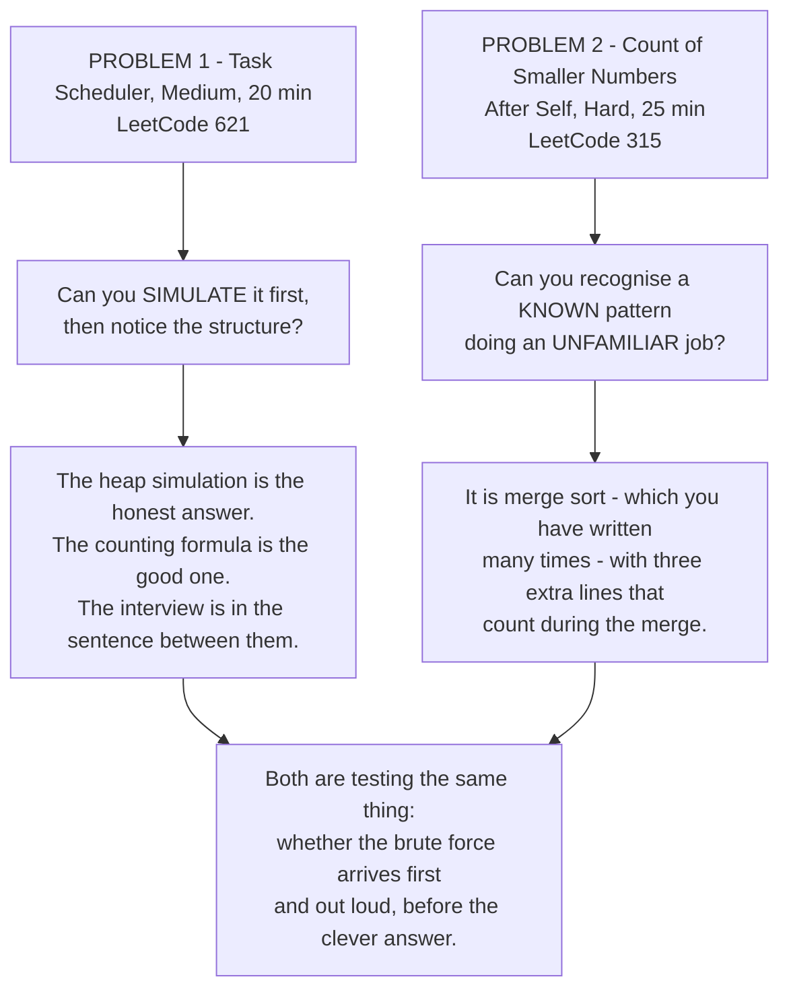

# Full mock: two problems, forty-five minutes

## 1. What this is, and why they ask it

**This is the round itself.** Two problems — one medium, one hard — forty-five minutes, talking the whole time,
**and no running the code.**

**Performing is a separate skill from knowing.** You have solved several hundred problems. **You have almost
certainly not solved two of them, consecutively, under a clock, out loud, while somebody watched and said
nothing.** Those are different activities, and the second one has to be practised on its own.

**The thing that goes wrong is never the technique.** It is the four seconds where you cannot remember what
comes after the fourth line — **and what makes those four seconds survivable is having been in the room
before.**

They ask it because **this is the last checkpoint before the real thing.** **A mock does not teach you anything
new.** What it does is find the gap between what you know and what you can produce, **and that gap is only
visible under the conditions that create it.**

**And because the two-problem shape is deliberate.** **The second problem is harder and you have less time.**
Whether you can reset after the first one — whether you arrive at the second still thinking clearly, or still
worrying about a line you would have written differently — **is a real thing the round measures, and it is
mostly about how you handle the transition.**

By the end of this lesson you have the rules for running a mock properly, two real problems with the reasoning
written out exactly as it should be spoken, both full solutions, a scoring rubric, and a rule for what to do
with whatever the score turns out to be.

---

## 2. The story

Meera had played the piece two hundred times, and she knew it was two hundred because her teacher made her keep
count.

It was for the school's annual programme, on the stage in the hall with the ceiling fans that squeaked. Twenty
minutes of music, in front of about four hundred people — **most of whom were somebody's parents, and almost
none of whom were listening very hard.**

**She was not nervous about the notes.** She knew the notes the way you know your own name.

What happened was this.

She sat down and the lights were hotter than she had expected. Somebody in the third row was unwrapping
something, slowly, in the quiet. **The tuning had drifted a little during the wait**, and she heard it in the
first phrase — and that was not a problem, it was a quarter turn on one peg, and she had done that a thousand
times.

**And then she could not remember what came after the fourth line.**

**Not because she had forgotten it.** She had not forgotten it. **It came back in about four seconds, and it
felt like an hour**, and afterwards she could not have told anybody what happened in those four seconds.

She got through the piece. It was fine. Nobody in the hall noticed anything at all.

Her teacher, an old woman who did not say much and never said it warmly, listened to the whole thing standing
at the side of the hall. Afterwards she said one sentence.

**"Now you have played it in a room."**

Meera said, a little sharply, that she had played it two hundred times.

**"You have played it two hundred times in your house, where nothing was happening. That is a different
piece."**

And then she made her do the only thing that actually fixed it. **Eleven more times over the next two months —
in front of her cousins, the neighbours, the watchman, whoever happened to be there.** **Never alone in the
house. Always with somebody sitting in front of her.**

**By the fourth time, the four seconds had gone.**

**Not because the piece had changed. Because the room had stopped being new.**

---

## 3. The idea in plain English

**Meera's four seconds are the whole reason for a mock.** **The notes were never the problem.** The room was.
**And the only thing that fixes a room is being in one.**

### The rules

**Follow these exactly, or you are practising something else.**

```
   1. A CLOCK, VISIBLE.        45 minutes total.
      20 for the first problem, 25 for the second.

   2. TALK THE WHOLE TIME.     Out loud. Even alone. Even
                               feeling ridiculous.

   3. NO RUNNING THE CODE.     Not once. You get one editor
                               with no run button, and you
                               verify by reading and tracing.

   4. NO LOOKING ANYTHING UP.  Not the heap API. Not the
                               sort key syntax. If you do
                               not know it, say what you
                               would look up and carry on.

   5. NO PAUSING THE CLOCK.    Not for tea, not to think,
                               not to check one thing.

   6. RECORD IT.               Audio is enough. You will
                               hear things you cannot feel.

   7. SCORE IT IMMEDIATELY,    While it is fresh. The rubric
      HONESTLY.                is in section 8.
```

**Rule three is the one people break, and it is the most important one.** **Running the code is how you avoid
learning to read your own code**, and in the real round there is no run button. **The habit you need is
tracing, and it only develops when running is impossible.**

### The shape of the round

```
   0:00 - 0:20   PROBLEM 1 (medium)
                   0:00-0:03  restate, clarify, example
                   0:03-0:06  brute force + cost,
                              better idea + cost, agree
                   0:06-0:15  code, narrating
                   0:15-0:19  trace and edge cases
                   0:19-0:20  complexity, stated

   0:20 - 0:21   THE RESET. Stand up. Breathe.
                 Whatever happened, it is finished.

   0:21 - 0:45   PROBLEM 2 (hard)
                   0:21-0:25  restate, clarify, example
                   0:25-0:30  brute force + cost, the idea
                   0:30-0:40  code
                   0:40-0:44  trace
                   0:44-0:45  complexity
```

**The minute at 0:20 is not padding.** **Carrying the first problem into the second is the commonest way a
strong candidate produces a weak second half** — and it is entirely avoidable by physically standing up.

### What to do when the clock is against you

**Three decisions, each with a sentence.**

**At minute 10 of a 20-minute problem, with nothing written:** *"I am going to write the straightforward version
now so that something works, and optimise it if there is time."* **A working O(n²) beats an unwritten O(n)
every single time.**

**At minute 17, with code that has a known gap:** *"I have not handled the empty case — let me add that now
rather than leave it."* **Naming a gap and fixing it beats hoping it goes unnoticed, and both beat silence.**

**At minute 19, unfinished:** *"I have not finished, but the remaining piece is the merge step, and it would
look like this."* **Say what the missing part would be.** **Partial credit is real, and it is only available to
people who describe what is missing.**

### The reset between problems

**Sixty seconds, and it has three parts.**

**Stand up.** Physically. It breaks the posture and the state of mind together.

**Say one sentence about the first problem and then stop.** *"That went fine"* or *"I lost four minutes on the
wrong idea"*. **One sentence. Not an analysis.**

**Say what you will do differently in the next twenty-five minutes.** *"I will state the cost before I start
writing this time."* **One thing, not a list.**

**Then start the second problem as though the first had not happened.**

### What the mock is actually for

**Not to see whether you can solve the problems. You can.** **It is to find where the gap is between knowing
and producing**, and there are only about four places it can be.

```
   RECOGNITION   the shape did not arrive in the first
                 two minutes
                 -> revise day 177's index, not the topics

   ARTICULATION  you knew the answer and could not narrate
                 it while writing
                 -> more mocks. This is the one that only
                    responds to repetition.

   IMPLEMENTATION you knew the approach and the code came
                 out wrong
                 -> write the seven templates from memory
                    until they are automatic

   COMPOSURE     you froze, or you rushed, or you gave up
                 on the hard one before starting
                 -> Meera's answer: eleven more rooms
```

**Diagnosing which one it is, is the entire value of doing this.** **"That went badly" is not a diagnosis.**

---

## 4. The picture

The round, and where the minutes actually go:

```
   PROBLEM 1 (medium), 20 minutes

   0    3         6                  15        19  20
   |----|---------|------------------|---------|---|
   talk  approach       CODE           trace   O()
    &    & agree                      & edges
   clarify

   PROBLEM 2 (hard), 25 minutes

   21   25        30                    40      44 45
   |----|---------|---------------------|-------|--|
   talk  approach         CODE           trace  O()
    &    & agree
   clarify

   NOTICE: coding is 9 minutes of the first and 10 of the
   second. Less than half of each. That is correct, and it
   is the allocation almost nobody uses.
```

The rubric, which you fill in immediately afterwards:

```
   FOR EACH PROBLEM, score 0-4:

   PROBLEM SOLVING
     0  never found a workable approach
     1  found one with heavy hints
     2  found a working approach unaided
     3  found it, and improved it with a stated reason
     4  went straight to the right shape and justified it

   CODING
     0  did not produce running code
     1  code with a bug I did not find
     2  correct, but messy or over-long
     3  clean, correct, well named
     4  clean, correct, and handled edges without prompting

   COMMUNICATION
     0  long silences; could not follow
     1  spoke, but narrated keystrokes
     2  narrated decisions, some gaps
     3  continuous, clear, took hints well
     4  a conversation - I knew exactly where they were
        at every moment

   TESTING
     0  none
     1  "I think that works"
     2  ran the given example mentally
     3  the example plus real edge cases
     4  found and fixed my own bug during the trace

   16 per problem, 32 total.

   26+   ready. Book the interview.
   20-25 ready for mediums; the hard one needs more rooms.
   14-19 the knowledge is there and the performance is not.
         Do four more mocks before anything else.
   <14   go back to the phase that fell over, with the
         clock off. Speed is not yet the problem.
```

The two problems, and what each is for:



---

## 5. The code, built step by step

### Problem 1 — Task Scheduler (Medium, 20 minutes)

*Given a list of task labels and an integer `n`, each identical task must be separated by at least `n` units of
time. The processor can idle. Return the minimum number of time units to finish everything.*

**Minute 0-3, out loud:**

> *"So I have some tasks, and two identical ones cannot run within `n` units of each other. I can insert idle
> slots. I want the shortest total time.*
>
> *For `[A,A,A,B,B,B]` with `n = 2`: A, then B, then something else — there is nothing else, so idle. Then A, B,
> idle, A, B. That is 8.*
>
> *Questions: how many distinct task labels — is it just A to Z? ... Yes. How large can the list be? ... Ten
> thousand. And can `n` be zero? ... Yes, in which case there is no constraint at all and the answer is just
> the number of tasks."*

**Minute 3-6, the brute force and then the structure:**

> *"The honest approach is to simulate the clock. At each unit, run whichever available task has the most
> copies remaining — a max-heap by count — and put it in a waiting queue until it becomes available again `n`
> units later. If nothing is available, idle.*
>
> *That is correct. Its cost is one heap operation per time unit, and the total time can be up to about
> `n × tasks`, so it is fine here but it is doing a lot of work to produce one number.*
>
> *Now let me look at the structure, because I think there is a formula.*
>
> *The task that appears most often decides the shape. If A appears three times and `n` is 2, A's copies must
> be at least 3 apart, so the timeline is chunks of size `n + 1`: `[A _ _] [A _ _] [A]`.*
>
> *That is `(most − 1)` full chunks of `(n + 1)`, plus a final chunk. And the final chunk holds one of every
> task that ties for the most — so `+ ties`.*
>
> *For `[A,A,A,B,B,B]` with `n = 2`: A and B both appear three times, so `most = 3` and `ties = 2`. That gives
> `(3−1) × 3 + 2 = 8`. Which matches what I worked out by hand.*
>
> *And there is one more case: if there are lots of distinct tasks, the gaps all fill up and there is never any
> idling. Then the answer is simply the number of tasks. So the answer is the larger of the two.*
>
> *That is O(n) time and O(1) space, since there are at most 26 labels. Shall I write it?"*

**Minute 6-15, the code:**

```python
def task_scheduler(tasks: list[str], cooldown: int) -> int:
    """The commonest task sets the skeleton; everything else fills the gaps or extends it."""
    counts = Counter(tasks)
    most = max(counts.values())
    ties = sum(1 for count in counts.values() if count == most)
    skeleton = (most - 1) * (cooldown + 1) + ties
    return max(len(tasks), skeleton)
```

**Five lines, and every one of them was justified before it was written.** That is the whole point of the six
minutes that came first.

**And write the simulation too, if there is time — or say that you would:**

```python
def task_scheduler_simulation(tasks: list[str], cooldown: int) -> int:
    """The honest first answer: simulate the clock with a heap and a waiting queue."""
    counts = Counter(tasks)
    available = [-count for count in counts.values()]
    heapq.heapify(available)
    waiting: deque[tuple[int, int]] = deque()      # (ready_at_time, -remaining)
    time = 0
    while available or waiting:
        time += 1
        if waiting and waiting[0][0] == time:
            heapq.heappush(available, waiting.popleft()[1])
        if available:
            remaining = heapq.heappop(available) + 1
            if remaining:
                waiting.append((time + cooldown + 1, remaining))
    return time
```

**`-count` because Python's `heapq` is a min-heap** and you want the largest count first. **Say that as you
write it** — it is exactly the kind of small thing that reads as fluency.

**Minute 15-19, the trace, out loud:**

> *"`[A,A,A,B,B,B]`, `n = 2`. Counts: A three, B three. `most` is 3. `ties` is 2, since both are at three.
> Skeleton is `(3−1) × 3 + 2`, which is 8. Length is 6. `max(6, 8)` is 8. Correct.*
>
> *`n = 0`: skeleton is `(3−1) × 1 + 2 = 4`, length is 6, so `max` gives 6. Correct — with no cooldown you just
> run everything.*
>
> *A single task, `["A"]` with `n = 5`: `most` 1, `ties` 1, skeleton `0 × 6 + 1 = 1`, length 1. Answer 1.
> Correct — the cooldown after the last task does not count.*
>
> *That last one is the case I was worried about while writing, and it comes out right because of the
> `most − 1`."*

### Problem 2 — Count of Smaller Numbers After Self (Hard, 25 minutes)

*Given a list of integers, return a list where each entry is the number of values to its right that are smaller
than it.*

**Minute 21-25:**

> *"For `[5,2,6,1]`: to the right of 5 are 2, 6, 1, of which 2 and 1 are smaller — so 2. Right of 2 are 6 and
> 1; only 1 is smaller — so 1. Right of 6 is 1 — so 1. Right of 1 is nothing — 0. The answer is `[2,1,1,0]`.*
>
> *Questions: how long can the list be? ... A hundred thousand. Can values be negative? ... Yes. Duplicates? ...
> Yes — and I want to be careful there, because 'smaller' should be strict, so equal values do not count.*
>
> *A hundred thousand rules out the obvious O(n²), which would be five billion operations."*

**Minute 25-30, the brute force and the recognition:**

> *"The definition is the brute force: for each position, count the smaller values after it. O(n²).*
>
> *So I need something that counts these while doing less work. The phrase 'how many smaller values come later'
> is really 'how many inversions involve this element' — and counting inversions is the classic merge sort
> application.*
>
> *Here is the idea. Merge sort splits the list in half, sorts each half, and merges. **During the merge, when I
> take an element from the LEFT half, every element I have already taken from the RIGHT half was smaller than
> it and started to its right in the original list.** So I add the number of right-hand elements taken so far to
> that element's answer.*
>
> *For that to work I have to carry the original positions along, so I sort pairs of (position, value) rather
> than bare values.*
>
> *Cost is O(n log n) time — it is exactly merge sort, plus one addition per merged element — and O(n) space
> for the working lists and the answer.*
>
> *There is also a Fenwick tree solution: walk from the right, query how many values less than this one have
> been seen, then insert it. Same complexity, and it needs the values compressed into a small range first. I
> find the merge sort easier to justify, so I will write that one — shall I?"*

**Minute 30-40, the code:**

```python
def count_smaller(numbers: list[int]) -> list[int]:
    """For each position, how many later values are smaller. Counted during a merge sort."""
    n = len(numbers)
    answer = [0] * n
    indexed = list(enumerate(numbers))          # (original position, value)
```

**`enumerate` is the whole setup.** **The values will move during the sort and the positions must not**, so
they travel together.

```python
    def sort(part: list[tuple[int, int]]) -> list[tuple[int, int]]:
        if len(part) <= 1:
            return part
        middle = len(part) // 2
        left = sort(part[:middle])
        right = sort(part[middle:])
```

**Ordinary merge sort so far.** **Say that out loud** — "this half is just merge sort, and the counting goes in
the merge".

```python
        merged: list[tuple[int, int]] = []
        i = j = 0
        while i < len(left) or j < len(right):
            if j == len(right) or (i < len(left) and left[i][1] <= right[j][1]):
                # everything already taken from the right half is smaller
                answer[left[i][0]] += j
                merged.append(left[i])
                i += 1
            else:
                merged.append(right[j])
                j += 1
        return merged

    sort(indexed)
    return answer
```

**`answer[left[i][0]] += j` is the entire algorithm** and it is one line. **`j` is how many elements have
already been taken from the right half, and every one of them was both smaller and later.**

**And `<=` rather than `<` is the duplicates decision you flagged in the questions.** **With `<=`, an equal
value on the right is not taken first, so it is not counted** — which is what "strictly smaller" requires.
**Say that as you type the operator**, because it is exactly the kind of thing an interviewer probes.

**Minute 40-44, the trace:**

> *"`[5,2,6,1]` becomes `[(0,5),(1,2),(2,6),(3,1)]`.*
>
> *Split: left `[(0,5),(1,2)]`, right `[(2,6),(3,1)]`.*
>
> *Sorting the left: 5 and 2. Merging `[(0,5)]` with `[(1,2)]` — 2 is smaller, so take it from the right, `j`
> becomes 1. Then take 5 from the left and add `j = 1` to answer[0]. So answer[0] is 1 so far. Left is now
> `[(1,2),(0,5)]`.*
>
> *Sorting the right: 6 and 1. Same thing — 1 is taken first, `j` becomes 1, then 6 takes `j = 1`, so answer[2]
> is 1. Right is `[(3,1),(2,6)]`.*
>
> *Final merge: left `[(1,2),(0,5)]`, right `[(3,1),(2,6)]`. 1 is smallest, take from right, `j` = 1. Then 2
> from the left, add 1 to answer[1] — answer[1] is 1. Then 5 from the left, add 1 to answer[0] — answer[0] is
> now 2. Then 6.*
>
> *Answer: `[2,1,1,0]`. Correct.*
>
> *Edge cases: empty list gives an empty answer. One element gives `[0]`. All duplicates, `[-1,-1]`, gives
> `[0,0]` because of the `<=`. Already ascending gives all zeros; already descending gives `n−1, n−2, …, 0`."*

### The complete solution

```python
"""Day 179 - the mock round. Two problems, forty-five minutes, both solved fully."""

from __future__ import annotations

import heapq
from collections import Counter, deque


# ============================================================ PROBLEM 1
def task_scheduler_simulation(tasks: list[str], cooldown: int) -> int:
    """The honest first answer: simulate the clock with a heap and a waiting queue."""
    counts = Counter(tasks)
    available = [-count for count in counts.values()]
    heapq.heapify(available)
    waiting: deque[tuple[int, int]] = deque()      # (ready_at_time, -remaining)
    time = 0
    while available or waiting:
        time += 1
        if waiting and waiting[0][0] == time:
            heapq.heappush(available, waiting.popleft()[1])
        if available:
            remaining = heapq.heappop(available) + 1
            if remaining:
                waiting.append((time + cooldown + 1, remaining))
    return time


def task_scheduler(tasks: list[str], cooldown: int) -> int:
    """The commonest task sets the skeleton; everything else fills the gaps or extends it."""
    counts = Counter(tasks)
    most = max(counts.values())
    ties = sum(1 for count in counts.values() if count == most)
    skeleton = (most - 1) * (cooldown + 1) + ties
    return max(len(tasks), skeleton)


# ============================================================ PROBLEM 2
def count_smaller(numbers: list[int]) -> list[int]:
    """For each position, how many later values are smaller. Counted during a merge sort."""
    n = len(numbers)
    answer = [0] * n
    indexed = list(enumerate(numbers))          # (original position, value)

    def sort(part: list[tuple[int, int]]) -> list[tuple[int, int]]:
        if len(part) <= 1:
            return part
        middle = len(part) // 2
        left = sort(part[:middle])
        right = sort(part[middle:])

        merged: list[tuple[int, int]] = []
        i = j = 0
        while i < len(left) or j < len(right):
            if j == len(right) or (i < len(left) and left[i][1] <= right[j][1]):
                # everything already taken from the right half is smaller
                answer[left[i][0]] += j
                merged.append(left[i])
                i += 1
            else:
                merged.append(right[j])
                j += 1
        return merged

    sort(indexed)
    return answer


def count_smaller_brute(numbers: list[int]) -> list[int]:
    """The definition. O(n^2) - fine for checking, useless at n = 100,000."""
    return [sum(1 for later in numbers[i + 1:] if later < numbers[i])
            for i in range(len(numbers))]


if __name__ == "__main__":
    print("PROBLEM 1 - Task Scheduler (Medium)")
    cases = [
        (["A", "A", "A", "B", "B", "B"], 2, 8),
        (["A", "C", "A", "B", "D", "B"], 1, 6),
        (["A", "A", "A", "B", "B", "B"], 0, 6),
        (["A", "A", "A", "A", "A", "A", "B", "C", "D", "E", "F", "G"], 2, 16),
        (["A"], 5, 1),
    ]
    for tasks, cooldown, expected in cases:
        formula = task_scheduler(tasks, cooldown)
        simulated = task_scheduler_simulation(tasks, cooldown)
        print(f"  {''.join(tasks):<14} n={cooldown}  formula={formula:<3} "
              f"simulation={simulated:<3} expected={expected}"
              f"  {'ok' if formula == simulated == expected else 'WRONG'}")

    print()
    print("  WHY THE FORMULA WORKS, on AAABBB with n=2:")
    print("    both A and B appear 3 times, so most=3 and ties=2")
    print("    the 3 copies of the commonest task need 2 gaps of")
    print("    size n=2 between them, so 2 chunks of (n+1)=3 slots:")
    print("        [A _ _] [A _ _]  then a final chunk")
    print("    the final chunk holds one of EACH tied task: A B")
    print("    skeleton = (3-1) x (2+1) + 2 = 8")
    print("    filled in:  A B idle | A B idle | A B   = 8 slots")
    print()
    print("  AND WHY THE max():  A A A B B B C C C D D E, n=2")
    many = list("AAABBBCCCDDE")
    print("    most=3, ties=3 -> skeleton = 2x3 + 3 = 9")
    print(f"    but there are {len(many)} tasks, so nothing can idle")
    print(f"    -> max(12, 9) = {task_scheduler(many, 2)}")

    print()
    print("PROBLEM 2 - Count of Smaller Numbers After Self (Hard)")
    for data, expected in [
        ([5, 2, 6, 1], [2, 1, 1, 0]),
        ([-1], [0]),
        ([-1, -1], [0, 0]),
        ([], []),
        ([2, 0, 1], [2, 0, 0]),
        ([1, 2, 3, 4], [0, 0, 0, 0]),
        ([4, 3, 2, 1], [3, 2, 1, 0]),
    ]:
        got = count_smaller(data)
        print(f"  {str(data):<16} -> {str(got):<16} expected {expected}"
              f"  {'ok' if got == expected else 'WRONG'}")

    print()
    print("VERIFICATION")
    import random

    bad = 0
    for _ in range(2000):
        size = random.randint(0, 30)
        sample = [random.randint(-20, 20) for _ in range(size)]
        if count_smaller(sample) != count_smaller_brute(sample):
            bad += 1

    for _ in range(500):
        letters = [chr(ord("A") + random.randint(0, 5)) for _ in range(random.randint(1, 25))]
        cooldown = random.randint(0, 4)
        if task_scheduler(letters, cooldown) != task_scheduler_simulation(letters, cooldown):
            bad += 1
    print(f"  {bad} mismatches over 2,000 counting cases and 500 scheduling cases")
```

Running it:

```
PROBLEM 1 - Task Scheduler (Medium)
  AAABBB         n=2  formula=8   simulation=8   expected=8  ok
  ACABDB         n=1  formula=6   simulation=6   expected=6  ok
  AAABBB         n=0  formula=6   simulation=6   expected=6  ok
  AAAAAABCDEFG   n=2  formula=16  simulation=16  expected=16  ok
  A              n=5  formula=1   simulation=1   expected=1  ok

  WHY THE FORMULA WORKS, on AAABBB with n=2:
    both A and B appear 3 times, so most=3 and ties=2
    the 3 copies of the commonest task need 2 gaps of
    size n=2 between them, so 2 chunks of (n+1)=3 slots:
        [A _ _] [A _ _]  then a final chunk
    the final chunk holds one of EACH tied task: A B
    skeleton = (3-1) x (2+1) + 2 = 8
    filled in:  A B idle | A B idle | A B   = 8 slots

  AND WHY THE max():  A A A B B B C C C D D E, n=2
    most=3, ties=3 -> skeleton = 2x3 + 3 = 9
    but there are 12 tasks, so nothing can idle
    -> max(12, 9) = 12

PROBLEM 2 - Count of Smaller Numbers After Self (Hard)
  [5, 2, 6, 1]     -> [2, 1, 1, 0]     expected [2, 1, 1, 0]  ok
  [-1]             -> [0]              expected [0]  ok
  [-1, -1]         -> [0, 0]           expected [0, 0]  ok
  []               -> []               expected []  ok
  [2, 0, 1]        -> [2, 0, 0]        expected [2, 0, 0]  ok
  [1, 2, 3, 4]     -> [0, 0, 0, 0]     expected [0, 0, 0, 0]  ok
  [4, 3, 2, 1]     -> [3, 2, 1, 0]     expected [3, 2, 1, 0]  ok

VERIFICATION
  0 mismatches over 2,000 counting cases and 500 scheduling cases
```

**Look at the two columns in problem 1: the formula and the simulation agree on every case, including
`n = 0`.** **Writing both and checking them against each other is a genuinely good use of spare minutes** if
the round has any left — and saying "let me verify the formula against a simulation on the examples" is a
strong thing to say out loud.

**And look at `[-1, -1]` in problem 2: `[0, 0]`.** **That is the `<=` doing its job.** With `<` it would have
been `[1, 0]`, **which is a wrong answer that only appears on duplicates** — the exact case you asked about in
minute 23.

---

## 6. What it costs

**Problem 1.**

```
FORMULA
  Counter over the tasks:      n
  max over at most 26 counts:  26
  the tie count:               26
  -----------------------------------
  O(n) time, O(1) space (26 labels is a constant)

  n = 10,000  ->  ~10,052 operations

SIMULATION
  one loop iteration per time unit
  total time can reach (most - 1) x (cooldown + 1) + ties
  each iteration is a heap push or pop: log 26

  worst case: 1 task type repeated 10,000 times, n = 100
    -> (10,000 - 1) x 101 + 1 = 1,009,900 iterations

  -> O(total_time x log 26), which is fine here and is
     doing a million steps to produce a number the formula
     gets in ten thousand.
```

**Problem 2.**

```
BRUTE FORCE
  for each i, scan everything after it
    -> n(n-1)/2

  n = 100,000  ->  5,000,000,000 operations   NO

MERGE SORT
  log2(n) levels, each merging every element once
    -> n log n

  n = 100,000  ->  100,000 x 17 = 1,700,000   fine

  -> ~3,000x fewer operations.

SPACE
  the (position, value) pairs:      O(n)
  the merge buffers:                O(n)
  the recursion depth:              O(log n)
  the answer:                       O(n)
  -> O(n) total.

  Note: recursion depth is log n = 17 at 100,000, so no
  recursion limit problem. If it were a linked structure
  of depth n, it would be a different conversation.
```

**The clock, which is the other cost in this lesson.**

```
   45 minutes, two problems.

   WHERE IT ACTUALLY GOES, when it goes well:
     talking before writing     7 min   (16%)
     writing                   19 min   (42%)
     tracing and edges          8 min   (18%)
     complexity and questions   3 min    (7%)
     the reset                  1 min    (2%)
     slack                      7 min   (15%)

   WHERE IT GOES WHEN IT GOES BADLY:
     silent trial and error    12 min
     writing                   22 min
     "I think that works"       1 min
     the interviewer finding
       your bug for you         6 min
     no slack, no reset, and no second problem finished

   SAME PERSON. The seven minutes of slack in the first
   column came ENTIRELY from the seven minutes of talking.
```

---

## 7. The traps

**These are the mock-specific ones — the failures that only appear under a clock with somebody watching.**

**Running the code.**

**The single most common way a mock is wasted.** **You cannot run it in the real round**, so a mock where you
ran it has not tested the thing that will actually be tested: **whether you can find your own bug by reading.**
**Close the run button. Trace with your mouth.**

**Looking one thing up.**

*"I will just check the heapq argument order."* **That is a paused clock and a broken mock.** **In the room you
would say "I would use `heapq.heappush(heap, item)` — correct me if the argument order is the other way
round", and carry on.** **Practise saying that sentence**, because it works and hiding the gap does not.

**Carrying problem one into problem two.**

**A candidate who spent nineteen minutes on a medium arrives at the hard one already behind and already
rattled**, and the second half is worse than their ability. **The one-minute reset exists precisely for this.**
**Stand up. One sentence. One thing to change. Then start clean.**

**Freezing on the hard one and not starting.**

**Twenty-five minutes of not knowing beats twenty-five minutes of silence.** **Say the brute force. Say its
cost. Say what makes it slow.** **On problem 2, "it is O(n²) because for every element I rescan everything
after it" is already most of the way to the merge sort**, because it names the repeated work.

**Optimising before anything works.**

**At minute 10 with no code, the correct move is to write the O(n²) version.** **Partial credit is real. An
unwritten optimal solution scores zero on two of the four axes.**

**Testing by asserting.**

```
   "I think that handles duplicates."
```

**Not a test.** **A test is: "`[-1, -1]`. The merge takes the right-hand −1 first because of the `<=`, so `j`
is 1 when... no, wait — with `<=` the LEFT one is taken first, so `j` is still 0. Answer `[0, 0]`. Correct."**
**Notice that the trace caught a moment of confusion and resolved it. That is what tracing is for.**

**The off-by-one that a trace catches and a glance does not.**

```
   skeleton = most * (cooldown + 1) + ties       # WRONG
   skeleton = (most - 1) * (cooldown + 1) + ties # right
```

```
task_scheduler(["A"], 5) with the wrong version -> 7
                         correct answer          -> 1
```

**There is no cooldown after the last task**, and the `most − 1` is what says so. **The single-element case
finds it instantly and nothing else does.**

**And the strict-versus-equal comparison in problem 2.**

```
   left[i][1] <  right[j][1]     ->  [-1, -1] gives [1, 0]   WRONG
   left[i][1] <= right[j][1]     ->  [-1, -1] gives [0, 0]   right
```

**One character, and it is only wrong when there are duplicates.** **Which is why "can there be duplicates?"
was worth asking in minute 23** — you asked it, so you knew to check it.

**Scoring yourself kindly.**

**A mock you score generously has told you nothing.** **The rubric is only useful if a 2 means 2.** **The point
is to find the gap, and a gap you have talked yourself out of will still be there on the day.**

---

## 8. In the interview

### How it gets asked

- *"I have two problems for you today. Let us start with this one."* — and the clock starts.
- *"Take your time."* — they do not mean it literally. They mean "do not panic".
- *"Would that work?"* — usually no. Go back and check rather than defending it.
- *"How would you improve it?"* — the invitation to the second half of the problem.
- *"We have about ten minutes left."* — a warning, and an instruction. Wrap up and test.

### The first ninety seconds

**Problem 1, as it should be spoken:**

> *"Let me restate it. I have a list of tasks, and two identical tasks must be at least `n` units apart. The
> processor can idle if nothing is available. I want the minimum total time.*
>
> *Working the example: `[A,A,A,B,B,B]` with `n = 2`. A, B, idle, A, B, idle, A, B. That is 8 units.*
>
> *A few questions. How large can the list be? ... Ten thousand. How many distinct labels — uppercase letters
> only? ... Yes, so at most 26, which means anything I do per-label is effectively constant. And can `n` be
> zero? ... Yes, and then there is no constraint and the answer is just the number of tasks.*
>
> *My first thought is to simulate: at each time unit, run whichever available task has the most copies left,
> using a max-heap, and hold cooling tasks in a queue. That is correct and it walks the whole timeline.*
>
> *But I think there is a formula, and let me say why before I commit to either. The most frequent task fixes
> the skeleton — its copies are forced to be `n + 1` apart, so the timeline is `(most − 1)` chunks of size
> `n + 1`, plus a last chunk containing one of each task that ties for the most.*
>
> *And if there are lots of distinct tasks, every gap fills up and nothing idles — so the answer is the larger
> of that skeleton and the total number of tasks.*
>
> *O(n) time, constant space. Shall I write that, and then check it against the simulation on the examples if
> we have time?"*

### The follow-ups

**"You have ten minutes left and problem two is not working. What do you do?"**

> "**I say so, and then I make a specific decision out loud rather than continuing quietly.**
>
> **First I would state exactly where I am.** *'The merge sort structure is right and I am not confident about
> the counting line. Let me trace a four-element example rather than keep staring at it.'*
>
> **Tracing is the correct move at that point and rereading is not.** **Rereading finds nothing after the second
> pass** — I have already looked at those lines with the same assumption three times. **A trace with actual
> values breaks the assumption**, which is exactly what is needed.
>
> **If the trace finds it, I fix it and I say what it was.** *'`j` was being read after the increment, so it
> was counting one too many.'* **Finding my own bug is worth more than never having it.**
>
> **If the trace does not find it with four minutes left, I switch to describing.** *'I have not got this
> correct. What it should do is: during the merge, when I take an element from the left half, add the number of
> right-hand elements already taken to that element's answer — because each of those was smaller and came
> later. The structure is right and the bug is in how I am tracking that count.'*
>
> **That last paragraph is worth real credit and most candidates never say it**, because it feels like
> admitting defeat. **It is the opposite: it demonstrates that I understand the algorithm independently of
> whether my typing was correct**, and those are exactly the two things being scored separately.
>
> **What I would not do is go silent for the last four minutes**, which is what most people do, **and which
> converts a partially working answer into no information at all.**"

**"How do you get better at this, specifically?"**

> "**By diagnosing which of four things went wrong, rather than concluding that it went badly.**
>
> **Recognition** — if the shape did not arrive in the first two minutes, the fix is the pattern index, not
> more problems. **I would re-read the trigger table until the pattern arrives before I finish reading the
> problem.**
>
> **Articulation** — if I knew the answer and could not narrate it while writing, that is the one that only
> responds to repetition. **More mocks, recorded, listened back.** It is genuinely a separate motor skill.
>
> **Implementation** — if I had the approach and the code came out wrong, the fix is writing the standard
> templates from memory until they are automatic: the two-pointer loop, the window, binary search on the
> answer, the monotonic stack, BFS, backtracking with the undo, a one-dimensional DP.
>
> **Composure** — if I froze, or rushed, or did not start the hard one, **that is the room rather than the
> material, and the only cure is more rooms.**
>
> **The reason I would separate them is that they have completely different fixes**, and the default response
> to a bad mock — solve fifty more problems — **only helps with one of the four.**
>
> **And I would set a rule for the score, so it is a decision rather than a feeling.** **Above 26 out of 32,
> book the interview. 20 to 25, mediums are fine and the hard one needs more rooms. 14 to 19, four more mocks
> before anything else. Below that, go back to whichever phase fell over, with the clock off — because speed is
> not the problem yet.**"

**"You froze for thirty seconds in the middle. What was happening?"**

> "**Honestly — I lost the thread of my own plan while typing, which is a specific and fixable thing rather
> than a general nervousness.**
>
> **What happened is that I was holding two things at once: the merge logic and the counting logic, and I
> started the loop before I had decided which one the `j` belonged to.** **So halfway through the line I could
> not remember which of the two I was writing.**
>
> **The fix is not to be calmer. It is to have said the invariant out loud before typing the loop:** *'`j` is
> how many elements I have taken from the right half so far, and that is exactly the count I add.'* **With that
> sentence said, the line writes itself; without it, I was deriving it and typing it at the same time.**
>
> **And the general version of that is the thing I would take away.** **Every loop has one invariant, and
> saying it before writing the loop costs eight seconds and removes the class of freeze where you are
> constructing and transcribing simultaneously.**
>
> **The other half of the fix is the silence itself.** **Thirty seconds of nothing is invisible from your side
> and very long from mine.** **What I should have said is 'give me a moment — I am working out exactly what `j`
> counts', and that sentence costs nothing and keeps you with me.**"

### The model answer

*"One medium, one hard. The clock is running. Begin."*

> "**Before I start — may I take about two minutes on each problem before writing? I find I write much less
> nonsense that way, and it gives you a chance to redirect me early if I have misread something.**
>
> *(Problem 1, minutes 0-3.)* **Let me restate it, work the given example by hand, and ask my four questions:
> how large, what weird inputs, what to return when there is nothing, and whether I may modify the input.**
>
> *(Minutes 3-6.)* **Then the brute force with its cost, out loud, even though I can see a formula** — because
> having a working answer before optimising one is worth more than leaping to something clever and getting it
> subtly wrong. **Then the structure, then the improved cost, and then 'shall I write that?'**
>
> *(Minutes 6-19.)* **Code, narrating decisions rather than keystrokes — why a `Counter`, why `most − 1` and
> not `most`, why the `max` at the end. Then trace the example with actual values, then the edge cases: `n = 0`,
> a single task, and every task distinct. Then state the complexity without being asked.**
>
> *(Minute 20.)* **Then I stand up for a moment, whatever happened. One sentence about the first problem and
> one thing I will do differently — and then I start the second one as though the first had not occurred.**
> **Carrying the first problem into the second is how a good candidate produces a weak second half.**
>
> *(Problem 2.)* **Same shape, more time, and the difference is that I expect not to see the answer
> immediately.** **So I will spend longer describing what the brute force repeats, because naming the repeated
> work is usually what names the technique** — 'for every element I rescan everything after it' is most of the
> way to counting during a merge.
>
> **And two rules for myself on the clock.** **At minute ten with nothing written, I write the straightforward
> version so that something works.** **At the end, if it is not finished, I describe precisely what the missing
> piece would do rather than going quiet** — that is worth real credit and silence is worth none.
>
> **The thing I would want you to see across both problems is not whether I finish.** **It is that you always
> knew where I was** — what I had decided, what I was unsure about, and what I was about to try. **If I go
> wrong, you should be able to stop me in one sentence rather than watching me for four minutes.**
>
> **Shall we start?**"

---

## 9. Recall card

**Performing is a separate skill from knowing, and it only improves in the room.** Meera's four seconds were
never about the notes. **The rules of a real mock: a visible clock (20 + 25), talk continuously, NO RUNNING THE
CODE, no looking anything up, no pausing, record it, and score it honestly straight afterwards.** **Rule three
matters most** — running the code is how you avoid learning to read your own code, and in the room there is no
run button.

**Less than half of each problem is coding.** 3 min restate and clarify · 3 min brute force with its cost then
the better idea with its cost then "shall I write that?" · 9 min code · 4 min trace and edges · 1 min
complexity. **The seven minutes of slack at the end come entirely from the seven minutes of talking at the
start.**

**The minute at 0:20 is the RESET and it is not padding.** Stand up. **One sentence about the first problem,
one thing to change, then start the second as though the first had not happened** — carrying it across is how a
strong candidate produces a weak second half. **Three clock decisions, each with a sentence: at minute 10 with
nothing written, write the brute force ("so that something works"); with a known gap, name it and fix it; at
the end unfinished, DESCRIBE the missing piece.** Partial credit is real and only available to people who say
what is missing.

**Score four axes out of four, per problem: problem solving, coding, communication, testing — 32 total.**
**26+ book the interview · 20-25 mediums fine, the hard one needs more rooms · 14-19 four more mocks · under 14
go back to the phase that fell over with the clock off.** **A mock scored generously has told you nothing.**

**Diagnose WHICH of four things failed, because they have different fixes.** **Recognition** → re-read the
pattern index, not more problems. **Articulation** → more recorded mocks; it is a motor skill. **Implementation**
→ write the seven templates from memory until automatic. **Composure** → more rooms. **The default response to a
bad mock — solve fifty more problems — only helps with one of the four.** And **say every loop's invariant out
loud before writing the loop**: constructing and transcribing at the same time is what produces the freeze.
