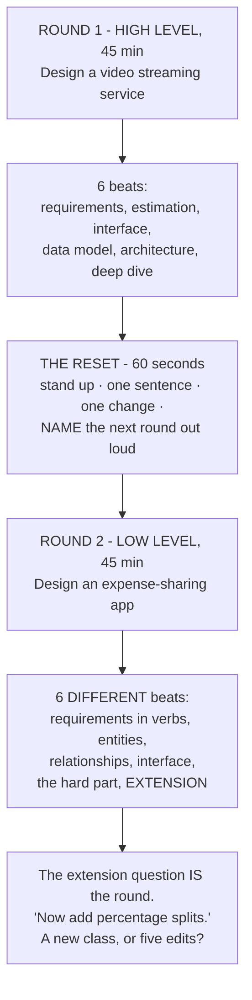
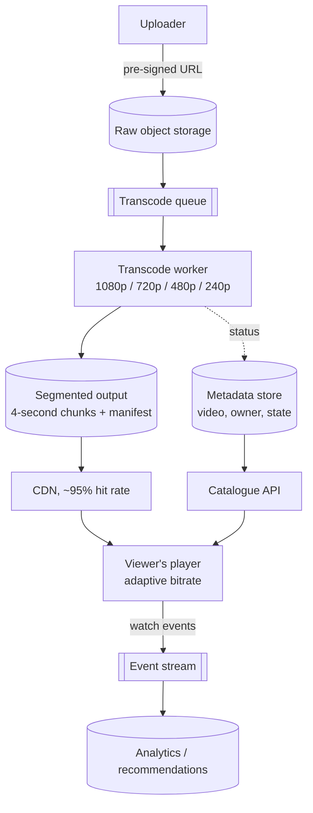

# Full mock: one high-level design, one low-level design

## 1. What this is, and why they ask it

**This is the design loop as it actually happens: two rounds, back to back, testing different things.**

**The high-level round asks whether you can take four vague words and produce a system.** Scale, storage,
architecture, trade-offs. **The low-level round asks whether you can take a small, well-understood problem and
produce clean, extensible objects.** Classes, responsibilities, interfaces.

**They are genuinely different skills and candidates are usually much stronger at one.** **The loop is designed
to find out which** — which is why on-site days almost always include both, often with the same interviewer
watching how you switch.

They ask it because **the second round is the one where people fall apart**, and not for a reason anyone
predicts. **You arrive at the low-level round still thinking about the fan-out problem you did not quite
resolve.** Or the first round went well and you are careless. **Either way you are designing the previous
system instead of this one.**

**And because the low-level round catches a specific gap.** **A candidate who can size a petabyte pipeline and
cannot say what belongs in a class has learned system design from articles rather than from building
software** — and the low-level round is the one that finds it, in about ten minutes.

By the end of this lesson you have both mock rounds worked through in full — a video streaming service at
high level and an expense-sharing app at low level — the different shape each round takes, a rubric for both,
and the sixty seconds in between that decides how the second one goes.

---

## 2. The story

Sharada made forty pots on a good morning, and the ones she sold were all supposed to be the same size, which
was the whole difficulty.

The clay came in a heap by the door. She wedged it, cut it into forty lumps with a wire, **and weighed the
first three on a hand balance until her hand knew what the weight felt like.** After that she did not weigh
anything.

Then she sat down at about four in the morning and threw pots until half past nine.

Her daughter-in-law, who had come from a family that did not do this work, watched for a week and then asked
the question everybody asks.

**"How do you not get tired?"**

Sharada said she did get tired. That was not the interesting part.

**"The interesting part is that the eleventh pot has to be as good as the first. And the thirty-second has to
be as good as the eleventh."**

And the way she managed it was a thing the girl had watched forty times a morning without ever seeing.

**Between every single pot, she stopped.**

**Not for long — four or five seconds.** She lifted the finished pot off, set it on the board beside her, wiped
both hands down the cloth over her knee, **and looked at the empty wheel for a moment before she put the next
lump on.**

The girl had assumed this was tidiness.

**"If I carry the last pot into the next one, the next one is wrong,"** Sharada said. **"If the last one went
badly, I press too hard. If it went well, I get careless."**

**"Either way I am making the previous pot again, instead of this one."**

She put the next lump down and started centring it.

**"So I put it on the board. The board is over there. It is finished."**

And then the thing the girl repeated to her own children years later.

**"Forty pots is not one long job. It is forty jobs — and the wiping of the hands is what makes them
separate."**

---

## 3. The idea in plain English

**Sharada's five seconds are the whole lesson.** **A design loop is not one long round.** **It is two separate
rounds, and what makes them separate is a deliberate reset.**

### The two rounds are not the same exercise

```
   HIGH-LEVEL DESIGN                 LOW-LEVEL DESIGN
   -----------------                 ----------------
   "design a video streaming         "design an expense-sharing
    service"                          app"

   boxes, arrows, data stores        classes, methods, interfaces
   scale, storage, bandwidth         responsibilities, coupling
   trade-offs between components     trade-offs between designs
   "how does this survive            "what happens when they add
    a zone failure?"                  a new kind of split?"

   THE OUTPUT IS AN ARCHITECTURE     THE OUTPUT IS A CLASS MODEL

   THE FAILURE: too broad, no        THE FAILURE: one enormous class
   numbers, nothing examined         that does everything
```

**What is shared is the opening.** **Both start with requirements, and both are ruined by starting to draw
before agreeing what is being built.**

**What differs is everything after minute five.** **The high-level round wants numbers before architecture.**
**The low-level round wants entities and responsibilities, and almost no arithmetic at all.**

### The high-level round, in six beats

**Exactly the framework from [day 178](../day-178-thinking-out-loud/02-system-design-the-system-design-interview-framework.md).**

```
   1. REQUIREMENTS   5    features in, features out,
                          scale, latency, availability,
                          consistency
   2. ESTIMATION     5    users -> QPS -> storage -> bandwidth
                          and SAY what each number implies
   3. INTERFACE      5    5-6 operations
   4. DATA MODEL     5    entities and ACCESS PATTERNS
   5. ARCHITECTURE  10    boxes, then WALK the paths
   6. DEEP DIVE     10+   one hard thing, offered as a choice
```

### The low-level round, in six different beats

**Same length, completely different content.**

```
   1. REQUIREMENTS   5    what the thing does, in verbs.
                          "add an expense", "settle up",
                          "show what I owe"
   2. ENTITIES       5    the nouns, and what each one KNOWS
   3. RELATIONSHIPS  5    who holds whom, one-to-many,
                          what owns what's lifetime
   4. INTERFACE      5    the public methods, with signatures
   5. THE HARD PART 10    the bit that will change - and the
                          pattern that absorbs the change
   6. EXTENSION     10    "now add X" - and your design either
                          absorbs it or does not
```

**Beat 6 is the whole round.** **They will ask for a feature you did not plan for**, and **the score is
entirely about whether your design absorbs it with a new class or requires you to edit five existing ones.**

**Which is why the low-level round is really a test of one idea: what changes, and what does not.**

### The reset, which is the sixty seconds that matters

**Sharada's cloth.**

```
   1. PHYSICALLY STOP. Stand up, get water, look away.

   2. ONE SENTENCE about the round that has finished.
      "That went well." "I never got to the deep dive."
      ONE. Not an analysis.

   3. ONE THING to do differently.
      "I will get to the numbers faster."

   4. NAME THE NEXT ROUND OUT LOUD.
      "This one is low-level. Classes and
       responsibilities, not scale."
```

**Step four is the one people skip and it is the most valuable.** **The commonest failure in a back-to-back
loop is running the wrong framework** — doing capacity estimation for a vending machine, or drawing boxes when
they asked for classes. **Saying which round you are in, in the first minute, prevents it entirely.**

> *"This sounds like a low-level design question, so I am going to spend most of the time on the class model
> and the extension points rather than on scale. Tell me if you would rather I went the other way."*

### What each round is actually scoring

```
   HIGH-LEVEL
     did they ask about scale before designing?
     do the numbers change any decision?
     did they get to a deep dive, or just draw?
     can they name a trade-off in both directions?
     did they mention failure, monitoring, cost?

   LOW-LEVEL
     is there one class per responsibility?
     could I add a new variant without editing
       existing classes?
     are the interfaces small?
     did they name a pattern and JUSTIFY it, rather
       than reciting it?
     did their design survive the extension question?
```

**The last line of each is the one that carries most of the weight.**

---

## 4. The picture

The loop, and the cloth between the rounds:



The two failure shapes, side by side:

```
   HIGH-LEVEL, DONE BADLY        LOW-LEVEL, DONE BADLY
   ---------------------         ---------------------
   40 min of boxes               one class called Manager
   no numbers anywhere           that does everything
   every component named,        no interfaces
     nothing examined            "if the split type is
   "we'd add a cache"              equal... else if exact...
     (where? invalidated how?)     else if percentage..."
   no failure story              -> and then "add a new
   no cost, no monitoring           split type" means
                                    editing that method

   "Breadth without depth."      "Has read about patterns.
                                  Has not written software
                                  that had to change."
```

The video streaming architecture from round one:



**Two things to notice, because they are the design.** **The upload never passes through your service** — the
client goes straight to object storage with a pre-signed URL, **which removes hundreds of megabytes a second
from your servers.** **And the viewer never touches your origin either** — the CDN does, at a 95% hit rate,
**which is the difference between a bandwidth bill you can pay and one you cannot.**

---

## 5. How it actually works

### ROUND 1 — Design a video streaming service (45 minutes)

**Beat 1, requirements (minutes 0-5).**

> *"Let me agree the core first. I will assume: a creator uploads a video; the system transcodes it into
> several qualities; a viewer searches or browses and plays one, with the quality adapting to their connection.
> **I am leaving out comments, live streaming, monetisation and recommendations** unless you want them — tell me
> now if any of those is the point.*
>
> *Non-functional: how many users? ... Say a hundred million daily. **Playback must start in about two seconds
> and must not stutter — so buffering is the real quality bar, not availability of the catalogue page.**
> Uploads can be slow; nobody minds waiting minutes for a video to process, **so the upload path can be
> asynchronous and eventually consistent, and the playback path cannot.** Is that the right split?"*

**Beat 2, estimation (minutes 5-10).** **The numbers are in section 6 and they decide three things: object
storage rather than a database, a CDN rather than an origin, and transcoding as an asynchronous pipeline.**

**Beat 3, interface (minutes 10-14).**

```
   POST /videos                  (title, size)  -> upload_url, video_id
   POST /videos/{id}/complete                   -> ok, transcoding starts
   GET  /videos/{id}                            -> metadata + manifest_url
   GET  /videos/{id}/manifest                   -> the list of quality
                                                   levels and segments
   GET  /search?q=                              -> [video]
   POST /videos/{id}/events      (position, quality, buffering)
```

> *"The upload returns a pre-signed URL rather than accepting the bytes, and I would say why: at 460 megabytes
> a second of uploads, routing them through my own service would need a fleet of machines doing nothing but
> copying."*

**Beat 4, data model (minutes 14-19).**

```
   videos      (video_id, owner_id, title, duration, state,
                created_at)
   renditions  (video_id, quality, manifest_url, bytes)
   watch       (user_id, video_id, position, updated_at)

   THE OBJECT STORE holds:
     raw/{video_id}                      the original
     hls/{video_id}/{quality}/seg_N.ts   4-second segments
     hls/{video_id}/master.m3u8          the manifest

   ACCESS PATTERNS
     "the metadata for one video"  -> key lookup, cached hard
     "videos by this creator"      -> partition by owner_id
     "where was I in this video"   -> key lookup by
                                      (user_id, video_id)
   -> metadata is small and relational: Postgres, with a
      read-through cache. The video bytes never go near it.
```

**Beat 5, architecture (minutes 19-28).** **The diagram in section 4, plus the two paths walked out loud.**

> *"Upload: the client asks for an upload URL, puts the file straight into object storage, then calls
> `complete`. That publishes a message. **A pool of transcode workers picks it up and produces four qualities,
> each cut into four-second segments, plus a manifest.** Each worker writes its output back to object storage
> and updates the video's state. When all renditions are done, the video becomes playable.*
>
> *Playback: the player fetches the manifest, then pulls segments from the CDN. **It measures its own download
> speed and switches quality between segments — that is adaptive bitrate, and it is why segments are short.**
> Watch events go to an event stream, not to the API, because they are high-volume and nobody needs them
> synchronously."*

**Beat 6, deep dive (minutes 28-45).** **Offer three:**

> *"I could go deeper on the transcoding pipeline and how it handles a failed worker, on how the CDN is kept
> warm for a video that suddenly becomes popular, or on the storage cost, which I think is the most surprising
> number here. Which is most useful?"*

**And the transcoding deep dive, since it is the one with the real trade-off:**

> *"Transcoding one hour of video takes roughly an hour of CPU per output quality, so four qualities is four
> CPU-hours. **The obvious design gives one video to one worker, and then a two-hour film takes eight hours to
> become playable.***
>
> ***So instead I split the video into chunks first** — say one minute each — **and fan them out across many
> workers in parallel.** A two-hour film becomes 120 chunks times 4 qualities, which is 480 independent jobs.
> **With 100 workers that is under five minutes instead of eight hours.***
>
> *The costs, and I want to name all three. **The chunk boundaries have to fall on keyframes**, or the segments
> will not join cleanly. **The jobs must be idempotent**, because a worker will die mid-chunk and the job will
> be retried — writing to a deterministic path in object storage gives that for free. **And you need a
> completion tracker**: 480 jobs must all finish before the video flips to playable, so something has to count
> them, and that counter is the piece that fails silently if you are not watching it.*
>
> *Which is the metric I would alert on: the age of the oldest video still stuck in 'transcoding'."*

**And the close (last five minutes):**

> *"Monitoring: the four golden signals per service, **plus two custom ones — the rebuffer ratio, which is the
> real quality measure, and the oldest video stuck in transcoding.** SLO: 99.9% on playback start, which is
> forty-three minutes a month. **Security: pre-signed URLs expire in fifteen minutes, and playback URLs are
> signed per user so a link cannot be shared indefinitely.** Cost: dominated by egress, which is why the CDN is
> in the design rather than an optimisation. **And the weakness of my design is the completion tracker — if it
> drifts, videos sit unpublished with no user-facing symptom at all.**"*

### ROUND 2 — Design an expense-sharing app (45 minutes)

**Beat 1, requirements as verbs (minutes 0-5).**

> *"Let me get the operations rather than the features. **A user can create a group. A user can add an expense
> to a group, paid by one person, split between several. A user can see what they owe and what they are owed.
> A user can settle up.***
>
> *And one question that shapes everything: **how many ways can an expense be split?** ... Equally, by exact
> amounts, and by percentage. **Good — that is the part that will change, so it is where the design has to be
> flexible.***
>
> *I am leaving out authentication, currencies and notifications unless you want them."*

**Beat 2, entities (minutes 5-10). The nouns, and what each one knows.**

```
   User        id, name, email
   Group       id, name, members
   Expense     id, group, description, amount, paid_by,
               splits, created_at
   Split       user, amount          <- what ONE person owes
               for ONE expense
   Balance     derived, never stored: who owes whom, and
               how much
```

> *"The important decision here is that **Balance is derived, not stored.** **I could keep a running balance
> per pair of users, and then every edit or deletion of an old expense has to correctly unwind it.** Deriving it
> from the expense list is slower and cannot drift. **I would derive it and cache the result, and I would say
> that trade-off out loud rather than choosing silently.**"*

**Beat 3, relationships (minutes 10-14).**

```
   Group  1 --- * Expense          a group owns its expenses
   Expense 1 --- * Split           an expense owns its splits
   Split   * --- 1 User            a split refers to a user
   Group   * --- * User            membership

   LIFETIME: deleting a group deletes its expenses, which
   deletes their splits. A User is NOT owned by anything.

   INVARIANT, and it is the one worth stating:
     for every Expense, sum(split.amount) == expense.amount
   -> enforced in the Expense constructor, so an invalid
      Expense cannot exist. Not checked later.
```

**Beat 4, the interface (minutes 14-19).**

```python
class ExpenseService:
    def add_expense(self, group_id, description, amount,
                    paid_by, strategy) -> Expense: ...
    def balances(self, group_id) -> dict[UserId, Decimal]: ...
    def who_owes_whom(self, group_id) -> list[Settlement]: ...
    def settle(self, group_id, payer, payee, amount) -> None: ...
```

> *"Four methods. **`balances` returns a net position per person; `who_owes_whom` turns that into actual
> transfers**, and separating those two is deliberate — they are different questions and one of them has an
> interesting algorithm behind it."*

**Beat 5, the hard part: the thing that will change (minutes 19-30).**

> *"The split types are the part that will change, so that is where the design has to absorb change.*
>
> ***The version I would not write:***

```python
def compute_splits(self, kind, amount, participants, values):
    if kind == "EQUAL":
        ...
    elif kind == "EXACT":
        ...
    elif kind == "PERCENT":
        ...
```

> ***That method has to be edited every time a new split type appears, which is the open-closed principle
> being violated in one screen.** And every edit risks the two types that already worked.*
>
> ***Instead: a strategy interface.***

```python
class SplitStrategy(Protocol):
    def split(self, amount: Decimal,
              participants: list[UserId]) -> list[Split]: ...


class EqualSplit:
    def split(self, amount, participants):
        share = (amount / len(participants)).quantize(CENTS)
        splits = [Split(user, share) for user in participants]
        # the rounding remainder goes to ONE named person, never nowhere
        remainder = amount - share * len(participants)
        splits[0] = Split(splits[0].user, splits[0].amount + remainder)
        return splits


class ExactSplit:
    def __init__(self, amounts: dict[UserId, Decimal]):
        self.amounts = amounts

    def split(self, amount, participants):
        if sum(self.amounts.values()) != amount:
            raise ValueError("exact splits must sum to the total")
        return [Split(user, self.amounts[user]) for user in participants]
```

> ***Adding a percentage split is a new class and no edits anywhere.** That sentence is what the round is
> testing.*
>
> ***And I want to point at the rounding, because it is the detail that separates people.** Thirty rupees
> between three people is fine. **Ten rupees between three is 3.33 each, which is 9.99, and one paisa has
> vanished.** So the remainder has to go somewhere deliberate — I give it to the payer. **And every amount is a
> `Decimal`, never a float**, because 0.1 plus 0.2 is not 0.3 in binary floating point and money must not do
> that."*

**Beat 6, the extension question (minutes 30-45). This is the round.**

**They will ask for something. The three that come up:**

**"Now add a split where two people pay for one expense."**

> *"That changes `paid_by` from one user to a list of contributions. **`Expense` grows a `payments` list
> alongside `splits`, with the same invariant — the payments must sum to the total.** **The strategies are
> untouched**, because they only ever decided who owes what, not who paid. **And the balance calculation
> becomes: for each expense, each payer is credited what they put in and each participant is debited what they
> owe.** One change to one entity."*

**"Now simplify the debts — minimise the number of transfers."**

> *"That is a nice one, and it is a greedy algorithm on the net balances.*
>
> ***Compute each person's net position — positive means they are owed, negative means they owe.** The
> positives and negatives each sum to the same total. **Then repeatedly take the largest creditor and the
> largest debtor and settle the smaller of the two amounts between them.** Each transfer zeroes at least one
> person, **so with `n` people there are at most `n − 1` transfers.***
>
> ***I would be careful to state what it does not do: it does not find the provable minimum**, which is
> NP-hard in general. **It finds a good answer with at most n−1 transfers, which is what people actually
> want** — and I would say that rather than claim optimality.*
>
> ***Design-wise this is a new class — `DebtSimplifier` — that takes balances and returns settlements.** It
> touches nothing existing, because `balances` was already a separate method from `who_owes_whom`. **That
> separation, which looked like fussiness in beat four, is what makes this free.**"*

**"Now support multiple currencies."**

> *"This is the one that hurts, and I would say so. **An `Amount` becomes a value object of a number and a
> currency, and every arithmetic operation has to refuse to add two different currencies.** **Then a rate is
> needed, and a rate has a time** — an expense from March must be settled at March's rate or at today's, and
> that is a product decision, not a technical one, so I would ask.*
>
> ***What this shows is that money being a bare `Decimal` was a simplification, not a design.** If I expected
> currencies from the start I would have made `Amount` a value object on day one, and everything else would be
> unchanged. **That is a real cost of my design and I would rather name it than defend it.**"*

---

## 6. The numbers

**The video streaming estimation, in full.**

```
   ASSUMPTIONS, said out loud
     100,000,000 daily active viewers
     each watches 5 videos a day, averaging 10 minutes
     500,000 videos uploaded a day, averaging 10 minutes
     1080p is about 5 Mbit/s; 720p 2.5; 480p 1; 240p 0.4
```

**Playback traffic — the number that decides the whole design.**

```
   watch-minutes per day
     100,000,000 x 5 x 10 = 5,000,000,000 minutes/day
                          = 83,300,000 hours/day

   assume an average delivered bitrate of 2 Mbit/s
     83,300,000 hours x 3,600 s x 2 Mbit/s
       = 599,760,000,000 Mbit/day
       = 599,760,000,000 / 8 = 74,970,000,000 MB
       = ~75 PB/day of video delivered

   per second: 75 PB / 86,400 = ~870 GB/second

   -> AT $0.09/GB OF DIRECT EGRESS THAT WOULD BE
      75,000,000 GB x $0.09 = $6,750,000 PER DAY.

   -> which is why this is a CDN problem, and why the CDN
      is in the design from the first minute rather than
      added as an optimisation. This single number is the
      architecture.
```

**Storage.**

```
   500,000 uploads/day x 10 minutes = 5,000,000 minutes/day

   RAW, at ~50 MB per minute of 1080p:
     5,000,000 x 50 MB = 250 TB/day of originals

   RENDITIONS, four qualities, roughly 90 MB per minute
   for all four together:
     5,000,000 x 90 MB = 450 TB/day

   TOTAL: ~700 TB/day = 255 PB/year

   at $0.023/GB-month for the hot tier:
     700,000 GB/day x 30 days = 21,000,000 GB in month one
     x $0.023 = $483,000/month, and growing every month

   -> so tiering is not optional. Most videos are watched
      in their first week:
        7 days hot, then infrequent access, then archive
      -> and the raw originals go to deep archive
         immediately after transcoding, since they are only
         needed if you re-transcode.
```

**Transcoding capacity.**

```
   5,000,000 minutes of video uploaded per day
   x 4 output qualities
   = 20,000,000 minutes of transcoding work per day

   at roughly real time on one CPU core:
     20,000,000 minutes = 333,333 core-hours/day
     / 24 hours = ~13,900 cores running constantly

   -> ~870 sixteen-core machines, flat out, all day.

   AND THIS IS WHY IT IS A SPOT-INSTANCE WORKLOAD:
     the jobs are interruptible and idempotent, so a 70%
     discount applies directly.
     870 machines x $0.60/hour x 730 hours = $381,000/month
     on spot at 25% of that = ~$95,000/month
```

**Playback start latency, which is the actual quality bar.**

```
   TARGET: video starts in under 2 seconds

   manifest fetch, from the CDN            ~50 ms
   first segment (4 s of 480p, ~500 KB)    ~200 ms on a
                                            20 Mbit/s line
   player buffers 2 segments before
     starting                              ~400 ms
                                          ---------
                                           ~650 ms

   -> comfortable, and the reason is that playback STARTS
      at a low quality and steps up. Starting at 1080p
      would need 2.5 MB before the first frame.

   -> which is the whole argument for adaptive bitrate,
      and it is a latency argument rather than a bandwidth
      one.
```

**And the low-level round's only arithmetic, which is the rounding.**

```
   10.00 split three ways
     10.00 / 3 = 3.3333...
     rounded to 3.33 each
     3.33 x 3 = 9.99
     -> ONE PAISA IS MISSING

   over 1,000,000 expenses that is 10,000 rupees
   unaccounted for, and every one of them is a support
   ticket.

   THE FIX: compute the shares, then give the remainder
   to a named person - the payer - deliberately.

   AND: Decimal, never float.
     0.1 + 0.2 == 0.30000000000000004 in binary floating
     point. Money must never do that.
```

---

## 7. The trade-offs

**The high-level round's trade-offs, stated as they should be in the room.**

**Transcode per video or per chunk.** **Per video is simple: one job, one worker, no coordination.** **It also
means a two-hour film takes eight CPU-hours and is unplayable for most of a working day.** **Chunked
transcoding parallelises to minutes and costs you three things: keyframe-aligned boundaries, idempotent jobs
because workers die, and a completion tracker that must count 480 finished jobs before the video goes live.**
**I would chunk, and I would say that the tracker is the piece that fails silently.**

**Store every rendition, or transcode on demand.** **Storing four qualities of everything is 450 TB a day of
output for content most of which nobody watches twice.** **Transcoding on demand is far cheaper in storage and
adds seconds to playback start, which is the one thing that must not be slow.** **The real answer is a
split: store renditions eagerly for popular content and lazily for the long tail** — and "popular" is knowable,
because view counts are extremely skewed.

**Push to the CDN or let it pull.** **Pre-pushing a new video to every edge costs bandwidth for content that
may never be watched.** **Pulling on demand means the first viewer at each edge waits.** **For a creator with
ten million subscribers, pre-warming is obviously right; for the long tail it is obviously wrong** — so the
decision is per video, driven by the creator's audience size.

**The low-level round's trade-offs.**

**Derive balances or store them.** **Stored balances make "what do I owe" a single read, and every edit or
deletion of an old expense must correctly unwind them** — which is where the bugs live, and they are the kind
that produce a wrong number silently. **Deriving from the expense list cannot drift and costs a scan.** **I
would derive and cache, invalidating on any expense change** — and I would say that I am choosing correctness
over a read that is already fast enough.

**Strategy objects or a switch.** **A switch is fewer files and it is honestly fine for two variants.** **The
moment a third arrives, every addition edits a method that two working variants depend on.** **I would use
strategies here specifically because the interviewer told me there were already three split types**, which is
the signal that more are coming. **Reaching for a pattern without that signal is over-engineering, and saying
why you chose it is the difference between the two.**

**And the honest cost of the back-to-back loop itself.**

**Two forty-five minute design rounds in a morning is genuinely tiring**, and the second one is where the
average candidate scores worse — **not from lack of knowledge but from carrying the first round in.**
**Sharada's answer is the only one that works: put it on the board, wipe your hands, and name the next round
out loud before you start it.** **The single most expensive mistake in a design loop is running the wrong
framework** — estimating queries per second for a vending machine, or drawing boxes when the question was about
classes.

---

## 8. In the interview

### How it gets asked

- *"Two design rounds today — a high-level one now and a low-level one after the break."* — plan for the reset.
- *"Design a video streaming service."* — six words, then silence.
- *"Design an expense-sharing app."* — sounds smaller, and is not.
- *"Now add percentage splits."* — the extension question. This IS the low-level round.
- *"Which part would you like to go deeper on?"* — pick the one with a real trade-off, not the easy one.

### The first ninety seconds

**Round one, high level:**

> *"Before I draw — here is how I would like to use the time: five minutes on requirements and scope, five on
> numbers, then the API and data model quickly, then the architecture, keeping about fifteen minutes to go deep
> on whatever you find most interesting.*
>
> *On scope: I will assume the core is upload, transcode, browse and play, with quality adapting to the
> viewer's connection. **I am leaving out live streaming, comments, monetisation and recommendations** — say if
> any of those is actually the point.*
>
> *And one requirement that will shape everything: **uploads can be slow and asynchronous — nobody minds
> waiting minutes for processing — but playback must start in about two seconds and must never stutter.** So I
> have one path that can be eventually consistent and one that cannot, and that split is the design.*
>
> *Shall I put numbers on it?"*

**Round two, low level — and the first sentence is different on purpose:**

> *"This sounds like a low-level design question, so I am going to spend most of the time on entities,
> responsibilities and how the design absorbs change, rather than on scale. Stop me if you would rather I went
> the other way.*
>
> *Let me get the operations as verbs first. **Create a group. Add an expense, paid by someone, split between
> several people. See what I owe and what I am owed. Settle up.***
>
> *And one question that will decide the shape: **how many ways can an expense be split?** ... Equal, exact and
> percentage. **Then that is the part that will change, and it is where my design has to be flexible.**"*

### The follow-ups

**"Go deeper on the transcoding pipeline."**

> "**Transcoding one hour of video takes roughly one hour of CPU per output quality**, so four qualities is
> four CPU-hours per hour of video. **At five million uploaded minutes a day times four qualities, that is
> twenty million minutes of work a day — about 13,900 cores running constantly, or 870 sixteen-core machines
> flat out.**
>
> **The naive design gives one video to one worker.** **A two-hour film then takes eight CPU-hours and is
> unplayable for most of a day**, which is a bad experience for exactly the creators you most want.
>
> **So I chunk first.** **Split the source into one-minute pieces, and fan them out.** A two-hour film becomes
> 120 chunks times four qualities — 480 independent jobs — **and with a hundred workers that is under five
> minutes instead of eight hours.**
>
> **Three costs, and I would name all three rather than let you find them.**
>
> **The chunk boundaries must land on keyframes**, or the re-assembled segments will not decode cleanly at the
> joins.
>
> **The jobs must be idempotent, because workers will die mid-chunk and the job will be retried.** **Writing
> output to a deterministic path in object storage gives that for free** — a retry simply overwrites the same
> object. **And that also makes this a perfect spot-instance workload: interruptible, restartable, and a 70%
> discount — on 870 machines that is a saving of about 285,000 dollars a month.**
>
> **And there has to be a completion tracker: all 480 jobs must finish before the video is published.**
> **That counter is the piece that fails silently** — if it drifts, videos sit unpublished and no user-facing
> metric moves. **So the metric I would alert on is the age of the oldest video still in the transcoding
> state**, which is a symptom rather than a cause, and there is no natural alternative signal.
>
> **One more decision worth surfacing: whether to store all four renditions eagerly.** **At 450 terabytes a day
> of output for content that is mostly watched once, I would store eagerly for popular creators and lazily for
> the long tail** — view counts are extremely skewed, so that split is knowable rather than a guess."

**"Now add percentage splits to the expense app."**

> "**A new class, and nothing else changes — which is the answer I designed for.**
>
> `PercentageSplit` **implements the same `SplitStrategy` interface: given the total and the participants, it
> returns a list of splits.** **`Expense`, `Group`, `Balance` and the service are all untouched.**
>
> **That is the open-closed principle doing actual work**: open for extension, closed for modification. **And
> the reason it is free here is a decision I made in the first ten minutes — putting the split logic behind an
> interface rather than in a conditional inside `add_expense`.**
>
> **The version I deliberately avoided was `if kind == 'EQUAL' ... elif ... elif ...`, and it is worth saying
> what is wrong with it.** **Not that it is ugly. That every new split type edits a method the two working
> types depend on**, so adding percentage risks breaking equal, **and the test suite for that method grows
> combinatorially.**
>
> **Two details inside the new class, because they are where the real bugs are.**
>
> **Validation belongs in the strategy, not in the caller.** **Percentages must sum to a hundred; exact
> amounts must sum to the total.** **Each strategy knows its own rule, and it raises in the constructor rather
> than returning something invalid** — the same reason the `Expense` invariant is enforced in its constructor.
>
> **And rounding.** **A hundred rupees split 33/33/34 is fine, but 33.3/33.3/33.4 percent of ten rupees is
> 3.33, 3.33, 3.34.** **Whenever the shares do not divide exactly, the remainder must go somewhere named — I
> give it to the payer.** **And every amount is a `Decimal`, never a float**, because binary floating point
> cannot represent 0.1 and money must never do that."

**"How do you handle the second round when the first one went badly?"**

> "**Deliberately, in about sixty seconds, and I would do the same thing whether it went badly or well —
> because being pleased with yourself is as dangerous as being rattled.**
>
> **First, physically stop.** Stand up, get water, look at something else. **It sounds trivial and it is the
> part that actually works**, because the state I need to leave behind is partly postural.
>
> **Second, one sentence about the round that finished.** *'I never got to the deep dive.'* **One sentence, not
> an analysis.** An analysis in the corridor is just the previous round continuing.
>
> **Third, one thing to do differently.** *'I will get to the numbers by minute eight.'* **One thing. A list of
> five is a list I will not follow.**
>
> **Fourth, and this is the one people skip: name the next round out loud before it starts.** *'This one is
> low-level. Classes and responsibilities, not scale.'* **The commonest failure in a back-to-back loop is
> running the wrong framework** — doing capacity estimation for a vending machine, or drawing boxes when they
> asked for a class model. **Saying which round I am in, in the first minute, prevents it entirely, and it also
> gives the interviewer a chance to correct me if I have read it wrong.**
>
> **And I would say the framing out loud if it helps: two design rounds is not one long round. It is two
> rounds, and what makes them separate is the deliberate stop in between.** **If I carry the first one in, I
> spend the second one designing the previous system.**"

### The model answer

*"Two design rounds, back to back. Begin."*

> "**Let me say how I will run both, because they are different exercises and I want to be explicit about
> that.**
>
> **The high-level round I run in six beats: requirements, estimation, interface, data model, architecture,
> deep dive.** **The order is fixed because each one decides the next** — I cannot choose a store before I know
> the access patterns, and I cannot know the read-to-write ratio before I have asked how many users there are.
> **Beats one to five are deliberately shallow so that I arrive at the deep dive with fifteen minutes, because
> that is where the signal is.**
>
> **And in that round every number must be followed by 'so…'.** **For video streaming, the number that decides
> the architecture is 75 petabytes a day of delivered video** — **which at direct egress prices would be six
> and three-quarter million dollars a day.** **That single figure is why a CDN is in the design from the first
> minute rather than mentioned as an optimisation at minute forty.**
>
> **The low-level round is six different beats: requirements as verbs, entities, relationships, interface, the
> part that will change, and the extension question.** **Almost no arithmetic, and the whole round is really
> beat six.** **They will ask for a feature I did not plan for, and the score is whether my design absorbs it
> with a new class or requires me to edit five existing ones.**
>
> **So in beat one I actively hunt for what will change.** *'How many ways can an expense be split?'* **Three —
> so splits go behind an interface, and adding a fourth is a new class and no edits.** **And I would justify
> the pattern rather than recite it: I am using a strategy here because you told me there are already three
> variants, which is the signal that more are coming. Without that signal it would be over-engineering.**
>
> **In both rounds I close the same way: what fails, what I would monitor, and one honest weakness of my own
> design.** **For the streaming system it is the transcode completion tracker, which fails silently and needs
> an alert on the oldest stuck video.** **For the expense app it is that money is a bare decimal, which was a
> simplification and not a design — the moment currencies appear, `Amount` should have been a value object from
> day one.**
>
> **And between the two rounds I will take a minute, stand up, and say out loud which round I am about to be
> in.** **Two design rounds is not one long round; it is two rounds, and the stop in between is what makes
> them separate.** **Otherwise I spend the second one designing the first one again.**"

---

## 9. Recall card

**Two rounds, two different exercises.** **HIGH-LEVEL: six beats — requirements, estimation, interface, data
model, architecture, deep dive — with every number followed by "so…", and beats 1-5 deliberately shallow so you
reach the deep dive with fifteen minutes.** **LOW-LEVEL: six DIFFERENT beats — requirements as VERBS, entities,
relationships, interface, the part that will change, and the EXTENSION question.** **Almost no arithmetic, and
beat 6 IS the round.**

**The reset between them is Sharada's cloth, and it is sixty seconds.** **Physically stop · ONE sentence about
the round that finished · ONE thing to change · and NAME THE NEXT ROUND OUT LOUD.** **The commonest failure in
a back-to-back loop is running the wrong framework** — estimating queries per second for a vending machine, or
drawing boxes when they asked for classes. **"Forty pots is not one long job."**

**Video streaming, and the one number that is the architecture: 100M viewers × 5 videos × 10 min at ~2 Mbit/s =
~75 PB/day delivered, ~870 GB/second — $6.75 MILLION A DAY at direct egress.** So the CDN is in the design at
minute one. **Uploads go straight to object storage via a pre-signed URL** (460 MB/s never touches your
servers). **Chunk before transcoding** — a 2-hour film is 480 jobs, five minutes instead of eight hours — at the
cost of **keyframe-aligned boundaries, idempotent jobs (workers die; deterministic output paths), and a
completion tracker that fails SILENTLY.** Alert on **the age of the oldest video stuck in transcoding.**
Interruptible + idempotent = **spot instances, 70% off.**

**Expense sharing, and the one decision that is the round: put split types behind a `SplitStrategy`
interface.** Adding percentage splits is then **a new class and zero edits** — where `if kind == 'EQUAL' …
elif …` means every addition edits a method two working variants depend on. **Justify the pattern by the signal
("you told me there are already three"), or it is over-engineering.** **Derive balances rather than store them**
— stored balances drift when an old expense is edited. **Enforce `sum(splits) == amount` in the CONSTRUCTOR**,
so an invalid expense cannot exist.

**Money: `Decimal`, never float** (0.1 + 0.2 ≠ 0.3), and **when shares do not divide exactly the remainder goes
to a NAMED person** — 10.00 split three ways is 9.99, and a missing paisa across a million expenses is ten
thousand rupees of support tickets. **Close both rounds the same way: what fails, what you would monitor, and
one honest weakness of your own design.** A design with no named weakness is one nobody looked at.
