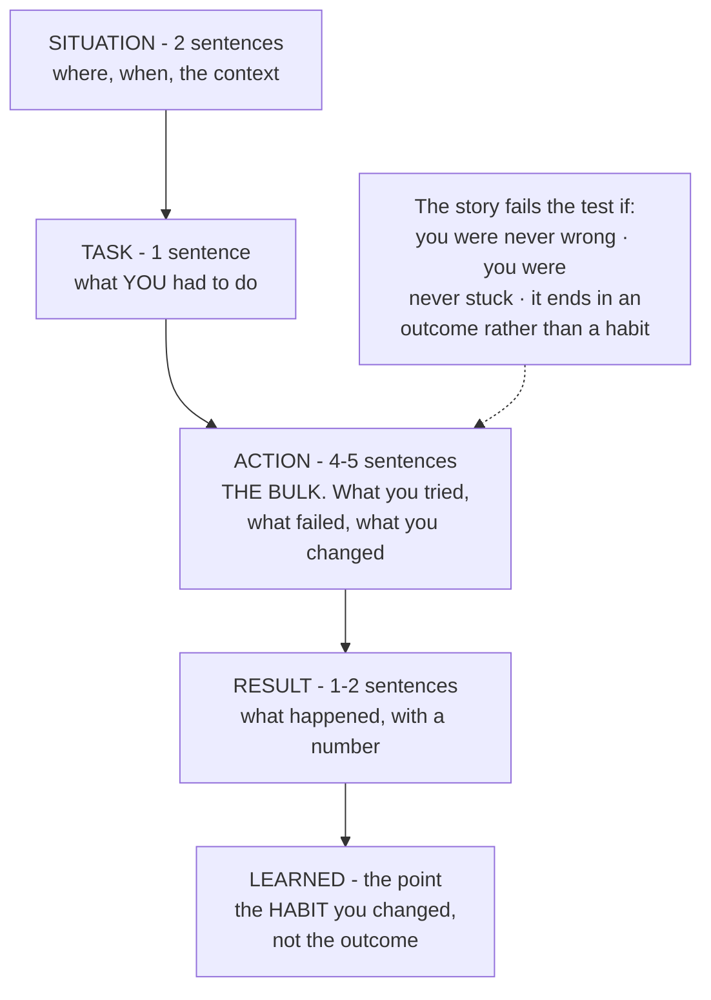

# Final revision, and the week before the interview

## 1. What this is, and why they ask it

**This is the last day, and it is about the last week.**

**Almost nothing you learn in the seven days before an interview will be available to you during it.** A
technique met on Tuesday is not retrievable under pressure on Monday. **What is available is what you already
know, minus whatever tiredness takes away** — and the only variable you still control is the second half of
that sentence.

**So the last week is not for adding. It is for arriving.** **Consolidate what is there, sleep, and protect the
one thing that actually degrades: your ability to think clearly for forty-five minutes at a stretch.**

They ask about it because **one question in the loop is nearly always behavioural, and the commonest version is
"tell me about a problem you found hard".** **It sounds like small talk and it is not.** **They are looking for
whether you can describe a difficulty honestly, say what you did about it, and name what changed afterwards** —
which is a much better predictor of what you will be like to work with than any algorithm.

**And because the answer most people give is the heroic one, and it lands badly.** "I worked all weekend and
solved it" tells nobody anything. **"I was stuck for two days, I was looking in the wrong place, and here is
the habit I changed afterwards" is a real answer**, and it is the one that gets remembered.

By the end of this lesson you have a day-by-day plan for the last week, a clear list of what to revise and what
to leave alone, the ten templates you must be able to type from memory, the night-before and morning-of
checklists, and a structure for the behavioural answer that does not sound rehearsed.

---

## 2. The story

Sekhar had run the district ten kilometres four times, and finished in the first twenty twice, **and the year
he ran his best time was the year he did the least work in the last week.**

He did not believe it at the time. **He thought his coach — a retired physical training master who trained
about eleven boys behind the college ground — had simply lost interest in him.**

**Eleven days before the race, Sekhar wanted to do a long run.** The coach said no.

**Nine days before, he wanted to add hill work**, because a boy from Bagalkot had beaten him the previous year
on the rise near the water tank. **The coach said no again.**

**Six days before, he did it anyway**, early, without telling anybody.

**The coach knew by the second lap on Monday**, because he could see it in how Sekhar came off his left foot.

That was the only time in three years he shouted.

**"What is it you think you are adding?"**

Sekhar said he was getting stronger.

**"In six days? Nothing you do in six days will make you stronger. That takes three weeks and you know it."**

**"Everything you do in six days can only make you tired."**

And then the sentence that took Sekhar about two years to properly accept.

**"The work is finished. It was finished a month ago. What is left is not adding. It is arriving."**

That year the last week was: Monday easy. Tuesday nothing. Wednesday twenty minutes at race pace, **just to
remind the legs what it felt like.** Thursday nothing. Friday nothing. Saturday a walk.

**He felt slow all week, and slightly fraudulent.**

**And on the Sunday he ran forty-one seconds faster than he ever had.**

Afterwards the coach said one more thing, in the same flat voice he said everything in.

**"You did not get faster this week. You stopped being tired."**

**"That is what you were carrying."**

---

## 3. The idea in plain English

**Sekhar's coach is right and the reason is not motivational.** **Learning takes weeks to consolidate.**
Something met on Tuesday cannot be retrieved under pressure on Monday — **it is not there yet.** **But tiredness
arrives in a day and is gone in a day**, which makes it the only variable in the last week that is actually
worth managing.

### The seven days

```
   7 DAYS OUT   two mocks - one coding, one design - and score
                both honestly.
                -> the point is to find the gap while there is
                   still time to close it. This is the last day
                   on which new information is useful.

   6 DAYS OUT   the twenty patterns. Cover the middle column
                and name each tell, cold.
                -> recognition, not implementation

   5 DAYS OUT   write all ten templates from memory. Twice.
                -> the code should arrive without being derived

   4 DAYS OUT   one mock. Then re-read ONLY what it exposed.
                -> targeted. Not a general sweep.

   3 DAYS OUT   the design framework, and one full high-level
                design out loud, on the clock.
                -> the running order, not new case studies

   2 DAYS OUT   recall cards only. No new problems at all.
                -> new material now DISPLACES old material

   1 DAY OUT    one easy problem, to stay warm. Stop by lunch.
                Sort out the room, the machine, the login.
                -> protect the sleep, not the knowledge

   THE MORNING  nothing technical. Read your own notes for the
                behavioural questions. Eat something.
                -> you cannot add anything today. You can only
                   be tired.
```

**The rule underneath all of it: nothing new goes in after two days out.** **Not a new topic, not a new
pattern, not a hard problem you saw somebody mention.** **At that range, new material does not add — it
displaces**, because it competes for the same attention as everything you already have.

### What to revise, and what to leave alone

```
   REVISE                          LEAVE ALONE
   ------                          -----------
   the recall cards                new topics
   the twenty tells                problems above your level
   the ten templates               anything you have never seen
   YOUR OWN ERROR LIST             other people's problem counts
   the design framework            new case studies
   your STAR notes                 optimising a solution that
                                     already works
```

**The error list is the highest-value item and almost nobody keeps one.** **It is the list of bugs you have
actually made** — not bugs in general. **Mine off-by-one. Forgetting the base case. Marking BFS nodes as seen
on dequeue. Not asking about duplicates.** **Ten lines, re-read on the morning of the interview, and it is
worth more than fifty new problems**, because those are the mistakes you are actually going to make.

### The ten templates

**These are the ones that must arrive without being derived.** **If you have to reconstruct binary search under
pressure, that is four minutes gone before you have started the actual problem.**

```
    1  binary search (lower bound)
    2  sliding window with a constraint
    3  two pointers on a sorted array
    4  monotonic stack
    5  BFS on a grid
    6  DFS on a tree, returning one thing and recording another
    7  topological sort
    8  union-find with path compression
    9  a heap for top-k
   10  a two-dimensional DP table
```

**Five days out, type all ten from memory, twice.** **Not read — typed.** **The difference between recognising
code and producing it is exactly the difference between passing and not.**

### The night before

```
   THE MACHINE      editor open, the language you will use,
                    a file with the ten templates in it
                    (you will not use them, and having them
                     there removes one worry)
   THE ROOM         where you will sit, what is behind you,
                    the light
   THE LOGISTICS    the link, the time zone, the phone number
                    to ring if it fails
   THE NOTES        your STAR stories, one page
   THE FOOD         decided, so you are not deciding at 8 a.m.
   THE SLEEP        the actual objective

   NOT: a hard problem. Not one. The only thing a hard
   problem can do the night before is convince you that
   you cannot do it.
```

### The morning

**Nothing technical.** **Read your behavioural notes, because those are recall rather than reasoning and recall
is fine when you are nervous.**

**One easy problem is permitted, and only if it calms you.** **If it would make you anxious, do not.** **The
purpose is a warm-up, not a test — so choose one you have solved before and know you can finish.**

### During the day, between rounds

**[Day 179's](../day-179-full-coding-mock/README.md) reset, applied to a whole loop.**

```
   after each round:
     stand up, water, look out of a window
     ONE sentence about it, and then stop
     name the next round out loud

   IF A ROUND GOES BADLY:
     it is one round. Loops are scored per round, and
     people are hired after a weak one.
     The candidate who carries it into the next two
     rounds turns one bad round into three.
```

**Write down every question you were asked, within an hour of finishing.** **You will forget the details by
evening.** **If this loop does not work out, that list is the most valuable preparation material you will ever
own** — because it is the actual questions, from the actual company, at your actual level.

### The behavioural question

**"Tell me about a problem you found hard."** **Four parts, and a fifth that matters most.**

```
   SITUATION   where, when, what the context was. 2 sentences.
   TASK        what YOU specifically had to do. 1 sentence.
   ACTION      what you did. THE BULK OF IT. 4-5 sentences.
   RESULT      what happened. 1-2 sentences, with a number
               if you have one.
   LEARNED     what you do differently now.
               <- THE PART THEY ARE ACTUALLY ASKING ABOUT
```

**And the choice of story is the whole answer.** **Pick something genuinely hard, where you were genuinely
stuck**, and be honest about the stuck part. **The heroic version — "I worked all weekend and cracked it" —
tells the interviewer nothing except that you would like to sound impressive.**

**Two questions to test a story against.** **Does it show you being wrong about something, and finding out?**
**Does it end with a habit rather than an outcome?** **"I learned to write the failing test first" is an
answer. "And then it worked" is not.**

---

## 4. The picture

The taper, drawn against what is actually happening:

```
   WHAT YOU KNOW          |||||||||||||||||||||||||||||||
   (flat. It was decided   ^                            ^
    weeks ago)          7 days out                     day

   WHAT NEW WORK ADDS     ....... ..... ... .. . . .
   (falls to nothing -     ^
    consolidation takes  it takes ~3 weeks for something new
    weeks)                to become retrievable under pressure

   TIREDNESS              ....:::::||||||||##############
   (rises fast if you                             ^
    keep pushing)                            and this is the
                                             ONLY line you
                                             still control

   PERFORMANCE = what you know MINUS tiredness.

   -> After about two days out, every hour of new work
      moves the third line up and the second line not at
      all. That is the entire argument for the taper, and
      it is arithmetic rather than encouragement.
```

The week, as a table:

```
   DAY     DO                              DO NOT
   ---     --                              ------
   -7      2 mocks, scored                 despair at the score
   -6      the twenty tells, cold          learn a 21st pattern
   -5      10 templates from memory, x2    read them instead of
                                            typing them
   -4      1 mock; re-read what it broke   a general sweep
   -3      design framework + 1 HLD aloud  new case studies
   -2      recall cards only               ANY new problem
   -1      one easy problem, stop by       a hard problem
           lunch; fix the room and login
    0      behavioural notes, food, early  anything technical

   THE LINE THAT MATTERS IS AT -2.
   Nothing new after that point. Not one thing.
```

The behavioural answer, as a shape:



---

## 5. The code, built step by step

**The last piece of code in this course is the one you should be able to type from memory.** Ten templates, in
one file, all verified. **Five days before the interview, type them out without looking. Then again the next
day.**

### 1. Binary search, as a lower bound

```python
def lower_bound(sorted_values: list[int], target: int) -> int:
    """First position where target could be inserted keeping order. The one to memorise."""
    low, high = 0, len(sorted_values)
    while low < high:
        middle = (low + high) // 2
        if sorted_values[middle] < target:
            low = middle + 1
        else:
            high = middle
    return low
```

**Learn this form and not the `low <= high` one.** **It has no `return -1`, no separate "found" case, and it
answers more questions**: the first occurrence, the insertion point, and "does it exist" (check
`values[i] == target` afterwards). **`high = len(values)`, not `len(values) - 1`** — the answer can legitimately
be "past the end".

### 2. Sliding window

```python
def longest_with_at_most_k_distinct(text: str, k: int) -> int:
    """Grow right always; shrink left only while the window is invalid."""
    counts: Counter[str] = Counter()
    best = left = 0
    for right, letter in enumerate(text):
        counts[letter] += 1
        while len(counts) > k:
            counts[text[left]] -= 1
            if counts[text[left]] == 0:
                del counts[text[left]]
            left += 1
        best = max(best, right - left + 1)
    return best
```

**The `del` is the line people forget**, and without it `len(counts)` counts letters that are no longer in the
window. **The window would then never shrink enough and the answer comes out too large.**

### 3. Two pointers, with the duplicate handling

```python
def three_sum(numbers: list[int]) -> list[list[int]]:
    """Sort, fix one, two-pointer the rest. The skip lines are the whole difficulty."""
    numbers = sorted(numbers)
    out: list[list[int]] = []
    for i in range(len(numbers) - 2):
        if i and numbers[i] == numbers[i - 1]:
            continue                                    # skip a duplicate anchor
        left, right = i + 1, len(numbers) - 1
        while left < right:
            total = numbers[i] + numbers[left] + numbers[right]
            if total < 0:
                left += 1
            elif total > 0:
                right -= 1
            else:
                out.append([numbers[i], numbers[left], numbers[right]])
                left += 1
                while left < right and numbers[left] == numbers[left - 1]:
                    left += 1                           # skip duplicate answers
                right -= 1
    return out
```

**The two-pointer part is easy and the two skip lines are what the problem is testing.** **Practise those
specifically**, because they are the difference between a correct answer and one with duplicates in it.

### 4. Monotonic stack

```python
def largest_rectangle(heights: list[int]) -> int:
    """Each bar is pushed once and popped once. The sentinel removes the final flush."""
    best = 0
    stack: list[int] = []                               # positions, heights increasing
    for i, height in enumerate(heights + [0]):          # the 0 forces everything out
        while stack and heights[stack[-1]] >= height:
            top = heights[stack.pop()]
            left = stack[-1] + 1 if stack else 0
            best = max(best, top * (i - left))
        stack.append(i)
    return best
```

**The `+ [0]` sentinel is worth the character count.** **Without it you need a second loop after the main one
to flush the stack**, and that duplicated block is where the bug goes.

### 5. BFS on a grid

```python
def shortest_path_in_grid(grid: list[list[int]]) -> int:
    """Unweighted, so BFS. Mark as seen when you ENQUEUE, never when you dequeue."""
    if not grid or grid[0][0] or grid[-1][-1]:
        return -1
    rows, cols = len(grid), len(grid[0])
    queue = deque([(0, 0, 1)])
    seen = {(0, 0)}
    while queue:
        row, col, steps = queue.popleft()
        if (row, col) == (rows - 1, cols - 1):
            return steps
        for dr, dc in ((1, 0), (-1, 0), (0, 1), (0, -1)):
            r, c = row + dr, col + dc
            if 0 <= r < rows and 0 <= c < cols and not grid[r][c] and (r, c) not in seen:
                seen.add((r, c))
                queue.append((r, c, steps + 1))
    return -1
```

**Marking on enqueue is the whole correctness of the memory usage**, and it is the single most repeated BFS
bug. **Mark on dequeue and the same square enters the queue once per neighbour that reaches it.**

### 6. DFS on a tree, returning one thing and recording another

```python
def diameter(root: Node | None) -> int:
    """Return the depth upwards; record the through-path at every node on the way."""
    best = 0

    def depth(node: Node | None) -> int:
        nonlocal best
        if node is None:
            return 0
        left, right = depth(node.left), depth(node.right)
        best = max(best, left + right)                  # the path THROUGH this node
        return 1 + max(left, right)                     # what the parent needs
    depth(root)
    return best
```

**This shape — return one value, record another — solves a whole family of tree problems**, and it is the one
people find hardest to reconstruct. **The parent needs a single depth; the answer needs the path through the
node.** **Those are different numbers and the function does both.**

### 7. Topological sort

```python
def topological_order(node_count: int, edges: list[tuple[int, int]]) -> list[int]:
    """Kahn: repeatedly take a node with nothing left before it. Empty result = a cycle."""
    following = defaultdict(list)
    in_degree = [0] * node_count
    for before, after in edges:
        following[before].append(after)
        in_degree[after] += 1

    queue = deque(node for node in range(node_count) if in_degree[node] == 0)
    order: list[int] = []
    while queue:
        node = queue.popleft()
        order.append(node)
        for nxt in following[node]:
            in_degree[nxt] -= 1
            if in_degree[nxt] == 0:
                queue.append(nxt)
    return order if len(order) == node_count else []
```

**The last line is the cycle detection and it is free.** **If some nodes never reached in-degree zero, they are
in a cycle** — so `len(order) != node_count` is the test, and you get it without writing anything extra.

### 8. Union-Find

```python
class UnionFind:
    """Path halving on find, union by size. Near-constant per operation."""

    def __init__(self, count: int) -> None:
        self.parent = list(range(count))
        self.size = [1] * count
        self.groups = count

    def find(self, x: int) -> int:
        while self.parent[x] != x:
            self.parent[x] = self.parent[self.parent[x]]     # path halving
            x = self.parent[x]
        return x

    def union(self, a: int, b: int) -> bool:
        ra, rb = self.find(a), self.find(b)
        if ra == rb:
            return False
        if self.size[ra] < self.size[rb]:
            ra, rb = rb, ra
        self.parent[rb] = ra
        self.size[ra] += self.size[rb]
        self.groups -= 1
        return True
```

**`union` returning a boolean is worth having.** **`False` means "already connected", which is exactly the
cycle test in Kruskal's algorithm and in "redundant connection"** — so one method answers two questions.

### 9. A heap for top-k

```python
def top_k_frequent(values: list[int], k: int) -> list[int]:
    """A heap of size k, so O(n log k) - not a full sort, and not the whole list in memory."""
    counts = Counter(values)
    heap: list[tuple[int, int]] = []
    for value, count in counts.items():
        heapq.heappush(heap, (count, value))
        if len(heap) > k:
            heapq.heappop(heap)                          # drop the smallest count
    return [value for _, value in sorted(heap, reverse=True)]
```

**A MIN-heap of size k gives you the k LARGEST**, which is the part that feels backwards. **The smallest thing
in the heap is the weakest survivor, so that is what you evict.**

### 10. A two-dimensional DP table

```python
def edit_distance(a: str, b: str) -> int:
    """dp[i][j] = the cost of turning a's first i characters into b's first j."""
    rows, cols = len(a) + 1, len(b) + 1
    dp = [[0] * cols for _ in range(rows)]
    for i in range(rows):
        dp[i][0] = i                                     # delete everything
    for j in range(cols):
        dp[0][j] = j                                     # insert everything
    for i in range(1, rows):
        for j in range(1, cols):
            if a[i - 1] == b[j - 1]:
                dp[i][j] = dp[i - 1][j - 1]
            else:
                dp[i][j] = 1 + min(dp[i - 1][j],         # delete
                                   dp[i][j - 1],         # insert
                                   dp[i - 1][j - 1])     # replace
    return dp[-1][-1]
```

**The docstring is the state, and it should be the first thing you write.** **`a[i-1]` rather than `a[i]`
because row `i` is about the first `i` characters** — that off-by-one is the commonest 2-D DP bug and stating
the meaning of the row is what prevents it.

### The complete solution

```python
"""Day 180 - the ten templates you must be able to type from memory, and the taper."""

from __future__ import annotations

import heapq
from collections import Counter, defaultdict, deque

# --------------------------------------------------------------- the taper

PLAN: list[tuple[str, str, str]] = [
    ("7 days out", "two mocks, one coding one design, scored",
     "find the gap while there is still time to close it"),
    ("6 days out", "the twenty patterns: name each one's tell, cold",
     "recognition, not implementation"),
    ("5 days out", "write all ten templates from memory, twice",
     "the code should arrive without being derived"),
    ("4 days out", "one mock. Then re-read only what it exposed",
     "targeted, not broad"),
    ("3 days out", "the design framework and one full HLD out loud",
     "the running order, not new case studies"),
    ("2 days out", "recall cards only. No new problems.",
     "consolidate; new material now displaces old"),
    ("1 day out", "one easy problem to stay warm. Stop by lunch.",
     "protect the sleep, not the knowledge"),
    ("the morning", "nothing technical. Read your own STAR notes.",
     "you cannot add anything today; you can only be tired"),
]


def taper(days_left: int = 7) -> list[str]:
    """What is left to do, with `days_left` days to go. Nothing new goes in after day two."""
    start = max(0, len(PLAN) - 1 - days_left)
    return [f"{when:<12} {what}" for when, what, _ in PLAN[start:]]


# --------------------------------------------------------- 1. binary search

def lower_bound(sorted_values: list[int], target: int) -> int:
    """First position where target could be inserted keeping order. The one to memorise."""
    low, high = 0, len(sorted_values)
    while low < high:
        middle = (low + high) // 2
        if sorted_values[middle] < target:
            low = middle + 1
        else:
            high = middle
    return low


# --------------------------------------------------------- 2. sliding window

def longest_with_at_most_k_distinct(text: str, k: int) -> int:
    """Grow right always; shrink left only while the window is invalid."""
    counts: Counter[str] = Counter()
    best = left = 0
    for right, letter in enumerate(text):
        counts[letter] += 1
        while len(counts) > k:
            counts[text[left]] -= 1
            if counts[text[left]] == 0:
                del counts[text[left]]
            left += 1
        best = max(best, right - left + 1)
    return best


# ----------------------------------------------------------- 3. two pointers

def three_sum(numbers: list[int]) -> list[list[int]]:
    """Sort, fix one, two-pointer the rest. The skip lines are the whole difficulty."""
    numbers = sorted(numbers)
    out: list[list[int]] = []
    for i in range(len(numbers) - 2):
        if i and numbers[i] == numbers[i - 1]:
            continue                                    # skip a duplicate anchor
        left, right = i + 1, len(numbers) - 1
        while left < right:
            total = numbers[i] + numbers[left] + numbers[right]
            if total < 0:
                left += 1
            elif total > 0:
                right -= 1
            else:
                out.append([numbers[i], numbers[left], numbers[right]])
                left += 1
                while left < right and numbers[left] == numbers[left - 1]:
                    left += 1                           # skip duplicate answers
                right -= 1
    return out


# -------------------------------------------------------- 4. monotonic stack

def largest_rectangle(heights: list[int]) -> int:
    """Each bar is pushed once and popped once. The sentinel removes the final flush."""
    best = 0
    stack: list[int] = []                               # positions, heights increasing
    for i, height in enumerate(heights + [0]):          # the 0 forces everything out
        while stack and heights[stack[-1]] >= height:
            top = heights[stack.pop()]
            left = stack[-1] + 1 if stack else 0
            best = max(best, top * (i - left))
        stack.append(i)
    return best


# ------------------------------------------------------------- 5. BFS a grid

def shortest_path_in_grid(grid: list[list[int]]) -> int:
    """Unweighted, so BFS. Mark as seen when you ENQUEUE, never when you dequeue."""
    if not grid or grid[0][0] or grid[-1][-1]:
        return -1
    rows, cols = len(grid), len(grid[0])
    queue = deque([(0, 0, 1)])
    seen = {(0, 0)}
    while queue:
        row, col, steps = queue.popleft()
        if (row, col) == (rows - 1, cols - 1):
            return steps
        for dr, dc in ((1, 0), (-1, 0), (0, 1), (0, -1)):
            r, c = row + dr, col + dc
            if 0 <= r < rows and 0 <= c < cols and not grid[r][c] and (r, c) not in seen:
                seen.add((r, c))
                queue.append((r, c, steps + 1))
    return -1


# ----------------------------------------------------------- 6. DFS on a tree

class Node:
    def __init__(self, value: int, left: "Node | None" = None,
                 right: "Node | None" = None) -> None:
        self.value, self.left, self.right = value, left, right


def diameter(root: Node | None) -> int:
    """Return the depth upwards; record the through-path at every node on the way."""
    best = 0

    def depth(node: Node | None) -> int:
        nonlocal best
        if node is None:
            return 0
        left, right = depth(node.left), depth(node.right)
        best = max(best, left + right)                  # the path THROUGH this node
        return 1 + max(left, right)                     # what the parent needs

    depth(root)
    return best


# -------------------------------------------------------- 7. topological sort

def topological_order(node_count: int, edges: list[tuple[int, int]]) -> list[int]:
    """Kahn: repeatedly take a node with nothing left before it. Empty result = a cycle."""
    following = defaultdict(list)
    in_degree = [0] * node_count
    for before, after in edges:
        following[before].append(after)
        in_degree[after] += 1

    queue = deque(node for node in range(node_count) if in_degree[node] == 0)
    order: list[int] = []
    while queue:
        node = queue.popleft()
        order.append(node)
        for nxt in following[node]:
            in_degree[nxt] -= 1
            if in_degree[nxt] == 0:
                queue.append(nxt)
    return order if len(order) == node_count else []


# -------------------------------------------------------------- 8. union-find

class UnionFind:
    """Path halving on find, union by size. Near-constant per operation."""

    def __init__(self, count: int) -> None:
        self.parent = list(range(count))
        self.size = [1] * count
        self.groups = count

    def find(self, x: int) -> int:
        while self.parent[x] != x:
            self.parent[x] = self.parent[self.parent[x]]     # path halving
            x = self.parent[x]
        return x

    def union(self, a: int, b: int) -> bool:
        ra, rb = self.find(a), self.find(b)
        if ra == rb:
            return False
        if self.size[ra] < self.size[rb]:
            ra, rb = rb, ra
        self.parent[rb] = ra
        self.size[ra] += self.size[rb]
        self.groups -= 1
        return True


# ------------------------------------------------------------ 9. heap, top-k

def top_k_frequent(values: list[int], k: int) -> list[int]:
    """A heap of size k, so O(n log k) - not a full sort, and not the whole list in memory."""
    counts = Counter(values)
    heap: list[tuple[int, int]] = []
    for value, count in counts.items():
        heapq.heappush(heap, (count, value))
        if len(heap) > k:
            heapq.heappop(heap)                          # drop the smallest count
    return [value for _, value in sorted(heap, reverse=True)]


# ------------------------------------------------------------- 10. 2-D DP

def edit_distance(a: str, b: str) -> int:
    """dp[i][j] = the cost of turning a's first i characters into b's first j."""
    rows, cols = len(a) + 1, len(b) + 1
    dp = [[0] * cols for _ in range(rows)]
    for i in range(rows):
        dp[i][0] = i                                     # delete everything
    for j in range(cols):
        dp[0][j] = j                                     # insert everything
    for i in range(1, rows):
        for j in range(1, cols):
            if a[i - 1] == b[j - 1]:
                dp[i][j] = dp[i - 1][j - 1]
            else:
                dp[i][j] = 1 + min(dp[i - 1][j],         # delete
                                   dp[i][j - 1],         # insert
                                   dp[i - 1][j - 1])     # replace
    return dp[-1][-1]


if __name__ == "__main__":
    print("THE LAST SEVEN DAYS")
    for when, what, why in PLAN:
        print(f"  {when:<12} {what}")
        print(f"  {'':<12}   -> {why}")

    print()
    print("WITH ONLY THREE DAYS LEFT, taper(3):")
    for line in taper(3):
        print(f"  {line}")

    print()
    print("THE TEN TEMPLATES, RUN")

    print(f"   1. lower_bound([1,3,3,5,7], 3)          = {lower_bound([1, 3, 3, 5, 7], 3)}"
          f"   (first 3, not the last)")
    print(f"      lower_bound([1,3,3,5,7], 4)          = {lower_bound([1, 3, 3, 5, 7], 4)}"
          f"   (where 4 would go)")
    print(f"   2. at most 2 distinct in 'eceba'        = "
          f"{longest_with_at_most_k_distinct('eceba', 2)}   ('ece')")
    print(f"   3. three_sum([-1,0,1,2,-1,-4])          = {three_sum([-1, 0, 1, 2, -1, -4])}")
    print(f"   4. largest_rectangle([2,1,5,6,2,3])     = "
          f"{largest_rectangle([2, 1, 5, 6, 2, 3])}   (5 and 6, width 2)")
    grid = [[0, 0, 1, 0],
            [1, 0, 1, 0],
            [0, 0, 0, 0],
            [0, 1, 1, 0]]
    print(f"   5. shortest_path_in_grid(4x4)           = {shortest_path_in_grid(grid)}")
    tree = Node(1, Node(2, Node(4), Node(5)), Node(3))
    print(f"   6. diameter of a 5-node tree            = {diameter(tree)}   (4-2-1-3)")
    print(f"   7. topological_order(4, prereqs)        = "
          f"{topological_order(4, [(0, 1), (0, 2), (1, 3), (2, 3)])}")
    print(f"      with a cycle                         = "
          f"{topological_order(2, [(0, 1), (1, 0)])}   (empty means a cycle)")
    uf = UnionFind(6)
    for a, b in ((0, 1), (1, 2), (3, 4)):
        uf.union(a, b)
    print(f"   8. UnionFind(6) after 3 unions: groups  = {uf.groups}"
          f"   ({{0,1,2}}, {{3,4}}, {{5}})")
    print(f"   9. top_k_frequent([1,1,1,2,2,3], 2)     = {top_k_frequent([1, 1, 1, 2, 2, 3], 2)}")
    print(f"  10. edit_distance('horse', 'ros')        = {edit_distance('horse', 'ros')}")
    print(f"      edit_distance('intention','execution') = "
          f"{edit_distance('intention', 'execution')}")

    print()
    print("VERIFICATION")
    import bisect
    import random

    bad = 0
    for _ in range(2000):
        sample = sorted(random.randint(-30, 30) for _ in range(random.randint(0, 25)))
        target = random.randint(-32, 32)
        if lower_bound(sample, target) != bisect.bisect_left(sample, target):
            bad += 1

        text = "".join(random.choice("abcde") for _ in range(random.randint(0, 20)))
        k = random.randint(1, 5)
        expected = 0
        for i in range(len(text)):
            for j in range(i, len(text)):
                if len(set(text[i:j + 1])) <= k:
                    expected = max(expected, j - i + 1)
        if longest_with_at_most_k_distinct(text, k) != expected:
            bad += 1

        nums = [random.randint(-8, 8) for _ in range(random.randint(0, 12))]
        brute = sorted({tuple(sorted((nums[i], nums[j], nums[m])))
                        for i in range(len(nums))
                        for j in range(i + 1, len(nums))
                        for m in range(j + 1, len(nums))
                        if nums[i] + nums[j] + nums[m] == 0})
        if sorted(tuple(t) for t in three_sum(nums)) != list(brute):
            bad += 1

        bars = [random.randint(0, 10) for _ in range(random.randint(1, 14))]
        brute_rect = max(
            (min(bars[i:j + 1]) * (j - i + 1)
             for i in range(len(bars)) for j in range(i, len(bars))),
            default=0)
        if largest_rectangle(bars) != brute_rect:
            bad += 1

        vals = [random.randint(0, 6) for _ in range(random.randint(1, 30))]
        kk = random.randint(1, len(set(vals)))
        counts = Counter(vals)
        # ties make the CHOICE of value ambiguous, so compare the counts, not the values
        got = top_k_frequent(vals, kk)
        if sorted(counts[v] for v in got) != sorted(sorted(counts.values(), reverse=True)[:kk]):
            bad += 1

        s1 = "".join(random.choice("abc") for _ in range(random.randint(0, 7)))
        s2 = "".join(random.choice("abc") for _ in range(random.randint(0, 7)))
        if edit_distance(s1, s2) != edit_distance(s2, s1):
            bad += 1

    if topological_order(4, [(0, 1), (0, 2), (1, 3), (2, 3)])[0] != 0:
        bad += 1
    if topological_order(2, [(0, 1), (1, 0)]) != []:
        bad += 1
    if diameter(None) != 0 or diameter(Node(1)) != 0:
        bad += 1
    if shortest_path_in_grid([[0]]) != 1:
        bad += 1
    print(f"  {bad} failures over 2,000 random cases with 6 checks each, plus 4 fixed checks")
```

Running it:

```
THE LAST SEVEN DAYS
  7 days out   two mocks, one coding one design, scored
                 -> find the gap while there is still time to close it
  6 days out   the twenty patterns: name each one's tell, cold
                 -> recognition, not implementation
  5 days out   write all ten templates from memory, twice
                 -> the code should arrive without being derived
  4 days out   one mock. Then re-read only what it exposed
                 -> targeted, not broad
  3 days out   the design framework and one full HLD out loud
                 -> the running order, not new case studies
  2 days out   recall cards only. No new problems.
                 -> consolidate; new material now displaces old
  1 day out    one easy problem to stay warm. Stop by lunch.
                 -> protect the sleep, not the knowledge
  the morning  nothing technical. Read your own STAR notes.
                 -> you cannot add anything today; you can only be tired

WITH ONLY THREE DAYS LEFT, taper(3):
  3 days out   the design framework and one full HLD out loud
  2 days out   recall cards only. No new problems.
  1 day out    one easy problem to stay warm. Stop by lunch.
  the morning  nothing technical. Read your own STAR notes.

THE TEN TEMPLATES, RUN
   1. lower_bound([1,3,3,5,7], 3)          = 1   (first 3, not the last)
      lower_bound([1,3,3,5,7], 4)          = 3   (where 4 would go)
   2. at most 2 distinct in 'eceba'        = 3   ('ece')
   3. three_sum([-1,0,1,2,-1,-4])          = [[-1, -1, 2], [-1, 0, 1]]
   4. largest_rectangle([2,1,5,6,2,3])     = 10   (5 and 6, width 2)
   5. shortest_path_in_grid(4x4)           = 7
   6. diameter of a 5-node tree            = 3   (4-2-1-3)
   7. topological_order(4, prereqs)        = [0, 1, 2, 3]
      with a cycle                         = []   (empty means a cycle)
   8. UnionFind(6) after 3 unions: groups  = 3   ({0,1,2}, {3,4}, {5})
   9. top_k_frequent([1,1,1,2,2,3], 2)     = [1, 2]
  10. edit_distance('horse', 'ros')        = 3
      edit_distance('intention','execution') = 5

VERIFICATION
  0 failures over 2,000 random cases with 6 checks each, plus 4 fixed checks
```

**Look at the top-k verification comment.** **The first version of that check compared the exact values and
failed on eight hundred of two thousand cases** — **not because the function was wrong, but because when two
values have the same count, "the top k" does not name a unique answer.** **The check was wrong, not the code.**
**That is a real thing that happened while writing this file, and it is exactly the kind of confusion worth
recognising quickly on the day: when a test fails, the test is sometimes the thing that is wrong.**

**And look at `topological_order` on a cycle: it returns an empty list.** **The cycle detection was free** — it
is just `len(order) != node_count`, and no extra code was written for it.

---

## 6. What it costs

**The taper, as arithmetic rather than encouragement.**

```
   HOW LONG SOMETHING TAKES TO BECOME RETRIEVABLE
     first seen                     0% available under pressure
     practised the same day         low
     revisited after 1 day          better
     revisited after 3 days         better still
     after ~3 weeks of spacing      reliably retrievable

   -> a pattern first met SIX DAYS before the interview
      is, on the day, worth close to nothing.

   HOW LONG TIREDNESS TAKES
     one bad night                  measurable next day
     three bad nights               a different person
     one good night after           mostly recovered

   -> the second effect is FAST in both directions, which
      is why it is the one worth managing in the last week.
```

**What a week of revision can actually hold.**

```
   SEVEN DAYS, at ~3 focused hours a day = 21 hours

   SPENT ON NEW PROBLEMS
     ~40 minutes each including reading the solution
     -> about 30 problems
     -> of which perhaps 3 are retrievable on the day
     -> and 0 if they were a topic you had not met

   SPENT ON THE PLAN IN SECTION 3
     2 mocks + scoring                  4 hours
     the twenty tells, twice            2 hours
     the ten templates, twice           3 hours
     1 mock + targeted re-reading       3 hours
     design framework + 1 HLD aloud     2 hours
     recall cards                       3 hours
     logistics, sleep, warm-up          4 hours
                                       ---------
                                        21 hours

   -> Same time. One of these arrives with you.
```

**The error list, priced.**

```
   a list of your OWN last 10 bugs:      20 minutes to write
   re-read on the morning:                3 minutes

   what it prevents: the bug you were
   going to make anyway

   -> There is nothing else in this lesson with that
      ratio. Twenty-three minutes, against the specific
      mistakes you are statistically most likely to
      repeat.
```

**The ten templates, timed.**

```
   TYPING ONE FROM MEMORY, when it is solid:   60-90 seconds
   RECONSTRUCTING ONE UNDER PRESSURE:           3-5 minutes,
                                                and it may be
                                                subtly wrong

   in a 20-minute problem, 4 minutes spent rebuilding
   binary search is 20% of the round, spent on the part
   that was never the question.

   -> 10 templates x 90 seconds = 15 minutes to write them
      all out. Do that twice and it is half an hour, five
      days out.
```

**And the sleep number, since it is the actual subject.**

```
   the round is 45 minutes of continuous reasoning,
   repeated 3-5 times in a day.

   That is the specific thing sleep loss removes first -
   sustained attention, not knowledge. You will still
   know what a heap is at 5 hours' sleep. You will
   lose the thread of your own plan halfway through
   writing a loop, which is exactly the freeze from
   day 179.

   -> the night before is not a study opportunity. It is
      the last controllable input to the performance.
```

---

## 7. The traps

**Learning something new in the last three days.**

**It does not go in, and it takes attention from what is already there.** **A pattern first met on Friday for a
Monday interview is not retrievable — it has not consolidated** — **and the two hours spent on it were two
hours not spent on the templates that would have arrived.** **This one feels productive, which is exactly why
it is the most common.**

**A hard problem the night before.**

**There are two outcomes and neither is good.** **You solve it and gain nothing you did not already have.**
**You do not solve it, and you go to bed having just proved to yourself that you cannot do this.** **The only
thing a hard problem can do at that point is damage.**

**Counting other people's problems.**

**"They have done 600 and I have done 220."** **Problem count is a very weak predictor and recognition is a
strong one.** **Somebody who has done six hundred problems without keeping an error list and without ever
solving one out loud under a clock is less prepared than somebody who has done two hundred and done both.**
**And in the last week the number is fixed anyway, so it is worry with nowhere to go.**

**Treating one bad round as the end of the loop.**

**Loops are scored per round and people are hired after a weak one.** **The real damage is not the bad round.
It is carrying it into the next two** — **which turns one bad round into three, and that genuinely is the end
of the loop.** **[Day 179's](../day-179-full-coding-mock/README.md) reset exists for this.**

**Not writing down the questions afterwards.**

**Within an hour, while it is fresh, write every question you were asked and roughly how you answered it.**
**By the evening you will have lost the details, and by the weekend you will remember two of six.** **If this
loop does not work, that document is the best preparation material you will ever have** — the actual questions,
from the actual company, at your actual level. **And if it does work, you will want it for the next one in
three years.**

**The heroic behavioural answer.**

```
   "I worked through the weekend and solved it."
```

**This tells the interviewer nothing except what you would like them to think.** **There is no difficulty in
it, no error, and nothing learned.** **Compare:**

```
   "I was stuck for two days. I had assumed the problem
    was in our code and it was in a library's retry
    behaviour. What I do differently now is that I check
    my assumption about WHERE the bug is before I spend
    a day inside one file."
```

**The second one has a person in it.** **And it ends with a habit, which is what the question is for.**

**Rehearsing the behavioural answer until it sounds rehearsed.**

**Know the beats — situation, task, action, result, learned — and do not memorise the sentences.** **A
word-perfect story is audible and it reads as performance rather than experience.** **Learn the shape and let
the words be different each time.**

**And the trap that only appears on the day: not asking the interviewer anything.**

**"Do you have questions for us?" is not the end of the interview, it is part of it.** **"No, I think you have
covered everything" is a real negative signal**, and it is entirely avoidable with two questions written down
the night before. **Tomorrow's system design lesson has the list.**

---

## 8. In the interview

### How it gets asked

- *"Tell me about a problem you found hard."* — the commonest opener of a behavioural round.
- *"Tell me about a time you were wrong."* — the same question with the honesty requirement made explicit.
- *"What is something you learned recently?"* — they are testing whether you are still learning at all.
- *"Tell me about a conflict with a colleague."* — and the good answers are unglamorous.
- *"Why are you leaving?"* — never criticise the current employer. Say what you are moving towards.

### The first ninety seconds

On "tell me about a problem you found hard":

> "**A few months ago I was working on a job that processed uploads overnight, and it started failing about one
> night in four — but only in production, never when I ran it.**
>
> *(Situation, two sentences. Concrete, and it has a fact in it — one night in four — rather than "sometimes".)*
>
> **My job was to find out why, and I had two days before it became somebody's escalation.**
>
> *(Task. One sentence, and it says what was at stake.)*
>
> **I spent the first day and a half reading our own code, because I was certain the bug was ours.** **I added
> logging, I re-read the retry logic three times, and I found nothing — and by the end of the second morning I
> was reading the same forty lines for the fifth time.**
>
> **What finally moved it was that I stopped and asked a different question: not 'where is the bug in this
> file' but 'what is actually different between the two environments'.** **I listed everything — the data
> volume, the machine size, the library versions — and the library versions were different.** **A client
> library had changed its default timeout in a minor version, and our retry was waiting longer than the new
> timeout, so a slow night produced a failure our code never saw as a failure.**
>
> *(Action. The bulk of it, and it contains being wrong for a day and a half.)*
>
> **We pinned the version, made the timeout explicit rather than inherited, and the failures stopped.**
>
> *(Result.)*
>
> **What I actually took from it is a habit rather than a fact about that library.** **I now check my assumption
> about *where* a problem is before I spend a day inside one file** — usually by asking what changed and what
> differs between the working case and the broken one. **It would have taken twenty minutes on the first
> morning.**"

*(Learned. The part the question was for.)*

### The follow-ups

**"What would you do differently if you had that time again?"**

> "**Three things, and the first two are the ones that would actually have mattered.**
>
> **I would have asked what changed, before I asked where the bug was.** **A failure that appears in one
> environment and not another is almost always a difference between the environments** — and I had that
> information available on the first morning and did not look at it, because I had already decided the answer
> was in our code.
>
> **I would have asked for help sooner.** **I sat with it for a day and a half.** **A colleague who had seen a
> version-drift problem before would probably have said 'check the library versions' in about a minute** — and
> the reason I did not ask is that I wanted to be the person who solved it, which is not a good reason.
>
> **And I would have written it down as it went.** **By the second afternoon I had lost track of what I had
> already ruled out, and I re-checked two things twice.** **Now I keep a running list while debugging, and it
> costs almost nothing.**
>
> **The thing I would not change is the timeout fix itself.** **Making it explicit rather than inherited was
> the right call, because the same class of bug can now only come back if somebody deliberately edits a
> number** — rather than silently, in a minor version bump."

**"Tell me about a time you disagreed with a decision."**

> "**We were choosing between adding a cache and fixing a query, and I argued for fixing the query. The team
> went with the cache and I was overruled.**
>
> **My argument was that the query was doing a scan that an index would remove, and that a cache would hide the
> problem while making the data staler.** **The counter-argument, which was reasonable, was that the cache
> could be in place that afternoon and the index change needed a migration on a large table.**
>
> **What I did was say my case once, clearly, with the numbers — the query was 400 milliseconds and the index
> would take it to under 10 — and then, when the decision went the other way, help build the cache properly
> rather than sulk about it.** **I did ask for one thing: that we put a ticket on the query with the numbers
> in it, so it was recorded rather than forgotten.**
>
> **What happened afterwards is the part I would want you to have.** **The cache worked and bought us four
> months.** **Then the staleness caused a support issue, we did the index change, and the query went to 8
> milliseconds.** **So both of us were right about something: they were right that we needed relief that
> afternoon, and I was right about the underlying fix.**
>
> **And what I took from it is that I had framed it as either-or when it was really an order-of-operations
> question.** **If I had said 'cache now, index within the quarter, and here is the ticket' on the first day,
> there would have been no disagreement at all** — and that framing is what I use now."

**"Do you have any questions for us?"**

> "**Yes — three, and I will keep them short.**
>
> **What does the first ninety days look like for whoever takes this role?** **I am asking because the answer
> tells me whether the work is well-defined or whether the first job is working out what the job is** — and
> both are fine, but they are very different.
>
> **What is the on-call arrangement, and how many pages does a typical week produce?** **I ask that partly to
> know what I am signing up for and partly because the answer says a lot about the health of the system** — a
> team that pages twice a week has different problems from one that pages twice a quarter.
>
> **And what is something about working here that you did not expect before you joined?** **That one usually
> gets me a more honest answer than asking what the culture is like.**
>
> **If there is time, one more: what would make you say, in six months, that this hire had gone
> particularly well?**"

### The model answer

*"Tell me about a problem you found hard, and what you learned from it."*

> "**I want to pick one where I was actually stuck rather than one where I was just busy, because I think the
> stuck ones are the interesting ones.**
>
> **The situation: a nightly job that processed uploads started failing about one night in four, and only in
> production. I could never reproduce it locally.** **The task was mine — find it, within about two days,
> before it became an escalation.**
>
> **What I did first was wrong, and it is the useful part of the story. I spent a day and a half convinced the
> bug was in our code.** I added logging, re-read the retry logic several times, and by the second morning I
> was reading the same forty lines for the fifth time and finding nothing. **I was not being lazy; I was being
> thorough in the wrong place, which is worse, because it feels like progress.**
>
> **What broke it was changing the question.** **Instead of 'where is the bug in this file', I asked 'what is
> different between the environment where it fails and the one where it does not'.** **I listed everything —
> data volume, machine size, library versions — and the versions were different.** A client library had
> changed a default timeout in a minor release, and our retry interval was longer than the new timeout, **so a
> slow night produced a failure that our error handling never recognised as one.**
>
> **We pinned the version, made the timeout explicit instead of inherited, and the failures stopped. That part
> took forty minutes.**
>
> **Three things I actually took from it.**
>
> **The first is a habit: I check my assumption about *where* a problem is before I spend a day inside one
> file.** **Usually by asking what changed, and what differs between the working case and the broken one.**
> That would have cost twenty minutes on the first morning.
>
> **The second is that I should have asked for help much sooner.** **A day and a half is far too long, and the
> reason I did not ask is that I wanted to be the one who found it — which is a bad reason, and I recognise it
> now when it comes up.**
>
> **The third is smaller and I use it constantly: I keep a running list while debugging of what I have ruled
> out.** **By the second afternoon I had re-checked two things twice because I had lost track.**
>
> **And the broader thing, which is why I chose this story: the failure was in the boundary between our code
> and something else, and I only looked inside our code.** **Most of the genuinely hard bugs I have met since
> have been on a boundary of some kind** — between two services, between a library version and an assumption,
> between what a system promised and what it actually did. **So that is where I look earlier now.**"

---

## 9. Recall card

**The last week is not for adding. It is for arriving.** **Something new takes about three weeks to become
retrievable under pressure, so a pattern met six days out is worth close to nothing on the day** — **while
tiredness arrives in one night and leaves in one night, which makes it the only variable still worth
managing.** **Nothing new goes in after TWO DAYS OUT.** At that range new material does not add, it
**displaces**.

**The plan. −7 two mocks, scored · −6 the twenty tells, cold · −5 the ten templates typed from memory, twice ·
−4 one mock, then re-read ONLY what it exposed · −3 the design framework and one HLD out loud · −2 recall
cards only, no new problems · −1 one easy problem, stop by lunch, fix the room and the login · the morning:
nothing technical.** **Revise the recall cards, the twenty tells, the ten templates, YOUR OWN ERROR LIST and
your STAR notes. Leave alone new topics, new case studies, and other people's problem counts.**

**The error list is the best ratio in this lesson**: twenty minutes to write your own last ten bugs, three
minutes to re-read on the morning — **and it targets the mistakes you are statistically most likely to repeat.**
**The ten templates must arrive without being derived**: reconstructing binary search under pressure costs four
minutes, which is 20% of a twenty-minute round spent on the part that was never the question.

**On the day: no hard problem the night before** (you either learn nothing or convince yourself you cannot do
it); **reset between rounds — stand up, one sentence, name the next round**; **one bad round is one round, and
carrying it into the next two is what turns it into three**; **write every question down within an hour**,
because by the evening the details are gone and that list is the best preparation material you will ever own.

**The behavioural answer is SITUATION (2 sentences) · TASK (1) · ACTION (4-5, the bulk) · RESULT (1-2, with a
number) · LEARNED — and the last one is what the question was for.** **Pick a story where you were genuinely
stuck and be honest about it**: "I worked all weekend and solved it" contains no difficulty, no error and
nothing learned. **Test a story with two questions: does it show you being wrong and finding out, and does it
end in a HABIT rather than an outcome?** **Learn the beats, never the sentences** — word-perfect is audible.
**And "no, you've covered everything" is a real negative; have two questions written down.**
