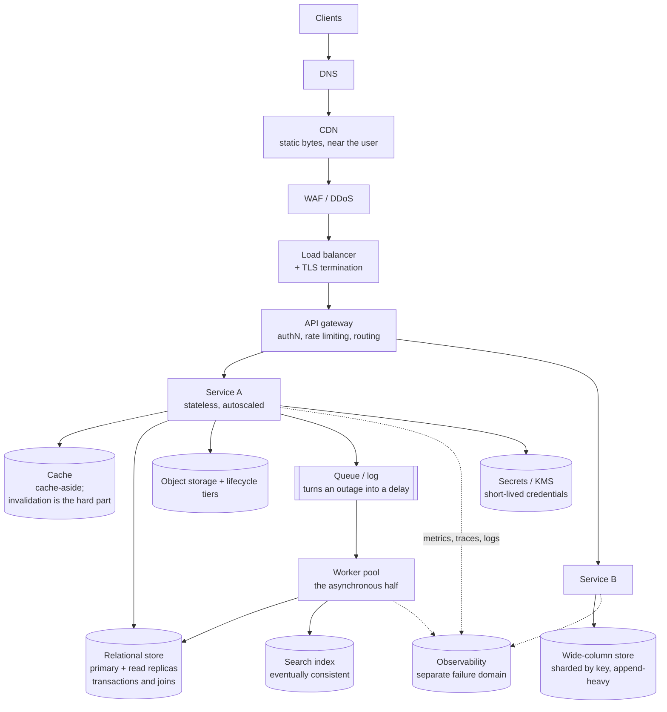

# Final revision, and the week before the interview

## 1. What this is, and why they ask it

**This is the one page.** Everything from a hundred and eighty days of system design, compressed into what you
would actually re-read the night before: **the two running orders, the numbers, and the trade-off pairs you
must be able to argue in both directions.**

**And it is the last thing in the course, so it ends where the interview does: with them asking whether you
have any questions.**

**That question is not the end of the interview. It is part of it.** **"No, I think you covered everything" is
a real negative signal** — it says you have not thought about whether you want this job, only about whether
they want you. **And it is entirely avoidable with two questions written down the night before.**

They ask it because **the questions you ask are the clearest evidence of what you think matters.** **Somebody
who asks about the on-call rota and what a typical week's paging looks like has operated something.** Somebody
who asks only about the technology stack has not, yet. **And the way the answers come back tells you as much
about the team as the answers themselves.**

**And because it is genuinely the last thing you control.** By that point the design rounds are decided.
**What is still open is whether you leave the room having also evaluated them** — which matters, because the
interview is a decision in two directions and most candidates only make one of them.

By the end of this lesson you have a single revision page for both design rounds, the numbers sheet, the
trade-off vocabulary in both directions, a plan for the design side of the last week, the questions to ask,
and what the answers to them actually mean.

---

## 2. The story

The flat was on the third floor and there was no lift, and Latha had decided she liked it before she reached
the top of the stairs.

Her mother had come with her, which Latha had agreed to reluctantly and was already regretting.

The owner showed them round. **Latha asked about the rent, and the deposit, and whether they were allowed to
paint the walls.**

**Her mother asked four questions, and not one of them was about the flat.**

**"How many hours does the water come?"**

**"Which floor does the pressure stop reaching, in April?"**

**"How long have the people below been here?"**

**"Why did the last tenants leave?"**

Latha was quietly mortified and looked at the balcony.

**But she noticed something on the way back down the stairs.**

**The owner had answered the first three easily and quickly.** He knew the water timings to the half hour, and
he knew which floors suffered in summer, **and he said both without having to think.**

**On the fourth he hesitated.** Only a little — half a second — **and then said the family had moved to
Hyderabad for work.**

Her mother said nothing about any of it in the auto home.

Then, over dinner: **"He was telling the truth about the water. He was not telling the whole truth about why
they left."**

Latha asked how she could possibly know that.

**"I do not know it. I noticed it. Those are different things, and noticing is what the questions are
actually for."**

And then the thing Latha repeated to her friends for years afterwards.

**"You think you ask questions to get information. Half of it is that."**

**"The other half is that the way a man answers a question about his own house tells you what it is like to
live in it."**

They took the flat. **The water was exactly as described.** And in the second year the people below turned out
to be precisely why the previous family had left — **which her mother had guessed and could not have proved,
and about which she was gracious enough to say nothing at all.**

---

## 3. The idea in plain English

**Latha's mother asks two kinds of question at once.** **One kind gets an answer. The other kind gets a
reaction** — and the reaction is often the more useful of the two.

**That is exactly the shape of the last five minutes of an interview.**

### The one page — round one, high level

```
   1  REQUIREMENTS  3-5 features IN, the rest explicitly OUT
                    scale · read:write · latency · availability
                    · CONSISTENCY · durability
   2  ESTIMATION    DAU -> actions -> /86,400 -> peak x2-3
                    -> bytes -> storage/year -> bandwidth
                    EVERY NUMBER FOLLOWED BY "SO..."
   3  INTERFACE     5-6 operations. Cursor pagination.
                    Idempotency keys on creates.
   4  DATA MODEL    entities, keys, ACCESS PATTERNS
                    -> then choose the store, with a reason
   5  ARCHITECTURE  draw it, then WALK the read path and the
                    write path out loud
   6  DEEP DIVE     offer three, let them pick. This is where
                    the signal is.

   CLOSE  monitoring & what pages · the SLO in minutes ·
          auth/authz & what you would not log · monthly cost ·
          what happens when each box dies ·
          ONE HONEST WEAKNESS OF YOUR OWN DESIGN
```

### The one page — round two, low level

```
   1  REQUIREMENTS  in VERBS. "add an expense", "settle up"
   2  ENTITIES      the nouns, and what each one KNOWS
   3  RELATIONSHIPS who holds whom; what owns whose lifetime;
                    the INVARIANT, enforced in the constructor
   4  INTERFACE     the public methods, with signatures
   5  THE HARD PART the thing that will CHANGE - and the
                    pattern that absorbs it
   6  EXTENSION     "now add X". A new class, or five edits?
                    THIS IS THE ROUND.

   AND: say which kind of round you are in, in the first
   minute. Running the wrong framework is the commonest
   failure in a back-to-back loop.
```

### The building blocks, in one list

**Every high-level design is assembled from about fifteen things. If you can say what each is for and what it
costs, you can build any of them.**

```
   LOAD BALANCER      spreads traffic; health checks; the
                      entry point for TLS
   CDN                puts bytes near users; the answer to
                      an egress bill
   CACHE              a copy nearer the reader; cache-aside
                      vs write-through; INVALIDATION is the
                      hard part
   QUEUE / LOG        decouples producer from consumer;
                      turns an outage into a delay
   OBJECT STORE       blobs. Never a database.
   RELATIONAL DB      transactions, joins, constraints
   WIDE-COLUMN        huge, append-only, read by one key
   SEARCH INDEX       free text; eventually consistent with
                      the source of truth
   REPLICA            read scaling and failover; replication
                      lag is the cost
   SHARD              write scaling; the shard key is the
                      decision you live with
   RATE LIMITER       protects everything behind it
   CIRCUIT BREAKER    stops a slow dependency becoming an
                      outage
   WORKER POOL        the asynchronous half of the system
   API GATEWAY        auth, limits, routing, one front door
   MONITORING         metrics detect · traces localise ·
                      logs diagnose
```

### The trade-off pairs

**You should be able to argue each of these in both directions, in about thirty seconds.** **That is what "and
now argue the opposite" is testing.**

```
   SQL              vs  NoSQL
   strong           vs  eventual consistency
   synchronous      vs  asynchronous
   normalise        vs  denormalise
   fan-out on write vs  fan-out on read
   cache-aside      vs  write-through
   monolith         vs  microservices
   stateful         vs  stateless services
   push             vs  pull
   commit capacity  vs  on-demand
```

**In every pair, the second option is not "the modern one".** **It is the one that is right under different
conditions**, and naming the condition is the answer. *"Eventual consistency, because a like count may be a
few seconds stale — but not for the payment, where I would take the coordination cost."*

### The design side of the last week

```
   -7   one full design mock, on the clock, out loud, scored
   -6   the two running orders, from memory
   -5   the numbers sheet - recite it cold
   -4   one design mock. Then re-read only what it exposed.
   -3   one high-level design out loud, end to end, with the
        closing checklist
   -2   recall cards only. No new case studies.
   -1   write your questions for THEM. Two, minimum.
    0   nothing technical
```

**Same rule as the coding side: nothing new after two days out.** **A case study first read on Friday is not a
case study you can design on Monday** — you will produce a half-remembered version of somebody else's answer,
which is worse than reasoning from the building blocks.

### The questions you ask them

**Four kinds, and each one tells you something different.**

```
   ABOUT THE WORK
     "What does the first ninety days look like?"
     -> is the work defined, or is defining it the job?

   ABOUT THE SYSTEM
     "What is the on-call rota, and how many pages does a
      typical week produce?"
     -> the single most informative question you can ask
        about engineering health

   ABOUT THE TEAM
     "What did you not expect before you joined?"
     -> gets a more honest answer than "what is the
        culture like"

   ABOUT YOU
     "What would make you say, in six months, that this
      hire had gone particularly well?"
     -> and it gives you the actual success criteria
```

**And listen the way Latha's mother listened.** **A hesitation on "how many pages a week" is information.** **A
specific answer — "about two, and one of them is usually the same flaky job" — is a healthy team describing a
real system.** **A vague one — "it's manageable" — is a different kind of answer, and you have learned
something either way.**

---

## 4. The picture

The whole syllabus as one reference architecture — every building block, in the place it belongs:



**If you can point at every box and say what it is for, what it costs, and what happens when it dies, you can
design any of the case studies** — because they are all this diagram with different boxes emphasised. **A feed
is heavy on the queue and the wide-column store. A video service is heavy on object storage and the CDN. A
payment system is heavy on the relational store and light on everything else.**

The night-before card, which is the whole course on one screen:

```
   +-------------------------------------------------------+
   |  THE TWO RUNNING ORDERS                               |
   |  HLD: requirements · estimation · interface ·          |
   |       data model · architecture · deep dive            |
   |  LLD: verbs · entities · relationships · interface ·   |
   |       the thing that changes · EXTENSION               |
   +-------------------------------------------------------+
   |  ALWAYS SAY                                            |
   |  - here is how I would like to use the time            |
   |  - these features in, these OUT                        |
   |  - "so..." after every number                          |
   |  - shall I go deeper here, or move on?                 |
   |  - one honest weakness of my own design                |
   +-------------------------------------------------------+
   |  THE NUMBERS                                           |
   |  1 day = 86,400 s (call it 100,000)                    |
   |  memory 100 ns · SSD 100 us · same-zone 0.5 ms ·        |
   |    cross-region 50-150 ms                              |
   |  1 machine ~10,000 req/s · Postgres ~5,000 writes/s ·   |
   |    Redis ~100,000 ops/s                                |
   |  row ~1 KB · photo ~2 MB · 1080p ~50 MB/min             |
   |  storage $0.023/GB-mo · EGRESS $0.09/GB ·               |
   |    cross-zone $0.01/GB EACH WAY                        |
   |  99.9% = 43 min/month · 99.99% = 4.3 · 99.999% = 26 s   |
   +-------------------------------------------------------+
   |  THE CLOSE                                             |
   |  monitoring · SLO in minutes · security · cost ·        |
   |  failure per box · one honest weakness                 |
   +-------------------------------------------------------+
   |  MY TWO QUESTIONS FOR THEM                             |
   |  1. ______________________________________________     |
   |  2. ______________________________________________     |
   +-------------------------------------------------------+
```

**The last box is deliberately blank.** **Fill it in the night before, in your own words, for that specific
company** — and having two written down means that "do you have any questions" is never the moment you go
quiet.

---

## 5. How it actually works

### How to revise a design track, since it is not like revising code

**You cannot practise system design by reading case studies.** **Reading one is pleasant and produces almost
no retrievable skill**, because the difficulty was never in knowing what a cache is — it is in producing a
running order under time pressure with somebody watching.

```
   LOW VALUE                    HIGH VALUE
   ---------                    ----------
   reading a case study         designing one OUT LOUD, timed,
                                  then reading the case study
   memorising an architecture   being able to say what each
                                  building block costs
   more case studies            the same case study a second
                                  time, a week later, from
                                  memory
   watching a video             recording yourself and
                                  listening back
```

**The single most effective exercise: pick a product, set forty-five minutes, and design it out loud with
nobody there.** **Then compare with a written-up version, and note only the things you did not think to ask.**

### The two running orders, and why they must be automatic

**Under pressure you will not invent a structure.** **You will do whatever you have done before** — which for
most candidates is "start drawing boxes", because that is the enjoyable part and the only part they have
practised.

**Say the opening sentence out loud enough times that it is automatic:**

> *"Before I draw anything — here is how I would like to use the time..."*

**Fifteen seconds, and it changes the whole round**, because from then on you are running it and they are
responding, rather than the other way round.

### Taking the round's notes

**Keep the requirements and the numbers visible for the whole round.** **Top-left corner, and do not rub them
out.** You will refer back to them constantly — *"we said a hundred-to-one read ratio, so..."* — **and so will
the interviewer.**

**And in a remote round, where the whiteboard is a shared document, say what you are doing while you scroll.**
*"I am going back up to the requirements for a second."* **Silence plus a moving cursor is confusing from the
other side.**

### The last five minutes

```
   1. state the closing checklist, unprompted
      monitoring · SLO · security · cost · failure ·
      one honest weakness

   2. ask your questions - the ones you wrote down

   3. LISTEN to how they are answered, not only to what
      the answers are

   4. thank them, and ask what the next step is and when
      -> a specific answer is a good sign; a vague one
         is information too
```

**And afterwards, within the hour: write down every question you were asked.** **The design questions
especially, because they are reused** — the same company will ask a very similar one at the next level.

### The offer conversation, briefly

**It is out of scope for this course and one thing is worth saying, because it is the same skill.**

**"What are your salary expectations?" is a question with a structure, exactly like a design question.**
**Deflect once — "I would rather understand the role first; what is the band for this level?" — and if pressed,
give a range you have researched rather than a number you hope for.** **The same principle as the design
round: gather information before committing to a position.**

### What to do when a round has clearly gone badly

**Finish it properly anyway.** **Loops are scored per round and the interviewers usually confer afterwards** —
a candidate who visibly gave up in round two is remembered differently from one who was struggling and stayed
constructive.

**And then do the reset from [day 179](../day-179-full-coding-mock/README.md).** **Stand up, one sentence, name
the next round.** **The damage from a bad round is almost never the round. It is the next two.**

---

## 6. The numbers

**This is the sheet. Recite it cold, five days out.**

**Time.**

```
   1 day    = 86,400 seconds       -> call it 100,000
   1 month  = 2.6 million seconds
   1 year   = 31.5 million seconds

   1 million/day    = ~12 per second
   1 billion/day    = ~12,000 per second
   100 million/day  = ~1,200 per second
```

**Latency.**

```
   memory read                100 ns
   SSD read                   100 microseconds   (1,000x memory)
   network, same zone         0.5 ms
   network, same region       1-2 ms
   network, cross-region      50-150 ms
   spinning disk seek         10 ms

   -> an in-process call is ~10 ns, so a network call is
      50,000-100,000x slower. That single ratio is the
      microservices argument.
```

**Throughput, order of magnitude.**

```
   one machine, simple HTTP        ~10,000 req/s
   one Postgres primary            ~5,000 writes/s
   one Redis instance              ~100,000 ops/s
   one Kafka partition             ~10 MB/s

   -> "700 writes a second against 5,000 for one primary,
      so I would not shard yet" is a real decision made
      in eight seconds.
```

**Sizes.**

```
   UUID                    16 bytes
   timestamp                8 bytes
   a short row           100 B - 1 KB
   a structured log line  ~300 bytes
   a thumbnail            ~200 KB
   a compressed photo       ~2 MB
   1 minute of 1080p       ~50 MB
```

**Availability.**

```
   99%        7 h 12 m per month
   99.9%      43.2 minutes
   99.95%     21.6 minutes
   99.99%     4.32 minutes
   99.999%    25.9 SECONDS

   in series:   0.999^8 = 99.2%  -> 5 h 44 m
   in parallel: two at 99% -> 99.99%

   -> IN SERIES YOU MULTIPLY AVAILABILITIES AND GET WORSE.
      IN PARALLEL YOU MULTIPLY FAILURE RATES AND GET BETTER.
```

**Money.**

```
   object storage        $0.023 per GB-month
   archive tier          $0.004 (instant) / $0.001 (deep)
   EGRESS to internet    $0.09 per GB       <- the surprise
   cross-zone            $0.01 per GB, EACH WAY
   a small machine       ~$0.10 per hour
   managed logs          ~$0.50 per GB ingested

   -> storing 30 TB for a month: $690
      sending it out once:       $2,700
      SERVING IS 4x MORE EXPENSIVE THAN STORING.
```

**A worked estimate, so the sheet has been used at least once.**

```
   100,000,000 DAU x 20 reads/day
     = 2,000,000,000 reads/day
     = 23,000 reads/second   (peak x3 = ~70,000)

   100,000,000 x 0.2 writes/day
     = 20,000,000 writes/day
     = 231 writes/second     (peak x3 = ~700)

   RATIO 100:1  -> read-optimised: cache hard, read
                   replicas before sharding, fan out on write

   700 peak writes vs ~5,000/s for one Postgres primary
     -> ONE primary. Do not shard.

   70,000 peak reads vs ~10,000 req/s per machine
     -> 7 machines, so 15-20 with headroom and redundancy
```

**And one last number, which is about the interview rather than the system.**

```
   A 45-MINUTE ROUND
     3   introductions
     5   requirements
     5   estimation
     4   interface
     5   data model
     9   architecture
     9   deep dive
     5   closing checklist and YOUR QUESTIONS
     ---
     45

   -> the last five minutes are on the plan. They are not
      spare time, and they are the only part of the round
      where you are the one asking.
```

---

## 7. The trade-offs

**The pairs, each argued both ways in a sentence. This is the vocabulary the whole design track was building
towards.**

**SQL or NoSQL.** **Relational when you need transactions, joins and constraints, and when the shape of the
data is stable** — which is most business data, and the default should be Postgres. **Wide-column when the
volume is enormous, the access is by one key, and the write rate exceeds what a single primary can take.**
**I would not use NoSQL to avoid designing a schema**; that is the most common wrong reason.

**Strong or eventual consistency.** **Strong where a disagreement is visible and harmful** — an account
balance, an inventory count for the last item, a payment. **Eventual where staleness is invisible or
tolerable** — a like count, a follower list, a search index. **The question to ask the interviewer is "what
does the user see during the gap?", and the answer is a product decision rather than a technical default.**

**Synchronous or asynchronous.** **Synchronous when the caller cannot proceed without the answer.**
**Asynchronous for everything else — and it is the single most effective way to stop availability
multiplying**, because a dependency being down becomes a delay rather than a failure. **The cost is eventual
consistency and a queue you now have to operate.**

**Normalise or denormalise.** **Normalise for correctness and for data that is written often.** **Denormalise
for reads, deliberately, when the join is the bottleneck** — and accept that you now have two copies that can
disagree, which needs an owner and an update path.

**Fan out on write or on read.** **On write when reads vastly outnumber writes**, so the expensive work is done
once. **On read when the fan-out is enormous** — the celebrity problem. **The real answer is usually the hybrid,
with a threshold you can change without a deploy.**

**Cache-aside or write-through.** **Cache-aside is simple and the cache can be stale on a write.**
**Write-through keeps them consistent and puts the cache on the write path, so a cache problem becomes a write
problem.** **I would use cache-aside with a short expiry by default, and only take write-through where
staleness is actually harmful.**

**Monolith or microservices.** **The deciding factor is the number of teams, not the size of the system.**
**One team: a monolith, and splitting is pure cost. Several teams blocked on one release train: extract along
team lines.** **And the modular monolith is the usual right answer in between.**

**Commit capacity or stay on demand.** **Commit to the baseline that has been running every hour for six
months — roughly 40% off.** **Never commit to the peak.** **And put anything interruptible on spot, for 70-90%
off, provided it can handle a two-minute termination notice.**

**And the meta-trade-off, which is the one worth ending on.** **Every one of those pairs has a right answer
only once you know the conditions**, and the conditions come from the requirements — which is why the running
order puts requirements first and why every number is followed by "so…". **A candidate who has memorised the
right-hand column of every pair has learned fashion. A candidate who asks what the read-to-write ratio is, and
then picks, has learned engineering.**

---

## 8. In the interview

### How it gets asked

- *"Do you have any questions for us?"* — always, and it is part of the interview.
- *"Is there anything you would like to know about the team?"* — the same question, softer.
- *"What are you looking for in your next role?"* — answer honestly; a mismatch helps both of you.
- *"Why are you leaving?"* — never criticise the current employer; say what you are moving towards.
- *"What are your salary expectations?"* — deflect once, then give a researched range.

### The first ninety seconds

On "do you have any questions for us":

> "**Yes — three, and I will keep them short.**
>
> **What does the first ninety days look like for whoever takes this role?** **I am asking because the answer
> tells me whether the work is already well defined or whether working out what the work is is the first job.**
> Both are fine and they are very different, and I would rather know which.
>
> **What is the on-call arrangement, and roughly how many pages does a typical week produce?** **Partly to know
> what I am signing up for, and partly because that number says a great deal about the health of the system.**
> **A team that pages twice a week has different problems from one that pages twice a quarter, and neither
> answer would put me off — I would just want to know which one I am joining.**
>
> **And what is something about working here that you did not expect before you joined?** **I find that gets a
> more honest answer than asking what the culture is like.**
>
> **If we have time, one more: what would make you say, in six months, that this hire had gone particularly
> well?**"

**And then listen to how they answer**, not only to what they say. **A specific answer to the paging question —
"about two a week, and one is usually the same flaky job we keep meaning to fix" — is a healthy team describing
a real system.** **A vague one is also an answer.**

### The follow-ups

**"What would you want to know about the system itself?"**

> "**Four things, and each one tells me something I could not learn from the outside.**
>
> **What is the deployment story — how long from merging a change to it being live, and how long to roll it
> back?** **The rollback number is the one I actually care about**, because a team that can go back in five
> minutes ships freely, and a team that takes an hour deploys rarely and therefore in large risky batches.
> **That single number tells me most of what daily life is like.**
>
> **What is the oldest part of the system that everybody is nervous about?** **Every system has one, so a
> denial is more worrying than an answer.** **And I would want to know whether there is a plan for it or
> whether it is simply avoided.**
>
> **What does the observability look like — if a user reports a slow request, how long does it take to find out
> which service was slow?** **If the answer is 'we look at the trace', that is a mature system. If it is 'we
> grep the logs on four machines', I know what my first six months would usefully contain.**
>
> **And how are architectural decisions actually made?** **One person, a design review, a written proposal?**
> **There is no wrong answer, but knowing it tells me how a disagreement would go**, and that matters more to
> me than the technology stack."

**"What would you want to know about the team?"**

> "**Things that are hard to fake, mostly.**
>
> **How long have the people on the team been here, and when did the last person leave and why?** **That is a
> version of Latha's mother's fourth question** — I am not expecting a scandal, and the way it is answered is
> as informative as the answer.
>
> **How does the team decide what to work on?** **Whether an engineer can say 'this needs three weeks of
> reliability work' and be heard is a real property of a team**, and it connects to something concrete: **if
> there is an error budget policy, is the feature freeze actually honoured, or is it overridden every time?**
>
> **What does a code review typically look like — how long, how many rounds, what gets blocked on?** **It tells
> me about standards and about how people talk to each other, at once.**
>
> **And what is the split between new work and maintaining what exists?** **Any honest answer is useful. A team
> that says 'ninety percent new features' is either very young or not telling me about the other forty
> percent.**"

**"Is there anything you would like to add?"**

> "**Two things, briefly.**
>
> **First, on the design round — I said the fan-out worker was the weakest part of my design, and I want to be
> clear that I would treat that as work rather than as a caveat.** **The concrete version is a queue-lag metric
> with an alert on it, because that failure has no user-facing symptom and would otherwise run for hours.**
> **I mention it because naming a weakness and not having a plan for it is only half an answer.**
>
> **Second, something you did not ask about that I think is relevant.** **The thing I have found hardest and
> most useful over the last year is getting better at saying where I am when I am stuck** — what I know, what
> is blocking me, and what I am about to try. **It sounds like a communication point and it is really an
> engineering one: it is what lets somebody else help, and it is how I found the last two problems I could not
> find alone.**
>
> **And thank you — this has been a genuinely interesting conversation, which I do not say about all of them.
> What is the next step, and when would you expect to know?**"

### The model answer

*"Do you have any questions for us?"*

> "**I do, and I have thought about which ones actually matter to me rather than which ones sound good — so
> some of these are quite practical.**
>
> **First, the work itself. What does the first ninety days look like for this role?** **I want to know whether
> the problem is defined and needs solving, or whether defining it is the job.** **I would be happy with
> either, and they are different jobs and I would rather know which one I am accepting.**
>
> **Second, the system. What is the time from merging a change to it being live — and more importantly, how
> long to roll one back?** **I ask about rollback specifically because that number decides everything
> downstream: a team that can go back in five minutes ships small changes often, and a team that takes an hour
> ships rarely and therefore in large batches, which is more dangerous.** **It is the single most informative
> number about daily engineering life.**
>
> **Third, on-call. What is the rota, and roughly how many pages does a typical week produce?** **Not because I
> am reluctant to be on call — I think you should operate what you build — but because that number is the best
> available measure of whether the system is healthy.** **And I would want to know whether pages are
> actionable, or whether people have started ignoring them, which is the failure mode that actually causes
> outages.**
>
> **Fourth, the team. What is something about working here that you did not expect before you joined?** **I ask
> that instead of asking about the culture, because it usually gets a real answer.**
>
> **And last, about me: what would make you say, in six months, that this hire had gone particularly well?**
> **Partly because I would like to know the actual criteria, and partly because if the answer surprises me,
> that is something we should both know now rather than in six months.**
>
> **I would also say — and this is the honest part — that I am trying to work out whether I want to work here,
> not only whether you want me.** **The design rounds today told you quite a lot about how I think. These
> questions are the part where I find out the same kind of thing about you** — and I think that is a fair
> trade, and probably better for both of us than my nodding politely and asking nothing.
>
> **Thank you. What is the next step, and when would you expect to know?**"

---

## 9. Recall card

**Two running orders, and say which round you are in within the first minute.** **HLD: requirements (3-5 in,
the rest explicitly OUT; scale, read:write, latency, availability, CONSISTENCY) · estimation (every number
followed by "so…") · interface · data model from ACCESS PATTERNS · architecture, then WALK both paths ·
deep dive, offered as a choice.** **LLD: verbs · entities · relationships and the invariant in the constructor
· interface · the thing that will CHANGE · EXTENSION, which is the round.** **Close both with monitoring, the
SLO in minutes, security, cost, failure per box, and ONE HONEST WEAKNESS OF YOUR OWN.**

**The numbers, cold.** 1 day ≈ 100,000 s. memory 100 ns · SSD 100 µs · same-zone 0.5 ms · cross-region
50-150 ms — **and an in-process call is ~10 ns, so a network hop is 50,000-100,000× slower.** One machine
~10,000 req/s · Postgres ~5,000 writes/s · Redis ~100,000 ops/s. Row ~1 KB · photo ~2 MB · 1080p ~50 MB/min.
**Storage $0.023/GB-mo · EGRESS $0.09/GB · cross-zone $0.01/GB EACH WAY — serving 30 TB costs 4× storing it.**
**99.9% = 43 min/month, 99.99% = 4.3, 99.999% = 26 seconds. In series you multiply availabilities and get
worse; in parallel you multiply failure rates and get better.**

**Ten trade-off pairs, argued BOTH ways in thirty seconds each** — SQL/NoSQL, strong/eventual, sync/async,
normalise/denormalise, fan-out on write/read, cache-aside/write-through, monolith/microservices,
stateful/stateless, push/pull, committed/on-demand. **The second option is never "the modern one" — it is right
under different conditions, and naming the condition IS the answer.**

**Revise design by DESIGNING, not reading.** Forty-five minutes, out loud, timed, alone — then compare, and
note only what you did not think to ask. **Nothing new after two days out**: a case study first read on Friday
becomes a half-remembered version of somebody else's answer, which is worse than reasoning from the building
blocks. **If you can say what each of the fifteen building blocks is for, what it costs, and what happens when
it dies, you can design any of them.**

**"Do you have any questions for us?" is part of the interview, and "no, you've covered everything" is a real
negative.** Ask about **the first ninety days** (is the work defined, or is defining it the job), **rollback
time** (the number that decides daily engineering life), **pages per week** (the best available measure of
system health), and **"what did you not expect before you joined?"** **Then listen the way Latha's mother
listened — the way an answer comes back tells you as much as the answer.** **Write down every question you
were asked within the hour**, and ask what the next step is and when.
